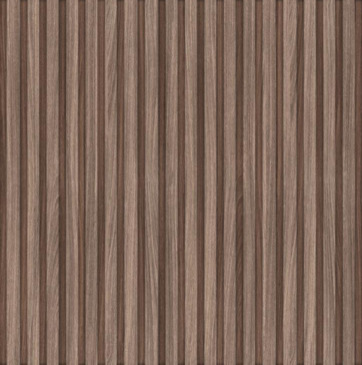
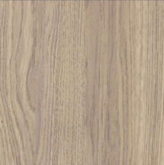
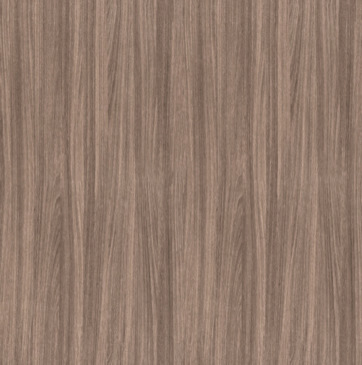

# F0.1 General Notes and Schedule - Aurora Food Store - DECOR PACKAGE R01

**Source**: `F0.1 General Notes and Schedule - Aurora Food Store - DECOR PACKAGE R01.pdf`  
**Pages**: 1  
**Extracted**: 2026-01-09 18:29:14

---

## Page 1

CONFIDENTIAL

APPROVAL
ISSUED
REVISION

0
. FIRST DRAFT
2024.07.22

2024.12.03

REGINA
SK

THIS DRAWING, AS AN INSTRUMENT OF SERVICE, IS 
PROVIDED BY AND IS THE PROPERTY OF THE GETREAL 
SERVICES. THE CONTRACTOR MUST VERIFY AND 
ACCEPT RESPONSIBILITY FOR ALL DIMENSIONS AND 
CONDITIONS ON SITE AND MUST NOTIFY THE GETREAL 
OF ANY VARIATIONS FROM THE SUPPLIED 
INFORMATION. THIS DRAWING IS NOT TO BE SCALED. 
GETREAL SERVICES IS NOT RESPONSIBLE FOR THE 
ACCURACY OF SURVEY, STRUCTURAL, MECHANICAL, 
ELECTRICAL AND OTHER CONSULTANT INFORMATION 
SHOWN ON THIS DRAWING. REFER TO THE 
APPROPRIATE CONSULTANT'S DRAWINGS BEFORE 
PROCEEDING WITH THE WORK. CONSTRUCTION MUST 
CONFORM TO ALL APPLICABLE CODES AND 
REQUIREMENTS OF AUTHORITIES HAVING 
JURISDICTION. THE CONTRACTOR WORKING FROM 
DRAWINGS NOT SPECIFICALLY MARKED "FOR 
CONSTRUCTION' MUST ASSUME FULL RESPONSIBILITY 
AND BEAR COSTS FOR ANY CORRECTIONS OR 
DAMAGES RESULTING FROM HIS WORK. 

FOOD STORE

JOB NUMBER:

AND SCHEDULES
AND SCHEDULES
AND SCHEDULES
AND SCHEDULES

DRAWN:
CHECKED:
APPROVED:

GENERAL NOTES
GENERAL NOTES
GENERAL NOTES
GENERAL NOTES

REV.
DESCRIPTION
DATE

DRAWING NUMBER:
REVISION NUMBER:

24058
2024.07.22

NN
PP
--

1
. UPDATE GENERAL NOTES TO
LATEST SOBEYS STANDARDS
. TRANSFERRED MATRIX CHART TO
SHEET F0.2
. UPDATE PL9, PL11 NOTES TO
INDICATE GRAIN DIRECTION.

Inc.

R1
R1
R1
R1
F0.1
F0.1
F0.1
F0.1

As indicated

SCALE:
DATE:

4980 TAHOE BLVD.
MISSISSAUGA, ON
L4V 0C7
(T) 905 238 7124
(F) 905 614 5416

AURORA

TIER 1

DRAWING:

PROJECT:

DECOR PACKAGE BASED ON 

FIXTURE LAYOUT FP_R00

DATED 2024.07.02

OLYMPIA TILE (PORCELAIN TILE)
COLOUR: DARK GREY
30x60cm PORCELAIN TILE - CODE:HV.LS.DGR.1224.MT;
GROUT:  FLEXTILE #1600 UPG NORTH SEA GREY. GROUT
THICKNESS: 1/4", 1/3, 2/3 TILE PATTERN - PARALLEL TO
THE ENTRANCE
NOTE: BARRIER FREE / UNIVERSAL / PUBLIC
WASHROOMS / EXIT PATHWAY/SHOPPING CART AREA

BENJAMIN MOORE
COLOUR: # 2132-10 BLACK
FINISH: SEMI-GLOSS, TO MATCH RAL 9004 SIGNAL BLACK
NOTE: FLORAL COOLER CEILING & INTERIOR WALLS,
INCLUDING SOLID COOLER DOOR AS APPLICABLE * * FOR
EXISTING COOLERS ONLY; NEW COOLERS TO BE
PRE-FINISHED BLACK ***INTERIOR ONLY***

MANNINGTON COMMERCIAL
COLOUR: GRAY 204
BURKE STAIRWAY SYSTEM- COLOUR SCAPE STAIR TREADS
& RISERS
1/8"ROUND PROFILE *COMES IN 3',4',5' & 6' LENGTHS
NOTE: STAIR TREADS

BENJAMIN MOORE (CLASSICS)
COLOUR: #1615 ROCK GREY
FINISH: EGGSHELL (WALL); FLAT (CEILING); SEMI-GLOSS
(DOORS)
NOTE: SALES AREA GENERAL WALLS & DOORS /
VESTIBULE / DECK COLOUR

SICO
COLOUR: #6222-42 MANTRA
*USE APPLICABLE PAINT TYPE FOR METAL
NOTE: EXISTING COOLER BOX DOORS - IN RENOVATIONS
TO MATCH PREP AREA TILE (TEMPO TAN)

ARMSTRONG (VINYL TILE)
COLOUR: #51861 SOFT WARM GRAY
12"x12" VINYL TILE - 1/8" THICK
STANDARD EXCELON IMPERIAL TEXTURE
NOTE: PHARMACY CONSULTATION ROOM, STORAGE AND
OFFICES, STAFF AREAS

BENJAMIN MOORE
COLOUR: HC-169 COVENTRY GRAY
FINISH: SEMI-GLOSS
*BM RECOMMENDS ULTRA SPEC HP DTM ACRYLIC SEMI-
GLOSS FP29 FOR METAL DOORS
NOTE: MAN DOOR FOR RENOS - BARRIER-FREE
WASHROOM (INSIDE) / OFFICE / STAFF ROOM

BENJAMIN MOORE (CLASSICS)
COLOUR: PM-1 SUPER WHITE
*TO MATCH RAL 9003
FINISH: EGGSHELL (WALL); FLAT (CEILING)
NOTE: SALES AREA INNER CEILING / PHARMACY PREP
AREA BACK WALL & PARALLEL WALL/ FROZEN LOWER
BULKHEAD / FRONT END / VESTIBULE

BENJAMIN MOORE
COLOUR: CC-80 GRAY MIST
FINISH: EGGSHELL
NOTE: WALL - OFFICE / PHARMACY OFFICE, STORAGE
AND CONSULTATION ROOM / STAFF AREA / STAFF
WASHROOM

BENJAMIN MOORE (CLASSICS)
COLOUR: #621 EUCALYPTUS
FINISH: EGGSHELL
NOTE: PHARMACY CUSTOMER/ STORE FACING WALLS

ASPECTA FIVE (LUXURY VINYL TILE)
COLOUR: CONTEMPORARY OAK NATURAL 5115106
4" x 36" LUXURY VINYL TILE - 3.2 mm THICK
NOTE: SALES FLOOR - PERIMETER

BENJAMIN MOORE (CLASSICS)
COLOUR: BONFIRE 2001-20
FINISH: EGGSHELL
*TO MATCH PMS 186
NOTE: VARIOUS SECTIONS - SALES FLOOR WALL /
VESTIBULE

4. 
ALL CUSTOMER FACING CONCRETE CRUBS TO BE FINISHED WITH
ELASTOMETRIC PAINT (PT7)
5. 
FINISH SCHEDULE BASED ON *** FINISHES PROVIDED BY CLIENT

CURECRETE DISTRIBUTION (SEALED CONCRETE)
ASHFORD FORMULA
DESCRIPTION: LIQUID CONCRETE SEALER; CLEAR,
ODORLESS, NON-TOXIC, NON-COMBUSTIBLE,
NON-FLAMMABLE, NO VOCs
NOTE: BACKROOM / RECEIVING AREAS

3.
HIGH TRAFFIC AREAS SUCH AS STAIR WALLS AND HALLWAYS TO

BENJAMIN MOORE (PREVIEW)
COLOUR: #2038-10 CELTIC GREEN
FINISH: EGGSHELL *TO MATCH PANTONE 342
NOTE: WALL - PRODUCE WALLS AND BULKHEADS

1.
ALL CEILINGS, BEAMS, DECK, JOISTS TO HAVE A MATTE FINISH.

HAVE A PLATINUM FINISH (DURABLE, WASHABLE, HIGH-HIDING

ALTRO (VINYL SAFETY FLOORING)
COLOUR: FOG D25153
SLIP RESISTANT SHEET VINYL SAFETY FLOORING
ALTRO RELIANCE 25
2.5mm WR81 AM81 LRV 27
NOTE: PREP AREA - ISLANDS IN THE SALES AREA

ASPECTA FIVE (LUXURY VINYL TILE)
COLOUR: MELBOURNE ELM - AUTUMN 5362108X
7.25"x 48" LUXURY VINYL TILE - 3.2mm THICK
NOTE: RACHELLE BERY

BENJAMIN MOORE
COLOUR: CC-30 OXFORD WHITE
FINISH: FLAT (CEILING)
NOTE: GYPSUM BOARD CEILINGS - OFFICE AND
WASHROOM BACKROOM AREA

ULTIMATE FLOORING SOLUTIONS (PVC)
COLOUR: BLACK
12" x 12" PVC
AREA OF COVERAGE 10' x 10'
NOTE: EXIT AND ENTRANCE VESTIBULE
(NOT APPLICABLE IF EXIT DOOR IS SEPARATED)

SEE ARCHITECTURAL SPECIFICATIONS FOR COMPLEMENTARY INFORMATION.

2.
ALL WALLS AND COLUMNS TO HAVE AN EGGSHELL FINISH.

BENJAMIN MOORE (CLASSICS)
COLOUR: #622 ALPINE TRAIN
FINISH: EGGSHELL
NOTE: PHARMACY PREP AREA SIDE WALLS

ARMSTRONG (VINYL TILE)
COLOUR: #51899 COOL WHITE
12"x12" VINYL TILE - 1/8" THICK
STANDARD EXCELON IMPERIAL TEXTURE
NOTE: SALES FLOOR - GROCERY

STONHARD (EPOXY FLOOR FINISH)
COLOUR: ASH
MEDIUM TEXTURE EPOXY FLOOR FINISH
STONSHIELD HRI
NOTE: PREP AREAS - PERIMETER
WALK-IN COOLERS

FLOOR FINISHES LEGEND

WALL FINISHES LEGEND

MAT TECH
COLOUR: GRAIN GREY
ERGO FLOOR SHEET
ANTI FATIGUE & ANTIMICROBIAL
NOTE: PHARMACY PREP AREA

HADRIAN
COLOUR: #545 CHARCOAL
POWDER COATED COLOUR
NOTE: WASHROOM PARTITIONS

BENJAMIN MOORE (CLASSICS)
COLOUR: #1616 STORMY SKY
FINISH: EGGSHELL
NOTE: DAIRY

PAINT MUST BE CATEGORY "ECOSOURCE"

PROFESSIONAL PAINT).

 ON JULY 10, 2024.

FINISHES:

NOTES:

PT10

PT11

PT12

PT18

PT1

PT2

PT3

PT4

PT5

PT6

PT7

PT8

PT9

FF15

FF12

FF11

FF10

FF8

FF6

FF5

FF4

FF3

FF2

FF1

FORMICA
COLOUR: 8906-58 DANISH MAPLE
MATTE FINISH (58)
*GRAIN TO RUN VERTICALLY WHEN INSTALLED ON
MILLWORK
*GRAIN TO RUN HORIZONTALLY ON TRELLIS & DATUM
(DIGITAL)
NOTE: MILLWORK FOR SEATING AREA & CONDIMENT
STAND / FOOD BANK BIN / CUSTOMER SERVICE DESK /
MOBILE FLORAL / PHARMACY INCLUDING PHARMACY
DADO WALL (VERTICAL), TRELLIS & DATUM (HORIZONTAL
- DIGITAL REPRODUCTION)

FORMICA
COLOUR: 929-58 OYSTER GRAY
MATTE FINISH
NOTE: PHARMACY PREP. AREA COUNTERTOP; PHARMACY
PUBLIC / CUSTOMER DROP-OFF & PICK UP COUNTERTOP
FOR RECLAD APPLICATIONS ONLY

OLYMPIA TILE 4" x 16" (10 X 40 CM) QT.CD.ARW.0416.MT;
PATTERN: STACKED (VERTICAL)
COLOUR: ARCTIC WHITE MATTE
GROUT COLOUR: FLEXTILE #1600 UPG NORTH SEA GREY
NOTE: ALL PREP AREAS & PUBLIC WASHROOMS /
GENERAL CONTRACTOR TO INSTALL MATCHING BASE
COVE TILE AT FLOOR. WASHROOMS - TILE TO BE
INSTALLED HORIZONTAL AS PER 4/F1.2

FORMICA
COLOUR: 8846-58 OILED LEGANO
MATTE FINISH
*GRAIN TO RUN VERTICALLY WITH ROW CUT FOR BAKERY
ONLY WHEN INSTALLED
NOTE: BAKERY CAKE ORDERING STATION MILLWORK
(VERTICAL GRAIN WITH ROW CUTS)

MARLITE (GLASSBOARD)
COLOUR: P100 WHITE
PEBBLED SURFACE w/ PVC TRIM MOLDING TO MATCH
COLOUR
NOTE: BACKROOM PREP AREA WALLS  (NOT VISIBLE FROM
SALES AREA) EXCEPT AT COOLER BOXES/ICE MELT ROOM

FORMICA
COLOUR: 5887-26 MILLENNIUM OAK
OILED WOOD FINISH
*GRAIN TO RUN HORIZONTALLY WHEN INSTALLED ON
BULKHEAD APPLICATIONS
*GRAIN TO RUN VERTICALLY WHEN INSTALLED ON WALL
AND MILLWORK APPLICATIONS
NOTE: BULKHEAD IN SEAFOOD & MEAT (HORIZONTAL
GRAIN), MILLWORK FOR WASHROOM VANITY / STAFF
KITCHEN & WASHROOMS SALES AREA MILLWORK FILLER /
SEAFOOD & MEAT / DRY AGED AS APPLICABLE BY
REFRIGERATION SUPPLIER  (VERTICAL GRAIN)

LG
COLOUR: LG HAUSYS HI-MACS W001 ICE QUEEN
COUNTERTOP
NOTE: CUSTOMER SERVICE / GMR ISLAND COUNTER TOP

FORMICA
COLOUR: 5887-26 MILLENNIUM OAK
OILED WOOD FINISH
*GRAIN TO RUN VERTICALLY WITH ROW CUT FINISHING
(REVEAL) WHEN INSTALLED
NOTE: MILLWORK FOR DELI & CHEESE / OUR KITCHEN /
HMR ISLANDS (VERTICAL GRAIN WITH ROW CUTS)

FORMICA
COLOUR: 8846-58 OILED LEGANO
MATTE FINISH
*GRAIN TO RUN HORIZONTALLY FOR BULKHEAD
APPLICATIONS WHEN INSTALLED
*GRAIN TO RUN VERTICALLY FOR WALL AND MILLWORK
APPLICATIONS WHEN INSTALLED
NOTE: BULKHEAD FOR DELI / CHEESE/ OUR KITCHEN
(HMR) (HORIZONTAL GRAIN), MILLWORK FOR FLORAL
COUNTER, FLORAL FILLERS, FLORAL STEPS (VERTICAL
GRAIN)

VINYL FLOOR TILE-WASHED CONCRETE- IRON -24X24IN
600X600MM
COLOUR: DESIGN ID: 21188
NOTE: STARBUCKS.
**GC PROVIDED; CONTACT: ALAN ROWELL at (478)
273-1046 OR
AROWELL@ASPECTAFLOORING.COM; ALLOW 1-2 WEEKS
LEAD TIME. INSTALL IN STACK PATTERN.

STAINLESS STEEL
COLOUR: #04 BRUSHED
NOTE: CONDIMENT MILLWORK / RX COMPOUNDING/
FLORAL PREP COUNTERTOP

FORMICA
COLOUR: 8907-NG FOX TEAKWOOD
NATURAL GRAIN *GRAIN TO RUN VERTICALLY WHEN
INSTALLED
NOTE: DADO WALL / ENTRANCE & EXIT VESTIBULE /
GENERAL FRONT END / STAFF HALLWAY

JOHNSONITE (RUBBER COVE BASE)
COLOUR: CB-40 BLACK
6" RUBBER COVE BASE
NOTE: 6" HIGH AT ALL EXPOSED AREAS (4" HIGH AT
MILLWORK)

METAL/ALUMINUM
COLOUR: RAL 7016 - ANTHRACITE
FOR RENOVATIONS:
BENJAMIN MOORE COLOUR MATCH (NON-POWDER
COATED APPLICATIONS)
IS2131-20 MIDNIGHT
NOTE: FASICA FOR REFRIGERATED CASES

FORMICA
COLOUR: 837-58 GRAPHITE
NOTE: OFFICE AND STAFF ROOM COUNTERTOP

FORMICA
COLOUR: 6925-26 MAPLE WOODLINE
OILED WOOD FINISH (26)
GRAIN TO RUN VERTICALLY WHEN INSTALLED
ALTERNATE MELAMINE:
UNIBOARD 206 CHERRY CREMA
NOTE: PRODUCE

FORMICA
COLOUR: 9312-58 PLANKED URBAN OAK
MATTE FINISH - VERTICAL GRAIN - MILLWORK
GRAIN TO RUN VERTICALLY WHEN INSTALLED
NOTE: OFFICE & STAFF ROOM MILLWORK

UNIBOARD
COLOUR: 920 NEW ENGLAND ALMOND
NOTE: BABY BOUTIQUE FILLERS & MILLWORK

SIGNAGE NOTES
MILLWORK FINISHES LEGEND

UNLESS NOTED OTHERWISE, USE GROUT W/O SAND AND 1/8" 

METAL
COLOUR: RAL 9003 - SIGNAL WHITE
NOTE: PHARMACY

FORMICA
COLOUR: 3690-58 BASALT SLATE
NOTE: KITCHEN PREP AREA

WALL FINISHES LEGEND

STARBUCKS FLOORING

CORIAN
COLOUR: CLAM SHELL
PER SELECTED VENDOR
NOTE: BULK SCALE MILLWORK

WILSONART (SOLID SURFACE)
COLOUR: 9101GS OATMEAL
COUNTERTOP
NOTE: WINE, PHARMACY

METAL
COLOUR: RAL 9004 - BLACK
NOTE: PRODUCE TABLE BASE

JOINTS FOR WALL CERAMIC INSTALLATION

GROUT FOR CERAMIC:

MT3

MT2

MT1

PL14

PL13

PL10

PL11

PL12

PL7

PL6

PL5

PL3

PL2

PL1

FRP1

SS4

SS3

SS2

SS1

WT1

PL9

RB1

S1

a.
CONSTRUCTION 7X7, 1/16 DIAMETER, BREAKING STRENGTH 480LBS. REFER
TO BEN-MOR MODEL #11677G.

3.
SUSPENSION SYSTEM: ARMSTRONG PRELUDE XL 15/16", COLOUR: BLIZZARD WHITE

DECOR CLOUD CEILING FEATURES: BASED ON ARMSTRONG CEILING FORMATIONS SYSTEM. 

4.
CABLE ENDS SHOULD BE FINISHED TO FORM A LOOP USING 2 ALUMINUM DUPLEX
CRIMPED METAL SLEEVES AS SHOWN.

b.
CONSTRUCTION 7X19, 1/8 DIAMETER, BREAKING STRENGTH 2,000 LBS.
REFER TO BEN-MOR MODEL #018719G.

4.
EDGE TRIM: ARMSTRONG 4" AXIOM CLASSIC, AX2CUR, COLOUR: BLIZZARD WHITE

1.
ALL PLYWOOD PANELS TO BE INSTALLED ON WALL SHOULD BE NAILED USING
18 GAUGE FINISHING NAILS AND GLUED AT THE BACK WITH SILICONE.

1.
SUSPENDED CLOUD SIZE: VARIES - SEE REFLECTED CEILING FOR REFERENCE.

2.
CEILING TILES: ARMSTRONG 24"x24"x1" LYRA PB, #8372PB, COLOUR: WHITE

 *** USE 1/16 CABLE FOR ALL STRUCTURES UNLESS NOTED OTHERWISE. ***

ARMSTRONG
COLOUR: WHITE (WH) EDGE: ANGLED TEGULAR 15/16
CORTEGA SECOND LOOK- 2767
ACOUSTICAL CEILING STANDARD LAY-IN TILE
PATTERN: II   SIZE: 24"X 48"x 3/4"
GRID: 15/16" PRELUDE
NOTE: PHARMACY, OFFICES, STAFF AREAS & PUBLIC
WASHROOMS *SALES AREA WITH LOWER CEILING HEIGHTS
ONLY

2.
ENSURE THAT THERE IS NOTHING OVERHEAD TO OBSTRUCT THE CABLES
PATH (EX. DUCTS). IF THERE IS AN OBSTRUCTION, ANCHOR TWO
CABLES EITHER SIDE OF THE OBSTRUCTION THAT WILL JOIN TO A
SINGLE CABLE BENEATH THE OBSTRUCTION, MAKING A “Y” SHAPE AS
SHOWN:

1.
POSITION OF THE STRUCTURE IS DETERMINED BY THE DECOR DRAWINGS
AND VERIFIED ON-SITE.

a.
Q-DECK CLIPS MODEL QD-14 RATED TO 226 LBS EACH AT 20-30
SUSPENSION POINTS. SEE TDM SHOP DRAWINGS

ARMSTRONG
COLOUR: WHITE (WH) EDGE: ANGLED TEGULAR 15/16
CORTEGA- 816
ACOUSTICAL CEILING STANDARD LAY-IN TILE
SIZE: 24"X 24"x 5/8"
GRID: 15/16" PRELUDE
NOTE: SMALL SPACES OPEN TO PUBLIC

CERTAINTEED SAINT-GOBAIN
COLOUR: WHITE CRF
VINYLROCK
ACOUSTICAL CEILING HYGIENIC LAY-IN TILE
24"X 24"X 1/2" (1142-CRF-1)
GRID: CORRESPONDING 15/16 CLASSIC STAB SYSTEM
*WASHABLE
NOTE: SMALL PREP AREAS

a.
FOR 1/16 CABLE: REFER TO BEN-MOR MODEL #ADF 1/16 ”

CERTAIN TEED SAINT-GOBAIN
COLOUR: WHITE CRF
VINYLROCK
ACOUSTICAL CEILING HYGIENIC LAY-IN TILE
24"X 48" X 1/2"(1140-CRF-1)
GRID: CORRESPONDING 15/16 CLASSIC STAB SYTEM
*WASHABLE
NOTE: KITCHEN/ PREP AREAS

5.
THE CABLE ARE ATTACHED TO THE DECK USING THE FOLLOWING:

DECOR CLOUD CEILING SPECIFICATIONS

GENERAL TRELLIS INSTALLATION GUIDE

b.
FOR 1/8 CABLE: REFER TO BEN-MOR MODEL #AOS-018

3.
CABLE SHOULD BE GALVANIZED AIRCRAFT CABLE EITHER:

CEILING FINISHES LEGEND

STRUCTURES:

PLYWOOD: 

ACT1

ACT2

ACT3

ACT4

1.
GENERAL CONTRACTOR TO SUPPLY AND INSTALL A 6'-0" HIGH

8.
GENERAL CONTRACTOR TO SUPPLY AND INSTALL A 6'-0" HIGH

STAINLESS STEEL CORNER GUARD ON ALL EXPOSED CORNERS

4.
GENERAL CONTRACTOR TO RECEIVE AND INSTALL STAINLESS

7.
GENERAL CONTRACTOR TO RECEIVE AND INSTALL STAINLESS

PROJECT MANAGER IF SIGNS CAN BE SUSPENDED FROM THE

STEEL VESTIBULE DOOR PROTECTION PROVIDED BY SOBEYS.

3.
GENERAL CONTRACTOR TO SUPPLY AND INSTALL STAINLESS

OR ROMANS 880 WALLPAPER ADHESIVE. WALL SURFACE TO

STAINLESS STEEL GUARD ON ALL EXPOSED COLUMNS IN THE

7.
SIGNS THAT ARE TO BE SUSPENDED FROM THE ROOF DECK

5.
ALL KNEE WALLS TO RECEIVE A STAINLESS STEEL CAP.  SEE

4.
ALL WALL GRAPHICS TO BE APPLIED USING SHUR STIK 111

CONTRACTOR TO PROVIDE TERMINATION POINTS FOR ALL

PROTECTORS PROVIDED BY SOBEYS. (SEE FIXTURE LAYOUT

WHERE REQUIRED. DO NOT SUSPENDED FROM DUCTWORK

WILLIAMS MULTI-PURPOSE PRIMER, BLUE OR PINK LABEL.

INTERMEDIATE FRAMES BETWEEN STRUCTURAL MEMBERS

3.
WHEREVER POSSIBLE SUSPEND SIGNS FROM STRUCTURAL

GRAPHIC PANELS, AISLE DIRECTORIES, SUSPENDED SIGNS

GENERAL CONTRACTOR TO CONFIRM ALL WEIGHTS WITH

9.
ALL VINYL LETTERING IS SELF-ADHESIVE AND SHOULD BE

FILL AND SAND ANY HOLES. PRIME WALL WITH SHERWIN

8.
ALL VINYL VISUALS ARE SELF-ADHESIVE AND SHOULD BE

6.
GENERAL CONTRACTOR TO CONFIRM WITH THE SOBEYS

ETC.) IS TO BE SUPPLIED BY SOBEYS AND INSTALLED BY

AND MATRIX CHART FOR SIGNAGE SPECIFICATIONS AND

BE PREPARED AS PER MANUFACTURES SPECIFICATIONS,

21.
GENERAL CONTRACTOR TO SUPPLY AND INSTALL SLAT

ILLUMINATED SIGNAGE. SEE DECOR DRAWING PACKAGE

STAINLESS STEEL GUARD ON ALL EXPOSED COLUMNS TO

WALL PANELS AS INDICATED ON THE MILLWORK PLAN.

PAINTED WHITE  AND FOUR (4) 6'-0" HIGH STANDARDS

CORK BOARD AND TRIM ABOVE THE COUNTERS IN THE

6.
GENERAL CONTRACTOR TO RECEIVE AND INSTALL CASE

2.
GENERAL CONTRACTOR TO SUPPLY AIR CRAFT CABLE.

AND CASE TO WALL FILLERS AT REFRIGERATED CASES

ARE TO BE INSTALLED USING HANGERS OR A HANGING

10.
GENERAL CONTRACTOR TO SUPPLY AND INSTALL ALL

11.
GENERAL CONTRACTOR TO SUPPLY AND INSTALL ALL

12.
GENERAL CONTRACTOR TO SUPPLY AND INSTALL ALL

13.
GENERAL CONTRACTOR TO SUPPLY AND INSTALL ALL

19.
GENERAL CONTRACTOR TO SUPPLY AND INSTALL ALL

AND/ OR ACCESSORIES ARE TO BE REINFORCED WITH

WALL) c/w BUMPER TO 4'-0" A.F.F. AT ALL AREAS OF

OF WALLS, COOLERS AND FREEZER BOXES LOCATED IN

17.
SHELVING TO BE CUT AND BRACE AROUND COLUMNS

5.
GRAPHICS TO BE CLEAN AND FREE OF FINGERPRINTS,

1.
ALL INTERIOR SIGNAGE (INCLUDING WALL GRAPHICS,

SYSTEM RATED TO CARRY THE WEIGHT OF THE SIGN.

WHERE INDICATED WITH A CURVE, SLAT WALL IS TO

7.
ALL MILLWORK TO BE CONSTRUCTED OF 3/4" THICK

BULF FOOD AND BAKERY SHELVING. (SEE MILLWORK

18.
GENERAL CONTRACTOR TO SUPPLY AND INSTALL LL

•
BAKERY DISPLAY TABLES AND SALES FLOOR

1.
FIXTURES AND EQUIPMENT ARE SHOWN DOTTED ON

4.
PARTITIONS WHICH SUPPORT FIXTURES, MILLWORK

(SEE FIXTURE LAYOUT AND CONSTRUCTION DETAILS)

5.
SEE THE MILLWOK PLAN AND FIXTURE LAYOUT FOR

16.
GENERAL CONTRACTOR TO SUPPLY AND INSTALL A

FASCIA AND “J” MOLD ON CASES, WALL SHELVING,

SOBEYS SIGNAGE CONTRACTOR TO SUPPLY ALL EYE

MISCELLANEOUS CABLE ROLL HOLDERS AND WOOD

CORNER FILLERS, GAP FILLERS, RAT HOLE COVERS

DIMENSIONS PRIOR TO FABRICATION AND PROVIDE

•
FLORAL PEDESTAL, TOWERS AND TABLES.

LAMINATE WINDOW SILS AT STORE FRONT UNDER

15.
THE FOLLOWING MILLWORK IS TO BE SUPPLIED BY

MANAGERS FOR REVIEW AND APPROVAL PRIOR TO

STEEL PREP SINKS, HAND SINK, AND PREP TABLE AS

SHOP DRAWINGS AND HARDWARE TO SOBEYS FOR

AS REQUIRED. COLUMNS TO BE WRAPPED IN MDF,

STAINLESS STEEL SHELVES IN THE PRODUCE PREP

DECOR DRAWING PACKAGE FOR SPECIFICATIONS

2.
GENERAL CONTRACTOR TO SUPPLY AND INSTALL A

EXPOSED GYPSUM IN THE SALES AREA INCLUDING

14.
GENERAL CONTRACTOR TO SUPPLY AND INSTALL

15.
GENERAL CONTRACTOR TO SUPPLY AND INSTALL

UNDERSIDE OF SUSPENDED CEILING SYSTEM IN ALL

PLASTIC LAMINATE FINISHED WALL PANEL (DADO

STAINED ON ALL EXPOSED SIDES AND EDGES. SEE

STEEL DOOR FRAME WRAPS AT NEW IMPACT DOOR

FINISHED MATERIAL UNLESS NOTED OTHERWISE.

WOOD STUDS, BLOCKING AND/ OR PLYWOOD AS

2.
ALL MILLWORK TO BE CONSTRUCTED PER THE F

STEEL MEMBERS (BEAMS, JOISTS ETC.). PROVIDE

INSTALLED ACCORDING TO THE DÉCOR DETAILS.

INSTALLED ACCORDING TO THE DÉCOR DETAILS.

CONFIRMED ON SITE PRIOR TO CONSTRUCTION.

BELOW THE WINDOW SILL. (SEE THE MILLWORK

PANELS, ETC.) TO BE SUPPLIED AND INSTALLED

OVERALL SIZE, AMOUNT AND LOCATION OF ALL

DETAIL DRAWINGS. ALL SHOP DRAWINGS TO BE

MILLWORK COUNTERS AND UPPER CABINETS AS

3.
ALL DIMENSIONS ON THIS DRAWING HAVE BEEN

AS PART OF THIS REMODEL. ALL FILLERS TO BE

ROUNDED TO THE NEAREST 1/8" FOR CLARITY.

20.
ALL INTERIOR WOODEN ELEMENTS (INCLUDING

6.
ALL HARDWARE TO BE SUPPLIED BY MILLWORK

INDICATED ON THE FIXTURE LAYOUT. PROVIDED

ELEMENTS TO BE ¾” BIRCH VENEER PLYWOOD

REQUIRED TO PROVIDE REGID SUPPORT AND A

SUBMITTED TO SOBEYS PROJECT AND DESIGN

SOBEYS UNLESS OTHERWISE NOTED. GENERAL

9.
ALL KICK PLATES TO BE RUBBER COVE BASE.

CONSTRUCTION. ALL MEASUREMENTS TO BE

FILLERS AND GABLES AT BAKERY SHELVING,

•
PRODUCE DIPLAY BINS AND TABLES

PREP. AREAS. (SEE CONSTRUCTION DETAILS)

SMUDGES, DIRT ETC. AFTER INSTALLATION.

8.
MILLWORK CONTRACTOR TO CONFIRM ALL

COMMERCIAL BREAD AND DELI PREP AREA.

SOBEYS AND INSTALLED BY THE GENERAL 

STRIPS  HOOKS FOR CLIPBOARDS IN EACH

STAINLESS STEEL NOTES

BY THE GENERAL CONTRACTOR. WOOD

•
BULK FOOD DISPLAY FIXTURES

INDICATED ON THE MILLWORK PLAN.

THISLAYOUT. SEE FIXTURE LAYOUT.

BE SEGMENTED ALONG THE CURVE.

MILLWORK NOTES

•
GROCERY DISPLAY TABLES

STORAGE AND PREPARATION AREAS.

VERIFIED BY PROJECT MANAGER.

SALES AREA. (SEE CONSTRUCTION

TO BE INSTALLED WITH CLIPS.

OR ELECTRICAL COMPONENTS.

AREA FOR SUPPLY STORAGE.

AND CONSTRUCTION DETAILS)

DEPARTMENT PREP AREAS.

REVIEW AND APPROVAL.

THE SIGN CONTRACTOR.

(CABFM STORES ONLY)

FASTENING SURFACE.

PLAN FOR LOCATIONS.

FIXTURES

DETAIL BOOKLET)

CONTRACTOR.

CONTRACTOR:

THE GLAZING.

AND DETAILS.

ROOF DECK.

MILLWORK.

LOCATIONS.

BOOKLET)

BY SOBEYS.

OFFICES.

DETAILS.

DETAILS)

BOLTS.

10.
ALL OUTSIDE CORNERS AND TRANSITIONS BETWEEN CERAMIC TILE AND

13.
LAMINATE 1/2" GYPSUM WALL BOARD ON ALL COOLER PANELS WHERE

TO THE TOP OF WALL ADJACENT TO ALL SINKS AND DISHWASHERS IN

RESISTANT GYPSUM WALL BOARD TO THE UNDERSIDE OF THE CEILING

ACCESSORIES ARE TO BE REINFORCED WITH WOOD STUDS, BLOCKING

APPROVED PRIOR TO PURCHASE AND INSTALLATION. NO ALTERNATES

1.
FIXTURES AND EQUIPMENT ARE SHOWN AS SOLID GREY LINEWORK ON

IN THE SEAFOOD AND MEAT PREP AREAS, TO 4'-0" A.F.F. IN PRODUCE

8.
ALL SURFACES THAT ARE TO RECEIVE A PAINT FINISH ARE TO HAVE A

PAINTED WALLS OR SUSPENDED T-BAR SYSTEM TO BE TRIMMED WITH

PROJECT AND DESIGN MANAGER. PAINT DRAWS ARE REQUIRED FROM

11.
SUBSTITUTE GYPSUM WALL BOARD WITH WATER RESISTANT GYPSUM

AND/ OR PLYWOOD AS REQUIRED TO PROVIDE RIGID SUPPORT AND A

DOORS, WINDOWS AND FRAMES WILL BE PAINTED THE SAME COLOUR

5.
ALL FLOORING IS TO BE INSTALLED AS PER FLOOR MANUFACTURER'S

AND MEAT PREP AREAS, TO 4'-0" A.F.F. IN PRODUCE PREP AREA AND

ARE PERMITTED WITHOUT THE WRITTEN APPROVAL OF THE SOBEYS

PREP AREA AND TO THE TOP OF WALL ADJACENT TO ALL SINKS AND

4.
INSTALL RUBBER BASE WHERE NEW V.C.T. FLOORING IS INSTALLED.

TILE IS INSTALLED. SUBSTITUTE GYPSUM WALL BOARD WITH WATER

4.
BEFORE PAINTING, COORDINATE PAINT COLOUR TRANSITIONS WITH

13.
IF REQUIRED GENERAL CONTRACTOR TO SUPPLY AND INSTALL T-5
LIGHTING THROUGH OUT THE STORE. LIGHTING IS TO BE
PURCHASED FROM SOBEYS PREFERRED VENDOR AND TIED INTO THE
ENERGY MANAGEMENT SYSTEM ON A 50/50 BASIS. THE WINNING
ELECTRICAL CONTRACTOR SHALL APPLY FOR THE ERIP GRANT ON
SOBEYS BEHALF.

SUBMITTED TO THE PROJECT MANAGER AND DESIGN MANAGER AND

3.
THIS DECOR DRAWING ILLUSTRATES THE LOCATION OF THE DECOR
LIGHTING ONLY. GENERAL CONTRACTOR TO REFER TO THE
CONSULTANT DRAWING PACKAGE FOR ALL OTHER LIGHTING
AND MODIFICATIONS TO THE REFLECTED CEILING SYSTEM IN THE
SALES AREA. (INCLUDING SPRINKLER SYSTEM, EMERGENCY
LIGHTING, EXIT SIGNS AND THE FIRE ALARM SYSTEM)

8.
ELECTRICAL CONTRACTOR IS TO SUBMIT SHOP DRAWINGS FOR ALL
LIGHTING FIXTURES TO THE PROJECT MANAGER FOR APPROVAL,
TWO (2) WEEKS PRIOR TO CONSTRUCTION START.

16.
THE DESIGN DOES NOT INCLUDE FOR ANY LOADING IMPOSED BY
LIGHT FIXTURES, RETRACTABLE GRILLES, PLUMBING, MECHANICAL
SYSTEMS, ELECTRICAL SYSTEMS, SPRINKLERS OR SUSPENDED
BULKHEADS ON THE EXISTING STRUCTURE ABOVE. GENERAL
CONTRACTOR IS RESPONSIBLE FOR VERIFYING THE STRUCTURE IS
ADEQUATE FOR SUPPORT.

RESISTANT GYPSUM WALL BOARD WHERE WALL TILE IS INSTALLED.

9.
GENERAL CONTRACTOR TO COMPLETE ALL PREP AND PAINTING OF

WALL BOARD TO THE UNDERSIDE OF THE CEILING IN THE SEAFOOD

9.
GENERAL CONTRACTOR TO INSTALL ALL FINISHED GYPSUM BOARD
CEILING SYSTEM SUPPORTED BY PRE-ENGINERED SUSPENSION 
SYSTEM HUNG FROM THE STRUCTURE ABOVE.

INTERIOR WALLS INCLUDING BULKHEADS AND ALL HOLLOW METAL

15.
MECHANICAL CONTRACTOR SHALL CARRY THE PRICE OF FRESHER
SOURCE ENERGY SOLUTIONS INC. TO COMPLETE A THIRD PARTY
AIR BALANCING REPORT. THE REPORT IS TO BE PROVIDED TO THE
PROJECT MANAGER UPON COMPLETION.

9.
VCT FLOOR TILE TO BE INSTALLED USING FLEXTECH 710 PREMIUM

1.
FIXTURES AND EQUIPMENT ARE SHOWN AS SOLID GREY LINEWORK
ON THIS LAYOUT. SEE FIXTURE LAYOUT.

4.
ALL EMERGENCY AND EXIT LIGHTING ARE NOT INCLUDED AS PART
OF THIS SUBMISSION AND ARE TO BE COMPLETED AT TIME OF
TENANT FIT OUT UNDER A SEPARATE PERMIT.

1.
FIXTURES AND EQUIPMENT ARE SHOWN AS SOLID GREY LINEWORK

SUBMITTED TO THE PROJECT MANAGER AND APPROVED PRIOR TO

2.
ALL DIMENSIONS ON THIS DRAWING HAVE BEEN ROUNDED TO THE
NEAREST 1/8" FOR CLARITY.

2.
ALL DIMENSIONS ON THIS DRAWING HAVE BEEN ROUNDED TO THE

2.
ALL DIMENSIONS ON THIS DRAWING HAVE BEEN ROUNDED TO THE

11.
THIS DRAWING IS TO BE USED AS A DESIGN GUIDELINE
ONLY. FINAL LIGHTING PLACEMENT, CORRECT LIGHTING LEVELS
AND SPECIFICATIONS ARE TO BE CONFIRMED BY AN ELECTRICAL
CONSULTANT. LIGHTING DESIGN TO CONFORM TO THE
BUILDING CODE AREA OF JURISDICTION.

3.
MATERIAL SAMPLES AND PAINT DRAWS OF ALL FINISHES MUST BE

6.
MATERIAL SAMPLES AND PAINT DRAWS OF ALL FINISHES MUST BE

PURCHASE AND INSTALLATION. NO ALTERNATES ARE PERMITTED

7.
ALL NEW AND EXISTING INTERIOR HOLLOW METAL AND WOODEN

6.
T-BAR WIRE HANGERS ARE NOT TO BE LIGHTER THAN 12 GAUGE
GALVANIZED WIRE ROD.

WITHOUT THE WRITTEN APPROVAL OF THE PROJECT MANAGER.

14.
GENERAL CONTRACTOR TO SUPPLY AND INSTALL A 4'-0" HIGH
WALL CONSTRUCTED OF 35 8" STEEL STUDS AND CHICKEN WIRE
FENCE ON ONE SIDE. PROVIDE ONE GATE PER RUN. WALL TO BE
BUILT ABOVE NEW AND EXISTING WALK IN BOXES

5.
PAINT COLOUR OF BULKHEADS TO CONTINUE TO UNDERSIDE OF

10.
ALL METAL STAIR RAILS AND METAL STAIR RISERS TO RECEIVE A

8.
CALCULATE 3% RESERVE FOR ALL DIFFERENT TILES AND V.C.T.

12.
SUBSTITUTE BOTTOM 4'-0" GYPSUM WALL BOARD WITH WATER

17.
WIRE HANGERS AND OTHER SUSPENDED FIXTURES ARE NOT
PERMITTED TO BE HUNG FROM THE STEEL ROOF DECK UNLESS
OTHERWISE APPROVED BY THE STEEL DECK
SUPPLIER/MANUFACTURER AND THE PROJECT ENGINEER.

18.
GENERAL CONTRACTOR TO PAINT U/S DECK, ALL EXPOSED
STRUCTURAL STEEL, DUCTWORK, PLUMBING, REFRIGERATION
LINES AND ELECTRICAL. (SEE SOBEYS PAINT SCHEDULE)

12.
INCLUDE IN YOUR TENDER TO RUN CONDUIT AND OR WIRING
NECESSARY TO INSTALL LIGHTING AND CONTROL WIRING FOR
THE ENERGY MANAGEMENT SYSTEM IF THE EXISTING
CONDITION IS BX CABLE, RUN WITHIN THE DECK FLUTES.

AS THE WALL ON WHICH THEY ARE INSTALLED UNLESS NOTED

PAINTED FINISH. GENERAL CONTRACTOR TO ENSURE PAINT IS

7.
T-BAR GRID SYSTEM TO CONSIST OF A NOMINAL 24"x48" GRID
PATTERN. (SEE REFLECTED CEILING PLAN FOR LOCATION).

5.
GENERAL CONTRACTOR TO INSTALL ALL DUCTWORK AS PER
MECHANICAL DRAWINGS.

3.
PARTITIONS WHICH SUPPORT FIXTURES, MILLWORK AND/OR

10.
GENERAL CONTRACTOR IS TO SUPPLY THE OWNER WITH A
BALANCING REPORT AT THE END OF CONSTRUCTION.

6.
SEAL ALL CONCRETE FLOOR AREAS THAT DO NOT RECEIVE

7.
ALL FLOORING IS TO BE INSTALLED AS PER PATTERNS AND

CONTRACTOR AND ARE TO BE OF A PROFESSIONAL KIND.

PAINT DRAWS ARE REQUIRED FROM THE PAINTING SUB-

THE PAINTING SUB-CONTRACTOR AND ARE TO BE OF A

MINIMUM ONE COAT PRIMER AND TWO COATS PAINT.

REFLECTED CEILING PLAN NOTES

UNIVERSAL FLOORING ADHESIVE BY FLEXTILE LTD.

MATERIALS INDICATED ON THE FINISH DRAWINGS.

FLOOR FINISH NOTES

WALL FINISH NOTES

DISHWASHERS IN THE H.M.R. PREP AREAS.

ON THIS LAYOUT. SEE FIXTURE LAYOUT.

BULKHEAD UNLESS NOTED OTHERWISE.

SUITABLE FOR A METAL APPLICATION.

SPECIFICATIONS AND INSTRUCTIONS.

THIS LAYOUT. SEE FIXTURE LAYOUT.

AE100 SCHLUTER ALUMINUM TRIM.

ADDITIONAL FLOOR FINISHES.

NEAREST 1/8" FOR CLARITY.

NEAREST OR 1/8" CLARITY.

THE H.M.R. PREP AREAS.

THE PROJECT MANAGER.

FASTENING SURFACE.

PROFESSIONAL KIND.

OTHERWISE.

DOORS.

THE DRYWALL CONTRACTOR'S ENGINEER. SEALED SHOP DRAWINGS TO BE

23.
GENERAL CONTRACTOR TO RECEIVE AND CONSOLIDATE IN A DESIGNATED

CONSTRUCTION. ALL DISCREPANCIES IN EXISTING DIMENSIONS ARE TO BE

22.
BACK ROOM TO RECEIVE A STEEL ANGLE CURB c/w CONCRETE FILL. (SEE

14.
GENERAL CONTRACTOR TO RECEIVE AND INSTALL ALL GONDOLAS, WALL

CONSTRUCTION. MAKE GOOD ALL DAMAGE RESULTING FROM THE WORK

RECEIVE A NEW STEEL ANGLE c/w CONCRETE FILL. (SEE CONSTRUCTION

OR IN WHOLE IS FORBIDDEN WITHOUT WRITTEN APPROVAL BY GETREAL

RELIEVE THE CONTRACTOR OF THEIR RESPONSIBILITY FOR ERRORS AND

20.
GENERAL CONTRACTOR TO SUPPLY AND INSTALL STEEL ANGLE FOR THE

8.
INSTALLATION NRC EQUIPMENT, PHONES, P.A. SYSTEMS AND ALL DATA

18.
GENERAL CONTRACTOR TO PROTECT ALL EXISTING FINISHES THAT ARE

PACKING SLIPS ON SITE. GENERAL CONTRACTOR TO HAVE AN ASSIGNED

BUILDING CONSULTANT PACKAGE AND ALL OTHER RELATED MATERIAL.

16.
ALL EXPOSED VENTING, PLUMBING, REFRIGERATION AND PIPING IN THE

11.
ALL STEEL STUD PARTITIONS 12'-0" OR HIGHER ARE TO BE DESIGNED BY

9.
ALL STEEL STUD BULKHEADS ARE TO BE FRAMED @ 16" o/c AND TO U/S

14.
THE GENERAL CONTRACTOR SHALL PROVIDE SHOP DRAWINGS FOR ALL

PALLET RACKING ON THE SALES FLOOR. (SEE CONSTRUCTION DETAILS)

MISCELLANEOUS EQUIPMENT AND SMALL-WARES IN ALL DEPARTMENTS.

REQUIREMENTS OF THE CONTRACT DOCUMENTS. THE CONTRACTOR IS

15.
ALL REFRIGERATION DROPS WITHIN THE SALES AREA ARE TO BE BOXED

3.
THESE DRAWINGS ARE TO BE READ IN CONJUNCTION WITH THE SCOPE

1.
ALL DESIGN DOCUMENTS ARE THE COPYRIGHT PROPERTY OF GETREAL

FIXTURE LAYOUT) PROVIDE ALL ELECTRICAL AND CORES AS REQUIRED.

7.
GENERAL CONTRACTOR TO SUPPLY AND INSTALL A GALVANIZED STEEL

RECEIVER WHO IS TO RESPONSIBLE FOR PREPARATION OF A RECEIVING

MILLWORK TO THE SOBEYS PROJECT MANAGER AND DESIGN MANAGER

18.
ALL INTERIORS OF WALK IN BOXES NOT CAPABLE OF SKID STORAGE TO

6.
SEE THE F-SERIES BOOKLET OF THE STANDARD DETAILS BOOKLET FOR

BETWEEN THE SCOPE OF WORK AND THE DRAWINGS TO THE PROJECT

SERVICES. ANY REPRODUCTIONS OF THE DESIGN DOCUMENTS IN PART

INCLUDING KLEENEX DISPENSERS, BAG RACKS AND HANGING PRODUCE

LAYOUT (FP-R0). EXCEPTIONS ARE TO BE APPROVED BY THE PROJECT

DRAWINGS SHALL NOT BE THE RESPONSIBILITY OF GETREAL SERVICES

17.
REPLACE ALL DAMAGED AREAS OF PLYWOOD IN THE BACK ROOM WITH

STRAIGHT, CONTINUOUS AND INSTALLED 30'-0" o.c. MAXIMUM AND AT

IN WITH FULL HEIGHT MDF WALLS c/w A PAINTED FINISH. (SEE FINISH

4.
THE CONSTRUCTION DETAILS AND SOBEYS SPECIFICATIONS APPLY TO

AREA ALL EQUIPMENT ORDERED BY SOBEYS AND KEEP RECORD OF ALL

ASCERTAINING CONFORMANCE WITH THE GENERAL DESIGN CONCEPT

SUBCONTRACTORS TO VISIT THIS SITE AND FAMILIARIZE THEMSELVES

10.
ALL STEEL STUD PARTITIONS ARE TO BE FULL HEIGHT, FRAMED @ 16"

SHELVING, RACKING, BULK FOOD IN-LINE FIXTURES, BAKERY TABLES,

1.
FIXTURES AND EQUIPMENT ARE SHOWN AS SOLID GREY LINEWORK ON

ACCESSORIES ARE TO BE REINFORCED WITH WOOD STUDS, BLOCKING

12.
GENERAL CONTRACTOR TO RECEIVE AND INSTALL CASE PROTECTORS

8.
GENERAL CONTRACTOR TO PROVIDE GYPSUM WALL BOARD CONTROL

4.
ALL DIMENSIONS OF BUILDING ELEMENTS ARE PLUS/MINUS. GENERAL

5.
SEE THE C-DETAILS BOOKLET FOR THE RESPECTIVE CONSTRUCTION,

BACK ROOM TO BE CLOSED OFF WITH 3/4" PLYWOOD TO 8'-0" ABOVE

YEAR FROM DATE OF SUBSTANTIAL COMPLETION, UNLESS A LONGER

AND/ OR PLYWOOD AS REQUIRED TO PROVIDE RIGID SUPPORT AND A

16.
GENERAL CONTRACTOR TO REPORT ANY DISCREPANCY THAT EXISTS

JOINTS IN ALL WALLS AND BULKHEADS. CONTROL JOINTS ARE TO BE

o/c AND PROVIDED WITH A TOP DEFLECTION TRACK, UNLESS NOTED

19.
UNLESS OTHERWISE NOTED, ALL FINISHES ARE TO BE SUPPLIED AND

9.
GENERAL CONTRACTOR TO SUPPLY OWNER WITH MANUFACTURER'S

AND IS NOT AN APPROVAL OF THE DETAIL DESIGN INHERENT IN THE

5.
GENERAL CONTRACTOR TO RECEIVE AND INSTALL CHECKOUTS. (SEE

INSTALLATION AND FOR COORDINATION OF THE WORK OF ALL SUB-

15.
ALL MATERIALS AND WORKMANSHIP MUST BE WARRANTED FOR ONE

10.
IT IS THE RESPONSIBILITY OF THE GENERAL CONTRACTOR AND HIS

7.
ALL EQUIPMENT IS TO BE INSTALLED ACCORDING TO THE FIXTURE

CURRENT PROVINCIAL, NATIONAL CODE AND MUNICIPAL BYLAWS.

PROVIDED BY SOBEYS. (SEE FIXTURE LAYOUT AND CONSTRUCTION

21.
GENERAL CONTRACTOR TO SUPPLY AND INSTALL STEEL ANGLE AT

19.
ALL INTERIORS OF WALK IN BOXES CAPABLE OF SKID STORAGE TO

RECEIVE A 2"x6" SOLID COMPOSITE BUMPER. (SEE CONSTRUCTION

17.
EQUIVALENT SUBSTITUTIONS SHALL NOT BE USED FOR SPECIFIED

2.
ALL DIMENSIONS ON THIS DRAWING HAVE BEEN ROUNDED TO THE

PREPARATION OF SHOP DRAWINGS, CONSTRUCTION LAYOUT, OR

BAKERY SHELVING, SHOPPING CARTS, CARD DISPLAY AND PROFIT

INSTALLED BY GENERAL CONTRACTOR PER ATTACHED DRAWING

RECOMMENDED MAINTENANCE PROCEDURES AND INFORMATION.

2.
THESE DRAWINGS ARE TO BE READ IN CONJUNCTION WITH BASE

CABLING AND TERMINATION'S ARE NOT TO BE INCLUDED IN THIS

OF WORK, DELIVERY SCHEDULE, PHASING PLAN AND ALL OTHER

G.1.S. 1/2" PLYWOOD AS DIRECTED BY THE PROJECT MANAGER.

BIDDING PURPOSES. ERRORS MADE BY PERSONS SCALING THESE

PLATE TO THE WALL AT THE GARBAGE COMPACTOR DOOR. (SEE

11.
ALL WORK IS TO BE COMPLETED IN ACCORDANCE TO THE MOST

13.
REVIEW OF THE SHOP DRAWINGS IS FOR THE SOLE PURPOSE OF

AREAS OF ANTICIPATED DEFLECTION, TWISTING AND SWAYING.

6.
ALL PARTITIONS IN THE STAFF WASHROOMS TO BE BY HADRIAN

CONTRACTOR TO REVIEW ALL CRITICAL DIMENSIONS PRIOR TO

CARRIED OUT UNDER THIS CONTRACT AT NO EXTRA CHARGE.

PRODUCTS WITHOUT WRITTEN CONSENT OF SOBEYS' DESIGN.

SOLELY RESPONSIBLE FOR INFORMATION PERTAINING TO THE

MANAGER. MISCELLANEOUS FIXTURES AND EQUIPMENT TO BE

13.
GENERAL CONTRACTOR TO RECEIVE, PLACE AND INSTALL ALL

NOT DESIGNATED TO BE DEMOLISHED FROM DAMAGE DURING

FABRICATION PROCESS TECHNIQUES OF CONSTRUCTION AND

3.
PARTITIONS WHICH SUPPORT FIXTURES, MILLWORK AND/ OR

CONTRACTOR SUBMITTING THEM. SUCH REVIEW SHALL NOT

SHOP DRAWINGS, RESPONSIBILITY SHALL REMAIN WITH THE

12.
THESE DRAWINGS ARE NOT TO BE SCALED, INCLUDING FOR

RELATED MATERIAL. DELIVERIES WILL BE CONFIRMED AND

OMISSIONS IN THE SHOP DRAWINGS OR FOR MEETING ALL

SCALES. THE PROJECT MANAGER TO CONFIRM LOCATION.

SPECIFICALLY SCHEDULED BY THE PROJECT MANAGER.

OF BUILDING STRUCTURE, UNLESS NOTED OTHERWISE.

WARRANTEE IS CALLED FOR IN THE SPECIFICATION.

MANUFACTURING INC.  COLOUR: #545 CHARCOAL.

CONSTRUCTION PLAN NOTES

REAR FEED DAIRY. (SEE CONSTRUCTION DETAILS)

PANELS AS INDICATED ON THE FIXTURE LAYOUT.

INSTALLED ON SITE BY THE PROJECT MANAGER.

MANAGER PRIOR TO COMPLETING THE WORK.

ARCHITECTURAL AND COOLER BOX DETAILS.

DATA CABLE AND TERMINATIONS BY OTHER.

PROVIDED TO THE STRUCTURAL ENGINEER.

GENERAL NOTES

REPORTED TO THE PROJECT MANAGER.

WITH ALL ASPECTS OF THIS PROJECT.

THE RESPECTIVE MILLWORK DETAILS.

FOR REVIEW PRIOR TO FABRICATION.

THIS LAYOUT. SEE FIXTURE LAYOUT.

LIST FOR THE PROJECT MANAGER.

ALL ASPECTS OF THIS PROJECT.

NEAREST 1/8" FOR CLARITY.

CONSTRUCTION DETAILS)

CONSTRUCTION DETAILS)

FASTENING SURFACE.

FINISHED FLOOR.

OTHERWISE.

CONTRACT.

SCHEDULE)

PACKAGE.

SERVICES.

TRADES.

DETAILS)

DETAILS)

DETAILS)

