# F0.2 Aurora Food Store - DECOR PACKAGE R01

**Source**: `F0.2 Aurora Food Store - DECOR PACKAGE R01.pdf`  
**Pages**: 1  
**Extracted**: 2026-01-09 18:29:14

---

## Page 1

APPROVAL
ISSUED
REVISION

0
. FIRST DRAFT
2024.07.22

2024.12.03

CONFIDENTIAL

REGINA
SK

THIS DRAWING, AS AN INSTRUMENT OF SERVICE, IS 
PROVIDED BY AND IS THE PROPERTY OF THE GETREAL 
SERVICES. THE CONTRACTOR MUST VERIFY AND 
ACCEPT RESPONSIBILITY FOR ALL DIMENSIONS AND 
CONDITIONS ON SITE AND MUST NOTIFY THE GETREAL 
OF ANY VARIATIONS FROM THE SUPPLIED 
INFORMATION. THIS DRAWING IS NOT TO BE SCALED. 
GETREAL SERVICES IS NOT RESPONSIBLE FOR THE 
ACCURACY OF SURVEY, STRUCTURAL, MECHANICAL, 
ELECTRICAL AND OTHER CONSULTANT INFORMATION 
SHOWN ON THIS DRAWING. REFER TO THE 
APPROPRIATE CONSULTANT'S DRAWINGS BEFORE 
PROCEEDING WITH THE WORK. CONSTRUCTION MUST 
CONFORM TO ALL APPLICABLE CODES AND 
REQUIREMENTS OF AUTHORITIES HAVING 
JURISDICTION. THE CONTRACTOR WORKING FROM 
DRAWINGS NOT SPECIFICALLY MARKED "FOR 
CONSTRUCTION' MUST ASSUME FULL RESPONSIBILITY 
AND BEAR COSTS FOR ANY CORRECTIONS OR 
DAMAGES RESULTING FROM HIS WORK. 

FOOD STORE

JOB NUMBER:

DRAWN:
CHECKED:
APPROVED:

REV.
DESCRIPTION
DATE

MATRIX CHARTS
MATRIX CHARTS
MATRIX CHARTS
MATRIX CHARTS

RESPONSIBILITY
RESPONSIBILITY
RESPONSIBILITY
RESPONSIBILITY

DRAWING NUMBER:
REVISION NUMBER:

24058
2024.07.22

NN
PP
--

1
. ADD MATRIX CHART - MILLWORK
AND STAINLESS STEEL
INSTALLATION.
. UPDATE SIGNAGE AND TRELLIS
LEGEND

Inc.

R1
R1
R1
R1
F0.2
F0.2
F0.2
F0.2

1/4" = 1'-0"

SCALE:
DATE:

4980 TAHOE BLVD.
MISSISSAUGA, ON
L4V 0C7
(T) 905 238 7124
(F) 905 614 5416

AURORA

TIER 1

DRAWING:

PROJECT:

INSTALLED BY SOBEYS
INSTALLED BY 
GENERAL CONTRACTOR
SUPPLIED BY SOBEYS
SUPPLIED BY 
GENERAL CONTRACTOR
NOTES / REMARKS

SIGNAGE AND TRELLIS LEGEND

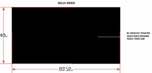

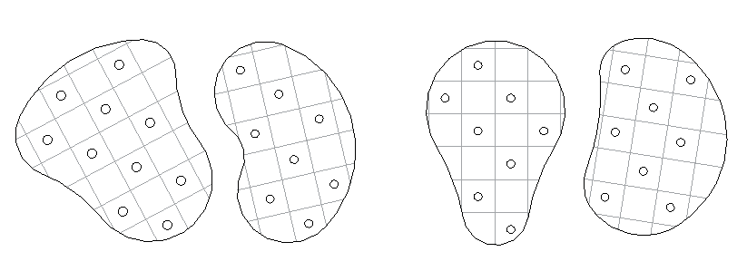

DESCRIPTION
SIGNAGE ARTWORK 
AND SUSPENDED 
CEILING SYSTEMS

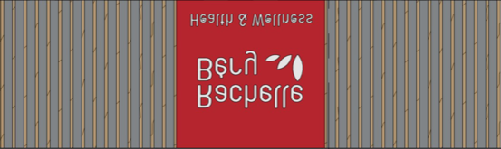

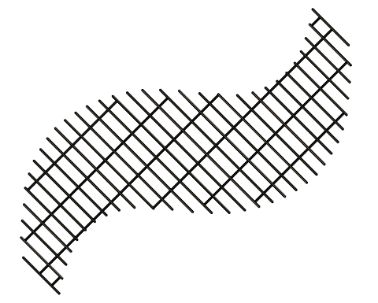

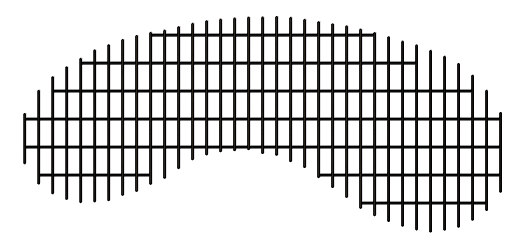

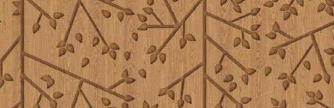

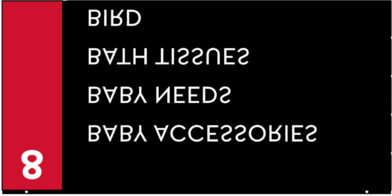

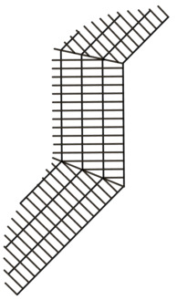

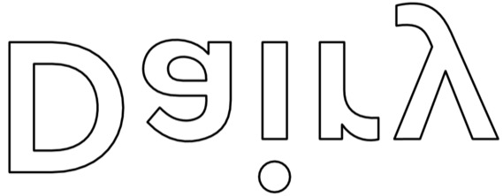

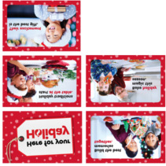

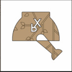

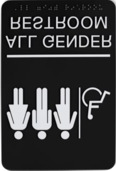

7 TOTAL
(DOUBLE SIDED)
7 CHECKOUTS TOTAL
6 TOTAL
(DOUBLE SIDED)
6 SCO TOTAL

1 TOTAL
(DOUBLE SIDED)

1 TOTAL
(DOUBLE SIDED)

4 TOTAL
(DOUBLE SIDED)

22 TOTAL
(DOUBLE SIDED)

0' - 6"W x 0' - 9"H
1 OF EACH
(2 TOTAL)

QUANTITY

2' - 11 1/2"W x 0' - 4 1/4"H
10 TOTAL

9 TOTAL

1 TOTAL

1 TOTAL

1 TOTAL

1 TOTAL

1 TOTAL

1 TOTAL

1 TOTAL

1 TOTAL

1 TOTAL

1 TOTAL

1 TOTAL

1 TOTAL

1 TOTAL

2 TOTAL

1 TOTAL

1 TOTAL

1 TOTAL

1 TOTAL

1 TOTAL

1 TOTAL

1 TOTAL

1 TOTAL

1 TOTAL

1 TOTAL

1 TOTAL

1 TOTAL

1 TOTAL

3 TOTAL

3 TOTAL

2' - 6"W x 1' - 0"H
6 TOTAL

8 TOTAL

2 TOTAL

THANKS FOR SHOPPING GRAPHIC

THANKS FOR SHOPPING WITH US

ELECTRICAL AND TERMINATION

ALL GENDER WASHROOM SIGNS

POINTS FOR ALL ILLUMINATED 

RACHELLE BERY STREET SIGNS

13' - 5 11/16"W x 2' - 11 1/4"H

7' - 0 15/16"W x 2' - 10 1/2"H

CUSTOMER SERVICE SIGNAGE

TV AND BILLBOARD MOUNTS

(REFER TO DETAIL 7 & 8 ON 

7'' - 11 1/8"W x 0' - 10 1/2"H

6' - 7 15/16"W x 2' - 3 3/4"H

FRONT END HANGING SIGN

11' - 2 1/2"W x 2' - 3 3/4"H

2' - 11 1/2"W x 0' - 4 1/4"H

WAYFINDING DIRECTIONAL

CHECKOUT LANE TOPPERS

49' - 1 11/16"W x 4' - 10"H

37' - 7 15/16"W x 4' - 10"H

93' - 5 11/16"W x 4' - 10"H

SELF CHECKOUT SIGNAGE

106' - 7 1/4"W x 4' - 10"H

52' - 4 7/16"W x 4' - 10"H

SEAFOOD MEAT GRAPHIC

SELF CHECKOUT TOPPER

(REFER TO SHEET F6.2)

(REFER TO F4.1 & F4.2)

(REFER TO F4.1 & F4.2)

(REFER TO F4.1 & F4.2)

MEAT SEAFOOD TRELLIS

10' - 9 3/16"W x 2' - 0"H

18' - 10 7/8"W x 2' - 0"H

12' - 11 3/8"W x 2' - 0"H

43' - 10 7/8"W x 2' - 6"H

51' - 3 5/8"W x 4' - 10"H

39' - 6 3/8"W x 4' - 10"H

46' - 0 7/8"W x 4' - 10"H

13'  3 1/16"W x  2' - 0"H

INGREDIENTS FOR LIFE.

CART CORRAL SIGNAGE

OUR KITCHEN GRAPHIC

19'  5 1/2"W x 4' - 10"H

ILLUMINATED SIGNAGE

ILLUMINATED SIGNAGE

0' - 14"W x 0' - 7 7/8"H

26' - 7"W x 2' - 2 1/2"H

BACKERS AND POWER

PHARMACY AREA SIGN

DELI CHEESE GRAPHIC

PHARMACY DROP-OFF

8' - 6 5/8"W x 2' - 7"H

5'  7 1/4"W x 2' - 0"H

0' - 7.37"W x 0' - 7"H

34' - 4"W x 2' - 5.6"H

TV AND BILLBOARD 

PHARMACY GRAPHIC

TV AND BILLBOARD

PHARMACY PICK-UP

4' - 10"W x 4' - 10"H

5' - 11"W x 5' - 11"H

PRODUCE GRAPHIC

6' - 6"W x 0' - 10"H

6' - 6"W x 0' - 10"H

WASHROOM SIGNS

PRODUCE TRELLIS

0' - 6"W x 0' - 9"H

2' - 6"W x 1' - 0"H

2' - 6"W x 1' - 0"H

3' - 4"W x 1' - 0"H

4' - 0"W x 2' - 0"H

BAKERY GRAPHIC

FLORAL GRAPHIC

PHARMCY DECAL

CEILING CLOUDS

(REFER TO F0.2)

(REFER TO F4.1)

RACHELLE BERY

DAIRY GRAPHIC

HABA HEADER

BABY HEADER

OUR KITCHEN

DELI TRELLIS

STORE LOGO

72"LENGTH

SHEET F1.2)

DATUM LINE

PHARMACY

AISLE SIGN

CHEESE &

PRODUCE

SEAFOOD

SIGNAGE

BAKERY

FLORAL

DAIRY

MEAT

DELI 

NOTES / REMARKS

BC ONLY

DESCRIPTION
INSTALLED BY SOBEYS
INSTALLED BY 
GENERAL CONTRACTOR
SUPPLIED BY SOBEYS
SUPPLIED BY 
GENERAL CONTRACTOR

MATRIX CHART - MILLWORK AND STAINLESS STEEL INSTALLATION

MILLWORK WALL DADO

FLORAL MOBILE WRAP

REMOVABLE STAINLESS
STEEL CASE GUARD

PHARMACY MILLWORK

CAKE ORDER STATION

STAINLESS STEEL
COLUMN PROTECTION

CUSTOMER SERVICE
COUNTER

MILLWORK FILLERS

FOOD BANK 
(DONATION BOX)

STAINLESS STEEL

PRODUCE SALES 
MILLWORK

HMR CHECKOUT

FLORAL KIOSK/ 
COUNTER

HMR DRY SUSHI

FLORAL STEPS

BAKERY SALES
MILLWORK

METAL FASCIA

RECYCLE BIN

HMR SOUP

