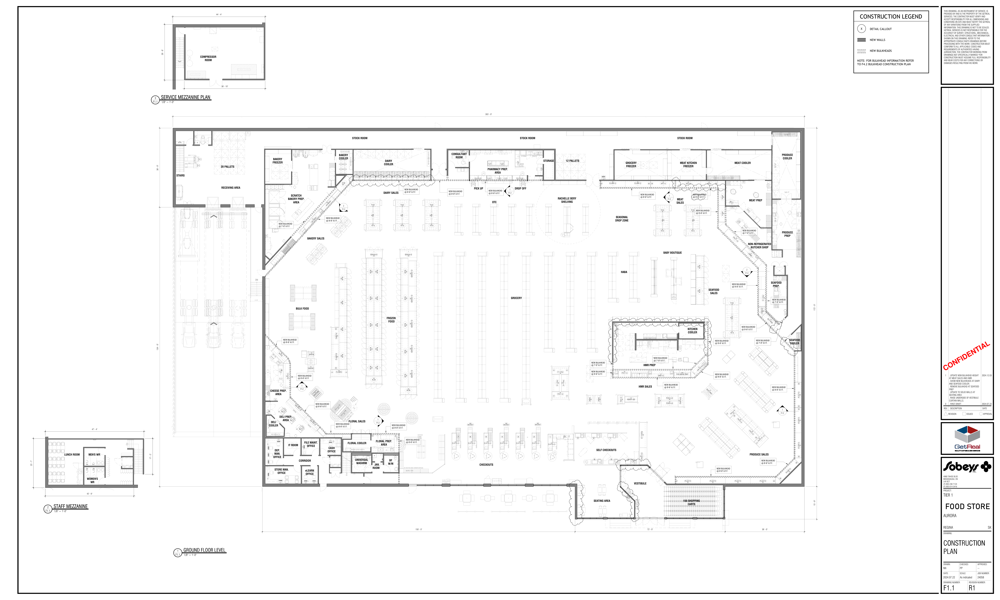

# F1.1 Aurora Food Store - DECOR PACKAGE R01

**Source**: `F1.1 Aurora Food Store - DECOR PACKAGE R01.pdf`  
**Pages**: 1  
**Extracted**: 2026-01-09 18:29:15

---

## Page 1

APPROVAL
ISSUED
REVISION

0
. FIRST DRAFT
2024.07.22

2024.12.03

CONFIDENTIAL

REGINA
SK

THIS DRAWING, AS AN INSTRUMENT OF SERVICE, IS 
PROVIDED BY AND IS THE PROPERTY OF THE GETREAL 
SERVICES. THE CONTRACTOR MUST VERIFY AND 
ACCEPT RESPONSIBILITY FOR ALL DIMENSIONS AND 
CONDITIONS ON SITE AND MUST NOTIFY THE GETREAL 
OF ANY VARIATIONS FROM THE SUPPLIED 
INFORMATION. THIS DRAWING IS NOT TO BE SCALED. 
GETREAL SERVICES IS NOT RESPONSIBLE FOR THE 
ACCURACY OF SURVEY, STRUCTURAL, MECHANICAL, 
ELECTRICAL AND OTHER CONSULTANT INFORMATION 
SHOWN ON THIS DRAWING. REFER TO THE 
APPROPRIATE CONSULTANT'S DRAWINGS BEFORE 
PROCEEDING WITH THE WORK. CONSTRUCTION MUST 
CONFORM TO ALL APPLICABLE CODES AND 
REQUIREMENTS OF AUTHORITIES HAVING 
JURISDICTION. THE CONTRACTOR WORKING FROM 
DRAWINGS NOT SPECIFICALLY MARKED "FOR 
CONSTRUCTION' MUST ASSUME FULL RESPONSIBILITY 
AND BEAR COSTS FOR ANY CORRECTIONS OR 
DAMAGES RESULTING FROM HIS WORK. 

FOOD STORE

JOB NUMBER:

DRAWN:
CHECKED:
APPROVED:

REV.
DESCRIPTION
DATE

DRAWING NUMBER:
REVISION NUMBER:

CONSTRUCTION
CONSTRUCTION
CONSTRUCTION
CONSTRUCTION

24058
2024.07.22

1
. UPDATE NEW BULKHEAD HEIGHT
AT MEAT SALES AND HMR.
. SHOW NEW BULKHEADS AT DAIRY
AND SEAFOOD COOLER.
. REMOVE BULKHEAD AT SEAFOOD
PREP
. UPDATE TO SOLID WALLS AT
SEATING AREA
. RAISE UNDERSIDE OF VESTIBULE
CURTAIN WALLS.

NN
PP
--

Inc.

R1
R1
R1
R1
F1.1
F1.1
F1.1
F1.1

As indicated

SCALE:
DATE:

4980 TAHOE BLVD.
MISSISSAUGA, ON
L4V 0C7
(T) 905 238 7124
(F) 905 614 5416

PLAN
PLAN
PLAN
PLAN

AURORA

TIER 1

DRAWING:

PROJECT:

CONSTRUCTION LEGEND

NOTE: FOR BULKHEAD INFORMATION REFER 
TO F4.2 BULKHEAD CONSTRUCTION PLAN

DETAIL CALLOUT

NEW BULKHEADS

NEW WALLS

X

15' - 8"
172' - 0"

PL5HF12
AN
PL5HF12
AN

PL5LF12
AN

SEAFOOD 
COOLER

M

M

M

M

12' DUNNAGE c/w 18"B SHELF ABOVE @5'AFF
8'Lx18"W COOLER SHELVING

M

12' DUNNAGE c/w 18"B SHELF ABOVE @5'AFF

PRODUCE 
PREP

PRODUCE 
COOLER

PL5HF12
AN

14'-1"

13'-6"

NEW BULKHEAD

NEW BULKHEAD

F1.2

@ 7'-0" A.F.F.

@ 8'-6" A.F.F.

1

SEAFOOD 
PREP.

M

28'-8"

32'-0"

M

NEW BULKHEAD

DLP-SW8
HP

@ 8'-6" A.F.F.

NON-REFRIGERATED 
BUTCHER SHOP

NEW BULKHEAD

PRODUCE SALES

150' - 0"
72' - 0"
38' - 0"

@ 7'-0" A.F.F.

PL5LF12
AN
PL5LF12
AN
PL5LF12
AN
PL5LF12
AN

G

PV3-1-8
AN

D190LC
AQ

PV3-2-6
AN

MEAT PREP

G

M

NEW BULKHEAD

NEW BULKHEAD

FLIP-UP

PV3-2-8
AN
PV3-2-8
AN

@ 7'-0" A.F.F.

@ 9'-6" A.F.F.

GMD8
HP

MEAT COOLER
MEAT KITCHEN
FREEZER

F1.2

2

NEW BULKHEAD

@ 9'-6" A.F.F.

PV3-1-12
AN

M

PV3-2-6
AN

G

16' DUNNAGE c/w 18"B SHELF ABOVE @5'AFF

TO-G
AN

TO-G
AN

TO12
AN

NEW BULKHEAD

NEW BULKHEAD

NEW BULKHEAD

G

@ 8'-6" A.F.F.

@ 9'-6" A.F.F.

@ 9'-6" A.F.F.

VF6-8
AN
VF6-8
AN

SEAFOOD 
SALES

M

DP
SOUP/ RDEL

VF6-12
AN
VF6-8
AN
VF6-12
AN

NEW BULKHEAD

@ 9'-6" A.F.F.

NEW BULKHEAD

@ 9'-6" A.F.F.

CWC-8R-RLS
HP

150 SHOPPING 
CARTS

RL4D
HM

RL5D
HM

KITCHEN 
COOLER

TO8
AN

TO-G
AN

TO-G
AN

STOCK ROOM
STOCK ROOM
STOCK ROOM

BMD-12
HP
FC8-SNDW PREP
HM
PV3-1-6
AN

MEAT 
SALES

BABY BOUTIQUE

AN
PV03-8-6

G

NEW BULKHEAD

R-3024 (S/C)
CD

@ 9'-6" A.F.F.

AN
PV03-8-8

AN
PV03-8-8

F1.2

1

NEW BULKHEAD

@ 7'-0" A.F.F.

TO8
AN

TO-G
AN

TO-G
AN

AN
PV03-8-6

HMR PREP

M

NEW BULKHEAD

HMR SALES

@ 8'-6" A.F.F.

M

R

VESTIBULE

PVO3-2-12
AN

PVO3-2-8
AN

AN
PL5MF12
AN
PL5MF12

HP

GROCERY
FREEZER

HARDT-IS6
HT

6
4
5

SEASONAL 
DROP ZONE

HABA

DP
T011-4

SELF CHECKOUTS

3
2
1

SEATING AREA

NEW BULKHEAD

NEW BULKHEAD

G

@ 9'-6" A.F.F.

@ 7'-0" A.F.F.

TRENT
AN

TRENT
AN

12 PALLETS
STORAGE

OTC
RACHELLE BERY 
SHELVING

G

G

PV3-1-8
AN

PV3-1-8
AN

PV3-1-8
AN

PV3-1-8
AN

96-62-48 LH
LCR
96-62-48 LH
LCR

G

G

1

SS COUNTERTOP
EYEWASH STATION

WC2557
QBD
WC2557
QBD
WC2557
QBD

96-62-48 LH
LCR
96-62-48 LH
LCR
96-62-48 LH
LCR
96-62-48 LH
LCR
96-62-48 LH
LCR

BOTTLES &
MIXER
DRAWER
24" FRIDGE

5
6
3
4
2
7

UPPER CABINET

PICK UP
DROP OFF
NEW BULKHEAD

IRON
MOUNTAIN
SHREDDING
BIN

GROCERY

F1.2

1

PHARMACY PREP. 
AREA

COMP. EQ.

NEW BULKHEAD

@ 8'-6" A.F.F.
NEW BULKHEAD

CHECKOUTS

303' - 0"

 U/C FRIDGE

CONSULTANT 
ROOM

@ 8'-6" A.F.F.

120VT REC @60"AFF

TO-G
AN

TO-G
AN

TO8
AN

8'Lx18"W COOLER SHELVING

20' CARLTON CARDS (VENDOR SUPPLIED)

6CAYUGA
FLORAL
TABLES

NEW BULKHEAD

@ 8'-6" A.F.F.

@ 8'-6" A.F.F.

IDD5SU-12
HM
IDD5SU-12
HM
IDD5SU-12
HM
IDD5SU-12
HM

IDD5SU-12
HM

 20.5"B / 72"H

IDD5SU-8
HM

RL3D
HM

RL5D
HM
RL4D
HM
RL5D
HM
RL5D
HM
RL5D
HM

NEW BULKHEAD

TO-G
AN

TO-G
AN

TO8
AN

@ 8'-6" A.F.F.

DAIRY SALES

FROZEN
FOOD

UNIVERSAL 
WASHRM
BF 
W/M
JAN.
ROOM

BAKERY 
COOLER
DAIRY 
COOLER

FLORAL PREP. 
AREA
FLORAL COOLER

F1.2

1

RL5D
HM
RL4D
HM
RL3D
HM
RL5D
HM
RL5D
HM

IDD5SU-8
HM

RL3D
HM

TO-G
AN

TO-G
AN

TO8
AN

RL5D
HM
RL4D
HM
RL3D
HM
RL5D
HM
RL5D
HM

FLORAL SALES

12'Lx18"W COOLER SHELVING

24"X24"X72"
AIR FILLED
BALLOON
DISPLAY

12' LOW PROFILE
REF. FLORAL (50"H)

8'Lx18"W SHELVING

4'Lx18"W SHELVING

NEW BULKHEAD

G

UP
19R

@ 8'-6" A.F.F.

NOVA-FL-3T-487250
CD

RL3D
HM

F1.2

2

RL5D
HM
RL4D
HM
RL5D
HM
RL5D
HM

AN
PL5MF8

NOVA-FL-3T-487250
CD

NEW BULKHEAD

AN
PL5MF8
AN
PL5MF12

@ 8'-6" A.F.F.

M

M

IT ROOM
FILE MAINT.
OFFICE
CASH
OFFICE

G

POT WASHER

#5-BSR4
DP
#3-BSS4
DP

NEW BULKHEAD

@ 8'-6" A.F.F.

BAKERY SALES

OB-6-SOB
CD

G2V-B41-8
AN

BRSPM
CD

STORE MAN.
OFFICE
eLEARN
OFFICE

BRSPM
CD

SHEETER

NEW BULKHEAD

FLIP-UP

CORRIDOR

ROUNDER

@ 8'-6" A.F.F.

BULK FOOD

80QT. MIXER

SCRATCH 
BAKERY PREP. 
AREA

FLOOR SCALE

F1.2

1

G2V-B41-12
AN

WATER FILTER

SPIRAL MIXER

NEW BULKHEAD

FLIP-UP

@ 8'-6" A.F.F.

NEW BULKHEAD

DELI PREP.
AREA

@ 7'-0" A.F.F.

DLPC12
HP

CHEESE PREP.
AREA

BAKERY 
FREEZER

DLPC8
HP

DEP.
MAN.
OFFICE

8'Lx18"W SHELVING

DELI 
COOLER

SN-04L
3C-24X20

8'Lx18"W SHELVING

DN

5'-10"

1.5 METRE CLEARANCE

RECEIVING AREA

20 PALLETS

38' - 10"

38' - 10"

1/8" = 1'-0"
F1.1
1
GROUND FLOOR LEVEL
GROUND FLOOR LEVEL
GROUND FLOOR LEVEL
GROUND FLOOR LEVEL

44' - 4"

44' - 4"

COMPRESSOR 
ROOM

1/8" = 1'-0"
F1.1
3
SERVICE MEZZANINE PLAN
SERVICE MEZZANINE PLAN
SERVICE MEZZANINE PLAN
SERVICE MEZZANINE PLAN

1M CLEARANCE

STAIRS

26' - 8"

26' - 8"

38' - 0"
134' - 0"

17' - 2"

17' - 2"

DN
19R

MEN'S WR

WOMEN'S 
WR

47' - 4"

47' - 4"

42' - 6"

42' - 6"

1/8" = 1'-0"
F1.1
2
STAFF MEZZANINE
STAFF MEZZANINE
STAFF MEZZANINE
STAFF MEZZANINE

LUNCH ROOM

23' - 7"

23' - 7"

