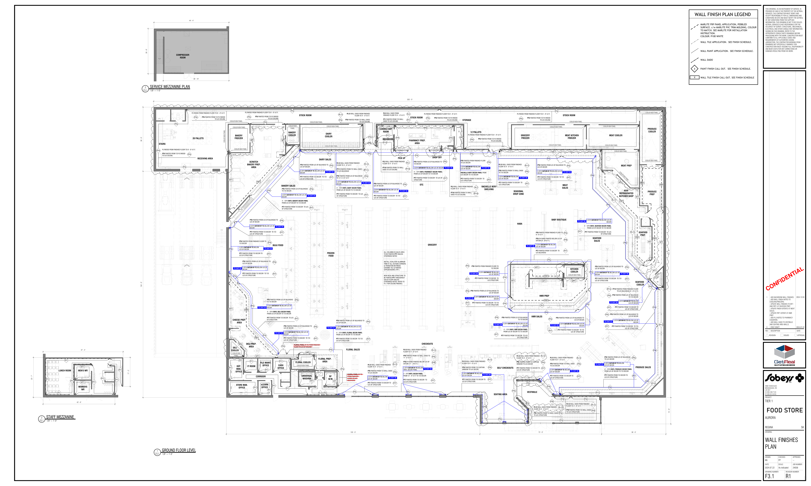

# F3.1 TC INSTALL Wall Finishes Plan - Aurora Food Store - DECOR PACKAGE R01

**Source**: `F3.1 TC INSTALL Wall Finishes Plan - Aurora Food Store - DECOR PACKAGE R01.pdf`  
**Pages**: 1  
**Extracted**: 2026-01-09 18:29:16

---

## Page 1

CONFIDENTIAL

APPROVAL
ISSUED
REVISION

0
. FIRST DRAFT
2024.07.22

2024.12.03

REGINA
SK

THIS DRAWING, AS AN INSTRUMENT OF SERVICE, IS 
PROVIDED BY AND IS THE PROPERTY OF THE GETREAL 
SERVICES. THE CONTRACTOR MUST VERIFY AND 
ACCEPT RESPONSIBILITY FOR ALL DIMENSIONS AND 
CONDITIONS ON SITE AND MUST NOTIFY THE GETREAL 
OF ANY VARIATIONS FROM THE SUPPLIED 
INFORMATION. THIS DRAWING IS NOT TO BE SCALED. 
GETREAL SERVICES IS NOT RESPONSIBLE FOR THE 
ACCURACY OF SURVEY, STRUCTURAL, MECHANICAL, 
ELECTRICAL AND OTHER CONSULTANT INFORMATION 
SHOWN ON THIS DRAWING. REFER TO THE 
APPROPRIATE CONSULTANT'S DRAWINGS BEFORE 
PROCEEDING WITH THE WORK. CONSTRUCTION MUST 
CONFORM TO ALL APPLICABLE CODES AND 
REQUIREMENTS OF AUTHORITIES HAVING 
JURISDICTION. THE CONTRACTOR WORKING FROM 
DRAWINGS NOT SPECIFICALLY MARKED "FOR 
CONSTRUCTION' MUST ASSUME FULL RESPONSIBILITY 
AND BEAR COSTS FOR ANY CORRECTIONS OR 
DAMAGES RESULTING FROM HIS WORK. 

FOOD STORE

JOB NUMBER:

DRAWN:
CHECKED:
APPROVED:

REV.
DESCRIPTION
DATE

DRAWING NUMBER:
REVISION NUMBER:

WALL FINISHES
WALL FINISHES
WALL FINISHES
WALL FINISHES

24058
2024.07.22

1
. ADD BACKROOM WALL FINISHES.
. ADD WALL FINISH NOTES TO
COOLERS/FREEZERS.
. UPDATE WALL FINISHES TO WT1
AND FRP1 AT SEAFOOD PREP.
. UPDATE FINISH EXTENTS AT MEAT
SALES.
. UPDATE FRP1 EXTENT AT HMR
PREP.
. ADD PL3 NOTES TO PHARMACY
COUNTERS.
. ADD WALL DADO TO VESTIBULE
AND SEATING AREA WALLS.

NN
PP
--

Inc.

R1
R1
R1
R1
F3.1
F3.1
F3.1
F3.1

As indicated

SCALE:
DATE:

4980 TAHOE BLVD.
MISSISSAUGA, ON
L4V 0C7
(T) 905 238 7124
(F) 905 614 5416

PLAN
PLAN
PLAN
PLAN

AURORA

TIER 1

DRAWING:

PROJECT:

MARLITE FRP PANEL APPLICATION, PEBBLED 
SURFACE. c/w MARLITE PVC TRIM MOLDING, COLOUR 
TO MATCH. SEE MARLITE FOR INSTALLATION 
INSTRUCTION.
COLOUR: P100 WHITE

WALL TILE FINISH CALL OUT. SEE FINISH SCHEDULE

WALL PAINT APPLICATION.  SEE FINISH SCHEDULE.

WALL TILE APPLICATION.  SEE FINISH SCHEDULE.

PAINT FINISH CALL OUT.  SEE FINISH SCHEDULE.

WALL FINISH PLAN LEGEND

WALL DADO

X

X

15' - 8"
172' - 0"

FRP1
FRP1

WT1

PT12

PL5HF12
AN
PL5HF12
AN

AN

M

M

M

M

12' DUNNAGE c/w 18"B SHELF ABOVE @5'AFF
8'Lx18"W COOLER SHELVING

M

COOLER BOX 

PANEL

12' DUNNAGE c/w 18"B SHELF ABOVE @5'AFF

COOLER BOX PANEL

COOLER BOX PANEL

PRODUCE 
PREP

PRODUCE 
COOLER

FRP1

WT1

PT6

PT6

PT12

14'-1"

13'-6"

PT6

WT1

PRODUCE SALES

PT6

SEAFOOD 
PREP.

M

SEAFOOD 
COOLER

28'-8"

32'-0"

M

DLP-SW8
HP

FRP1

WT1

PT7 PAINTED FROM T/O DECOR TO 

PT6 PAINTED FROM U/S OF BULKHEAD 

2.25"H DATUM BY TC BELOW 

PT12 PAINTED FROM FINISHED FLOOR 

PT7 PAINTED FROM T/O DECOR  TO T/O 

PT6 PAINTED FROM U/S OF BULKHEAD TO 

2.25"H DATUM BY TC BELOW U/S OF 

TO U/S BULKHEAD( 8' - 6" A.F.F)

TO T/O DECOR

U/S OF DECOR

U/S OF STRUCTURE
PT7

DECOR

U/S OF DECOR

U/S OF STRUCTURE

PT6

150' - 0"
72' - 0"
38' - 0"

U/S OF STRUCTURE
PT7

PT6

PL5LF12
AN
PL5LF12
AN
PL5LF12
AN
PL5LF12
AN

PL11

G

NON-
REFRIGERATED 
BUTCHER SHOP

PV3-1-8
AN

D190LC
AQ

PV3-2-6
AN

4' - 10"H VINYL PRODUCE DECOR PANEL

MEAT PREP

PT6 PAINTED FROM U/S OF BULKHEAD 

COOLER BOX PANEL

FROM U/S OF DECOR TO T/O DECOR

PT6

PT7

TC DAT 09

G

PT7 PAINTED FROM T/O DECOR TO 

M

COOLER BOX PANEL

PT6

FLIP-UP

PV3-2-8
AN
PV3-2-8
AN

2.25"H DATUM BY TC BELOW 

FRP1

PT6 PAINTED FROM U/S OF BULKHEAD TO 

GMD8
HP

MEAT COOLER
MEAT KITCHEN
FREEZER

WT1

PT7 PAINTED FROM T/O DECOR  TO T/O 

2.25"H DATUM BY TC BELOW U/S OF 

TC DAT 06

COOLER BOX PANEL

PL11

COOLER BOX PANEL

TO U/S DECOR

U/S OF DECOR

PV3-1-12
AN

TC DAT 07

PT7 PAINTED FROM T/O DECOR  TO U/S 

2.25"H DATUM BY TC BELOW U/S OF 

PT6

4' - 10"H VINYL SEAFOOD DECOR PANEL

FROM U/S OF DECOR TO T/O DECOR

DECOR

OF STRUCTURE
PT7

PT12

PT6

M

PV3-2-6
AN

PT6

G

16' DUNNAGE c/w 18"B SHELF ABOVE @5'AFF

TO-G
AN

TO-G
AN

PT6

PT7

U/S OF STRUCTURE

TO12
AN

U/S OF DECOR

G

TC DAT 07

SEAFOOD 
SALES

PL11

VF6-8
AN
VF6-8
AN

DECOR

PT12

PL13

M

PT8

PT6

PT6

PT8 PAINTED FROM T/O WALL DADO 

DP
SOUP/ RDEL

VF6-12
AN
VF6-8
AN
VF6-12
AN

PT6
PL13 WALL DADO FROM FINISHED 

PT6

PT6

TC DAT 06

PT7 PAINTED FROM T/O DECOR  TO T/O 

PT6 PAINTED FROM U/S OF BULKHEAD TO 

2.25"H DATUM BY TC BELOW U/S OF 

DECOR

U/S OF DECOR

U/S OF STRUCTURE

CWC-8R-RLS
HP

COOLER BOX PANEL

RL4D
HM

RL5D
HM

FLOOR TO 4' - 0" A.F.F.

COOLER BOX PANEL

PL13

PT6

PT7

TO U/S STRUCTURE

KITCHEN 
COOLER

TC DAT 08

TO8
AN

TO-G
AN

TO-G
AN

WT1

STOCK ROOM
STOCK ROOM
STOCK ROOM

PT6 PAINTED FROM T/O WALL DADO 

PT7 PAINTED FROM T/O DECOR TO 

PL13
PL13 WALL DADO FROM FINISHED 

BMD-12
HP
FC8-SNDW PREP
HM
PV3-1-6
AN

TC DAT 05

2.25"H DATUM BY TC BELOW 

PT6

PT7

MEAT 
SALES

PT8

PT6

U/S BULKHEAD
PT7

BABY BOUTIQUE

AN
PV03-8-6

PT6 PAINTED FROM U/S OF BULKHEAD TO 

FLOOR TO 4' - 0" A.F.F.

PT7 PAINTED FROM T/O DECOR  TO T/O 

PT8

U/S OF STRUCTURE

PT6 PAINTED FROM FINISHED FLOOR TO 

G

PT6

PL13

COOLER BOX PANEL

2.25"H DATUM BY TC BELOW U/S OF 

PT8 6''H BAND PAINTED BELOW U/S OF 

PT6

R-3024 (S/C)
CD

COOLER BOX PANEL

PT7 PAINTED FROM T/O DECOR  TO 

TO U/S DECOR

U/S OF DECOR

AN
PV03-8-8

AN
PV03-8-8

TC DAT 09
TC DAT 09

PT6 PAINTED FROM T/O WALL DADO 

PT6

PL13 WALL DADO FROM FINISHED 

2.25"H DATUM BY TC BELOW 

PT7

PT8

TO8
AN

TO-G
AN

TO-G
AN

PT6
PT6

PT7

PT6 PAINTED FROM T/O PLYWOOD 

U/S OF STRUCTURE

PT6

PLYWOOD FROM FINISHED FLOOR TO 8' - 0" A.F.F.

TO U/S CEILING
PT6

PT6

PT6

DATUM (9' - 6''A.F.F.)

AN
PV03-8-6

HMR PREP

FLOOR TO 4' - 0" A.F.F.

FRP1

FRP1

PT6

U/S OF DECOR

TO U/S STRUCTURE

WT1

U/S OF DECOR

PL13

PT7

PT6

PL9

M

9'  0" A.F.F

HMR SALES

DECOR

M

PT7 PAINTED FROM T/O DECOR TO 

PL13 WALL DADO FROM FINISHED 

PT6 PAINTED FROM T/O CURTAIN 

WT1

SEATING AREA
VESTIBULE

PVO3-2-12
AN

PVO3-2-8
AN

TC DAT 09

AN
PL5MF12
AN
PL5MF12

WINDOW TO U/S DECOR

HP

FLOOR TO 4' - 0" A.F.F.

U/S OF STRUCTURE

GROCERY
FREEZER

PT6

PL13

PT7

PT6

HARDT-IS6
HT

PT7 PAINTED FROM T/O DECOR  TO U/S 

PT6 PAINTED FROM U/S OF BULKHEAD 

2.25"H DATUM BY TC BELOW U/S OF 

4' - 10"H VINYL HMR DECOR PANEL

FROM U/S OF DECOR TO T/O DECOR

TO T/0 DECOR

DECOR

OF STRUCTURE

TC DAT 05

SEASONAL 
DROP ZONE

PT6 PAINTED FROM T/O WALL DADO 

6
4
5

PT7 PAINTED FROM T/O DECOR  TO 

HABA

PL13 WALL DADO FROM FINISHED 

DP
T011-4

2.25"H DATUM BY TC BELOW 

PT6

WT1

FLOOR TO 4' - 0" A.F.F.

SELF CHECKOUTS

U/S STRUCTURE

3
2
1

TO T/O DECOR 

U/S OF DECOR

PT6

PT6

G

PT6 PAINTED FROM T/O PLYWOOD 

PT6

PLYWOOD FROM FINISHED FLOOR TO 8' - 0" A.F.F.

TO U/S CEILING
PT6

TRENT
AN

PT7 PAINTED FROM T/O DECOR  TO T/O 

PT6 PAINTED FROM U/S OF BULKHEAD TO 

2.25"H DATUM BY TC BELOW U/S OF 

PT7 PAINTED FROM T/O DECOR  TO 

PT6 PAINTED FROM FINISHED FLOOR TO 

2.25"H DATUM BY TC BELOW 

DECOR

U/S OF DECOR

U/S OF STRUCTURE

T/O DECOR

U/S OF DECOR

U/S STRUCTURE
PT7

PT7

OTC
RACHELLE BERY 
SHELVING

PT6

TRENT
AN

PT6

U/S OF STRUCTURE
PT7

TC DAT 08

PT6

PT7

PT6

TC DAT 05
TC DAT 05

RACHELLE BERY DECOR PANEL FROM 

PT6

PT7 PAINTED FROM T/O DECOR TO 

PT6 PAINTED FROM FINISHED FLOOR 

PL13 WALL DADO FROM FINISHED 

PT6 PAINTED FROM T/O CURTAIN 

PT7 PAINTED FROM T/O DECOR  TO 

2.25"H DATUM BY TC BELOW 

12 PALLETS

2.25"H DATUM BY TC BELOW 

WINDOW TO U/S DECOR

U/S DECOR TO T/O DECOR

PT10

TC DAT 09

PL3

FLOOR TO 4' - 0" A.F.F.

G

G

PL3 WALL DADO FROM FINISHED 

TC DAT 09

PT6

PT10 PAINTED FROM T/O WALL 

U/S OF DECOR

U/S STRUCTURE

PV3-1-8
AN

STORAGE

TO U/S DECOR

U/S OF DECOR

PV3-1-8
AN

PV3-1-8
AN

PT6

PT7

PT6

PV3-1-8
AN

FLOOR TO 4' - 0" A.F.F.

DADO TO U/S CEILING

96-62-48 LH
LCR
96-62-48 LH
LCR

G

G

PT1

1

PT6 PAINTED FROM T/O PLYWOOD 

PLYWOOD FROM FINISHED FLOOR TO 8' - 0" A.F.F.

TO U/S CEILING
PT6

PICK UP
DROP OFF
PT6

SS COUNTERTOP
EYEWASH STATION

PT9
PT9
PT1

WC2557
QBD
WC2557
QBD
WC2557
QBD

96-62-48 LH
LCR
LCR
96-62-48 LH
LCR
96-62-48 LH
LCR
96-62-48 LH
LCR

BOTTLES &
MIXER
DRAWER

PT10

5
6
4
2
7

STRUCTURE
PT7

PT6

UPPER CABINET

2.25"H DATUM BY TC BELOW U/S OF DECOR

PT7 PAINTED FROM T/O DECOR  TO U/S OF 

4' - 10"H VINYL PHARMACY DECOR PANEL

PT6 PAINTED FROM U/S OF BULKHEAD TO 

24" FRIDGE

IRON
MOUNTAIN
SHREDDING
BIN

FROM U/S OF DECOR TO T/O DECOR

GROCERY

PL3
PL3

PL13

PT8

PT6

U/S OF STRUCTURE
PT7

CHECKOUTS

TC DAT 08

PT6 PAINTED FROM T/O WALL DADO TO 

PT8 6''H BAND PAINTED BELOW U/S OF 

PT7 PAINTED FROM T/O DECOR  TO 

PT6

PL13 WALL DADO FROM FINISHED 

FROM 12' - 0" A.F.F TO T/O DECOR

PHARMACY PREP. 
AREA

2.25"H DATUM BY TC BELOW 

2' - 6"H VINYL DECOR PANEL

COMP. EQ.

T/0 DECOR

FLOOR TO 4' - 0" A.F.F.

PT6

DATUM (11' - 3''A.F.F.)

PT6

VINYL DECOR PANEL

303' - 0"

 U/C FRIDGE

11'  3" A.F.F

PL3

PT1

PT10

PT6

PL3

TC DAT 05

PT7

PT6

TRIM AT ALL OUTSIDE CORNERS 

NEW DECK AND STRUCTURE TO 

INSTALL SCHLUTER ALUMINUM 

BE PAINTED PT7 THROUGHOUT 

PL3 WALL DADO FROM FINISHED 

FINISHED FLOOR TO 4' - 0" A.F.F.

OTHERWISE NOTED. REFER TO 

ALL COLUMNS IN SALES AREA 

PT10 PAINTED FROM T/O WALL 

PT1 PAINTED FROM T/O WALL 

TO BE PAINTED PT7 UNLESS 

F4.1 FOR CEILING FINISHES.

PT6 PAINTED FROM U/S OF BULKHEAD TO 

CERAMIC TILE & PAINTED 

& TRANSITION BETWEEN 

PT7 PAINTED FROM T/O DECOR  TO T/O 

SALES FLOOR UNLESS 

GYPSUM BOARD (TYP.)

PL3 WALL DADO FROM 

2.25"H DATUM BY TC BELOW U/S OF 

DADO TO U/S CEILING

FLOOR TO 4' - 0" A.F.F.

DADO TO U/S CEILING

OTHERWISE NOTED

PL13

PT6

U/S OF STRUCTURE
PT7

TC DAT 08

CONSULTANT 
ROOM

PT6 PAINTED FROM T/O WALL DADO

PT7 PAINTED FROM T/O DECOR TO 

PL13 WALL DADO FROM FINISHED 

2.25"H DATUM BY TC BELOW 

U/S OF STRUCTURE

PT10

U/S OF DECOR

FLOOR TO 4' - 0" A.F.F.

DECOR

120VT REC @60"AFF

TO U/S DECOR

U/S OF DECOR

PT6

PT6

PT6

PT6 PAINTED FROM T/O WALL DADO 

PL13 WALL DADO FROM FINISHED 

TC DAT 05

FLOOR TO 4' - 0" A.F.F.

TO U/S CEILING

PT6

PT7

PT11

PL13

PT6

OF STRUCTURE
PT7

TO-G
AN

TO-G
AN

PT6 PAINTED FROM U/S OF BULKHEAD TO 

TO8
AN

PT7 PAINTED FROM T/O DECOR  TO U/S 

PT7 PAINTED FROM T/O DECOR  TO T/O 

PT6 PAINTED FROM U/S OF BULKHEAD 

FLORAL PANEL BY TC 

4' - 10"H VINYL FLORAL DECOR PANEL

PT11 PAINTED FROM T/O WALL DADO 

4' - 10"H VINYL DAIRY DECOR PANEL

2.25"H DATUM BY TC BELOW U/S OF 

8'Lx18"W COOLER SHELVING

2.25"H DATUM BY TC BELOW U/S OF 

FROM U/S OF DECOR TO T/O DECOR

FROM U/S OF DECOR TO T/O DECOR

PL13 WALL DADO FROM FINISHED 

FLORAL SALES

FROM FINISHED 

FLOOR TO U/S 

20' CARLTON CARDS (VENDOR SUPPLIED)

6CAYUGA
FLORAL
TABLES

PT6

BULKHEAD

FLOOR TO 4' - 0" A.F.F.

TO 14'  6 1/4" A.F.F 

U/S OF STRUCTURE

TO U/S BULKHEAD

 20.5"B / 72"H

IDD5SU-12
HM
IDD5SU-12
HM
IDD5SU-12
HM
IDD5SU-12
HM

IDD5SU-12
HM

IDD5SU-8
HM

RL3D
HM

U/S OF DECOR

PT6

RL5D
HM
RL4D
HM
RL5D
HM
RL5D
HM
RL5D
HM

PL13

PT6

DECOR

TO-G
AN

TO-G
AN

DECOR

TO8
AN

COOLER BOX PANEL
COOLER BOX 

COOLER BOX PANEL

WT1
WT1

TC DAT 01

FROZEN
FOOD

TC DAT 04

PT6

PT7

UNIVERSAL 
WASHRM
BF 
W/M

BAKERY 
COOLER
DAIRY 
COOLER

PT6

FLORAL PREP. 
AREA
FLORAL COOLER

PT11

DAIRY SALES

PT6 PAINTED FROM U/S OF BULKHEAD TO 

PT7 PAINTED FROM T/O DECOR  TO T/O 

PT6
PL13

WT1

2.25"H DATUM BY TC BELOW U/S OF 

COOLER BOX PANEL

PT1

RL5D
HM
RL4D
HM
RL3D
HM
RL5D
HM
RL5D
HM

PT6
FLORAL PANEL BY TC FROM FINISHED 

IDD5SU-8
HM

RL3D
HM

TO-G
AN

TO-G
AN

PT6

PT7

TO8
AN

RL5D
HM
RL4D
HM
RL3D
HM
RL5D
HM
RL5D
HM

TC DAT 04

U/S OF STRUCTURE

PT6
PT6

OF STRUCTURE
PT7

PT6 PAINTED FROM U/S OF BULKHEAD TO 

FLOOR TO U/S OF CEILING

PT7 PAINTED FROM T/O DECOR  TO T/O 

WT1

U/S OF DECOR

COOLER BOX PANEL

12'Lx18"W COOLER SHELVING

PT7 PAINTED FROM T/O DECOR  TO U/S 

2.25"H DATUM BY TC BELOW U/S OF 

PT6 PAINTED FROM U/S OF BULKHEAD 

4' - 10"H VINYL BAKERY DECOR PANEL

2.25"H DATUM BY TC BELOW U/S OF 

FROM U/S OF DECOR TO T/O DECOR

DECOR

24"X24"X72"
AIR FILLED
BALLOON
DISPLAY

12' LOW PROFILE
REF. FLORAL (50"H)

8'Lx18"W SHELVING

PT6

OF STRUCTURE
PT7

4'Lx18"W SHELVING

U/S OF STRUCTURE

UP
19R

BAKERY SALES

G

PANEL

NOVA-FL-3T-487250
CD

RL3D
HM

PT7 PAINTED FROM T/O DECOR  TO U/S 

PT6

U/S OF DECOR

PT6 PAINTED FROM U/S OF BULKHEAD 

RL5D
HM
RL4D
HM
RL5D
HM
RL5D
HM

2.25"H DATUM BY TC BELOW U/S OF 

TO T/0 DECOR

FROM U/S OF DECOR TO T/O DECOR

4' - 10"H VINYL DELI DECOR PANEL

AN
PL5MF8

NOVA-FL-3T-487250
CD

PT1
PT1

DECOR

AN
PL5MF8
AN
PL5MF12

DECOR

M

M

WT1
WT1

FILE MAINT.
OFFICE
CASH
OFFICE

G

TC DAT 04

PT6

PT7

BULK FOOD

TC DAT 02

POT WASHER

PT1

#5-BSR4
DP
#3-BSS4

PL11

PT6 PAINTED FROM T/O PLYWOOD 

PLYWOOD FROM FINISHED FLOOR TO 8' - 0" A.F.F.

TO U/S CEILING
PT6

PT6 PAINTED FROM U/S OF BULKHEAD TO 

PT7 PAINTED FROM T/O DECOR  TO T/O 

TO T/0 DECOR

PT6

PT7

2.25"H DATUM BY TC BELOW U/S OF 

OB-6-SOB
CD

TC DAT 03

DECOR

PT6

PT6 PAINTED FROM U/S OF BULKHEAD TO 

PT1

U/S OF STRUCTURE
PT7

G2V-B41-8
AN

PT7 PAINTED FROM T/O DECOR  TO T/O 

BRSPM
CD

STORE MAN.
OFFICE
eLEARN
OFFICE

PT1

BRSPM
CD

2.25"H DATUM BY TC BELOW U/S OF 

SHEETER

COOLER BOX PANEL
PT6

PT6 PAINTED FROM FINISHED FLOOR TO 

PT6

TC DAT 02

FLIP-UP

CORRIDOR

ROUNDER

U/S OF STRUCTURE

PT7 PAINTED FROM T/O DECOR TO 

80QT. MIXER

SCRATCH 
BAKERY PREP. 
AREA

FRP1
WT1

FLOOR SCALE

U/S OF DECOR

2.25"H DATUM BY TC BELOW 

WT1

FRP1

G2V-B41-12
AN

WATER FILTER

PT1

DELI PREP.
AREA

U/S OF STRUCTURE

IT ROOM

DECOR

SPIRAL MIXER

PT6

FLIP-UP

PT1

U/S OF DECOR

U/S OF DECOR

FRP1

DLPC12
HP

DECOR

COOLER BOX PANEL

T/O DECOR

CHEESE PREP.
AREA

COOLER BOX PANEL

BAKERY 
FREEZER

DLPC8
HP

WT1

PL11

DEP.
MAN.
OFFICE

TC DAT 02

COOLER BOX 

8'Lx18"W SHELVING

DELI 
COOLER

PANEL

PT6

WT1

PT6

SN-04L
3C-24X20

PT1

8'Lx18"W SHELVING

COOLER BOX PANEL

PT6 PAINTED FROM T/O PLYWOOD 

PLYWOOD FROM FINISHED FLOOR TO 8' - 0" A.F.F.

TO U/S CEILING
PT6

DN

5'-10"

1.5 METRE CLEARANCE

RECEIVING AREA

20 PALLETS

38' - 10"

1/8" = 1'-0"
F3.1
1
GROUND FLOOR LEVEL
GROUND FLOOR LEVEL
GROUND FLOOR LEVEL
GROUND FLOOR LEVEL

PT6
PLYWOOD FROM FINISHED FLOOR TO 8' - 0" A.F.F.

44' - 4"

TO U/S CEILING
PT6

1/8" = 1'-0"
F3.1
3
SERVICE MEZZANINE PLAN
SERVICE MEZZANINE PLAN
SERVICE MEZZANINE PLAN
SERVICE MEZZANINE PLAN

COMPRESSOR 
ROOM

PT6

PT6 PAINTED FROM T/O PLYWOOD 

PT6

1M CLEARANCE

STAIRS

26' - 8"

38' - 0"
134' - 0"

17' - 2"

PT1

PT1
PT1

DN
19R

PT1

WOMEN'S 
WR

MEN'S WR

47' - 4"

WT1

WT1

42' - 6"

1/8" = 1'-0"
F3.1
2
STAFF MEZZANINE
STAFF MEZZANINE
STAFF MEZZANINE
STAFF MEZZANINE

PT1
PT1

LUNCH ROOM

PT1

PT1

23' - 7"

