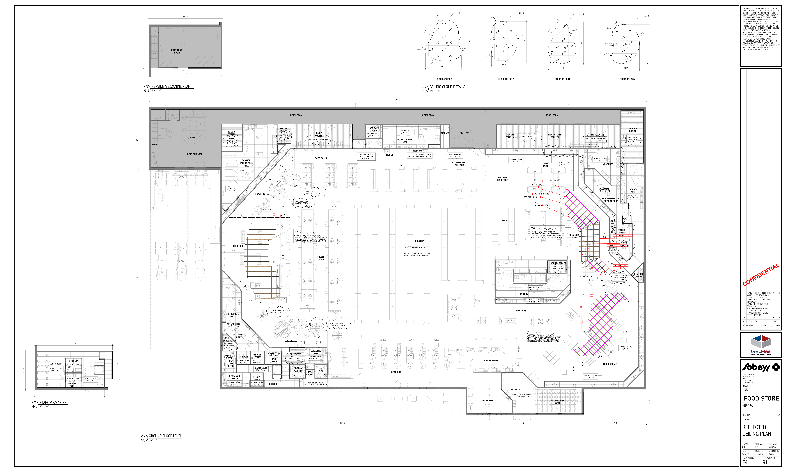

# F4.1 RCP Aurora Food Store - DECOR PACKAGE R01

**Source**: `F4.1 RCP Aurora Food Store - DECOR PACKAGE R01.pdf`  
**Pages**: 1  
**Extracted**: 2026-01-09 18:29:24

---

## Page 1

APPROVAL
ISSUED
REVISION

CONFIDENTIAL

0
. FIRST DRAFT
2024.07.22

2024.12.03

REGINA
SK

THIS DRAWING, AS AN INSTRUMENT OF SERVICE, IS 
PROVIDED BY AND IS THE PROPERTY OF THE GETREAL 
SERVICES. THE CONTRACTOR MUST VERIFY AND 
ACCEPT RESPONSIBILITY FOR ALL DIMENSIONS AND 
CONDITIONS ON SITE AND MUST NOTIFY THE GETREAL 
OF ANY VARIATIONS FROM THE SUPPLIED 
INFORMATION. THIS DRAWING IS NOT TO BE SCALED. 
GETREAL SERVICES IS NOT RESPONSIBLE FOR THE 
ACCURACY OF SURVEY, STRUCTURAL, MECHANICAL, 
ELECTRICAL AND OTHER CONSULTANT INFORMATION 
SHOWN ON THIS DRAWING. REFER TO THE 
APPROPRIATE CONSULTANT'S DRAWINGS BEFORE 
PROCEEDING WITH THE WORK. CONSTRUCTION MUST 
CONFORM TO ALL APPLICABLE CODES AND 
REQUIREMENTS OF AUTHORITIES HAVING 
JURISDICTION. THE CONTRACTOR WORKING FROM 
DRAWINGS NOT SPECIFICALLY MARKED "FOR 
CONSTRUCTION' MUST ASSUME FULL RESPONSIBILITY 
AND BEAR COSTS FOR ANY CORRECTIONS OR 
DAMAGES RESULTING FROM HIS WORK. 

FOOD STORE

JOB NUMBER:

DRAWN:
CHECKED:
APPROVED:

REV.
DESCRIPTION
DATE

NN
PP
Approver

DRAWING NUMBER:
REVISION NUMBER:

24058
2024.07.22

CEILING PLAN
CEILING PLAN
CEILING PLAN
CEILING PLAN

1
. UPDATE TRELLIS, CLOUD CEILING
MOUNTING HEIGHTS AND NOTES.
. UPDATE CEILING HEIGHTS AT
PHARMACY, PRODUCE PREP AND
MEAT SALES
. UPDATE CEILING FINISHES AT
SEAFOOD PREP,
NON-REFRIGERATED BUTCHER
SHOP AND MEAT PREP
. ADD CEILING FINISH NOTE TO
COOLERS, FREEZERS

Inc.

R1
R1
R1
R1
F4.1
F4.1
F4.1
F4.1

REFLECTED
REFLECTED
REFLECTED
REFLECTED

As indicated

SCALE:
DATE:

4980 TAHOE BLVD.
MISSISSAUGA, ON
L4V 0C7
(T) 905 238 7124
(F) 905 614 5416

AURORA

TIER 1

DRAWING:

PROJECT:

15' - 8"
172' - 0"

LIGHTS

 144" 

 R 85.55" 

PL5HF12
AN
PL5HF12
AN

PL5LF12
AN

SEAFOOD 
COOLER

M

M

M

M

12' DUNNAGE c/w 18"B SHELF ABOVE @5'AFF
8'Lx18"W COOLER SHELVING

M

NEW ACT2 CEILING 

12' DUNNAGE c/w 18"B SHELF ABOVE @5'AFF

PANEL CEILING 

@ 10' - 0" A.F.F.

@ 10' - 0" A.F.F.
NEW COOLER PANEL CEILING 

@ 10' - 0" A.F.F.
NEW COOLER 

PRODUCE 
COOLER

PRODUCE 
PREP

PL5HF12
AN

CLOUD CEILING 1
CLOUD CEILING 2
CLOUD CEILING 3
CLOUD CEILING 4

6' - 0"

MIN

14'-1"

13'-6"

P1

P1
P1
P1

NEW ACT1 CEILING 

@ 9' - 0" A.F.F.

11' - 7"

SAF-TRE-013 - B01-02

P1
P1

@ 10' - 0" A.F.F.

 R 50.825" 

 139.07" 

M

NEW ACT2 

SAF-TRE-013 - B02-02

15' - 7"

CEILING 

SAF-TRE-013 - C01

24"

SEAFOOD 
PREP.

28'-8"

32'-0"

24"
 R 178.465" 

NEW COOLER 

PANEL CEILING 

SAF-TRE-013 - B03-02

@ 10' - 0" A.F.F.

P1

P1

M

DLP-SW8
HP

NON-REFRIGERATED 
BUTCHER SHOP

SAF-TRE-013 - B04-02

PRODUCE SALES

R 44.2"

150' - 0"
72' - 0"
38' - 0"

P1

P1

PL5LF12
AN
PL5LF12
AN
PL5LF12
AN
PL5LF12
AN

NEW ACT2 CEILING 
@ 10' - 0" A.F.F.

G

PV3-1-8
AN

D190LC
AQ

PV3-2-6
AN

MIN

MEAT PREP

 R 22.79" 

NEW ACT2 CEILING 

6' - 0"

@ 10' - 0" A.F.F.

 R 24" 

G

M

FLIP-UP

NEW ACT2 CEILING 

PV3-2-8
AN
PV3-2-8
AN

6' - 0"

NEW COOLER PANEL CEILING 

MIN

@ 10' - 0" A.F.F.

GMD8
HP

11' - 1"

SAF-TRE-013 - C02

MEAT COOLER
MEAT KITCHEN
FREEZER

@ 10' - 0" A.F.F.

1' - 6"

NEW ACT1 CEILING 

@ 9' - 0" A.F.F.

MIN

6' - 0"

PV3-1-12
AN

SAF-TRE-013 - C03

D

M

PV3-2-6
AN

G

16' DUNNAGE c/w 18"B SHELF ABOVE @5'AFF

TO-G
AN

TO-G
AN

TO12
AN

14' - 1"

G

A

LIGHTS

4' - 0"

VF6-8
AN
VF6-8
AN

 144" 

C

B

SEAFOOD 
SALES

M

R 136.5"

15' - 3"

P1

DP
SOUP/ RDEL

VF6-12
AN
VF6-8
AN
VF6-12
AN

21' - 7"

NEW ACT1 CEILING 

@ 10' - 0" A.F.F.

24"

CWC-8R-RLS
HP

24"

KITCHEN COOLER

 101.13" 

P1

150 SHOPPING 
CARTS

RL4D
HM

RL5D
HM

P1

- ALL TRELLIS LIGHTING LOCATIONS AND AMOUNT 

1' - 6"

1' - 6"

PANEL CEILING 

@ 10' - 0" A.F.F.

NEW COOLER 

REFER TO ELECTRICAL DRAWINGS FOR DETAILS.

TO BE PROVIDED BY ELECTRICAL CONSULTANT. 

- ALL TRELLIS LIGHTING LOCATIONS AND AMOUNT 

TO8
AN

TO-G
AN

TO-G
AN

R 24.0"

REFER TO ELECTRICAL DRAWINGS FOR DETAILS.

SAF-TRE-013-A01

TO BE PROVIDED BY ELECTRICAL CONSULTANT. 

STOCK ROOM
STOCK ROOM
STOCK ROOM

P1

P1

P1

- SUSPENDED TRELLIS AT 15' - 4" A.F.F. 

BMD-12
HP
FC8-SNDW PREP
HM
PV3-1-6
AN

- SUSPENDED TRELLIS AT 15' - 4" A.F.F. 

R 50.8"

R 150.5"

BABY BOUTIQUE

AN
PV03-8-6

SAF-TRE-013-A03

MEAT 
SALES

G

SAF-TRE-013-A02

R-3024 (S/C)
CD

AN
PV03-8-8

AN
PV03-8-8

NEW ACT2 CEILING 

@ 10' - 6" A.F.F.

NEW ACT2 CEILING 

NEW COOLER PANEL CEILING 

@ 10' - 0" A.F.F.

SAF-TRE-013-A04

NOTES: 

TO8
AN

TO-G
AN

TO-G
AN

VESTIBULE EXPOSED STRUCTURE 

AN
PV03-8-6

NOTES: 

TO BE PAINTED PT6

HMR PREP

M

HMR SALES

 144" 

R

M

LIGHTS

R 82.3"

NEW ACT1 CEILING 

@ 9' - 0" A.F.F.

VESTIBULE

PVO3-2-12
AN

PVO3-2-8
AN

AN
PL5MF12
AN
PL5MF12

HP

GROCERY
FREEZER

P1

HARDT-IS6
HT

P1
P1

6
4
5

SEASONAL 
DROP ZONE

24"

 107.05" 

HABA

24"

P1

P1

P1

DP
T011-4

P1

SELF CHECKOUTS

P1

R 37.3"

3
2
1

SEATING AREA

R 24.0"

R 37.3"

G

TRENT
AN

TRENT
AN

 144" 

12 PALLETS
STORAGE

OTC
RACHELLE BERY 
SHELVING

R 24.0"

1/4" = 1'-0"
F4.1
0
CEILING CLOUD DETAILS
CEILING CLOUD DETAILS
CEILING CLOUD DETAILS
CEILING CLOUD DETAILS

R 81.8"

LIGHTS

NEW ACT1 CEILING 

G

G

@ 9' - 0" A.F.F.
NEW DRYWALL CEILING 

PV3-1-8
AN

PV3-1-8
AN

PV3-1-8
AN

P1

PV3-1-8
AN

P1
P1

P1

96-62-48 LH
LCR
96-62-48 LH
LCR

G

G

24"

1

 155.19" 

24"

P1

P1

P1

R 45.3"

SS COUNTERTOP
EYEWASH STATION

WC2557
QBD
WC2557
QBD
WC2557
QBD

P1

P1

96-62-48 LH
LCR
96-62-48 LH
LCR
96-62-48 LH
LCR
96-62-48 LH
LCR
96-62-48 LH
LCR

BOTTLES &
MIXER
DRAWER

R 99.7"

5
6
3
4
2
7

UPPER CABINET

@ 9' - 0" A.F.F TO BE PAINTED PT6.

P1

PAINTED PT7 UNLESS OTHERWISE NOTED

SALES FLOOR AREA STRUCTURE TO BE 

R 101.3"

U/S OF STRUCTURE @ 26' - 0" A.F.F.

24" FRIDGE

IRON
MOUNTAIN
SHREDDING
BIN

GROCERY

R 30.4"

DROP OFF

PHARMACY PREP. 
AREA

NEW ACT1 CEILING 

@ 10' - 0" A.F.F.
NEW ACT1 CEILING 

COMP. EQ.

CHECKOUTS

303' - 0"

 U/C FRIDGE

PICK UP

CONSULTANT 
ROOM

@ 9' - 0" A.F.F.

NEW DRYWALL CEILING 

@ 9' - 0" A.F.F TO BE 

PAINTED PT6.

120VT REC @60"AFF

TO-G
AN

TO-G
AN

TO8
AN

8'Lx18"W COOLER SHELVING

MOUNTED AT 15' - 4" A.F.F.

20' CARLTON CARDS (VENDOR SUPPLIED)

6CAYUGA
FLORAL
TABLES

NEW CLOUD CEILING  3 

 20.5"B / 72"H

IDD5SU-12
HM
IDD5SU-12
HM
IDD5SU-12
HM
IDD5SU-12
HM

IDD5SU-12
HM

IDD5SU-8
HM

RL3D
HM

RL5D
HM
RL4D
HM
RL5D
HM
RL5D
HM
RL5D
HM

TO-G
AN

TO-G
AN

TO8
AN

- ALL TRELLIS LIGHTING LOCATIONS AND AMOUNT 

1' - 11"

@ 9' - 0" A.F.F TO BE PAINTED PT6.

DAIRY SALES

REFER TO ELECTRICAL DRAWINGS FOR DETAILS.

TO BE PROVIDED BY ELECTRICAL CONSULTANT. 

FROZEN
FOOD

NEW DRYWALL CEILING 

MOUNTED AT 15' - 4" A.F.F.

@ 10' - 0" A.F.F.
NEW COOLER 

FLORAL PREP. 
AREA
FLORAL COOLER

UNIVERSAL 
WASHRM
BF 
W/M
JAN.
ROOM

BAKERY 
COOLER
DAIRY 
COOLER

NEW ACT1 CEILING 

NEW CLOUD CEILING 1 

MIN

- SUSPENDED TRELLIS AT 15' - 4" A.F.F. 

@ 9' - 0" A.F.F.

6' - 0"

MOUNTED AT 15' - 4" A.F.F.

RL5D
HM
RL4D
HM
RL3D
HM
RL5D
HM
RL5D
HM

2' - 0"

IDD5SU-8
HM

NEW CLOUD CEILING 2 

RL3D
HM

TO-G
AN

TO-G
AN

TO8
AN

RL5D
HM
RL4D
HM
RL3D
HM
RL5D
HM
RL5D
HM

MIN

6' - 0"

12'Lx18"W COOLER SHELVING

NOTES: 

PANEL CEILING 

@ 10' - 0" A.F.F.

NEW COOLER 

FLORAL SALES

24"X24"X72"
AIR FILLED
BALLOON
DISPLAY

11' - 10"

12' LOW PROFILE
REF. FLORAL (50"H)

8'Lx18"W SHELVING

PANEL CEILING 

@ 10' - 0" A.F.F.

NEW COOLER 

NEW CLOUD CEILING 4 

4'Lx18"W SHELVING

MOUNTED AT 15' - 4" A.F.F.

UP
19R

G

NOVA-FL-3T-487250
CD

RL3D
HM

9' - 0"

51' - 2"

RL5D
HM
RL4D
HM
RL5D
HM
RL5D
HM

6' - 0"

AN
PL5MF8

G

NOVA-FL-3T-487250
CD

NEW ACT1 CEILING 

MIN

AN
PL5MF8
AN
PL5MF12

2' - 0"

@ 9' - 0" A.F.F.

17' - 8"

M

M

CORRIDOR

IT ROOM
FILE MAINT.
OFFICE
CASH
OFFICE

G

E

F

POT WASHER

#5-BSR4
DP
#3-BSS4
DP

6' - 0"

3' - 0" 3' - 0"
3' - 0"

BAKERY SALES

MIN

NEW ACT1 CEILING 

@ 9' - 0" A.F.F.

22' - 9"

NEW ACT1 CEILING 

OB-6-SOB
CD

NEW ACT1 CEILING 

@ 9' - 0" A.F.F.
NEW ACT1 CEILING 

@ 9' - 0" A.F.F.
NEW ACT1 CEILING 

G2V-B41-8
AN

BRSPM
CD

STORE MAN.
OFFICE
eLEARN
OFFICE

BRSPM
CD

SHEETER

FLIP-UP

ROUNDER

80QT. MIXER

1' - 6"

11' - 7"

SCRATCH 
BAKERY PREP. 
AREA

FLOOR SCALE

NEW ACT2 CEILING 

@ 10' - 6" A.F.F.

G2V-B41-12
AN

WATER FILTER

@ 9' - 0" A.F.F.

MIN

SPIRAL MIXER

6' - 0"

13' - 0"

FLIP-UP

8' - 1"

BULK FOOD

DELI PREP.
AREA

DLPC12
HP

NEW ACT2 CEILING 

NEW ACT2 CEILING 

@ 9' - 0" A.F.F.

@ 9' - 0" A.F.F.

@ 10' - 6" A.F.F.

CHEESE PREP.
AREA

PANEL CEILING 

@ 10' - 0" A.F.F.

BAKERY 
FREEZER

DLPC8
HP

NEW ACT1 CEILING 

13' - 6"

DEP.
MAN.
OFFICE

PANEL CEILING 

@ 10' - 0" A.F.F.

@ 9' - 0" A.F.F.

NEW COOLER 

8'Lx18"W SHELVING

DELI 
COOLER

SN-04L
3C-24X20

8'Lx18"W SHELVING

DN

5'-10"

1.5 METRE CLEARANCE

RECEIVING AREA

20 PALLETS

38' - 10"

1/8" = 1'-0"
F4.1
3
SERVICE MEZZANINE PLAN
SERVICE MEZZANINE PLAN
SERVICE MEZZANINE PLAN
SERVICE MEZZANINE PLAN

44' - 4"

COMPRESSOR 
ROOM

1/8" = 1'-0"
F4.1
1
GROUND FLOOR LEVEL
GROUND FLOOR LEVEL
GROUND FLOOR LEVEL
GROUND FLOOR LEVEL

1M CLEARANCE

STAIRS

26' - 8"

38' - 0"
134' - 0"

17' - 2"

DN
19R

@ 9' - 0" A.F.F.
NEW ACT1 CEILING 

@ 9' - 0" A.F.F.

NEW ACT1 CEILING 

NEW ACT1 CEILING 

MEN'S WR

@ 9' - 0" A.F.F.

WOMEN'S 
WR

47' - 4"

42' - 6"

1/8" = 1'-0"
F4.1
2
STAFF MEZZANINE
STAFF MEZZANINE
STAFF MEZZANINE
STAFF MEZZANINE

NEW ACT1 CEILING 

LUNCH ROOM

@ 9' - 0" A.F.F.

23' - 7"

