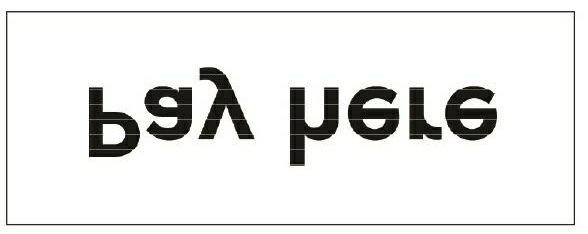
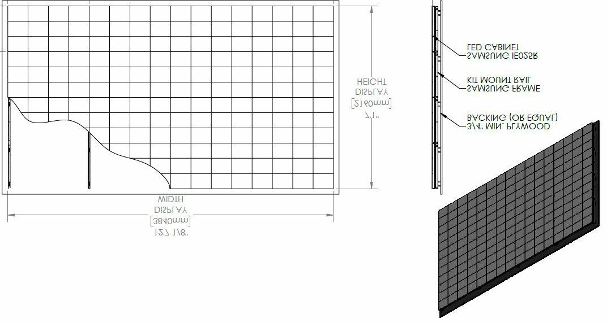
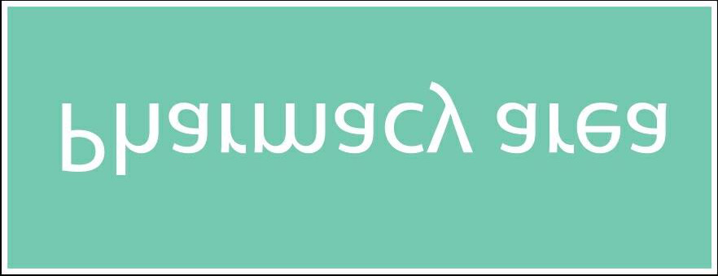
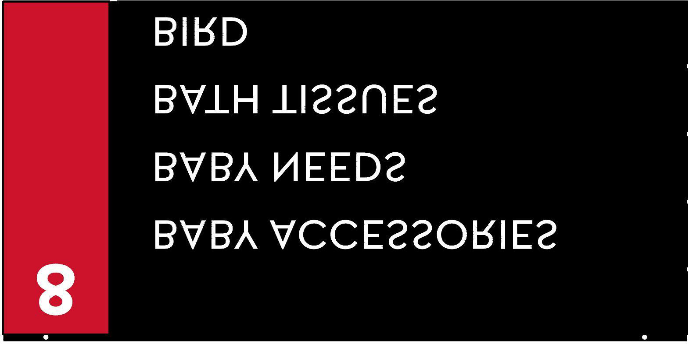
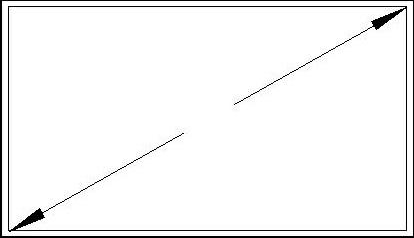
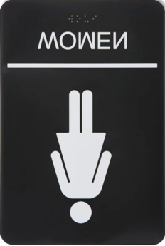
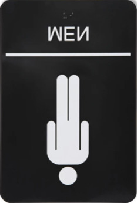

# F6.2 Aurora Food Store - DECOR PACKAGE R01

**Source**: `F6.2 Aurora Food Store - DECOR PACKAGE R01.pdf`  
**Pages**: 1  
**Extracted**: 2026-01-09 18:29:27

---

## Page 1

APPROVAL
ISSUED
REVISION

CONFIDENTIAL

0
. FIRST DRAFT
2024.07.22

2024.12.03

REGINA
SK

THIS DRAWING, AS AN INSTRUMENT OF SERVICE, IS 
PROVIDED BY AND IS THE PROPERTY OF THE GETREAL 
SERVICES. THE CONTRACTOR MUST VERIFY AND 
ACCEPT RESPONSIBILITY FOR ALL DIMENSIONS AND 
CONDITIONS ON SITE AND MUST NOTIFY THE GETREAL 
OF ANY VARIATIONS FROM THE SUPPLIED 
INFORMATION. THIS DRAWING IS NOT TO BE SCALED. 
GETREAL SERVICES IS NOT RESPONSIBLE FOR THE 
ACCURACY OF SURVEY, STRUCTURAL, MECHANICAL, 
ELECTRICAL AND OTHER CONSULTANT INFORMATION 
SHOWN ON THIS DRAWING. REFER TO THE 
APPROPRIATE CONSULTANT'S DRAWINGS BEFORE 
PROCEEDING WITH THE WORK. CONSTRUCTION MUST 
CONFORM TO ALL APPLICABLE CODES AND 
REQUIREMENTS OF AUTHORITIES HAVING 
JURISDICTION. THE CONTRACTOR WORKING FROM 
DRAWINGS NOT SPECIFICALLY MARKED "FOR 
CONSTRUCTION' MUST ASSUME FULL RESPONSIBILITY 
AND BEAR COSTS FOR ANY CORRECTIONS OR 
DAMAGES RESULTING FROM HIS WORK. 

FOOD STORE

JOB NUMBER:

DRAWN:
CHECKED:
APPROVED:

REV.
DESCRIPTION
DATE

DRAWING NUMBER:
REVISION NUMBER:

24058
2024.07.22

NN
PP
--

1
. REMOVES VARIOUS NOTES;
TRANSFERRED TO MATRIX CHART
ON SHEET F0.2.
. ADD PHARMACY AREA SIGNAGE.
. REMOVE OTC HEADERS.

SIGNAGE KEY
SIGNAGE KEY
SIGNAGE KEY
SIGNAGE KEY

Inc.

PLAN SALES
PLAN SALES
PLAN SALES
PLAN SALES

R1
R1
R1
R1
F6.2
F6.2
F6.2
F6.2

1/8" = 1'-0"

SCALE:
DATE:

FLOOR
FLOOR
FLOOR
FLOOR

4980 TAHOE BLVD.
MISSISSAUGA, ON
L4V 0C7
(T) 905 238 7124
(F) 905 614 5416

AURORA

TIER 1

DRAWING:

PROJECT:

SELF CHECK OUT TOPPER

50" TV SCREEN (TYP)
POWER REQUIRED
PROVIDED BY ICON

50" TV SCREEN (TYP)
POWER REQUIRED
PROVIDED BY ICON

50" TV SCREEN (TYP)
POWER REQUIRED
PROVIDED BY ICON

75" TV SCREEN
POWER REQUIRED
PROVIDED BY ICON

DENOTED IN BLUE

BILLBOARD
@8' - 6"A.F.F.
PROVIDED BY ICON

DENOTED IN BLUE

DENOTED IN BLUE

DENOTED IN BLUE

DENOTED IN BLUE

STORE LOGO
@ 5' - 0" A.F.F

75"

50"

50"

50"

PAY HERE

15' - 8"
172' - 0"

PL5HF12
AN
PL5HF12
AN

PL5LF12
AN

SEAFOOD 
COOLER

M

M

M

M

12' DUNNAGE c/w 18"B SHELF ABOVE @5'AFF
8'Lx18"W COOLER SHELVING

M

12' DUNNAGE c/w 18"B SHELF ABOVE @5'AFF

PRODUCE 
PREP

PRODUCE 
COOLER

BILLBOARD

PL5HF12
AN

STANDARD KIT

STANDARD KIT

14'-1"

13'-6"

HABA HEADER

BABY HEADER

M

SEAFOOD 
PREP.

50" TV SCREEN (TYP)

28'-8"

32'-0"

M

DLP-SW8
HP

NON-REFRIGERATED 
BUTCHER SHOP

PRODUCE SALES

150' - 0"
72' - 0"
38' - 0"

PL5LF12
AN
PL5LF12
AN
PL5LF12
AN
PL5LF12
AN

G

PV3-1-8
AN

SELF CHECK OUT

D190LC
AQ

PV3-2-6
AN

MEAT PREP

@ 8' - 0" A.F.F.

DOUBLE SIDED

50" TV SCREEN (TYP)

G

M

FLIP-UP

PV3-2-8
AN
PV3-2-8
AN

GMD8
HP

MEAT COOLER
MEAT KITCHEN
FREEZER

PV3-1-12
AN

M

PV3-2-6
AN

G

16' DUNNAGE c/w 18"B SHELF ABOVE @5'AFF

TO-G
AN

TO-G
AN

TO12
AN

G

VF6-8
AN
VF6-8
AN

SEAFOOD 
SALES

M

BILLBOARD
@8' - 6"A.F.F.
PROVIDED BY ICON

DENOTED IN BLUE

DP
SOUP/ RDEL

VF6-12
AN
VF6-8
AN
VF6-12
AN

50" TV SCREEN (TYP)

CWC-8R-RLS
HP

150 SHOPPING 
CARTS

RL4D
HM

RL5D
HM

KITCHEN 
COOLER

TO8
AN

TO-G
AN

TO-G
AN

50" TV SCREEN (TYP)
50" TV SCREEN (TYP)
50" TV SCREEN (TYP)

STOCK ROOM
STOCK ROOM
STOCK ROOM

BMD-12
HP
FC8-SNDW PREP
HM
PV3-1-6
AN

MEAT 
SALES

75" TV SCREEN

AN
PV03-8-6

BABY HEADER

G

R-3024 (S/C)
CD

BABY BOUTIQUE

AN
PV03-8-8

AN
PV03-8-8

SCHWEITZER. MOUNTING HEIGHT OF TOPPER SIGNAGER TBD AND ARTWORK TO BE REVIEWED 

TO8
AN

TO-G
AN

TO-G
AN

AN
PV03-8-6

WITH MERCH LAYOUT BY SOBEYS MARKETING PRIOR TO PRODUCTION BY SCHWEITZER

BABY HEADER

TOPPER SIGNAGE ARTWORK PROVIDED BY SOBEYS MARKETING AND SUPPLIED BY 

HMR PREP

M

HMR SALES

R

M

VESTIBULE

PVO3-2-12
AN

PVO3-2-8
AN

AN
PL5MF12
AN
PL5MF12

HP

BILLBOARD

HABA HEADER

CUSTOMER SERVICE

GROCERY
FREEZER

HARDT-IS6
HT

SELF CHECK OUT TOPPER

6
4
5

SEASONAL 
DROP ZONE

@ 8' - 0" A.F.F.

DOUBLE SIDED

HABA

DP
T011-4

PAY HERE

HABA HEADER

SELF CHECKOUTS

SELF CHECK OUT TOPPER

SELF CHECK OUT TOPPER

3
2
1

SEATING AREA

AISLE
AISLE
AISLE
AISLE
AISLE
AISLE
AISLE
AISLE
AISLE
AISLE
AISLE

AISLE
AISLE
AISLE
AISLE

G

TRENT
AN

SELF CHECK OUT TOPPER

SELF CHECK OUT TOPPER

NOTE:

TRENT
AN

RACHELLE BERY STREET SIGNS

RACHELLE BERY 
SHELVING

RACHELLE BERY STREET SIGNS

SELF CHECK OUT TOPPER

12 PALLETS
STORAGE

SELF CHECK OUT

CUSTOMER SERVICE

RACHELLE BERY STREET SIGNS

G

G

PV3-1-8
AN

PV3-1-8
AN

PV3-1-8
AN

PV3-1-8
AN

CHECKOUT LANE TOPPER

96-62-48 LH
LCR
96-62-48 LH
LCR

G

G

BILLBOARD

1

RACHELLE BERY STREET SIGNS

FRONT END CEILING BANNER  (DOUBLE
SIDED)

BILLBOARD
@8' - 6"A.F.F.
PROVIDED BY ICON

DENOTED IN BLUE

SS COUNTERTOP
EYEWASH STATION

CHECKOUT LANE TOPPER

WC2557
QBD
WC2557
QBD
WC2557
QBD

96-62-48 LH
LCR
96-62-48 LH
LCR
96-62-48 LH
LCR
96-62-48 LH
LCR
96-62-48 LH
LCR

8' - 0"

BOTTLES &
MIXER
DRAWER
24" FRIDGE

PHARMACY

PHARMACY
PHARMACY DROP-OFF

5
6
3
4
2
7

UPPER CABINET

PHARMACY
PHARMACY
PHARMACY
PHARMACY

PICK UP
DROP OFF

CHECKOUT LANE TOPPER

IRON
MOUNTAIN
SHREDDING
BIN

GROCERY

AISLE
AISLE
AISLE
AISLE

PHARMACY DROP-OFF
@ 7' - 0" A.F.F.

FRONT END CEILING BANNER  (DOUBLE
SIDED)

CHECKOUT LANE TOPPER

PHARMACY PREP. 
AREA

COMP. EQ.

25' - 0"

OTC

CHECKOUTS

CHECKOUT LANE TOPPER

303' - 0"

 U/C FRIDGE

CHECKOUT LANE TOPPER
@ 5' - 0" A.F.F.

FRONT END CEILING BANNER  (DOUBLE
SIDED)

CHECKOUT LANE TOPPER

50" TV SCREEN (TYP)

8' - 0"

CONSULTANT 
ROOM

CHECKOUT LANE TOPPER

PHARMACY

PHARMACY
@ 7' - 0" A.F.F.

FRONT END CEILING BANNER  (DOUBLE
SIDED)

120VT REC @60"AFF

8' - 0"

TO-G
AN

TO-G
AN

TO8
AN

8'Lx18"W COOLER SHELVING

AISLE

FRONT END CEILING BANNER
(DOUBLE SIDED)
@8' - 0" A.F.F

20' CARLTON CARDS (VENDOR SUPPLIED)

6CAYUGA
FLORAL
TABLES

FPO

WASHROOM

 20.5"B / 72"H

IDD5SU-12
HM
IDD5SU-12
HM
IDD5SU-12
HM
IDD5SU-12
HM

IDD5SU-12
HM

IDD5SU-8
HM

RL3D
HM

RL5D
HM
RL4D
HM
RL5D
HM
RL5D
HM
RL5D
HM

TO-G
AN

TO-G
AN

TO8
AN

50" TV SCREEN (TYP)
POWER REQUIRED
PROVIDED BY ICON

DENOTED IN BLUE

DAIRY SALES

FROZEN
FOOD

UNIVERSAL 
WASHRM
BF 
W/M
JAN.
ROOM

BAKERY 
COOLER
DAIRY 
COOLER

AISLE

FLORAL PREP. 
AREA
FLORAL COOLER

8' - 0"

50"

BARRIER FREE WASHROOM

RL5D
HM
RL4D
HM
RL3D
HM
RL5D
HM
RL5D
HM

IDD5SU-8
HM

RL3D
HM

TO-G
AN

TO-G
AN

TO8
AN

RL5D
HM
RL4D
HM
RL3D
HM
RL5D
HM
RL5D
HM

UNIVERSAL WASHROOM

FLORAL SALES

12'Lx18"W COOLER SHELVING

AISLE

8' - 0"

24"X24"X72"
AIR FILLED
BALLOON
DISPLAY

WASHROOM
@ 8' - 0" A.F.F.
1/4" BLEED

12' LOW PROFILE
REF. FLORAL (50"H)

8'Lx18"W SHELVING

4'Lx18"W SHELVING

UP
19R

G

NOVA-FL-3T-487250
CD

RL3D
HM

PHARMACY
@ 8' - 0" A.F.F.

RL5D
HM
RL4D
HM
RL5D
HM
RL5D
HM

AN
PL5MF8

NOVA-FL-3T-487250
CD

AN
PL5MF8
AN
PL5MF12

M

M

IT ROOM
FILE MAINT.
OFFICE
CASH
OFFICE

G

POT WASHER

#5-BSR4
DP
#3-BSS4
DP

BAKERY SALES

OB-6-SOB
CD

50" TV SCREEN (TYP)

G2V-B41-8
AN

BRSPM
CD

STORE MAN.
OFFICE
eLEARN
OFFICE

BRSPM
CD

SHEETER

FLIP-UP

CORRIDOR

ROUNDER

BULK FOOD

80QT. MIXER

SCRATCH 
BAKERY PREP. 
AREA

FLOOR SCALE

G2V-B41-12
AN

WATER FILTER

SPIRAL MIXER

FLIP-UP

50" TV SCREEN (TYP)

DELI PREP.
AREA

DLPC12
HP

CHEESE PREP.
AREA

BAKERY 
FREEZER

DLPC8
HP

DEP.
MAN.
OFFICE

8'Lx18"W SHELVING

DELI 
COOLER

BILLBOARD

BARRIER FREE WASHROOM
@ 5' - 0" A.F.F.
1/8" THK

SN-04L
3C-24X20

8'Lx18"W SHELVING

50" TV SCREEN (TYP)

DN

5'-10"

RECEIVING AREA

20 PALLETS

1/8" = 1'-0"
F6.2
1
GROUND FLOOR LEVEL
GROUND FLOOR LEVEL
GROUND FLOOR LEVEL
GROUND FLOOR LEVEL

UNIVERSAL WASHROOM
@ 5' - 0" A.F.F.
1/8" THK

STAIRS

38' - 0"
134' - 0"

AISLE
@ 8' - 0" A.F.F.

FEMALE WASHROOM
@ 5' - 0" A.F.F.
1/8" THK

50" TV SCREEN (TYP)
POWER REQUIRED
PROVIDED BY ICON

50" TV SCREEN (TYP)
POWER REQUIRED
PROVIDED BY ICON

50" TV SCREEN (TYP)
POWER REQUIRED
PROVIDED BY ICON

BILLBOARD
@8' - 6"A.F.F.
PROVIDED BY ICON

DENOTED IN BLUE

DENOTED IN BLUE

DENOTED IN BLUE

DENOTED IN BLUE

17' - 2"

50"

50"

50"

DN
19R

MALE WASHROOM
FEMALE WASHROOM

MALE WASHROOM
@ 5' - 0" A.F.F.
1/8" THK

MEN'S WR

WOMEN'S 
WR

47' - 4"

42' - 6"

1/8" = 1'-0"
F6.2
2
STAFF MEZZANINE
STAFF MEZZANINE
STAFF MEZZANINE
STAFF MEZZANINE

50" TV SCREEN (TYP)

LUNCH ROOM

50" TV SCREEN (TYP)
POWER REQUIRED
PROVIDED BY ICON

DENOTED IN BLUE

50"

23' - 7"

