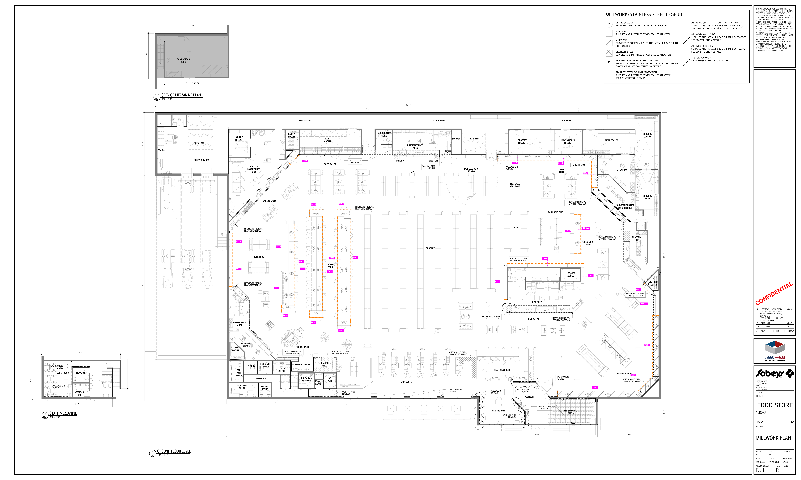

# F8.1 Millwork Plan Aurora Food Store - DECOR PACKAGE R01

**Source**: `F8.1 Millwork Plan Aurora Food Store - DECOR PACKAGE R01.pdf`  
**Pages**: 1  
**Extracted**: 2026-01-09 18:29:36

---

## Page 1

APPROVAL
ISSUED
REVISION

0
. FIRST DRAFT
2024.07.22

2024.12.03

CONFIDENTIAL

REGINA
SK

THIS DRAWING, AS AN INSTRUMENT OF SERVICE, IS 
PROVIDED BY AND IS THE PROPERTY OF THE GETREAL 
SERVICES. THE CONTRACTOR MUST VERIFY AND 
ACCEPT RESPONSIBILITY FOR ALL DIMENSIONS AND 
CONDITIONS ON SITE AND MUST NOTIFY THE GETREAL 
OF ANY VARIATIONS FROM THE SUPPLIED 
INFORMATION. THIS DRAWING IS NOT TO BE SCALED. 
GETREAL SERVICES IS NOT RESPONSIBLE FOR THE 
ACCURACY OF SURVEY, STRUCTURAL, MECHANICAL, 
ELECTRICAL AND OTHER CONSULTANT INFORMATION 
SHOWN ON THIS DRAWING. REFER TO THE 
APPROPRIATE CONSULTANT'S DRAWINGS BEFORE 
PROCEEDING WITH THE WORK. CONSTRUCTION MUST 
CONFORM TO ALL APPLICABLE CODES AND 
REQUIREMENTS OF AUTHORITIES HAVING 
JURISDICTION. THE CONTRACTOR WORKING FROM 
DRAWINGS NOT SPECIFICALLY MARKED "FOR 
CONSTRUCTION' MUST ASSUME FULL RESPONSIBILITY 
AND BEAR COSTS FOR ANY CORRECTIONS OR 
DAMAGES RESULTING FROM HIS WORK. 

FOOD STORE

JOB NUMBER:

MILLWORK PLAN
MILLWORK PLAN
MILLWORK PLAN
MILLWORK PLAN

DRAWN:
CHECKED:
APPROVED:

REV.
DESCRIPTION
DATE

DRAWING NUMBER:
REVISION NUMBER:

24058
2024.07.22

NN
PP
--

1
. UPDATED MILLWORK LEGEND.
. UPDATE WALL DADO EXTENTS AT
SEAFOOD COOLER, VESTIBULE,
SEATING AREA
. ADD HMR DRY SUSHI MILLWORK
TO SCOPE OF WORK.

Inc.

R1
R1
R1
R1
F8.1
F8.1
F8.1
F8.1

As indicated

SCALE:
DATE:

4980 TAHOE BLVD.
MISSISSAUGA, ON
L4V 0C7
(T) 905 238 7124
(F) 905 614 5416

AURORA

TIER 1

DRAWING:

PROJECT:

MILLWORK WALL DADO
SUPPLIED AND INSTALLED BY GENERAL CONTRACTOR
SEE CONSTRUCTION DETAILS

MILLWORK CHAIR RAIL
SUPPLIED AND INSTALLED BY GENERAL CONTRACTOR
SEE CONSTRUCTION DETAILS

X
METAL FASCIA
SUPPLIED AND INSTALLED BY SOBEYS SUPPLIER
SEE CONSTRUCTION DETAILS

1/2" GIS PLYWOOD
FROM FINISHED FLOOR TO 8'-0" AFF

MILLWORK/STAINLESS STEEL LEGEND

MILLWORK
PROVIDED BY SOBEYS SUPPLIER AND INSTALLED BY GENERAL 
CONTRACTOR

REMOVABLE STAINLESS STEEL CASE GUARD
PROVIDED BY SOBEYS SUPPLIER AND INSTALLED BY GENERAL 
CONTRACTOR. SEE CONSTRUCTION DETAILS

STAINLESS STEEL COLUMN PROTECTION
SUPPLIED AND INSTALLED BY GENERAL CONTRACTOR.
SEE CONSTRUCTION DETAILS

MILLWORK
SUPPLIED AND INSTALLED BY GENERAL CONTRACTOR

STAINLESS STEEL
SUPPLIED AND INSTALLED BY GENERAL CONTRACTOR

DETAIL CALLOUT
REFER TO STANDARD MILLWORK DETAIL BOOKLET

15' - 8"
172' - 0"

PL5HF12
AN
PL5HF12
AN

PL5LF12
AN

SEAFOOD 
COOLER

M

M

M

M

12' DUNNAGE c/w 18"B SHELF ABOVE @5'AFF
8'Lx18"W COOLER SHELVING

M

12' DUNNAGE c/w 18"B SHELF ABOVE @5'AFF

PRODUCE 
PREP

PRODUCE 
COOLER

PL5HF12
AN

FS5.1

14'-1"

13'-6"

FS4.2??

REFER TO ARCHITECTURAL 

DRAWINGS FOR DETAILS

M

REFER TO ARCHITECTURAL 

SEAFOOD 
PREP.

DRAWINGS FOR DETAILS

FS4.1

28'-8"

32'-0"

M

DLP-SW8
HP

FS5.2

NON-REFRIGERATED 
BUTCHER SHOP

PRODUCE SALES

150' - 0"
72' - 0"
38' - 0"

PL5LF12
AN
PL5LF12
AN
PL5LF12
AN
PL5LF12
AN

G

PV3-1-8
AN

D190LC
AQ

PV3-2-6
AN

MEAT PREP

G

M

FLIP-UP

PV3-2-8
AN
PV3-2-8
AN

GMD8
HP

MEAT COOLER
MEAT KITCHEN
FREEZER

REFER TO ARCHITECTURAL 

DRAWINGS FOR DETAILS

PV3-1-12
AN

M

PV3-2-6
AN

G

16' DUNNAGE c/w 18"B SHELF ABOVE @5'AFF

TO-G
AN

TO-G
AN

TO12
AN

G

FS5.3

VF6-8
AN
VF6-8
AN

SEAFOOD 
SALES

FS9.3

M

FS10.2

FS3.3

DP
SOUP/ RDEL

VF6-12
AN
VF6-8
AN
VF6-12
AN

REFER TO ARCHITECTURAL 

DRAWINGS FOR DETAILS

MILLWORK BY GC

CWC-8R-RLS
HP

150 SHOPPING 
CARTS

RL4D
HM

RL5D
HM

KITCHEN 
COOLER

TO8
AN

TO-G
AN

TO-G
AN

STOCK ROOM
STOCK ROOM
STOCK ROOM

FS10.1

REFER TO ARCHITECTURAL 

DRAWINGS FOR DETAILS

WALL DADO TO BE 

BMD-12
HP
FC8-SNDW PREP
HM
PV3-1-6
AN

MEAT 
SALES

INSTALLED

FS3.1
FS3.2

BABY BOUTIQUE

AN
PV03-8-6

G

R-3024 (S/C)
CD

AN
PV03-8-8

AN
PV03-8-8

WALL DADO TO BE 

TO8
AN

TO-G
AN

TO-G
AN

INSTALLED

FS9.2

AN
PV03-8-6

HMR PREP

M

HMR SALES

R

M

VESTIBULE

PVO3-2-12
AN

PVO3-2-8
AN

AN
PL5MF12
AN
PL5MF12

WALL DADO TO BE 

HP

INSTALLED

REFER TO ARCHITECTURAL 

GROCERY
FREEZER

DRAWINGS FOR DETAILS

HARDT-IS6
HT

6
4
5

SEASONAL 
DROP ZONE

HABA

INSTALLED
WALL DADO TO BE 

WALL DADO TO BE 

DP
T011-4

INSTALLED

INSTALLED

SELF CHECKOUTS

3
2
1

SEATING AREA

WALL DADO TO BE 

REFER TO ARCHITECTURAL 

DRAWINGS FOR DETAILS

FS9.1

G

INSTALLED

TRENT
AN

TRENT
AN

12 PALLETS
STORAGE

OTC
RACHELLE BERY 
SHELVING

G

G

PV3-1-8
AN

PV3-1-8
AN

PV3-1-8
AN

DRAWINGS FOR DETAILS
REFER TO ARCHITECTURAL 

DRAWINGS FOR DETAILS

PV3-1-8
AN

WALL DADO TO BE 

96-62-48 LH
LCR
96-62-48 LH
LCR

G

G

1

INSTALLED

SS COUNTERTOP
EYEWASH STATION

WC2557
QBD
WC2557
QBD
WC2557
QBD

96-62-48 LH
LCR
96-62-48 LH
LCR
96-62-48 LH
LCR
96-62-48 LH
LCR
96-62-48 LH
LCR

BOTTLES &
MIXER
DRAWER

5
6
3
4
2
7

UPPER CABINET

24" FRIDGE

PICK UP
DROP OFF

IRON
MOUNTAIN
SHREDDING
BIN

WALL DADO TO BE 

GROCERY

PHARMACY PREP. 
AREA

COMP. EQ.

CHECKOUTS

303' - 0"

 U/C FRIDGE

CONSULTANT 
ROOM

120VT REC @60"AFF

REFER TO ARCHITECTURAL 

DRAWINGS FOR DETAILS

TO-G
AN

TO-G
AN

TO8
AN

WALL DADO TO BE 

8'Lx18"W COOLER SHELVING

INSTALLED

FS8.4

20' CARLTON CARDS (VENDOR SUPPLIED)

6CAYUGA
FLORAL
TABLES

WALL DADO TO BE 

REFER TO ARCHITECTURAL 

INSTALLED

 20.5"B / 72"H

IDD5SU-12
HM
IDD5SU-12
HM
IDD5SU-12
HM
IDD5SU-12
HM

IDD5SU-12
HM

IDD5SU-8
HM

RL3D
HM

FS8.3

FS8.1

RL5D
HM
RL4D
HM
RL5D
HM
RL5D
HM
RL5D
HM

TO-G
AN

TO-G
AN

TO8
AN

DAIRY SALES

FS8.2

FROZEN
FOOD

FS7.4

UNIVERSAL 
WASHRM
BF 
W/M
JAN.
ROOM

BAKERY 
COOLER
DAIRY 
COOLER

FLORAL PREP. 
AREA
FLORAL COOLER

RL5D
HM
RL4D
HM
RL3D
HM
RL5D
HM
RL5D
HM

IDD5SU-8
HM

RL3D
HM

TO-G
AN

TO-G
AN

TO8
AN

FS7.3

FS7.1

RL5D
HM
RL4D
HM
RL3D
HM
RL5D
HM
RL5D
HM

FLORAL SALES

12'Lx18"W COOLER SHELVING

FS2.1

FS7.2

FS6.4

24"X24"X72"
AIR FILLED
BALLOON
DISPLAY

REFER TO ARCHITECTURAL 

12' LOW PROFILE
REF. FLORAL (50"H)

DRAWINGS FOR DETAILS

8'Lx18"W SHELVING

4'Lx18"W SHELVING

UP
19R

G

NOVA-FL-3T-487250
CD

RL3D
HM

RL5D
HM
RL4D
HM
RL5D
HM
RL5D
HM

AN
PL5MF8

NOVA-FL-3T-487250
CD

FS6.1

AN
PL5MF8
AN
PL5MF12

M

M

IT ROOM
FILE MAINT.
OFFICE
CASH
OFFICE

G

POT WASHER

#5-BSR4
DP
#3-BSS4
DP

FS6.3

FS6.2

BAKERY SALES

OB-6-SOB
CD

G2V-B41-8
AN

BRSPM
CD

STORE MAN.
OFFICE
eLEARN
OFFICE

BRSPM
CD

SHEETER

FLIP-UP

CORRIDOR

ROUNDER

BULK FOOD

REFER TO ARCHITECTURAL 

REFER TO ARCHITECTURAL 

80QT. MIXER

SCRATCH 
BAKERY PREP. 
AREA

DRAWINGS FOR DETAILS

DRAWINGS FOR DETAILS

FLOOR SCALE

G2V-B41-12
AN

WATER FILTER

SPIRAL MIXER

FLIP-UP

DELI PREP.
AREA

DLPC12
HP

CHEESE PREP.
AREA

BAKERY 
FREEZER

DLPC8
HP

DEP.
MAN.
OFFICE

8'Lx18"W SHELVING

FS1.2

FS1.1

DELI 
COOLER

SN-04L
3C-24X20

8'Lx18"W SHELVING

DN

5'-10"

1.5 METRE CLEARANCE

RECEIVING AREA

20 PALLETS

1/8" = 1'-0"
F8.1
3
SERVICE MEZZANINE PLAN
SERVICE MEZZANINE PLAN
SERVICE MEZZANINE PLAN
SERVICE MEZZANINE PLAN

38' - 10"

44' - 4"

1/8" = 1'-0"
F8.1
1
GROUND FLOOR LEVEL
GROUND FLOOR LEVEL
GROUND FLOOR LEVEL
GROUND FLOOR LEVEL

COMPRESSOR 
ROOM

1M CLEARANCE

STAIRS

26' - 8"

38' - 0"
134' - 0"

17' - 2"

DN
19R

MEN'S WR

WOMEN'S 
WR

47' - 4"

42' - 6"

1/8" = 1'-0"
F8.1
2
STAFF MEZZANINE
STAFF MEZZANINE
STAFF MEZZANINE
STAFF MEZZANINE

LUNCH ROOM

WALL DADO TO BE 

WALL DADO TO BE 

INSTALLED

INSTALLED

23' - 7"

