# SAF-TRE-003-R3[21]

**Source**: `SAF-TRE-003-R3[21].pdf`  
**Pages**: 32  
**Extracted**: 2026-01-09 18:29:38

---

## Page 1

NOTE: LENGTH OF CABLE TBD
           NUMBER OF HANGING POINTS: PLEASE SEE
           J.H. COHOON ENGINEERING LETTER
 
APPROXIMATE WEIGHT: 400 LBS
HANGING CABLE AND HARDWARE SUPPLIED BY OTHERS
 
SEND EXTRA HARDWARE WITH NON ASSEMBLED PARTS 

3 Adi Dassler Way

Paris, ON.

N3L OB9
Tel. 1.519.442.7000
Fax 1.519.442.7535

3
4 HEX HEAD FLANGE BOLT
- 1/4-20 RAMPA
 

- 1/4-20X

THIS DRAWING IS THE PROPERTY OF TC.
PARIS AND CANNOT BE REPRODUCED IN
ANY WAY WITHOUT CONSENT OF TC. PARIS 

Revisions

REV
DESCRIPTION
DATE
BY:

1
INITIAL CONCEPT
03/21/2023
NH

2
SIZE CHANGES
2023-07-21
NH

3
HARDWARE CHANGE
2024-04-16
NH

614 in
[15596 mm]

Customer Approval & Date

_________________
DENOTES 

90 in
[2286 mm]
90 in
[2286 mm]
90 in
[2286 mm]
90 in
[2286 mm]
90 in
[2286 mm]
90 in
[2286 mm]

36 in
[914 mm]

O.C

276 3/32 in

[7013 mm]

REVISION

18 in
[457 mm]

Project:

O.C

SAFEWAY EVOLUTION

DESIGN

Document Title:

100 in
[2540 mm]

108 in
[2743 mm]

108 in
[2743 mm]

108 in
[2743 mm]

108 in
[2743 mm]

82 in
[2083 mm]

Manufacturing Status:

Scale:

1 / 100

APPROVED

B
/ 11" x 17"

PM/PC:

Drawn By:

hawleyn

Job Number:

Revision Level:

3

9 1/4 in
[235 mm]
11 11/16 in

2 7/16 in

[297 mm]

[62 mm]

Drawing Page: 

1 
32 

Of

Part Number:

SAF-TRE-003

C:\Engineering\Projects\Wood\SOBEYS (SOB)\SAF-TRE-003--Safeway Evolution Design Prototype\SAF-TRE-003.idw

## Page 2

49
40

73

48

1" X 14" SINTRA 

3 Adi Dassler Way

JOINER BLOCK,
TO BE SHIPPED LOOSE

Paris, ON.

N3L OB9
Tel. 1.519.442.7000
Fax 1.519.442.7535

THIS DRAWING IS THE PROPERTY OF TC.
PARIS AND CANNOT BE REPRODUCED IN
ANY WAY WITHOUT CONSENT OF TC. PARIS 

DETAIL  A
SCALE 1 / 8

Revisions

DETAIL  C
SCALE 1 / 8

DETAIL  B
SCALE 1 / 8

Customer Approval & Date

_________________
DENOTES 

30

29

1

32

31

2

REVISION

3

A

4

C

5

Project:

SAFEWAY EVOLUTION

6

B

DESIGN

7

Document Title:

47
46

DETAILS

8

Manufacturing Status:

Scale:

1 /64

9
10

APPROVED

B
/ 11" x 17"

13

11

PM/PC:

14

45

17

12

Drawn By:

hawleyn

20

22

15

44

43

Job Number:

24

25

21

23

16

Revision Level:

19

41
27
28
33

3

42

26

Drawing Page: 

2 
32 

Of

Part Number:

SAF-TRE-003

C:\Engineering\Projects\Wood\SOBEYS (SOB)\SAF-TRE-003--Safeway Evolution Design Prototype\SAF-TRE-003.idw

## Page 3

3 Adi Dassler Way

Paris, ON.

VU2-CS23 - 23 mm CONNECTOR STRAIGHT BRACKET ASSEMBLY
VU2-CS23
52
48

N3L OB9
Tel. 1.519.442.7000
Fax 1.519.442.7535

Hex Head Screws, Medium-Strength, 1/4"-20 x 3/4" L
McMasterCarr 92979A118
351
73

SEG DOUBLE SLEEVE TRIM, 50mmx30mm x 108"
EXT5030-108
18
32

SEG DOUBLE SLEEVE TRIM, 50mmx30mmx100"
EXT5030-100
4
29

SEG DOUBLE SLEEVE TRIM, 50mmx30mm x 82"
EXT5030-82
4
30

SEG DOUBLE SLEEVE TRIM, 50mmx30mm x 64"
EXT5030-64
3
31

SEG DOUBLE SLEEVE TRIM, 50mmx30mm x 28"
EXT5030-28
2
34

SEG DOUBLE SLEEVE TRIM, 50mmx30mm x 46"
EXT5030-46
3
35

THIS DRAWING IS THE PROPERTY OF TC.
PARIS AND CANNOT BE REPRODUCED IN
ANY WAY WITHOUT CONSENT OF TC. PARIS 

HRL-12L-835-3500K-347V-DIM-LFA
A LINE-FLX38
30
39

Revisions

ASSEMBLY FULL BEAM GG
SAF-TRE-003-A33
1
27

ASSEMBLY FULL BEAM DD
SAF-TRE-003-A30
1
25

ASSEMBLY FULL BEAM HH
SAF-TRE-003-A34
1
28

ASSEMBLY FULL BEAM CC
SAF-TRE-003-A29
1
42

ASSEMBLY FULL BEAM AA
SAF-TRE-003-A27
1
23

ASSEMBLY FULL BEAM BB
SAF-TRE-003-A28
1
24

ASSEMBLY FULL BEAM EE
SAF-TRE-003-A31
1
26

BEAM HANGING BRACKET
SAF-TRE-001-M07
360
40

ASSEMBLY FULL BEAM FF
SAF-TRE-003-A32
1
41

ASSEMBLY FULL BEAM W
SAF-TRE-003-A23
1
19

ASSEMBLY FULL BEAM M
SAF-TRE-003-A13
1
11

ASSEMBLY FULL BEAM G
SAF-TRE-003-A07
1
7

ASSEMBLY FULL BEAM O
SAF-TRE-003-A15
1
13

ASSEMBLY FULL BEAM Q
SAF-TRE-003-A17
1
44

ASSEMBLY FULL BEAM C
SAF-TRE-003-A03
1
3

ASSEMBLY FULL BEAM D
SAF-TRE-003-A04
1
4

ASSEMBLY FULL BEAM N
SAF-TRE-003-A14
1
12

ASSEMBLY FULL BEAM R
SAF-TRE-003-A18
1
14

ASSEMBLY FULL BEAM U
SAF-TRE-003-A21
1
17

ASSEMBLY FULL BEAM H
SAF-TRE-003-A08
1
47

ASSEMBLY FULL BEAM A
SAF-TRE-003-A01
1
1

ASSEMBLY FULL BEAM B
SAF-TRE-003-A02
1
2

ASSEMBLY FULL BEAM E
SAF-TRE-003-A05
1
5

ASSEMBLY FULL BEAM K
SAF-TRE-003-A11
1
9

ASSEMBLY FULL BEAM S
SAF-TRE-003-A19
1
15

ASSEMBLY FULL BEAM X
SAF-TRE-003-A24
1
20

ASSEMBLY FULL BEAM Y
SAF-TRE-003-A25
1
21

ASSEMBLY FULL BEAM V
SAF-TRE-003-A22
1
43

ASSEMBLY FULL BEAM P
SAF-TRE-003-A16
1
45

BEAM AA FLAT PATTERN
SAF-TRE-003-01-AAFP
2
71

BEAM BB FLAT PATTERN
SAF-TRE-003-01-BBFP
1
72

ASSEMBLY FULL BEAM F
SAF-TRE-003-A06
1
6

ASSEMBLY FULL BEAM T
SAF-TRE-003-A20
1
16

ASSEMBLY FULL BEAM Z
SAF-TRE-003-A26
1
22

ASSEMBLY FULL BEAM II
SAF-TRE-003-A35
1
33

ASSEMBLY FULL BEAM L
SAF-TRE-003-A12
1
10

ASSEMBLY FULL BEAM J
SAF-TRE-003-A10
1
8

ASSEMBLY FULL BEAM I
SAF-TRE-003-A09
1
46

BEAM G FLAT PATTERN
SAF-TRE-003-01-GFP
8
56

BEAM O FLAT PATTERN
SAF-TRE-003-01-OFP
2
61

BEAM C FLAT PATTERN
SAF-TRE-003-01-CFP
2
52

BEAM D FLAT PATTERN
SAF-TRE-003-01-DFP
8
53

BEAM R FLAT PATTERN
SAF-TRE-003-01-RFP
4
62

BEAM U FLAT PATTERN
SAF-TRE-003-01-UFP
2
65

BEAM A FLAT PATTERN
SAF-TRE-003-01-AFP
1
50

BEAM B FLAT PATTERN
SAF-TRE-003-01-BFP
2
51

BEAM E FLAT PATTERN
SAF-TRE-003-01-EFP
4
54

BEAM K FLAT PATTERN
SAF-TRE-003-01-KFP
4
59

BEAM S FLAT PATTERN
SAF-TRE-003-01-SFP
2
63

BEAM V FLAT PATTERN
SAF-TRE-003-01-VFP
5
66

BEAM V FLAT PATTERN
SAF-TRE-003-01-WFP
1
67

BEAM X FLAT PATTERN
SAF-TRE-003-01-XFP
2
68

BEAM Y FLAT PATTERN
SAF-TRE-003-01-YFP
2
69

BEAM F FLAT PATTERN
SAF-TRE-003-01-FFP
4
55

BEAM T FLAT PATTERN
SAF-TRE-003-01-TFP
2
64

BEAM Z FLAT PATTERN
SAF-TRE-003-01-ZFP
2
70

BEAM L FLAT PATTERN
SAF-TRE-003-01-LFP
2
60

BEAM J FLAT PATTERN
SAF-TRE-003-01-JFP
2
58

BEAM I FLAT PATTERN
SAF-TRE-003-01-IFP
4
57

POWER TRACK 96"L
POWER TRACK-96
7
36

POWER TRACK 96"L
POWER TRACK-24
5
37

POWER TRACK 72"L
POWER TRACK-72
2
38

HANGING CLIP
SAF-TRE-001-M06
36
49

DESCRIPTION
PART NUMBER
QTY
ITEM

TC Standard Assembly Parts List

DENOTES 

REVISION

Project:

SAFEWAY EVOLUTION

DESIGN

Document Title:

DETAILS

Manufacturing Status:

Scale:

APPROVED

B
/ 11" x 17"

PM/PC:

Drawn By:

Job Number:

Revision Level:

3

Drawing Page: 

3 
32 

Of

Part Number:

SAF-TRE-003

C:\Engineering\Projects\Wood\SOBEYS (SOB)\SAF-TRE-003--Safeway Evolution Design Prototype\SAF-TRE-003.idw

## Page 4

Z AA BB CC DD EE FF

GG

HH

Y

C
D
E
F
G
H
I

X

II

W

B

J
K

3 Adi Dassler Way

V

Paris, ON.

L

T
U

A

N3L OB9
Tel. 1.519.442.7000
Fax 1.519.442.7535

M
N
O
P
Q
R
S

THIS DRAWING IS THE PROPERTY OF TC.
PARIS AND CANNOT BE REPRODUCED IN
ANY WAY WITHOUT CONSENT OF TC. PARIS 

Revisions

8 in
[203 mm]

Customer Approval & Date

2 in
[51 mm]

_________________
DENOTES 

PART LAYOUT

BEAM
PART NUMBER
DIMENSION
QTY

A
SAF-TRE-003-A01
64"
1

96 in
[2438 mm]
(SEE HANGING SPECIFICATIONS NOTE)

36 in
[914 mm]
(SEE HANGING SPECIFICATIONS NOTE)

B
SAF-TRE-003-A02
120"
1

C
SAF-TRE-003-A03
150"
1

REVISION

D
SAF-TRE-003-A04
170"
1

E
SAF-TRE-003-A05
185"
1

F
SAF-TRE-003-A06
195"
1

HANGING SPECIFICATIONS:
 
DENOTES APPROXIMATE LOCATION OF HANGING POINTS. LOCATION
MAY BE ADJUSTED TO SUIT SITE CONDITIONS. DO NOT EXCEED
MAXIMUM END AND INTERIOR SPACING NOTED.
 
1. MAX 8'-0" O/C BETWEEN U-CHANNEL HANGING POINTS
2. MAX 3'-0" FROM END OF U-CHANNEL
 
J.H. COHOON ENGINEERING LTD.
FILE #16441
 
NOTE: TO BE READ AND WORKED IN CONJUNCTION WITH LETTER
BY J.H. COHOON ENGINEERING DATED SEPT. 28, 2023

G
SAF-TRE-003-A07
200"
1

H
SAF-TRE-003-A08
200"
1

I
SAF-TRE-003-A09
200"
1

Project:

J
SAF-TRE-003-A10
195"
1

SAFEWAY EVOLUTION

K
SAF-TRE-003-A11
190"
1

DESIGN

L
SAF-TRE-003-A12
182"
1

M
SAF-TRE-003-A13
175"
1

Document Title:

N
SAF-TRE-003-A14
172"
1

O
SAF-TRE-003-A15
170"
1

P
SAF-TRE-003-A16
170"
1

Q
SAF-TRE-003-A17
170"
1

Manufacturing Status:

Scale:

R
SAF-TRE-003-A18
175"
1

1 1/4 in
[32 mm]

S
SAF-TRE-003-A19
178"
1

1 / 60

T
SAF-TRE-003-A20
185"
1

APPROVED

B
/ 11" x 17"

U
SAF-TRE-003-A21
190"
1

1 1/2 in
[38 mm]

V
SAF-TRE-003-A22
200"
1

2 in
[51 mm]

PM/PC:

W
SAF-TRE-003-A23
210"
1

X
SAF-TRE-003-A24
220"
1

Drawn By:

Y
SAF-TRE-003-A25
230"
1

hawleyn

EXT5030 (12') ALUMINUM

1 3/8 in
[35 mm]

Z
SAF-TRE-003-A26
235"
1

EXTRUSION CUT LIST

AA
SAF-TRE-003-A27
237"
1

Job Number:

BB
SAF-TRE-003-A28
237.50"
1

LENGTHS
TOTAL LENGTH
QTY

CC
SAF-TRE-003-A29
237"
1

LIGHT EXTRUSION PURCHASE LIST

Revision Level:

3

DD
SAF-TRE-003-A30
233"
1

1
28"
2

EE
SAF-TRE-003-A31
223"
1

2
46"
3

Drawing Page: 

LENGTHS
TOTAL LENGTH
QTY

FF
SAF-TRE-003-A32
210"
1

3
64"
3

4 
32 

Of

GG
SAF-TRE-003-A33
186"
1

4
82"
4

1
2'
5

Part Number:

5
100"
4

HH
SAF-TRE-003-A34
154"
1

2
6'
2

SAF-TRE-003

II
SAF-TRE-003-A35
102"
1

6
108"
18

3
8'
7

C:\Engineering\Projects\Wood\SOBEYS (SOB)\SAF-TRE-003--Safeway Evolution Design Prototype\SAF-TRE-003.idw

## Page 5

3 Adi Dassler Way

Paris, ON.

N3L OB9
Tel. 1.519.442.7000
Fax 1.519.442.7535

BB
CC DD
EE
FF

AA

GG

Z

HH

THIS DRAWING IS THE PROPERTY OF TC.
PARIS AND CANNOT BE REPRODUCED IN
ANY WAY WITHOUT CONSENT OF TC. PARIS 

Y

D
E
F
G

Revisions

X

H
I

C

II

W

B

J

K

V

Customer Approval & Date

L

_________________
DENOTES 

T
U

A

M

N
O
P
Q
R
S

5 7/8 in
[150 mm]

7 9/32 in
[185 mm]

REVISION

35 3/4 in
[908 mm]

35 25/32 in

[909 mm]

19 7/32 in

Project:

53 7/32 in
[1352 mm]

[488 mm]

SAFEWAY EVOLUTION

34 7/32 in

DESIGN

[869 mm]

29 15/16 in

43 17/32 in

[760 mm]

9 5/8 in
[244 mm]

Document Title:

[1106 mm]

4 27/32 in

22 11/32 in

15 5/8 in
[397 mm]

[123 mm]

26 31/32 in

[567 mm]

[685 mm]

29 3/16 in

15 3/4 in
[400 mm]

32 5/8 in
[829 mm]

2 5/16 in

21 11/16 in

[741 mm]

6 15/32 in

[59 mm]

Manufacturing Status:

Scale:

[551 mm]

13 1/4 in
[337 mm]

[164 mm]

19 in
[483 mm]

17 7/32 in

34 9/32 in

22 23/32 in

[437 mm]

20 21/32 in

1 / 48

[871 mm]

5 1/8 in
[130 mm]

1 31/32 in

[577 mm]

10 9/16 in

APPROVED

[525 mm]

[50 mm]

B
/ 11" x 17"

[268 mm]

21 17/32 in

16 1/32 in

22 19/32 in

13 15/16 in

[547 mm]

19 1/4 in
[489 mm]

[407 mm]

[574 mm]

21 31/32 in

[354 mm]

[558 mm]

PM/PC:

Drawn By:

hawleyn

Job Number:

Revision Level:

3

Drawing Page: 

5 
32 

Of

Part Number:

SAF-TRE-003

C:\Engineering\Projects\Wood\SOBEYS (SOB)\SAF-TRE-003--Safeway Evolution Design Prototype\SAF-TRE-003.idw

## Page 6

64 in
[1626 mm]
100 in
[2540 mm]

18 in
[457 mm]

64 in
[1626 mm]

18 in
[457 mm]

82 in
[2083 mm]

3 Adi Dassler Way

Paris, ON.

82 in
[2083 mm]
108 in
[2743 mm]
46 in
[1168 mm]

18 in
[457 mm]

28 in
[711 mm]

N3L OB9
Tel. 1.519.442.7000
Fax 1.519.442.7535

100 in
[2540 mm]

108 in
[2743 mm]

108 in
[2743 mm]

108 in
[2743 mm]

108 in
[2743 mm]

82 in
[2083 mm]

THIS DRAWING IS THE PROPERTY OF TC.
PARIS AND CANNOT BE REPRODUCED IN
ANY WAY WITHOUT CONSENT OF TC. PARIS 

Revisions

90 in
[2286 mm]

90 in
[2286 mm]

90 in
[2286 mm]

90 in
[2286 mm]

90 in
[2286 mm]

90 in
[2286 mm]

Customer Approval & Date

_________________
DENOTES 

36 in
[914 mm]

64 in
[1626 mm]

108 in
[2743 mm]

108 in
[2743 mm]

108 in
[2743 mm]

108 in
[2743 mm]

46 in
[1168 mm]

36 in
[914 mm]

28 in
[711 mm]

108 in
[2743 mm]

108 in
[2743 mm]

108 in
[2743 mm]

100 in
[2540 mm]

REVISION

90 in
[2286 mm]

46 in
[1168 mm]

108 in
[2743 mm]

108 in
[2743 mm]

28 in
[711 mm]

Project:

SAFEWAY EVOLUTION

DESIGN

Document Title:

EXTRUSION / LIGHTING

LAYOUT

1 1/4 in
[32 mm]

Manufacturing Status:

Scale:

1 / 50

APPROVED

B
/ 11" x 17"

2 in
[51 mm]

PM/PC:

EXT5030 (12') ALUMINUM

Drawn By:

EXTRUSION CUT LIST

hawleyn

Job Number:

LENGTHS
TOTAL LENGTH
QTY

1
28"
2

Revision Level:

3

2
46"
3

3
64"
3

Drawing Page: 

4
82"
4

6 
32 

Of

5
100"
4

Part Number:

6
108"
18

SAF-TRE-003

C:\Engineering\Projects\Wood\SOBEYS (SOB)\SAF-TRE-003--Safeway Evolution Design Prototype\SAF-TRE-003.idw

## Page 7

n13/32 in
[n10 mm]

3 Adi Dassler Way

17/32 in
[13 mm]

Paris, ON.

N3L OB9
Tel. 1.519.442.7000
Fax 1.519.442.7535

1 1/32 in

[27 mm]

1/32 in
[1 mm]

15/32 in
[12 mm]

THIS DRAWING IS THE PROPERTY OF TC.
PARIS AND CANNOT BE REPRODUCED IN
ANY WAY WITHOUT CONSENT OF TC. PARIS 

Revisions

5/8 in
[16 mm]

Customer Approval & Date

_________________
DENOTES 

8 in
[203 mm]

7 17/32 in

REVISION

[191 mm]

Project:

SAFEWAY EVOLUTION

DESIGN

Document Title:

2 in
[51 mm]

PARTS

R1/4 in
[R6 mm]

31/32 in
[25 mm]

Manufacturing Status:

Scale:

SAF-TRE-001-04

1 / 2

FINISHED END

SAF-TRE-001-02

APPROVED

STYWHI.020

B
/ 11" x 17"

SPACER SUPPORT

PVCWHI1 

PM/PC:

Drawn By:

hawleyn

Job Number:

Revision Level:

3

Drawing Page: 

7 
32 

Of

Part Number:

SAF-TRE-003

C:\Engineering\Projects\Wood\SOBEYS (SOB)\SAF-TRE-003--Safeway Evolution Design Prototype\SAF-TRE-003.idw

## Page 8

BGI Standard Assembly Parts List

DESCRIPTION
PART NUMBER
QTY
ITEM

JOINER BLOCK
SAF-TRE-001-06
1
1

1/2" VHB 3M D/S CLEAR TAPE - MODEL #S-10123
SAF-TRE-001-08
4
2

1 1/2 in
[38 mm]

1/2 in
[13 mm]

3 Adi Dassler Way

Paris, ON.

7 1/2 in
[191 mm]

N3L OB9
Tel. 1.519.442.7000
Fax 1.519.442.7535

1

THIS DRAWING IS THE PROPERTY OF TC.
PARIS AND CANNOT BE REPRODUCED IN
ANY WAY WITHOUT CONSENT OF TC. PARIS 

1 1/2 in
[38 mm]

1/2 in
[13 mm]

Revisions

BACK VIEW
SCALE 1 / 3

Customer Approval & Date

2

_________________
DENOTES 

14 in
[356 mm]

1 1/32 in

[26 mm]

2

SAF-TRE-001-06

JOINER BLOCK
MAT: PVCWHI1

TOP VIEW
SCALE 1 / 3

REVISION

PERSPECTIVE VIEW

SAF-TRE-001-A17

JOINER BLOCK

Project:

ASSEMBLY

SAFEWAY EVOLUTION

1 1/2 in
[38 mm]

DESIGN

Document Title:

1/2 in
[13 mm]

PARTS

7 1/2 in
[191 mm]

Manufacturing Status:

Scale:

NOTE:
THIS ASSEMBLY TO BE SHIPPED LOOSE.

1/2 in
[13 mm]

1 / 3

APPROVED

B
/ 11" x 17"

PM/PC:

1 1/2 in
[38 mm]

Drawn By:

Katarina BS

Job Number:

14 in
[356 mm]

1 1/32 in

[26 mm]

Revision Level:

3

SIDE VIEW
SCALE 1 / 3

FRONT VIEW

Drawing Page: 

SCALE 1 / 3

8 
32 

Of

Part Number:

SAF-TRE-003

C:\Engineering\Projects\Wood\SOBEYS (SOB)\SAF-TRE-003--Safeway Evolution Design Prototype\SAF-TRE-003.idw

## Page 9

BGI Standard Assembly Parts List

DESCRIPTION
PART NUMBER
QTY
ITEM

SPACER SUPPORT
SAF-TRE-001-02
6
1

FINISHED END
SAF-TRE-001-04
2
2

BEAM A
SAF-TRE-003-01-A
1
3

 
RAMPA1-4_20
4
4

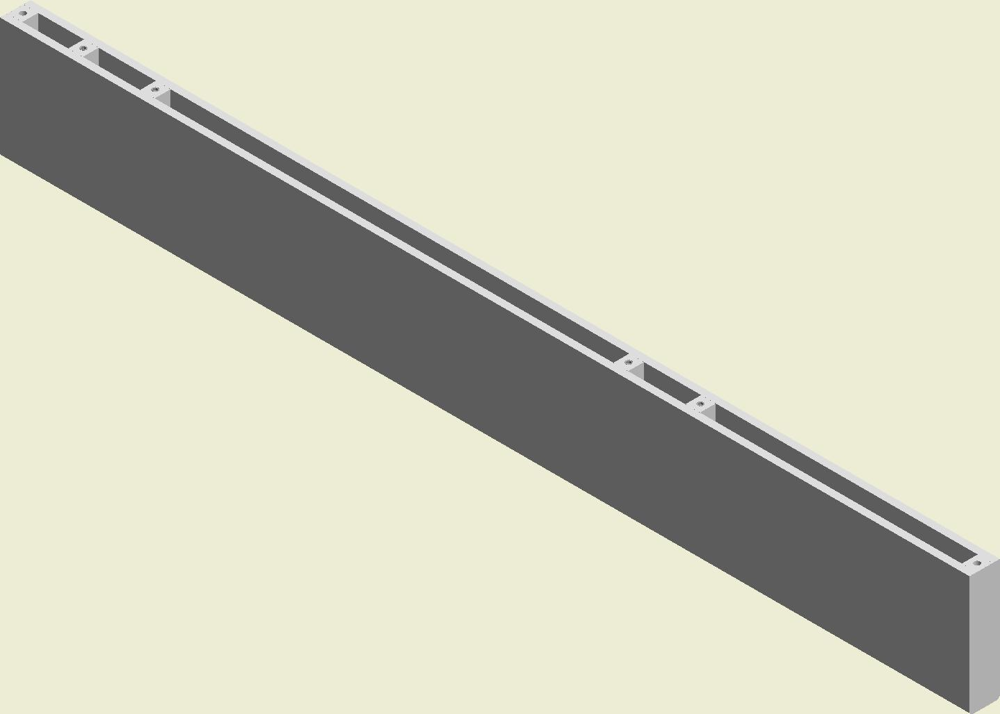

3 25/32 in

36 1/32 in

[96 mm]

[915 mm]

3 Adi Dassler Way

3 25/32 in

4 1/32 in
[102 mm]

[96 mm]

Paris, ON.

N3L OB9
Tel. 1.519.442.7000
Fax 1.519.442.7535

64 in
[1626 mm]

THIS DRAWING IS THE PROPERTY OF TC.
PARIS AND CANNOT BE REPRODUCED IN
ANY WAY WITHOUT CONSENT OF TC. PARIS 

Revisions

PERSPECTIVE VIEW

SAF-TRE-003-A01
ASSEMBLY FULL BEAM

Customer Approval & Date

8 in
[203 mm]

_________________
DENOTES 

A

64 1/32 in
[1627 mm]

2 in
[51 mm]

BGI Standard Assembly Parts List

REVISION

DESCRIPTION
PART NUMBER
QTY
ITEM

SPACER SUPPORT
SAF-TRE-001-02
8
1

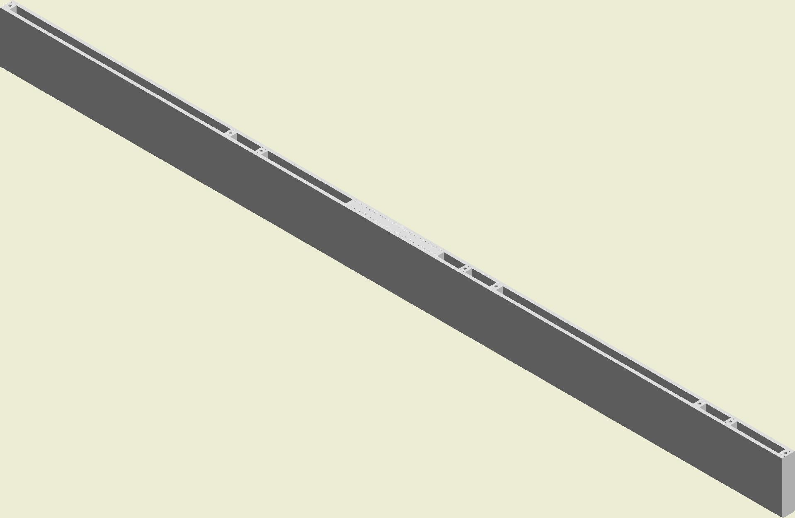

FINISHED END
SAF-TRE-001-04
2
2

 
RAMPA1-4_20
6
5

BEAM B
SAF-TRE-003-01-B
2
7

JOINER BLOCK ASSEMBLY
SAF-TRE-001-A17
1
8

Project:

35 3/32 in

3 25/32 in

33 7/8 in
[861 mm]

[891 mm]
3 25/32 in

[96 mm]
3 25/32 in

8 13/32 in

SAFEWAY EVOLUTION

[214 mm]

[96 mm]

[96 mm]

DESIGN

NOTE:
TO BE SHIPPED LOOSE

35 31/32 in

Document Title:

[914 mm]

60 in
[1524 mm]

60 in
[1524 mm]

ASSEMBLY

Manufacturing Status:

Scale:

1 / 14

APPROVED

B
/ 11" x 17"

PM/PC:

8 in
[203 mm]

PERSPECTIVE VIEW

Drawn By:

hawleyn

SAF-TRE-003-A02
ASSEMBLY FULL BEAM

2 in
[51 mm]

Job Number:

120 1/32 in

[3049 mm]

B

Revision Level:

3

Drawing Page: 

9 
32 

Of

Part Number:

SAF-TRE-003

C:\Engineering\Projects\Wood\SOBEYS (SOB)\SAF-TRE-003--Safeway Evolution Design Prototype\SAF-TRE-003.idw

## Page 10

BGI Standard Assembly Parts List

DESCRIPTION
PART NUMBER
QTY
ITEM

SPACER SUPPORT
SAF-TRE-001-02
10
1

FINISHED END
SAF-TRE-001-04
2
2

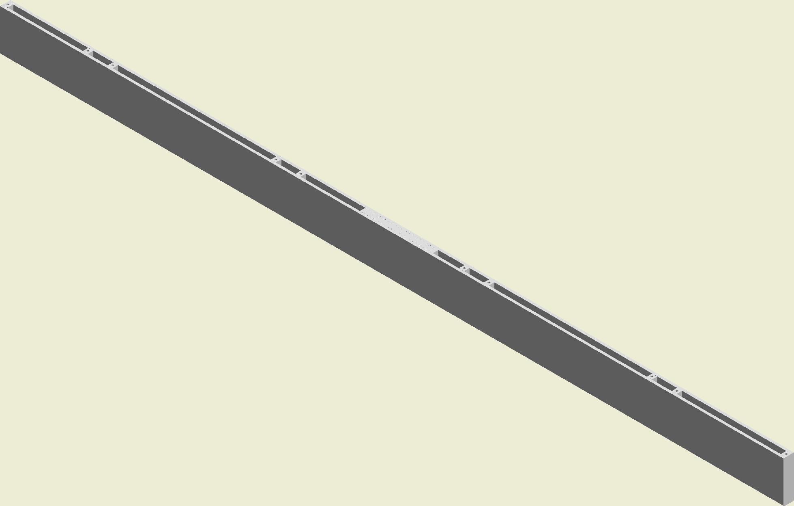

 
RAMPA1-4_20
8
5

BEAM C
SAF-TRE-003-01-C
2
8

JOINER BLOCK ASSEMBLY
SAF-TRE-001-A17
1
9

36 1/16 in

35 in
[889 mm]

15 11/32 in

[916 mm]

[390 mm]

3 25/32 in

3 25/32 in

[96 mm]

[96 mm]

3 25/32 in

[96 mm]
3 25/32 in

3 Adi Dassler Way

[96 mm]

NOTE:
TO BE SHIPPED LOOSE

Paris, ON.

35 1/32 in

N3L OB9
Tel. 1.519.442.7000
Fax 1.519.442.7535

[890 mm]

75 in
[1905 mm]

75 in
[1905 mm]

THIS DRAWING IS THE PROPERTY OF TC.
PARIS AND CANNOT BE REPRODUCED IN
ANY WAY WITHOUT CONSENT OF TC. PARIS 

Revisions

8 in
[203 mm]

PERSPECTIVE VIEW

SAF-TRE-003-A03
ASSEMBLY FULL BEAM

Customer Approval & Date

_________________
DENOTES 

C

2 in
[51 mm]

150 1/32 in

[3811 mm]

BGI Standard Assembly Parts List

REVISION

DESCRIPTION
PART NUMBER
QTY
ITEM

SPACER SUPPORT
SAF-TRE-001-02
10
1

FINISHED END
SAF-TRE-001-04
2
2

 
RAMPA1-4_20
8
5

BEAM D
SAF-TRE-003-01-D
2
9

JOINER BLOCK ASSEMBLY
SAF-TRE-001-A17
1
10

Project:

36 1/32 in

3 25/32 in

[915 mm]

SAFEWAY EVOLUTION

[96 mm]

28 1/16 in

3 25/32 in

[713 mm]

DESIGN

[96 mm]

NOTE:
TO BE SHIPPED LOOSE

Document Title:

36 in
[914 mm]

36 in
[914 mm]
3 25/32 in

3 25/32 in

[96 mm]

[96 mm]

ASSEMBLY

85 in
[2159 mm]

85 in
[2159 mm]

Manufacturing Status:

Scale:

1 / 22

APPROVED

B
/ 11" x 17"

8 in
[203 mm]

PM/PC:

Drawn By:

PERSPECTIVE VIEW

hawleyn

SAF-TRE-003-A04
ASSEMBLY FULL BEAM

2 in
[51 mm]

Job Number:

170 1/32 in

[4319 mm]

D

Revision Level:

3

Drawing Page: 

10 
32 

Of

Part Number:

SAF-TRE-003

C:\Engineering\Projects\Wood\SOBEYS (SOB)\SAF-TRE-003--Safeway Evolution Design Prototype\SAF-TRE-003.idw

## Page 11

BGI Standard Assembly Parts List

DESCRIPTION
PART NUMBER
QTY
ITEM

SPACER SUPPORT
SAF-TRE-001-02
12
1

FINISHED END
SAF-TRE-001-04
2
2

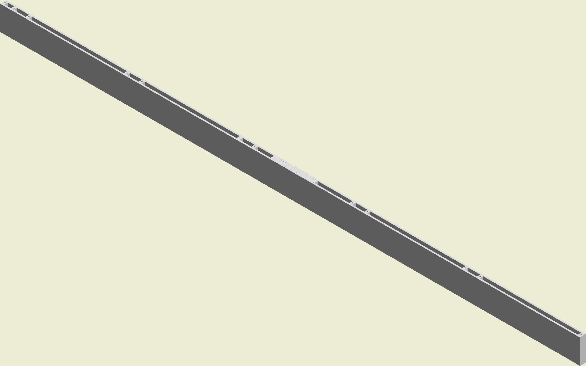

 
RAMPA1-4_20
10
5

BEAM E
SAF-TRE-003-01-E
2
10

JOINER BLOCK ASSEMBLY
SAF-TRE-001-A17
1
11

3 Adi Dassler Way

NOTE:
TO BE SHIPPED LOOSE

Paris, ON.

30 9/32 in

30 9/32 in

35 1/16 in

35 17/32 in

32 5/16 in

[769 mm]

[769 mm]

[891 mm]

[902 mm]

[820 mm]

N3L OB9
Tel. 1.519.442.7000
Fax 1.519.442.7535

3 in
[76 mm]

3 25/32 in

3 25/32 in

[96 mm]
3 25/32 in

[96 mm]
3 25/32 in

[96 mm]
3 25/32 in

[96 mm]

[96 mm]

THIS DRAWING IS THE PROPERTY OF TC.
PARIS AND CANNOT BE REPRODUCED IN
ANY WAY WITHOUT CONSENT OF TC. PARIS 

92 1/2 in
[2350 mm]

92 1/2 in
[2350 mm]

Revisions

PERSPECTIVE VIEW

8 in
[203 mm]

Customer Approval & Date

SAF-TRE-003-A05
ASSEMBLY FULL BEAM

_________________
DENOTES 

E

2 in
[51 mm]

185 1/32 in

[4700 mm]

BGI Standard Assembly Parts List

REVISION

DESCRIPTION
PART NUMBER
QTY
ITEM

SPACER SUPPORT
SAF-TRE-001-02
11
1

FINISHED END
SAF-TRE-001-04
2
2

 
RAMPA1-4_20
9
5

BEAM F
SAF-TRE-003-01-F
2
11

JOINER BLOCK ASSEMBLY
SAF-TRE-001-A17
1
12

Project:

SAFEWAY EVOLUTION

35 1/16 in

13 7/8 in
[353 mm]

35 1/32 in

35 1/32 in

30 9/32 in

31 13/32 in

[891 mm]

NOTE:
TO BE SHIPPED LOOSE

DESIGN

[890 mm]

[890 mm]

[769 mm]

[798 mm]

Document Title:

3 25/32 in

3 25/32 in

3 25/32 in

3 25/32 in

[96 mm]

[96 mm]

[96 mm]

[96 mm]

ASSEMBLY

97 1/2 in
[2477 mm]

97 1/2 in
[2477 mm]

Manufacturing Status:

Scale:

1 / 26

APPROVED

B
/ 11" x 17"

8 in
[203 mm]

PM/PC:

Drawn By:

hawleyn

Job Number:

PERSPECTIVE VIEW

2 in
[51 mm]

195 1/32 in

SAF-TRE-003-A06
ASSEMBLY FULL BEAM

[4954 mm]

Revision Level:

3

F

Drawing Page: 

11 
32 

Of

Part Number:

SAF-TRE-003

C:\Engineering\Projects\Wood\SOBEYS (SOB)\SAF-TRE-003--Safeway Evolution Design Prototype\SAF-TRE-003.idw

## Page 12

BGI Standard Assembly Parts List

DESCRIPTION
PART NUMBER
QTY
ITEM

SPACER SUPPORT
SAF-TRE-001-02
10
1

FINISHED END
SAF-TRE-001-04
2
2

 
RAMPA1-4_20
8
5

BEAM G
SAF-TRE-003-01-G
2
12

JOINER BLOCK ASSEMBLY
SAF-TRE-001-A17
1
13

29 27/32 in

[758 mm]
30 9/32 in

20 15/32 in

35 1/32 in

3 Adi Dassler Way

NOTE:
TO BE SHIPPED LOOSE

[769 mm]

[520 mm]

[890 mm]

Paris, ON.

N3L OB9
Tel. 1.519.442.7000
Fax 1.519.442.7535

3 25/32 in

3 25/32 in

3 25/32 in

[96 mm]
3 25/32 in

[96 mm]

[96 mm]

[96 mm]

100 in
[2540 mm]

100 in
[2540 mm]

THIS DRAWING IS THE PROPERTY OF TC.
PARIS AND CANNOT BE REPRODUCED IN
ANY WAY WITHOUT CONSENT OF TC. PARIS 

Revisions

PERSPECTIVE VIEW

8 in
[203 mm]

Customer Approval & Date

SAF-TRE-003-A07
ASSEMBLY FULL BEAM

_________________
DENOTES 

G

2 in
[51 mm]

200 1/32 in

[5081 mm]

BGI Standard Assembly Parts List

DESCRIPTION
PART NUMBER
QTY
ITEM

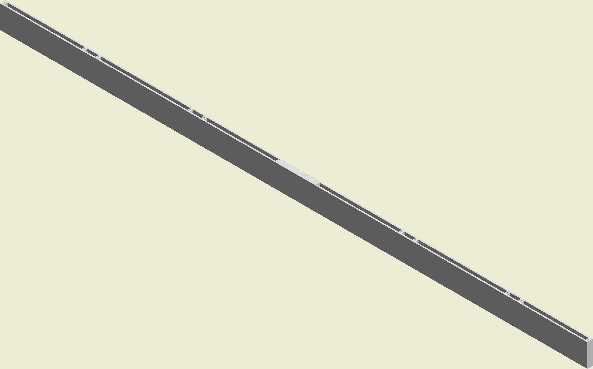

REVISION

SPACER SUPPORT
SAF-TRE-001-02
10
1

FINISHED END
SAF-TRE-001-04
2
2

 
RAMPA1-4_20
8
5

BEAM G
SAF-TRE-003-01-G
2
12

JOINER BLOCK ASSEMBLY
SAF-TRE-001-A17
1
13

27 5/16 in

30 9/32 in

Project:

30 9/32 in

23 in
[584 mm]

[694 mm]

[769 mm]

[769 mm]

NOTE:
TO BE SHIPPED LOOSE

SAFEWAY EVOLUTION

DESIGN

3 25/32 in

3 25/32 in

[96 mm]
3 25/32 in

3 25/32 in

[96 mm]

[96 mm]

[96 mm]

Document Title:

100 in
[2540 mm]

100 in
[2540 mm]

ASSEMBLY

Manufacturing Status:

Scale:

1 / 22

APPROVED

B
/ 11" x 17"

8 in
[203 mm]

PM/PC:

PERSPECTIVE VIEW

Drawn By:

hawleyn

SAF-TRE-003-A08
ASSEMBLY FULL BEAM

Job Number:

2 in
[51 mm]

H

Revision Level:

200 1/32 in

3

[5081 mm]

Drawing Page: 

12 
32 

Of

Part Number:

SAF-TRE-003

C:\Engineering\Projects\Wood\SOBEYS (SOB)\SAF-TRE-003--Safeway Evolution Design Prototype\SAF-TRE-003.idw

## Page 13

BGI Standard Assembly Parts List

DESCRIPTION
PART NUMBER
QTY
ITEM

SPACER SUPPORT
SAF-TRE-001-02
11
1

FINISHED END
SAF-TRE-001-04
2
2

 
RAMPA1-4_20
9
5

BEAM G
SAF-TRE-003-01-G
2
12

JOINER BLOCK ASSEMBLY
SAF-TRE-001-A17
1
13

3 Adi Dassler Way

NOTE:
TO BE SHIPPED LOOSE

Paris, ON.

35 1/32 in

[890 mm]
35 1/32 in

17 7/8 in
[454 mm]

35 1/32 in

32 13/32 in

[890 mm]

N3L OB9
Tel. 1.519.442.7000
Fax 1.519.442.7535

[890 mm]

[823 mm]

3 25/32 in

3 25/32 in

3 25/32 in

3 25/32 in

[96 mm]

[96 mm]

[96 mm]

[96 mm]

100 in
[2540 mm]

100 in
[2540 mm]

THIS DRAWING IS THE PROPERTY OF TC.
PARIS AND CANNOT BE REPRODUCED IN
ANY WAY WITHOUT CONSENT OF TC. PARIS 

Revisions

PERSPECTIVE VIEW

SAF-TRE-003-A09

8 in
[203 mm]

ASSEMBLY FULL BEAM I

Customer Approval & Date

_________________
DENOTES 

2 in
[51 mm]

200 1/32 in

[5081 mm]

BGI Standard Assembly Parts List

DESCRIPTION
PART NUMBER
QTY
ITEM

REVISION

SPACER SUPPORT
SAF-TRE-001-02
13
1

FINISHED END
SAF-TRE-001-04
2
2

 
RAMPA1-4_20
11
5

BEAM F
SAF-TRE-003-01-F
2
15

JOINER BLOCK ASSEMBLY
SAF-TRE-001-A17
1
16

Project:

SAFEWAY EVOLUTION

DESIGN

NOTE:
TO BE SHIPPED LOOSE

35 1/32 in

8 27/32 in

35 1/32 in

30 1/4 in
[768 mm]

35 1/32 in

5 7/32 in
[133 mm]

Document Title:

[890 mm]

[225 mm]

[890 mm]

[890 mm]

ASSEMBLY

3 25/32 in

3 25/32 in

3 25/32 in

3 25/32 in

3 25/32 in

[96 mm]

[96 mm]

[96 mm]

[96 mm]

[96 mm]

97 1/2 in
[2477 mm]

97 1/2 in
[2477 mm]

Manufacturing Status:

Scale:

1 / 22

APPROVED

B
/ 11" x 17"

PM/PC:

8 in
[203 mm]

Drawn By:

PERSPECTIVE VIEW

hawleyn

SAF-TRE-003-A10

Job Number:

ASSEMBLY FULL BEAM J

Revision Level:

3

2 in
[51 mm]

195 1/32 in

[4954 mm]

Drawing Page: 

13 
32 

Of

Part Number:

SAF-TRE-003

C:\Engineering\Projects\Wood\SOBEYS (SOB)\SAF-TRE-003--Safeway Evolution Design Prototype\SAF-TRE-003.idw

## Page 14

BGI Standard Assembly Parts List

DESCRIPTION
PART NUMBER
QTY
ITEM

SPACER SUPPORT
SAF-TRE-001-02
12
1

FINISHED END
SAF-TRE-001-04
2
2

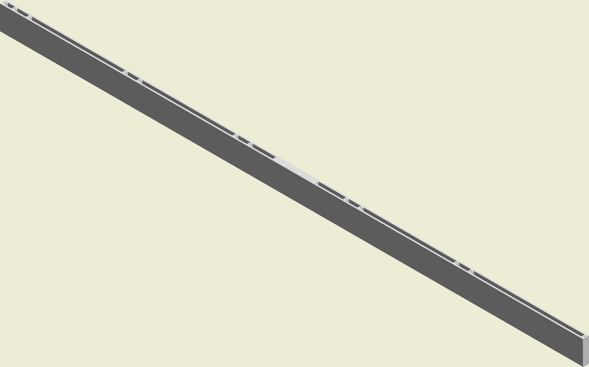

 
RAMPA1-4_20
10
5

BEAM I
SAF-TRE-003-01-I
2
14

JOINER BLOCK ASSEMBLY
SAF-TRE-001-A17
1
15

3 Adi Dassler Way

NOTE:
TO BE SHIPPED LOOSE

Paris, ON.

N3L OB9
Tel. 1.519.442.7000
Fax 1.519.442.7535

3 1/4 in
[83 mm]

37 1/32 in

35 1/32 in

35 1/32 in

35 1/32 in

[941 mm]

[890 mm]

[890 mm]

[890 mm]

3 25/32 in

3 25/32 in

3 25/32 in

3 25/32 in

3 25/32 in

[96 mm]

[96 mm]

[96 mm]

[96 mm]

[96 mm]

THIS DRAWING IS THE PROPERTY OF TC.
PARIS AND CANNOT BE REPRODUCED IN
ANY WAY WITHOUT CONSENT OF TC. PARIS 

95 in
[2413 mm]

95 in
[2413 mm]

Revisions

PERSPECTIVE VIEW

Customer Approval & Date

SAF-TRE-003-A11
ASSEMBLY FULL BEAM

_________________
DENOTES 

8 in
[203 mm]

K

2 in
[51 mm]

190 1/32 in

[4827 mm]

BGI Standard Assembly Parts List

REVISION

DESCRIPTION
PART NUMBER
QTY
ITEM

SPACER SUPPORT
SAF-TRE-001-02
11
1

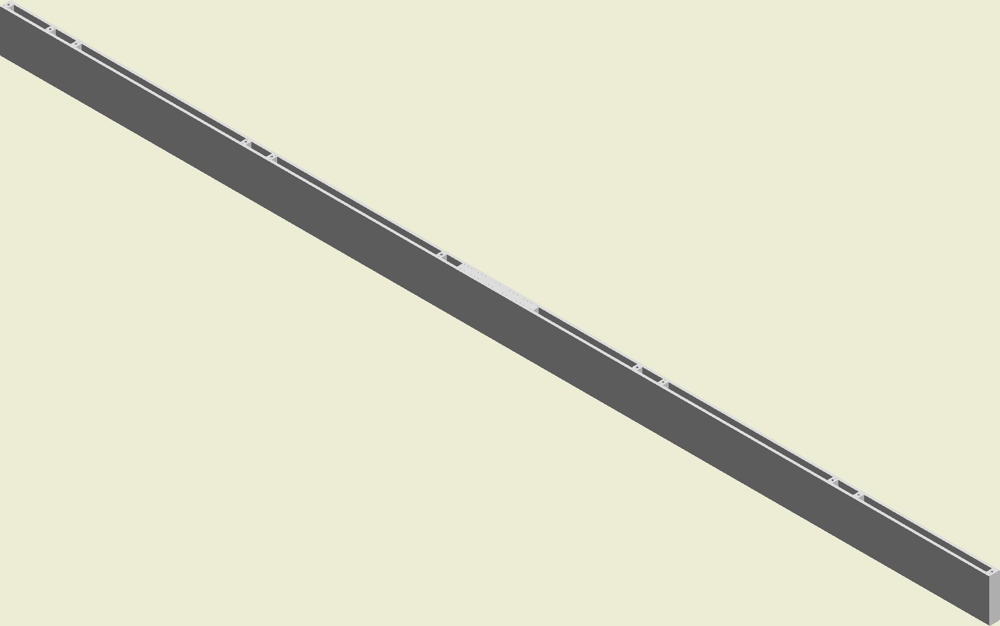

FINISHED END
SAF-TRE-001-04
2
2

 
RAMPA1-4_20
9
6

BEAM J
SAF-TRE-003-01-J
2
7

JOINER BLOCK ASSEMBLY
SAF-TRE-001-A17
1
8

Project:

SAFEWAY EVOLUTION

DESIGN

NOTE:
TO BE SHIPPED LOOSE

24 17/32 in

35 1/32 in

7 3/4 in
[197 mm]

35 1/32 in

35 1/32 in

[623 mm]

[890 mm]

[890 mm]

[890 mm]

Document Title:

3 25/32 in

3 25/32 in

3 25/32 in

3 25/32 in

ASSEMBLY

[96 mm]

[96 mm]

[96 mm]

[96 mm]

91 in
[2311 mm]

91 in
[2311 mm]

Manufacturing Status:

Scale:

1 / 22

APPROVED

B
/ 11" x 17"

PM/PC:

8 in
[203 mm]

Drawn By:

PERSPECTIVE VIEW

hawleyn

SAF-TRE-003-A12

Job Number:

ASSEMBLY FULL BEAM L

2 in
[51 mm]

Revision Level:

3

182 1/32 in

[4624 mm]

Drawing Page: 

14 
32 

Of

Part Number:

SAF-TRE-003

C:\Engineering\Projects\Wood\SOBEYS (SOB)\SAF-TRE-003--Safeway Evolution Design Prototype\SAF-TRE-003.idw

## Page 15

BGI Standard Assembly Parts List

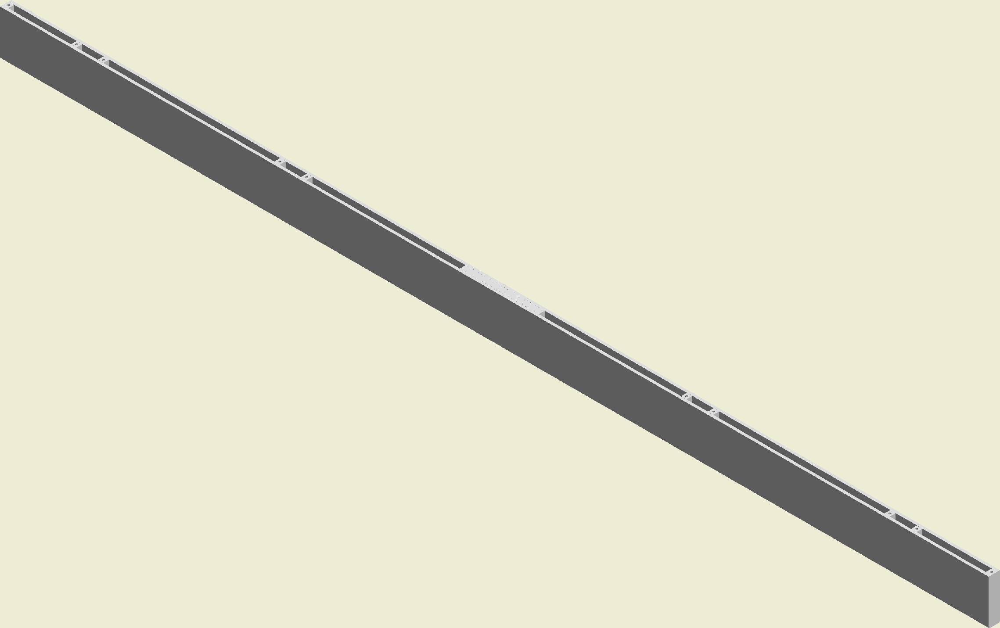

DESCRIPTION
PART NUMBER
QTY
ITEM

SPACER SUPPORT
SAF-TRE-001-02
10
1

FINISHED END
SAF-TRE-001-04
2
2

 
RAMPA1-4_20
8
6

BEAM K
SAF-TRE-003-01-K
2
8

JOINER BLOCK ASSEMBLY
SAF-TRE-001-A17
1
9

NOTE:
TO BE SHIPPED LOOSE

3 Adi Dassler Way

Paris, ON.

12 1/16 in

35 1/32 in

35 1/32 in

13 7/32 in

[306 mm]

[890 mm]

[890 mm]

N3L OB9
Tel. 1.519.442.7000
Fax 1.519.442.7535

[336 mm]

3 25/32 in

3 25/32 in

3 25/32 in

3 25/32 in

[96 mm]

[96 mm]

[96 mm]

[96 mm]

87 1/2 in
[2223 mm]
87 1/2 in
[2223 mm]

THIS DRAWING IS THE PROPERTY OF TC.
PARIS AND CANNOT BE REPRODUCED IN
ANY WAY WITHOUT CONSENT OF TC. PARIS 

Revisions

PERSPECTIVE VIEW

SAF-TRE-003-A13
ASSEMBLY FULL BEAM

Customer Approval & Date

8 in
[203 mm]

_________________
DENOTES 

M

2 in
[51 mm]

175 1/32 in

[4446 mm]

BGI Standard Assembly Parts List

REVISION

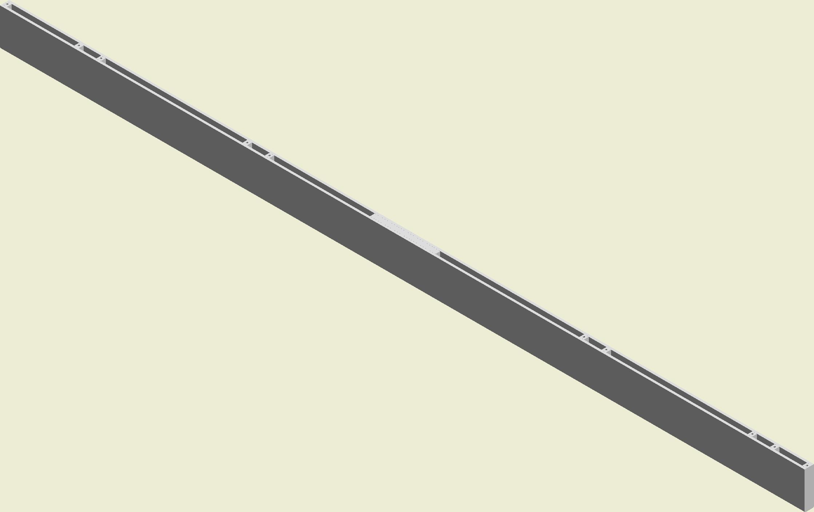

DESCRIPTION
PART NUMBER
QTY
ITEM

SPACER SUPPORT
SAF-TRE-001-02
10
1

FINISHED END
SAF-TRE-001-04
2
2

 
RAMPA1-4_20
8
6

BEAM L
SAF-TRE-003-01-L
2
9

JOINER BLOCK ASSEMBLY
SAF-TRE-001-A17
1
10

Project:

SAFEWAY EVOLUTION

15 3/8 in
[390 mm]

35 1/32 in

NOTE:
TO BE SHIPPED LOOSE

DESIGN

6 15/16 in

35 1/32 in

[890 mm]

[890 mm]

[176 mm]

Document Title:

3 25/32 in

3 25/32 in

3 25/32 in

3 25/32 in

[96 mm]

[96 mm]

[96 mm]

[96 mm]

ASSEMBLY

86 in
[2184 mm]

86 in
[2184 mm]

Manufacturing Status:

Scale:

1 / 22

APPROVED

B
/ 11" x 17"

8 in
[203 mm]

PM/PC:

Drawn By:

hawleyn

PERSPECTIVE VIEW

Job Number:

SAF-TRE-003-A14
ASSEMBLY FULL BEAM

2 in
[51 mm]

172 1/32 in

Revision Level:

[4370 mm]

3

N

Drawing Page: 

15 
32 

Of

Part Number:

SAF-TRE-003

C:\Engineering\Projects\Wood\SOBEYS (SOB)\SAF-TRE-003--Safeway Evolution Design Prototype\SAF-TRE-003.idw

## Page 16

BGI Standard Assembly Parts List

DESCRIPTION
PART NUMBER
QTY
ITEM

SPACER SUPPORT
SAF-TRE-001-02
11
1

FINISHED END
SAF-TRE-001-04
2
2

 
RAMPA1-4_20
9
6

BEAM D
SAF-TRE-003-01-D
2
11

JOINER BLOCK ASSEMBLY
SAF-TRE-001-A17
1
12

3 Adi Dassler Way

NOTE:
TO BE SHIPPED LOOSE

35 1/32 in

17 13/32 in

2 29/32 in

Paris, ON.

[890 mm]

[442 mm]

[74 mm]

35 1/32 in

35 1/32 in

N3L OB9
Tel. 1.519.442.7000
Fax 1.519.442.7535

[890 mm]

[890 mm]

3 25/32 in

3 25/32 in

3 25/32 in

3 25/32 in

[96 mm]

[96 mm]

[96 mm]

[96 mm]

85 in
[2159 mm]

85 in
[2159 mm]

THIS DRAWING IS THE PROPERTY OF TC.
PARIS AND CANNOT BE REPRODUCED IN
ANY WAY WITHOUT CONSENT OF TC. PARIS 

Revisions

8 in
[203 mm]

PERSPECTIVE VIEW

Customer Approval & Date

_________________
DENOTES 

SAF-TRE-003-A15
ASSEMBLY FULL BEAM

O

2 in
[51 mm]

170 1/32 in

[4319 mm]

BGI Standard Assembly Parts List

REVISION

DESCRIPTION
PART NUMBER
QTY
ITEM

SPACER SUPPORT
SAF-TRE-001-02
10
1

FINISHED END
SAF-TRE-001-04
2
2

 
RAMPA1-4_20
8
6

BEAM D
SAF-TRE-003-01-D
2
11

JOINER BLOCK ASSEMBLY
SAF-TRE-001-A17
1
12

Project:

SAFEWAY EVOLUTION

DESIGN

35 1/32 in

18 13/16 in

NOTE:
TO BE SHIPPED LOOSE

[890 mm]

[478 mm]

6 9/32 in
[159 mm]
30 1/4 in
[768 mm]

30 9/32 in

[769 mm]

Document Title:

3 25/32 in

3 25/32 in

3 25/32 in

ASSEMBLY

[96 mm]

[96 mm]

[96 mm]

85 in
[2159 mm]

85 in
[2159 mm]

Manufacturing Status:

Scale:

1 / 22

APPROVED

B
/ 11" x 17"

PM/PC:

8 in
[203 mm]

Drawn By:

hawleyn

PERSPECTIVE VIEW

Job Number:

SAF-TRE-003-A16
ASSEMBLY FULL BEAM

2 in
[51 mm]

170 1/32 in

Revision Level:

3

[4319 mm]

P

Drawing Page: 

16 
32 

Of

Part Number:

SAF-TRE-003

C:\Engineering\Projects\Wood\SOBEYS (SOB)\SAF-TRE-003--Safeway Evolution Design Prototype\SAF-TRE-003.idw

## Page 17

BGI Standard Assembly Parts List

DESCRIPTION
PART NUMBER
QTY
ITEM

SPACER SUPPORT
SAF-TRE-001-02
10
1

FINISHED END
SAF-TRE-001-04
2
2

 
RAMPA1-4_20
8
6

BEAM D
SAF-TRE-003-01-D
2
11

JOINER BLOCK ASSEMBLY
SAF-TRE-001-A17
1
12

3 Adi Dassler Way

NOTE:
TO BE SHIPPED LOOSE

Paris, ON.

20 3/32 in

35 1/32 in

5 in
[127 mm]
30 1/4 in
[768 mm]

35 1/32 in

[890 mm]

[510 mm]

N3L OB9
Tel. 1.519.442.7000
Fax 1.519.442.7535

[890 mm]

3 25/32 in

3 25/32 in

3 25/32 in

[96 mm]

[96 mm]

[96 mm]

85 in
[2159 mm]

85 in
[2159 mm]

THIS DRAWING IS THE PROPERTY OF TC.
PARIS AND CANNOT BE REPRODUCED IN
ANY WAY WITHOUT CONSENT OF TC. PARIS 

Revisions

8 in
[203 mm]

Customer Approval & Date

_________________
DENOTES 

PERSPECTIVE VIEW

SAF-TRE-003-A17
ASSEMBLY FULL BEAM

2 in
[51 mm]

170 1/32 in

[4319 mm]

Q

BGI Standard Assembly Parts List

DESCRIPTION
PART NUMBER
QTY
ITEM

REVISION

SPACER SUPPORT
SAF-TRE-001-02
11
1

FINISHED END
SAF-TRE-001-04
2
2

 
RAMPA1-4_20
9
6

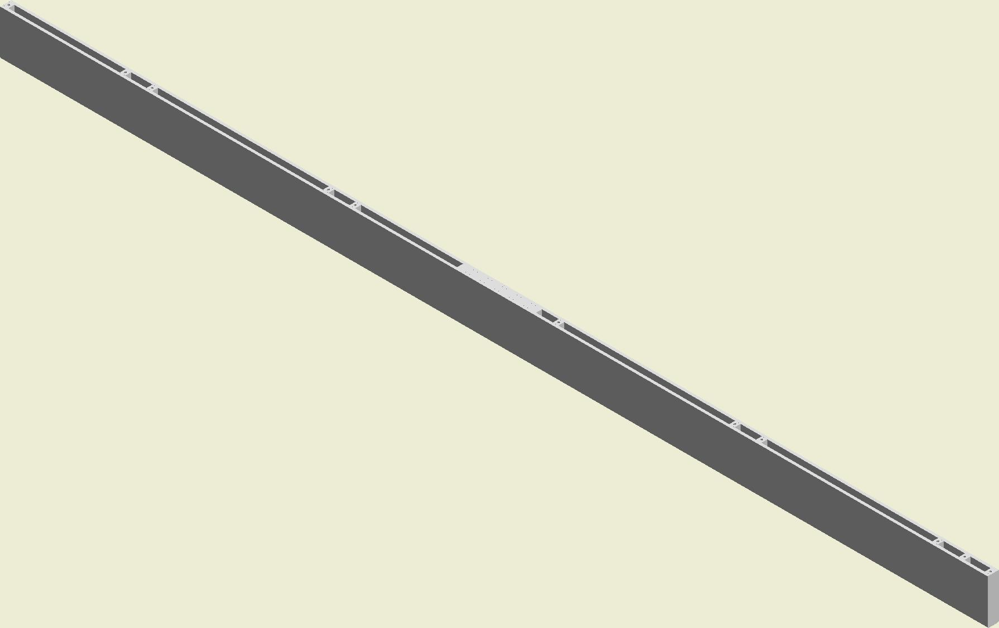

BEAM K
SAF-TRE-003-01-K
2
14

JOINER BLOCK ASSEMBLY
SAF-TRE-001-A17
1
15

Project:

SAFEWAY EVOLUTION

NOTE:
TO BE SHIPPED LOOSE

DESIGN

21 7/32 in

36 in
[914 mm]

5 1/16 in
[128 mm]

36 in
[914 mm]

36 in
[914 mm]

[539 mm]

Document Title:

4 3/4 in
[121 mm]

4 3/4 in
[121 mm]

4 3/4 in
[121 mm]

4 3/4 in
[121 mm]

ASSEMBLY

87 1/2 in
[2223 mm]

87 1/2 in
[2223 mm]

Manufacturing Status:

Scale:

1 / 22

APPROVED

B
/ 11" x 17"

PM/PC:

8 in
[203 mm]

Drawn By:

hawleyn

PERSPECTIVE VIEW

Job Number:

SAF-TRE-003-A18
ASSEMBLY FULL BEAM

2 in
[51 mm]

Revision Level:

175 1/32 in

3

[4446 mm]

R

Drawing Page: 

17 
32 

Of

Part Number:

SAF-TRE-003

C:\Engineering\Projects\Wood\SOBEYS (SOB)\SAF-TRE-003--Safeway Evolution Design Prototype\SAF-TRE-003.idw

## Page 18

BGI Standard Assembly Parts List

DESCRIPTION
PART NUMBER
QTY
ITEM

SPACER SUPPORT
SAF-TRE-001-02
11
1

FINISHED END
SAF-TRE-001-04
2
2

 
RAMPA1-4_20
9
6

BEAM O
SAF-TRE-003-01-O
2
15

JOINER BLOCK ASSEMBLY
SAF-TRE-001-A17
1
16

3 Adi Dassler Way

NOTE:
TO BE SHIPPED LOOSE

Paris, ON.

N3L OB9
Tel. 1.519.442.7000
Fax 1.519.442.7535

20 27/32 in

35 17/32 in

[529 mm]

[902 mm]

35 1/32 in

35 1/32 in

7 7/16 in
[189 mm]

[890 mm]

[890 mm]

3 25/32 in

3 25/32 in

3 25/32 in

3 25/32 in

[96 mm]

[96 mm]

[96 mm]

[96 mm]

THIS DRAWING IS THE PROPERTY OF TC.
PARIS AND CANNOT BE REPRODUCED IN
ANY WAY WITHOUT CONSENT OF TC. PARIS 

89 in
[2261 mm]

89 in
[2261 mm]

Revisions

Customer Approval & Date

_________________
DENOTES 

8 in
[203 mm]

PERSPECTIVE VIEW

SAF-TRE-003-A19
ASSEMBLY FULL BEAM

S

2 in
[51 mm]

178 1/32 in

[4522 mm]

BGI Standard Assembly Parts List

REVISION

DESCRIPTION
PART NUMBER
QTY
ITEM

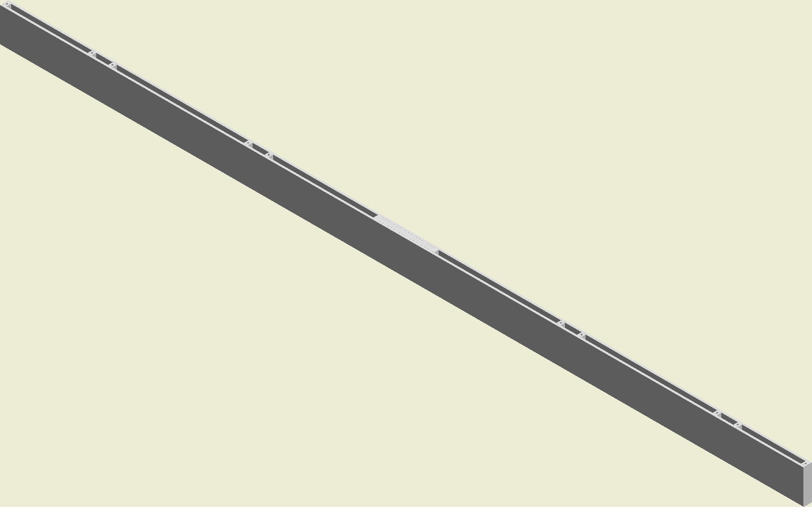

SPACER SUPPORT
SAF-TRE-001-02
10
1

FINISHED END
SAF-TRE-001-04
2
2

 
RAMPA1-4_20
8
6

BEAM E
SAF-TRE-003-01-E
2
19

JOINER BLOCK ASSEMBLY
SAF-TRE-001-A17
1
20

Project:

SAFEWAY EVOLUTION

NOTE:
TO BE SHIPPED LOOSE

19 21/32 in

35 1/32 in

DESIGN

15 5/8 in
[397 mm]

35 1/32 in

[499 mm]

[890 mm]

[890 mm]

Document Title:

3 25/32 in

3 25/32 in

3 25/32 in

3 25/32 in

[96 mm]

[96 mm]

[96 mm]

[96 mm]

92 1/2 in
[2350 mm]

92 1/2 in
[2350 mm]

ASSEMBLY

Manufacturing Status:

Scale:

1 / 24

APPROVED

B
/ 11" x 17"

PM/PC:

8 in
[203 mm]

Drawn By:

hawleyn

PERSPECTIVE VIEW

Job Number:

SAF-TRE-003-A20
ASSEMBLY FULL BEAM

Revision Level:

2 in
[51 mm]

3

185 1/32 in

[4700 mm]

T

Drawing Page: 

18 
32 

Of

Part Number:

SAF-TRE-003

C:\Engineering\Projects\Wood\SOBEYS (SOB)\SAF-TRE-003--Safeway Evolution Design Prototype\SAF-TRE-003.idw

## Page 19

BGI Standard Assembly Parts List

DESCRIPTION
PART NUMBER
QTY
ITEM

SPACER SUPPORT
SAF-TRE-001-02
10
1

FINISHED END
SAF-TRE-001-04
2
2

 
RAMPA1-4_20
8
4

BEAM I
SAF-TRE-003-01-I
2
6

JOINER BLOCK ASSEMBLY
SAF-TRE-001-A17
1
7

3 Adi Dassler Way

NOTE:
TO BE SHIPPED LOOSE

Paris, ON.

17 5/32 in

35 1/32 in

23 5/32 in

[588 mm]
35 1/32 in

N3L OB9
Tel. 1.519.442.7000
Fax 1.519.442.7535

[436 mm]

[890 mm]

[890 mm]

3 25/32 in

3 25/32 in

3 25/32 in

[96 mm]
3 25/32 in

[96 mm]

[96 mm]

[96 mm]

95 in
[2413 mm]

95 in
[2413 mm]

THIS DRAWING IS THE PROPERTY OF TC.
PARIS AND CANNOT BE REPRODUCED IN
ANY WAY WITHOUT CONSENT OF TC. PARIS 

Revisions

Customer Approval & Date

8 in
[203 mm]

_________________
DENOTES 

PERSPECTIVE VIEW

SAF-TRE-003-A21
ASSEMBLY FULL BEAM

U

2 in
[51 mm]

190 1/32 in

[4827 mm]

BGI Standard Assembly Parts List

REVISION

DESCRIPTION
PART NUMBER
QTY
ITEM

SPACER SUPPORT
SAF-TRE-001-02
13
1

FINISHED END
SAF-TRE-001-04
2
2

 
RAMPA1-4_20
11
5

BEAM G
SAF-TRE-003-01-G
2
12

JOINER BLOCK ASSEMBLY
SAF-TRE-001-A17
1
13

Project:

SAFEWAY EVOLUTION

NOTE:
TO BE SHIPPED LOOSE

DESIGN

14 5/32 in

35 1/32 in

35 1/32 in

35 1/32 in

[125 mm]
30 1/4 in
[768 mm]

4 29/32 in

[360 mm]

[890 mm]

[890 mm]

Document Title:

[890 mm]

ASSEMBLY

3 25/32 in

3 25/32 in

3 25/32 in

3 25/32 in

3 25/32 in

[96 mm]

[96 mm]

[96 mm]

[96 mm]

[96 mm]

100 in
[2540 mm]

100 in
[2540 mm]

Manufacturing Status:

Scale:

1 / 24

APPROVED

B
/ 11" x 17"

PM/PC:

8 in
[203 mm]

Drawn By:

hawleyn

PERSPECTIVE VIEW

Job Number:

SAF-TRE-003-A22
ASSEMBLY FULL BEAM

2 in
[51 mm]

Revision Level:

200 1/32 in

3

[5081 mm]

V

Drawing Page: 

19 
32 

Of

Part Number:

SAF-TRE-003

C:\Engineering\Projects\Wood\SOBEYS (SOB)\SAF-TRE-003--Safeway Evolution Design Prototype\SAF-TRE-003.idw

## Page 20

BGI Standard Assembly Parts List

DESCRIPTION
PART NUMBER
QTY
ITEM

SPACER SUPPORT
SAF-TRE-001-02
14
1

FINISHED END
SAF-TRE-001-04
2
2

 
RAMPA1-4_20
12
4

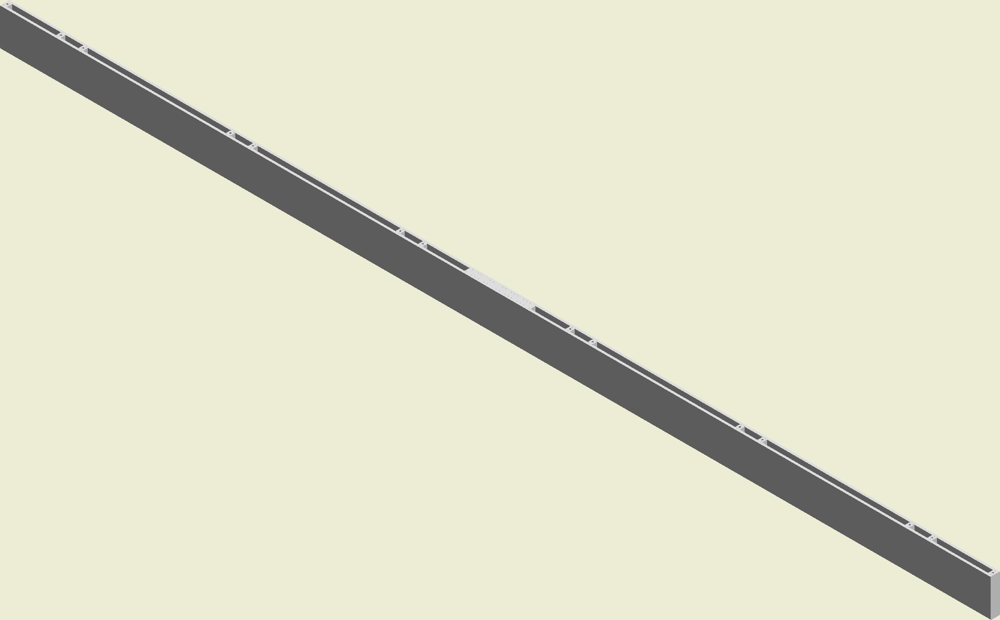

BEAM R
SAF-TRE-003-01-R
2
6

JOINER BLOCK ASSEMBLY
SAF-TRE-001-A17
1
7

3 Adi Dassler Way

Paris, ON.

NOTE:
TO BE SHIPPED LOOSE

3 25/32 in

N3L OB9
Tel. 1.519.442.7000
Fax 1.519.442.7535

[96 mm]

35 1/32 in

11 3/8 in
[289 mm]

[890 mm]
35 1/32 in

35 1/32 in

[890 mm]

12 29/32 in

[890 mm]

[328 mm]

3 25/32 in

3 25/32 in

3 25/32 in

3 25/32 in

3 25/32 in

[96 mm]

[96 mm]

[96 mm]

[96 mm]

THIS DRAWING IS THE PROPERTY OF TC.
PARIS AND CANNOT BE REPRODUCED IN
ANY WAY WITHOUT CONSENT OF TC. PARIS 

[96 mm]

105 in
[2667 mm]

105 in
[2667 mm]

Revisions

Customer Approval & Date

_________________
DENOTES 

8 in
[203 mm]

PERSPECTIVE VIEW

SAF-TRE-003-A23
ASSEMBLY FULL BEAM

2 in
[51 mm]

210 1/32 in

W

[5335 mm]

REVISION

BGI Standard Assembly Parts List

DESCRIPTION
PART NUMBER
QTY
ITEM

SPACER SUPPORT
SAF-TRE-001-02
13
1

FINISHED END
SAF-TRE-001-04
2
2

 
RAMPA1-4_20
11
4

BEAM S
SAF-TRE-003-01-S
2
7

JOINER BLOCK ASSEMBLY
SAF-TRE-001-A17
1
8

Project:

SAFEWAY EVOLUTION

DESIGN

NOTE:
TO BE SHIPPED LOOSE

Document Title:

35 1/32 in

8 11/16 in

35 1/32 in

35 1/32 in

25 19/32 in

35 1/32 in

[890 mm]

[221 mm]

[890 mm]

[890 mm]

[890 mm]

[650 mm]

ASSEMBLY

3 25/32 in

3 25/32 in

3 25/32 in

3 25/32 in

3 25/32 in

[96 mm]

[96 mm]

[96 mm]

[96 mm]

[96 mm]

Manufacturing Status:

Scale:

110 in
[2794 mm]

110 in
[2794 mm]

1 / 24

APPROVED

B
/ 11" x 17"

PM/PC:

8 in
[203 mm]

Drawn By:

hawleyn

Job Number:

PERSPECTIVE VIEW

Revision Level:

220 1/32 in

2 in
[51 mm]

SAF-TRE-003-A24
ASSEMBLY FULL BEAM

3

[5589 mm]

Drawing Page: 

X

20 
32 

Of

Part Number:

SAF-TRE-003

C:\Engineering\Projects\Wood\SOBEYS (SOB)\SAF-TRE-003--Safeway Evolution Design Prototype\SAF-TRE-003.idw

## Page 21

BGI Standard Assembly Parts List

DESCRIPTION
PART NUMBER
QTY
ITEM

SPACER SUPPORT
SAF-TRE-001-02
14
1

FINISHED END
SAF-TRE-001-04
2
2

 
RAMPA1-4_20
12
4

BEAM T
SAF-TRE-003-01-T
2
8

JOINER BLOCK ASSEMBLY
SAF-TRE-001-A17
1
9

NOTE:
TO BE SHIPPED LOOSE

3 Adi Dassler Way

Paris, ON.

N3L OB9
Tel. 1.519.442.7000
Fax 1.519.442.7535

3 11/16 in

4 19/32 in

[94 mm]

36 in
[914 mm]

35 1/32 in

[117 mm]

35 1/32 in

35 1/32 in

[890 mm]

[890 mm]

[890 mm]

3 25/32 in

3 25/32 in

3 25/32 in

3 25/32 in

3 25/32 in

3 25/32 in

[96 mm]

[96 mm]

[96 mm]

[96 mm]

[96 mm]

[96 mm]

THIS DRAWING IS THE PROPERTY OF TC.
PARIS AND CANNOT BE REPRODUCED IN
ANY WAY WITHOUT CONSENT OF TC. PARIS 

115 in
[2921 mm]

115 in
[2921 mm]

Revisions

Customer Approval & Date

8 in
[203 mm]

_________________
DENOTES 

PERSPECTIVE VIEW

SAF-TRE-003-A25
ASSEMBLY FULL BEAM

Y

2 in
[51 mm]

230 1/32 in

[5843 mm]

BGI Standard Assembly Parts List

REVISION

DESCRIPTION
PART NUMBER
QTY
ITEM

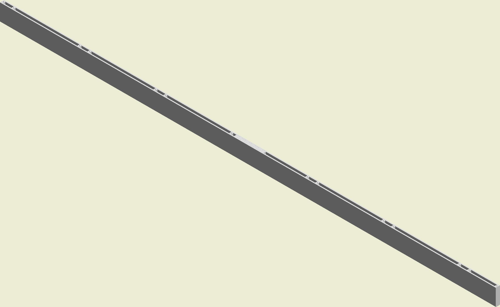

SPACER SUPPORT
SAF-TRE-001-02
14
1

FINISHED END
SAF-TRE-001-04
2
2

 
RAMPA1-4_20
12
4

BEAM U
SAF-TRE-003-01-U
2
9

JOINER BLOCK ASSEMBLY
SAF-TRE-001-A17
1
10

Project:

SAFEWAY EVOLUTION

4 29/32 in

DESIGN

NOTE:
TO BE SHIPPED LOOSE

[125 mm]

35 1/32 in

35 1/32 in

35 1/32 in

35 1/32 in

30 1/4 in
[768 mm]

[890 mm]

Document Title:

[890 mm]

[890 mm]

[890 mm]
13 5/32 in

[334 mm]

ASSEMBLY

3 25/32 in

3 25/32 in

3 25/32 in

3 25/32 in

3 25/32 in

[96 mm]

[96 mm]

[96 mm]

[96 mm]

[96 mm]

117 1/2 in
[2985 mm]

117 1/2 in
[2985 mm]

Manufacturing Status:

Scale:

1 / 24

APPROVED

B
/ 11" x 17"

PM/PC:

8 in
[203 mm]

Drawn By:

hawleyn

Job Number:

PERSPECTIVE VIEW

2 in
[51 mm]

Revision Level:

235 1/32 in

SAF-TRE-003-A26
ASSEMBLY FULL BEAM

3

[5970 mm]

Drawing Page: 

Z

21 
32 

Of

Part Number:

SAF-TRE-003

C:\Engineering\Projects\Wood\SOBEYS (SOB)\SAF-TRE-003--Safeway Evolution Design Prototype\SAF-TRE-003.idw

## Page 22

BGI Standard Assembly Parts List

DESCRIPTION
PART NUMBER
QTY
ITEM

SPACER SUPPORT
SAF-TRE-001-02
14
1

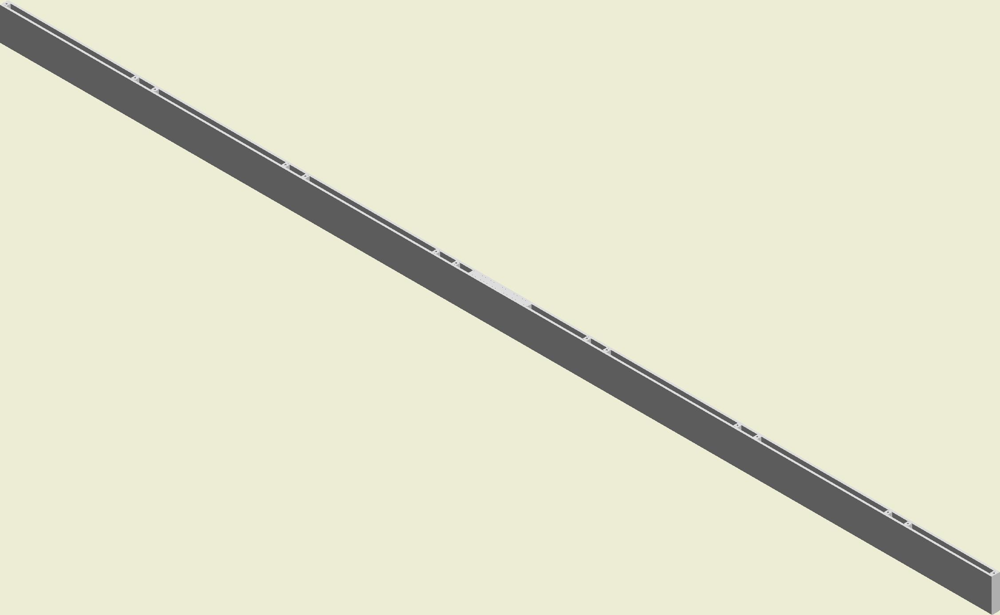

FINISHED END
SAF-TRE-001-04
2
2

 
RAMPA1-4_20
12
4

BEAM V
SAF-TRE-003-01-V
2
10

JOINER BLOCK ASSEMBLY
SAF-TRE-001-A17
1
11

35 1/32 in

30 3/4 in
[781 mm]

35 1/32 in

3 Adi Dassler Way

35 1/32 in

[890 mm]
35 1/32 in

20 17/32 in

[890 mm]

[890 mm]

Paris, ON.

[890 mm]

NOTE:
TO BE SHIPPED LOOSE

[522 mm]

N3L OB9
Tel. 1.519.442.7000
Fax 1.519.442.7535

3 25/32 in

3 25/32 in

3 25/32 in

3 25/32 in

3 25/32 in

3 25/32 in

[96 mm]

[96 mm]

[96 mm]

[96 mm]

[96 mm]

[96 mm]

118 1/2 in
[3010 mm]
118 1/2 in
[3010 mm]

THIS DRAWING IS THE PROPERTY OF TC.
PARIS AND CANNOT BE REPRODUCED IN
ANY WAY WITHOUT CONSENT OF TC. PARIS 

Revisions

Customer Approval & Date

_________________
DENOTES 

8 in
[203 mm]

PERSPECTIVE VIEW

SAF-TRE-003-A27
ASSEMBLY FULL BEAM

AA

2 in
[51 mm]

237 1/32 in

[6021 mm]

BGI Standard Assembly Parts List

REVISION

DESCRIPTION
PART NUMBER
QTY
ITEM

SPACER SUPPORT
SAF-TRE-001-02
14
1

FINISHED END
SAF-TRE-001-04
2
2

 
RAMPA1-4_20
12
4

BEAM V
SAF-TRE-003-01-V
1
10

BEAM W
SAF-TRE-003-01-W
1
11

35 1/32 in

35 1/32 in

25 1/8 in
[638 mm]

35 1/32 in

26 21/32 in

35 1/32 in

[890 mm]

[890 mm]

JOINER BLOCK ASSEMBLY
SAF-TRE-001-A17
1
12

Project:

[677 mm]

[890 mm]

[890 mm]

SAFEWAY EVOLUTION

DESIGN

3 25/32 in

3 25/32 in

3 25/32 in

3 25/32 in

3 25/32 in

3 25/32 in

NOTE:
TO BE SHIPPED LOOSE

[96 mm]

[96 mm]

[96 mm]

[96 mm]

[96 mm]

[96 mm]

Document Title:

118 1/2 in
[3010 mm]

119 in
[3023 mm]

ASSEMBLY

Manufacturing Status:

Scale:

1 / 26

APPROVED

B
/ 11" x 17"

8 in
[203 mm]

PM/PC:

PERSPECTIVE VIEW

Drawn By:

SAF-TRE-003-A28
ASSEMBLY FULL BEAM

hawleyn

Job Number:

BB

2 in
[51 mm]

Revision Level:

237 17/32 in

3

[6034 mm]

Drawing Page: 

22 
32 

Of

Part Number:

SAF-TRE-003

C:\Engineering\Projects\Wood\SOBEYS (SOB)\SAF-TRE-003--Safeway Evolution Design Prototype\SAF-TRE-003.idw

## Page 23

BGI Standard Assembly Parts List

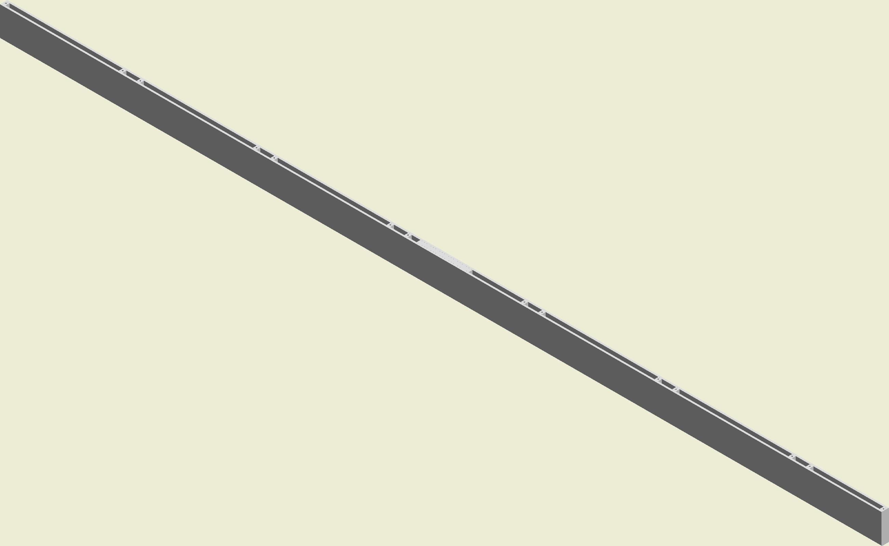

DESCRIPTION
PART NUMBER
QTY
ITEM

SPACER SUPPORT
SAF-TRE-001-02
14
1

FINISHED END
SAF-TRE-001-04
2
2

 
RAMPA1-4_20
12
4

BEAM V
SAF-TRE-003-01-V
2
10

JOINER BLOCK ASSEMBLY
SAF-TRE-001-A17
1
11

3 Adi Dassler Way

Paris, ON.

NOTE:
TO BE SHIPPED LOOSE

N3L OB9
Tel. 1.519.442.7000
Fax 1.519.442.7535

31 15/32 in

35 1/32 in

35 1/32 in

19 13/16 in

[504 mm]
35 1/32 in

35 1/32 in

[890 mm]

[799 mm]

[890 mm]

[890 mm]

[890 mm]

3 25/32 in

3 25/32 in

3 25/32 in

3 25/32 in

[96 mm]
3 25/32 in

3 25/32 in

[96 mm]

[96 mm]

[96 mm]

[96 mm]

[96 mm]

THIS DRAWING IS THE PROPERTY OF TC.
PARIS AND CANNOT BE REPRODUCED IN
ANY WAY WITHOUT CONSENT OF TC. PARIS 

118 1/2 in
[3010 mm]

118 1/2 in
[3010 mm]

Revisions

Customer Approval & Date

_________________
DENOTES 

8 in
[203 mm]

PERSPECTIVE VIEW

SAF-TRE-003-A29
ASSEMBLY FULL BEAM

237 in
[6020 mm]

2 in
[51 mm]

CC

REVISION

BGI Standard Assembly Parts List

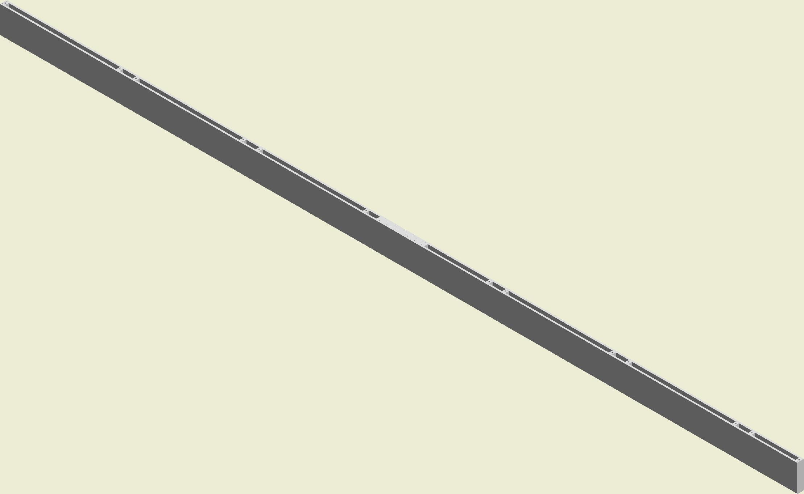

DESCRIPTION
PART NUMBER
QTY
ITEM

SPACER SUPPORT
SAF-TRE-001-02
13
1

FINISHED END
SAF-TRE-001-04
2
2

 
RAMPA1-4_20
11
4

BEAM X
SAF-TRE-003-01-X
2
11

JOINER BLOCK ASSEMBLY
SAF-TRE-001-A17
1
12

35 1/32 in

33 17/32 in

35 1/32 in

Project:

[852 mm]

[890 mm]

[890 mm]
49 3/4 in
[1264 mm]

35 1/32 in

SAFEWAY EVOLUTION

[890 mm]

DESIGN

NOTE:
TO BE SHIPPED LOOSE

3 25/32 in

3 25/32 in

13 25/32 in

3 25/32 in

3 25/32 in

[96 mm]

[96 mm]

[350 mm]

Document Title:

[96 mm]

[96 mm]

3 25/32 in

[96 mm]

116 1/2 in
[2959 mm]

116 1/2 in
[2959 mm]

ASSEMBLY

Manufacturing Status:

Scale:

1 / 26

APPROVED

B
/ 11" x 17"

PM/PC:

8 in
[203 mm]

Drawn By:

hawleyn

Job Number:

PERSPECTIVE VIEW

2 in
[51 mm]

Revision Level:

SAF-TRE-003-A30
ASSEMBLY FULL BEAM

3

233 in
[5918 mm]

Drawing Page: 

DD

23 
32 

Of

Part Number:

SAF-TRE-003

C:\Engineering\Projects\Wood\SOBEYS (SOB)\SAF-TRE-003--Safeway Evolution Design Prototype\SAF-TRE-003.idw

## Page 24

BGI Standard Assembly Parts List

DESCRIPTION
PART NUMBER
QTY
ITEM

SPACER SUPPORT
SAF-TRE-001-02
10
1

FINISHED END
SAF-TRE-001-04
2
2

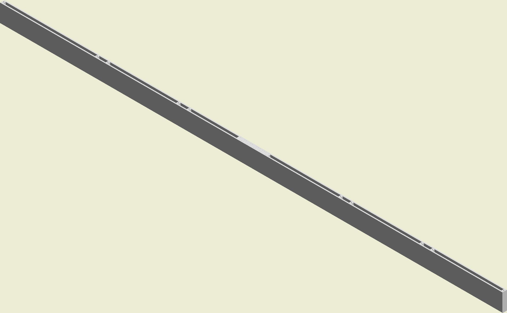

 
RAMPA1-4_20
8
4

BEAM Y
SAF-TRE-003-01-Y
2
12

JOINER BLOCK ASSEMBLY
SAF-TRE-001-A17
1
13

3 Adi Dassler Way

Paris, ON.

41 21/32 in

35 1/32 in

NOTE:
TO BE SHIPPED LOOSE

31 5/8 in
[803 mm]

35 1/32 in

[890 mm]

[1058 mm]

N3L OB9
Tel. 1.519.442.7000
Fax 1.519.442.7535

[890 mm]

3 25/32 in

3 25/32 in

3 25/32 in

3 25/32 in

[96 mm]

[96 mm]

[96 mm]

[96 mm]

111 1/2 in
[2832 mm]

111 1/2 in
[2832 mm]

THIS DRAWING IS THE PROPERTY OF TC.
PARIS AND CANNOT BE REPRODUCED IN
ANY WAY WITHOUT CONSENT OF TC. PARIS 

Revisions

Customer Approval & Date

PERSPECTIVE VIEW

_________________
DENOTES 

8 in
[203 mm]

SAF-TRE-003-A31
ASSEMBLY FULL BEAM

EE

2 in
[51 mm]

223 1/32 in

[5665 mm]

REVISION

BGI Standard Assembly Parts List

DESCRIPTION
PART NUMBER
QTY
ITEM

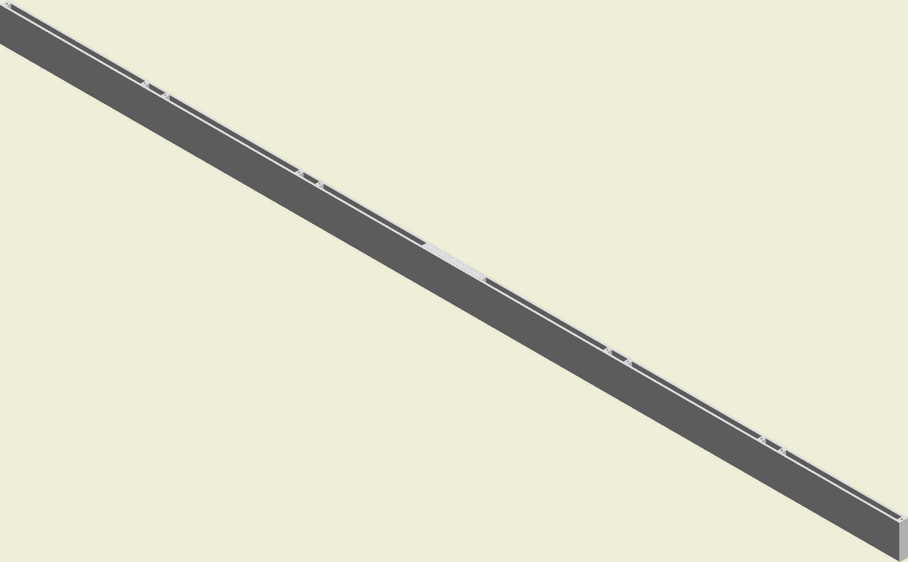

SPACER SUPPORT
SAF-TRE-001-02
10
1

FINISHED END
SAF-TRE-001-04
2
2

 
RAMPA1-4_20
8
4

BEAM R
SAF-TRE-003-01-R
2
6

JOINER BLOCK ASSEMBLY
SAF-TRE-001-A17
1
7

Project:

32 11/32 in

35 1/32 in

27 31/32 in

35 1/32 in

[821 mm]

[890 mm]

[710 mm]

[890 mm]

SAFEWAY EVOLUTION

DESIGN

NOTE:
TO BE SHIPPED LOOSE

3 25/32 in

3 25/32 in

3 25/32 in

3 25/32 in

Document Title:

[96 mm]

[96 mm]

[96 mm]

[96 mm]

105 in
[2667 mm]

105 in
[2667 mm]

ASSEMBLY

Manufacturing Status:

Scale:

1 / 29

APPROVED

B
/ 11" x 17"

PM/PC:

8 in
[203 mm]

Drawn By:

hawleyn

PERSPECTIVE VIEW

Job Number:

SAF-TRE-003-A32
ASSEMBLY FULL BEAM

Revision Level:

3

FF

2 in
[51 mm]

210 1/32 in

[5335 mm]

Drawing Page: 

24 
32 

Of

Part Number:

SAF-TRE-003

C:\Engineering\Projects\Wood\SOBEYS (SOB)\SAF-TRE-003--Safeway Evolution Design Prototype\SAF-TRE-003.idw

## Page 25

BGI Standard Assembly Parts List

DESCRIPTION
PART NUMBER
QTY
ITEM

SPACER SUPPORT
SAF-TRE-001-02
10
1

FINISHED END
SAF-TRE-001-04
2
2

 
RAMPA1-4_20
8
4

BEAM Z
SAF-TRE-003-01-Z
2
13

JOINER BLOCK ASSEMBLY
SAF-TRE-001-A17
1
14

3 Adi Dassler Way

17 11/32 in

35 1/32 in

18 31/32 in

36 in
[914 mm]

NOTE:
TO BE SHIPPED LOOSE

Paris, ON.

[440 mm]

[890 mm]

[481 mm]

N3L OB9
Tel. 1.519.442.7000
Fax 1.519.442.7535

3 25/32 in

3 25/32 in

3 25/32 in

3 25/32 in

[96 mm]

[96 mm]

[96 mm]

[96 mm]

93 in
[2362 mm]

93 in
[2362 mm]

THIS DRAWING IS THE PROPERTY OF TC.
PARIS AND CANNOT BE REPRODUCED IN
ANY WAY WITHOUT CONSENT OF TC. PARIS 

Revisions

PERSPECTIVE VIEW

SAF-TRE-003-A33
ASSEMBLY FULL BEAM

Customer Approval & Date

8 in
[203 mm]

_________________
DENOTES 

GG

2 in
[51 mm]

186 1/32 in

[4725 mm]

BGI Standard Assembly Parts List

REVISION

DESCRIPTION
PART NUMBER
QTY
ITEM

SPACER SUPPORT
SAF-TRE-001-02
8
1

FINISHED END
SAF-TRE-001-04
2
2

BEAM AA
SAF-TRE-003-01-AA
2
3

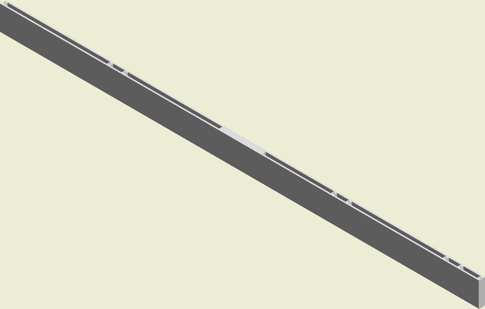

 
RAMPA1-4_20
6
4

33 29/32 in

JOINER BLOCK ASSEMBLY
SAF-TRE-001-A17
1
5

[862 mm]

6 3/8 in
[162 mm]

36 in
[914 mm]

Project:

SAFEWAY EVOLUTION

3 25/32 in

DESIGN

3 25/32 in

3 25/32 in

[96 mm]

[96 mm]

NOTE:
TO BE SHIPPED LOOSE

[96 mm]

77 in
[1956 mm]

77 in
[1956 mm]

Document Title:

ASSEMBLY

Manufacturing Status:

Scale:

1 / 26

APPROVED

B
/ 11" x 17"

PM/PC:

8 in
[203 mm]

Drawn By:

hawleyn

PERSPECTIVE VIEW

Job Number:

SAF-TRE-003-A34
ASSEMBLY FULL BEAM

Revision Level:

2 in
[51 mm]

3

HH

154 1/32 in

[3913 mm]

Drawing Page: 

25 
32 

Of

Part Number:

SAF-TRE-003

C:\Engineering\Projects\Wood\SOBEYS (SOB)\SAF-TRE-003--Safeway Evolution Design Prototype\SAF-TRE-003.idw

## Page 26

BGI Standard Assembly Parts List

DESCRIPTION
PART NUMBER
QTY
ITEM

SPACER SUPPORT
SAF-TRE-001-02
8
1

FINISHED END
SAF-TRE-001-04
2
2

BEAM BB
SAF-TRE-003-01-BB
1
3

 
RAMPA1-4_20
6
4

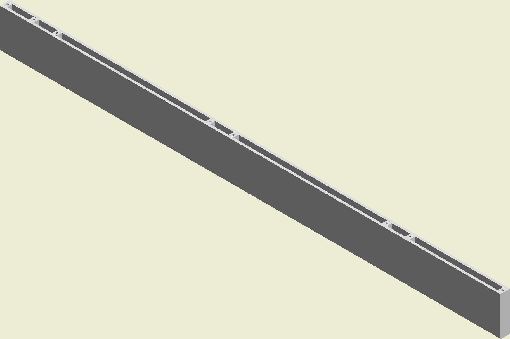

3 Adi Dassler Way

Paris, ON.

N3L OB9
Tel. 1.519.442.7000
Fax 1.519.442.7535

THIS DRAWING IS THE PROPERTY OF TC.
PARIS AND CANNOT BE REPRODUCED IN
ANY WAY WITHOUT CONSENT OF TC. PARIS 

Revisions

Customer Approval & Date

18 29/32 in

5 13/32 in

35 1/32 in

_________________
DENOTES 

[480 mm]

[137 mm]

[890 mm]

3 25/32 in

3 25/32 in

3 25/32 in

[96 mm]

[96 mm]

[96 mm]

PERSPECTIVE VIEW

102 in
[2591 mm]

SAF-TRE-003-A35

ASSEMBLY FULL BEAM II

REVISION

Project:

SAFEWAY EVOLUTION

DESIGN

Document Title:

ASSEMBLY

8 in
[203 mm]

Manufacturing Status:

Scale:

1 / 14

APPROVED

2 in
[51 mm]

B
/ 11" x 17"

102 1/32 in

[2592 mm]

PM/PC:

Drawn By:

hawleyn

Job Number:

Revision Level:

3

Drawing Page: 

26 
32 

Of

Part Number:

SAF-TRE-003

C:\Engineering\Projects\Wood\SOBEYS (SOB)\SAF-TRE-003--Safeway Evolution Design Prototype\SAF-TRE-003.idw

## Page 27

17 7/8 in
[454 mm]

1/4 in
[6 mm]

15/32 in
[12 mm]

90.0°

17 7/8 in
[454 mm]

3/32 in
[3 mm]

3 Adi Dassler Way

Paris, ON.

8 in
[203 mm]

8 in
[203 mm]

1 7/8 in
[48 mm]

N3L OB9
Tel. 1.519.442.7000
Fax 1.519.442.7535

SAF-TRE-003-01-AFP

BEAM A FLAT PATTERN

INFINITY1-2-5X10

THIS DRAWING IS THE PROPERTY OF TC.
PARIS AND CANNOT BE REPRODUCED IN
ANY WAY WITHOUT CONSENT OF TC. PARIS 

Revisions

Customer Approval & Date

17 7/8 in
[454 mm]

8 in
[203 mm]

8 in
[203 mm]

_________________
DENOTES 

64 in
[1626 mm]

2 in
[51 mm]

64 in
[1626 mm]

SAF-TRE-003-01-A

BEAM A

INFINITY1-2-5X10

SAF-TRE-003-01-AFP

BEAM A FLAT PATTERN

INFINITY1-2-5X10

REVISION

17 7/8 in
[454 mm]

8 in
[203 mm]

8 in
[203 mm]

Project:

SAFEWAY EVOLUTION

2 in
[51 mm]

60 in
[1524 mm]

DESIGN

60 in
[1524 mm]

Document Title:

SAF-TRE-003-01-B

SAF-TRE-003-01-BFP

BEAM B

BEAM B FLAT PATTERN

INFINITY1-2-5X10

PARTS

INFINITY1-2-5X10

Manufacturing Status:

Scale:

1 / 2

APPROVED

B
/ 11" x 17"

PM/PC:

17 7/8 in
[454 mm]

8 in
[203 mm]

8 in
[203 mm]

Drawn By:

hawleyn

2 in
[51 mm]

Job Number:

75 in
[1905 mm]

75 in
[1905 mm]

Revision Level:

3

SAF-TRE-003-01-C

BEAM C

SAF-TRE-003-01-CFP

Drawing Page: 

INFINITY1-2-5X10

BEAM C FLAT PATTERN

27 
32 

Of

INFINITY1-2-5X10

Part Number:

SAF-TRE-003

C:\Engineering\Projects\Wood\SOBEYS (SOB)\SAF-TRE-003--Safeway Evolution Design Prototype\SAF-TRE-003.idw

## Page 28

17 7/8 in
[454 mm]

8 in
[203 mm]

8 in
[203 mm]

3 Adi Dassler Way

Paris, ON.

2 in
[51 mm]

N3L OB9
Tel. 1.519.442.7000
Fax 1.519.442.7535

85 in
[2159 mm]

85 in
[2159 mm]

SAF-TRE-003-01-D

BEAM D

INFINITY1-2-5X10

SAF-TRE-003-01-DFP

THIS DRAWING IS THE PROPERTY OF TC.
PARIS AND CANNOT BE REPRODUCED IN
ANY WAY WITHOUT CONSENT OF TC. PARIS 

BEAM D FLAT PATTERN

INFINITY1-2-5X10

Revisions

Customer Approval & Date

_________________
DENOTES 

17 7/8 in
[454 mm]

8 in
[203 mm]

8 in
[203 mm]

92 1/2 in
[2350 mm]

2 in
[51 mm]

92 1/2 in
[2350 mm]

SAF-TRE-003-01-E

SAF-TRE-003-01-EFP

BEAM E

BEAM E FLAT PATTERN

INFINITY1-2-5X10

INFINITY1-2-5X10

REVISION

17 7/8 in
[454 mm]

Project:

8 in
[203 mm]

8 in
[203 mm]

SAFEWAY EVOLUTION

DESIGN

2 in
[51 mm]

97 1/2 in
[2477 mm]

97 1/2 in
[2477 mm]

Document Title:

SAF-TRE-003-01-F

PARTS

BEAM F

SAF-TRE-003-01-FFP

INFINITY1-2-5X10

BEAM F FLAT PATTERN

INFINITY1-2-5X10

Manufacturing Status:

Scale:

1 / 18

APPROVED

B
/ 11" x 17"

PM/PC:

17 7/8 in
[454 mm]

8 in
[203 mm]

8 in
[203 mm]

Drawn By:

hawleyn

2 in
[51 mm]

Job Number:

100 in
[2540 mm]

100 in
[2540 mm]

Revision Level:

3

SAF-TRE-003-01-G

BEAM G

SAF-TRE-003-01-GFP

Drawing Page: 

INFINITY1-2-5X10

BEAM G FLAT PATTERN

28 
32 

Of

INFINITY1-2-5X10

Part Number:

SAF-TRE-003

C:\Engineering\Projects\Wood\SOBEYS (SOB)\SAF-TRE-003--Safeway Evolution Design Prototype\SAF-TRE-003.idw

## Page 29

3 Adi Dassler Way

Paris, ON.

8 in
[203 mm]

8 in
[203 mm]

N3L OB9
Tel. 1.519.442.7000
Fax 1.519.442.7535

17 7/8 in
[454 mm]

2 in
[51 mm]

95 in
[2413 mm]

THIS DRAWING IS THE PROPERTY OF TC.
PARIS AND CANNOT BE REPRODUCED IN
ANY WAY WITHOUT CONSENT OF TC. PARIS 

95 in
[2413 mm]

SAF-TRE-003-01-I

Revisions

BEAM I

SAF-TRE-003-01-IFP

INFINITY1-2-5X10

BEAM I FLAT PATTERN

INFINITY1-2-5X10

Customer Approval & Date

_________________
DENOTES 

8 in
[203 mm]

8 in
[203 mm]

17 7/8 in
[454 mm]

REVISION

91 in
[2311 mm]

2 in
[51 mm]

91 in
[2311 mm]

SAF-TRE-003-01-J

SAF-TRE-003-01-JFP

BEAM J

BEAM J FLAT PATTERN

INFINITY1-2-5X10

INFINITY1-2-5X10

Project:

SAFEWAY EVOLUTION

DESIGN

Document Title:

PARTS

Manufacturing Status:

Scale:

1 / 19

APPROVED

B
/ 11" x 17"

17 7/8 in
[454 mm]

8 in
[203 mm]

8 in
[203 mm]

PM/PC:

2 in
[51 mm]

87 1/2 in
[2223 mm]

Drawn By:

87 1/2 in
[2223 mm]

hawleyn

SAF-TRE-003-01-K

Job Number:

BEAM K

SAF-TRE-003-01-KFP

INFINITY1-2-5X10

BEAM K FLAT PATTERN

Revision Level:

INFINITY1-2-5X10

3

Drawing Page: 

29 
32 

Of

Part Number:

SAF-TRE-003

C:\Engineering\Projects\Wood\SOBEYS (SOB)\SAF-TRE-003--Safeway Evolution Design Prototype\SAF-TRE-003.idw

## Page 30

8 in
[203 mm]

8 in
[203 mm]

17 7/8 in
[454 mm]

3 Adi Dassler Way

2 in
[51 mm]

86 in
[2184 mm]

Paris, ON.

N3L OB9
Tel. 1.519.442.7000
Fax 1.519.442.7535

86 in
[2184 mm]

SAF-TRE-003-01-L

BEAM L

INFINITY1-2-5X10

SAF-TRE-003-01-LFP

BEAM L FLAT PATTERN

INFINITY1-2-5X10

THIS DRAWING IS THE PROPERTY OF TC.
PARIS AND CANNOT BE REPRODUCED IN
ANY WAY WITHOUT CONSENT OF TC. PARIS 

Revisions

Customer Approval & Date

_________________
DENOTES 

8 in
[203 mm]

8 in
[203 mm]

17 7/8 in
[454 mm]

2 in
[51 mm]

89 in
[2261 mm]

89 in
[2261 mm]

SAF-TRE-003-01-O

BEAM O

SAF-TRE-003-01-OFP

INFINITY1-2-5X10

BEAM O FLAT PATTERN

INFINITY1-2-5X10

2 in
[51 mm]

REVISION

8 in
[203 mm]

8 in
[203 mm]

8 in
[203 mm]

17 7/8 in
[454 mm]

17 7/8 in
[454 mm]

105 in
[2667 mm]

105 in
[2667 mm]

Project:

105 in
[2667 mm]

105 in
[2667 mm]

SAFEWAY EVOLUTION

DESIGN

SAF-TRE-003-01-R

BEAM R

SAF-TRE-003-01-RFP

Document Title:

INFINITY1-2-5X10

BEAM R FLAT PATTERN

INFINITY1-2-5X10

PARTS

Manufacturing Status:

Scale:

1 / 18

2 in
[51 mm]

APPROVED

B
/ 11" x 17"

PM/PC:

17 7/8 in
[454 mm]

17 7/8 in
[454 mm]

8 in
[203 mm]

8 in
[203 mm]

8 in
[203 mm]

Drawn By:

hawleyn

110 in
[2794 mm]

110 in
[2794 mm]

Job Number:

110 in
[2794 mm]

110 in
[2794 mm]

Revision Level:

3

SAF-TRE-003-01-SFP

BEAM S FLAT PATTERN
SAF-TRE-003-01-S

Drawing Page: 

INFINITY1-2-5X10

BEAM S

30 
32 

Of

INFINITY1-2-5X10

Part Number:

SAF-TRE-003

C:\Engineering\Projects\Wood\SOBEYS (SOB)\SAF-TRE-003--Safeway Evolution Design Prototype\SAF-TRE-003.idw

## Page 31

8 in
[203 mm]

8 in
[203 mm]

17 7/8 in
[454 mm]

2 in
[51 mm]

115 in
[2921 mm]

115 in
[2921 mm]

3 Adi Dassler Way

SAF-TRE-003-01-T

Paris, ON.

BEAM T

SAF-TRE-003-01-TFP

INFINITY1-2-5X10

N3L OB9
Tel. 1.519.442.7000
Fax 1.519.442.7535

BEAM T FLAT PATTERN

INFINITY1-2-5X10

8 in
[203 mm]

8 in
[203 mm]

THIS DRAWING IS THE PROPERTY OF TC.
PARIS AND CANNOT BE REPRODUCED IN
ANY WAY WITHOUT CONSENT OF TC. PARIS 

17 7/8 in
[454 mm]

Revisions

117 1/2 in
[2985 mm]

2 in
[51 mm]

117 1/2 in
[2985 mm]

Customer Approval & Date

SAF-TRE-003-01-U

_________________
DENOTES 

BEAM U

SAF-TRE-003-01-UFP

INFINITY1-2-5X10

BEAM U FLAT PATTERN

INFINITY1-2-5X10

8 in
[203 mm]

8 in
[203 mm]

17 7/8 in
[454 mm]

2 in
[51 mm]

118 1/2 in
[3010 mm]

118 1/2 in
[3010 mm]

REVISION

SAF-TRE-003-01-V

SAF-TRE-003-01-VFP

BEAM V

BEAM V FLAT PATTERN

INFINITY1-2-5X10

INFINITY1-2-5X10

Project:

SAFEWAY EVOLUTION

8 in
[203 mm]

8 in
[203 mm]

DESIGN

17 7/8 in
[454 mm]

Document Title:

PARTS

2 in
[51 mm]

119 in
[3023 mm]

119 in
[3023 mm]

Manufacturing Status:

Scale:

SAF-TRE-003-01-W

SAF-TRE-003-01-WFP

BEAM W

1 / 22

BEAM V FLAT PATTERN

APPROVED

INFINITY1-2-5X10

B
/ 11" x 17"

INFINITY1-2-5X10

PM/PC:

8 in
[203 mm]

8 in
[203 mm]

Drawn By:

17 7/8 in
[454 mm]

hawleyn

Job Number:

116 1/2 in
[2959 mm]

2 in
[51 mm]

116 1/2 in
[2959 mm]

Revision Level:

3

SAF-TRE-003-01-X

BEAM X

SAF-TRE-003-01-XFP

Drawing Page: 

INFINITY1-2-5X10

BEAM X FLAT PATTERN

31 
32 

Of

INFINITY1-2-5X10

Part Number:

SAF-TRE-003

C:\Engineering\Projects\Wood\SOBEYS (SOB)\SAF-TRE-003--Safeway Evolution Design Prototype\SAF-TRE-003.idw

## Page 32

3 Adi Dassler Way

8 in
[203 mm]

8 in
[203 mm]

Paris, ON.

N3L OB9
Tel. 1.519.442.7000
Fax 1.519.442.7535

17 7/8 in
[454 mm]

111 1/2 in
[2832 mm]

2 in
[51 mm]

111 1/2 in
[2832 mm]

THIS DRAWING IS THE PROPERTY OF TC.
PARIS AND CANNOT BE REPRODUCED IN
ANY WAY WITHOUT CONSENT OF TC. PARIS 

SAF-TRE-003-01-Y

SAF-TRE-003-01-YFP

BEAM Y

Revisions

BEAM Y FLAT PATTERN

INFINITY1-2-5X10

INFINITY1-2-5X10

Customer Approval & Date

_________________
DENOTES 

8 in
[203 mm]

8 in
[203 mm]

17 7/8 in
[454 mm]

2 in
[51 mm]

93 in
[2362 mm]

93 in
[2362 mm]

SAF-TRE-003-01-Z

BEAM Z

SAF-TRE-003-01-ZFP

INFINITY1-2-5X10

BEAM Z FLAT PATTERN

REVISION

INFINITY1-2-5X10

8 in
[203 mm]

8 in
[203 mm]

17 7/8 in
[454 mm]

Project:

SAFEWAY EVOLUTION

DESIGN

77 in
[1956 mm]

77 in
[1956 mm]

2 in
[51 mm]

Document Title:

SAF-TRE-003-01-AAFP

BEAM AA FLAT PATTERN
SAF-TRE-003-01-AA

PARTS

BEAM AA

INFINITY1-2-5X10

INFINITY1-2-5X10

Manufacturing Status:

Scale:

1 / 22

APPROVED

B
/ 11" x 17"

8 in
[203 mm]

8 in
[203 mm]

PM/PC:

17 7/8 in
[454 mm]

Drawn By:

hawleyn

102 in
[2591 mm]

2 in
[51 mm]

Job Number:

102 in
[2591 mm]

Revision Level:

SAF-TRE-003-01-BBFP

BEAM BB FLAT PATTERN
SAF-TRE-003-01-BB

3

BEAM BB

INFINITY1-2-5X10

INFINITY1-2-5X10

Drawing Page: 

32 
32 

Of

Part Number:

SAF-TRE-003

C:\Engineering\Projects\Wood\SOBEYS (SOB)\SAF-TRE-003--Safeway Evolution Design Prototype\SAF-TRE-003.idw

