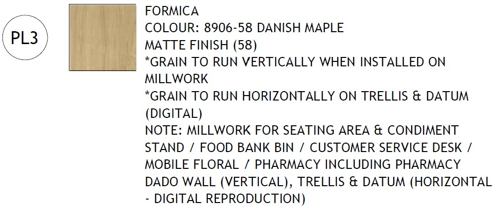

# CLAR 2445-15 - Safeway Aurora - Regina SK

**Source**: `CLAR 2445-15 - Safeway Aurora - Regina SK.pdf`  
**Pages**: 1  
**Extracted**: 2026-01-09 18:30:58

---

## Page 1

CLARIFICATION

2445-15

 
This notice is clarification and authorization on work to be performed.  There will be no change to Contract Price or construction schedule.   
If a change is to occur, notify Architect and appropriate action will follow. 
 
 
TO: 
QUOREX CONSTRUCTION SERVICES LTD. 
 
 
 
1630A 8th Avenue,  
 
 
Regina, SK S4R 1E5 
 
 
RE: 
AURORA FOOD STORE 
 
 
2000 ANAQUOD ROAD 
 
 
REGINA, SK 
 
 
Commission No. 2445 
 
 
 
DATE: 
December 5, 2025 
 
 
 
PAGES: 
1 (including cover)  
 
 
 
RE: 
Pony Walls 
 

 
1.0 
ARCHITECTURAL / DECOR 
 

.1 
Refer to PCN 2445-28 and PCN 2445-48. 
Customer Service and Floral Pony Walls to be 54” high with 6” steel studs,  
corner guards and stainless steel cap. 
 
Walls to receive PL3 (Danish Maple) full height and rubber base (no painted gypsum board). 

 
 
 
Distribution: 
Sobeys Inc. – Jeff Craig 
jeff.craig@sobeys.com 
Sobeys Inc. – Shanwen Hsu 
shanwen.hsu@sobeys.com 
Quorex Construction Services Ltd. – Chris Walbaum 
c.walbaum@quorex.ca 
Quorex Construction Services Ltd. – Dustin Williamson 
d.williamson@quorex.ca 
Lavergne Draward & Associates Inc. – Charles Koop 
ckoop@ldaeng.ca 
CGM Engineering – Justin Albo 
justin_albo@cgmeng.ca 
CGM Engineering – Tony Mitousis 
tony_mitousis@cgmeng.ca 
CGM Engineering – Brendan Simpson 
brendan_simpson@cgmeng.ca 
 
 
 
 
 
 
 
 
 
Principal 
Kevin Fawley, SAA MRAIC  

