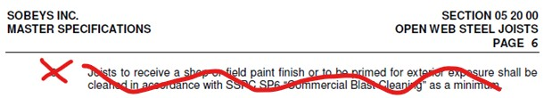

# Clarification #01

**Source**: `Clarification #01.pdf`  
**Pages**: 1  
**Extracted**: 2026-01-09 18:30:58

---

## Page 1

CLARIFICATION

2445-01

 
This notice is clarification and authorization on work to be performed.  There will be no change to Contract Price or construction schedule.   
If a change is to occur, notify Architect and appropriate action will follow. 
 
 
TO: 
QUOREX CONSTRUCTION SERVICES LTD. 
 
 
 
1630A 8th Avenue,  
 
 
Regina, SK S4R 1E5 
 
 
RE: 
AURORA FOOD STORE 
 
 
4801 OPTIMIST DRIVE 
 
 
REGINA, SK 
 
 
Commission No. 2445 
 
 
 
DATE: 
February 26, 2025 
 
 
PAGES: 
1 (including cover) 
 
 
RE: 
Open Web Steel Joists Finish 
 
 
1.0 
PROJECT MANUAL / STRUCTURAL 
 
 
.1 
Refer to Section 05 20 00 Open Web Steel Joists. Delete item 3.2.8. 
 

 
 
 
.2 
One coat Primer per CISC/CPMA 2-75 is NOT required for OWSJ. 
 
 
 
 
 
 
Distribution: 
Sobeys Inc. – Susan Fragoso 
Susan.Fragoso@sobeys.com 
Sobeys Inc. – Jeff Craig 
Jeff.Craig@sobeys.com 
Sobeys Inc. – Shanwen Hsu 
Shanwen.Hsu@sobeys.com 
Lavergne Draward & Associates Inc. – Charles Koop 
ckoop@ldaeng.ca 
CGM Engineering – Justin Albo 
justin_albo@cgmeng.ca 
CGM Engineering – Marc Pelland 
marc_pelland@cgmeng.ca 
CGM Engineering – Brenden Simpson 
brendan_simpson@cgmeng.ca 
Quorex Construction Services Ltd. – Kyle Fairbairn 
k.fairbairn@quorex.ca 
Quorex Construction Services Ltd. – Chris Walbaum 
c.walbaum@quorex.ca 
Nejmark Architect – Adil Khalil 
adil@nejmark.mb.ca 
Nejmark Architect – Kevin Fawley 
kevin@nejmark.mb.ca 
 
 
 
 
 
 
 
 
 
Project Director 
Principal 
Adil Khalil 
 
Kevin Fawley, SAA MRAIC  

