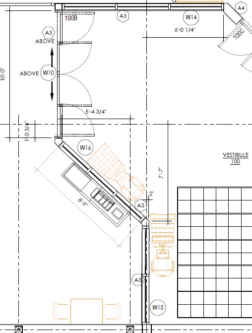

# Clarification #05 - Vestibule Windows

**Source**: `Clarification #05 - Vestibule Windows.pdf`  
**Pages**: 1  
**Extracted**: 2026-01-09 18:30:59

---

## Page 1

CLARIFICATION

2445-05

 
This notice is clarification and authorization on work to be performed.  There will be no change to Contract Price or construction schedule.   
If a change is to occur, notify Architect and appropriate action will follow. 
 
 
TO: 
QUOREX CONSTRUCTION SERVICES LTD. 
 
 
 
1630A 8th Avenue,  
 
 
Regina, SK S4R 1E5 
 
 
RE: 
AURORA FOOD STORE 
 
 
2000 ANAQUOD ROAD 
 
 
REGINA, SK 
 
 
Commission No. 2445 

 
 
DATE: 
April 21, 2025 

 
 
PAGES: 
1 (including cover) 

 
 
RE: 
Vestibule Windows 

 
1.0 
ARCHITECTURAL 
 

.1 
Reduce width of #W16 rough opening by nine inches from +/-9’-6” to be +/- 8’-9”: 

 
 
 
 
 
Distribution: 
Sobeys Inc. – Jeff Craig 
jeff.craig@sobeys.com 
Sobeys Inc. – Shanwen Hsu 
shanwen.hsu@sobeys.com 
Lavergne Draward & Associates Inc. – Charles Koop 
ckoop@ldaeng.ca 
CGM Engineering – Justin Albo 
justin_albo@cgmeng.ca 
CGM Engineering – Tony Mitousis 
tony_mitousis@cgmeng.ca 
CGM Engineering – Brenden Simpson 
brendan_simpson@cgmeng.ca 
Quorex Construction Services Ltd. – Chris Walbaum 
c.walbaum@quorex.ca 
 
 
 
 
Principal 
Kevin Fawley, SAA MRAIC  

