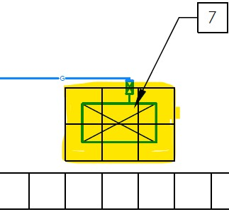

# Clarification #11 - Refrigeration Generator Installation

**Source**: `Clarification #11 - Refrigeration Generator Installation.pdf`  
**Pages**: 1  
**Extracted**: 2026-01-09 18:30:59

---

## Page 1

CLARIFICATION

2445-11

 
This notice is clarification and authorization on work to be performed.  There will be no change to Contract Price or construction schedule.   
If a change is to occur, notify Architect and appropriate action will follow. 
 
 
TO: 
QUOREX CONSTRUCTION SERVICES LTD. 
 
 
 
1630A 8th Avenue,  
 
 
Regina, SK S4R 1E5 
 
 
RE: 
AURORA FOOD STORE 
 
 
2000 ANAQUOD ROAD 
 
 
REGINA, SK 
 
 
Commission No. 2445 
 
 
 
DATE: 
August 20, 2025 
 
 
 
PAGES: 
1 (including cover)  
 
 
 
RE: 
Refrigeration Generator Installation 

 
1.0 
ARCHITECTURAL 
 

.1 
Delete sleeper curbs from below roof top generator. Provide concrete pads/insulation. 
 
.2 
Modify Keynote #7/A1.3 to read: 
 
 
REFRIGERATION GENERATOR, PROVIDE 2" X 2' X 2' CONCRETE PAVERS ON 
 
2" RIGID SM INSULATION BELOW.  REFER TO ELECTRICAL. 
 

 
 
 
Distribution: 
Sobeys Inc. – Jeff Craig 
jeff.craig@sobeys.com 
Sobeys Inc. – Shanwen Hsu 
shanwen.hsu@sobeys.com 
Quorex Construction Services Ltd. – Chris Walbaum 
c.walbaum@quorex.ca 
Quorex Construction Services Ltd. – Dustin Williamson 
d.williamson@quorex.ca 
Lavergne Draward & Associates Inc. – Charles Koop 
ckoop@ldaeng.ca 
CGM Engineering – Justin Albo 
justin_albo@cgmeng.ca 
CGM Engineering – Tony Mitousis 
tony_mitousis@cgmeng.ca 
CGM Engineering – Brendan Simpson 
brendan_simpson@cgmeng.ca 
 
 
 
 
 
 
 
 
Principal 
Kevin Fawley, SAA MRAIC  

