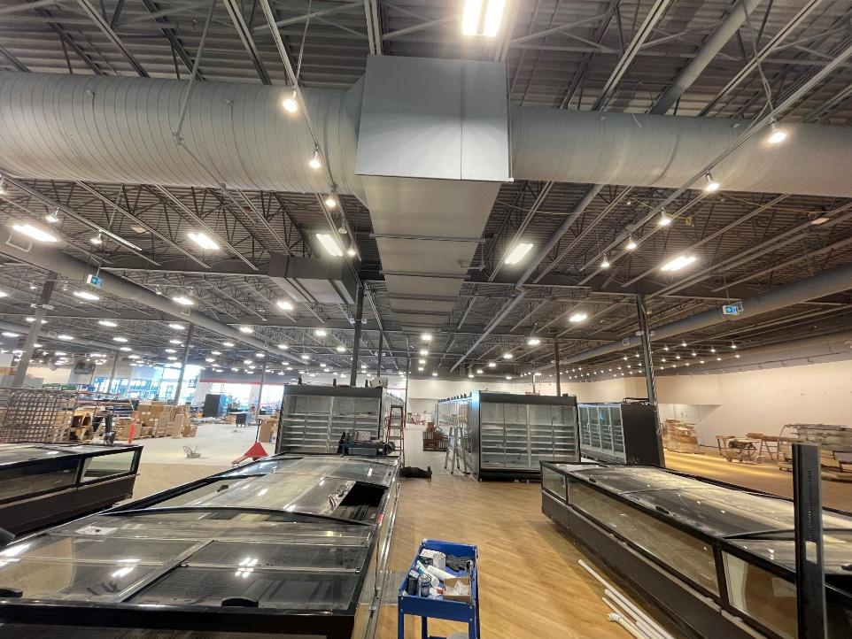

# Clarification #16 - Lighting at RTU-1

**Source**: `Clarification #16 - Lighting at RTU-1.pdf`  
**Pages**: 3  
**Extracted**: 2026-01-09 18:30:59

---

## Page 1

CLARIFICATION 

2445-16 

This notice is clarification and authorization on work to be performed.  There will be no change to Contract Price or construction schedule. 
If a change is to occur, notify Architect and appropriate action will follow. 

TO: 

QUOREX CONSTRUCTION SERVICES LTD. 
1630A 8th Avenue,  
Regina, SK S4R 1E5 

RE: 

AURORA FOOD STORE 
2000 ANAQUOD ROAD 
REGINA, SK 
Commission No. 2445 

DATE: 

December 23, 2025 

PAGES: 

3 (including cover)  

RE: 

Lighting at RTU-1 

 
1.0 
ELECTRICAL 

.1 
Refer to attached Electrical PCN #2, dated December 10, 2025. 
(1 page text, 1 full size drawing E1.0) 

Distribution: 
Sobeys Inc. – Jeff Craig 
jeff.craig@sobeys.com 
Sobeys Inc. – Shanwen Hsu 
shanwen.hsu@sobeys.com 
Quorex Construction Services Ltd. – Chris Walbaum 
c.walbaum@quorex.ca
Quorex Construction Services Ltd. – Dustin Williamson 
d.williamson@quorex.ca
Lavergne Draward & Associates Inc. – Charles Koop 
ckoop@ldaeng.ca 
CGM Engineering – Justin Albo 
justin_albo@cgmeng.ca 
CGM Engineering – Tony Mitousis 
tony_mitousis@cgmeng.ca 
CGM Engineering – Brendan Simpson 
brendan_simpson@cgmeng.ca 

Principal 
Kevin Fawley, SAA MRAIC 

## Page 2

 
ELECTRICAL CLARIFICATION #2 
 
24-258 
 

Project: 
Aurora Grocery Store 
 
2000 Anaquod Road, Regina, Saskatchewan 
Subject: 
Relocation of Lights for RTU-1 Duct Work 
Date: 
2025.12.10 
 

Subject: 
Relocation of Lights for RTU-1 Duct Work 
References: 
Electrical Drawing E1.0 – Floor Plan - Lighting 
 

1. 
Refer to attached drawing E1.0 – Floor Plan - Lighting for the relocation of two(2) type S luminaires 
to accommodate the RTU-1 duct work. Example site photo is shown below for reference. 

Brendan Simpson, E.I.T. 
- 1 - 

200-1100 Corydon Avenue     Winnipeg, Manitoba     R3M 0Y8     204-272-3255     www.cgmeng.ca 

## Page 3

8.1

8

7

6

5

4

3

2

1

9

1

3

2

6L-24

J
H
G
F
E
D
C
B
A

B
A

STAIRS
#2

6L-16

6L-16

GLASS &
ORGANICS
RECYCLE
194

N
 COMPRESSOR ROOM - LIGHTING

X2

LA

LA

LA

300A

6L-16

DN
21R

LA

SCALE:
E1.0

6L-16

2
SCALE:
E1.0

190D

EMERGENCY
CONDENSING
UNIT

RECEIVING
190

194

H1

H1
H1

H1
H1

6L-16

6L-16

6L-16

LA

LA

LA

1/8" = 1'-0"

6L-18

6L-18

6L-18
6L-18

193

CLEAN-UP
AREA
193

COMPRESSOR
ROOM
300

X2

6L-24

190C
190B

SPRINKLER ROOM
192

REFRIGERATION
RACK

300B

LA

LA

LA

F
F

6L-18

6L-18

6L-18

2L-11

H1

6L-24

6L-16

6L-16

6L-16

6L-24

X2

X2

LA

LA

6L-18

2L-11

LA

6L-18

STAIRS
#3

X2

6L-24

6L-24

6L-24

6L-24

6L-24

X2

X2

X2

X2

190A

6L-24

X1

6L-11

6L-11

BAKERY FREEZER
131

F1
F1

F1
F1

DELI
COOLER
121

F1

VT
VT

VT
VT

CHEESE
PREP
123

R

VT

6L-13

2L-10

6L-17

N
 FLOOR PLAN - LIGHTING

6L-17

F1

F1

F1

IT
ROOM
114
DEP.
MAN.
113

STORE MAN.
OFFICE
112

6L-13

6L-11

F1
F1

113

6L-11

6L-16

6L-13

6L-13

6L-13

OC

OC

S
S
S
S
S
S
S
S
S
S
S
S
S
S
S
S

SCALE:
E1.0

A

6L-17

6L-17

6L-17

6

F1

6L-17
6L-17

F1

F1

F1

6L-11

1

6L-17

6L-17

OC

2L-1

2L-18

DELI
PREP
120

OC
F1

F1

6L-11

R

F1
F1

2L-10

F1
F1
OC

6L-11

6L-11

6

OC
OC

131

1/8" = 1'-0"

6L-13
6L-13

BAKERY
PREP
130

8

7

6L-17

2L-22

6L-17

6L-17

2L-1

F1

F1

F1

B

B

B

B

B

B

B

B

B

B

B

114

112

6

A

6L-24

2L-4

2L-4

2L-4

2L-4

2L-4

2L-4

2L-4

2L-4

2L-4

2L-4

2L-4

LEARN
OFFICE
111

2L-1

2L-13

A

F1

OC

A

F1

X2

6L-11

2L-1

6L-16

B

B

B

B

B

B

FILE
MAN
115

6L-24

X1

6L-11

R

2L-1

6L-17

6L-17

6L-17

F1

F1

F1

2L-10

2L-4

2L-4
2L-4

2L-4
2L-4

2L-4
2L-4

2L-4
2L-4

2L-4

2L-4

2L-4

2L-4

2L-4

2L-4

2L-4

2L-4

2L-4

2L-4

2L-4
2L-4

111

115

6L-11

2L-1

116

B

S
S
S
S
S
S
S
S
S
S
S
S

C
B

FLORAL COOLER
109
CASH OFFICE
116

N
 LUNCH ROOM - LIGHTING

130

F1

2L-10

F1

6L-11

6L-11

6L-2

OC

F1
F1
OC

R

6L-11

6L-11
6L-11

N

N

N

N

6L-1

2L-4

2L-4

2L-4

2L-4

2L-4

2L-4

2L-4

6L-1

6L-1

6L-11

6L-11

6L-11

S
S

3

STAFF
117

132

P1

OC

118

F1

6L-11

P1
P1

6L-2

P1
P1
P1

6L-1

STAFF LOUNGE
201

6L-1

6L-1

N

N

N

N

OC

6L-1

2L-4

2L-4

2L-4

BAKERY
COOLER
132

TYP.

6L-16

6L-1

6L-1

P1
P1

4

6L-11

6L-11

6L-11

6L-1

STAIRS
#1

VT

VT

1/8" = 1'-0"

P1
P1
P1

6L-1

TYP.

A

P1

6L-1

LA

1

6L-17

6L-17

UP
21R

6L-1

6L-11

2L-1

P1

P1

6L-3

6L-11

6L-11

2L-1

TYP.

6L-1

TYP.

109B

5

6L-1

P1
P1
P1

6L-24

X1

2

UNIVERSAL
WASHROOM
106

WOMEN'S WR
202

N
N
N

A
A

S
S
S
S
S
S
S
S
S
S

S
S
S
S
S
S
S
S
S
S
S

S
S
S
S
S
S
S
S
S
S
S

S
S
S
S
S
S
S
S
S
S
S

S
S
S
S
S
S
S
S
S
S
S

S
S
S
S
S
S
S
S
S
S
S

MEN'S WR
203

P1
P1

OC

P1

6L-2

6L-1
6L-1

6L-1

6L-11

6L-11

6L-11

6L-2

6L-1

6L-2

6L-2

6L-2

6L-2

6L-2

6L-2

P1

P1

6L-1
6L-1

6L-11
6L-11

VT

P1

110

6L-1

6L-1

6L-2

P1

6L-11

6L-11

P1

VT
VT
VT
VT
OC

HALL
205

6L-1

P1

P1

6L-24

P1

P1

2L-20

6L-20

OC

OC

106

P1

LA
LA

203

202

P1

OC

6L-1

6L-11

109A

6L-16

X2

P1

6L-9

2L-3

WASHROOM
105
JANITOR
107

6L-4

OC
OC

B
B
B

P1

LA

6L-20

6L-1

FLORAL PREP
108

6L-4
6L-4

F1

107

S

6

6L-1

6L-1

N

N

N

P1

DAIRY COOLER
133

LOCKERS
204

DN

6L-1

6L-4

6L-11

6L-11

6L-11

6L-11

6L-4

6L-1

6L-1

P1

P1

P1

OC

TYP.

3

105

6L-1

P1

6L-9

P1

P1

6L-11

6L-11

P1

6L-1

6L-4

6L-4

6L-4

6L-4

6L-4

N

P1

6L-11

6L-24

X1

LA

6L-16

2L-3

6L-11

S

S

6L-20

6L-9

S
S

104

6L-4

6L-20

6L-2

6L-2

133

6L-2

6L-2

6L-2

6L-2

6L-2

S

S

6L-9

6L-24

B
B
B
B

DRAWING NOTES - LIGHTING

B
B
B
B
B
B
B
B
B
B

6L-2

6L-2

2L-3

2L-9

6L-16

1

2

3

4

5

6

2L-3

6L-16

S

X2
X2

191A

ALL TRACK LIGHTING TO BE SUSPENDED ON THREADED ROD.
FOLLOW MANUFACTURER'S DIRECTIONS FOR QUANTITIES OF
SUSPENSION POINTS. TYPICAL.

PRIOR TO ROUGH-IN OF ALL COOLER/FREEZER LUMINAIRES,
COORDINATE WITH THE REFRIGERATION CONTRACTOR TO AVOID
CONFLICT WITH EVAPORATION COILS. SEAL CONDUIT TO
LUMINAIRES. TYPICAL.

PROVIDE CEILING MOUNT LOW TEMPERATURE OCCUPANCY
SENSOR. COORDINATE WITH REFRIGERATION CONTRACTOR SO
SENSOR IS NOT IN DIRECT LINE OF COIL AIR FLOW. TYPICAL OF ALL
COOLERS.

PROVIDE DUAL-TECH OCCUPANCY SENSOR. PROVIDE VOLTAGE TO
SUIT. SENSOR TO PROVIDE LOCAL CONTROL OF THE LIGHTS IN THE
AREA. TYPICAL.

LIGHT FIXTURE TYPE 'S' TO BE SUSPENDED WITH AIRCRAFT CABLE
FROM UNISTRUT SUPPORT BETWEEN JOISTS. TYPICAL.

CONFIRM EXACT ILLUMINATION AND POWER SUPPLY
REQUIREMENTS WITH ILLUMINATED SIGNAGE SUPPLIER.

G.2
F.1
H
G.1
F.3
F
E.2
E.1
D.1

119C

6L-24

X1

6L-4

S
S
S
S
S
S
S
S
S

141A

6L-4

6L-4

6L-4

6L-4

6L-4

6L-4

6L-4

CONSULT
ROOM
141

S
S
S
S
S

S
S
S
S
S

2L-9

6L-9

6L-15

F3

F3

6L-15

S
S
S
S
S
S
S

2L-3

6L-9

6L-9

6L-16

OC

6L-6

141B

140A
140B
140C

6L-6

6L-6

6L-6

6L-6

6L-6

6L-6

6L-6

2L-9

2L-3

6L-15

6L-15

F3

F3

6L-9

6L-9

6L-9

2L-1

6L-24

X1

WAREHOUSE
191

SALES
119

6L-8

6L-8

6L-8

6L-8

6L-8

6L-8

6L-8

2L-17

6L-16

6L-24

2L-9

2L-3

CHECKOUTS
104

F3

F3

6L-15

6L-15

X2

6L-9

6

6L-9

6L-9

OUTDOOR SEATING
103A

NOTES:
1. ZONE SCHEDULE SHOWN FOR INFORMATION ONLY. WIRING, COMPONENT AND PROGRAMMING REQUIREMENTS TO BE
COORDINATED WITH THE SUPPLIER FOR THE SYSTEM USED.

LIGHTING ZONE SCHEDULE

ZONE
LIGHTING
CIRCUIT
AREA DESCRIPTION
CONTROL SCHEME

6L-6

6L-6

6L-6

6L-6

6L-6

6L-6

6L-6

10
6L-21
SEAFOOD / MEATS / PRODUCE
EMS TIMECLOCK / OCCUPANCY SENSORS

12
6L-20
LARGE COOLERS
OCCUPANCY SENSOR

13
2L-2
SEATING
EMS TIMECLOCK

14
6L-11
OFFICE
OCCUPANCY SENSOR

15
6L-24
EXTERIOR LIGHTS
EMS TIMECLOCK

11
6L-19
H.M.R.
EMS TIMECLOCK / OCCUPANCY SENSORS

3
6L-10, 6L-12
6L-14
SALES AREA HIGH BAYS - EAST
EMS TIMECLOCK

5

6
6L-16
2L-11
WAREHOUSE / RECEIVING
EMS TIMECLOCK

7
6L-18
COMPRESSOR ROOM
EMS TIMECLOCK

8
6L-17
BAKERY
EMS TIMECLOCK / OCCUPANCY SENSORS

9
6L-15
PHARMACY
EMS TIMECLOCK / OCCUPANCY SENSORS

2
6L-2, 6L-4
6L-6, 6L-8
SALES AREA HIGH BAYS - WEST
EMS TIMECLOCK

4
6L-1, 6L-3,
6L-5, 6L-7
347V SALES AREA POT LIGHTS
EMS TIMECLOCK

1
6L-22
VESTIBULE
EMS TIMECLOCK

B

2L-3

2L-9

2L-2, 2L-4,
2L-6, 2L-8
2L-10, 2L-12

6L-24

X1

6L-16

6L-15

F3

F3

6L-15

6L-8

140D

6L-9

6L-8

6L-9

6L-9

142

120V SALES AREA TRACK AND
BULKHEAD LIGHTING
EMS TIMECLOCK

6L-8

6L-8

6L-8

6L-8

2L-9

B
B
B
B

6L-8

6L-8

B

2L-9

2L-3

OC

F3

6L-6

6L-15

B

6L-9

2L-9
2L-9

2L-9

SERVICE
DESK
103

6L-9

6L-9

RB

RB

6L-6

6L-6

6L-6

6L-6

6L-6

6L-6

E.3
H.1
F.2
G.3

6L-24

2L-2
2L-2

2L-2

2L-3

6L-16

6L-24

X1

S
S

6L-8

X2

RB

RB

2L-2

2L-9

B

6L-8

6L-7

S

S

6L-7

6L-9

S

S
S

B
B
B

6L-9

6L-9

6L-8

6L-8

6L-8

6L-8

6L-8

6L-8

2L-7

2L-9

2L-3

6L-16

6L-16

119D

SEATING
101

SELF CHECKOUTS
102

2L-7

2L-12

6L-10

R

6L-10

6L-10

6L-10

6L-10

6L-10

6L-7

S

S

6L-7

6L-9

S

6L-10

6L-10

B
B

2L-5

6L-9

6L-9

2L-3

2L-7

6L-14

6L-19

6L-19

6L-19

F1
F1
F1

F1

F1
F1
F1
F1

153B
154

6L-7

100B

S

OC

6L-16

S

S

2L-5

S
S
S
S

S

S

LA
LA
LA

B

6L-12

6L-12

6L-12

6L-12

2L-7

6L-22

2L-5

2L-3

S

S

6L-24

LA
LA
LA

6L-10

C

6L-9

6L-9

6L-22
6L-22

GROCERY FREEZER
154

VT
VT

VT
VT

2L-7

B

6L-20

6L-20

100A

X2

6L-22

LA
LA
LA

6L-22
6L-22

VESTIBULE
100

S

S

6L-19

6L-19

6L-20

6L-20

S

S

6L-22

LA
LA
LA

100C

6L-10

6L-10

6L-12
6L-10

6L-10

6L-22

C

6L-14

R

2L-7

B

6L-16

2L-7

HMR PREP
181

6L-22

2L-12

2L-14

R

HMR
180

S

S

B

6L-14

6L-14

6L-22

2L-7

B

2L-7

S

S

6L-14

6L-12

6L-12

6L-22

6L-19

6L-19

6

182

6L-22

2L-12

R
R
R

6L-14

S
S

MEAT/KITCHEN
FREEZER
153

LA
LA

S

S

VT
VT

6L-22

6L-12

6L-12

6L-20

LA
LA

6L-19

VT
VT

6L-16

S

S

OC

KITCHEN
COOLER
182

6L-22

6L-19

6L-19

B

F1

6L-10

6L-10

S

S

2L-5
2L-7

OC

6L-20

2L-5

6L-14

6L-14

6L-14

A

6L-22

6L-19

6L-10

2L-5

6L-24

2L-8

B

6L-22

2L-8
2L-8

B

2L-8

LA
LA

2L-8

B

6L-22

191B

2L-8
2L-8

B

153A

2L-8

2L-8

LA

S

B

2L-8
2L-8

6L-22

2L-8

152

6L-10

2L-8

B

2L-8
2L-8

B

2L-8

6L-16

VT
VT
VT
VT
OC

R

6L-22

B

2L-8

6L-20

2L-12

2L-8

S

S

S
S

S
S

B

2L-5

B
B

B

B

B

B

B

B

6L-14

6L-14

6L-14

6L-14

MEAT COOLER
152

A

2L-8
2L-8

2L-8

B

2L-12

2L-6

2L-8

2L-8

2L-8

2L-8

2L-8

2L-8

6L-20

B
B

B

6L-21

2L-6

B

2L-19

2L-8

VT
VT
VT
VT

B

B

B

2L-8

2L-8

2L-8

2L-8

2L-8

2L-8

2L-8

6L-21

6L-24

X1

151A

2L-6

B

F1

2L-8
2L-8

2L-6

2L-6

2L-8

2L-6

B

MEAT PREP
151

2L-6

2L-6

2L-8
2L-8

2L-6

2L-6

B

6

2L-6

B

2L-8

2L-8

2L-8

2L-8

2L-8

2L-8

2L-8

6L-21

2L-6

2L-6

6L-14

2L-6

B
B

2L-6

6L-21

6L-16

2L-6

B

2L-6

F1

2L-5

2L-6

2L-6

151B

2L-6

A

S
S

2L-6

6L-21

B

6L-20

F1

2L-6

2L-6

VT

BUTCHER SHOP
150

2L-6

6L-14

2L-6

6L-21

2L-6

R

B

2L-8

6L-21

R

2L-6

2L-6

2L-12

2L-6

2L-6

VT

2L-21

2L-12

6L-14

2L-6

6L-20

2L-6

6L-24

6L-21

2L-6

6L-24

X1

6L-21

SEAFOOD
PREP
137

F1

6L-21

6L-21

6L-21

6

2L-6

X2

6L-21

171

F1

S

R

2L-6

161

6L-21

2L-12

F1

F1

F1

6L-14

B

2L-12

PRODUCE
PREP
170

F1

F1

F1

F1

PRODUCE
COOLER
171

2L-5

S

162

A

6L-21

6L-21

6L-21

6L-21

VT

VT

VT

VT

6L-14

6L-14

6L-14

F1

OC

SEAFOOD
COOLER
162

2L-16

6L-20

6L-20

6L-20

6L-20

170

6L-21

OC

VT

F1

F1

F1

F1

F1

2L-12

2L-12

R

R

6L-21

6L-24

X1

6L-21

6L-21

6L-21

6

6L-21

6L-21

119B

6L-24

6L-24

6L-24

6L-24

6L-24

6L-24

6L-24

X2

X2

X2

X2

X2

X2

X2

2-54 Adelaide Street Winnipeg Manit
a
ob
R3A 0V7
 P 204 947 3775
 F 204 947 3789
www.nejmark.mb.ca

AURORA GROCERY
STORE
2000 ANAQUOD ROAD
REGINA, SASKATCHEWAN

PROJECT TITLE:

DRAWN BY:

PRINTING DATE:

No.     ISSUED FOR                                      DATE                   BY

Drawings and specifications, as instruments of service are the property of the Architect, the
copyright in the same being reserved to them.  No reproduction may be made without the
permission of the architects, and when made, must bear their names.  All prints to be returned.

FLOOR PLAN -
LIGHTING

SHEET TITLE:

COMMISSION NUMBER:
SHEET NUMBER:

The contractor is to verify dimensions and date noted herein with conditions on the site and is
held responsible for reporting discrepancy to the Architect for adjustment.

1
KC
CLAR-02
2025.12.10

GENERAL NOTES

1.
ALL SUSPENDED FIXTURE ACCESSORIES AND VISIBLE
JUNCTION BOXES TO MATH CEILING FINISH.
2.
ELECTRICAL CONTRACTOR TO COORDINATE, INSTALL
AND WIRE ALL MILLWORK/FURNITURE LIGHTING
FIXTURES SUPPLIED BY OTHERS, INCLUDING FINAL
CONNECTIONS.
3.
UNLESS OTHERWISE NOTED, ALL LIGHTING FIXTURES
ARE SUPPLIED AND INSTALLED BY ELECTRICAL
CONTRACTOR, INCLUDING, BUT NOT LIMITED TO ALL
NECESSARY MOUNTING HARDWARE SUCH AS STEEL
CABLES, EMT CONDUIT, SUPPORTED UNISTRUTS, ETC.
4.
REFER TO ARCHITECTURAL DECOR LIGHTING AND
REFLECTED CEILING PLAN FOR EXACT MOUNTING
HEIGHTS OF ALL LUMINAIRES. COORDINATE WITH
ARCHITECT.
5.
LIGHTING CONTROLS (INCLUDING LOW VOLTAGE
CONTROLS) SHALL BE PROVIDED AND INSTALLED BY EC.
6.
COORDINATE THE PURCHASE AND INSTALLATION OF
ALL LIGHTING CONTROL EQUIPMENT THROUGH MICRO
THERMO WEST. ALL LIGHTING CONTROLS ARE TO BE
TIED IN WITH BUILDING EMS SYSTEM AS REQUIRED.
COORDINATE EXACT REQUIREMENTS FOR THE LIGHTING
CONTROL SYSTEM WITH MICRO THERMO WEST ON SITE.

© 2024 CGM ENGINEERING LTD.
THESE DRAWINGS ARE THE SOLE PROPERTY OF CGM ENGINEERING LTD. AND SHALL NOT
BE REPRODUCED WITHOUT WRITTEN CONSENT. THESE DRAWINGS SHALL NOT BE SCALED.

ENGINEERING LTD.

BS

N E J M A R K
A
R
C
H
I
T
E
C
T

DECEMBER 10, 2025

PR OJECT N O:  24258

( 2 0 4 )  2 7 2 - 3 2 5 5

200-1100 CORYDON AVE

WINNIPEG, MB R3M 0Y8

E1.0

