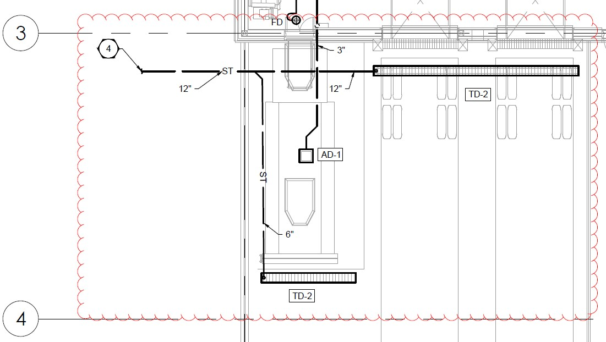

# PCN # 001 - Storm Connection

**Source**: `PCN # 001 - Storm Connection.pdf`  
**Pages**: 1  
**Extracted**: 2026-01-09 18:31:00

---

## Page 1

PROPOSED CHANGE NOTICE

2445-01

 
No work is to be done before this matter is finalized and a "Change Order" is issued.  This copy to remain with your office.  Do not return.  
Contractor to submit signed letter with price including cost breakdown and change (if any) to construction schedule.  Authority having 
Jurisdiction shall advise of any objections. 
 
 
TO: 
QUOREX CONSTRUCTION SERVICES LTD. 
 
 
 
1630A 8th Avenue,  
 
 
Regina, SK S4R 1E5 
 
 
RE: 
AURORA FOOD STORE 
 
 
2000 ANAQUOD ROAD 
 
 
REGINA, SK 
 
 
Commission No. 2445 
 
 
DATE: 
March 17, 2025 
 
 
PAGES: 
1 (including cover) 
 
 
RE: 
Storm Connection 
 
1.0 
MECHANICAL 
 
 
.1 
Refer to drawing M1.1 FOUNDATION PLAN PLUMBING AND PIT. 
 
 
Modify Keynote #4 to refer to 12” storm sewer size. 
 
 
Modify storm line connection size/location, and trench drain pipe size: 

 
 
 
.2 
6” outlets on the trench drains are acceptable. Mechanical Contractor to upsize to 10” before 
they combine as per the tender drawings. Contractor to upsize again to a 12” near the service 
connection to reduce the amount of material costs for the project. 
 
 
.3 
Quorex to coordinate storm line connection with Landlord’s civil scope/location. 
Distribution: 
Sobeys Inc. – Jeff Craig 
jeff.craig@sobeys.com 
Sobeys Inc. – Shanwen Hsu 
shanwen.hsu@sobeys.com 
Quorex Construction Services Ltd. – Chris Walbaum 
c.walbaum@quorex.ca 
Lavergne Draward & Associates Inc. – Charles Koop 
ckoop@ldaeng.ca 
CGM Engineering – Justin Albo 
justin_albo@cgmeng.ca 
CGM Engineering – Marc Pelland 
marc_pelland@cgmeng.ca 
CGM Engineering – Brendan Simpson 
brendan_simpson@cgmeng.ca 
Nejmark Architect – Kevin Fawley 
kevin@nejmark.mb.ca 
 
 
 
 
 
 
Principal 
Kevin Fawley, SAA MRAIC 

