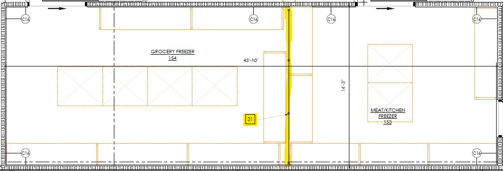
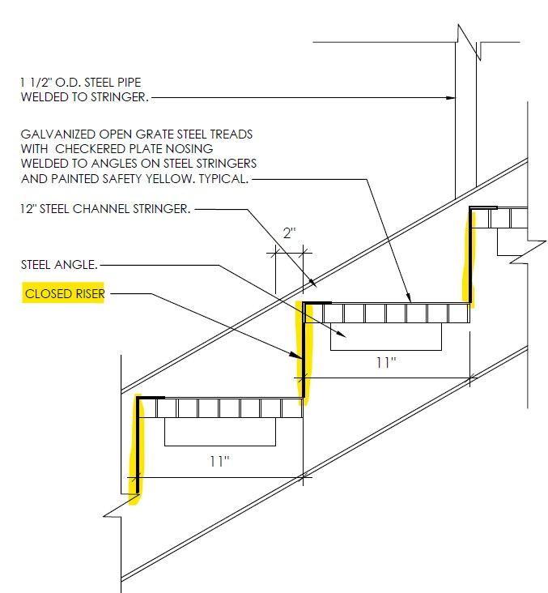
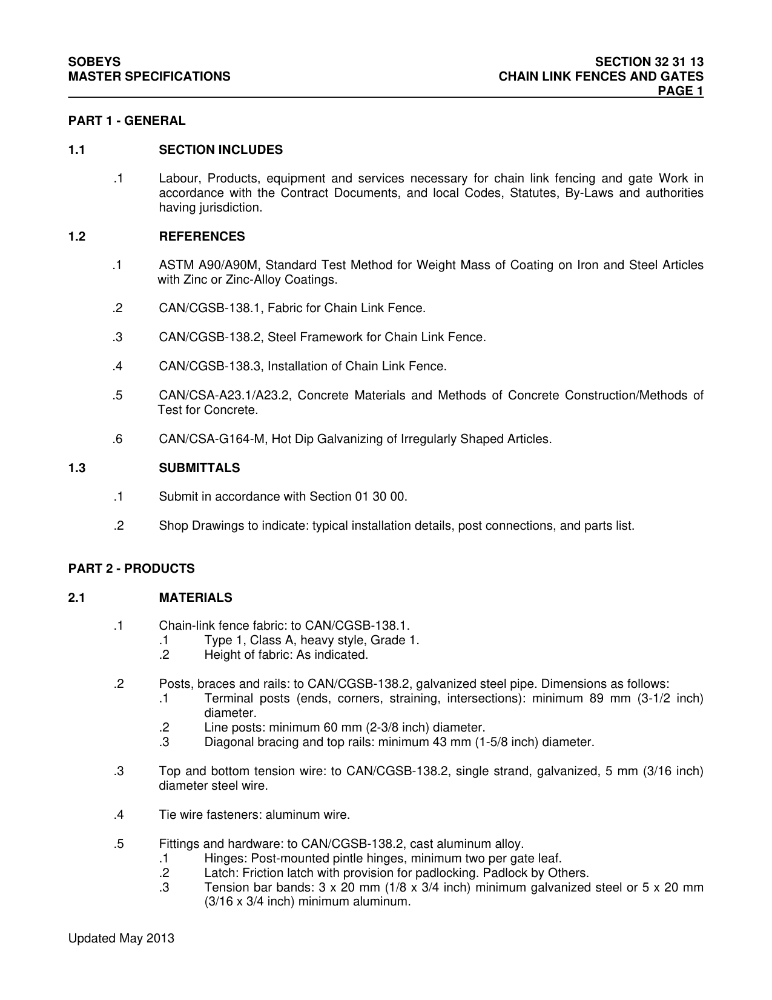
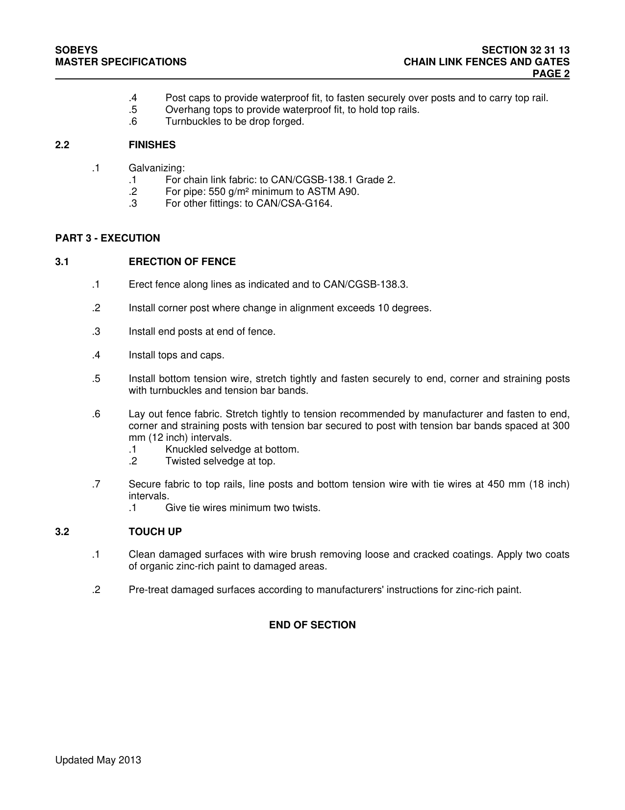

# PCN# 002 - Freezer Fence & Closed Stair Risers

**Source**: `PCN# 002 - Freezer Fence & Closed Stair Risers.pdf`  
**Pages**: 3  
**Extracted**: 2026-01-09 18:31:00

---

## Page 1

PROPOSED CHANGE NOTICE

2445-02

 
No work is to be done before this matter is finalized and a "Change Order" is issued.  This copy to remain with your office.  Do not return.  
Contractor to submit signed letter with price including cost breakdown and change (if any) to construction schedule.  Authority having 
Jurisdiction shall advise of any objections. 
 
 
TO: 
QUOREX CONSTRUCTION SERVICES LTD. 
 
 
 
1630A 8th Avenue,  
 
 
Regina, SK S4R 1E5 
 
 
RE: 
AURORA FOOD STORE 
 
 
2000 ANAQUOD ROAD 
 
 
REGINA, SK 
 
 
Commission No. 2445 
 
 
DATE: 
March 17, 2025 
 
 
PAGES: 
3 (including cover) 
 
 
RE: 
Freezer Fence & Closed Stair Risers 
 
1.0 
PROJECT MANUAL 
 
 
.1 
Add Section 32 31 13 Chain Link Fences and Gates, attached (2 pages) 
 
2.0 
ARCHITECTURAL 
 
 
.1 
Refer to Large Scale Plan drawings A2.1 – A2.5.  
 
 
Add Keynote ##31 between Meat/Grocery freezers:  
 
 
CHAINLINK SEPARATION FENCE BETWEEN FREEZERS. 

 
 
 
.2 
Exterior stairs to have closed risers. Modify Detail #3/A6.2: 

 
Distribution: 
Sobeys Inc. – Jeff Craig 
jeff.craig@sobeys.com 
Sobeys Inc. – Shanwen Hsu 
shanwen.hsu@sobeys.com 
Quorex Construction Services Ltd. – Chris Walbaum 
c.walbaum@quorex.ca 
Lavergne Draward & Associates Inc. – Charles Koop 
ckoop@ldaeng.ca 
CGM Engineering – Justin Albo 
justin_albo@cgmeng.ca 
CGM Engineering – Marc Pelland 
marc_pelland@cgmeng.ca 
CGM Engineering – Brendan Simpson 
brendan_simpson@cgmeng.ca 
Nejmark Architect – Kevin Fawley 
kevin@nejmark.mb.ca 
 
 
 
 
 
 
Principal 
Kevin Fawley, SAA MRAIC 

## Page 2

SOBEYS 
SECTION 32 31 13 
MASTER SPECIFICATIONS 
CHAIN LINK FENCES AND GATES 
 
PAGE 1 
 

PART 1 - GENERAL 
 
1.1 
 
SECTION INCLUDES  

.1  
Labour, Products, equipment and services necessary for chain link fencing and gate Work in 
accordance with the Contract Documents, and local Codes, Statutes, By-Laws and authorities 
having jurisdiction. 
 
1.2 
 
REFERENCES 

.1 
ASTM A90/A90M, Standard Test Method for Weight Mass of Coating on Iron and Steel Articles 
with Zinc or Zinc-Alloy Coatings. 
 
.2 
CAN/CGSB-138.1, Fabric for Chain Link Fence. 
 
.3 
CAN/CGSB-138.2, Steel Framework for Chain Link Fence. 
 
.4 
CAN/CGSB-138.3, Installation of Chain Link Fence. 
 
.5 
CAN/CSA-A23.1/A23.2, Concrete Materials and Methods of Concrete Construction/Methods of 
Test for Concrete. 
 
.6 
CAN/CSA-G164-M, Hot Dip Galvanizing of Irregularly Shaped Articles. 
 
1.3 
 
SUBMITTALS 

.1 
Submit in accordance with Section 01 30 00. 
 
.2 
Shop Drawings to indicate: typical installation details, post connections, and parts list. 
 

PART 2 - PRODUCTS 
 
2.1 
 
MATERIALS 

.1 
Chain-link fence fabric: to CAN/CGSB-138.1. 
.1 
Type 1, Class A, heavy style, Grade 1. 
.2 
Height of fabric: As indicated. 
 
.2 
Posts, braces and rails: to CAN/CGSB-138.2, galvanized steel pipe. Dimensions as follows: 
.1 
Terminal posts (ends, corners, straining, intersections): minimum 89 mm (3-1/2 inch) 
diameter. 
.2 
Line posts: minimum 60 mm (2-3/8 inch) diameter. 
.3 
Diagonal bracing and top rails: minimum 43 mm (1-5/8 inch) diameter.  
 
.3 
Top and bottom tension wire: to CAN/CGSB-138.2, single strand, galvanized, 5 mm (3/16 inch) 
diameter steel wire. 
 
.4 
Tie wire fasteners: aluminum wire. 
 
.5 
Fittings and hardware: to CAN/CGSB-138.2, cast aluminum alloy. 
.1 
Hinges: Post-mounted pintle hinges, minimum two per gate leaf. 
.2 
Latch: Friction latch with provision for padlocking. Padlock by Others. 
.3 
Tension bar bands: 3 x 20 mm (1/8 x 3/4 inch) minimum galvanized steel or 5 x 20 mm 
(3/16 x 3/4 inch) minimum aluminum. 

 
Updated May 2013 

## Page 3

SOBEYS 
SECTION 32 31 13 
MASTER SPECIFICATIONS 
CHAIN LINK FENCES AND GATES 
 
PAGE 2 
 

.4 
Post caps to provide waterproof fit, to fasten securely over posts and to carry top rail. 
.5 
Overhang tops to provide waterproof fit, to hold top rails. 
.6 
Turnbuckles to be drop forged. 
 
2.2 
 
FINISHES 

.1 
Galvanizing: 
.1 
For chain link fabric: to CAN/CGSB-138.1 Grade 2. 
.2 
For pipe: 550 g/m² minimum to ASTM A90. 
.3 
For other fittings: to CAN/CSA-G164. 
 

PART 3 - EXECUTION 
 
3.1 
 
ERECTION OF FENCE 

.1 
Erect fence along lines as indicated and to CAN/CGSB-138.3. 
 
.2 
Install corner post where change in alignment exceeds 10 degrees. 
 
.3 
Install end posts at end of fence. 
 
.4 
Install tops and caps. 
 
.5 
Install bottom tension wire, stretch tightly and fasten securely to end, corner and straining posts 
with turnbuckles and tension bar bands. 
 
.6 
Lay out fence fabric. Stretch tightly to tension recommended by manufacturer and fasten to end, 
corner and straining posts with tension bar secured to post with tension bar bands spaced at 300 
mm (12 inch) intervals. 
.1 
Knuckled selvedge at bottom. 
.2 
Twisted selvedge at top. 
 
.7 
Secure fabric to top rails, line posts and bottom tension wire with tie wires at 450 mm (18 inch) 
intervals. 
.1 
Give tie wires minimum two twists. 
 
3.2 
 
TOUCH UP 

.1 
Clean damaged surfaces with wire brush removing loose and cracked coatings. Apply two coats 
of organic zinc-rich paint to damaged areas. 
 
.2 
Pre-treat damaged surfaces according to manufacturers' instructions for zinc-rich paint. 
 
 
END OF SECTION 

 
Updated May 2013 

