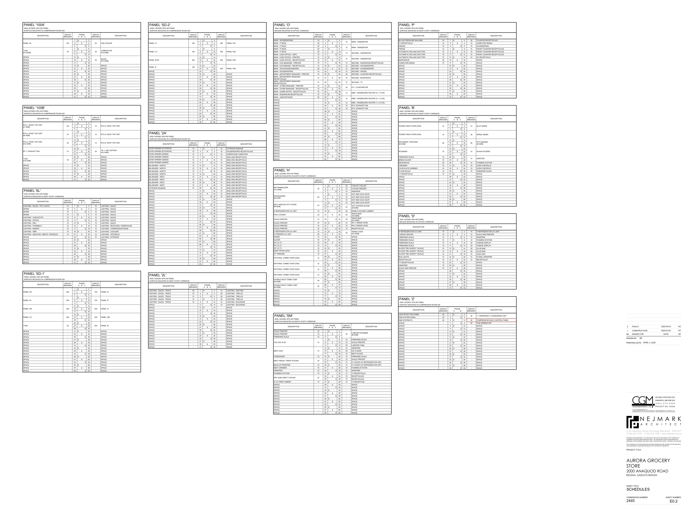
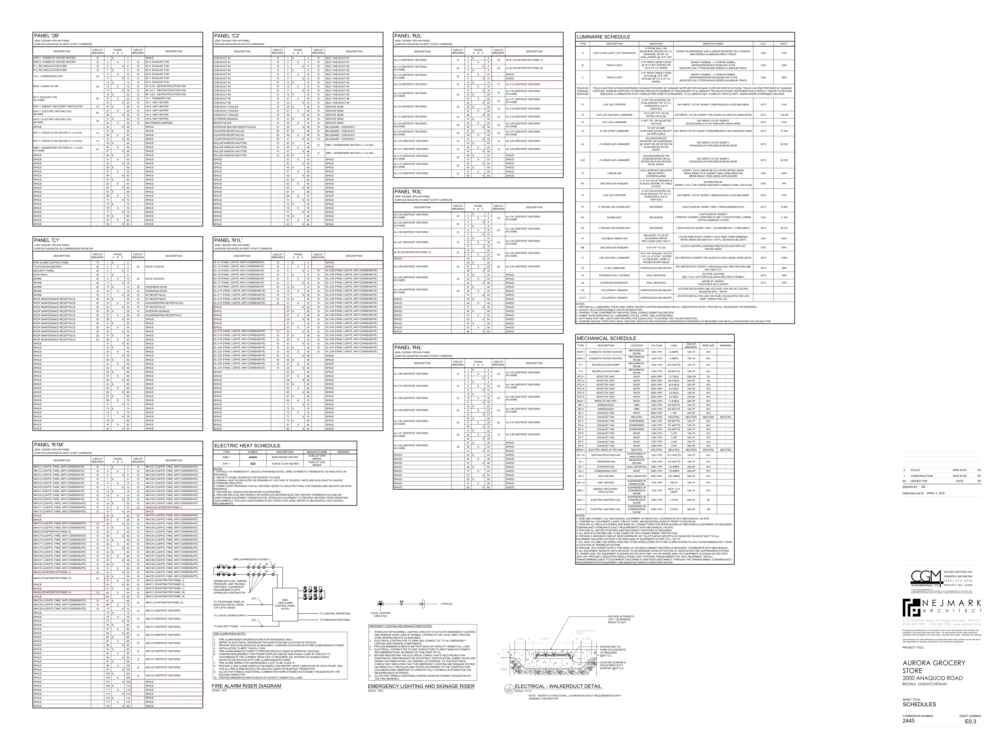
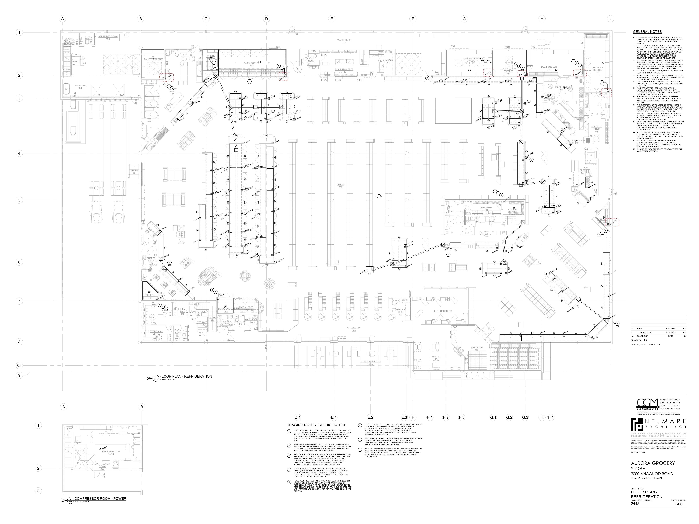

# PCN# 004 - Refrigeration – Circuitry Revisions

**Source**: `PCN# 004 - Refrigeration – Circuitry Revisions.pdf`  
**Pages**: 5  
**Extracted**: 2026-01-09 18:31:01

---

## Page 1

PROPOSED CHANGE NOTICE 

2445-04 

 
No work is to be done before this matter is finalized and a "Change Order" is issued.  This copy to remain with your office.  Do not return.  
Contractor to submit signed letter with price including cost breakdown and change (if any) to construction schedule.  Authority having 
Jurisdiction shall advise of any objections. 
 
 
TO: 
QUOREX CONSTRUCTION SERVICES LTD. 
 
 
 
1630A 8th Avenue,  
 
 
Regina, SK S4R 1E5 
 
 
RE: 
AURORA FOOD STORE 
 
 
2000 ANAQUOD ROAD 
 
 
REGINA, SK 
 
 
Commission No. 2445 
 
 
DATE: 
April 4, 2025 
 
 
PAGES: 
5 (including cover) 
 
 
RE: 
Refrigeration – Circuitry Revisions 
 
 
 
1.0 
ELECTRICAL 
 
 
.1 
Refer to attached Electrical PCN #1, dated April 4, 2025 
 
 
(1 page text, 3 full size drawings, E0.2, E0.3, E4.0) 
 
 
 
 
 
 
 
 
 
 
 
 
 
 
 
 
 
 
 
 
Distribution: 
Sobeys Inc. – Jeff Craig 
jeff.craig@sobeys.com 
Sobeys Inc. – Shanwen Hsu 
shanwen.hsu@sobeys.com 
Quorex Construction Services Ltd. – Chris Walbaum 
c.walbaum@quorex.ca 
Lavergne Draward & Associates Inc. – Charles Koop 
ckoop@ldaeng.ca 
CGM Engineering – Justin Albo 
justin_albo@cgmeng.ca 
CGM Engineering – Tony Mitousis 
tony_mitousis@cgmeng.ca 
CGM Engineering – Brendan Simpson 
brendan_simpson@cgmeng.ca 
 
 
 
 
 
 
 
 
Principal 
Kevin Fawley, SAA MRAIC 

## Page 2

 
 
ELECTRICAL PROPOSED CHANGE NOTICE #1 
 
 
24-258 
 

Project: 
Aurora Grocery Store 
 
2000 Anaquod Road, Regina, Saskatchewan 
Subject: 
Refrigeration - Circuitry Revisions 
Date: 
2025.04.04 
 

Subject: 
Refrigeration - Circuitry Revisions 
References: 
Electrical Drawing E0.2 – Schedules 
 
Electrical Drawing E0.3 – Schedules 
 
Electrical Drawing E4.0 - Refrigeration 
 

1. 
Provide credit as required. Refer to electrical drawing E0.2 – Schedules. Circuit #6 on panel ‘Z’ for 
the compressor rack control panel is revised to the following: 

1.1. Revise to one(1), 20A-1P circuit breaker c/w #12 wire in lieu of 25A-1P circuit breaker c/w 

#10 wire indicated. 

2. 
Refer to attached drawings E0.3 – Schedules and E4.0 – Refrigeration for revised circuiting for the 
evaporator type refrigeration systems. 

2.1. Provide credit to the owner for any electrical items (circuit breakers, wiring, etc.) that are no 

longer required for the project because of this change. 

 
 
Brendan Simpson, E.I.T. 
- 1 - 

200-698 Corydon Avenue     Winnipeg, Manitoba     R3M 0X9     204-272-3255     www.cgmeng.ca 

## Page 3

PANEL '6L'
100

RTU-1, ROOF TOP UNIT
#1 WIRE
125

RTU-2, ROOF TOP UNIT
#4 WIRE
70

RTU-3, ROOF TOP UNIT
#10 WIRE
30

EF-1, EXHAUST FAN
15

PANEL '2A'
200

PANEL '2L'
200

PANEL '2B'
200

PANEL 'C2
200

LIGHTING - SALES - POT LIGHTS
15
1
ɸ
2
15
LIGHTING - SALES

LIGHTING - CHECKOUTS
15
9
ɸ
10
15
LIGHTING - SALES

LIGHTING - OFFICE
15
11
ɸ
12
15
LIGHTING - SALES

LIGHTING - DELI
15
13
ɸ
14
15
LIGHTING - SALES

LIGHTING - PHARMACY
15
15
ɸ
16
15
LIGHTING - RECEIVING / WAREHOUSE

LIGHTING - BAKERY
15
17
ɸ
18
15
LIGHTING - COMPRESSOR ROOM

LIGHTING - HMR
15
19
ɸ
20
15
LIGHTING - COOLERS

LIGHTING - SEAFOOD / MEATS / PRODUCE
15
21
ɸ
22
15
LIGHTING - VESTIBULE

SPACE
-
13
ɸ
14

30
BALER
#10 WIRE
SPACE
-
15
ɸ
16

SPACE
-
17
ɸ
18

SPACE
-
19
ɸ
20
-
SPACE

SPACE
-
21
ɸ
22
-
SPACE

SPACE
-
23
ɸ
24
-
SPACE

SPACE
-
25
ɸ
26
-
SPACE

SPACE
-
27
ɸ
28
-
SPACE

SPACE
-
29
ɸ
30
-
SPACE

SPACE
-
31
ɸ
32
-
SPACE

SPACE
-
33
ɸ
34
-
SPACE

SPACE
-
35
ɸ
36
-
SPACE

SPACE
-
37
ɸ
38
-
SPACE

SPACE
-
39
ɸ
40
-
SPACE

SPACE
-
41
ɸ
42
-
SPACE

SPACE
-
31
ɸ
32
-
SPACE

SPACE
-
33
ɸ
34
-
SPACE

SPACE
-
35
ɸ
36
-
SPACE

SPACE
-
37
ɸ
38
-
SPACE

SPACE
-
39
ɸ
40
-
SPACE

SPACE
-
41
ɸ
42
-
SPACE

SPARE
15
3
ɸ
4
15
LIGHTING - SALES

SPARE
15
5
ɸ
6
15
LIGHTING - SALES

SPARE
15
7
ɸ
8
15
LIGHTING - SALES

SPACE
-
23
ɸ
24
15
LIGHTING - EXTERIOR

SPACE
-
25
ɸ
26
-
SPACE

SPACE
-
27
ɸ
28
-
SPACE

SPACE
-
29
ɸ
30
-
SPACE

SPACE
-
31
ɸ
32
-
SPACE

SPACE
-
33
ɸ
34
-
SPACE

SPACE
-
35
ɸ
36
-
SPACE

SPACE
-
37
ɸ
38
-
SPACE

SPACE
-
39
ɸ
40
-
SPACE

SPACE
-
41
ɸ
42
-
SPACE

SPACE
-
31
ɸ
32
-
SPACE

SPACE
-
33
ɸ
34
-
SPACE

SPACE
-
35
ɸ
36
-
SPACE

SPACE
-
37
ɸ
38
-
SPACE

SPACE
-
39
ɸ
40
-
SPACE

SPACE
-
41
ɸ
42
-
SPACE

SPACE
-
43
ɸ
44
-
SPACE

SPACE
-
45
ɸ
46
-
SPACE

SPACE
-
47
ɸ
48
-
SPACE

SPACE
-
49
ɸ
50
-
SPACE

SPACE
-
51
ɸ
52
-
SPACE

SPACE
-
53
ɸ
54
-
SPACE

SPACE
-
55
ɸ
56
-
SPACE

SPACE
-
57
ɸ
58
-
SPACE

SPACE
-
59
ɸ
60
-
SPACE

TVSS
#10 WIRE
30

TVSS
#10 WIRE
30

TVSS
30

PANEL '100A'

PANEL '100B'

PANEL '6L'

PANEL 'SD-1'

100A-347/600V-3PH-4W PANEL
SURFACE MOUNTED IN WEST STAFF CORRIDOR

1200A-120/208V-3PH-4W PANEL
SURFACE MOUNTED IN COMPRESSOR ROOM 300

400A-347/600V-3PH-4W PANEL
SURFACE MOUNTED IN COMPRESSOR ROOM 300

400A-347/600V-3PH-4W PANEL
SURFACE MOUNTED IN COMPRESSOR ROOM 300

DESCRIPTION
CIRCUIT
BREAKER

DESCRIPTION
CIRCUIT
BREAKER

DESCRIPTION
CIRCUIT
BREAKER

DESCRIPTION
CIRCUIT
BREAKER

15
RTU-6, ROOF TOP UNIT
15
ɸ
16

400
PANEL 'H'
15
ɸ
16

13
ɸ
14

17
ɸ
18

19
ɸ
20

13
ɸ
14

17
ɸ
18

19
ɸ
20

23
ɸ
24

25
ɸ
26
-
SPACE

27
ɸ
28
-
SPACE

29
ɸ
30
-
SPACE

23
ɸ
24

25
ɸ
26

200
PANEL 'B'
27
ɸ
28

29
ɸ
30

11
ɸ
12

11
ɸ
12

11
ɸ
12

30
AC-1, AIR CURTAIN
#10 WIRE
21
ɸ
22

200
PANEL 'SM'
21
ɸ
22

20
GAS COOLER
3
ɸ
4

5
ɸ
6

7
ɸ
8

30
COMPACTOR
#10 WIRE
9
ɸ
10

15
RTU-4, ROOF TOP UNIT
3
ɸ
4

5
ɸ
6

7
ɸ
8

15
RTU-5, ROOF TOP UNIT
9
ɸ
10

100
PANEL 'D'
3
ɸ
4

5
ɸ
6

7
ɸ
8

100
PANEL 'P'
9
ɸ
10

1
ɸ
2

1
ɸ
2

1
ɸ
2

PHASE
A    B    C

PHASE
A    B    C

PHASE
A    B    C

PHASE
A    B    C

CIRCUIT
BREAKER
DESCRIPTION

CIRCUIT
BREAKER
DESCRIPTION

CIRCUIT
BREAKER
DESCRIPTION

CIRCUIT
BREAKER
DESCRIPTION

DOOR OPENER (EXTERIOR)
15
1
ɸ
2
15
EXTERIOR SIGNAGE

DOOR OPENER (EXTERIOR)
15
3
ɸ
4
15
HOUSEKEEPING RECEPTACLES

DOOR OPENER (INSIDE)
15
5
ɸ
6
15
WAREHOUSE COMPUTER

DOOR OPENER (INSIDE)
15
7
ɸ
8
15
SHELVING RECEPTACLE

DOOR OPENER (INSIDE)
15
9
ɸ
10
15
SHELVING RECEPTACLE

DOOR OPENER (INSIDE)
15
11
ɸ
12
15
SHELVING RECEPTACLE

EXTERIOR SIGNAGE
15
29
ɸ
30
15
SHELVING RECEPTACLE

PANEL 'O'
100

PANEL 'C1'
100

PANEL 'R1M'
200

PANEL 'Z'
100

BILLBOARD - NORTH
15
13
ɸ
14
15
SHELVING RECEPTACLE

BILLBOARD - NORTH
15
15
ɸ
16
15
SHELVING RECEPTACLE

BILLBOARD - NORTH
15
17
ɸ
18
15
SHELVING RECEPTACLE

BILLBOARD - NORTH
15
19
ɸ
20
15
SHELVING RECEPTACLE

BILLBOARD - WEST
15
21
ɸ
22
15
SHELVING RECEPTACLE

BILLBOARD - WEST
15
23
ɸ
24
15
SHELVING RECEPTACLE

BILLBOARD - WEST
15
25
ɸ
26
15
SHELVING RECEPTACLE

BILLBOARD - WEST
15
27
ɸ
28
15
SHELVING RECEPTACLE

LIGHTING - SALES - TRACK
20
1
ɸ
2
15
LIGHTING - SEATING

LIGHTING - SALES - TRACK
15
3
ɸ
4
20
LIGHTING - TRELLIS

LIGHTING - SALES - TRACK
15
5
ɸ
6
20
LIGHTING - TRELLIS

LIGHTING - SALES - TRACK
15
7
ɸ
8
20
LIGHTING - TRELLIS

LIGHTING - SALES - TRACK
15
9
ɸ
10
15
LIGHTING - BULKHEAD

SPACE
-
31
ɸ
32
15
SHELVING RECEPTACLE

SPACE
-
33
ɸ
34
15
SHELVING RECEPTACLE

SPACE
-
35
ɸ
36
15
SHELVING RECEPTACLE

SPACE
-
37
ɸ
38
-
SPACE

SPACE
-
39
ɸ
40
-
SPACE

SPACE
-
41
ɸ
42
-
SPACE

SPACE
-
43
ɸ
44
-
SPACE

SPACE
-
45
ɸ
46
-
SPACE

SPACE
-
47
ɸ
48
-
SPACE

SPACE
-
49
ɸ
50
-
SPACE

SPACE
-
51
ɸ
52
-
SPACE

SPACE
-
53
ɸ
54
-
SPACE

SPACE
-
55
ɸ
56
-
SPACE

SPACE
-
57
ɸ
58
-
SPACE

SPACE
-
59
ɸ
60
-
SPACE

SPACE
-
61
ɸ
62
-
SPACE

SPACE
-
63
ɸ
64
-
SPACE

SPACE
-
65
ɸ
66
-
SPACE

SPACE
-
67
ɸ
68
-
SPACE

SPACE
-
69
ɸ
70
-
SPACE

SPACE
-
71
ɸ
72
-
SPACE

SPACE
-
73
ɸ
74
-
SPACE

SPACE
-
75
ɸ
76
-
SPACE

SPACE
-
77
ɸ
78
-
SPACE

SPACE
-
79
ɸ
80
-
SPACE

SPACE
-
81
ɸ
82
-
SPACE

SPACE
-
83
ɸ
84
-
SPACE

SPACE
-
23
ɸ
24

SPACE
-
25
ɸ
26
-
SPACE

SPACE
-
27
ɸ
28
-
SPACE

SPACE
-
29
ɸ
30
-
SPACE

SPACE
-
31
ɸ
32
-
SPACE

SPACE
-
33
ɸ
34
-
SPACE

SPACE
-
35
ɸ
36
-
SPACE

SPACE
-
37
ɸ
38
-
SPACE

SPACE
-
39
ɸ
40
-
SPACE

SPACE
-
41
ɸ
42
-
SPACE

SPACE
-
43
ɸ
44
-
SPACE

SPACE
-
45
ɸ
46
-
SPACE

SPACE
-
47
ɸ
48
-
SPACE

SPACE
-
49
ɸ
50
-
SPACE

SPACE
-
51
ɸ
52
-
SPACE

SPACE
-
53
ɸ
54
-
SPACE

SPACE
-
55
ɸ
56
-
SPACE

SPACE
-
57
ɸ
58
-
SPACE

SPACE
-
59
ɸ
60
-
SPACE

SPACE
-
11
ɸ
12
15
LIGHTING - BULKHEAD

SPACE
-
13
ɸ
14
-
SPACE

SPACE
-
15
ɸ
16
-
SPACE

SPACE
-
17
ɸ
18
-
SPACE

SPACE
-
19
ɸ
20
-
SPACE

SPACE
-
21
ɸ
22
-
SPACE

SPACE
-
23
ɸ
24
-
SPACE

SPACE
-
25
ɸ
26
-
SPACE

SPACE
-
27
ɸ
28
-
SPACE

SPACE
-
29
ɸ
30
-
SPACE

SPACE
-
31
ɸ
32
-
SPACE

SPACE
-
33
ɸ
34
-
SPACE

SPACE
-
35
ɸ
36
-
SPACE

SPACE
-
37
ɸ
38
-
SPACE

SPACE
-
39
ɸ
40
-
SPACE

SPACE
-
41
ɸ
42
-
SPACE

PANEL '2A'

PANEL 'SD-2'

PANEL '2L'

1200A-120/208V-3PH-4W PANEL
SURFACE MOUNTED IN COMPRESSOR ROOM 300

200A-120/208V-3PH-4W PANEL
SURFACE MOUNTED IN COMPRESSOR ROOM 300

200A-120/208V-3PH-4W PANEL
SURFACE MOUNTED IN WEST STAFF CORRIDOR

DESCRIPTION
CIRCUIT
BREAKER

DESCRIPTION
CIRCUIT
BREAKER

DESCRIPTION
CIRCUIT
BREAKER

13
ɸ
14

400
PANEL 'R3L'
15
ɸ
16

17
ɸ
18

19
ɸ
20

11
ɸ
12

400
PANEL 'R4L'
21
ɸ
22

200
PANEL 'R1L'
3
ɸ
4

5
ɸ
6

7
ɸ
8

400
PANEL 'R2L'
9
ɸ
10

1
ɸ
2

PHASE
A    B    C

PHASE
A    B    C

PHASE
A    B    C

CIRCUIT
BREAKER
DESCRIPTION

CIRCUIT
BREAKER
DESCRIPTION

CIRCUIT
BREAKER
DESCRIPTION

FIRMWARE SCALE
15
5
ɸ
6

FOAMING STATION
15
31
ɸ
32
15
TV RECEPTACLE

MAIN - DEPARTMENT MANAGER -
RECEPTACLES
15
27
ɸ
28
15
SECOND - MICROWAVE

MAIN - DEPARTMENT MANAGER -
RECEPTACLES
15
29
ɸ
30
15
SECOND - TV

RETHERMALIZER
#10 WIRE
30

DISHWASHER
#6 WIRE
60

RICE COOKER
20
21
ɸ
22
30
SNACK BAR
#10 WIRE

DEEP FRYER (GAS)
15
45
ɸ
46
-
SPACE

RATIONAL COMBO OVEN (GAS)
15

RATIONAL COMBO OVEN (GAS)
15

RATIONAL COMBO OVEN (GAS)
15

RATIONAL COMBO OVEN (GAS)
15

DOUBLE DECK TURBO CHEF
#8 WIRE
50

DOUBLE DECK TURBO CHEF
#8 WIRE
50

DRY AGED MEAT COOLER
20

MAIN - HOUSEKEEPING
15
1
ɸ
2
15
MAIN - HANDDRYER
MAIN - IT RACK
20
3
ɸ
4

MAIN - IT RACK
20
5
ɸ
6
15
MAIN - HANDDRYER
MAIN - IT RACK
20
7
ɸ
8

MAIN - IT RACK
20
9
ɸ
10
15
SECOND - HANDDRYER
MAIN - CASH OFFICE - SAFE
15
11
ɸ
12

MAIN - CASH OFFICE - PRINTER
15
13
ɸ
14
15
SECOND - HANDDRYER
MAIN - CASH OFFICE - RECEPTACLES
15
15
ɸ
16

MAIN - FILE MANAGER - PRINTER
15
17
ɸ
18
15
SECOND - WASHROOM RECEPTACLES

MAIN - FILE MANAGE - RECEPTACLES
15
19
ɸ
20
15
SECOND - HOUSEKEEPING

MAIN - TELECOM BACKBOARD
20
21
ɸ
22
15
SECOND - HOUSEKEEPING

MAIN - HOUSEKEEPING
15
23
ɸ
24
15
SECOND - FRIDGE

MAIN - DEPARTMENT MANAGER - PRINTER
15
25
ɸ
26
20
SECOND - COUNTER RECEPTACLES

MAIN - STORE MANAGER - PRINTER
15
31
ɸ
32
20
EV-1, EVAPORATOR
MAIN - STORE MANAGER - RECEPTACLES
15
33
ɸ
34

MAIN - LEARN OFFICE - RECEPTACLES
15
35
ɸ
36
15
EBB-1, BASEBOARD HEATER (2 x 1.0 kW)
MAIN - WASHROOM RECEPTACLES
15
37
ɸ
38

MAIN - JANITOR ROOM
20
39
ɸ
40
15
EBB-1, BASEBOARD HEATER (2 x 1.0 kW)
SPACE
-
41
ɸ
42

MEAT SAW
15

MEAT WEIGH / WRAP SYSTEM
20

BACK-UP WRAPPER
15
25
ɸ
26
15
6' 2 DOOR U/C REFRIGERATOR UNIT

MEAT GRINDER
15
27
ɸ
28
15
FOAMING STATION

SPACE
-
43
ɸ
44
15
EBB-1, BASEBOARD HEATER (1 x 0.5 kW)

SPACE
-
45
ɸ
46
15
EF-5, EXHAUST FAN

SPACE
-
47
ɸ
48
15
EF-4, EXHAUST FAN

SPACE
-
49
ɸ
50
-
SPACE

SPACE
-
51
ɸ
52
-
SPACE

SPACE
-
53
ɸ
54
-
SPACE

SPACE
-
55
ɸ
56
-
SPACE

SPACE
-
57
ɸ
58
-
SPACE

SPACE
-
59
ɸ
60
-
SPACE

SPACE
-
61
ɸ
62
-
SPACE

SPACE
-
63
ɸ
64
-
SPACE

SPACE
-
65
ɸ
66
-
SPACE

SPACE
-
67
ɸ
68
-
SPACE

SPACE
-
69
ɸ
70
-
SPACE

SPACE
-
71
ɸ
72
-
SPACE

SPACE
-
73
ɸ
74
-
SPACE

SPACE
-
75
ɸ
76
-
SPACE

SPACE
-
77
ɸ
78
-
SPACE

SPACE
-
79
ɸ
80
-
SPACE

SPACE
-
81
ɸ
82
-
SPACE

SPACE
-
83
ɸ
84
-
SPACE

SELF SERVICE HOT FOODS
#6 WIRE
70

SCALE PRINTER
15
23
ɸ
24
30
SNACK BAR
#10 WIRE

SCALE PRINTER
15
25
ɸ
26
15
RH-1, RANGE HOOD

SCALE PRINTER
15
27
ɸ
28
15
RH-2, RANGE HOOD

SCALE PRINTER
15
29
ɸ
30
15
RECEPTACLES

8' REFRIGERATOR U/C UNIT
15
31
ɸ
32
30
AMANA OVEN
#10 WIRE
8' FREEZER U/C UNIT
20
33
ɸ
34

SPARE
15
35
ɸ
36
-
SPACE

SLICER
15
37
ɸ
38
-
SPACE

55" LG TV
15
39
ɸ
40
-
SPACE

55" LG TV
15
41
ɸ
42
-
SPACE

55" LG TV
15
43
ɸ
44
-
SPACE

SPACE
-
73
ɸ
74
-
SPACE

SPACE
-
75
ɸ
76
-
SPACE

SPACE
-
77
ɸ
78
-
SPACE

SPACE
-
79
ɸ
80
-
SPACE

SPACE
-
81
ɸ
82
-
SPACE

SPACE
-
83
ɸ
84
-
SPACE

SCALE PRINTER
15
1
ɸ
2

35
LOBSTER STEAMER
#8 WIRE
SCALE PRINTER
15
3
ɸ
4

SPACE
-
39
ɸ
40
-
SPACE

SPACE
-
41
ɸ
42
-
SPACE

SPACE
-
43
ɸ
44
-
SPACE

SPACE
-
45
ɸ
46
-
SPACE

SPACE
-
47
ɸ
48
-
SPACE

SPACE
-
49
ɸ
50
-
SPACE

SPACE
-
51
ɸ
52
-
SPACE

SPACE
-
53
ɸ
54
-
SPACE

SPACE
-
55
ɸ
56
-
SPACE

SPACE
-
57
ɸ
58
-
SPACE

SPACE
-
59
ɸ
60
-
SPACE

6' REFRIGERATOR U/C UNIT
15
19
ɸ
20
20
MOBILE HOLDING CABINET

6' U/C PREP CABINET
15
37
ɸ
38
15
TV RECEPTACE

27" FREEZER
15
47
ɸ
48
-
SPACE

TENDERIZER
15
19
ɸ
20
15
FIRMWARE SCALE

WRAPPER
15
29
ɸ
30
15
WRAPPER

VAC PAC PL20
15

PANEL 'O'

PANEL 'H'

PANEL 'SM'

100A-120/208V-3PH-4W PANEL
RECESS MOUNTED IN OFFICE CORRIDOR

400A-120/208V-3PH-4W PANEL
SURFACE MOUNTED IN NORTH STAFF CORRIDOR

200A-120/208V-3PH-4W PANEL
SURFACE MOUNTED IN NORTH STAFF CORRIDOR

DESCRIPTION
CIRCUIT
BREAKER

DESCRIPTION
CIRCUIT
BREAKER

DESCRIPTION
CIRCUIT
BREAKER

15
ɸ
16
40
HOT CHICKEN ISLAND
#8 WIRE
17
ɸ
18

15
ɸ
16
20
ICE FLAKER

13
ɸ
14
15
HOT AND COLD SOUP

13
ɸ
14
15
WRAPPER

17
ɸ
18
15
MEAT SLICER

53
ɸ
54
-
SPACE

55
ɸ
56
-
SPACE

57
ɸ
58
-
SPACE

59
ɸ
60
-
SPACE

65
ɸ
66
-
SPACE

33
ɸ
34
15
RECEPTACLES

35
ɸ
36
15
RECEPTACLES

63
ɸ
64
-
SPACE

67
ɸ
68
-
SPACE

69
ɸ
70
-
SPACE

23
ɸ
24
15
8' 3 DOOR U/C REFRIGERATOR UNIT

49
ɸ
50
-
SPACE

11
ɸ
12
15
HOT AND COLD SOUP

11
ɸ
12
20
LOBSTER TANK

51
ɸ
52
-
SPACE

61
ɸ
62
-
SPACE

71
ɸ
72
-
SPACE

21
ɸ
22
15
SCALE PRINTER

3
ɸ
4
15
2 DOOR FREEZER

5
ɸ
6
15
WRAPPER

7
ɸ
8
15
HOT AND COLD SOUP

9
ɸ
10
15
HOT AND COLD SOUP

7
ɸ
8
15
FIRMWARE SCALE

9
ɸ
10
15
SCALE PRINTER

1
ɸ
2
20
5' BLAST CHILLER

PHASE
A    B    C

PHASE
A    B    C

PHASE
A    B    C

CIRCUIT
BREAKER
DESCRIPTION

CIRCUIT
BREAKER
DESCRIPTION

CIRCUIT
BREAKER
DESCRIPTION

FIRMWARE SCALE
15
5
ɸ
6
15
WRAPPER

FIRMWARE SCALE
15
7
ɸ
8
15
FOAMING STATION

FIRMWARE SCALE
15
9
ɸ
10
20
CHEESE DISPLAY

FIRMWARE SCALE
15
11
ɸ
12
20
CHEESE DISPLAY

RECEPTACLES
15
21
ɸ
22
15
RECEPTACLE

FRIDGE
15
5
ɸ
6
15
HOUSKEEPING

FRIDGE
15
7
ɸ
8
15
FRONT COUNTER RECEPTACLES

DOUBLE RACK OVEN (GAS)
15

DOUBLE RACK OVEN (GAS)
15

RETARDER / PROOFER
#8 WIRE
50

ROUNDER
15

FIRMWARE SCALE
15
25
ɸ
26
15
SHEETER
BREAD SLICER
15
27
ɸ
28

FLOOR SCALE
15
35
ɸ
36
15
FIRMWARE SCALE

LEAK DETECTION PANEL
20
1
ɸ
2
20
I-1, EMERGENCY CONDENSING UNIT
EMS SYSTEM PANEL
20
3
ɸ
4

EMS SYSTEM PC
20
5
ɸ
6
20
COMPRESSOR RACK CONTROL PANEL

BUG LIGHTS
15
19
ɸ
20
15
FLORAL WRAPPER

BLOOD PRESSURE MACHINE
15
1
ɸ
2
20
COUNTER RECEPTACLES

MICROWAVE
20
15
ɸ
16
-
SPACE

MICROWAVE
20
29
ɸ
30
15
FOAMING STATION

CHEESE GRATER
15
3
ɸ
4
15
SCALE AND PRINTER

COMPUTER DESKS
15
17
ɸ
18
-
SPACE

CREAMER
15
31
ɸ
32
15
OVEN CONTROLS

CHOCOLATE WARMER
15
33
ɸ
34
15
OVEN CONTROLS

8' REFRIGERATOR U/C UNIT
15
1
ɸ
2
15
6' REFRIGERATOR U/C UNIT

SLICER "DELI BUDDY" (SCALE)
15
13
ɸ
14
20
OLIVE BAR

SLICER "DELI BUDDY" (SCALE)
15
15
ɸ
16
20
OLIVE BAR

SLICER "DELI BUDDY" (SCALE)
15
17
ɸ
18
15
CASH UNIT

SCALE AND PRINTER
15
27
ɸ
28
-
SPACE

SPACE
-
29
ɸ
30
-
SPACE

SPACE
-
31
ɸ
32
-
SPACE

SPACE
-
33
ɸ
34
-
SPACE

SPACE
-
35
ɸ
36
-
SPACE

SPACE
-
37
ɸ
38
-
SPACE

SPACE
-
39
ɸ
40
-
SPACE

SPACE
-
41
ɸ
42
-
SPACE

SPACE
-
19
ɸ
20
-
SPACE

SPACE
-
21
ɸ
22
-
SPACE

SPACE
-
23
ɸ
24
-
SPACE

SPACE
-
25
ɸ
26
-
SPACE

SPACE
-
27
ɸ
28
-
SPACE

SPACE
-
29
ɸ
30
-
SPACE

SPACE
-
31
ɸ
32
-
SPACE

SPACE
-
33
ɸ
34
-
SPACE

SPACE
-
35
ɸ
36
-
SPACE

SPACE
-
37
ɸ
38
-
SPACE

SPACE
-
39
ɸ
40
-
SPACE

SPACE
-
41
ɸ
42
-
SPACE

SPACE
-
39
ɸ
40
-
SPACE

SPACE
-
41
ɸ
42
-
SPACE

SPACE
-
43
ɸ
44
-
SPACE

SPACE
-
45
ɸ
46
-
SPACE

SPACE
-
47
ɸ
48
-
SPACE

SPACE
-
49
ɸ
50
-
SPACE

SPACE
-
51
ɸ
52
-
SPACE

SPACE
-
53
ɸ
54
-
SPACE

SPACE
-
55
ɸ
56
-
SPACE

SPACE
-
57
ɸ
58
-
SPACE

SPACE
-
59
ɸ
50
-
SPACE

SPACE
-
7
ɸ
8
20
FOM GENERATOR

SPACE
-
9
ɸ
10
-
SPACE

SPACE
-
11
ɸ
12
-
SPACE

SPACE
-
13
ɸ
14
-
SPACE

SPACE
-
15
ɸ
16
-
SPACE

SPACE
-
17
ɸ
18
-
SPACE

SPACE
-
19
ɸ
20
-
SPACE

SPACE
-
21
ɸ
22
-
SPACE

SPACE
-
23
ɸ
24
-
SPACE

SPACE
-
25
ɸ
26
-
SPACE

SPACE
-
27
ɸ
28
-
SPACE

SPACE
-
29
ɸ
30
-
SPACE

SPACE
-
31
ɸ
32
-
SPACE

SPACE
-
33
ɸ
34
-
SPACE

SPACE
-
35
ɸ
36
-
SPACE

SPACE
-
37
ɸ
38
-
SPACE

SPACE
-
39
ɸ
40
-
SPACE

TV RECEPTACLES
15
23
ɸ
24
-
SPACE

TV RECEPTACLE
15
3
ɸ
4
15
COMPUTER DESKS

TV RECEPTACLE
15
37
ɸ
38
-
SPACE

WRAPPER
15
25
ɸ
26
-
SPACE

AUTOMATIC ROLLING SHUTTER
15
9
ɸ
10
15
FRONT COUNTER RECEPTACLES

AUTOMATIC ROLLING SHUTTER
15
11
ɸ
12
15
FRONT COUNTER RECEPTACLES

AUTOMATIC ROLLING SHUTTER
15
13
ɸ
14
15
SC RECEPTACLE

PANEL 'D'

PANEL 'P'

PANEL 'B'

PANEL 'Z'

100A-120/208V-3PH-4W PANEL
RECESS MOUNTED IN OFFICE CORRIDOR

100A-120/208V-3PH-4W PANEL
SURFACE MOUNTED IN WEST STAFF CORRIDOR

100A-120/240V-1PH-3W PANEL
SURFACE MOUNTED IN COMPRESSOR ROOM 300

200A-120/208V-3PH-4W PANEL
SURFACE MOUNTED IN WEST STAFF CORRIDOR

DESCRIPTION
CIRCUIT
BREAKER

DESCRIPTION
CIRCUIT
BREAKER

DESCRIPTION
CIRCUIT
BREAKER

DESCRIPTION
CIRCUIT
BREAKER

60
POT WASHER
#6 WIRE
15
ɸ
16

13
ɸ
14

17
ɸ
18

19
ɸ
20

23
ɸ
24

11
ɸ
12

15
DOUGH DIVIDER
21
ɸ
22

15
80 QT MIXER
3
ɸ
4

5
ɸ
6

7
ɸ
8

20
SPIRAL MIXER
9
ɸ
10

1
ɸ
2

PHASE
A            B

PHASE
A    B    C

PHASE
A    B    C

PHASE
A    B    C

CIRCUIT
BREAKER
DESCRIPTION

CIRCUIT
BREAKER
DESCRIPTION

CIRCUIT
BREAKER
DESCRIPTION

CIRCUIT
BREAKER
DESCRIPTION

2-54 Adelaide Street Winnipeg Manit
a
ob
R3A 0V7
 P 204 947 3775
 F 204 947 3789
www.nejmark.mb.ca

AURORA GROCERY
STORE
2000 ANAQUOD ROAD
REGINA, SASKATCHEWAN

PROJECT TITLE:

DRAWN BY:

PRINTING DATE:

No.     ISSUED FOR                                      DATE                   BY

Drawings and specifications, as instruments of service are the property of the Architect, the
copyright in the same being reserved to them.  No reproduction may be made without the
permission of the architects, and when made, must bear their names.  All prints to be returned.

2445

COMMISSION NUMBER:
SHEET NUMBER:

The contractor is to verify dimensions and date noted herein with conditions on the site and is
held responsible for reporting discrepancy to the Architect for adjustment.

SHEET TITLE:

SCHEDULES

1

KC
2025.04.04
PCN-01
2

KC
2025.03.25
CONSTRUCTION

© 2024 CGM ENGINEERING LTD.
THESE DRAWINGS ARE THE SOLE PROPERTY OF CGM ENGINEERING LTD. AND SHALL NOT
BE REPRODUCED WITHOUT WRITTEN CONSENT. THESE DRAWINGS SHALL NOT BE SCALED.

ENGINEERING LTD.

BS

N E J M A R K
A
R
C
H
I
T
E
C
T

APRIL 4, 2025

PROJECT NO: 24258

( 2 0 4 )  2 7 2 - 3 2 5 5

200-698 CORYDON AVE

WINNIPEG, MB R3M 0X9

E0.2

## Page 4

DWH-1, DOMESTIC WATER HEATER
15
1
ɸ
2
-
SPACE

DWH-2, DOMESTIC WATER HEATER
15
3
ɸ
4
15
EF-3, EXHAUST FAN

P-1, RE-CIRCULATION PUMP
15
5
ɸ
6
15
EF-4, EXHAUST FAN

P-2, RE-CIRCULATION PUMP
15
7
ɸ
8
15
EF-5, EXHAUST FAN

EF-9, EXHAUST FAN
#10 WIRE
30

ERV-1, ENERGY RECOVERY VENTILATOR
15
25
ɸ
26
15
UH-2, UNIT HEATER

EHC-1, ELECTRIC HEATING COIL
#8 WIRE
50

EHC-2, ELECTRIC HEATING COIL
#8 WIRE
35

EFF-1, FORCE FLOW HEATER (1 x 2.0 kW)
15

EFF-1. FORCE FLOW HEATER (1 x 2.0 kW)
15

EBB-1, BASEBOARD HEATERS (4 x 1.0 kW)
#10 WIRE
25

FIRE ALARM CONTROL PANEL
15
1
ɸ
2

DATA RACK
20
7
ɸ
8

ROOF MAINTENANCE RECEPTACLE
20
19
ɸ
20
15
SC RECEPTACLE

ROOF MAINTENANCE RECEPTACLE
20
21
ɸ
22
15
HOUSEKEEPING RECEPTACLES

ROOF MAINTENANCE RECEPTACLE
20
23
ɸ
24
15
GF RECEPTACLE

ROOF MAINTENANCE RECEPTACLE
20
25
ɸ
26
15
EXTERIOR SIGNAGE

ROOF MAINTENANCE RECEPTACLE
20
27
ɸ
28
15
HOUSEKEEPING RECEPTACLE

ROOF MAINTENANCE RECEPTACLE
20
29
ɸ
30
-
SPACE

ROOF MAINTENANCE RECEPTACLE
20
31
ɸ
32
-
SPACE

ROOF MAINTENANCE RECEPTACLE
20
33
ɸ
34
-
SPACE

ROOF MAINTENANCE RECEPTACLE
20
35
ɸ
36
-
SPACE

ROOF MAINTENANCE RECEPTACLE
20
37
ɸ
38
-
SPACE

ROOF MAINTENANCE RECEPTACLE
20
39
ɸ
40
-
SPACE

MUA-1, MAKE-UP AIR
20

CU-1, CONDENSING UNIT
20

SPACE
-
35
ɸ
36
-
SPACE

SPACE
-
49
ɸ
50
-
SPACE

SPACE
-
51
ɸ
52
-
SPACE

SPACE
-
53
ɸ
54
-
SPACE

SPACE
-
55
ɸ
56
-
SPACE

SPACE
-
57
ɸ
58
-
SPACE

SPACE
-
59
ɸ
60
-
SPACE

SPACE
-
61
ɸ
62
-
SPACE

SPACE
-
63
ɸ
64
-
SPACE

SPACE
-
65
ɸ
66
-
SPACE

SPACE
-
67
ɸ
68
-
SPACE

SPACE
-
69
ɸ
70
-
SPACE

SPACE
-
71
ɸ
72
-
SPACE

SPACE
-
73
ɸ
74
-
SPACE

SPACE
-
75
ɸ
76
-
SPACE

SPACE
-
77
ɸ
78
-
SPACE

SPACE
-
79
ɸ
80
-
SPACE

SPACE
-
81
ɸ
82
-
SPACE

SPACE
-
83
ɸ
84
-
SPACE

SECURITY PANEL
20
5
ɸ
6

20
DOCK LEVELER
SPARE
20
9
ɸ
10

SPARE
20
11
ɸ
12

SPARE
20
13
ɸ
14
15
OVERHEAD DOOR

SPARE
15
15
ɸ
16
15
OVERHEAD DOOR

SPARE
15
17
ɸ
18
15
SC RECEPTACLE

SPACE
-
41
ɸ
42
-
SPACE

SPACE
-
43
ɸ
44
-
SPACE

SPACE
-
45
ɸ
46
-
SPACE

SPACE
-
47
ɸ
48
-
SPACE

SPACE
-
49
ɸ
50
-
SPACE

SPACE
-
51
ɸ
52
-
SPACE

SPACE
-
53
ɸ
54
-
SPACE

SPACE
-
55
ɸ
56
-
SPACE

SPACE
-
57
ɸ
58
-
SPACE

SPACE
-
59
ɸ
60
-
SPACE

SPACE
-
61
ɸ
62
-
SPACE

SPACE
-
63
ɸ
64
-
SPACE

SPACE
-
65
ɸ
66
-
SPACE

SPACE
-
67
ɸ
68
-
SPACE

SPACE
-
69
ɸ
70
-
SPACE

SPACE
-
71
ɸ
72
-
SPACE

SPACE
-
73
ɸ
74
-
SPACE

SPACE
-
75
ɸ
76
-
SPACE

SPACE
-
77
ɸ
78
-
SPACE

SPACE
-
79
ɸ
80
-
SPACE

SPACE
-
81
ɸ
82
-
SPACE

SPACE
-
83
ɸ
84
-
SPACE

SPACE
-
25
ɸ
26
15
AM-C37 (LIGHTS, FANS, ANTI-CONDENSATE)

SPACE
-
27
ɸ
28
15
AM-C38 (LIGHTS, FANS, ANTI-CONDENSATE)

SPACE
-
59
ɸ
60
15
AM-E11 (EVAPORATOR PANEL K)

SPACE
-
61
ɸ
62
15
AM-E12 (EVAPORATOR PANEL L)

SPACE
-
65
ɸ
66
15
AM-E14 (EVAPORATOR PANEL N)

AM-C26 (LIGHTS, FANS, ANTI-CONDENSATE)
15
71
ɸ
72
15
AM-C13 (DEFROST HEATERS)
SPACE
-
73
ɸ
74

SPACE
-
75
ɸ
76
15
AM-C16 (DEFROST HEATERS)
SPACE
-
77
ɸ
78

SPACE
-
79
ɸ
80
15
AM-C17 (DEFROST HEATERS)
SPACE
-
81
ɸ
82

SPACE
-
83
ɸ
84
15
AM-C18 (DEFROST HEATERS)
SPACE
-
85
ɸ
86

SPACE
-
87
ɸ
88
15
AM-C19 (DEFROST HEATERS)
SPACE
-
89
ɸ
90

SPACE
-
91
ɸ
92
15
AM-C20 (DEFROST HEATERS)
SPACE
-
93
ɸ
94

SPACE
-
95
ɸ
96
15
AM-C21 (DEFROST HEATERS)
SPACE
-
97
ɸ
98

SPACE
-
99
ɸ
100
15
AM-C22 (DEFROST HEATERS)
SPACE
-
101
ɸ
102

SPACE
-
103
ɸ
104
15
AM-C23 (DEFROST HEATERS)
SPACE
-
105
ɸ
106

SPACE
-
107
ɸ
108
-
SPACE

SPACE
-
109
ɸ
110
-
SPACE

SPACE
-
111
ɸ
112
-
SPACE

SPACE
-
113
ɸ
114
-
SPACE

SPACE
-
115
ɸ
116
-
SPACE

SPACE
-
117
ɸ
118
-
SPACE

SPACE
-
119
ɸ
120
-
SPACE

20
DOCK LEVELER
TELECOM BACKBOARD
20
3
ɸ
4

AM-C1 (LIGHTS, FANS, ANTI-CONDENSATE)
15
1
ɸ
2
15
AM-C27 (LIGHTS, FANS, ANTI-CONDENSATE)

AM-C2 (LIGHTS, FANS, ANTI-CONDENSATE)
15
3
ɸ
4
15
AM-C28 (LIGHTS, FANS, ANTI-CONDENSATE)

AM-C3 (LIGHTS, FANS, ANTI-CONDENSATE)
15
5
ɸ
6
15
AM-C29 (LIGHTS, FANS, ANTI-CONDENSATE)

AM-C4 (LIGHTS, FANS, ANTI-CONDENSATE)
15
7
ɸ
8
15
AM-C30 (LIGHTS, FANS, ANTI-CONDENSATE)

AM-C5 (LIGHTS, FANS, ANTI-CONDENSATE)
15
9
ɸ
10
15
AM-C31 (LIGHTS, FANS, ANTI-CONDENSATE)

AM-C6 (LIGHTS, FANS, ANTI-CONDENSATE)
15
11
ɸ
12
15
AM-C32 (LIGHTS, FANS, ANTI-CONDENSATE)

AM-C7 (LIGHTS, FANS, ANTI-CONDENSATE)
15
13
ɸ
14
15
AM-C33 (LIGHTS, FANS, ANTI-CONDENSATE)

AM-C8 (LIGHTS, FANS, ANTI-CONDENSATE)
15
15
ɸ
16
15
AM-C34 (LIGHTS, FANS, ANTI-CONDENSATE)

AM-C9 (LIGHTS, FANS, ANTI-CONDENSATE)
15
17
ɸ
18
15
AM-C35 (LIGHTS, FANS, ANTI-CONDENSATE)

AM-C10 (LIGHTS, FANS, ANTI-CONDENSATE)
15
19
ɸ
20
15
AM-C36 (LIGHTS, FANS, ANTI-CONDENSATE)

AM-C11 (LIGHTS, FANS, ANTI-CONDENSATE)
15
21
ɸ
22
15
AM-E8 (EVAPORATOR PANEL I)

AM-C12 (LIGHTS, FANS, ANTI-CONDENSATE)
15
23
ɸ
24
-
SPACE

AM-C13 (LIGHTS, FANS, ANTI-CONDENSATE)
15
29
ɸ
30
15
AM-C39 (LIGHTS, FANS, ANTI-CONDENSATE)

AM-C14 (LIGHTS, FANS, ANTI-CONDENSATE)
15
31
ɸ
32
15
AM-C40 (LIGHTS, FANS, ANTI-CONDENSATE)

AM-E2 (EVAPORATOR PANEL E)
15
33
ɸ
34
15
AM-C41 (LIGHTS, FANS, ANTI-CONDENSATE)

AM-C15 (LIGHTS, FANS, ANTI-CONDENSATE)
15
35
ɸ
36
15
AM-C42 (LIGHTS, FANS, ANTI-CONDENSATE)

AM-C16 (LIGHTS, FANS, ANTI-CONDENSATE)
15
37
ɸ
38
15
AM-C43 (LIGHTS, FANS, ANTI-CONDENSATE)

AM-C17 (LIGHTS, FANS, ANTI-CONDENSATE)
15
39
ɸ
40
15
AM-C44 (LIGHTS, FANS, ANTI-CONDENSATE)

AM-C18 (LIGHTS, FANS, ANTI-CONDENSATE)
15
41
ɸ
42
15
AM-C45 (LIGHTS, FANS, ANTI-CONDENSATE)

AM-C19 (LIGHTS, FANS, ANTI-CONDENSATE)
15
43
ɸ
44
15
AM-C46 (LIGHTS, FANS, ANTI-CONDENSATE)

AM-C20 (LIGHTS, FANS, ANTI-CONDENSATE)
15
45
ɸ
46
15
AM-C47 (LIGHTS, FANS, ANTI-CONDENSATE)

AM-C21 (LIGHTS, FANS, ANTI-CONDENSATE)
15
47
ɸ
48
15
AM-C48 (LIGHTS, FANS, ANTI-CONDENSATE)

AM-C22 (LIGHTS, FANS, ANTI-CONDENSATE)
15
49
ɸ
50
15
AM-C49 (LIGHTS, FANS, ANTI-CONDENSATE)

AM-C23 (LIGHTS, FANS, ANTI-CONDENSATE)
15
51
ɸ
52
15
AM-C50 (LIGHTS, FANS, ANTI-CONDENSATE)

AM-E3 (EVAPORATOR PANEL F)
15
53
ɸ
54
15
AM-C51 (LIGHTS, FANS, ANTI-CONDENSATE)

AM-E4 (EVAPORATOR PANEL G)
25

AM-E6 (EVAPORATOR PANEL H)
15
63
ɸ
64
15
AM-E13 (EVAPORATOR PANEL M)

AM-C24 (LIGHTS, FANS, ANTI-CONDENSATE)
15
67
ɸ
68
15
AM-E1 (EVAPORATOR PANEL D)
AM-C25 (LIGHTS, FANS, ANTI-CONDENSATE)
15
69
ɸ
70

PANEL '2B'

PANEL 'C1'

PANEL 'R1M'

100A-120/208V-3PH-4W PANEL
SURFACE MOUNTED IN COMPRESSOR ROOM 300

200A-120/208V-3PH-4W PANEL
SURFACE MOUNTED IN WEST STAFF CORRIDOR

200A-120/208V-3PH-4W PANEL
SURFACE MOUNTED IN WEST STAFF CORRIDOR

DESCRIPTION
CIRCUIT
BREAKER

DESCRIPTION
CIRCUIT
BREAKER

DESCRIPTION
CIRCUIT
BREAKER

15
ɸ
16
15
DF-2,4,6 - DESTRATIFICATION FAN

13
ɸ
14
15
EF-8, EXHAUST FAN

17
ɸ
18
15
DF-3,5,7 - DESTRATIFICATION FAN

19
ɸ
20
15
DF-1,8,9 - DESTRATIFICATION FAN

39
ɸ
40
-
SPACE

55
ɸ
56
15
AM-C52 (LIGHTS, FANS, ANTI-CONDENSATE)

23
ɸ
24
15
UH-1, UNIT HEATER

27
ɸ
28
15
UH-3, UNIT HEATER

29
ɸ
30
15
UH-4, UNIT HEATER

33
ɸ
34
15
MOTORIZED DAMPERS

37
ɸ
38
-
SPACE

57
ɸ
58
15
AM-E10 (EVAPORATOR PANEL J)

45
ɸ
46
-
SPACE

43
ɸ
44
-
SPACE

47
ɸ
48
-
SPACE

11
ɸ
12
15
EF-7, EXHAUST FAN

31
ɸ
32
15
UH-5, UNIT HEATER

21
ɸ
22
15
TF-1, TRANSFER FAN

41
ɸ
42
-
SPACE

9
ɸ
10
15
EF-6, EXHAUST FAN

PHASE
A    B    C

PHASE
A    B    C

PHASE
A    B    C

CIRCUIT
BREAKER
DESCRIPTION

CIRCUIT
BREAKER
DESCRIPTION

CIRCUIT
BREAKER
DESCRIPTION

2
SCALE:  NTS
FIRE ALARM RISER DIAGRAM

1.
FIRE ALARM RISER DIAGRAM SHOWN FOR REFERENCE ONLY.
2.
REFER TO ELECTRICAL DRAWINGS FOR QUANTITIES AND LOCATION OF DEVICES.
3.
PROVIDE ISOLATION MODULES AS REQUIRED. CONFIRM LOCATIONS WITH FIRE ALARM MANUFACTURER.
4.
INSTALLATION TO MEET CAN/ULC S524.
5.
FIRE ALARM MANUFACTURER TO PROVIDE SPECIFIC RISER IN APPROVAL PACKAGE.
6.
CONFIRM REQUIREMENT FOR POWER SUPPLIED AND/OR ADDITIONAL CLASS 'B' CIRCUITS TO
ACCOMMODATE THE CURRENT DRAW DUE TO REQUIRED CDL RATINGS ON AUDIBLE/VISUAL
NOTIFICATION DEVICES WITH FIRE ALARM MANUFACTURER.
7.
FIRE ALARM WIRING FOR ADDRESSABLE LOOP TO BE CLASS 'A'.
8.
PROVIDE A FIRE ALARM VERIFICATION INSPECTION REPORT UPON COMPLETION OF EACH PHASE, AND
FOR ALL FIRE ALARM DEVICES OR CIRCUITS ADDED OR MODIFIED THEREAFTER.
9.
ALLOW FOR THREE(3) ADDITIONAL COMBINATION HORN STROBES AS POSSIBLY REQUESTED BY THE
BUILDING INSPECTOR.
10. PROVIDE MINIMUM 60 MINUTE BACK-UP CAPACITY UNDER FULL LOAD.

NOTES:
1. C/W BUILT-IN THERMOSTAT, UNLESS OTHERWISE NOTED. WIRE TO REMOTE THERMOSTAT AS INDICATED ON
DRAWINGS.
2. REFER TO PANEL SCHEDULE FOR SOURCE VOLTAGE.
3. NOMINAL HEAT AS INDICATED ON DRAWING AT VOLTAGE OF SOURCE. UNITS ARE IN KILOWATTS, UNLESS
OTHERWISE INDICATED.
4. SUBMIT SHOP DRAWINGS FOR ALL HEATERS. REFER TO ARCHITECTURAL FOR FINISHES AND INDICATE ON SHOP
DRAWINGS.
5. PROVIDE ALL ASSOCIATED MOUNTING ACCESSORIES.
6. PROVIDE RELAY(S) AND WIRING FOR INTERLOCK BETWEEN ELECTRIC HEATER THERMOSTAT(S) AND AIR
CONDITIONING EQUIPMENT THERMOSTAT(S). INTERLOCK EQUIPMENT TO PREVENT HEATERS FROM OPERATING
CONCURRENTLY WITH AIR CONDITIONING IN ANY GIVEN HVAC ZONE. REFER TO MECHANICAL FOR CONTROL
REQUIREMENTS.

FIRE ALARM RISER NOTES:

SPRINKLER FLOW, TAMPER,
PRESSURE, AND TROUBLE
SWITCHES. COORDINATE
REQUIREMENTS WITH
SPRINKLER CONTRACTOR

TO TELEPHONE PANEL IN
MAIN ELECTRICAL ROOM
C/W CAT6 CABLES

EXTERIOR SIGNAGE
15
31
ɸ
32
15
SERVICE DESK

RECEPTACLES
15
33
ɸ
34
15
SERVICE DESK

EXTERIOR SEATING RECEPTACLES
15
35
ɸ
36
15
BILLBOARD - CHECKOUT

ROLLER WINDOW SHUTTER
15
43
ɸ
44
15
EBB-1, BASEBOARD HEATER (1 x 2.0 kW)
ROLLER WINDOW SHUTTER
15
45
ɸ
46

ROLLER WINDOW SHUTTER
15
47
ɸ
48
15
EBB-1, BASEBOARD HEATER (1 x 2.0 kW)
ROLLER WINDOW SHUTTER
15
49
ɸ
50

CHECKOUT #1
15
1
ɸ
2
15
SELF CHECKOUT #1

CHECKOUT #1
15
3
ɸ
4
15
SELF CHECKOUT #1

CHECKOUT #2
15
5
ɸ
6
15
SELF CHECKOUT #2

CHECKOUT #2
15
7
ɸ
8
15
SELF CHECKOUT #2

CHECKOUT #3
15
9
ɸ
10
15
SELF CHECKOUT #3

CHECKOUT #3
15
11
ɸ
12
15
SELF CHECKOUT #3

CHECKOUT #4
15
13
ɸ
14
15
SELF CHECKOUT #4

CHECKOUT #4
15
15
ɸ
16
15
SELF CHECKOUT #4

CHECKOUT #5
15
17
ɸ
18
15
SELF CHECKOUT #5

CHECKOUT #5
15
19
ɸ
20
15
SELF CHECKOUT #5

CHECKOUT #6
15
21
ɸ
22
15
SELF CHECKOUT #6

CHECKOUT #6
15
23
ɸ
24
15
SELF CHECKOUT #6

CHECKOUT COOLER
15
25
ɸ
26
15
SERVICE DESK

CHECKOUT COOLER
15
27
ɸ
28
15
SERVICE DESK

CHECKOUT COOLER
15
29
ɸ
30
15
SERVICE DESK

COUNTER RECEPTACLES
20
37
ɸ
38
15
BILLBOARD - CHECKOUT

COUNTER RECEPTACLES
20
39
ɸ
40
15
BILLBOARD - CHECKOUT

COUNTER RECEPTACLES
20
41
ɸ
42
15
BILLBOARD - CHECKOUT

TO 120VAC POWER SUPPLY

TO SECURITY PANEL

SPACE
-
51
ɸ
52
-
SPACE

SPACE
-
53
ɸ
54
-
SPACE

SPACE
-
55
ɸ
56
-
SPACE

SPACE
-
57
ɸ
58
-
SPACE

SPACE
-
59
ɸ
60
-
SPACE

SPACE
-
61
ɸ
62
-
SPACE

SPACE
-
63
ɸ
64
-
SPACE

SPACE
-
65
ɸ
66
-
SPACE

SPACE
-
67
ɸ
68
-
SPACE

SPACE
-
69
ɸ
70
-
SPACE

SPACE
-
71
ɸ
72
-
SPACE

SPACE
-
73
ɸ
74
-
SPACE

SPACE
-
75
ɸ
76
-
SPACE

SPACE
-
77
ɸ
78
-
SPACE

SPACE
-
79
ɸ
80
-
SPACE

SPACE
-
81
ɸ
82
-
SPACE

SPACE
-
83
ɸ
84
-
SPACE

SPACE
-
23
ɸ
24
15
AL-C37 (FANS, LIGHTS, ANTI-CONDENSATE)

SPACE
-
25
ɸ
26
15
AL-C38 (FANS, LIGHTS, ANTI-CONDENSATE)

SPACE
-
27
ɸ
28
15
AL-C39 (FANS, LIGHTS, ANTI-CONDENSATE)

SPACE
-
29
ɸ
30
15
AL-C40 (FANS, LIGHTS, ANTI-CONDENSATE)

SPACE
-
31
ɸ
32
15
AL-C41 (FANS, LIGHTS, ANTI-CONDENSATE)

SPACE
-
33
ɸ
34
15
AL-C42 (FANS, LIGHTS, ANTI-CONDENSATE)

SPACE
-
55
ɸ
56
-
SPACE

SPACE
-
57
ɸ
58
-
SPACE

SPACE
-
59
ɸ
60
-
SPACE

SPACE
-
61
ɸ
62
-
SPACE

SPACE
-
63
ɸ
64
-
SPACE

SPACE
-
65
ɸ
66
-
SPACE

SPACE
-
67
ɸ
68
-
SPACE

SPACE
-
69
ɸ
70
-
SPACE

SPACE
-
71
ɸ
72
-
SPACE

SPACE
-
73
ɸ
74
-
SPACE

SPACE
-
75
ɸ
76
-
SPACE

SPACE
-
77
ɸ
78
-
SPACE

SPACE
-
79
ɸ
80
-
SPACE

SPACE
-
81
ɸ
82
-
SPACE

SPACE
-
83
ɸ
84
-
SPACE

AL-C1 (FANS, LIGHTS, ANTI-CONDENSATE)
15
1
ɸ
2
-
SPACE

AL-C2 (FANS, LIGHTS, ANTI-CONDENSATE)
15
3
ɸ
4
-
SPACE

AL-C4 (FANS, LIGHTS, ANTI-CONDENSATE)
15
5
ɸ
6
15
AL-C28 (FANS, LIGHTS, ANTI-CONDENSATE)

AL-C5 (FANS, LIGHTS, ANTI-CONDENSATE)
15
7
ɸ
8
15
AL-C29 (FANS, LIGHTS, ANTI-CONDENSATE)

AL-C6 (FANS, LIGHTS, ANTI-CONDENSATE)
15
9
ɸ
10
15
AL-C30 (FANS, LIGHTS, ANTI-CONDENSATE)

AL-C7 (FANS, LIGHTS, ANTI-CONDENSATE)
15
11
ɸ
12
15
AL-C31 (FANS, LIGHTS, ANTI-CONDENSATE)

AL-C8 (FANS, LIGHTS, ANTI-CONDENSATE)
15
13
ɸ
14
15
AL-C32 (FANS, LIGHTS, ANTI-CONDENSATE)

AL-C10 (FANS, LIGHTS, ANTI-CONDENSATE)
15
15
ɸ
16
15
AL-C33 (FANS, LIGHTS, ANTI-CONDENSATE)

AL-C11 (FANS, LIGHTS, ANTI-CONDENSATE)
15
17
ɸ
18
15
AL-C34 (FANS, LIGHTS, ANTI-CONDENSATE)

AL-C12 (FANS, LIGHTS, ANTI-CONDENSATE)
15
19
ɸ
20
15
AL-C35 (FANS, LIGHTS, ANTI-CONDENSATE)

AL-C14 (FANS, LIGHTS, ANTI-CONDENSATE)
15
21
ɸ
22
15
AL-C36 (FANS, LIGHTS, ANTI-CONDENSATE)

AL-C15 (FANS, LIGHTS, ANTI-CONDENSATE)
15
35
ɸ
36
15
AL-C43 (FANS, LIGHTS, ANTI-CONDENSATE)

AL-C16 (FANS, LIGHTS, ANTI-CONDENSATE)
15
37
ɸ
38
15
AL-C44 (FANS, LIGHTS, ANTI-CONDENSATE)

AL-C18 (FANS, LIGHTS, ANTI-CONDENSATE)
15
39
ɸ
40
15
AL-C45 (FANS, LIGHTS, ANTI-CONDENSATE)

AL-C19 (FANS, LIGHTS, ANTI-CONDENSATE)
15
41
ɸ
42
15
AL-C46 (FANS, LIGHTS, ANTI-CONDENSATE)

AL-C20 (FANS, LIGHTS, ANTI-CONDENSATE)
15
43
ɸ
44
15
AL-C47 (FANS, LIGHTS, ANTI-CONDENSATE)

AL-C22 (FANS, LIGHTS, ANTI-CONDENSATE)
15
45
ɸ
46
15
AL-C48 (FANS, LIGHTS, ANTI-CONDENSATE)

AL-C23 (FANS, LIGHTS, ANTI-CONDENSATE)
15
47
ɸ
48
-
SPACE

AL-C24 (FANS, LIGHTS, ANTI-CONDENSATE)
15
49
ɸ
50
-
SPACE

AL-C26 (FANS, LIGHTS, ANTI-CONDENSATE)
15
51
ɸ
52
-
SPACE

AL-C27 (FANS, LIGHTS, ANTI-CONDENSATE)
15
53
ɸ
54
-
SPACE

ELECTRIC HEAT SCHEDULE

PANEL 'C2'

PANEL 'R1L'

200A-120/208V-3PH-4W PANEL
RECESS MOUNTED IN OFFICE CORRIDOR

200A-120/208V-3PH-4W PANEL
SURFACE MOUNTED IN WEST STAFF CORRIDOR

TR
P
T
F
A
CO

A
CO
TR
P
T
F

EBB-1
BASE BOARD HEATER
OUELLET OFM
SERIES
-

EFF-1
 FORCE FLOW HEATER
OUELLET OAC
SERIES
-

TYPE
SYMBOL
DESCRIPTION
MANUFACTURER
REMARKS

FIRE SUPPRESSION SYSTEM

DESCRIPTION
CIRCUIT
BREAKER

DESCRIPTION
CIRCUIT
BREAKER

3 4"C.

3 4"C.

K

K

NEW
FIRE ALARM
CONTROL PANEL
(FACP)

PHASE
A    B    C

PHASE
A    B    C

CIRCUIT
BREAKER
DESCRIPTION

CIRCUIT
BREAKER
DESCRIPTION

TO ANNUNCIATOR PANEL

TO CENTRAL REPORTING

SCALE:  NTS
EMERGENCY LIGHTING AND SIGNAGE RISER

1.
INTERLOCK WITH NORMAL LIGHTING CIRCUITS TO ACTIVATE EMERGENCY LIGHTING
AND SIGNAGE UPON LOSS OF NORMAL LIGHTING IN THE LOCAL AREA. PROVIDE
ZONE SENSING RELAYS AS REQUIRED.
2.
ELECTRICAL CONTRACTOR TO WIRE AND CONNECT DC TO ALL EMERGENCY
LIGHTING AND SIGNAGE COMPONENTS.
3.
PROVIDE MINIMUM 60 MINUTE BATTERY BACK-UP CAPACITY UNDER FULL LOAD.
4.
ELECTRICAL CONTRACTOR TO SIZE CONDUCTORS TO MEET MANUFACTURER'S
RECOMMENDATIONS. MAXIMUM VOLTAGE DROP OF 5%.
5.
BEFORE REQUESTING THE ELECTRICAL CONSULTANT'S FIELD REVIEW FOR
SUBSTANTIAL PERFORMANCE OR OCCUPANCY CERTIFICATION, SUBMIT DATED AND
SIGNED DOCUMENTATION, ON COMPANY LETTERHEAD, TO THE ELECTRICAL
CONSULTANT INDICATING THAT THE EMERGENCY LIGHTING AND SIGNAGE SYSTEM
HAS BEEN FULLY INSTALLED AND TESTED ACCORDING TO THE CONSTRUCTION
DOCUMENTS AND OBSERVED TO OPERATE FULLY ON BACK UP POWER FOR THE
REQUIRED BACK UP PERIOD.
6.
ALLOW FOR THREE(3) ADDITIONAL EGRESS SIGNS AS POSSIBLY REQUESTED BY
THE FIRE MARSHALL.

EMERGENCY LIGHTING AND SIGNAGE RISER NOTES:

LOCAL LIGHTING
CIRCUIT(S)

SPACE
-
23
ɸ
24

SPACE
-
43
ɸ
44
-
SPACE

SPACE
-
45
ɸ
46
-
SPACE

SPACE
-
47
ɸ
48
-
SPACE

SPACE
-
49
ɸ
50
-
SPACE

SPACE
-
51
ɸ
52
-
SPACE

SPACE
-
53
ɸ
54
-
SPACE

SPACE
-
55
ɸ
56
-
SPACE

SPACE
-
57
ɸ
58
-
SPACE

SPACE
-
59
ɸ
60
-
SPACE

SPACE
-
43
ɸ
44
-
SPACE

SPACE
-
45
ɸ
46
-
SPACE

SPACE
-
47
ɸ
48
-
SPACE

SPACE
-
49
ɸ
50
-
SPACE

SPACE
-
51
ɸ
52
-
SPACE

SPACE
-
53
ɸ
54
-
SPACE

SPACE
-
55
ɸ
56
-
SPACE

SPACE
-
57
ɸ
58
-
SPACE

SPACE
-
59
ɸ
60
-
SPACE

AL-C2 (DEFROST HEATERS)
#10 WIRE
30

AL-C3 (DEFROST HEATERS)
#10 WIRE
30

AL-C5 (DEFROST HEATERS)
#10 WIRE
25

AL-C8 (DEFROST HEATERS)
#10 WIRE
25

AL-C9 (DEFROST HEATERS)
#10 WIRE
25

AL-C12 (DEFROST HEATERS)
#10 WIRE
25

AL-C13 (DEFROST HEATERS)
#10 WIRE
25

AL-C24 (DEFROST HEATERS)
#10 WIRE
25

AL-C25 (DEFROST HEATERS)
#10 WIRE
25

AL-C29 (DEFROST HEATERS)
#10 WIRE
25

AL-C30 (DEFROST HEATERS)
#10 WIRE
25

AL-C40 (DEFROST HEATERS)
#10 WIRE
25

AL-C41 (DEFROST HEATERS)
#10 WIRE
25

AL-C42 (DEFROST HEATERS)
#10 WIRE
25

AL-C1 (DEFROST HEATERS)
15

AL-C4 (DEFROST HEATERS)
15

AL-C6 (DEFROST HEATERS)
20

AL-C7 (DEFROST HEATERS)
15

AL-C10 (DEFROST HEATERS)
15

AL-C11 (DEFROST HEATERS)
15

AL-C14 (DEFROST HEATERS)
15

25
AL-C32 (DEFROST HEATERS)
#10 WIRE
AL-C26 (DEFROST HEATERS)
15

AL-C27 (DEFROST HEATERS)
15

AL-E4 (EVAPORATOR PANEL C)
25

AL-C28 (DEFROST HEATERS)
20

AL-C36 (DEFROST HEATERS)
15

AL-C37 (DEFROST HEATERS)
15

AL-C38 (DEFROST HEATERS)
15

AL-C39 (DEFROST HEATERS)
20

PANEL 'R2L'

PANEL 'R3L'

PANEL 'R4L'

400A-120/208V-3PH-4W PANEL
SURFACE MOUNTED IN WEST STAFF CORRIDOR

400A-120/208V-3PH-4W PANEL
SURFACE MOUNTED IN WEST STAFF CORRIDOR

400A-120/208V-3PH-4W PANEL
SURFACE MOUNTED IN WEST STAFF CORRIDOR

DESCRIPTION
CIRCUIT
BREAKER

DESCRIPTION
CIRCUIT
BREAKER

DESCRIPTION
CIRCUIT
BREAKER

. . . (TYPICAL)

13
ɸ
14
15
AL-C15 (DEFROST HEATERS)
15
ɸ
16

17
ɸ
18
25
AL-C16 (DEFROST HEATERS)
#10 WIRE
19
ɸ
20

13
ɸ
14

25
AL-C33 (DEFROST HEATERS)
#10 WIRE
15
ɸ
16

17
ɸ
18

19
ɸ
20

13
ɸ
14

25
AL-C45 (DEFROST HEATERS)
#10 WIRE
15
ɸ
16

17
ɸ
18

19
ɸ
20

33
ɸ
34
25
AL-C20 (DEFROST HEATERS)
#10 WIRE
35
ɸ
36

37
ɸ
38
25
AL-C21 (DEFROST HEATERS)
#10 WIRE
39
ɸ
40

53
ɸ
54
-
SPACE

55
ɸ
56
-
SPACE

57
ɸ
58
-
SPACE

59
ɸ
60
-
SPACE

33
ɸ
34
-
SPACE

35
ɸ
36
-
SPACE

37
ɸ
38
-
SPACE

39
ɸ
40
-
SPACE

15
AL-C48 (DEFROST HEATERS)
33
ɸ
34

35
ɸ
36

37
ɸ
38
-
SPACE

39
ɸ
40
-
SPACE

23
ɸ
24

25
ɸ
26
15
AL-C18 (DEFROST HEATERS)
27
ɸ
28

29
ɸ
30
15
AL-C19 (DEFROST HEATERS)
31
ɸ
32

25
ɸ
26

20
AL-C35 (DEFROST HEATERS)
27
ɸ
28

29
ɸ
30

23
ɸ
24

25
ɸ
26

20
AL-C47 (DEFROST HEATERS)
27
ɸ
28

29
ɸ
30

41
ɸ
42
15
AL-C22 (DEFROST HEATERS)
43
ɸ
44

45
ɸ
46
15
AL-C23 (DEFROST HEATERS)
47
ɸ
48

49
ɸ
50
-
SPACE

11
ɸ
12
-
SPACE

11
ɸ
12

11
ɸ
12

51
ɸ
52
-
SPACE

31
ɸ
32
-
SPACE

31
ɸ
32

21
ɸ
22
25
AL-C17 (DEFROST HEATERS)
#10 WIRE

25
AL-C34 (DEFROST HEATERS)
#10 WIRE
21
ɸ
22

25
AL-C46 (DEFROST HEATERS)
#10 WIRE
21
ɸ
22

41
ɸ
42
-
SPACE

41
ɸ
42
-
SPACE

1
ɸ
2
25
AL-E1 (EVAPORATOR PANEL A)
3
ɸ
4

5
ɸ
6
25
AL-E2 (EVAPORATOR PANEL B)
7
ɸ
8

9
ɸ
10
-
SPACE

25
AL-C31 (DEFROST HEATERS)
#10 WIRE
3
ɸ
4

5
ɸ
6

7
ɸ
8

9
ɸ
10

25
AL-C43 (DEFROST HEATERS)
#10 WIRE
3
ɸ
4

5
ɸ
6

7
ɸ
8

25
AL-C44 (DEFROST HEATERS)
#10 WIRE
9
ɸ
10

1
ɸ
2

1
ɸ
2

PHASE
A    B    C

PHASE
A    B    C

PHASE
A    B    C

CIRCUIT
BREAKER
DESCRIPTION

CIRCUIT
BREAKER
DESCRIPTION

CIRCUIT
BREAKER
DESCRIPTION

6"

7"

SCALE:
E0.3  ELECTRICAL - WALKERDUCT DETAIL 

5"
+/-2'-0"
6 1/2"
6 1/2"

N.T.S.

6"
3"

4"

5"

NOTE:   REFER TO STRUCTURAL. COORDINATE EXACT REQUIREMENTS WITH
GENERAL CONTRACTOR.

NOTES:
1. PROVIDE ALL LUMINAIRES, POLES AND LAMPS. REVIEW LIGHTING DRAWINGS AND ALL ASSOCIATED NOTES, PROVIDE ALL NECESSARY ACCESSORIES.
2. ADJUST FIELD-CONFIGURABLE LIGHTS AS INDICATED.
3. FINISHES TO BE CONFIRMED BY ARCHITECTURAL DURING SUBMITTALS REVIEW.
4. SUBMIT SHOP DRAWINGS ALL LUMINAIRES, POLES, LAMPS, AND ACCESSORIES.
5. WATTAGES FOR 'TBD' LIGHTS AND PROSPECTIVE EQUALS NOT TO EXCEED THE VALUES INDICATED.
6. CONFIRM CEILING TYPES WITH ARCH. PROVIDE TRIM KITS AND MOUNTING HARDWARE/ACCESSORIES AS REQUIRED FOR INSTALLATION BASED ON CEILING TYPE.

2x(#2) AND 1x(#4)
DUCTS.

NOTES:
1. WIRE AND CONNECT ALL MECHANICAL EQUIPMENT AS INDICATED. COORDINATE WITH MECHANICAL ON SITE.
2. CONFIRM ALL EQUIPMENT LOADS, CIRCUIT SIZES, AND MOUNTING HEIGHTS PRIOR TO ROUGH-IN.
3. PROVIDE ALL RELAYS & WIRING AND MAKE ALL CONNECTIONS FOR INTERLOCKING OF MECHANICAL EQUIPMENT AS REQUIRED.
CONFIRM AND COORDINATE EXACT REQUIREMENTS WITH MECHANICAL ON SITE.
4. PROVIDE ALL MOTOR STARTERS AND DISCONNECT SWITCHES AS REQUIRED.
5. ALL MOTOR STARTERS ARE TO BE COMPLETE WITH OVERCURRENT PROTECTION.
6. PROVIDE A SEPARATE CIRCUIT WEATHERPROOF GF T-SLOT DUPLEX RECEPTACLE MOUNTED ON ROOF NEXT TO ALL
EQUIPMENT MOUNTED ON ROOF FOR SERVICING OF EQUIPMENT AS PER C.E.C. 26-710.
7. ALL HIGH VOLUME LOW SPEED FANS ARE TO BE INTERLOCKED WITH FIRE ALARM SYSTEM TO SHUT DOWN IMMEDIATELY UPON
ACTIVATION OF SPRINKLER SYSTEM.
8. PROVIDE 120V POWER SUPPLY FOR MAKE-UP AIR (MUA) CABINET HEATERS AS REQUIRED. COORDINATE WITH MECHANICAL.
9. ALL EQUIPMENT BENEATH NFPA-96 HOOD TO DE-ENERGIZE UPON ACTIVATION OF ASSOCIATED FIRE SUPPRESSION SYSTEM.
10. WHERE 240V-1PH EQUIPMENT IS SHOWN AS FED WITH 208V-1PH OR WHERE 208V-1PH EQUIPMENT IS SHOWN AS FED WITH
240V-1PH, PROVIDE A DEDICATED SINGLE PHASE STEP-UP/DOWN TRANSFORMER FOR THAT EQUIPMENT. INSTALL
TRANSFORMER(S) NEXT TO EQUIPMENT DISCONNECTS AND FEED DISCONNECT THROUGH THE TRANSFORMER. CONFIRM EXACT
REQUIREMENTS WITH EQUIPMENT AND MANUFACTURER'S LITERATURE ON SITE.

EMUA-1
ELECTRIC MAKE-UP AIR UNIT
DELETED
DELETED
DELETED
DELETED
DELETED
DELETED

TRACK BY
SIGNAGE
SUPPLIER

LUMINAIRE SCHEDULE

DWH-2
DOMESTIC WATER HEATER
MECHANICAL
ROOM
120V-1PH
5 AMPS
15A-1P
#12
-

UH-1-4
UNIT HEATER
SUSPENDED IN
WAREHOUSE
120V-1PH
392 W
15A-1P
#12
-

MECHANICAL SCHEDULE

DWH-1
DOMESTIC WATER HEATER
MECHANICAL
ROOM
120V-1PH
5 AMPS
15A-1P
#12
-

DF-1-9
DESTRATIFICATION FAN
SUSPENDED AT
HIGH LEVEL
120V-1PH
10.2 WATTS
15A-1P
#12
-

EHC-2
ELECTRIC HEATING COIL

MUA-1
MAKE-UP AIR UNIT
ROOF
208V-3PH
11.9 MCA
20A-3P
#12
-

RTU-3
ROOFTOP UNIT
ROOF
600V-3PH
26.6 MCA
30A-3P
#10
-

RTU-4
ROOFTOP UNIT
ROOF
600V-3PH
8.2 MCA
15A-3P
#12
-

RTU-5
ROOFTOP UNIT
ROOF
600V-3PH
8.2 MCA
15A-3P
#12
-

RTU-5
ROOFTOP UNIT
ROOF
600V-3PH
8.2 MCA
15A-3P
#12
-

RTU-2
ROOFTOP UNIT
ROOF
600V-3PH
55.8 MCA
70A-3P
#4
-

EHC-1
ELECTRIC HEATING COIL

RTU-1
ROOFTOP UNIT
ROOF
600V-3PH
117 MCA
125A-3P
#1
-

ERV-1
ENERGY RECOVERY
VENTILATOR

TYPE
DESCRIPTION
LOCATION
VOLTAGE
LOAD
CIRCUIT
BREAKER
WIRE SIZE
REMARKS

RH-2
RANGEHOOD
HMR
120V-1PH
60 WATTS
15A-1P
#12
-

RH-1
RANGEHOOD
HMR
120V-1PH
60 WATTS
15A-1P
#12
-

EF-5
EXHAUST FAN
SUSPENDED
120V-1PH
62 WATTS
15A-1P
#12
-

EF-8
EXHAUST FAN
ROOF
120V-1PH
12 HP
15A-1P
#12
-

EF-9
EXHAUST FAN
ROOF
208V-3PH
3 HP
30A-3P
#10
-

EF-2
EXHAUST FAN
DELETED
DELETED
DELETED
DELETED
DELETED
DELETED

EF-3
EXHAUST FAN
SUSPENDED
120V-1PH
80 WATTS
15A-1P
#12
-

EF-4
EXHAUST FAN
SUSPENDED
120V-1PH
141 WATTS
15A-1P
#12
-

EF-6
EXHAUST FAN
ROOF
120V-1PH
12 HP
15A-1P
#12
-

EF-7
EXHAUST FAN
ROOF
120V-1PH
12 HP
15A-1P
#12
-

CU-1
CONDENSING UNIT
ROOF
208V-1PH
7.6 AMPS
20A-2P
#12
-

EV-1
EVAPORATOR
WALL MOUNTED
208V-1PH
7.6 AMPS
20A-2P
#12
-

AC-1
AIR CURTAIN
WALL MOUNTED
600V-3PH
19.6 AMPS
25A-3P
#10
-

EF-1
EXHAUST FAN
ROOF
600V-3PH
1 HP
15A-3P
#12
-

TF-1
TRANSFER FAN
MOUNTED IN
CIELING
120V-1PH
170 WATTS
15A-1P
#12
-

P-2
RECIRCULATION PUMP
MECHANICAL
ROOM
120V-1PH
92 WATTS
15A-1P
#12
-

P-1
RECIRCULATION PUMP
MECHANICAL
ROOM
120V-1PH
270 WATTS
15A-1P
#12
-

CS-LT
OCCUPANCY SENSOR
SURFACE/CEILING MOUNT
LEVITON OSFHU-CTW-LINE VOLTAGE-CEILING MTD FOR LOW
TEMP. OPERATION (-40)
-
-

TYPE
DESCRIPTION
MOUNTING
MANUFACTURER
VOLT
WATT

LA2
4' LINEAR LED LUMINAIRE

RB
DECORATIVE PENDANT
9'-6" AFF TO U/S
KUZCO LIGHTING CORTANA PD82732-WH-LED WITH DC
DRIVER-3000K
120V
55W

CS
OCCUPANCY SENSOR
SURFACE/CEILING MOUNT
LEVITON ODC20-MDW LINE VOLTAGE (120V 0R 347) CEILING
MOUNTED MTD - WHITE
-
-

LA
4' LINEAR LED LUMINAIRE

M1
DECORATIVE PENDANT

P3
7" ROUND LED DOWNLIGHT
RECESSED
LIGHTOLIER BY SIGNIFY 7RN + C6L35835MZ10U + C7RDLNMCC
347V
29.1W

VT
4' LED LUMINAIRE
SURFACE/CEILING MOUNT
DAY-BRITE/CFI BY SIGNIFY V3W443L840-UNV-DIM VAPOURLUME
LED V3W-4'-0"L
347V
29W

P2
DOWNLIGHT
RECESSED

F2
2'X2' LED HIGH BAY LUMINAIRE
15'-0" AFF TYP. OR AS
NOTED ON PLAN
DAY-BRITE / CFI BY SIGNIFY HRL18L835-347-DIM-LFA-3500K-80CRI
347V
119.4W

F3
2'X4' LED LUMINAIRE
9' AFF TYP. OR AS NOTED
ON PLAN

LF
LINEAR LED

H1
8' LED STRIP LUMINAIRE

X2
EXTERIOR DOWNLIGHT
WALL MOUNTED
KEENE BY SIGNIFY
LPW3270NW-G3-3-347MGY
347V
70W

P1
6" ROUND LED DOWNLIGHT
RECESSED
LIGHTOLIER BY SIGNIFY 6RN + P6RDL20935MCCZ103
347V
15.6W

F1
2'X4' LED TROFFER

X1
EXTERIOR WALL SCONCE
WALL MOUNTED
ECLIPSE LIGHTING
BSC-TI-XL1-UP10-DN10-4K-80CRI-UNV-PNA-CTB-BBX1
347V
16W

R
FLEXIBLE LINEAR LED

C
TRACK LIGHT

N
2'X2' LED TROFFER

B
TRACK LIGHT

A
LED FLOOD LIGHT C/W TRACKHEAD

S
LED HIGH BAY LUMINAIRE

TRACK LIGHTING WITHIN SUSPENDED CEILINGS PROVIDED BY SIGNAGE SUPPLIER PER SIGNAGE SUPPLIER SPECIFICATIONS. TRACK LIGHTING PROVIDED BY SIGNAGE
SUPPLIER. SIGNAGE SUPPLIER TO PROVIDE ADEQUATE NUMBER OF TRACKHEADS TO ILLUMINATE THE SALES FLOOR, REFRIGERATION & DISPLAY TABLES TO PROVIDE
ADEQUATE ILLUMINATION/ FOOT CANDLES PER SOBEYS STANDARDS. TO ILLUMINATE REF. & DISPLAY UNITS & DEPT. SIGNS WHERE SUSPENDED CEILINGS.

ADJUSTABLE DUCT
SUPPORT @5'0" O.C.

FASTEN FEET TO
FORM OR CONCRETE
AS REQUIRED
@5'0" O.C.

LEVELING SCREWS &

PROVIDE AFTERSETS
C/W 1" EXTENSION
RINGS TO SUIT.

SUSPENDED IN
COMPRESSOR
ROOM

SUSPENDED IN
COMPRESSOR
ROOM

SUSPENDED IN
COMPRESSOR
ROOM

7'-0" TO U/S OF PENDANT &
PLACED CENTRE TO TABLE
LAYOUT

16'-0" AFF SPACED 15'-0"CC
(TYP.) & 12'-0"OC, CENTRE
TO GROCERY, DAIRY &
FROZEN DOOR AISLES

CEILING/SURFACE
MOUNTED OR SUSPENDED
@ 10'AFF OR AS NOTED ON
PLAN SPACED 6'0"OC
APART.

6' FROM WALL OR
BULKHEAD SPACED 36" CC
(SIGNAGE) OR 38" CC
(WALLPAPER) @ 15'-0" AFF

WALL/SURFACE MOUNTED
ABOVE ENTRY
DOORS/GLAZING

10' AFF IN HMR
SURFACE/CEILING MOUNT
AS APPLICABLE

9' AFF OR AS NOTED ON
PLAN SPACED TYP. 8' C.C.
HORIZONTAL & 6'-0"
VERTICAL

9' AFF OR AS NOTED ON
PLAN SPACED TYP. 8' C.C.
HORIZONTAL & 6'-0"
VERTICAL

3'-6" FROM TARGET EDGE
IN PLAN @ 15'-0" AFF
SPACED 48" CC & 72" CC
(ENDS)

2'-6" FROM TARGET EDGE
@ 15'-0" AFF SPACED 48"
CC & 72" CC (ENDS)

CEILING/SURFACE OR
STEM MOUNTED OR AS
NOTED ON PLAN SPACED
6'0"OC APART.

MOUNTED TO U/S OF
BULKHEAD ABOVE
REF.CASES (SWY ONLY)

120V-1PH
MCA: 12.9
AMPS
15A-1P
#12
-

208V-1PH
7.5 KW
50A-2P
#8
-

208V-1PH
5.5 KW
35A-2P
#8
-

DAY-BRITE/ CFI BY SIGNIFY SDS84998L8CST-UN3-DIM-80CRI-3500K
347V
77.5W

3D PRINTING BY
SIGNIFY-I-03-L-T801-GR000-SI400-BK01-S-BK602-CONEL-300-N-E26
120V
8W

LIGHTOLIER BY SIGNIFY
LCRM10H1 (FRAME) LCRM10940-H1-BK-T-Z10U(FIXTURE) LLMRNF
(OPTICS NARROW FLOOD)

DAY-BRITE/CFI SIGNIFY FBY18L835-347-WC6-18000L-3500K-80CRI
347V
133W

SIGNIFY #LWW40930AL 4000 LUMENS MOUNTED ON LYTESPAN
6000 SERIES ALUMINUM (GRAY) TRACK
120V
41W

DAY-BRITE / CFI BY SIGNIFY 2SBP3550L8CS-4-UN3-DIM-3500K
347V
51W

DAY-BRITE / CFI BY SIGNIFY 2SBP3040L8CS-2-UN3-DIM-3500K
347V
51W

COLOR KINETICS BY SIGNIFY VAYA FREE FORM DIMMABLE
WHITE-3000K-350-000019-07 (15FT), 350-000019-08 (30FT)
120V
84W

SIGNIFY 9038NAL - LYTESPAN GIMBAL
33PAR38/PER/830/S15/DIM/120V 6/1FB
MOUNTED ON LYTESPAN 6000 SERIES ALUMINUM TRACK

SIGNIFY 9038NAL - LYTESPAN GIMBAL
36PAR38/PER/830/F25/ND/DIM/120V 6/1FB
MOUNTED ON LYTESPAN 6000 SERIES ALUMINUM TRACK

SIGNIFY VAYA LINEAR MP G2 C/W MOUNTING HINGE
#3500-000023-15 & LEADER CABLE #308-000003-06
BEAM ANGLE 10X50-4000K-4378LM-80CRI

DAY-BRITE/ CFI BY SIGNIFY
2FGXG43L835-4-FS-347-DIM-4300L-80CRI-3500K
347V
31W

DAY-BRITE/ CFI BY SIGNIFY
FSI440L835-347-DIM-4000LM-80CRI-3500K
347V
29.3W

DAY-BRITE/ CFI BY SIGNIFY
FSI455L835-347-DIM-5500LM-80CRI-3500K
347V
40.3W

120V
33W

120V
36W

120V
60W

120V
11.5W

2-54 Adelaide Street Winnipeg Manit
a
ob
R3A 0V7
 P 204 947 3775
 F 204 947 3789
www.nejmark.mb.ca

AURORA GROCERY
STORE
2000 ANAQUOD ROAD
REGINA, SASKATCHEWAN

PROJECT TITLE:

DRAWN BY:

PRINTING DATE:

No.     ISSUED FOR                                      DATE                   BY

Drawings and specifications, as instruments of service are the property of the Architect, the
copyright in the same being reserved to them.  No reproduction may be made without the
permission of the architects, and when made, must bear their names.  All prints to be returned.

2445

COMMISSION NUMBER:
SHEET NUMBER:

The contractor is to verify dimensions and date noted herein with conditions on the site and is
held responsible for reporting discrepancy to the Architect for adjustment.

SHEET TITLE:

SCHEDULES

1

KC
2025.04.04
PCN-01
2

KC
2025.03.25
CONSTRUCTION

© 2024 CGM ENGINEERING LTD.
THESE DRAWINGS ARE THE SOLE PROPERTY OF CGM ENGINEERING LTD. AND SHALL NOT
BE REPRODUCED WITHOUT WRITTEN CONSENT. THESE DRAWINGS SHALL NOT BE SCALED.

ENGINEERING LTD.

BS

N E J M A R K
A
R
C
H
I
T
E
C
T

APRIL 4, 2025

PROJECT NO: 24258

( 2 0 4 )  2 7 2 - 3 2 5 5

200-698 CORYDON AVE

WINNIPEG, MB R3M 0X9

E0.3

## Page 5

8.1

8

7

6

5

4

3

2

1

9

3

2

1

J
H
G
F
E
D
C
B
A

B
A

STAIRS
#2

GLASS &
ORGANICS
RECYCLE
194

N
 COMPRESSOR ROOM - POWER

300A

DN
21R

SCALE:
E4.0

2

190D

EMERGENCY
CONDENSING
UNIT

RECEIVING
190

194

1/8" =1'-0"

CLEAN-UP
AREA
193

COMPRESSOR
ROOM
300

190C
190B

SPRINKLER ROOM
192

61

R1M-64

REFRIGERATION
RACK

300

STAIRS
#3

190A

BAKERY FREEZER
131

DELI
COOLER
121

CHEESE
PREP
123

58

N
 FLOOR PLAN - REFRIGERATION

IT
ROOM
114
DEP.
MAN.
113

STORE MAN.
OFFICE
112

113

11
62

SCALE:
E4.0

1

52

R1M-58

DELI
PREP
120

1

R1M-30

2

R1M-32

52

R3L-19,21

1

8

131

1/8" = 1'-0"

BAKERY
PREP
130

TYP.

2

3

114

112

8

53

LEARN
OFFICE
111

R1M-36

R1M-28

FILE
MAN
115

111

53

115

51

R1M-34

116

FLORAL COOLER
109
CASH OFFICE
116

117
STORAGE
117

130

R1M-40

R1M-38

R1M-26

54

54

132

118

51

R1L-53

54

R3L-13,15,17

BAKERY
COOLER
132

STAIRS
#1

2
1

R1M-66

UP
21R

2
1

R1L-8

R1L-10

R1L-12

R1L-6

10

13

13

12

12

R3L-31,33,35

R1M-42

R3L-25,27,29

R3L-2,4,6

R3L-37,39,41

109B

R1M-60

R3L-26,28,30

UNIVERSAL
WASHROOM
106

R3L-20,22,24

R3L-14,16,18

R3L-8,10,12

R4L-1,3,5

R3L-9,11

R1L-51

R1L-20

R1L-14

R1L-16

R1L-18

R1L-22

59

110

9

16
15

15

15

14

14

106

109A

9

9

55
55

16

WASHROOM
105
JANITOR
107

FLORAL PREP
108

R1L-49

107

R3L-1,3

R1L-49

R1L-47

R3L-5,7

R2L-46,48

9
8

R1L-26

R1L-28

R1L-30

R1L-32

R1L-34

DAIRY COOLER
133

R1L-24

19
18

18

17

17

R1M-44

R4L-13,15,17

R4L-25,27,29

R4L-31,33,35

R4L-37,39,41

R4L-19,21,23

R4L-7,9,11

TYP.

R2L-42,44

105

4

R1L-45

R4L-26,28,30

R4L-20,22,24

R4L-14,16,18

R4L-8,10,12

R4L-2,4,6

R1L-38

R1L-40

R1L-42

R1L-44

R1L-36

20

19

19

20

50

8

8

104

R2L-26,28
R2L-34,36

20

R1L-43

R1L-43

R1L-41

R2L-38,40

R2L-30,32

8

R1M-48

R1M-50

R1M-52

R1M-56

R1L-46

R1M-54

R1M-46

56

56

56

57

57

R4L-32,34,36

R1L-39

133

7

2
1

R1M-22

7

7

DRAWING NOTES - REFRIGERATION

1

2

3

4

5

R1L-37

R1L-37

191A

R1L-35

R2L-22,24

R2L-18,20

R2L-14,16

7

PROVIDE CONNECTION TO REFRIGERATION COOLER/FREEZER BOX
COILS. RUN CONDUIT ALONG CEILING AND DOWN TO JUNCTION BOX
AT THE ROOF. COORDINATE WITH REFRIGERATION CONTRACTOR
FOR FINAL JUNCTION BOX LOCATION. REFER TO REFRIGERATION
SCHEDULE FOR CIRCUITING REQUIREMENTS. SIZE CONDUIT TO
SUIT.

REFRIGERATION CONTRACTOR TO FIELD INSTALL TEMPERATURE
SENSORS, PRESSURE TRANSDUCERS, DOOR SWITCHES INCLUDING
ALL OTHER LOOSE COMPONENTS FOR THE WALK-IN BOX/WALK-IN
BOX COILS AS PER SAFEWAY' SPECIFICATIONS.

PROVIDE SURFACE MOUNTED JUNCTION BOX FOR REFRIGERATION
SYSTEMS (AT 6'-5" A.F.F. TO UNDERSIDE OF THE BOX) AT THE WALL
NEAREST TO THE SYSTEM ELECTRICAL FEED POINT. EXTEND
POWER/CONTROL FEED DOWNWARD TO EACH CASE. CASE TO
CASE CONTROLLER CONNECTIONS AND ALL OTHER FINAL
TERMINATIONS SHALL ALSO BE BY THIS CONTRACTOR.

PROVIDE INDIVIDUAL STUB-UPS FOR REACH-IN COOLERS AND
CASES (SYSTEM WISE) IN LINE WITH THE COOLERS' ELECTRICAL
WIRE WAY AND EXACTLY BENEATH THE TERMINAL BLOCK
LOCATION. SIZE AND QUANTITY OF CONDUIT TO SUIT COOLER'S
POWER AND CONTROL REQUIREMENTS.

POWER/CONTROL FEED TO REFRIGERATION EQUIPMENT (SYSTEM
WISE) AT OPEN AREAS TO FOLLOW DROP DOWN ROUTES OF
REFRIGERANT PIPING THROUGH BOXED COLUMNS OR ALONG THE
REFRIGERATION TRENCH WHICHEVER IS APPLICABLE. COORDINATE
WITH REFRIGERATION CONTRACTOR FOR FINAL REFRIGERANT PIPE
ROUTING.

G.2
F.1
H
G.1
F.3
F
E.2
E.1
D.1

119A

141A

CONSULT
ROOM
141

141B

140A
140B
140C

PHARMACY PREP
140

WAREHOUSE
191

SALES
119

CHECKOUTS
104

6

7

8

R1M-20

OUTDOOR SEATING
103A

PROVIDE STUB-UP FOR POWER/CONTROL FEED TO REFRIGERATION
EQUIPMENT (SYSTEM WISE) AT FOOD PREPARATION AREA.
ELECTRICAL CONDUITS TO BE ROUTED ALONG WITH THE
REFRIGERANT PIPING IN THE REFRIGERATION TRENCH.
COORDINATE WITH REFRIGERATION CONTRACTOR FOR FINAL
REFRIGERANT PIPE ROUTING.

FINAL REFRIGERATION SYSTEM NUMBER AND ARRANGEMENT TO BE
DECIDED BY THE REFRIGERATION CONTRACTOR WITH ALL
CHANGES FROM THE ORIGINAL DESIGN DRAWINGS TO BE
REFLECTED ON THE RECORD DRAWINGS.

PROVIDE 120V POWER FOR FREEZER DRAIN AND CONDENSATE LINE
HEAT TRACE. WIRE AND CONNECT HEAT TRACE AS REQUIRED.
HEAT TRACE CIRCUIT TO BE G.F.C.I. PROTECTED. CONFIRM EXACT
REQUIREMENTS ON SITE. COORDINATE WITH REFRIGERATION
CONTRACTOR.

49

140D

142

7

STORAGE
142

R1M-18

48
48

SERVICE
DESK
103

48

48

E.3
H.1
F.2
G.3

R1M-12

R1M-14

R1M-16

TYP.

3

119D

SEATING
101

SELF CHECKOUTS
102

R1M-51

R1M-104,106

42
42
41
41
41

R1M-4

6

153B
154

100B

47
47
47

R1M-49

R1M-100,102

GROCERY FREEZER
154

100A

5
6

VESTIBULE
100

100C

R2L-57,59

R1L-21

R

46

4
4

R1M-47

HMR PREP
181

8

R1M-2

R1M-96,98

HMR
180

2
1

R2L-6,8

R1L-19

R2L-49,51

4

4

R1M-10

46

46

R1L-19

R1L-17

8

R2L-53,55

R2L-45,47

R1M-67
R1M-69

182

2
1

R1M-71

MEAT/KITCHEN
FREEZER
153

R2L-41,43

R1M-45

R1L-15

R1M-62

R1M-92,94

3

R1M-6

46

KITCHEN
COOLER
182

31
31
32
32

R1L-13

60

R2L-33,35

3

3

8

3

47

2
1

R2L-2,4

R1M-8

R1M-1

R1L-11

R2L-29,31

R1L-13

R2L-37,39

R2L-23,25,27

R1L-9

R1L-7

R2L-17,19,21

191B

2

2

153A

R1M-88,90

R1M-43

TYP.

152

5

40

40

R2L-13,15

R1L-5

R1M-3

1

MEAT COOLER
152

R1M-39

R1M-41

R1M-80,82

R1M-84,86

35

39

1

1

35

R1M-19

151A

R1M-21

R1L-3

44

MEAT PREP
151

R1L-3

R1L-1

R2L-9,11

R2L-5,7

R2L-1,3

1

R1M-76,78

39

R1M-37

35

R1M-5

R1M-23

43

151B

R1M-17

R1M-53

BUTCHER SHOP
150

37

R1M-35

8

R1M-55,57

2
1

37

35

SEAFOOD
PREP
137

R1M-31

171

161

R1M-7

R1M-72,74

R1M-29

R1M-33

38

PRODUCE
PREP
170

PRODUCE
COOLER
171

R1M-9

33

162

SEAFOOD
COOLER
162

8

170

33

34

34

2
1

45

2

R1M-63

36

1

R1M-68,70

R1M-11

R1M-13

R1M-15

119B

TYP.

3

2-54 Adelaide Street Winnipeg Manit
a
ob
R3A 0V7
 P 204 947 3775
 F 204 947 3789
www.nejmark.mb.ca

AURORA GROCERY
STORE
2000 ANAQUOD ROAD
REGINA, SASKATCHEWAN

PROJECT TITLE:

DRAWN BY:

PRINTING DATE:

No.     ISSUED FOR                                      DATE                   BY

Drawings and specifications, as instruments of service are the property of the Architect, the
copyright in the same being reserved to them.  No reproduction may be made without the
permission of the architects, and when made, must bear their names.  All prints to be returned.

FLOOR PLAN -
REFRIGERATION

2445

COMMISSION NUMBER:
SHEET NUMBER:

The contractor is to verify dimensions and date noted herein with conditions on the site and is
held responsible for reporting discrepancy to the Architect for adjustment.

SHEET TITLE:

1

KC
2025.04.04
PCN-01
2

GENERAL NOTES

1.
ELECTRICAL CONTRACTOR  SHALL ENSURE THAT ALL
WORK REQUIRED FOR THE REFRIGERATION SYSTEM IS
COMPLETED AS PER SCHEDULE PRIOR TO STORE
OPENING.
2.
THE ELECTRICAL CONTRACTOR SHALL COORDINATE
WITH THE REFRIGERATION CONTRACTOR, EQUIPMENT
SUPPLIER AND THE OWNER'S REPRESENTATIVE IN ALL
ASPECTS OF THE REFRIGERATION WORKS. PROVIDE
ALL REQUIRED POWER AND CONTROL WIRING
INCLUDING FINAL POWER CONNECTION TO ALL
EQUIPMENT, CASES, CASE CONTROLLER ETC.
3.
ELECTRICAL JUNCTION BOXES FOR WALK-IN COOLERS
AND FREEZERS SHALL BE LOCATED ON TOP OF THE
COOLER/FREEZERS. COORDINATE FINAL LOCATION OF
JUNCTION BOXES WITH COOLER/FREEZER SUPPLIER
AND WITH THE REFRIGERATION CONTRACTOR.
4.
REFER TO REFRIGERATION EQUIPMENT SCHEDULE FOR
EQUIPMENT ELECTRICAL DATA.
5.
ALL EXPOSED ELECTRICAL CONDUITS IN OPEN CEILING
AREAS ARE TO BE MOUNTED AS CLOSE AS POSSIBLE TO
THE UNDERSIDE OF THE ROOF DECK.
6.
SEAL CONDUITS WHERE PASSING THROUGH FLOORS,
EXTERIOR WALLS, CEILING, COOLERS, FREEZERS AND
MEAT ROOM.
7.
ALL REFRIGERATION CONDUITS AND WIRING
INSTALLATIONS SHALL COMPLY WITH CANADIAN
ELECTRICAL CODE, ALL OTHER APPLICABLE CODES,
STANDARDS AND REGULATIONS.
8.
ELECTRICAL CONTRACTOR TO PROVIDE PROPER
INDENTIFICATIONS TO EACH END OF WIRES, CABLES
AND CONDUITS TO SUIT EACH CORRESPONDING
SYSTEM.
9.
THE ELECTRICAL CONTRACTOR TO DETERMINE THE
APPROPRIATE ROUTING AND METHOD OF ELECTRICAL
DISTRIBUTION TO THE EQUIPMENT BY VERIFYING THE
EXACT SUITABLE LOCATION OF ALL STUB-UPS,
JUNCTION BOXES OR DROP DOWN CORDS (WHICH IS
APPLICABLE) IN COORDINATION WITH THE OWNER'S
REPRESENTATIVE AND/OR REFRIGERATION
CONTRACTOR PRIOR TO ROUGH-IN.
10. EACH REFRIGERATION EQUIPMENT SHALL BE PIPED AND
WIRED TO THEIR RESPECTIVE CONTROL AND POWER
PANEL. COORDINATE WITH REFRIGERATION
CONTRACTOR FOR OTHER CIRCUIT AND WIRING
REQUIREMENTS.
11. NO ELECTRICAL INSTALLATIONS (CONDUIT, WIRING,
ETC.) ARE ALLOWED ON COOLER/FREEZER PANEL
UNLESS OTHERWISE APPROVED BY THE ENGINEER OR
SOBEYS MANAGER.
12. REFRIGERATION TRADE TO COORDINATE WITH
MECHANICAL TO MAXIMIZE THE EFFICIENCY OF
REFRIGERATION PIPE RUNS MINIMIZING UNDERSLAB
PLACEMENT WHERE POSSIBLE.
13.
ALL ANTI-SWEAT CIRCUITS ARE TO BE C/W FIXED-TRIP
30mA GFCI PROTECTION.

KC
2025.03.25
CONSTRUCTION

© 2024 CGM ENGINEERING LTD.
THESE DRAWINGS ARE THE SOLE PROPERTY OF CGM ENGINEERING LTD. AND SHALL NOT
BE REPRODUCED WITHOUT WRITTEN CONSENT. THESE DRAWINGS SHALL NOT BE SCALED.

ENGINEERING LTD.

BS

N E J M A R K
A
R
C
H
I
T
E
C
T

APRIL 4, 2025

PROJECT NO: 24258

( 2 0 4 )  2 7 2 - 3 2 5 5

200-698 CORYDON AVE

WINNIPEG, MB R3M 0X9

E4.0

