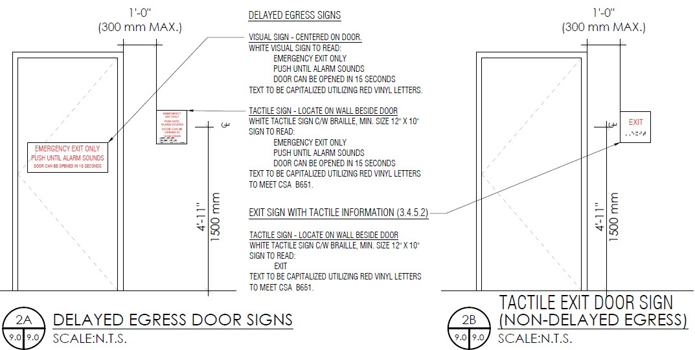

# PCN# 007 - Exit Doors Maglocks

**Source**: `PCN# 007 - Exit Doors Maglocks.pdf`  
**Pages**: 16  
**Extracted**: 2026-01-09 18:31:03

---

## Page 1

PROPOSED CHANGE NOTICE

2445-07

 
No work is to be done before this matter is finalized and a "Change Order" is issued.  This copy to remain with your office.  Do not return.  
Contractor to submit signed letter with price including cost breakdown and change (if any) to construction schedule.  Authority having 
Jurisdiction shall advise of any objections. 
 
 
TO: 
QUOREX CONSTRUCTION SERVICES LTD. 
 
 
 
1630A 8th Avenue,  
 
 
Regina, SK S4R 1E5 
 
 
RE: 
AURORA FOOD STORE 
 
 
2000 ANAQUOD ROAD 
 
 
REGINA, SK 
 
 
Commission No. 2445 
 
 
DATE: 
April 9, 2025 
 
 
PAGES: 
16 (including cover) 
 
 
RE: 
Exit Doors / Maglocks 
 
1.0 
ARCHITECTURAL 
 
 
.1 
The following doors are to have maglocks complete with exit signage: 
 
 
#104, #119B, #190A 
 
 
.2 
Doors to be prepared in accordance with City of Regina Planning & Development Services 
Advisory “Door Releasing Hardware & Electromagnetic Lock Requirements from Part 3” dated 
December 2023, attached (14 pages). 
 
 
.3 
Delete Door #119A. Provide credit. 
 
 
.4 
Delete Hardware Group #13 from drawing A9.0. 
 
 
Modify door hardware group for Doors #191A and #191B to be Group #12. 
 
 
DELAYED EGRESS TIED TO FIRE ALARM. PROVIDE SIGNAGE. 
 
 
.5 
Exits from Warehouse (#191A, #191B) to remain with localized alarm bar, no delayed egress. 
 
 
.6 
Add Keynote #32 on the A2.1-A2.4 LARGE SCALE PLANS adjacent to the following doors: 
 
 
#100A, #104, #119B, #190A, #191A, #191B 
 
 
Keynote #32 to read:  TACTILE EXIT DOOR SIGN. 
 
Distribution: 
Sobeys Inc. – Jeff Craig 
jeff.craig@sobeys.com 
Sobeys Inc. – Shanwen Hsu 
shanwen.hsu@sobeys.com 
Quorex Construction Services Ltd. – Chris Walbaum 
c.walbaum@quorex.ca 
Lavergne Draward & Associates Inc. – Charles Koop 
ckoop@ldaeng.ca 
CGM Engineering – Justin Albo 
justin_albo@cgmeng.ca 
CGM Engineering – Tony Mitousis 
tony_mitousis@cgmeng.ca 
CGM Engineering – Brendan Simpson 
brendan_simpson@cgmeng.ca 
Nejmark Architect – Kevin Fawley 
kevin@nejmark.mb.ca 
Gunnebo – Ather Faridi 
ather.faridi@gunnebo.com 
 
 
 
 
 
 
 
 
Principal 
Kevin Fawley, SAA MRAIC 

## Page 2

PROPOSED CHANGE NOTICE

2445-07

 
 
.7 
Add fire rated mounting bracket(s) to Compressor Room door #300B as specified by Gunnebo. 
 
 
.8 
Modify Gunnebo supplied door hardware for Hardware Groups #2 and #12 as per Gunnebo. 
 
 
.9 
Modify Exit Door Signage Detail #2/A9.0 to be Details #2A and #2B: 
 

 
 
 
2.0 
ELECTRICAL 
 
 
.1 
Wire and connect magnetic lock master key switch to magnetic locks. One key switch located 
at Customer Service Desk shall release/reset all magnetic locks. Magnetic locks shall be set to 
require manual reset; use of the automatic reset provision included within the maglock is not 
acceptable. Daisy chain control signals as required. 
 
 
.2 
Wire and connect magnetic locks. Interconnect magnetic locks with door access control. 
Magnetic locks to release upon alarm signal from fire alarm system, operation of master 
switch, or loss of emergency power. 
 
 
.2 
Delete Door #119A requirements. Provide credit. 
 
 
.3 
Delete Keynote #8/E3.0 from rear warehouse exit doors #191A and #191B. 
 
 
.4 
Add Keynote #8/E3.0 to Loading dock door #190A. 

## Page 3

  
          PLANNING & DEVELOPMENT 
            SERVICES ADVISORY 

Door Releasing Hardware & Electromagnetic 
Lock Requirements from Part 3 
 
 
FAQ 

 
Question 
Where are the requirements for door release hardware found in NBC 2015, Division B, Part 3? 
 
Answer 
Egress Doors 
Article 3.3.1.13 provides the main requirements for egress door hardware. 
 
Article 3.3.2.7 also provides panic hardware requirements for assembly occupancies where the 
room or suite has an occupant load more than 100 people. Note that Article 3.3.2.7 has also 
been amended by Saskatchewan’s The Building Code Regulations. 
 
Article 3.3.4.5 restricts doors that open onto public corridors from locking automatically (except 
for hotels and motels). This rule applies specifically to residential occupancies. 
 
Exit Doors 
Article 3.4.6.16 provides the main requirements specific to exit doors. 
 
Article 3.4.6.17 does provide relaxations for exit and egress doors to increase security for banks 
and mercantile floor areas. This is not being examined in this advisory. 
 
Article 3.4.6.18 provides additional hardware requirements for doors in emergency crossover 
floors. This is not being examined in detail in this advisory. 
 
Note: this advisory is focused on the main requirements for door releasing hardware operation 
and the requirements for electromagnetic locks. Therefore, it is not providing details for door 
sizes, ratings, hardware listings, self-closing hardware, smoke seals, sliding doors, revolving 
doors, hold open devices, power door operators, direction of door swing, etc. 
 
Question 
Article 3.3.1.13 talks about doors in an access to exit. How does the City of Regina interpret 
which doors are considered part of an access to exit? 
 
 
 
 

December 2023 

## Page 4

  
          PLANNING & DEVELOPMENT 
            SERVICES ADVISORY 

Answer 
Article 3.3.1.13 provided most of the requirements for door hardware for doors that are in an 
access to exit. These doors are commonly referred to as “egress doors”. Based on the 
definitions of access to exit and means of egress, the door hardware requirements of Article 
3.3.1.13 apply to any door that one would travel through in order to get from any point in a 
floor area to an exit that serves that floor area (Note: exit doors have their own requirements 
based primarily on Article 3.4.6.16). In other words, egress doors include any doors that provide 
egress from any room or egress from a suite (examples include bathroom doors, service room 
doors, doors from offices, doors from suites onto public corridors). Therefore, the egress door 
requirements apply to nearly all doors within a floor area. 
 
In summary, any door that would have a person passing through it on the way to an exit must 
meet egress door hardware requirements. These requirements will help ensure that people can  
get out of a building quickly and safely.  
Question 
What is a summary of the door hardware requirements, based on the requirements of Article 
3.3.1.13 for egress doors? 
 
Answer 
Door hardware is a vital component for ensuring that people can get out of a building quickly 
and safely. Below is a summary of Article 3.3.1.13. Owners and designers are required to ensure 
designs conform to the requirements of NBC, and so further information should be sought from 
the Code for specific designs. 
 
In summary, the basic requirements for egress door hardware in Article 3.3.1.13 state that the 
doors must: 

1. Be readily openable in traveling towards the exit without the need for tools or special 

knowledge (e.g. Keys shall not be required to allow a person to get out), 
2. Have hardware that is easily operated with one hand in a closed-fist position as per 

Clause 3.8.3.8.(1)(b) (e.g. Levers or panic bars are most commonly used), 
3. Require not more than one releasing operation for the door to be openable (e.g. 

Operating a lever handle to release the latching mechanism is considered one releasing 
operation, after which the door could be swung open), and 
4. Be operable at a height between 900mm and 1100 mm above the floor 
The points described above are the basic requirements for egress doors, and exceptions do 
apply as described in Article 3.3.1.13. These exceptions include: 

• Dwelling Units: Egress doors from a dwelling unit or suite of residential occupancy are 

allowed to have door hardware requiring multiple releasing operations (e.g. Separate 
deadbolt and lever handle permitted for egress doors from apartment units or hotel 
rooms, etc.). Special tools or knowledge to operate the hardware is not permitted.  
•  

December 2023 

## Page 5

  
          PLANNING & DEVELOPMENT 
            SERVICES ADVISORY 

 
Furthermore, the NBC Notes state that height requirements continue to apply and the 
hardware “should not require appreciable dexterity”.  
• Contained Use Areas or Impeded Egress Zones: Egress doors serving a contained use 

area or impeded egress zone are permitted to meet other requirements described in 
Article 3.3.1.13. These are not being examined in detail in this advisory. 
• Electromagnetic Locks: In place of the usual hardware requirements, egress doors are 

allowed to be equipped with electromagnetic locks. This provides owners and designers 
an opportunity to restrict passage through certain doorways, as is often desired to meet 
operational objectives. However, the requirements of Sentence 3.4.6.16.(5) or (6) must 
be met for the electromagnetic locks to meet Code. This will be discussed in more detail 
in this advisory. 
 
Finally, it is important to note the following additional hardware requirements for egress doors 
from Part 3: 

• Article 3.3.2.7 also provides panic hardware requirements for assembly occupancies 

where the room or suite has an occupant load more than 100 people. This Article has 
also been amended by Saskatchewan’s The Building Code Regulations. 
• Article 3.3.4.5 restricts doors that open onto public corridors from locking automatically 

(except for hotels and motels). This rule applies specifically to residential occupancies. 
 
Question 
What is a summary of the specific door hardware requirements based on the requirements of 
Article 3.4.6.16 for exit doors? 
 
Answer 
Exit door hardware has many of the same requirements that egress doors have, with a few 
additional requirements added. Below is a summary of Article 3.4.6.16. Owners and designers 
are required to ensure designs conform to the requirements of NBC, and so further information 
should be sought from the Code for specific designs. 

In summary, the basic requirements for exit door hardware in Article 3.4.6.16 state that the 
doors must: 

1. Be readily openable in traveling towards the exit without the need for tools or special 

knowledge (e.g. Keys shall not be required to allow a person to get out), 
2. Have hardware that is easily operated with one hand in a closed-fist position as per 

Clause 3.8.3.8.(1)(b) (e.g. Levers or panic bars are most commonly used), 
3. Require not more than one releasing operation for the door to be openable (e.g. 

Operating a lever handle to release the latching mechanism is considered one releasing 
operation, after which the door could be swung open), 

December 2023 

## Page 6

  
          PLANNING & DEVELOPMENT 
            SERVICES ADVISORY 

4. Panic hardware complying with CAN/ULC-S132 is required for latching or locking doors 

for the following scenarios (note that Sentence 3.4.6.16.(2) has been amended by The 
Building Code Regulations): 

o All exit doors from a floor area that contains an assembly occupancy with an 

occupant load more than 100, 
o Doors leading from an exit stair shaft into an exit lobby and exterior doors 

leading from an exit stair shaft to the exterior in a building with an occupant load 
more than 100, and 
o All exit doors from a floor area of Group F, Division 1 occupancy. 
5. Have door release hardware installed between 900 mm and 1100 mm above the 

finished floor. 
6. Once released, the door shall be openable without the need for excessive force 
 
The points described above are the basic requirements for exit doors, and exceptions do apply 
as described in Article 3.4.6.16. These exceptions include: 

• Contained Use Areas or Impeded Egress Zones: Egress doors serving a contained use 

area or impeded egress zone are permitted to meet other requirements described in 
Article 3.3.1.13. These are not being examined in detail in this advisory. 
• Security for Banks and Mercantile Uses: these requirements are given in Article 

3.4.6.17 and are not being discussed in this advisory. 
• Electromagnetic Locks: In place of the usual hardware requirements, exit doors are 

allowed to be equipped with electromagnetic locks. However, the requirements of 
Sentence 3.4.6.16.(5) or (6) must be met for the electromagnetic locks to meet Code. 
This will be discussed in more detail in this advisory. 
 
Question 
Code permits electromagnetic locks to be used for both egress doors and exit doors. What is a 
summary of the requirements? 
 
Answer 
Both egress doors and exit doors are permitted to use electromagnetic locks, rather than 
complying with the usual code requirements for door releasing hardware. The requirements for 
electromagnetic locks are found in Sentences 3.4.6.16.(5) and (6) and apply to both egress 
doors and exit doors. A summary of the requirements is given below. Owners and designers are 
required to ensure designs conform to the requirements of NBC, and so further information 
should be sought from the Code for specific designs. 
 
Sentence 3.4.6.16.(5) Summary 
All of the requirements listed below must be met for electromagnetic locks to be compliant 
with Code. The City of Regina has provided comments and interpretations in the table as well. 

NBC Reference 
Summary of Requirement 
City of Regina Comments 

December 2023 

## Page 7

  
          PLANNING & DEVELOPMENT 
            SERVICES ADVISORY 

Sentence (5) 
Doors with electromagnetic locks are 
permitted to be used in all 
occupancies, except for doors leading 
directly from Group F, Division 1 
occupancies. 

Note that Group B-2 and B-3 
occupancies are also permitted to 
use Sentence 3.4.6.16.(5), if 
desired 

Sentence (5) 
The electromagnetic lock shall not 
incorporate latches, pins or other 
similar devices to keep the door in the 
closed position 

Latches, pins, etc. create a 
potential risk for jamming or may 
prevent the door from releasing 
properly in an emergency 
situation. They are not permitted. 
Electromagnetic locks must “fail 
safe”. 
Clause (a) 
The building must be equipped with a 
fire alarm system 

Clause (b) 
Electromagnetic locks shall release 
upon alarm signal from fire alarm 
system 

Note that an alert signal in a 2-
stage fire alarm system does not 
require release. 
 
The City of Regina interprets that 
manual reset with the switch 
mentioned in Clause (d) is required 
upon this release. 
Clause (c) 
Electromagnetic locks shall release 
upon loss of power controlling the 
locks 

The City of Regina interprets that 
backup power is permitted for 
electromagnetic locks, as long as 
the doors continue to function as 
Code requires. If backup power is 
served by a backup generator, the 
transfer time must not be greater 
than 15 seconds (if longer than 15 
seconds, then all maglocks must 
release). 
 
The City of Regina interprets that 
manual reset with the switch 
mentioned in Clause (d) is required 
upon this release. 
Clause (d) 
Electromagnetic locks shall release 
upon activation of a manually 
operated switch by authorized person 

The City of Regina interprets this to 
be one central switch for all 
electromagnetic locks in the 
building to be released or reset 

December 2023 

## Page 8

  
          PLANNING & DEVELOPMENT 
            SERVICES ADVISORY 

simultaneously. See Appendix A-
3.4.6.16.(5) for more details. 
 
The City of Regina interprets that 
manual reset with the switch is 
required upon this release. 
Clause (e) 
Electromagnetic locks shall release 
within 15 seconds after force is 
applied to the door opening hardware 
and no re-locking is permitted until 
door opens 

The City of Regina interprets this 
release requirement to be specific 
to the door being pushed. 
 
The City of Regina interprets that 
manual reset with the switch 
mentioned in Clause (d) is required 
upon this release. 
Clause (f) 
Manual reset of electromagnetic locks 
is required after release, by use of the 
switch accessible only to authorized 
persons 
 

The City of Regina interprets this to 
be one central switch for all 
electromagnetic locks in the 
building to be released or reset 
simultaneously. See Appendix A-
3.4.6.16.(5) for more details. 
 
This manual reset with the switch 
is required when the locks are 
released due to fire alarm signal, 
loss of power, activation of the 
manual switch, the 15 second 
release process, or activation of 
the pull station serving emergency 
crossover doors. 
 
The City of Regina interprets that 
one additional releasing device is 
permitted for electromagnetic 
locks to allow authorized users to 
pass through the door (e.g. keypad 
or card swipe, etc.) and that 
manual reset upon release of the 
lock by this device is not required. 
The door must continue to meet all 
Code requirements for 
electromagnetic locks, and this 
additional releasing device is 

December 2023 

## Page 9

  
          PLANNING & DEVELOPMENT 
            SERVICES ADVISORY 

considered an additional feature 
that shall not negatively impact the 
proper functionality of the door. 
This allowance for an additional 
releasing device is permitted by 
the City of Regina for Sentence (5), 
similar to how it is permitted by 
Code for Sentence (6) as described 
in A-3.4.6.16.(6) 
Clause (g) 
Visual signage to be provided with 
instructions for 15 second unlocking 
procedure. This sign shall be mounted 
on the door. 
 
Note that this signage must comply 
with Sentence 3.8.3.9.(1) (which 
points to CSA B651). Pictures are 
provided in the Note A-3.8.3.9.(1) and 
(2). 

Clause (h) 
Tactile signage to be provided with 
instructions for 15 second unlocking 
procedure. This sign shall be mounted 
near the door. 
 
Note that this signage must comply 
with Sentence 3.8.3.9.(2) (which 
points to CSA B651). Pictures are 
provided in the Note A-3.8.3.9.(1) and 
(2). 

Clause (i) 
If there is more than one door with an 
electromagnetic lock in a path of 
egress, the total time delay cannot 
exceed 15 seconds 

Clause (j) 
If a bypass switch is installed for 
testing the fire alarm system, 
activation of this switch allows for the 
electromagnetic lock to remain locked 
even when an alarm signal is issued 
by the fire alarm panel, BUT while this 
switch is activated, the fire alarm 
annunciator and monitoring station 

This is a relaxation to allow for 
testing of the fire alarm system, 
where the door(s) need to remain 
locked for operational purposes. 
While the testing is occurring, a 
visual and audible signal shall be 
occurring, so that when testing is 
complete the switch will be de-

December 2023 

## Page 10

  
          PLANNING & DEVELOPMENT 
            SERVICES ADVISORY 

shall have an audible and visual signal 
to indicate that it is in testing mode. 

activated to return the door(s) to 
proper function. 
Clause (k) 
Emergency lighting to illuminate the 
door and signage 

Clause (l) 
If the electromagnetic locks are on 
the exit stairway side of doors used 
for emergency crossover floors, the 
lock must release immediately upon 
activation of a fire alarm pull station 
located in the exit beside the door. 
Signage shall be provided with 
instructions on the exit side. 
 
Visual signage must be mounted on 
the door (viewed from the exit-side), 
complying with Sentence 3.8.3.9.(1). 
 
Tactile signage must be mounted near 
the door (felt from the exit-side), 
complying with Sentence 3.8.3.9.(2). 

The City of Regina interprets that 
this is a red pull station connected 
to the fire alarm system and 
functioning the same as any other 
fire alarm pull station, in addition 
to immediately releasing the door 
it serves (Note that with a 2-stage 
fire alarm system, an alert signal 
would not release all magnetic 
locks in the building, but the pull 
station serving the emergency 
crossover door must release the 
door it serves immediately upon 
activation.) 
 
The City of Regina interprets that 
manual reset with the switch 
mentioned in Clause (d) is required 
upon this release. 
 
 
* Note: if an electromagnetic lock is used on a fire door, special care is needed in the design, as fire 
doors must positively latch, as required by Article 3.1.8.15. A fire door must be capable of latching at all 
times. An electromagnetic lock alone does not satisfy this requirement. 

Sentence 3.4.6.16.(6) Key Points 
All of the requirements listed below must be met for electromagnetic locks to be compliant 
with Code. The City of Regina has provided comments and interpretations in the table as well. 

NBC Reference 
Summary of Requirement 
City of Regina Comments 
Sentence (6) 
Doors with electromagnetic locks 
conforming to this Sentence are 
permitted only for Group B, Division 
2 and 3 occupancies 

This Sentence provides for 
additional security in B-2 and B-3 
occupancies while also providing 
an adequate level of safety for 
occupants. These occupancies may 
choose to use Sentence 
3.4.6.16.(5), if desired, instead 
Sentence (6) 
The electromagnetic lock shall not 
incorporate latches, pins or other 

Latches, pins, etc. create a 
potential risk for jamming or may 

December 2023 

## Page 11

  
          PLANNING & DEVELOPMENT 
            SERVICES ADVISORY 

similar devices to keep the door in the 
closed position 

prevent the door from releasing 
properly in an emergency 
situation. They are not permitted. 
Electromagnetic locks must “fail 
safe”. 
Clause (a) 
The building must be equipped with a 
fire alarm system and must be 
sprinklered 

Subclause 
(b)(i) 

Electromagnetic locks shall release 
upon alarm signal from fire alarm 
system 

Note that an alert signal in a 2-
stage fire alarm system does not 
require release. 
 
The City of Regina interprets that 
manual reset with the switch 
mentioned in Subclause (b)(iii) is 
required upon this release. 
Subclause 
(b)(ii) 

Electromagnetic locks shall release 
upon loss of power controlling the 
locks 

The City of Regina interprets that 
backup power is permitted for 
electromagnetic locks, as long as 
the doors continue to function as 
Code requires. If backup power is 
served by a backup generator, the 
transfer time must not be greater 
than 15 seconds (if longer than 15 
seconds, then all maglocks must 
release) 
 
The City of Regina interprets that 
manual reset with the switch 
mentioned in Subclause (b)(iii) is 
required upon this release. 
Subclause 
(b)(iii) 

Electromagnetic locks shall release 
upon activation of a switch by 
authorized persons from a constantly 
attended location within the locked 
space 

The City of Regina interprets this to 
be one central switch for all 
electromagnetic locks serving the 
locked space to be released or 
reset simultaneously. 
 
The City of Regina interprets that 
manual reset with the switch is 
required upon this release. 
Subclause 
(b)(iv) 

Each door controlled by an 
electromagnetic lock shall have a fire 

The City of Regina interprets that 
this is a red pull station connected 

December 2023 

## Page 12

  
          PLANNING & DEVELOPMENT 
            SERVICES ADVISORY 

alarm manual pull station within 0.5 
m of the door, and the door must 
release immediately upon actuation 
of the pull station serving that door. 

to the fire alarm system and 
functioning the same as any other 
fire alarm pull station, in addition 
to having an auxiliary contact that 
immediately releases the door it 
serves (Note that with a 2-stage 
fire alarm system, an alert signal 
would not release all magnetic 
locks in the building, but the pull 
station serving this door must 
release the door immediately upon 
activation.) 
 
Appendix A-3.4.6.16.(6) permits 
the use of a transparent box over 
the pull station, equipped with an 
alarm, to reduce false alarms. 
 
The City of Regina interprets that 
manual reset with the switch 
mentioned in Subclause (b)(iii) is 
required upon this release. 
Clause (c) 
Upon release, electromagnetic locks 
must be manually reset by the switch 
in Subclause (b)(iii) 

This manual reset with the switch 
is required when the locks are 
released due to fire alarm signal, 
loss of power, activation of the 
manual switch, or activation of the 
pull station that releases a door. 
 
The City of Regina interprets that 
one additional releasing device is 
permitted for electromagnetic 
locks to allow authorized users to 
pass through the door (e.g. keypad 
or card swipe, etc.) and that 
manual reset upon release of the 
lock by this device is not required. 
The door must continue to meet all 
Code requirements for 
electromagnetic locks, and this 
additional releasing device is 
considered an additional feature 

December 2023 

## Page 13

  
          PLANNING & DEVELOPMENT 
            SERVICES ADVISORY 

that shall not negatively impact the 
proper functionality of the door. 
This allowance is permitted by 
Code as described in A-3.4.6.16.(6) 
Clause (d) 
A visual sign must be provided on 
each door controlled by an 
electromagnetic lock, indicating the 
door will unlock when fire alarm 
activated 
 
Note that this signage must comply 
with Sentence 3.8.3.9.(1) (which 
points to CSA B651). Pictures are 
provided in the Note A-3.8.3.9.(1) and 
(2). 

Clause (e) 
A tactile sign must be provided near 
each door controlled by an 
electromagnetic lock, indicating the 
door will unlock when fire alarm 
activated 
 
Note that this signage must comply 
with Sentence 3.8.3.9.(2) (which 
points to CSA B651). Pictures are 
provided in the Note A-3.8.3.9.(1) and 
(2). 

Clause (f) 
If a bypass switch is installed for 
testing the fire alarm system, 
activation of this switch allows for the 
electromagnetic lock to remain locked 
even when an alarm signal is issued 
by the fire alarm panel, BUT while this 
switch is activated, the fire alarm 
annunciator and monitoring station 
shall have an audible and visual signal 
to indicate that it is in testing mode. 

This is a relaxation to allow for 
testing of the fire alarm system, 
where the door needs to remain 
locked for operational purposes. 
While the testing is occurring, a 
visual and audible signal shall be 
occurring, so that when testing is 
complete the switch will be de-
activated to return the door to 
proper function. 
Clause (g) 
Emergency lighting to illuminate the 
door and signage 

 
* Note: if an electromagnetic lock is used on a fire door, special care is needed in the design, as fire 
doors must positively latch, as required by Article 3.1.8.15. A fire door must be capable of latching at all 
times. An electromagnetic lock alone does not satisfy this requirement. 

December 2023 

## Page 14

  
          PLANNING & DEVELOPMENT 
            SERVICES ADVISORY 

 
 
 
 
 
Question 
Can an electric strike be used (instead of an electromagnetic lock) to restrict egress if it 
provides all the same functions as required for electromagnetic locks? 
 
Answer 
No. Electric strikes cannot be substituted for electromagnetic locks where electromagnetic 
locks are required. This is because electric strikes do not pass the requirement to “not 
incorporate latches, pins, or other similar devices to keep the door in the closes position”. If 
restricted egress/exiting is desired, electromagnetic locks meeting all requirements must be 
used. 
 
Note: exceptions apply for designs under Article 3.4.6.17 for the security of banks and 
mercantile uses, or Sentence 3.3.1.13.(6) and 3.4.6.16.(1) for a contained use area or an 
impeded egress zone, which are not being covered in this advisory. 
 
Question 
Can an electric strike be used to restrict access to individual rooms, offices or suites or portions 
of floor area? 
 
Answer 
Depending on the design. If the individual room, office, or floor area does not have an exit on 
the other side of the locked door, then the path into that space would not be considered an 
access to exit. Therefore, this door can be locked with an electric strike to prevent unauthorized 
entry (similar to how locking this door with a normal key would be permitted). However, from 
within that space, a person must be able to egress through that door on the way to an exit with 
no special tools/knowledge, not more than one releasing operation, and must be able to 
operate the hardware with one hand in a closed-fist, etc. 
 
However, if an exit exists beyond the locked door, this could be considered a potential access to 
exit and an electric strike would not be permitted (similar to how locking this door with a 
normal key would not be permitted). If a designer determines that adequate exiting is provided 
to meet Code, even with such a door locked, this design would have to be submitted and 
evaluated under an Alternative Solution or written proposal, depending on the complexity of 
the design. 
 
 
 

December 2023 

## Page 15

  
          PLANNING & DEVELOPMENT 
            SERVICES ADVISORY 

December 2023 

## Page 16

  
          PLANNING & DEVELOPMENT 
            SERVICES ADVISORY 

Question 
Can an electric strike be used to restrict access from an exit stairway (or exterior of a building) 
into a floor area? 
 
Answer 
Many building owners/occupants wish to maintain a level of security by restricting access to 
certain floors. With proper design, this can be accomplished by using electric strikes that 
prevent unauthorized persons from entering the floor area from the exit stairway (or by 
installing electric strikes on exterior doors to prevent a person from entering from outside). 
HOWEVER, when electric strikes are installed to prevent unauthorized entry from the exit 
stairway to a floor area, the professional designer must ensure that the requirements of Article 
3.4.6.18 for emergency crossover floors are not compromised. Storeys that are required to 
meet emergency crossover floor requirements, must use electromagnetic locks meeting all 
requirements (or nonlocking door hardware meeting the basic requirements). Whenever an 
electric strike is used, it must ONLY be used to restrict entry and may NOT be used to restrict 
egress. Except where electromagnetic locks are being utilized, egress and exiting must require 
no special tools/knowledge, not more than one releasing operation, and a user must be able to 
operate the hardware with one hand in a closed-fist, etc. Finally, fire doors are required to 
positively latch. Therefore, designers must also ensure that if electric strikes are used on fire 
doors, that they ‘fail secure’ to maintain positive latching, while not negatively impacting egress 
requirements. 
 
Note: again, exceptions exist for designs that fall under Article 3.4.6.17 for the security of banks 
and mercantile uses, or Sentences 3.3.1.13.(6) and 3.4.6.16.(1) for a contained use area or an 
impeded egress zone, which are not being covered in this advisory. 
 
For more information on Building Permits, Building Safety or Zoning Information, please visit 
Regina.ca or contact Service Regina. 
 
 

December 2023 

