# PCN# 012 - Exterior Signage

**Source**: `PCN# 012 - Exterior Signage.pdf`  
**Pages**: 5  
**Extracted**: 2026-01-09 18:31:16

---

## Page 1

PROPOSED CHANGE NOTICE

2445-12

 
No work is to be done before this matter is finalized and a "Change Order" is issued.  This copy to remain with your office.  Do not return.  
Contractor to submit signed letter with price including cost breakdown and change (if any) to construction schedule.  Authority having 
Jurisdiction shall advise of any objections. 
 
 
TO: 
QUOREX CONSTRUCTION SERVICES LTD. 
 
 
 
1630A 8th Avenue,  
 
 
Regina, SK S4R 1E5 
 
 
RE: 
AURORA FOOD STORE 
 
 
2000 ANAQUOD ROAD 
 
 
REGINA, SK 
 
 
Commission No. 2445 
 
 
DATE: 
May 13, 2025 
 
 
PAGES: 
5 (including cover) 
 
 
RE: 
Exterior Signage 
1.0 
ELECTRICAL 
 
 
.1 
Signage Contractor to provide white perforated metal signage back panel and Safeway sign. 
 
 
 
 
0.125  3003 Aluminum Perforated Sheet 3/8" diameter on 1/2" staggered centers 
 
 
 
 
51% open to be painted white and welded to the 2" tube frame 
 
 
 
 
5’-0” high x 38’-4” wide sign, with perforated panel behind. 
 

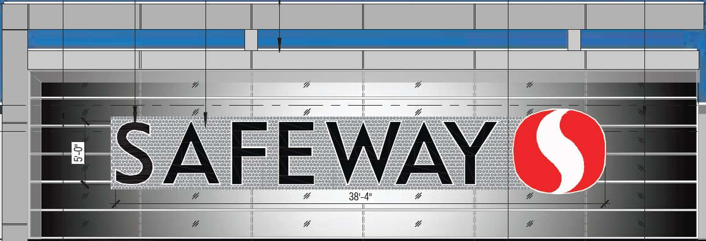

 
 
 
 
 
 
         
Distribution: 
Sobeys Inc. – Jeff Craig 
jeff.craig@sobeys.com 
Sobeys Inc. – Shanwen Hsu 
shanwen.hsu@sobeys.com 
Quorex Construction Services Ltd. – Chris Walbaum 
c.walbaum@quorex.ca 
Lavergne Draward & Associates Inc. – Charles Koop 
ckoop@ldaeng.ca 
CGM Engineering – Justin Albo 
justin_albo@cgmeng.ca 
CGM Engineering – Tony Mitousis 
tony_mitousis@cgmeng.ca 
CGM Engineering – Brendan Simpson 
brendan_simpson@cgmeng.ca 
 
 
 
 
 
 
Principal 
Kevin Fawley, SAA MRAIC 

## Page 2

PROPOSED CHANGE NOTICE

2445-12

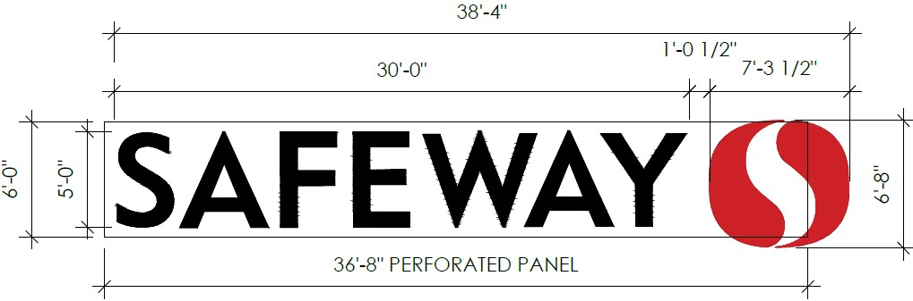

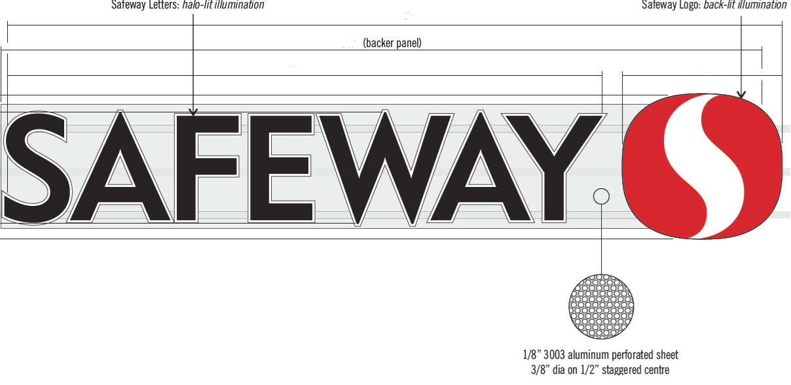

## Page 3

PROPOSED CHANGE NOTICE

2445-12

 
 
.2 
Provide fifteen (15) knife plates and three (3) horizontal HSS at front entrance signage,  
 
 
Located behind perforated aluminum backer panel. 

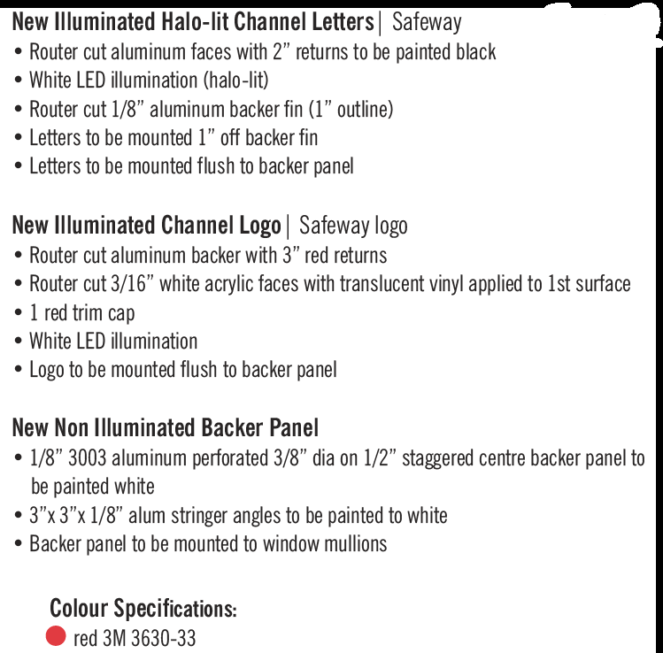

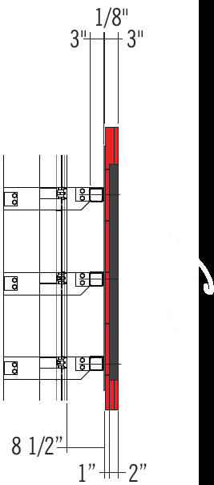

 
 
 
.3 
One entry point of power behind S logo, out from mullion, then run along rail/channel to pick up 
letters.   
 
 
.4 
GC to coordinate scope with electrical, signage contractor, and aluminum frames. 
 
 
 
 
 
 
 
 
 

## Page 4

PROPOSED CHANGE NOTICE

2445-12

 
 
.5 
Provide 6’-0” x 6’-0” Rachelle Bery sign and 6’-0” x 6’-0” Pharmacy sign. 
 
 
Underside of signage to be installed at 114’-10”. 

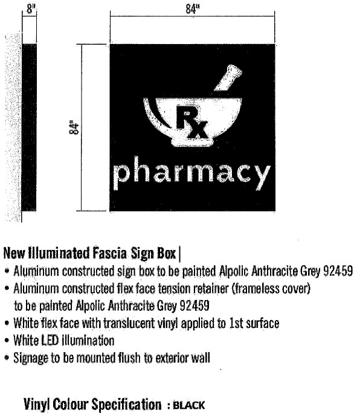

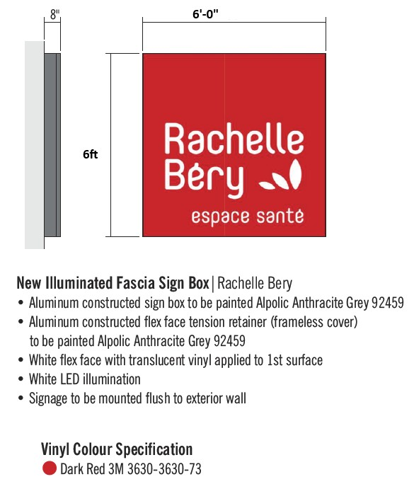

 
 
 
.6 
Provide SAFEWAY signage c/w logo at West and North elevations. 
 
 
Underside of signage to be installed at 115’-8”. 

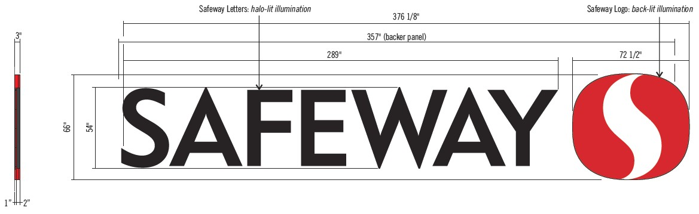

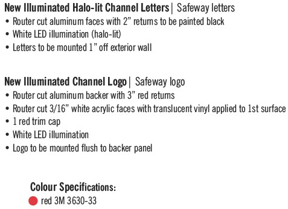

 
 
 
.7 
Delete circular sign from front/East elevation. 
 
 
.8 
Refer to attached exterior elevations (1 page). 

## Page 5

T/O MAIN FLOOR

ELEV. 100'-0" 

U/S OF CANOPY 

ELEV. 112'-0" 

U/S OF STEEL DECK 

ELEV. 121'-6" 

T/O LOW PARAPET 

ELEV. 123'-6" 

T/O PORTAL

ELEV. 131'-6" 

T/O MAIN FLOOR

ELEV. 100'-0" 

U/S OF STEEL DECK 

ELEV. 121'-6" 

T/O LOW PARAPET 

ELEV. 123'-6" 

T/O PORTAL

ELEV. 131'-6" 

T/O MAIN FLOOR

ELEV. 100'-0" 

U/S OF STEEL DECK 

ELEV. 121'-6" 

T/O LOW PARAPET 

ELEV. 123'-6" 

T/O MAIN FLOOR

ELEV. 100'-0" 

U/S OF CANOPY 

ELEV. 112'-0" 

U/S OF STEEL DECK 

ELEV. 121'-6" 

T/O LOW PARAPET 

ELEV. 123'-6" 

T/O PORTAL

ELEV. 131'-6" 

A
B
C
D
E
F
G
H
J

9
A
A
C
C
E
E
F
G1
H
H
G

4.0 4.0

4.0 4.0

4.0 4.0

M

4.0 4.0

4
SCALE: 1/8" = 1'-0"

1
2
4
5
3
6
7
8
8.1
9

2
SCALE: 1/8" = 1'-0"

A
B
C
D
E
F
G
H
J

3
SCALE: 1/8" = 1'-0"

1
2
4
5
3
6
7
8
9

1
SCALE: 1/8" = 1'-0"

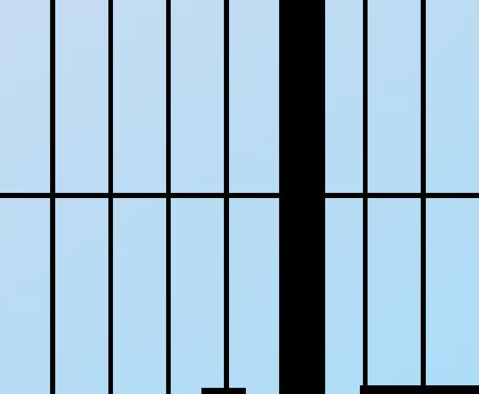

4.0
5.1

W6

W5

6

6
7
9
11

NORTH ELEVATION

WEST ELEVATION

4.0
5.4

SOUTH ELEVATION

14

EAST ELEVATION

D
D
E
E
E
I
I
K
K

15'-8"

A
A
A
B
B
B
C
C
C
E
D
E
E
E
F
F
G
G
G
F
I
I
I
H
H
H
G1
G
G
G
J
J
J
J
K
L
N
M
M
J
4.0
5.3

F

C
D

2

4
4

E
E
E

15'-8"

4.0
5.2

7

2
2
2
2
2
2

9'-3"

1
2
2
2
2
2
2
2
2
2
2

4
4
11
11
11
11
11

3'-9"

A

1
1
5
6
6

A
C

F

EQ.
EQ.

11
11

4.0
5.2

8

F
T P O  R O O F  M E M B R A N E

2
2
2
2
2
2
2

2
2
2
9

11
11
11
11

F

F
K
K
N
4.0
5.0

F

K

11
11

4.0
5.2

K

2

W2
W1
W2
W2

4.0
5.3

10

11
11

14'-10"

4
4
3

5'-11"

4.0
5.4

15

8'-2"

14'-10"

4.0
5.3

12

M

4.0
5.0

3A

11
G1

3

10
8

4.0
5.3

13

4.0
5.0

1

6'-0"

4.0 4.0

5
SCALE: NTS

EAST

WEST & NORTH

5'-0"

4'-6"

SIGNAGE ELEVATIONS

6'-0"
6'-0"

4.0
5.0

2

36'-8" PERFORATED PANEL

30'-0"

38'-4"

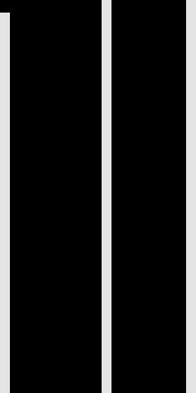

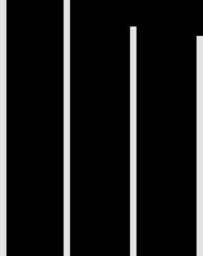

6'-0"

W3

1'-0 1/2"

4.0
5.1

4

7'-3 1/2"

6'-8"

M

W4

E

4.0
5.1

5

13

KEYNOTE
REFERENCE

EXTERIOR FINISH SCHEDULE

NOTE: ALL SAMPLES TO BE SUBMITTED TO ARCHITECT  FOR REVIEW PRIOR TO
CONSTRUCTION.

G1
SPANDREL GLASS

M 

G 

C 

F2
ACM PANELS

D 

H 

A 

B 

E 

F 

K 

L 

N

J 

I 

RED ACM PANELS
ALPOLIC TRC RED
LOT #092519

EIFS W/ ACRYLIC STUCCO
FINISH

EIFS W/ ACRYLIC STUCCO
FINISH

PRE - FINISHED METAL FLASHING

PRE - FINISHED METAL
SIDING

PAINTED METAL TRELLIS

GLASS

PAINTED STEEL DOOR

CURTAIN WALL

CONCRETE GRADE BEAM

MASONRY

ACM PANELS

WALL LIGHT
CLEAR ANODIZED
ALUMINUM

WALL PACK
TO MATCH. CLEAR
ANODIZED ALUMINUM

PRODUCT/ITEM
COLOUR

2-54 Adelaide Street Winnipeg Manit
a
ob
R3A 0V7
 P 204 947 3775
 F 204 947 3789
www.nejmark.mb.ca

EXTERIOR ELEVATIONS

AURORA GROCERY STORE
2000 ANAQUOD ROAD
REGINA, SASKATCHEWAN

PROJECT TITLE:

DRAWN BY:

PRINTING DATE:

No.     ISSUED FOR                                      DATE                   BY

COMMISSION NUMBER:
SHEET NUMBER:

Drawings and specifications, as instruments of service are the property of the Architect, the
copyright in the same being reserved to them.  No reproduction may be made without the
permission of the architects, and when made, must bear their names.  All prints to be returned.

The contractor is to verify dimensions and date noted herein with conditions on the site and is
held responsible for reporting discrepancy to the Architect for adjustment.

SHEET TITLE:

STAMP

2445

FILE: 2445 A4.0 - EXTERIOR ELEVATIONS.DWG

1
CONSTRUCTION
JANUARY 9, 2025
KF

3
PCN 2445-12 EXTERIOR SIGNAGE
KF

2
CONSTRUCTION
KF
APRIL 21, 2025

1.
       DRAWING IS TO BE VIEWED IN COLOUR.

GENERAL NOTE:

GENERAL NOTES:

KEYNOTES:

.1
GENERAL CONTRACTOR TO SUPPLY AND INSTALL NEW 
SIGNAGE AS INDICATED. GENERAL CONTRACTOR TO 
ENGAGE ONE OF THE FOLLOWING TWO PRE-APPROVED 
SIGNAGE COMPANIES:

.2
GENERAL CONTRACTOR TO SUBMIT SHOP DRAWINGS OF 
NEW SIGNAGE FOR CONSULTANT AND OWNER REVIEW.
SHOP DRAWINGS TO INCLUDE CONNECTION DETAILS.

.3
GENERAL CONTRACTOR TO APPLY FOR AND OBTAIN ALL 
NECESSARY PERMITS REGARDING NEW SIGNAGE.

10

11

12

13

1

2

3

4

5

6

7

8

9

PRIDE SIGNS
CONTACT NAME: NELSON MELO
CONTACT NUMBER: (T) 519-622-4040, (M) 519-404-1352
CONTACT E-MAIL: NMELO@PRIDESIGNS.COM

WALL MOUNTED LIGHT FIXTURE (TYP.). PROVIDE
BACKING AS REQUIRED. REFER TO ELECTRICAL.

PROVIDE PLYWOOD BACKING AND BLOCKING FOR
EXTERIOR SIGNAGE. PROVIDE POWER, REFER TO
ELECTRICAL.

FIRE DEPARTMENT CONNECTION. INCLUDE RED
REFLECTIVE FIRE DEPARTMENT CONNECTIONS SIGN
AND KNOX LOCK BOX ABOVE. REFER TO MECHANICAL.

APPROXIMATE LOCATION OF HOSE BIB.
REFER TO MECHANICAL.

INTERNATIONAL NEON
CONTACT NAME: LYNE MATHIEU
CONTACT NUMBER: (T) 514-937-0044, (M) 514-829-5370
CONTACT E-MAIL: LYNE@NEON.CA

SIGNAGE BY GENERAL CONTRACTOR.
PROVIDE ELECTRICAL AND STRUCTURAL.

LOCATION OF GAS METER C/W BOLLARD PROTECTION.
PAINT TO MATCH WALL.

INSULATED METAL DOOR & FRAME PAINTED TO MATCH
ADJACENT WALL FINISH.

PROPOSED LOCATION OF TELEPHONE / CABLE BOX.
PAINTED TO MATCH ADJACENT WALL.

GARBAGE COMPACTOR DOOR AND FRAME PAINTED
TO MATCH ADJACENT CLADDING.

GALVANIZED STEEL STAIRS & RAILING (PAINTED BLACK).

OVERFLOW SCUPPER, REFER TO ROOF PLAN.

CONCRETE FILLED STEEL BOLLARD C/W COVER,
COLOUR: SAFETY YELLOW.

"NO PARKING / FIRE LANE" SIGNAGE.

AK

N E J M A R K
A
R
C
H
I
T
E
C
T

MAY 13, 2025

TO MATCH SHERWIN
WILLIAMS SW 7019
GAUNTLET GRAY
(244-C6)

PORTLAND.
MORTAR: SOLOMAN
COLOURS INC. 94A
IRON BRICK.

KAWNEER 1600 SYSTEM
TM2, COLOUR 14
ANODIZED CLEAR AA
M10022.

PPG UC141834 DURANAR
ANTHRACITE GREY (LIQUID
COAT)

PAINTED. COLOUR TO
MATCH VICWEST 56072
CHARCOAL GRAY

ALCOTEX DM 1105
LIGHT GREY.
SMOOTH FINISH.

DOUBLE SEALED
TEMPERED GLASS C/W
LOW E. TINT.

LIGHT GREY
CONCRETE WITH SMOOTH &
FORMLINER FINISH.

OPACI-COAT-300
#3-0770 WARM GRAY -
VITRO

PAINTED. COLOUR TO
MATCH VICWEST 56072
CHARCOAL GRAY

ALCOTEX DM 1120
BLACK

TO MATCH SHERWIN
WILLIAMS SW 7570
EGRET WHITE.

VICWEST
56072
CHARCOAL

A4.0

