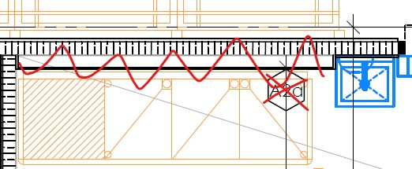
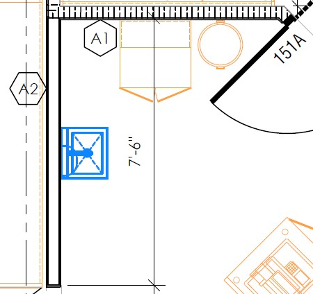
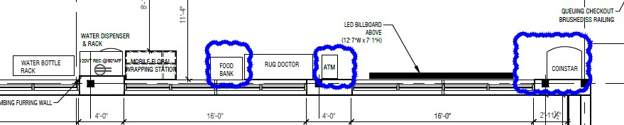
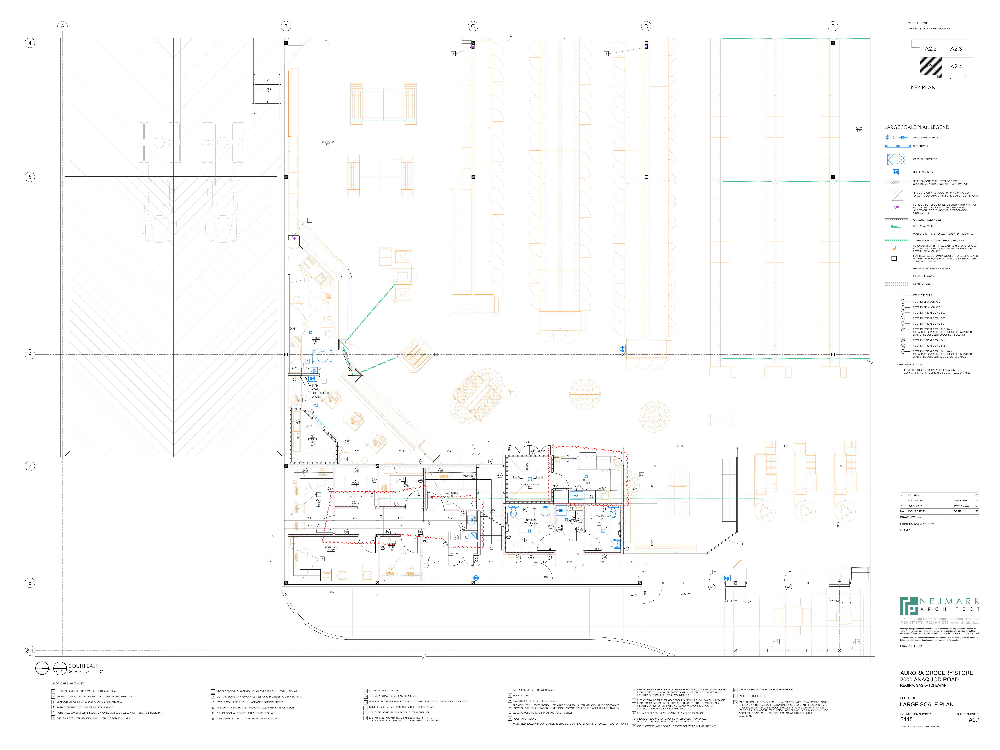
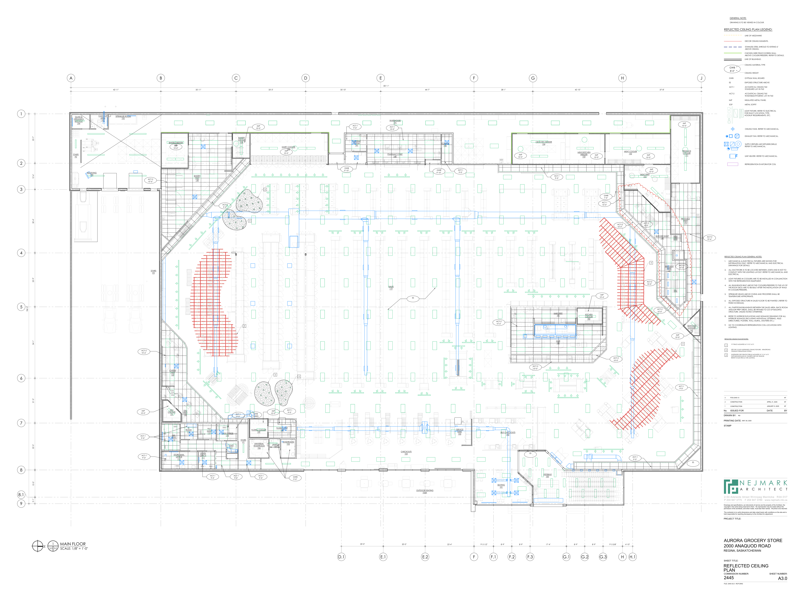
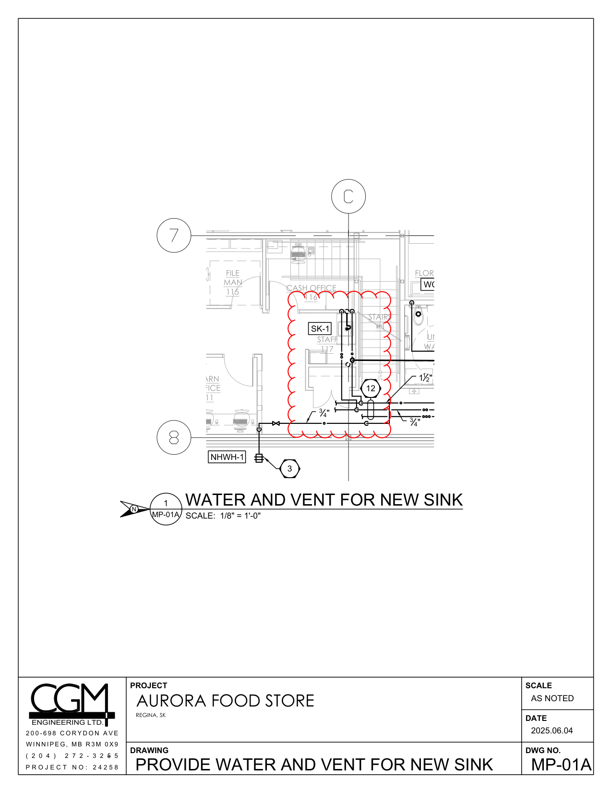
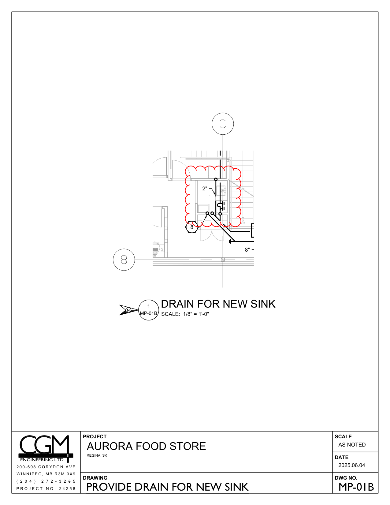
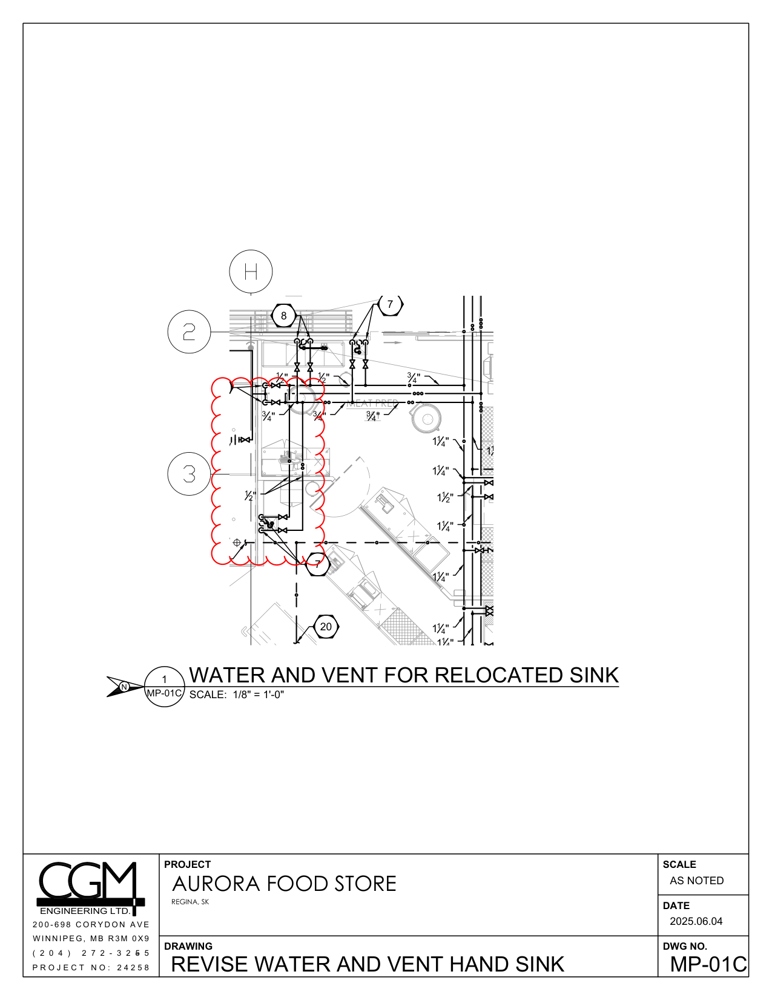
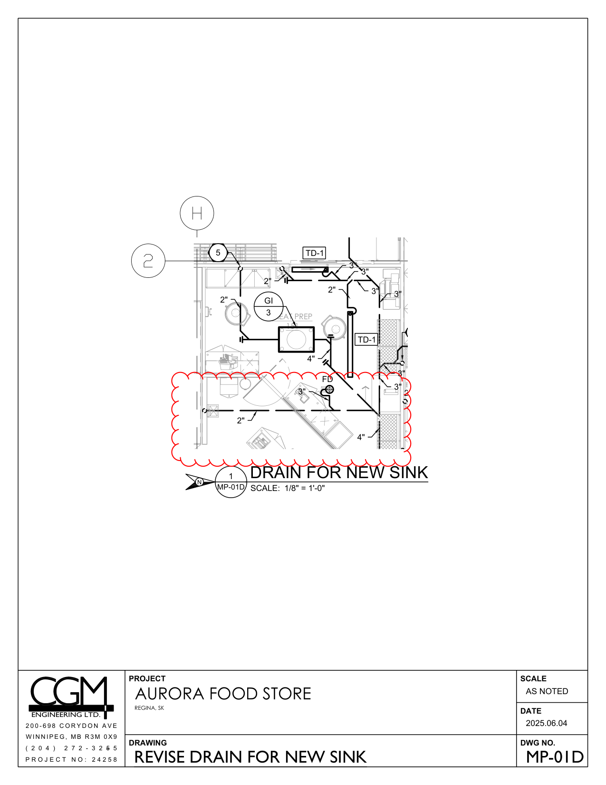
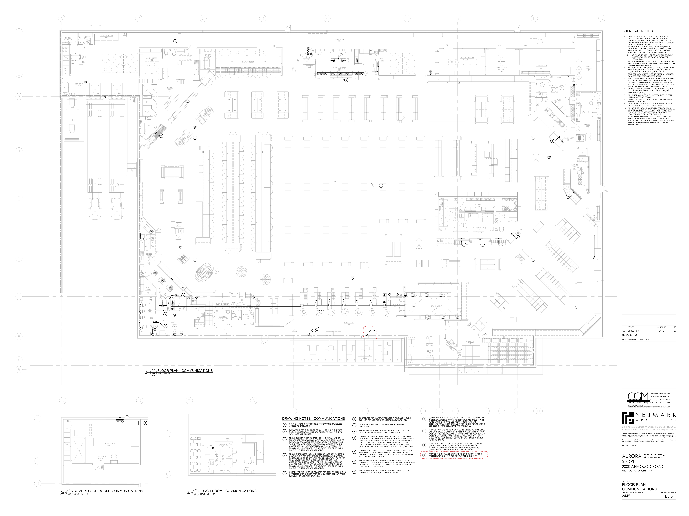

# PCN# 013 - Building Permit Misc Modifications

**Source**: `PCN# 013 - Building Permit Misc Modifications.pdf`  
**Pages**: 18  
**Extracted**: 2026-01-09 18:31:20

---

## Page 1

PROPOSED CHANGE NOTICE

2445-13

No work is to be done before this matter is finalized and a "Change Order" is issued.  This copy to remain with your office.  Do not return. 
Contractor to submit signed letter with price including cost breakdown and change (if any) to construction schedule.  Authority having 
Jurisdiction shall advise of any objections. 

QUOREX CONSTRUCTION SERVICES LTD. 
1630A 8th Avenue,  
Regina, SK S4R 1E5 

TO: 

AURORA FOOD STORE 
2000 ANAQUOD ROAD 
REGINA, SK 
Commission No. 2445 

RE: 

June 5, 2025 

DATE: 

18 (including cover) 

PAGES: 

Building Permit / Misc Modifications 

RE: 

1.0 
ARCHITECTURAL 

a)
Adjust width of main floor office hallway below staff mezzanine.

b)
Convert ‘Storage Room #117’ into a small staff room. Add furring wall at RWL.
Add microwave and sink in this space, delete door and provide credit.

c)
Modify Floral and Customer Service Desk millwork to have barrier-free counter.

d)
Delete furring wall behind 3-compartment sink in Meat Prep cooler box.
Pipes to be surface mounted and insulated. Provide credit.

Distribution: 
Sobeys Inc. – Jeff Craig 
jeff.craig@sobeys.com 
Sobeys Inc. – Shanwen Hsu 
shanwen.hsu@sobeys.com 
Quorex Construction Services Ltd. – Chris Walbaum 
c.walbaum@quorex.ca
Lavergne Draward & Associates Inc. – Charles Koop 
ckoop@ldaeng.ca 
CGM Engineering – Justin Albo 
justin_albo@cgmeng.ca 
CGM Engineering – Tony Mitousis 
tony_mitousis@cgmeng.ca 
CGM Engineering – Brendan Simpson 
brendan_simpson@cgmeng.ca 

Principal 
Kevin Fawley, SAA MRAIC 

## Page 2

PROPOSED CHANGE NOTICE

2445-13

e) Add full height 3 5/8” wall <A2> behind refrigerated case south side of Butcher Shop. Modify location 

of handsink. Provide white FRP at Butcher Shop side. Provide stainless steel cap at end of wall. 
 

f) 
Owner supplied locker added to Learn Office #111. 
 
g) Butcher Shop and Seafood Prep ceilings to be T-bar/ACT instead of insulated cooler panel ceiling.  

 
h) Add ATM near checkouts, and relocates coin star and food bank: 

i) 
Replace the following full size drawings with the attached dated May 29, 2025: 

 
A2.1 
LARGE SCALE PLAN 
 
A3.0 
REFLECTED CEILING PLAN 
 
A8.2 
CUSTOMER SERVICE MILLWORK 
 
A8.3 
FLORAL MILLWORK 
 
A8.4  
STAFF MILLWORK 
 
 
   
2.0 
MECHANICAL 
 
 
.1 
Refer to attached Mechanical PCN #01, dated June 4, 2025. 
 
 
(1 page text, 4 detail pages MP-01A, MP-01B, MP-01C, MP-01D). 
 
3.0 
ELECTRICAL 
 
 
.1 
Refer to attached Electrical PCN #6, dated June 5, 2025.  
 
 
(1 page text, 5 full size drawings E0.2, E0.3, E1.0, E2.0, E5.0) 

## Page 3

8.1

5

6

7

8

4

N

LARGE SCALE PLAN KEYNOTES:

1

2

3

4

5

6

2.0 2.1

ROLLING SECURITY GRILLE. REFER TO DETAIL ON A7.2.

BRASCON CHROME POST & RAILING SYSTEM. "B" STANDARD.

PONY WALL C/W STAINLESS STEEL CAP. PROVIDE VERTICAL STEEL SUPPORT, REFER TO STRUCTURAL.

ENCLOSURE FOR REFRIGERATION LINE(S). REFER TO DETAILS ON A7.1.

VERTICAL HSS INSIDE PONY WALL REFER TO STRUCTURAL.

SECURITY GATE TIED TO FIRE ALARM. SOBEYS SUPPLIED, GC INSTALLED.

1
SCALE: 1/4" = 1'-0"

A
B
C
D
E

SOUTH EAST

11

10

12

7

8

9

12'' X 12' CONCRETE  FOR HIGH VOLTAGE ELECTRICAL SUPPLY.

PROVIDE BLOCKING/BACKING IN WALL FOR FIXTURE/MILLWORK/SHELVING.

FIRESTOP ALL PENETRATIONS THROUGH WALLS. WALLS TO BE FULL HEIGHT.

IMPACT DOOR AND FRAME. REFER TO DETAILS ON A7.1.

CONCRETE CURB C/W REMOVABLE STEEL HANDRAIL. REFER TO DRAWING A7.1.

STEEL ANGLE IN DAIRY COOLER. REFER TO DETAIL ON A7.2.

STAIRS
#3

8'-11"

A2a

2'-7"
3'-6"

A3

C16

10'-0"

16

A4b

SLOPE

7

5

9'-1"
8'-5"
8'-11"
10'-2"

DELI
COOLER
121

8'-4"
8'-7"
9'-4"

6

A1

8'-6"

FULL HEIGHT
WALL

CHEESE
PREP
123

CHEESE
PREP
116

54"H
WALL

DEP.
MAN.
113

7
7

7

BULKFOOD
117

1

STORE MAN.
OFFICE
112

1'-1

113

A2b

17'-6"

A1

16

DELI
PREP
120

A2b
A2b
A2b

A2b
A2b

IT
ROOM
114

A4b

1'-2"
9'-3"
8'-11"
8'-5"

17

16

18

13

14

15

HYDRAULIC DOCK LEVELER.

DOCK SEAL (C/W CURTAIN) AND BUMPERS.

COOLER/FREEZER PANEL CLOSURE. REFER TO DETAIL ON A7.1.

CONCRETE HOUSE KEEPING PAD BELOW TRANSFORMER.

C.R.LAURENCE ARS ALUMINUM RAILING SYSTEM. 48" HIGH.
CLEAR ANODIZED ALUMINUM C/W 1/2" TEMPERED GLASS PANELS.

TRACK GUARD STEEL ANGLE BOTH SIDES OF OVHD., PAINTED YELLOW. REFER TO PLAN DETAIL.

114

A2b

112

5'-1"

A2b

LEARN
OFFICE
111

7

FILE
MAN
115

7

111

115

A2b

A4b

A3b

A3b

4'-7"

9'-3"

116

4'-2"
7'-3"
4'-11"
5'-2"
4'-9"
4'-7"
1'-2"

A4b

A2

CASH OFFICE
116

7

6
6

A2

118

STAFF
117

A2b

A2a

BELOW  A3a
A3a

A3

A2

A2

5'-9"
9'-8"

STAIRS
#1

A4

UP
21R

A3b

109B

19

20

21

22

23
QUEUING MERCHANDISERS (NEXTRAC STORE FIXTURES).

24
ROOF HATCH ABOVE.

25
MOTORIZED ROLLER WINDOW SHADES.  FABRIC COLOUR: SILVER BIRCH. REFER TO ELECTRICAL FOR POWER.

PROVIDE 2'' PVC SLEEVE THROUGH MEZZANINE FLOOR TO RUN REFRIGERATION LINE. COORDINATE
LOCATION WITH REFRIGERATION CONTRACTOR. PROVIDE FIRE STOPPING AFTER LINE INSTALLATION.

ROOF LADDER.

SAFETY BAR. REFER TO DETAIL ON A9.0.

STAINLESS STEEL SHROUD. REFER TO A7.0.

SLOPE
SLOPE

A2b
A2b

6'-0"

FLORAL COOLER
109

A3b
A3b
A3b

UNIVERSAL
WASHROOM
106

SLOPE

7

A2
A2b

A2a   ABOVE

110

106

A2b

109A

A2

5'-3"

WASHROOM
105
JANITOR
107

4'-5"
6'-10"
5'-7"

10

7

107

5'-6"

A2

A2b

FLORAL PREP
108

3"

105

7

A3b

+/-16'-0"
+/-4 3/4"

26
PP55ABS SLIMLINE SERIES STRAIGHT FRONT PARTITION POSTS FROM CRL PRODUCTS.
1" DIA. POSTES 12" HIGH W/ BRUSHED STAINLESS STEEL FINISH C/W FLAT CAPS,
INSTALLED ON FLORAL MILLWORK COUNTERTOP.

27
PP55ABS SLIMLINE SERIES STRAIGHT FRONT PARTITION POSTS FROM CRL PRODUCTS.
1" DIA. POSTES 16" HIGH W/ BRUSHED STAINLESS STEEL FINISH C/W FLAT CAPS,
INSTALLED ON TOP OF VIC STORE PHARMACY MILLWORK CAP. GC TO
COORDINATE WITH VIC STORE FIXTURES INC.

28
ROOM PAINTED PT6 AS PER ADDENDUM #6. REFER TO DECOR.

29
PROVIDE STRUCTURE TO SUPPORT ERV SUSPENDED FROM OWSJ.
GC TO COORDINATE WITH OWSJ SUPPLIER AND STEEL SUPPLIER.

30
GC TO COORDINATE FLOOR SLAB RECESS FOR VESTIBULE ENTRANCE MAT.

26

32

104

7'-2"
15'-3"

18'-4"
21'-11"

W1

25
25

+/-1'-11 3/4"
+/-1'-10 1/2"

31
CHAINLINK SEPARATION FENCE BETWEEN FREEZERS.

32
TACTILE EXIT DOOR SIGN.

33
WIRE AND CONNECT MAGNETIC LOCK MASTER KEY SWITCH TO MAGNETIC LOCKS.
ONE KEY SWITCH LOCATED AT CUSTOMER SERVICE DESK SHALL RELEASE/RESET ALL
MAGNETIC LOCKS. MAGNETIC LOCKS SHALL BE SET TO REQUIRE MANUAL RESET;
USE OF THE AUTOMATIC RESET PROVISION INCLUDED WITHIN THE MAGLOCK IS NOT
ACCEPTABLE. DAISY CHAIN CONTROL SIGNALS AS REQUIRED. REFER TO
ELECTRICAL.

3

18
18

W2

+/-1'-11 3/8"
+/-2'-0 1/4"

22'-5"

SALES
119

LARGE SCALE PLAN LEGEND:

1) 
THERE SHOULD BE NO CURBS AT THE LOCATIONS OF
COMPARTMENT SINKS. CURBS INTERFERE WITH LEGS OF SINKS.

CURB GENERAL NOTES:

2-54 Adelaide Street Winnipeg Manit
a
ob
R3A 0V7
 P 204 947 3775
 F 204 947 3789
www.nejmark.mb.ca

LARGE SCALE PLAN

AURORA GROCERY STORE
2000 ANAQUOD ROAD
REGINA, SASKATCHEWAN

PROJECT TITLE:

DRAWN BY:

PRINTING DATE:

No.     ISSUED FOR                                      DATE                   BY

SHEET TITLE:

COMMISSION NUMBER:
SHEET NUMBER:

Drawings and specifications, as instruments of service are the property of the Architect, the
copyright in the same being reserved to them.  No reproduction may be made without the
permission of the architects, and when made, must bear their names.  All prints to be returned.

The contractor is to verify dimensions and date noted herein with conditions on the site and is
held responsible for reporting discrepancy to the Architect for adjustment.

STAMP

2445

FILE: 2445 A2.1-5 - LARGE SCALE PLANS.DWG

1
CONSTRUCTION
JANUARY 9, 2025
KF

2
CONSTRUCTION
KF
APRIL 21, 2025

3
PCN 2445-13
KF

C13

C14

C15

C16

C7

C1

C2

C3

C5

GENERAL NOTE:

DRAWING IS TO BE VIEWED IN COLOUR.

KEY PLAN

REFRIGERATION PIT (CRAIGG MANUFACTURING CORP)
(24" x 24") COORDINATE WITH REFRIGERATION CONTRACTOR.

REFRIGERATION TRENCH. REFER TO DETAILS.
COORDINATE WITH REFRIGERATION CONTRACTOR.

UNDERGROUND CONDUIT. REFER TO ELECTRICAL.

REFER TO TYPICAL DETAIL 8-13 (SIM.)
(COMPOSITE BOARD TIGHT TO TOP OF EPOXY, PROVIDE
BEAD OF SILICONE BEHIND COMPOSITE BOARD).

REFER TO TYPICAL DETAIL 8-16 (SIM.)
(COMPOSITE BOARD TIGHT TO TOP OF EPOXY, PROVIDE
BEAD OF SILICONE BEHING COMPOSITE BOARD).

REFER TO DETAIL ON A7.0.

REFER TO DETAIL ON A7.0.

REFER TO TYPICAL DETAIL 8-03

REFER TO TYPICAL DETAIL 8-05

REFER TO TYPICAL DETAIL 8-07

REFER TO TYPICAL DETAIL 8-14

REFER TO TYPICAL DETAIL 8-15

DRAIN. REFER TO MECH.

GREASE INTERCEPTOR

CONCRETE CURB

ELECTRICAL PANEL

TRENCH DRAIN

FIXTURES / SHELVING / EQUIPMENT

FIRE EXTINGUISHER

REMOVABLE STAINLESS STEEL CASE GUARD TO BE SUPPLIED
BY SOBEYS AND INSTALLED BY GENERAL CONTRACTOR.
REFER TO DETAIL ON A7.0.

REFRIGERATION LINE DROP(S) TO BE RUN WITHIN WALLS OR
ENCLOSURES. SURFACE MOUNTED LINES ARE NOT
ACCEPTABLE. COORDINATE WITH REFRIGERATION
CONTRACTOR.

BULKHEAD ABOVE

STAINLESS STEEL COLUMN PROTECTION TO BE SUPPLIED AND
INSTALLED BY THE GENERAL CONTRACTOR. REFER TO SOBEYS
STANDARD DETAIL 9-14.

COOLER / FREEZER WALLS

MEZZANINE ABOVE

WALKER DUCT. REFER TO ELECTRICAL AND STRUCTURAL

RD

N E J M A R K
A
R
C
H
I
T
E
C
T

MAY 29, 2025

A2.1

A2.2

A2.4

A2.3

A2.1

## Page 4

8.1

3

9

8

1

2

4

5

6

7

186'-2"

O

O

O
3'-1"

O
25'-9"

O
30'-4"

O
12'-6"

22'-5"

O
34'-1"

21'-5"

O
23'-7"

O
13'-0"

O

O

O

O

O

O

O

O

O

O

O

N

3.0 3.0

1
SCALE: 1/8" = 1'-0"

MAIN FLOOR

A

O

O

STAIRS
#2

GLASS &
ORGANICS
RECYCLE
194

RECEIVING
190

CLEAN-UP
AREA
193

42'-11"

SPRINKLER ROOM
192

ACT-1
9'-0"

IMP
10'-0''
GWB
VARIES

ACT-2
10'-6"

ACT-1
9'-0"

ACT-2
10'-6"

STAIRS
#3

B
C
D
E
F
G
H
J

O

O

DELI
COOLER
121

BAKERY FREEZER
131

CHEESE
PREP
123

FULL HEIGHT
WALL

54"H
WALL

DEP.
MAN.
113

IMP
10'-0''

STORE MAN.
OFFICE
112

DELI
PREP
120

IT
ROOM
114

BAKERY
PREP
130

35'-11"

LEARN
OFFICE
111

FILE
MAN
115

ACT-1
9'-0"

FLORAL COOLER
109
CASH OFFICE
116

ACT-2
9'-0"

STAFF
117

ACT-1
9'-0"

O

O

ACT-1
9'-0"

BAKERY
COOLER
132

STAIRS
#1

3

2

UNIVERSAL
WASHROOM
106

IMP
10'-0''

ACT-1
9'-0"

2

33'-3"
O

IMP
10'-0''

WASHROOM
105
JANITOR
107

2
2

FLORAL PREP
108

DAIRY COOLER
133

IMP
10'-0''

ACT-1
9'-0"

GWB
9'-0"

O

O

D.1
E.1
E.2
F
F.3
G.1
H

35'-10"

O

GWB
9'-10"

CONSULT
ROOM
141

ACT-1
9'-0"
ACT-1
10'-0"

20'-0"
O

O

O

301'-1"

PHARMACY PREP
140

SALES
119

WAREHOUSE
191

CHECKOUTS
104

20'-0"

ES

OUTDOOR SEATING
103A

O

O

44'-7"
O

GWB
9'-10"

STORAGE
142

23'-4"
O

SERVICE
DESK
103

ACT-1
9'-0"

O

O

O

9'-3 1/2"
8'-9"

F.1
G.2

O

O

ACT-2
10'-6"

SEATING
101

SELF CHECKOUTS
102

8'-9"

28'-1"

F.2

O

O

IMP
10'-0''

8'-9"

O

ES

O

O

ACT-2
10'-0"

GROCERY FREEZER
154

VESTIBULE
100

17'-4"

HMR PREP
181

ACT-1
9'-0"

HMR
180

O

O

42'-10"
O

MEAT/KITCHEN
FREEZER
153

O

O

KITCHEN
COOLER
182

8'-9"

IMP
10'-0''

G.3

IMP
10'-6"

ACT-1
10'-0"

O

O

GWB
7'-0''

9'-3 3/8"

ACT-2
10'-0"

ACT-2
10'-0"

O

O

O

O

MEAT COOLER
152

4'-10"

H.1

O

ACT-1
9'-0"

MEAT PREP
151

ACT-2
10'-0''

IMP
10'-0''

ACT-2
10'-0"

IMP
10'-0''

3

BUTCHER SHOP
150

ACT-2
10'-0"

37'-8"

SEAFOOD
PREP
137

IMP
10'-0''

ACT-1
9'-0"

ACT-2
10'-0''

PRODUCE
PREP
170

IMP
10'-0''

PRODUCE
COOLER
171

3

SEAFOOD
COOLER
162

ES

O

ACT-2
10'-6"

2-54 Adelaide Street Winnipeg Manit
a
ob
R3A 0V7
 P 204 947 3775
 F 204 947 3789
www.nejmark.mb.ca

REFLECTED CEILING
PLAN

AURORA GROCERY STORE
2000 ANAQUOD ROAD
REGINA, SASKATCHEWAN

PROJECT TITLE:

DRAWN BY:

PRINTING DATE:

No.     ISSUED FOR                                      DATE                   BY

SHEET TITLE:

COMMISSION NUMBER:
SHEET NUMBER:

Drawings and specifications, as instruments of service are the property of the Architect, the
copyright in the same being reserved to them.  No reproduction may be made without the
permission of the architects, and when made, must bear their names.  All prints to be returned.

The contractor is to verify dimensions and date noted herein with conditions on the site and is
held responsible for reporting discrepancy to the Architect for adjustment.

STAMP

2445

FILE: 2445 A3.0 - RCP.DWG

REFLECTED CEILING PLAN LEGEND:

1.
MECHANICAL & ELECTRICAL FIXTURES ARE SHOWN FOR
INFORMATION ONLY. REFER TO MECHANICAL AND ELECTRICAL
DRAWINGS FOR DETAILS.

REFLECTED CEILING PLAN GENERAL NOTES:

6.
ALL EXPOSED STRUCTURE IN SALES FLOOR TO BE PAINTED ( REFER TO
FINISH SCHEDULE).

7.
ALL PARTITIONS/BULKHEADS BETWEEN THE SALES AREA, BACK ROOM
AND/OR PREP AREAS, SHALL BE FRAMED TO U/S OF BUILDING
STRUCTURE. UNLESS NOTED OTHERWISE.

REFLECTED CEILING PLAN KEYNOTES:

1
CONSTRUCTION
JANUARY 9, 2025
KF

5.
SPRINKLER HEADS ABOVE OVENS AND PROOFERS SHALL BE
TEMPERATURE APPROPRIATE.

9.
GC TO COORDINATE REFRIGERATION COIL LOCATIONS WITH
LIGHTING.

2.
ALL DUCTWORK IS TO BE LOCATED BETWEEN JOISTS AND IS NOT TO
CONFLICT WITH THE LIGHTING LAYOUT. REFER TO MECHANICAL AND
ELECTRICAL.

3.
LIGHT FIXTURES IN COOLERS ARE TO BE INSTALLED IN CONJUNCTION
WITH THE REFRIGERATION EQUIPMENT.

4.
ALL BULKHEADS BUILT ABOVE THE COOLERS/FREEZERS TO THE U/S OF
THE ROOF DECK ARE TO BE BUILT AFTER THE INSTALLATION OF WALK
IN COOLER/FREEZERS.

8.
REFER TO INTERIOR ELEVATIONS AND SIGNAGE DRAWING FOR ALL
INTERIOR SIGNAGE (INCLUDING INDIVIDUAL LETTERING, AISLE
DIRECTORIES, POSTERS, WALL MURAL, SHUTTERS ETC.)

3
PCN 2445-13
KF

2
CONSTRUCTION
KF
APRIL 21, 2025

1

2

3

ES
EXPOSED STRUCTURE ABOVE

IMP
INSULATED METAL PANEL

GWB
GYPSUM WALL BOARD

ACT-1
ACOUSTICAL CEILING TILE
STANDARD LAY-IN TILE

ACT-2
ACOUSTICAL CEILING TILE
WASHABLE/HYGIENIC LAY-IN TILE

SOF
METAL SOFFIT

GWB
8'-0"
CEILING HEIGHT

GENERAL NOTE:

DRAWING IS TO BE VIEWED IN COLOUR.

19' TRACK MOUNTED AT 15'-0" A.F.F.

SUSPENDED DECORATIVE TRELLIS MOUNTED AT 15'-4" A.F.F.
SUPPLIED/INSTALLED BY OWNER'S DECOR VENDOR.
REFER TO ELECTRICAL FOR LIGHTING.

DÉCOR CLOUD SUSPENDED CEILING FEATURE:  ARMSTRONG
CEILINGS FORMATIONS SYSTEM.

RD

N E J M A R K
A
R
C
H
I
T
E
C
T

MAY 29, 2025

LIGHT FIXTURE. REFER TO ELECTRICAL
FOR EXACT LOCATION, TYPE,
HOOKUP REQUIREMENTS, ETC.

LINE OF BULKHEAD.

CEILING MATERIAL TYPE 

CHICKEN WIRE FENCE SCREEN WALL
ABOVE COOLER/FREEZERS. REFER TO DETAILS.

EXHAUST FAN. REFER TO MECHANICAL.

SUPPLY/RETURN AIR DIFFUSER/GRILLE.
REFER TO MECHANICAL.

UNIT HEATER. REFER TO MECHANICAL.

LINE OF MEZZANINE

DECOR CEILING ELEMENTS.

REFRIGERATION EVAPORATOR COIL

CEILING FANS. REFER TO MECHANICAL.

STAINLESS STEEL SHROUD TO EXTEND 6"
ABOVE CEILING.

A3.0

## Page 5

N

8.0 8.2

1
SCALE: 1/2" = 1'-0"
DETAILS #211A - 211K ARE FOR REFERENCE ONLY.
REFER TO PROJECT SPECIFIC PLAN ABOVE FOR LAYOUT REQUIREMENTS.

MERCHANDISER SLAT
WALL BELOW

CLEAR KNEE SPACE BELOW NOT LESS THAN 800mm
WIDE, AND NOT LESS THAN 685mm HIGH.

CUSTOMER SERVICE MILLWORK PLAN

±4'-0"

2'-0"
3'-2 3/4"
4'-8 3/4"

3'-3"

SERVICE
DESK
103

8.2
8.2

±5'-5 1/2"

±9'-11 1/2"

2

R3"

MERCHANDISER SLAT
WALL BELOW

±2'-6"

9"

2'-4" (MINIMUM 685mm CLEAR)

8.2 8.2

2
1-1/2" = 1'-0"

3/4" PLYWOOD COUNTER TOP
W/ 4" DEEP FRONT/BACK
FASCIA AND C/W STAINLESS
STEEL FINISH

MILLWORK BEYOND

3'-3" (MIN. 970mm)

BARRIER-FREE COUNTER

2'-6"

COUNTER BEYOND

2'-8" (MAX. 865mm HIGH)
4"

3'-0"

2-54 Adelaide Street Winnipeg Manit
a
ob
R3A 0V7
 P 204 947 3775
 F 204 947 3789
www.nejmark.mb.ca

CUSTOMER SERVICE
MILLWORK

AURORA GROCERY STORE
2000 ANAQUOD ROAD
REGINA, SASKATCHEWAN

PROJECT TITLE:

DRAWN BY:

PRINTING DATE:

No.     ISSUED FOR                                      DATE                   BY

SHEET TITLE:

COMMISSION NUMBER:
SHEET NUMBER:

Drawings and specifications, as instruments of service are the property of the Architect, the
copyright in the same being reserved to them.  No reproduction may be made without the
permission of the architects, and when made, must bear their names.  All prints to be returned.

The contractor is to verify dimensions and date noted herein with conditions on the site and is
held responsible for reporting discrepancy to the Architect for adjustment.

STAMP

2445

FILE: 2445 A8.0 - MILLWORK.DWG

1
CONSTRUCTION
JANUARY 9, 2025
KF

2
CONSTRUCTION
KF
APRIL 21, 2025

3
PCN 2445-13
KF

MILLWORK SHOP
DRAWINGS TO BE
CHECKED AND
APPROVED BY
SOBEYS DESIGN
(STORE PLANNER)
PRIOR TO
PRODUCTION.
REFER TO SOBEYS
MASTER FINISH
SCHEDULE.

GENERAL NOTE:

DRAWING IS TO BE VIEWED IN COLOUR.

AK

N E J M A R K
A
R
C
H
I
T
E
C
T

MAY 29, 2025

A8.2

## Page 6

AIRS
#1

N

8.0 8.3

1
SCALE: 1/2" = 1'-0"

FLORAL MILLWORK PLAN

FLORAL COOLER
109

UNIVERSAL
WASHROOM
106

DETAILS DRAWINGS ARE FOR REFERENCE ONLY.
REFER TO PROJECT SPECIFIC PLAN ABOVE FOR LAYOUT REQUIREMENTS.

CLEAR KNEE SPACE
BELOW NOT LESS THAN
800mm WIDE, AND NOT
LESS THAN 685mm HIGH.

JANITOR
107

18"H THERMOPLASTIC GATE DOORS
(ELIASON P11-PLUS GATE).
COLOUR: BLACK.
PROVIDE FLOOR MOUNTED 2”X2” HSS POSTS
AT EACH SIDE OF FLORAL SWING GATE
MERCHANDISER SLAT WALL BELOW

3'-4"
5"

±11'-0"

3'-3"

FLORAL PREP
108

8.2
8.4

R3"

2

WASHROOM
105

2'-10"
2'-4 3/4"

±3'-11 7/8"

12"H GLAZING

MILLWORK SHOP DRAWINGS TO BE CHECKED
AND APPROVED BY SOBEYS DESIGN (STORE PLANNER)
PRIOR TO PRODUCTION.
REFER TO SOBEYS MASTER FINISH SCHEDULE.

2-54 Adelaide Street Winnipeg Manit
a
ob
R3A 0V7
 P 204 947 3775
 F 204 947 3789
www.nejmark.mb.ca

FLORAL MILLWORK

AURORA GROCERY STORE
2000 ANAQUOD ROAD
REGINA, SASKATCHEWAN

PROJECT TITLE:

DRAWN BY:

PRINTING DATE:

No.     ISSUED FOR                                      DATE                   BY

SHEET TITLE:

COMMISSION NUMBER:
SHEET NUMBER:

Drawings and specifications, as instruments of service are the property of the Architect, the
copyright in the same being reserved to them.  No reproduction may be made without the
permission of the architects, and when made, must bear their names.  All prints to be returned.

The contractor is to verify dimensions and date noted herein with conditions on the site and is
held responsible for reporting discrepancy to the Architect for adjustment.

STAMP

2445

FILE: 2445 A8.0 - MILLWORK.DWG

1
CONSTRUCTION
JANUARY 9, 2025
KF

3
PCN 2445-13
KF

2
CONSTRUCTION
KF
APRIL 21, 2025

GENERAL NOTE:

DRAWING IS TO BE VIEWED IN COLOUR.

AK

N E J M A R K
A
R
C
H
I
T
E
C
T

MAY 29, 2025

A8.3

## Page 7

N

DETAIL DRAWINGS ARE FOR REFERENCE ONLY.
REFER TO PROJECT SPECIFIC PLAN ABOVE FOR LAYOUT REQUIREMENTS.

8.0 8.4

2
SCALE: 1/2" = 1'-0"

N

MEZZANINE MILLWORK PLAN

8.0 8.4

1
SCALE: 1/2" = 1'-0"

STAFF MILLWORK PLAN

±10'-9"
±6'-3 3/4"

±4'-0"
±2'-1"
±7'-8"

±6'-4 7/8"

DEP.
MAN.
113

LEARN
OFFICE
111
STORE MAN.
OFFICE
112

STAFF LOUNGE
201

±7'-6"

±2'-6"

IT
ROOM
114

±2'-2 3/4"

MEN'S WR
203

WOMEN'S WR
202

±2'-0"

±5'-11 1/4"

HALL
205

±3'-10 5/8"

FILE
MAN
115

±6'-4"

DN

8.4
8.4

5

±10'-0 3/8"

CASH OFFICE
116

2'-0 1/2"

8.4
8.4

8.4
8.4

3

3

LOCKERS
204

STAFF
117

3'-6"

±5'-2 1/2"

8.4
8.4

4

MILLWORK SHOP DRAWINGS TO BE
CHECKED AND APPROVED
BY SOBEYS DESIGN (STORE PLANNER)
PRIOR TO PRODUCTION.
REFER TO SOBEYS MASTER FINISH
SCHEDULE.

1/2" SOLID HARDWOOD EDGING

1-1/4"DIA. CHROME ROD

1/2" X 3/4" SOLID FIR EDGING TO
EXPOSED FACE OF EDGES

1/2" SOLID HARDWOOD EDGING

ROUNDED EDGES TO BE FIR VENEER EDGING UNIT PAINTED
AS SPECIFIED.
(ALKYD / SEMI GLOSS)

UNIT FROM 3/4" PLYWOOD, NAILED & GLUED
FINISHED IN PL1.

3/4" PLYWD. GABLE @ 4'-0" O.C.

8.4 8.4

3
SCALE: 1 1/2"=1'-0"

COAT SHELF

2X4 WOOD BLOCKING

4"

1'-4"

1'-0"
3"

4'-9" ABOVE FIN.FLR.

8.4 8.4

4
1-1/2" = 1'-0"

WOOD BLOCKING IN WALL

1'-0"

STAFF MAIN FLOOR SINK

2'-1"

±8"

1'-8"

1"

2 1/2"

1 1/2"

2'-5"

(735mm)

2'-9"

BACK CLEAT:
1/2" (13mm) PLYWOOD
FINISHED WITH PLAM

COUNTERTOP:
3/4" (19mm) PARTICLE BOARD
(45LB DENSITY) C/W NO-DRIP
BULLNOSE. FINISH TO ALL
EXPOSED SURFACES AND
EDGES PLAM

LOWER MILLWORK:
APRON FRONT:
3/4" (19mm) PLYWOOD
FINISHED WITH PLAM

PROTECTIVE PANEL:
3/4" PLYWOOD FINISHED: PLAM

FLOORING BASE
AS PER FINISHES PLAN

METAL
SPEED
BRACE

8.4 8.4

5
1-1/2" = 1'-0"

1'-0"

WOOD BLOCKING IN WALL

STAFF MAIN FLOOR MICROWAVE

1'-6"

MICROWAVE

1"

2 1/2"

1 1/2"

2'-5"

(735mm)

2-54 Adelaide Street Winnipeg Manit
a
ob
R3A 0V7
 P 204 947 3775
 F 204 947 3789
www.nejmark.mb.ca

AURORA GROCERY STORE
2000 ANAQUOD ROAD
REGINA, SASKATCHEWAN

STAFF MILLWORK

PROJECT TITLE:

DRAWN BY:

PRINTING DATE:

No.     ISSUED FOR                                      DATE                   BY

SHEET TITLE:

COMMISSION NUMBER:
SHEET NUMBER:

Drawings and specifications, as instruments of service are the property of the Architect, the
copyright in the same being reserved to them.  No reproduction may be made without the
permission of the architects, and when made, must bear their names.  All prints to be returned.

The contractor is to verify dimensions and date noted herein with conditions on the site and is
held responsible for reporting discrepancy to the Architect for adjustment.

STAMP

2445

FILE: 2445 A8.0 - MILLWORK.DWG

1
CONSTRUCTION
JANUARY 9, 2025
KF

3
PCN 2445-13
KF

2
CONSTRUCTION
KF
APRIL 21, 2025

COUNTERTOP:
3/4" (19mm) PARTICLE BOARD
(45LB DENSITY) C/W NO-DRIP
BULLNOSE. FINISH TO ALL
EXPOSED SURFACES AND
EDGES PLAM

2'-9"

GENERAL NOTE:

DRAWING IS TO BE VIEWED IN COLOUR.

BACK CLEAT:
1/2" (13mm) PLYWOOD
FINISHED WITH PLAM

LOWER MILLWORK:
APRON FRONT:
3/4" (19mm) PLYWOOD
FINISHED WITH PLAM

FLOORING BASE
AS PER FINISHES PLAN

AK

N E J M A R K
A
R
C
H
I
T
E
C
T

MAY 29, 2025

A8.4

## Page 8

 
MECHANICAL PROPOSED CHANGE NOTICE #01 
 
24-258 

Project: 
Aurora Food Store 
 
4801 Optimist Drive, Regina, Saskatchewan  
Subject: 
Adjustments Based on Permit Comments  
Date: 
2025.06.04 
 

Subject: 
Add Staff Sink on Main Floor Staff Area 
References: 
Mechanical Drawing – M1.1 – Foundation Plan Plumbing and Pits  
 
Mechanical Drawing – M1.3 – Main Floor Plan - Plumbing  
 
 
1. 
Supply and install a new staff sink [SK-1], drain, vent, hot and cold domestic water lines in the main 
floor employee area as shown on mechanical revision drawings MP-01A and MP-01B.  

Subject: 
Revise the location of the Hand Sink the Butcher Shop 
References: 
Mechanical Drawing – M1.1 – Foundation Plan Plumbing and Pits  
 
Mechanical Drawing – M1.3 – Main Floor Plan - Plumbing  
 
 
2. 
Revise the location of the hand sink, drain, vent, hot and cold domestic water lines within the 
Butcher Shop as shown on mechanical revision drawings MP-01C and MP-01D.  

Justin Albo, P.Eng. 
- 1 - 

200-698 Corydon Avenue     Winnipeg, Manitoba     R3M 0X9     204-272-3255     www.cgmeng.ca 

## Page 9

FILE
MAN

FLOR

WC

CASH OFFICE

115

116

STAIRS

#1

SK-1

UN
WA
STAFF

117

1

112"

UP
21R

ARN

FICE

12

11

3 4"

3 4"

NHWH-1

3

SCALE:
N
MP-01A WATER AND VENT FOR NEW SINK

1/8" = 1'-0"
1

PROJECT 

SCALE

AS NOTED
AURORA FOOD STORE

REGINA, SK

DATE

ENGINEERING LTD.

2025.06.04

2 0 0 - 6 9 8  C O R Y D O N  A V E

W I N N I P E G ,  M B  R 3 M  0 X 9

DRAWING

DWG NO.

( 2 0 4 )  2 7 2 - 3 2 5 5

PROVIDE WATER AND VENT FOR NEW SINK
MP-01A

P R O J E C T  N O :  2 4 2 5 8

## Page 10

CASH OFFICE
116

STAIRS
#1

2"

STAFF
117

UP
21R
8

8"

SCALE:
N
MP-01B DRAIN FOR NEW SINK

1/8" = 1'-0"
1

PROJECT 

SCALE

AS NOTED
AURORA FOOD STORE

REGINA, SK

DATE

ENGINEERING LTD.

2025.06.04

2 0 0 - 6 9 8  C O R Y D O N  A V E

W I N N I P E G ,  M B  R 3 M  0 X 9

DRAWING

DWG NO.

( 2 0 4 )  2 7 2 - 3 2 5 5

PROVIDE DRAIN FOR NEW SINK
MP-01B

P R O J E C T  N O :  2 4 2 5 8

## Page 11

7

8

3 4"
12"

12"

MEAT PREP

3 4"
3 4"

3 4"

151

114"

11

114"

12"

112"

114"

W

7

114"

20

114"

114"

SCALE:
N
MP-01C WATER AND VENT FOR RELOCATED SINK

1/8" = 1'-0"
1

PROJECT 

SCALE

AS NOTED
AURORA FOOD STORE

REGINA, SK

DATE

ENGINEERING LTD.

2025.06.04

2 0 0 - 6 9 8  C O R Y D O N  A V E

W I N N I P E G ,  M B  R 3 M  0 X 9

DRAWING

DWG NO.

( 2 0 4 )  2 7 2 - 3 2 5 5

REVISE WATER AND VENT HAND SINK
MP-01C

P R O J E C T  N O :  2 4 2 5 8

## Page 12

5

TD-1

3" 3"

2"
2"

3"
3"

2"

GI

3

MEAT PREP

151

TD-1

4"

3"

FD

3"

3"

2

2"

4"

SCALE:
N
MP-01D DRAIN FOR NEW SINK

1/8" = 1'-0"
1

PROJECT 

SCALE

AS NOTED
AURORA FOOD STORE

REGINA, SK

DATE

ENGINEERING LTD.

2025.06.04

2 0 0 - 6 9 8  C O R Y D O N  A V E

W I N N I P E G ,  M B  R 3 M  0 X 9

DRAWING

DWG NO.

( 2 0 4 )  2 7 2 - 3 2 5 5

REVISE DRAIN FOR NEW SINK
MP-01D

P R O J E C T  N O :  2 4 2 5 8

## Page 13

 
ELECTRICAL PROPOSED CHANGE NOTICE #6 
 
24-258 
 

Project: 
Aurora Grocery Store 
 
2000 Anaquod Road, Regina, Saskatchewan 
Subject: 
Adjustments Based on Permit Comments 
Date: 
2025.06.05 
 

Subject: 
Add Staff Room on Main Floor Staff Area 
References: 
Electrical Drawing E0.2 – Schedules  
 
Electrical Drawing E1.0 – Lighting  
 
Electrical Drawing E2.0 – Power 
 

1. 
Refer to attached drawing E1.0 for one(1) additional type ‘F1’ light fixture added to new ‘Staff 117’. 

2. 
Refer to attached drawings E0.2 and E2.0 for one(1) additional receptacle c/w dedicated 15A-1P 
circuit for microwave. 

Subject: 
Butcher Shop and Seafood Prep Ceilings Revised to T-Bar/ACT. 
References: 
Electrical Drawing E1.0 - Lighting   
 
 
3. 
Refer to attached drawing E1.0 for revised lighting layout in the ‘Butcher Shop 150’ and ‘Seafood 
Prep 137’ areas. 

3.1. Ten(10) type VT light fixtures are removed. Provide credit to owners for the removal these 

light fixtures from the project. 

3.2. Ten(10) type F1 light fixtures are added to ‘Butcher Shop 150’ and ‘Seafood Prep 137’ areas 

to replace the previous Type VT fixtures. 

Subject: 
Add Receptacles, Circuits and Data for Owner Equipment. 
References: 
Electrical Drawing E0.3 – Schedules   
 
Electrical Drawing E2.0 – Power 
 
Electrical Drawing E5.0 - Communications 
 

4. 
Refer to attached drawings E0.3, E2.0 and E5.0 for additional receptacles, circuits and data for 
owner equipment. 

4.1. One(1) receptacle and one(1) 15A-1P circuit is added for the ATM machine. 

4.2. One(1) 15A-1P circuit is added for a dedicated circuit to the Coinstar machine. 

4.3. One(1) 15A-1P circuit is added for a dedicated circuit to the Water Dispenser. 

4.4. Specific note 16 is added to drawing E5.0 and states the following: 

4.4.1. 
“PROVIDE AND INSTALL ONE 1/2" EMT CONDUIT C/W PULLSTRING FROM 
SERVER RACK IN IT ROOM FOR ATM MACHINE DATA.” 

Brendan Simpson, E.I.T. 
- 1 - 

200-698 Corydon Avenue     Winnipeg, Manitoba     R3M 0X9     204-272-3255     www.cgmeng.ca 

## Page 14

PANEL '6L'
100

RTU-1, ROOF TOP UNIT
#1 WIRE
125

RTU-2, ROOF TOP UNIT
#4 WIRE
70

RTU-3, ROOF TOP UNIT
#10 WIRE
30

EF-1, EXHAUST FAN
15

PANEL '2A'
200

PANEL '2L'
200

PANEL '2B'
200

PANEL 'C2
200

LIGHTING - SALES - POT LIGHTS
15
1
ɸ
2
15
LIGHTING - SALES

LIGHTING - SEATING
15
7
ɸ
8
15
LIGHTING - SALES

LIGHTING - CHECKOUTS
15
9
ɸ
10
15
LIGHTING - SALES

LIGHTING - OFFICE
15
11
ɸ
12
15
LIGHTING - SALES

LIGHTING - DELI
15
13
ɸ
14
15
LIGHTING - SALES

LIGHTING - PHARMACY
15
15
ɸ
16
15
LIGHTING - RECEIVING / WAREHOUSE

LIGHTING - BAKERY
15
17
ɸ
18
15
LIGHTING - COMPRESSOR ROOM

LIGHTING - HMR
15
19
ɸ
20
15
LIGHTING - COOLERS

LIGHTING - SEAFOOD / MEATS / PRODUCE
15
21
ɸ
22
15
LIGHTING - VESTIBULE

SPACE
-
13
ɸ
14

30
BALER
#10 WIRE
SPACE
-
15
ɸ
16

SPACE
-
17
ɸ
18

SPACE
-
19
ɸ
20
-
SPACE

SPACE
-
21
ɸ
22
-
SPACE

SPACE
-
23
ɸ
24
-
SPACE

SPACE
-
25
ɸ
26
-
SPACE

SPACE
-
27
ɸ
28
-
SPACE

SPACE
-
29
ɸ
30
-
SPACE

SPACE
-
31
ɸ
32
-
SPACE

SPACE
-
33
ɸ
34
-
SPACE

SPACE
-
35
ɸ
36
-
SPACE

SPACE
-
37
ɸ
38
-
SPACE

SPACE
-
39
ɸ
40
-
SPACE

SPACE
-
41
ɸ
42
-
SPACE

SPACE
-
31
ɸ
32
-
SPACE

SPACE
-
33
ɸ
34
-
SPACE

SPACE
-
35
ɸ
36
-
SPACE

SPACE
-
37
ɸ
38
-
SPACE

SPACE
-
39
ɸ
40
-
SPACE

SPACE
-
41
ɸ
42
-
SPACE

SPARE
15
3
ɸ
4
15
LIGHTING - SALES

SPARE
15
5
ɸ
6
15
LIGHTING - SALES

SPACE
-
23
ɸ
24
15
LIGHTING - EXTERIOR

SPACE
-
25
ɸ
26
-
SPACE

SPACE
-
27
ɸ
28
-
SPACE

SPACE
-
29
ɸ
30
-
SPACE

SPACE
-
31
ɸ
32
-
SPACE

SPACE
-
33
ɸ
34
-
SPACE

SPACE
-
35
ɸ
36
-
SPACE

SPACE
-
37
ɸ
38
-
SPACE

SPACE
-
39
ɸ
40
-
SPACE

SPACE
-
41
ɸ
42
-
SPACE

SPACE
-
31
ɸ
32
-
SPACE

SPACE
-
33
ɸ
34
-
SPACE

SPACE
-
35
ɸ
36
-
SPACE

SPACE
-
37
ɸ
38
-
SPACE

SPACE
-
39
ɸ
40
-
SPACE

SPACE
-
41
ɸ
42
-
SPACE

SPACE
-
43
ɸ
44
-
SPACE

SPACE
-
45
ɸ
46
-
SPACE

SPACE
-
47
ɸ
48
-
SPACE

SPACE
-
49
ɸ
50
-
SPACE

SPACE
-
51
ɸ
52
-
SPACE

SPACE
-
53
ɸ
54
-
SPACE

SPACE
-
55
ɸ
56
-
SPACE

SPACE
-
57
ɸ
58
-
SPACE

SPACE
-
59
ɸ
60
-
SPACE

TVSS
#10 WIRE
30

TVSS
#10 WIRE
30

TVSS
30

PANEL '100A'

PANEL '100B'

PANEL '6L'

PANEL 'SD-1'

100A-347/600V-3PH-4W PANEL
SURFACE MOUNTED IN WEST STAFF CORRIDOR

1200A-120/208V-3PH-4W PANEL
SURFACE MOUNTED IN COMPRESSOR ROOM 300

400A-347/600V-3PH-4W PANEL
SURFACE MOUNTED IN COMPRESSOR ROOM 300

400A-347/600V-3PH-4W PANEL
SURFACE MOUNTED IN COMPRESSOR ROOM 300

DESCRIPTION
CIRCUIT
BREAKER

DESCRIPTION
CIRCUIT
BREAKER

DESCRIPTION
CIRCUIT
BREAKER

DESCRIPTION
CIRCUIT
BREAKER

15
RTU-6, ROOF TOP UNIT
15
ɸ
16

400
PANEL 'H'
15
ɸ
16

13
ɸ
14

17
ɸ
18

19
ɸ
20

13
ɸ
14

17
ɸ
18

19
ɸ
20

23
ɸ
24

25
ɸ
26
-
SPACE

27
ɸ
28
-
SPACE

29
ɸ
30
-
SPACE

23
ɸ
24

25
ɸ
26

200
PANEL 'B'
27
ɸ
28

29
ɸ
30

11
ɸ
12

11
ɸ
12

11
ɸ
12

30
AC-1, AIR CURTAIN
#10 WIRE
21
ɸ
22

200
PANEL 'SM'
21
ɸ
22

20
GAS COOLER
3
ɸ
4

5
ɸ
6

7
ɸ
8

30
COMPACTOR
#10 WIRE
9
ɸ
10

15
RTU-4, ROOF TOP UNIT
3
ɸ
4

5
ɸ
6

7
ɸ
8

15
RTU-5, ROOF TOP UNIT
9
ɸ
10

100
PANEL 'D'
3
ɸ
4

5
ɸ
6

7
ɸ
8

100
PANEL 'P'
9
ɸ
10

1
ɸ
2

1
ɸ
2

1
ɸ
2

PHASE
A    B    C

PHASE
A    B    C

PHASE
A    B    C

PHASE
A    B    C

CIRCUIT
BREAKER
DESCRIPTION

CIRCUIT
BREAKER
DESCRIPTION

CIRCUIT
BREAKER
DESCRIPTION

CIRCUIT
BREAKER
DESCRIPTION

DOOR OPENER (EXTERIOR)
15
1
ɸ
2
15
EXTERIOR SIGNAGE

DOOR OPENER (EXTERIOR)
15
3
ɸ
4
15
HOUSEKEEPING RECEPTACLES

DOOR OPENER (INSIDE)
15
5
ɸ
6
15
WAREHOUSE COMPUTER

DOOR OPENER (INSIDE)
15
7
ɸ
8
15
SHELVING RECEPTACLE

DOOR OPENER (INSIDE)
15
9
ɸ
10
15
SHELVING RECEPTACLE

DOOR OPENER (INSIDE)
15
11
ɸ
12
15
SHELVING RECEPTACLE

EXTERIOR SIGNAGE
15
29
ɸ
30
15
SHELVING RECEPTACLE

EXTERIOR SIGNAGE
15
31
ɸ
32
15
SHELVING RECEPTACLE

EXTERIOR SIGNAGE
15
33
ɸ
34
15
SHELVING RECEPTACLE

EXTERIOR SIGNAGE
15
35
ɸ
36
15
SHELVING RECEPTACLE

EXTERIOR SIGNAGE
15
37
ɸ
38
-
SPACE

PANEL 'O'
100

PANEL 'C1'
100

PANEL 'R1M'
200

PANEL 'Z'
100

BILLBOARD - NORTH
15
13
ɸ
14
15
SHELVING RECEPTACLE

BILLBOARD - NORTH
15
15
ɸ
16
15
SHELVING RECEPTACLE

BILLBOARD - NORTH
15
17
ɸ
18
15
SHELVING RECEPTACLE

BILLBOARD - NORTH
15
19
ɸ
20
15
SHELVING RECEPTACLE

BILLBOARD - WEST
15
21
ɸ
22
15
SHELVING RECEPTACLE

BILLBOARD - WEST
15
23
ɸ
24
15
SHELVING RECEPTACLE

BILLBOARD - WEST
15
25
ɸ
26
15
SHELVING RECEPTACLE

BILLBOARD - WEST
15
27
ɸ
28
15
SHELVING RECEPTACLE

LIGHTING - SALES - TRACK
20
1
ɸ
2
15
SPARE

LIGHTING - SALES - TRACK
15
3
ɸ
4
20
LIGHTING - TRELLIS

LIGHTING - SALES - TRACK
15
5
ɸ
6
20
LIGHTING - TRELLIS

LIGHTING - SALES - TRACK
15
7
ɸ
8
20
LIGHTING - TRELLIS

LIGHTING - SALES - TRACK
15
9
ɸ
10
15
LIGHTING - BULKHEAD

LIGHTING - DOCK LIGHTS
15
11
ɸ
12
15
LIGHTING - BULKHEAD

SPACE
-
39
ɸ
40
-
SPACE

SPACE
-
41
ɸ
42
-
SPACE

SPACE
-
43
ɸ
44
-
SPACE

SPACE
-
45
ɸ
46
-
SPACE

SPACE
-
47
ɸ
48
-
SPACE

SPACE
-
49
ɸ
50
-
SPACE

SPACE
-
51
ɸ
52
-
SPACE

SPACE
-
53
ɸ
54
-
SPACE

SPACE
-
55
ɸ
56
-
SPACE

SPACE
-
57
ɸ
58
-
SPACE

SPACE
-
59
ɸ
60
-
SPACE

SPACE
-
61
ɸ
62
-
SPACE

SPACE
-
63
ɸ
64
-
SPACE

SPACE
-
65
ɸ
66
-
SPACE

SPACE
-
67
ɸ
68
-
SPACE

SPACE
-
69
ɸ
70
-
SPACE

SPACE
-
71
ɸ
72
-
SPACE

SPACE
-
73
ɸ
74
-
SPACE

SPACE
-
75
ɸ
76
-
SPACE

SPACE
-
77
ɸ
78
-
SPACE

SPACE
-
79
ɸ
80
-
SPACE

SPACE
-
81
ɸ
82
-
SPACE

SPACE
-
83
ɸ
84
-
SPACE

SPACE
-
23
ɸ
24

SPACE
-
25
ɸ
26
-
SPACE

SPACE
-
27
ɸ
28
-
SPACE

SPACE
-
29
ɸ
30
-
SPACE

SPACE
-
31
ɸ
32
-
SPACE

SPACE
-
33
ɸ
34
-
SPACE

SPACE
-
35
ɸ
36
-
SPACE

SPACE
-
37
ɸ
38
-
SPACE

SPACE
-
39
ɸ
40
-
SPACE

SPACE
-
41
ɸ
42
-
SPACE

SPACE
-
43
ɸ
44
-
SPACE

SPACE
-
45
ɸ
46
-
SPACE

SPACE
-
47
ɸ
48
-
SPACE

SPACE
-
49
ɸ
50
-
SPACE

SPACE
-
51
ɸ
52
-
SPACE

SPACE
-
53
ɸ
54
-
SPACE

SPACE
-
55
ɸ
56
-
SPACE

SPACE
-
57
ɸ
58
-
SPACE

SPACE
-
59
ɸ
60
-
SPACE

SPACE
-
13
ɸ
14
-
SPACE

SPACE
-
15
ɸ
16
-
SPACE

SPACE
-
17
ɸ
18
-
SPACE

SPACE
-
19
ɸ
20
-
SPACE

SPACE
-
21
ɸ
22
-
SPACE

SPACE
-
23
ɸ
24
-
SPACE

SPACE
-
25
ɸ
26
-
SPACE

SPACE
-
27
ɸ
28
-
SPACE

SPACE
-
29
ɸ
30
-
SPACE

SPACE
-
31
ɸ
32
-
SPACE

SPACE
-
33
ɸ
34
-
SPACE

SPACE
-
35
ɸ
36
-
SPACE

SPACE
-
37
ɸ
38
-
SPACE

SPACE
-
39
ɸ
40
-
SPACE

SPACE
-
41
ɸ
42
-
SPACE

PANEL '2A'

PANEL 'SD-2'

PANEL '2L'

1200A-120/208V-3PH-4W PANEL
SURFACE MOUNTED IN COMPRESSOR ROOM 300

200A-120/208V-3PH-4W PANEL
SURFACE MOUNTED IN COMPRESSOR ROOM 300

200A-120/208V-3PH-4W PANEL
SURFACE MOUNTED IN WEST STAFF CORRIDOR

DESCRIPTION
CIRCUIT
BREAKER

DESCRIPTION
CIRCUIT
BREAKER

DESCRIPTION
CIRCUIT
BREAKER

13
ɸ
14

400
PANEL 'R3L'
15
ɸ
16

17
ɸ
18

19
ɸ
20

11
ɸ
12

400
PANEL 'R4L'
21
ɸ
22

200
PANEL 'R1L'
3
ɸ
4

5
ɸ
6

7
ɸ
8

400
PANEL 'R2L'
9
ɸ
10

1
ɸ
2

PHASE
A    B    C

PHASE
A    B    C

PHASE
A    B    C

CIRCUIT
BREAKER
DESCRIPTION

CIRCUIT
BREAKER
DESCRIPTION

CIRCUIT
BREAKER
DESCRIPTION

FIRMWARE SCALE
15
5
ɸ
6

FOAMING STATION
15
31
ɸ
32
15
TV RECEPTACLE

MAIN - DEPARTMENT MANAGER -
RECEPTACLES
15
27
ɸ
28
15
SECOND - MICROWAVE

MAIN - DEPARTMENT MANAGER -
RECEPTACLES
15
29
ɸ
30
15
SECOND - TV

RETHERMALIZER
#10 WIRE
30

DISHWASHER
#6 WIRE
60

RICE COOKER
20
21
ɸ
22
30
SNACK BAR
#10 WIRE

DEEP FRYER (GAS)
15
45
ɸ
46
-
SPACE

RATIONAL COMBO OVEN (GAS)
15

RATIONAL COMBO OVEN (GAS)
15

RATIONAL COMBO OVEN (GAS)
15

RATIONAL COMBO OVEN (GAS)
15

DOUBLE DECK TURBO CHEF
#8 WIRE
50

DOUBLE DECK TURBO CHEF
#8 WIRE
50

DRY AGED MEAT COOLER
20

MAIN - HOUSEKEEPING
15
1
ɸ
2
15
MAIN - HANDDRYER
MAIN - IT RACK
20
3
ɸ
4

MAIN - IT RACK
20
5
ɸ
6
15
MAIN - HANDDRYER
MAIN - IT RACK
20
7
ɸ
8

MAIN - IT RACK
20
9
ɸ
10
15
SECOND - HANDDRYER
MAIN - CASH OFFICE - SAFE
15
11
ɸ
12

MAIN - CASH OFFICE - PRINTER
15
13
ɸ
14
15
SECOND - HANDDRYER
MAIN - CASH OFFICE - RECEPTACLES
15
15
ɸ
16

MAIN - FILE MANAGER - PRINTER
15
17
ɸ
18
15
SECOND - WASHROOM RECEPTACLES

MAIN - FILE MANAGE - RECEPTACLES
15
19
ɸ
20
15
SECOND - HOUSEKEEPING

MAIN - TELECOM BACKBOARD
20
21
ɸ
22
15
SECOND - HOUSEKEEPING

MAIN - HOUSEKEEPING
15
23
ɸ
24
15
SECOND - FRIDGE

MAIN - DEPARTMENT MANAGER - PRINTER
15
25
ɸ
26
20
SECOND - COUNTER RECEPTACLES

MAIN - STORE MANAGER - PRINTER
15
31
ɸ
32
20
EV-1, EVAPORATOR
MAIN - STORE MANAGER - RECEPTACLES
15
33
ɸ
34

MAIN - LEARN OFFICE - RECEPTACLES
15
35
ɸ
36
15
EBB-1, BASEBOARD HEATER (2 x 1.0 kW)
MAIN - WASHROOM RECEPTACLES
15
37
ɸ
38

MAIN - JANITOR ROOM
20
39
ɸ
40
15
EBB-1, BASEBOARD HEATER (2 x 1.0 kW)
MAIN - MICROWAVE
15
41
ɸ
42

MEAT SAW
15

MEAT WEIGH / WRAP SYSTEM
20

BACK-UP WRAPPER
15
25
ɸ
26
15
6' 2 DOOR U/C REFRIGERATOR UNIT

MEAT GRINDER
15
27
ɸ
28
15
FOAMING STATION

SPACE
-
43
ɸ
44
15
EBB-1, BASEBOARD HEATER (1 x 0.5 kW)

SPACE
-
45
ɸ
46
15
EF-5, EXHAUST FAN

SPACE
-
47
ɸ
48
15
EF-4, EXHAUST FAN

SPACE
-
49
ɸ
50
-
SPACE

SPACE
-
51
ɸ
52
-
SPACE

SPACE
-
53
ɸ
54
-
SPACE

SPACE
-
55
ɸ
56
-
SPACE

SPACE
-
57
ɸ
58
-
SPACE

SPACE
-
59
ɸ
60
-
SPACE

SPACE
-
61
ɸ
62
-
SPACE

SPACE
-
63
ɸ
64
-
SPACE

SPACE
-
65
ɸ
66
-
SPACE

SPACE
-
67
ɸ
68
-
SPACE

SPACE
-
69
ɸ
70
-
SPACE

SPACE
-
71
ɸ
72
-
SPACE

SPACE
-
73
ɸ
74
-
SPACE

SPACE
-
75
ɸ
76
-
SPACE

SPACE
-
77
ɸ
78
-
SPACE

SPACE
-
79
ɸ
80
-
SPACE

SPACE
-
81
ɸ
82
-
SPACE

SPACE
-
83
ɸ
84
-
SPACE

SELF SERVICE HOT FOODS
#6 WIRE
70

SCALE PRINTER
15
23
ɸ
24
30
SNACK BAR
#10 WIRE

SCALE PRINTER
15
25
ɸ
26
15
RH-1, RANGE HOOD

SCALE PRINTER
15
27
ɸ
28
15
RH-2, RANGE HOOD

SCALE PRINTER
15
29
ɸ
30
15
RECEPTACLES

8' REFRIGERATOR U/C UNIT
15
31
ɸ
32
30
AMANA OVEN
#10 WIRE
8' FREEZER U/C UNIT
20
33
ɸ
34

SPARE
15
35
ɸ
36
-
SPACE

SLICER
15
37
ɸ
38
-
SPACE

55" LG TV
15
39
ɸ
40
-
SPACE

55" LG TV
15
41
ɸ
42
-
SPACE

55" LG TV
15
43
ɸ
44
-
SPACE

SPACE
-
73
ɸ
74
-
SPACE

SPACE
-
75
ɸ
76
-
SPACE

SPACE
-
77
ɸ
78
-
SPACE

SPACE
-
79
ɸ
80
-
SPACE

SPACE
-
81
ɸ
82
-
SPACE

SPACE
-
83
ɸ
84
-
SPACE

SCALE PRINTER
15
1
ɸ
2

35
LOBSTER STEAMER
#8 WIRE
SCALE PRINTER
15
3
ɸ
4

SPACE
-
39
ɸ
40
-
SPACE

SPACE
-
41
ɸ
42
-
SPACE

SPACE
-
43
ɸ
44
-
SPACE

SPACE
-
45
ɸ
46
-
SPACE

SPACE
-
47
ɸ
48
-
SPACE

SPACE
-
49
ɸ
50
-
SPACE

SPACE
-
51
ɸ
52
-
SPACE

SPACE
-
53
ɸ
54
-
SPACE

SPACE
-
55
ɸ
56
-
SPACE

SPACE
-
57
ɸ
58
-
SPACE

SPACE
-
59
ɸ
60
-
SPACE

6' REFRIGERATOR U/C UNIT
15
19
ɸ
20
20
MOBILE HOLDING CABINET

6' U/C PREP CABINET
15
37
ɸ
38
15
TV RECEPTACE

27" FREEZER
15
47
ɸ
48
-
SPACE

TENDERIZER
15
19
ɸ
20
15
FIRMWARE SCALE

WRAPPER
15
29
ɸ
30
15
WRAPPER

VAC PAC PL20
15

PANEL 'O'

PANEL 'H'

PANEL 'SM'

100A-120/208V-3PH-4W PANEL
RECESS MOUNTED IN OFFICE CORRIDOR

400A-120/208V-3PH-4W PANEL
SURFACE MOUNTED IN NORTH STAFF CORRIDOR

200A-120/208V-3PH-4W PANEL
SURFACE MOUNTED IN NORTH STAFF CORRIDOR

DESCRIPTION
CIRCUIT
BREAKER

DESCRIPTION
CIRCUIT
BREAKER

DESCRIPTION
CIRCUIT
BREAKER

15
ɸ
16
40
HOT CHICKEN ISLAND
#8 WIRE
17
ɸ
18

15
ɸ
16
20
ICE FLAKER

13
ɸ
14
15
HOT AND COLD SOUP

13
ɸ
14
15
WRAPPER

17
ɸ
18
15
MEAT SLICER

53
ɸ
54
-
SPACE

55
ɸ
56
-
SPACE

57
ɸ
58
-
SPACE

59
ɸ
60
-
SPACE

65
ɸ
66
-
SPACE

33
ɸ
34
15
RECEPTACLES

35
ɸ
36
15
RECEPTACLES

63
ɸ
64
-
SPACE

67
ɸ
68
-
SPACE

69
ɸ
70
-
SPACE

23
ɸ
24
15
8' 3 DOOR U/C REFRIGERATOR UNIT

49
ɸ
50
-
SPACE

11
ɸ
12
15
HOT AND COLD SOUP

11
ɸ
12
20
LOBSTER TANK

51
ɸ
52
-
SPACE

61
ɸ
62
-
SPACE

71
ɸ
72
-
SPACE

21
ɸ
22
15
SCALE PRINTER

3
ɸ
4
15
2 DOOR FREEZER

5
ɸ
6
15
WRAPPER

7
ɸ
8
15
HOT AND COLD SOUP

9
ɸ
10
15
HOT AND COLD SOUP

7
ɸ
8
15
FIRMWARE SCALE

9
ɸ
10
15
SCALE PRINTER

1
ɸ
2
20
5' BLAST CHILLER

PHASE
A    B    C

PHASE
A    B    C

PHASE
A    B    C

CIRCUIT
BREAKER
DESCRIPTION

CIRCUIT
BREAKER
DESCRIPTION

CIRCUIT
BREAKER
DESCRIPTION

FIRMWARE SCALE
15
5
ɸ
6
15
WRAPPER

FIRMWARE SCALE
15
7
ɸ
8
15
FOAMING STATION

FIRMWARE SCALE
15
9
ɸ
10
20
CHEESE DISPLAY

FIRMWARE SCALE
15
11
ɸ
12
20
CHEESE DISPLAY

RECEPTACLES
15
21
ɸ
22
15
RECEPTACLE

FRIDGE
15
5
ɸ
6
15
HOUSKEEPING

FRIDGE
15
7
ɸ
8
15
FRONT COUNTER RECEPTACLES

DOUBLE RACK OVEN (GAS)
15

DOUBLE RACK OVEN (GAS)
15

RETARDER / PROOFER
#8 WIRE
50

ROUNDER
15

FIRMWARE SCALE
15
25
ɸ
26
15
SHEETER
BREAD SLICER
15
27
ɸ
28

FLOOR SCALE
15
35
ɸ
36
15
FIRMWARE SCALE

LEAK DETECTION PANEL
20
1
ɸ
2
20
I-1, EMERGENCY CONDENSING UNIT
EMS SYSTEM PANEL
20
3
ɸ
4

EMS SYSTEM PC
20
5
ɸ
6
20
COMPRESSOR RACK CONTROL PANEL

BUG LIGHTS
15
19
ɸ
20
15
FLORAL WRAPPER

BLOOD PRESSURE MACHINE
15
1
ɸ
2
20
COUNTER RECEPTACLES

MICROWAVE
20
15
ɸ
16
-
SPACE

MICROWAVE
20
29
ɸ
30
15
FOAMING STATION

CHEESE GRATER
15
3
ɸ
4
15
SCALE AND PRINTER

COMPUTER DESKS
15
17
ɸ
18
-
SPACE

CREAMER
15
31
ɸ
32
15
OVEN CONTROLS

CHOCOLATE WARMER
15
33
ɸ
34
15
OVEN CONTROLS

8' REFRIGERATOR U/C UNIT
15
1
ɸ
2
15
6' REFRIGERATOR U/C UNIT

SLICER "DELI BUDDY" (SCALE)
15
13
ɸ
14
20
OLIVE BAR

SLICER "DELI BUDDY" (SCALE)
15
15
ɸ
16
20
OLIVE BAR

SLICER "DELI BUDDY" (SCALE)
15
17
ɸ
18
15
CASH UNIT

SCALE AND PRINTER
15
27
ɸ
28
-
SPACE

SPACE
-
29
ɸ
30
-
SPACE

SPACE
-
31
ɸ
32
-
SPACE

SPACE
-
33
ɸ
34
-
SPACE

SPACE
-
35
ɸ
36
-
SPACE

SPACE
-
37
ɸ
38
-
SPACE

SPACE
-
39
ɸ
40
-
SPACE

SPACE
-
41
ɸ
42
-
SPACE

SPACE
-
19
ɸ
20
-
SPACE

SPACE
-
21
ɸ
22
-
SPACE

SPACE
-
23
ɸ
24
-
SPACE

SPACE
-
25
ɸ
26
-
SPACE

SPACE
-
27
ɸ
28
-
SPACE

SPACE
-
29
ɸ
30
-
SPACE

SPACE
-
31
ɸ
32
-
SPACE

SPACE
-
33
ɸ
34
-
SPACE

SPACE
-
35
ɸ
36
-
SPACE

SPACE
-
37
ɸ
38
-
SPACE

SPACE
-
39
ɸ
40
-
SPACE

SPACE
-
41
ɸ
42
-
SPACE

SPACE
-
39
ɸ
40
-
SPACE

SPACE
-
41
ɸ
42
-
SPACE

SPACE
-
43
ɸ
44
-
SPACE

SPACE
-
45
ɸ
46
-
SPACE

SPACE
-
47
ɸ
48
-
SPACE

SPACE
-
49
ɸ
50
-
SPACE

SPACE
-
51
ɸ
52
-
SPACE

SPACE
-
53
ɸ
54
-
SPACE

SPACE
-
55
ɸ
56
-
SPACE

SPACE
-
57
ɸ
58
-
SPACE

SPACE
-
59
ɸ
50
-
SPACE

SPACE
-
7
ɸ
8
20
FOM GENERATOR

SPACE
-
9
ɸ
10
-
SPACE

SPACE
-
11
ɸ
12
-
SPACE

SPACE
-
13
ɸ
14
-
SPACE

SPACE
-
15
ɸ
16
-
SPACE

SPACE
-
17
ɸ
18
-
SPACE

SPACE
-
19
ɸ
20
-
SPACE

SPACE
-
21
ɸ
22
-
SPACE

SPACE
-
23
ɸ
24
-
SPACE

SPACE
-
25
ɸ
26
-
SPACE

SPACE
-
27
ɸ
28
-
SPACE

SPACE
-
29
ɸ
30
-
SPACE

SPACE
-
31
ɸ
32
-
SPACE

SPACE
-
33
ɸ
34
-
SPACE

SPACE
-
35
ɸ
36
-
SPACE

SPACE
-
37
ɸ
38
-
SPACE

SPACE
-
39
ɸ
40
-
SPACE

TV RECEPTACLES
15
23
ɸ
24
-
SPACE

TV RECEPTACLE
15
3
ɸ
4
15
COMPUTER DESKS

TV RECEPTACLE
15
37
ɸ
38
-
SPACE

WRAPPER
15
25
ɸ
26
-
SPACE

AUTOMATIC ROLLING SHUTTER
15
9
ɸ
10
15
FRONT COUNTER RECEPTACLES

AUTOMATIC ROLLING SHUTTER
15
11
ɸ
12
15
FRONT COUNTER RECEPTACLES

AUTOMATIC ROLLING SHUTTER
15
13
ɸ
14
15
SC RECEPTACLE

PANEL 'D'

PANEL 'P'

PANEL 'B'

PANEL 'Z'

100A-120/208V-3PH-4W PANEL
RECESS MOUNTED IN OFFICE CORRIDOR

100A-120/208V-3PH-4W PANEL
SURFACE MOUNTED IN WEST STAFF CORRIDOR

100A-120/240V-1PH-3W PANEL
SURFACE MOUNTED IN COMPRESSOR ROOM 300

200A-120/208V-3PH-4W PANEL
SURFACE MOUNTED IN WEST STAFF CORRIDOR

DESCRIPTION
CIRCUIT
BREAKER

DESCRIPTION
CIRCUIT
BREAKER

DESCRIPTION
CIRCUIT
BREAKER

DESCRIPTION
CIRCUIT
BREAKER

60
POT WASHER
#6 WIRE
15
ɸ
16

13
ɸ
14

17
ɸ
18

19
ɸ
20

23
ɸ
24

11
ɸ
12

15
DOUGH DIVIDER
21
ɸ
22

15
80 QT MIXER
3
ɸ
4

5
ɸ
6

7
ɸ
8

20
SPIRAL MIXER
9
ɸ
10

1
ɸ
2

PHASE
A            B

PHASE
A    B    C

PHASE
A    B    C

PHASE
A    B    C

CIRCUIT
BREAKER
DESCRIPTION

CIRCUIT
BREAKER
DESCRIPTION

CIRCUIT
BREAKER
DESCRIPTION

CIRCUIT
BREAKER
DESCRIPTION

2-54 Adelaide Street Winnipeg Manit
a
ob
R3A 0V7
 P 204 947 3775
 F 204 947 3789
www.nejmark.mb.ca

AURORA GROCERY
STORE
2000 ANAQUOD ROAD
REGINA, SASKATCHEWAN

PROJECT TITLE:

DRAWN BY:

PRINTING DATE:

No.     ISSUED FOR                                      DATE                   BY

Drawings and specifications, as instruments of service are the property of the Architect, the
copyright in the same being reserved to them.  No reproduction may be made without the
permission of the architects, and when made, must bear their names.  All prints to be returned.

2445

COMMISSION NUMBER:
SHEET NUMBER:

The contractor is to verify dimensions and date noted herein with conditions on the site and is
held responsible for reporting discrepancy to the Architect for adjustment.

SHEET TITLE:

SCHEDULES

1

KC
2025.06.05
PCN-06

© 2024 CGM ENGINEERING LTD.
THESE DRAWINGS ARE THE SOLE PROPERTY OF CGM ENGINEERING LTD. AND SHALL NOT
BE REPRODUCED WITHOUT WRITTEN CONSENT. THESE DRAWINGS SHALL NOT BE SCALED.

ENGINEERING LTD.

BS

N E J M A R K
A
R
C
H
I
T
E
C
T

JUNE 5, 2025

PROJECT NO: 24258

( 2 0 4 )  2 7 2 - 3 2 5 5

200-698 CORYDON AVE

WINNIPEG, MB R3M 0X9

E0.2

## Page 15

DWH-1, DOMESTIC WATER HEATER
15
1
ɸ
2
-
SPACE

DWH-2, DOMESTIC WATER HEATER
15
3
ɸ
4
15
EF-3, EXHAUST FAN

P-1, RE-CIRCULATION PUMP
15
5
ɸ
6
15
EF-4, EXHAUST FAN

P-2, RE-CIRCULATION PUMP
15
7
ɸ
8
15
EF-5, EXHAUST FAN

EF-9, EXHAUST FAN
#10 WIRE
30

ERV-1, ENERGY RECOVERY VENTILATOR
15
25
ɸ
26
15
UH-2, UNIT HEATER

EHC-1, ELECTRIC HEATING COIL
#8 WIRE
50

EHC-2, ELECTRIC HEATING COIL
#8 WIRE
35

EFF-1, FORCE FLOW HEATER (1 x 2.0 kW)
15

EFF-1. FORCE FLOW HEATER (1 x 2.0 kW)
15

EBB-1, BASEBOARD HEATERS (4 x 1.0 kW)
#10 WIRE
25

FIRE ALARM CONTROL PANEL
15
1
ɸ
2

DATA RACK
20
7
ɸ
8

ROOF MAINTENANCE RECEPTACLE
20
19
ɸ
20
15
SC RECEPTACLE

ROOF MAINTENANCE RECEPTACLE
20
21
ɸ
22
15
HOUSEKEEPING RECEPTACLES

ROOF MAINTENANCE RECEPTACLE
20
23
ɸ
24
15
GF RECEPTACLE

ROOF MAINTENANCE RECEPTACLE
20
25
ɸ
26
15
SPARE

ROOF MAINTENANCE RECEPTACLE
20
27
ɸ
28
15
HOUSEKEEPING RECEPTACLE

ROOF MAINTENANCE RECEPTACLE
20
29
ɸ
30
-
SPACE

ROOF MAINTENANCE RECEPTACLE
20
31
ɸ
32
-
SPACE

ROOF MAINTENANCE RECEPTACLE
20
33
ɸ
34
-
SPACE

ROOF MAINTENANCE RECEPTACLE
20
35
ɸ
36
-
SPACE

ROOF MAINTENANCE RECEPTACLE
20
37
ɸ
38
-
SPACE

ROOF MAINTENANCE RECEPTACLE
20
39
ɸ
40
-
SPACE

MUA-1, MAKE-UP AIR
20

CU-1, CONDENSING UNIT
20

SPACE
-
35
ɸ
36
-
SPACE

SPACE
-
49
ɸ
50
-
SPACE

SPACE
-
51
ɸ
52
-
SPACE

SPACE
-
53
ɸ
54
-
SPACE

SPACE
-
55
ɸ
56
-
SPACE

SPACE
-
57
ɸ
58
-
SPACE

SPACE
-
59
ɸ
60
-
SPACE

SPACE
-
61
ɸ
62
-
SPACE

SPACE
-
63
ɸ
64
-
SPACE

SPACE
-
65
ɸ
66
-
SPACE

SPACE
-
67
ɸ
68
-
SPACE

SPACE
-
69
ɸ
70
-
SPACE

SPACE
-
71
ɸ
72
-
SPACE

SPACE
-
73
ɸ
74
-
SPACE

SPACE
-
75
ɸ
76
-
SPACE

SPACE
-
77
ɸ
78
-
SPACE

SPACE
-
79
ɸ
80
-
SPACE

SPACE
-
81
ɸ
82
-
SPACE

SPACE
-
83
ɸ
84
-
SPACE

SECURITY PANEL
20
5
ɸ
6

20
DOCK LEVELER
SPARE
20
9
ɸ
10

SPARE
20
11
ɸ
12

SPARE
20
13
ɸ
14
15
OVERHEAD DOOR

SPARE
15
15
ɸ
16
15
OVERHEAD DOOR

SPARE
15
17
ɸ
18
15
SC RECEPTACLE

SPACE
-
41
ɸ
42
-
SPACE

SPACE
-
43
ɸ
44
-
SPACE

SPACE
-
45
ɸ
46
-
SPACE

SPACE
-
47
ɸ
48
-
SPACE

SPACE
-
49
ɸ
50
-
SPACE

SPACE
-
51
ɸ
52
-
SPACE

SPACE
-
53
ɸ
54
-
SPACE

SPACE
-
55
ɸ
56
-
SPACE

SPACE
-
57
ɸ
58
-
SPACE

SPACE
-
59
ɸ
60
-
SPACE

SPACE
-
61
ɸ
62
-
SPACE

SPACE
-
63
ɸ
64
-
SPACE

SPACE
-
65
ɸ
66
-
SPACE

SPACE
-
67
ɸ
68
-
SPACE

SPACE
-
69
ɸ
70
-
SPACE

SPACE
-
71
ɸ
72
-
SPACE

SPACE
-
73
ɸ
74
-
SPACE

SPACE
-
75
ɸ
76
-
SPACE

SPACE
-
77
ɸ
78
-
SPACE

SPACE
-
79
ɸ
80
-
SPACE

SPACE
-
81
ɸ
82
-
SPACE

SPACE
-
83
ɸ
84
-
SPACE

SPACE
-
25
ɸ
26
15
AM-C37 (LIGHTS, FANS, ANTI-CONDENSATE)

SPACE
-
27
ɸ
28
15
AM-C38 (LIGHTS, FANS, ANTI-CONDENSATE)

SPACE
-
59
ɸ
60
15
AM-E11 (EVAPORATOR PANEL K)

SPACE
-
61
ɸ
62
15
AM-E12 (EVAPORATOR PANEL L)

SPACE
-
65
ɸ
66
15
AM-E14 (EVAPORATOR PANEL N)

AM-C26 (LIGHTS, FANS, ANTI-CONDENSATE)
15
71
ɸ
72
15
AM-C13 (DEFROST HEATERS)
SPACE
-
73
ɸ
74

SPACE
-
75
ɸ
76
15
AM-C16 (DEFROST HEATERS)
SPACE
-
77
ɸ
78

SPACE
-
79
ɸ
80
15
AM-C17 (DEFROST HEATERS)
SPACE
-
81
ɸ
82

SPACE
-
83
ɸ
84
15
AM-C18 (DEFROST HEATERS)
SPACE
-
85
ɸ
86

SPACE
-
87
ɸ
88
15
AM-C19 (DEFROST HEATERS)
SPACE
-
89
ɸ
90

SPACE
-
91
ɸ
92
15
AM-C20 (DEFROST HEATERS)
SPACE
-
93
ɸ
94

SPACE
-
95
ɸ
96
15
AM-C21 (DEFROST HEATERS)
SPACE
-
97
ɸ
98

SPACE
-
99
ɸ
100
15
AM-C22 (DEFROST HEATERS)
SPACE
-
101
ɸ
102

SPACE
-
103
ɸ
104
15
AM-C23 (DEFROST HEATERS)
SPACE
-
105
ɸ
106

SPACE
-
107
ɸ
108
-
SPACE

SPACE
-
109
ɸ
110
-
SPACE

SPACE
-
111
ɸ
112
-
SPACE

SPACE
-
113
ɸ
114
-
SPACE

SPACE
-
115
ɸ
116
-
SPACE

SPACE
-
117
ɸ
118
-
SPACE

SPACE
-
119
ɸ
120
-
SPACE

20
DOCK LEVELER
TELECOM BACKBOARD
20
3
ɸ
4

AM-C1 (LIGHTS, FANS, ANTI-CONDENSATE)
15
1
ɸ
2
15
AM-C27 (LIGHTS, FANS, ANTI-CONDENSATE)

AM-C2 (LIGHTS, FANS, ANTI-CONDENSATE)
15
3
ɸ
4
15
AM-C28 (LIGHTS, FANS, ANTI-CONDENSATE)

AM-C3 (LIGHTS, FANS, ANTI-CONDENSATE)
15
5
ɸ
6
15
AM-C29 (LIGHTS, FANS, ANTI-CONDENSATE)

AM-C4 (LIGHTS, FANS, ANTI-CONDENSATE)
15
7
ɸ
8
15
AM-C30 (LIGHTS, FANS, ANTI-CONDENSATE)

AM-C5 (LIGHTS, FANS, ANTI-CONDENSATE)
15
9
ɸ
10
15
AM-C31 (LIGHTS, FANS, ANTI-CONDENSATE)

AM-C6 (LIGHTS, FANS, ANTI-CONDENSATE)
15
11
ɸ
12
15
AM-C32 (LIGHTS, FANS, ANTI-CONDENSATE)

AM-C7 (LIGHTS, FANS, ANTI-CONDENSATE)
15
13
ɸ
14
15
AM-C33 (LIGHTS, FANS, ANTI-CONDENSATE)

AM-C8 (LIGHTS, FANS, ANTI-CONDENSATE)
15
15
ɸ
16
15
AM-C34 (LIGHTS, FANS, ANTI-CONDENSATE)

AM-C9 (LIGHTS, FANS, ANTI-CONDENSATE)
15
17
ɸ
18
15
AM-C35 (LIGHTS, FANS, ANTI-CONDENSATE)

AM-C10 (LIGHTS, FANS, ANTI-CONDENSATE)
15
19
ɸ
20
15
AM-C36 (LIGHTS, FANS, ANTI-CONDENSATE)

AM-C11 (LIGHTS, FANS, ANTI-CONDENSATE)
15
21
ɸ
22
15
AM-E8 (EVAPORATOR PANEL I)

AM-C12 (LIGHTS, FANS, ANTI-CONDENSATE)
15
23
ɸ
24
-
SPACE

AM-C13 (LIGHTS, FANS, ANTI-CONDENSATE)
15
29
ɸ
30
15
AM-C39 (LIGHTS, FANS, ANTI-CONDENSATE)

AM-C14 (LIGHTS, FANS, ANTI-CONDENSATE)
15
31
ɸ
32
15
AM-C40 (LIGHTS, FANS, ANTI-CONDENSATE)

AM-E2 (EVAPORATOR PANEL E)
15
33
ɸ
34
15
AM-C41 (LIGHTS, FANS, ANTI-CONDENSATE)

AM-C15 (LIGHTS, FANS, ANTI-CONDENSATE)
15
35
ɸ
36
15
AM-C42 (LIGHTS, FANS, ANTI-CONDENSATE)

AM-C16 (LIGHTS, FANS, ANTI-CONDENSATE)
15
37
ɸ
38
15
AM-C43 (LIGHTS, FANS, ANTI-CONDENSATE)

AM-C17 (LIGHTS, FANS, ANTI-CONDENSATE)
15
39
ɸ
40
15
AM-C44 (LIGHTS, FANS, ANTI-CONDENSATE)

AM-C18 (LIGHTS, FANS, ANTI-CONDENSATE)
15
41
ɸ
42
15
AM-C45 (LIGHTS, FANS, ANTI-CONDENSATE)

AM-C19 (LIGHTS, FANS, ANTI-CONDENSATE)
15
43
ɸ
44
15
AM-C46 (LIGHTS, FANS, ANTI-CONDENSATE)

AM-C20 (LIGHTS, FANS, ANTI-CONDENSATE)
15
45
ɸ
46
15
AM-C47 (LIGHTS, FANS, ANTI-CONDENSATE)

AM-C21 (LIGHTS, FANS, ANTI-CONDENSATE)
15
47
ɸ
48
15
AM-C48 (LIGHTS, FANS, ANTI-CONDENSATE)

AM-C22 (LIGHTS, FANS, ANTI-CONDENSATE)
15
49
ɸ
50
15
AM-C49 (LIGHTS, FANS, ANTI-CONDENSATE)

AM-C23 (LIGHTS, FANS, ANTI-CONDENSATE)
15
51
ɸ
52
15
AM-C50 (LIGHTS, FANS, ANTI-CONDENSATE)

AM-E3 (EVAPORATOR PANEL F)
15
53
ɸ
54
15
AM-C51 (LIGHTS, FANS, ANTI-CONDENSATE)

AM-E4 (EVAPORATOR PANEL G)
25

AM-E6 (EVAPORATOR PANEL H)
15
63
ɸ
64
15
AM-E13 (EVAPORATOR PANEL M)

AM-C24 (LIGHTS, FANS, ANTI-CONDENSATE)
15
67
ɸ
68
15
AM-E1 (EVAPORATOR PANEL D)
AM-C25 (LIGHTS, FANS, ANTI-CONDENSATE)
15
69
ɸ
70

PANEL '2B'

PANEL 'C1'

PANEL 'R1M'

100A-120/208V-3PH-4W PANEL
SURFACE MOUNTED IN COMPRESSOR ROOM 300

200A-120/208V-3PH-4W PANEL
SURFACE MOUNTED IN WEST STAFF CORRIDOR

200A-120/208V-3PH-4W PANEL
SURFACE MOUNTED IN WEST STAFF CORRIDOR

DESCRIPTION
CIRCUIT
BREAKER

DESCRIPTION
CIRCUIT
BREAKER

DESCRIPTION
CIRCUIT
BREAKER

15
ɸ
16
15
DF-2,4,6 - DESTRATIFICATION FAN

13
ɸ
14
15
EF-8, EXHAUST FAN

17
ɸ
18
15
DF-3,5,7 - DESTRATIFICATION FAN

19
ɸ
20
15
DF-1,8,9 - DESTRATIFICATION FAN

39
ɸ
40
-
SPACE

55
ɸ
56
15
AM-C52 (LIGHTS, FANS, ANTI-CONDENSATE)

23
ɸ
24
15
UH-1, UNIT HEATER

27
ɸ
28
15
UH-3, UNIT HEATER

29
ɸ
30
15
UH-4, UNIT HEATER

33
ɸ
34
15
MOTORIZED DAMPERS

37
ɸ
38
-
SPACE

57
ɸ
58
15
AM-E10 (EVAPORATOR PANEL J)

45
ɸ
46
-
SPACE

43
ɸ
44
-
SPACE

47
ɸ
48
-
SPACE

11
ɸ
12
15
EF-7, EXHAUST FAN

31
ɸ
32
15
UH-5, UNIT HEATER

21
ɸ
22
15
TF-1, TRANSFER FAN

41
ɸ
42
-
SPACE

9
ɸ
10
15
EF-6, EXHAUST FAN

PHASE
A    B    C

PHASE
A    B    C

PHASE
A    B    C

CIRCUIT
BREAKER
DESCRIPTION

CIRCUIT
BREAKER
DESCRIPTION

CIRCUIT
BREAKER
DESCRIPTION

2
SCALE:  NTS
FIRE ALARM RISER DIAGRAM

1.
FIRE ALARM RISER DIAGRAM SHOWN FOR REFERENCE ONLY.
2.
REFER TO ELECTRICAL DRAWINGS FOR QUANTITIES AND LOCATION OF DEVICES.
3.
PROVIDE ISOLATION MODULES AS REQUIRED. CONFIRM LOCATIONS WITH FIRE ALARM MANUFACTURER.
4.
INSTALLATION TO MEET CAN/ULC S524.
5.
FIRE ALARM MANUFACTURER TO PROVIDE SPECIFIC RISER IN APPROVAL PACKAGE.
6.
CONFIRM REQUIREMENT FOR POWER SUPPLIED AND/OR ADDITIONAL CLASS 'B' CIRCUITS TO
ACCOMMODATE THE CURRENT DRAW DUE TO REQUIRED CDL RATINGS ON AUDIBLE/VISUAL
NOTIFICATION DEVICES WITH FIRE ALARM MANUFACTURER.
7.
FIRE ALARM WIRING FOR ADDRESSABLE LOOP TO BE CLASS 'A'.
8.
PROVIDE A FIRE ALARM VERIFICATION INSPECTION REPORT UPON COMPLETION OF EACH PHASE, AND
FOR ALL FIRE ALARM DEVICES OR CIRCUITS ADDED OR MODIFIED THEREAFTER.
9.
ALLOW FOR THREE(3) ADDITIONAL COMBINATION HORN STROBES AS POSSIBLY REQUESTED BY THE
BUILDING INSPECTOR.
10. PROVIDE MINIMUM 60 MINUTE BACK-UP CAPACITY UNDER FULL LOAD.

NOTES:
1. C/W BUILT-IN THERMOSTAT, UNLESS OTHERWISE NOTED. WIRE TO REMOTE THERMOSTAT AS INDICATED ON
DRAWINGS.
2. REFER TO PANEL SCHEDULE FOR SOURCE VOLTAGE.
3. NOMINAL HEAT AS INDICATED ON DRAWING AT VOLTAGE OF SOURCE. UNITS ARE IN KILOWATTS, UNLESS
OTHERWISE INDICATED.
4. SUBMIT SHOP DRAWINGS FOR ALL HEATERS. REFER TO ARCHITECTURAL FOR FINISHES AND INDICATE ON SHOP
DRAWINGS.
5. PROVIDE ALL ASSOCIATED MOUNTING ACCESSORIES.
6. PROVIDE RELAY(S) AND WIRING FOR INTERLOCK BETWEEN ELECTRIC HEATER THERMOSTAT(S) AND AIR
CONDITIONING EQUIPMENT THERMOSTAT(S). INTERLOCK EQUIPMENT TO PREVENT HEATERS FROM OPERATING
CONCURRENTLY WITH AIR CONDITIONING IN ANY GIVEN HVAC ZONE. REFER TO MECHANICAL FOR CONTROL
REQUIREMENTS.

FIRE ALARM RISER NOTES:

SPRINKLER FLOW, TAMPER,
PRESSURE, AND TROUBLE
SWITCHES. COORDINATE
REQUIREMENTS WITH
SPRINKLER CONTRACTOR

TO TELEPHONE PANEL IN
MAIN ELECTRICAL ROOM
C/W CAT6 CABLES

ICE COOLER
15
33
ɸ
34
15
SERVICE DESK

EXTERIOR SIGNAGE
15
31
ɸ
32
15
SERVICE DESK

EXTERIOR SEATING RECEPTACLES
15
35
ɸ
36
15
BILLBOARD - CHECKOUT

ROLLER WINDOW SHUTTER
15
43
ɸ
44
15
EBB-1, BASEBOARD HEATER (1 x 2.0 kW)
ROLLER WINDOW SHUTTER
15
45
ɸ
46

ROLLER WINDOW SHUTTER
15
47
ɸ
48
15
EBB-1, BASEBOARD HEATER (1 x 2.0 kW)
ROLLER WINDOW SHUTTER
15
49
ɸ
50

EXTERIOR SIGNAGE
15
51
ɸ
52
-
SPACE

CHECKOUT #1
15
1
ɸ
2
15
SELF CHECKOUT #1

CHECKOUT #1
15
3
ɸ
4
15
SELF CHECKOUT #1

CHECKOUT #2
15
5
ɸ
6
15
SELF CHECKOUT #2

CHECKOUT #2
15
7
ɸ
8
15
SELF CHECKOUT #2

CHECKOUT #3
15
9
ɸ
10
15
SELF CHECKOUT #3

CHECKOUT #3
15
11
ɸ
12
15
SELF CHECKOUT #3

CHECKOUT #4
15
13
ɸ
14
15
SELF CHECKOUT #4

CHECKOUT #4
15
15
ɸ
16
15
SELF CHECKOUT #4

CHECKOUT #5
15
17
ɸ
18
15
SELF CHECKOUT #5

CHECKOUT #5
15
19
ɸ
20
15
SELF CHECKOUT #5

CHECKOUT #6
15
21
ɸ
22
15
SELF CHECKOUT #6

CHECKOUT #6
15
23
ɸ
24
15
SELF CHECKOUT #6

CHECKOUT COOLER
15
25
ɸ
26
15
SERVICE DESK

CHECKOUT COOLER
15
27
ɸ
28
15
SERVICE DESK

CHECKOUT COOLER
15
29
ɸ
30
15
SERVICE DESK

COUNTER RECEPTACLES
20
37
ɸ
38
15
BILLBOARD - CHECKOUT

COUNTER RECEPTACLES
20
39
ɸ
40
15
BILLBOARD - CHECKOUT

COUNTER RECEPTACLES
20
41
ɸ
42
15
BILLBOARD - CHECKOUT

COINSTAR
15
55
ɸ
56
-
SPACE

TO 120VAC POWER SUPPLY

TO SECURITY PANEL

SPACE
-
59
ɸ
60
-
SPACE

SPACE
-
61
ɸ
62
-
SPACE

SPACE
-
63
ɸ
64
-
SPACE

SPACE
-
65
ɸ
66
-
SPACE

SPACE
-
67
ɸ
68
-
SPACE

SPACE
-
69
ɸ
70
-
SPACE

SPACE
-
71
ɸ
72
-
SPACE

SPACE
-
73
ɸ
74
-
SPACE

SPACE
-
75
ɸ
76
-
SPACE

SPACE
-
77
ɸ
78
-
SPACE

SPACE
-
79
ɸ
80
-
SPACE

SPACE
-
81
ɸ
82
-
SPACE

SPACE
-
83
ɸ
84
-
SPACE

SPACE
-
23
ɸ
24
15
AL-C37 (FANS, LIGHTS, ANTI-CONDENSATE)

SPACE
-
25
ɸ
26
15
AL-C38 (FANS, LIGHTS, ANTI-CONDENSATE)

SPACE
-
27
ɸ
28
15
AL-C39 (FANS, LIGHTS, ANTI-CONDENSATE)

SPACE
-
29
ɸ
30
15
AL-C40 (FANS, LIGHTS, ANTI-CONDENSATE)

SPACE
-
31
ɸ
32
15
AL-C41 (FANS, LIGHTS, ANTI-CONDENSATE)

SPACE
-
33
ɸ
34
15
AL-C42 (FANS, LIGHTS, ANTI-CONDENSATE)

SPACE
-
55
ɸ
56
-
SPACE

SPACE
-
57
ɸ
58
-
SPACE

SPACE
-
59
ɸ
60
-
SPACE

SPACE
-
61
ɸ
62
-
SPACE

SPACE
-
63
ɸ
64
-
SPACE

SPACE
-
65
ɸ
66
-
SPACE

SPACE
-
67
ɸ
68
-
SPACE

SPACE
-
69
ɸ
70
-
SPACE

SPACE
-
71
ɸ
72
-
SPACE

SPACE
-
73
ɸ
74
-
SPACE

SPACE
-
75
ɸ
76
-
SPACE

SPACE
-
77
ɸ
78
-
SPACE

SPACE
-
79
ɸ
80
-
SPACE

SPACE
-
81
ɸ
82
-
SPACE

SPACE
-
83
ɸ
84
-
SPACE

WATER DISPENSER
15
53
ɸ
54
-
SPACE

ATM
15
57
ɸ
58
-
SPACE

AL-C1 (FANS, LIGHTS, ANTI-CONDENSATE)
15
1
ɸ
2
-
SPACE

AL-C2 (FANS, LIGHTS, ANTI-CONDENSATE)
15
3
ɸ
4
-
SPACE

AL-C4 (FANS, LIGHTS, ANTI-CONDENSATE)
15
5
ɸ
6
15
AL-C28 (FANS, LIGHTS, ANTI-CONDENSATE)

AL-C5 (FANS, LIGHTS, ANTI-CONDENSATE)
15
7
ɸ
8
15
AL-C29 (FANS, LIGHTS, ANTI-CONDENSATE)

AL-C6 (FANS, LIGHTS, ANTI-CONDENSATE)
15
9
ɸ
10
15
AL-C30 (FANS, LIGHTS, ANTI-CONDENSATE)

AL-C7 (FANS, LIGHTS, ANTI-CONDENSATE)
15
11
ɸ
12
15
AL-C31 (FANS, LIGHTS, ANTI-CONDENSATE)

AL-C8 (FANS, LIGHTS, ANTI-CONDENSATE)
15
13
ɸ
14
15
AL-C32 (FANS, LIGHTS, ANTI-CONDENSATE)

AL-C10 (FANS, LIGHTS, ANTI-CONDENSATE)
15
15
ɸ
16
15
AL-C33 (FANS, LIGHTS, ANTI-CONDENSATE)

AL-C11 (FANS, LIGHTS, ANTI-CONDENSATE)
15
17
ɸ
18
15
AL-C34 (FANS, LIGHTS, ANTI-CONDENSATE)

AL-C12 (FANS, LIGHTS, ANTI-CONDENSATE)
15
19
ɸ
20
15
AL-C35 (FANS, LIGHTS, ANTI-CONDENSATE)

AL-C14 (FANS, LIGHTS, ANTI-CONDENSATE)
15
21
ɸ
22
15
AL-C36 (FANS, LIGHTS, ANTI-CONDENSATE)

AL-C15 (FANS, LIGHTS, ANTI-CONDENSATE)
15
35
ɸ
36
15
AL-C43 (FANS, LIGHTS, ANTI-CONDENSATE)

AL-C16 (FANS, LIGHTS, ANTI-CONDENSATE)
15
37
ɸ
38
15
AL-C44 (FANS, LIGHTS, ANTI-CONDENSATE)

AL-C18 (FANS, LIGHTS, ANTI-CONDENSATE)
15
39
ɸ
40
15
AL-C45 (FANS, LIGHTS, ANTI-CONDENSATE)

AL-C19 (FANS, LIGHTS, ANTI-CONDENSATE)
15
41
ɸ
42
15
AL-C46 (FANS, LIGHTS, ANTI-CONDENSATE)

AL-C20 (FANS, LIGHTS, ANTI-CONDENSATE)
15
43
ɸ
44
15
AL-C47 (FANS, LIGHTS, ANTI-CONDENSATE)

AL-C22 (FANS, LIGHTS, ANTI-CONDENSATE)
15
45
ɸ
46
15
AL-C48 (FANS, LIGHTS, ANTI-CONDENSATE)

AL-C23 (FANS, LIGHTS, ANTI-CONDENSATE)
15
47
ɸ
48
-
SPACE

AL-C24 (FANS, LIGHTS, ANTI-CONDENSATE)
15
49
ɸ
50
-
SPACE

AL-C26 (FANS, LIGHTS, ANTI-CONDENSATE)
15
51
ɸ
52
-
SPACE

AL-C27 (FANS, LIGHTS, ANTI-CONDENSATE)
15
53
ɸ
54
-
SPACE

ELECTRIC HEAT SCHEDULE

PANEL 'C2'

PANEL 'R1L'

200A-120/208V-3PH-4W PANEL
RECESS MOUNTED IN OFFICE CORRIDOR

200A-120/208V-3PH-4W PANEL
SURFACE MOUNTED IN WEST STAFF CORRIDOR

TR
P
T
F
A
CO

A
CO
TR
P
T
F

EBB-1
BASE BOARD HEATER
OUELLET OFM
SERIES
-

EFF-1
 FORCE FLOW HEATER
OUELLET OAC
SERIES
-

TYPE
SYMBOL
DESCRIPTION
MANUFACTURER
REMARKS

FIRE SUPPRESSION SYSTEM

DESCRIPTION
CIRCUIT
BREAKER

DESCRIPTION
CIRCUIT
BREAKER

3 4"C.

3 4"C.

K

K

NEW
FIRE ALARM
CONTROL PANEL
(FACP)

PHASE
A    B    C

PHASE
A    B    C

CIRCUIT
BREAKER
DESCRIPTION

CIRCUIT
BREAKER
DESCRIPTION

TO ANNUNCIATOR PANEL

TO CENTRAL REPORTING

SCALE:  NTS
EMERGENCY LIGHTING AND SIGNAGE RISER

1.
INTERLOCK WITH NORMAL LIGHTING CIRCUITS TO ACTIVATE EMERGENCY LIGHTING
AND SIGNAGE UPON LOSS OF NORMAL LIGHTING IN THE LOCAL AREA. PROVIDE
ZONE SENSING RELAYS AS REQUIRED.
2.
ELECTRICAL CONTRACTOR TO WIRE AND CONNECT DC TO ALL EMERGENCY
LIGHTING AND SIGNAGE COMPONENTS.
3.
PROVIDE MINIMUM 60 MINUTE BATTERY BACK-UP CAPACITY UNDER FULL LOAD.
4.
ELECTRICAL CONTRACTOR TO SIZE CONDUCTORS TO MEET MANUFACTURER'S
RECOMMENDATIONS. MAXIMUM VOLTAGE DROP OF 5%.
5.
BEFORE REQUESTING THE ELECTRICAL CONSULTANT'S FIELD REVIEW FOR
SUBSTANTIAL PERFORMANCE OR OCCUPANCY CERTIFICATION, SUBMIT DATED AND
SIGNED DOCUMENTATION, ON COMPANY LETTERHEAD, TO THE ELECTRICAL
CONSULTANT INDICATING THAT THE EMERGENCY LIGHTING AND SIGNAGE SYSTEM
HAS BEEN FULLY INSTALLED AND TESTED ACCORDING TO THE CONSTRUCTION
DOCUMENTS AND OBSERVED TO OPERATE FULLY ON BACK UP POWER FOR THE
REQUIRED BACK UP PERIOD.
6.
ALLOW FOR THREE(3) ADDITIONAL EGRESS SIGNS AS POSSIBLY REQUESTED BY
THE FIRE MARSHALL.

EMERGENCY LIGHTING AND SIGNAGE RISER NOTES:

LOCAL LIGHTING
CIRCUIT(S)

SPACE
-
23
ɸ
24

SPACE
-
43
ɸ
44
-
SPACE

SPACE
-
45
ɸ
46
-
SPACE

SPACE
-
47
ɸ
48
-
SPACE

SPACE
-
49
ɸ
50
-
SPACE

SPACE
-
51
ɸ
52
-
SPACE

SPACE
-
53
ɸ
54
-
SPACE

SPACE
-
55
ɸ
56
-
SPACE

SPACE
-
57
ɸ
58
-
SPACE

SPACE
-
59
ɸ
60
-
SPACE

SPACE
-
43
ɸ
44
-
SPACE

SPACE
-
45
ɸ
46
-
SPACE

SPACE
-
47
ɸ
48
-
SPACE

SPACE
-
49
ɸ
50
-
SPACE

SPACE
-
51
ɸ
52
-
SPACE

SPACE
-
53
ɸ
54
-
SPACE

SPACE
-
55
ɸ
56
-
SPACE

SPACE
-
57
ɸ
58
-
SPACE

SPACE
-
59
ɸ
60
-
SPACE

AL-C2 (DEFROST HEATERS)
#10 WIRE
30

AL-C3 (DEFROST HEATERS)
#10 WIRE
30

AL-C5 (DEFROST HEATERS)
#10 WIRE
25

AL-C8 (DEFROST HEATERS)
#10 WIRE
25

AL-C9 (DEFROST HEATERS)
#10 WIRE
25

AL-C12 (DEFROST HEATERS)
#10 WIRE
25

AL-C13 (DEFROST HEATERS)
#10 WIRE
25

AL-C24 (DEFROST HEATERS)
#10 WIRE
25

AL-C25 (DEFROST HEATERS)
#10 WIRE
25

AL-C29 (DEFROST HEATERS)
#10 WIRE
25

AL-C30 (DEFROST HEATERS)
#10 WIRE
25

AL-C40 (DEFROST HEATERS)
#10 WIRE
25

AL-C41 (DEFROST HEATERS)
#10 WIRE
25

AL-C42 (DEFROST HEATERS)
#10 WIRE
25

AL-C1 (DEFROST HEATERS)
15

AL-C4 (DEFROST HEATERS)
15

AL-C6 (DEFROST HEATERS)
20

AL-C7 (DEFROST HEATERS)
15

AL-C10 (DEFROST HEATERS)
15

AL-C11 (DEFROST HEATERS)
15

AL-C14 (DEFROST HEATERS)
15

25
AL-C32 (DEFROST HEATERS)
#10 WIRE
AL-C26 (DEFROST HEATERS)
15

AL-C27 (DEFROST HEATERS)
15

AL-E4 (EVAPORATOR PANEL C)
25

AL-C28 (DEFROST HEATERS)
20

AL-C36 (DEFROST HEATERS)
15

AL-C37 (DEFROST HEATERS)
15

AL-C38 (DEFROST HEATERS)
15

AL-C39 (DEFROST HEATERS)
20

PANEL 'R2L'

PANEL 'R3L'

PANEL 'R4L'

400A-120/208V-3PH-4W PANEL
SURFACE MOUNTED IN WEST STAFF CORRIDOR

400A-120/208V-3PH-4W PANEL
SURFACE MOUNTED IN WEST STAFF CORRIDOR

400A-120/208V-3PH-4W PANEL
SURFACE MOUNTED IN WEST STAFF CORRIDOR

DESCRIPTION
CIRCUIT
BREAKER

DESCRIPTION
CIRCUIT
BREAKER

DESCRIPTION
CIRCUIT
BREAKER

. . . (TYPICAL)

13
ɸ
14
15
AL-C15 (DEFROST HEATERS)
15
ɸ
16

17
ɸ
18
25
AL-C16 (DEFROST HEATERS)
#10 WIRE
19
ɸ
20

13
ɸ
14

25
AL-C33 (DEFROST HEATERS)
#10 WIRE
15
ɸ
16

17
ɸ
18

19
ɸ
20

13
ɸ
14

25
AL-C45 (DEFROST HEATERS)
#10 WIRE
15
ɸ
16

17
ɸ
18

19
ɸ
20

33
ɸ
34
25
AL-C20 (DEFROST HEATERS)
#10 WIRE
35
ɸ
36

37
ɸ
38
25
AL-C21 (DEFROST HEATERS)
#10 WIRE
39
ɸ
40

53
ɸ
54
-
SPACE

55
ɸ
56
-
SPACE

57
ɸ
58
-
SPACE

59
ɸ
60
-
SPACE

33
ɸ
34
-
SPACE

35
ɸ
36
-
SPACE

37
ɸ
38
-
SPACE

39
ɸ
40
-
SPACE

15
AL-C48 (DEFROST HEATERS)
33
ɸ
34

35
ɸ
36

37
ɸ
38
-
SPACE

39
ɸ
40
-
SPACE

23
ɸ
24

25
ɸ
26
15
AL-C18 (DEFROST HEATERS)
27
ɸ
28

29
ɸ
30
15
AL-C19 (DEFROST HEATERS)
31
ɸ
32

25
ɸ
26

20
AL-C35 (DEFROST HEATERS)
27
ɸ
28

29
ɸ
30

23
ɸ
24

25
ɸ
26

20
AL-C47 (DEFROST HEATERS)
27
ɸ
28

29
ɸ
30

41
ɸ
42
15
AL-C22 (DEFROST HEATERS)
43
ɸ
44

45
ɸ
46
15
AL-C23 (DEFROST HEATERS)
47
ɸ
48

49
ɸ
50
-
SPACE

11
ɸ
12
-
SPACE

11
ɸ
12

11
ɸ
12

51
ɸ
52
-
SPACE

31
ɸ
32
-
SPACE

31
ɸ
32

21
ɸ
22
25
AL-C17 (DEFROST HEATERS)
#10 WIRE

25
AL-C34 (DEFROST HEATERS)
#10 WIRE
21
ɸ
22

25
AL-C46 (DEFROST HEATERS)
#10 WIRE
21
ɸ
22

41
ɸ
42
-
SPACE

41
ɸ
42
-
SPACE

1
ɸ
2
25
AL-E1 (EVAPORATOR PANEL A)
3
ɸ
4

5
ɸ
6
25
AL-E2 (EVAPORATOR PANEL B)
7
ɸ
8

9
ɸ
10
-
SPACE

25
AL-C31 (DEFROST HEATERS)
#10 WIRE
3
ɸ
4

5
ɸ
6

7
ɸ
8

9
ɸ
10

25
AL-C43 (DEFROST HEATERS)
#10 WIRE
3
ɸ
4

5
ɸ
6

7
ɸ
8

25
AL-C44 (DEFROST HEATERS)
#10 WIRE
9
ɸ
10

1
ɸ
2

1
ɸ
2

PHASE
A    B    C

PHASE
A    B    C

PHASE
A    B    C

CIRCUIT
BREAKER
DESCRIPTION

CIRCUIT
BREAKER
DESCRIPTION

CIRCUIT
BREAKER
DESCRIPTION

6"

7"

SCALE:
E0.3  ELECTRICAL - WALKERDUCT DETAIL 

5"
+/-2'-0"
6 1/2"
6 1/2"

N.T.S.

6"
3"

4"

5"

NOTE:   REFER TO STRUCTURAL. COORDINATE EXACT REQUIREMENTS WITH
GENERAL CONTRACTOR.

NOTES:
1. PROVIDE ALL LUMINAIRES, POLES AND LAMPS. REVIEW LIGHTING DRAWINGS AND ALL ASSOCIATED NOTES, PROVIDE ALL NECESSARY ACCESSORIES.
2. ADJUST FIELD-CONFIGURABLE LIGHTS AS INDICATED.
3. FINISHES TO BE CONFIRMED BY ARCHITECTURAL DURING SUBMITTALS REVIEW.
4. SUBMIT SHOP DRAWINGS ALL LUMINAIRES, POLES, LAMPS, AND ACCESSORIES.
5. WATTAGES FOR 'TBD' LIGHTS AND PROSPECTIVE EQUALS NOT TO EXCEED THE VALUES INDICATED.
6. CONFIRM CEILING TYPES WITH ARCH. PROVIDE TRIM KITS AND MOUNTING HARDWARE/ACCESSORIES AS REQUIRED FOR INSTALLATION BASED ON CEILING TYPE.

2x(#2) AND 1x(#4)
DUCTS.

NOTES:
1. WIRE AND CONNECT ALL MECHANICAL EQUIPMENT AS INDICATED. COORDINATE WITH MECHANICAL ON SITE.
2. CONFIRM ALL EQUIPMENT LOADS, CIRCUIT SIZES, AND MOUNTING HEIGHTS PRIOR TO ROUGH-IN.
3. PROVIDE ALL RELAYS & WIRING AND MAKE ALL CONNECTIONS FOR INTERLOCKING OF MECHANICAL EQUIPMENT AS REQUIRED.
CONFIRM AND COORDINATE EXACT REQUIREMENTS WITH MECHANICAL ON SITE.
4. PROVIDE ALL MOTOR STARTERS AND DISCONNECT SWITCHES AS REQUIRED.
5. ALL MOTOR STARTERS ARE TO BE COMPLETE WITH OVERCURRENT PROTECTION.
6. PROVIDE A SEPARATE CIRCUIT WEATHERPROOF GF T-SLOT DUPLEX RECEPTACLE MOUNTED ON ROOF NEXT TO ALL
EQUIPMENT MOUNTED ON ROOF FOR SERVICING OF EQUIPMENT AS PER C.E.C. 26-710.
7. ALL HIGH VOLUME LOW SPEED FANS ARE TO BE INTERLOCKED WITH FIRE ALARM SYSTEM TO SHUT DOWN IMMEDIATELY UPON
ACTIVATION OF SPRINKLER SYSTEM.
8. PROVIDE 120V POWER SUPPLY FOR MAKE-UP AIR (MUA) CABINET HEATERS AS REQUIRED. COORDINATE WITH MECHANICAL.
9. ALL EQUIPMENT BENEATH NFPA-96 HOOD TO DE-ENERGIZE UPON ACTIVATION OF ASSOCIATED FIRE SUPPRESSION SYSTEM.
10. WHERE 240V-1PH EQUIPMENT IS SHOWN AS FED WITH 208V-1PH OR WHERE 208V-1PH EQUIPMENT IS SHOWN AS FED WITH
240V-1PH, PROVIDE A DEDICATED SINGLE PHASE STEP-UP/DOWN TRANSFORMER FOR THAT EQUIPMENT. INSTALL
TRANSFORMER(S) NEXT TO EQUIPMENT DISCONNECTS AND FEED DISCONNECT THROUGH THE TRANSFORMER. CONFIRM EXACT
REQUIREMENTS WITH EQUIPMENT AND MANUFACTURER'S LITERATURE ON SITE.

EMUA-1
ELECTRIC MAKE-UP AIR UNIT
DELETED
DELETED
DELETED
DELETED
DELETED
DELETED

TRACK BY
SIGNAGE
SUPPLIER

LUMINAIRE SCHEDULE

DWH-2
DOMESTIC WATER HEATER
MECHANICAL
ROOM
120V-1PH
5 AMPS
15A-1P
#12
-

UH-1-4
UNIT HEATER
SUSPENDED IN
WAREHOUSE
120V-1PH
392 W
15A-1P
#12
-

MECHANICAL SCHEDULE

DWH-1
DOMESTIC WATER HEATER
MECHANICAL
ROOM
120V-1PH
5 AMPS
15A-1P
#12
-

DF-1-9
DESTRATIFICATION FAN
SUSPENDED AT
HIGH LEVEL
120V-1PH
10.2 WATTS
15A-1P
#12
-

EHC-2
ELECTRIC HEATING COIL

MUA-1
MAKE-UP AIR UNIT
ROOF
208V-3PH
11.9 MCA
20A-3P
#12
-

RTU-3
ROOFTOP UNIT
ROOF
600V-3PH
26.6 MCA
30A-3P
#10
-

RTU-4
ROOFTOP UNIT
ROOF
600V-3PH
8.2 MCA
15A-3P
#12
-

RTU-5
ROOFTOP UNIT
ROOF
600V-3PH
8.2 MCA
15A-3P
#12
-

RTU-5
ROOFTOP UNIT
ROOF
600V-3PH
8.2 MCA
15A-3P
#12
-

RTU-2
ROOFTOP UNIT
ROOF
600V-3PH
55.8 MCA
70A-3P
#4
-

EHC-1
ELECTRIC HEATING COIL

RTU-1
ROOFTOP UNIT
ROOF
600V-3PH
117 MCA
125A-3P
#1
-

ERV-1
ENERGY RECOVERY
VENTILATOR

TYPE
DESCRIPTION
LOCATION
VOLTAGE
LOAD
CIRCUIT
BREAKER
WIRE SIZE
REMARKS

RH-2
RANGEHOOD
HMR
120V-1PH
60 WATTS
15A-1P
#12
-

RH-1
RANGEHOOD
HMR
120V-1PH
60 WATTS
15A-1P
#12
-

EF-5
EXHAUST FAN
SUSPENDED
120V-1PH
62 WATTS
15A-1P
#12
-

EF-8
EXHAUST FAN
ROOF
120V-1PH
12 HP
15A-1P
#12
-

EF-9
EXHAUST FAN
ROOF
208V-3PH
3 HP
30A-3P
#10
-

EF-2
EXHAUST FAN
DELETED
DELETED
DELETED
DELETED
DELETED
DELETED

EF-3
EXHAUST FAN
SUSPENDED
120V-1PH
80 WATTS
15A-1P
#12
-

EF-4
EXHAUST FAN
SUSPENDED
120V-1PH
141 WATTS
15A-1P
#12
-

EF-6
EXHAUST FAN
ROOF
120V-1PH
12 HP
15A-1P
#12
-

EF-7
EXHAUST FAN
ROOF
120V-1PH
12 HP
15A-1P
#12
-

CU-1
CONDENSING UNIT
ROOF
208V-1PH
13.9 AMPS
20A-2P
#12
-

EV-1
EVAPORATOR
WALL MOUNTED
208V-1PH
13.9 AMPS
20A-2P
#12
-

AC-1
AIR CURTAIN
WALL MOUNTED
600V-3PH
19.6 AMPS
25A-3P
#10
-

EF-1
EXHAUST FAN
ROOF
600V-3PH
1 HP
15A-3P
#12
-

TF-1
TRANSFER FAN
MOUNTED IN
CIELING
120V-1PH
170 WATTS
15A-1P
#12
-

P-2
RECIRCULATION PUMP
MECHANICAL
ROOM
120V-1PH
92 WATTS
15A-1P
#12
-

P-1
RECIRCULATION PUMP
MECHANICAL
ROOM
120V-1PH
270 WATTS
15A-1P
#12
-

CS-LT
OCCUPANCY SENSOR
SURFACE/CEILING MOUNT
LEVITON OSFHU-CTW-LINE VOLTAGE-CEILING MTD FOR LOW
TEMP. OPERATION (-40)
-
-

TYPE
DESCRIPTION
MOUNTING
MANUFACTURER
VOLT
WATT

LA2
4' LINEAR LED LUMINAIRE

RB
DECORATIVE PENDANT
9'-6" AFF TO U/S
KUZCO LIGHTING CORTANA PD82732-WH-LED WITH DC
DRIVER-3000K
120V
55W

CS
OCCUPANCY SENSOR
SURFACE/CEILING MOUNT
LEVITON ODC20-MDW LINE VOLTAGE (120V 0R 347) CEILING
MOUNTED MTD - WHITE
-
-

LA
4' LINEAR LED LUMINAIRE

M1
DECORATIVE PENDANT

P3
7" ROUND LED DOWNLIGHT
RECESSED
LIGHTOLIER BY SIGNIFY 7RN + C6L35835MZ10U + C7RDLNMCC
347V
29.1W

VT
4' LED LUMINAIRE
SURFACE/CEILING MOUNT
DAY-BRITE/CFI BY SIGNIFY V3W443L840-UNV-DIM VAPOURLUME
LED V3W-4'-0"L
347V
29W

P2
DOWNLIGHT
RECESSED

F2
2'X2' LED HIGH BAY LUMINAIRE
15'-0" AFF TYP. OR AS
NOTED ON PLAN
DAY-BRITE / CFI BY SIGNIFY HRL18L835-347-DIM-LFA-3500K-80CRI
347V
119.4W

F3
2'X4' LED LUMINAIRE
9' AFF TYP. OR AS NOTED
ON PLAN

LF
LINEAR LED

H1
8' LED STRIP LUMINAIRE

X2
EXTERIOR DOWNLIGHT
WALL MOUNTED
KEENE BY SIGNIFY
LPW3270NW-G3-3-347MGY
347V
70W

P1
6" ROUND LED DOWNLIGHT
RECESSED
LIGHTOLIER BY SIGNIFY 6RN + P6RDL20935MCCZ103
347V
15.6W

F1
2'X4' LED TROFFER

X1
EXTERIOR WALL SCONCE
WALL MOUNTED
ECLIPSE LIGHTING
BSC-TI-XL1-UP10-DN10-4K-80CRI-UNV-PNA-CTB-BBX1
347V
16W

R
FLEXIBLE LINEAR LED

C
TRACK LIGHT

N
2'X2' LED TROFFER

B
TRACK LIGHT

A
LED FLOOD LIGHT C/W TRACKHEAD

S
LED HIGH BAY LUMINAIRE

F
DOCK LIGHT
6'-0" A.F.F.
TRI-LITE DLGN-PLED
120V
20W

TRACK LIGHTING WITHIN SUSPENDED CEILINGS PROVIDED BY SIGNAGE SUPPLIER PER SIGNAGE SUPPLIER SPECIFICATIONS. TRACK LIGHTING PROVIDED BY SIGNAGE
SUPPLIER. SIGNAGE SUPPLIER TO PROVIDE ADEQUATE NUMBER OF TRACKHEADS TO ILLUMINATE THE SALES FLOOR, REFRIGERATION & DISPLAY TABLES TO PROVIDE
ADEQUATE ILLUMINATION/ FOOT CANDLES PER SOBEYS STANDARDS. TO ILLUMINATE REF. & DISPLAY UNITS & DEPT. SIGNS WHERE SUSPENDED CEILINGS.

ADJUSTABLE DUCT
SUPPORT @5'0" O.C.

FASTEN FEET TO
FORM OR CONCRETE
AS REQUIRED
@5'0" O.C.

LEVELING SCREWS &

PROVIDE AFTERSETS
C/W 1" EXTENSION
RINGS TO SUIT.

SUSPENDED IN
COMPRESSOR
ROOM

SUSPENDED IN
COMPRESSOR
ROOM

SUSPENDED IN
COMPRESSOR
ROOM

7'-0" TO U/S OF PENDANT &
PLACED CENTRE TO TABLE
LAYOUT

16'-0" AFF SPACED 15'-0"CC
(TYP.) & 12'-0"OC, CENTRE
TO GROCERY, DAIRY &
FROZEN DOOR AISLES

CEILING/SURFACE
MOUNTED OR SUSPENDED
@ 10'AFF OR AS NOTED ON
PLAN SPACED 6'0"OC
APART.

6' FROM WALL OR
BULKHEAD SPACED 36" CC
(SIGNAGE) OR 38" CC
(WALLPAPER) @ 15'-0" AFF

WALL/SURFACE MOUNTED
ABOVE ENTRY
DOORS/GLAZING

10' AFF IN HMR
SURFACE/CEILING MOUNT
AS APPLICABLE

9' AFF OR AS NOTED ON
PLAN SPACED TYP. 8' C.C.
HORIZONTAL & 6'-0"
VERTICAL

9' AFF OR AS NOTED ON
PLAN SPACED TYP. 8' C.C.
HORIZONTAL & 6'-0"
VERTICAL

3'-6" FROM TARGET EDGE
IN PLAN @ 15'-0" AFF
SPACED 48" CC & 72" CC
(ENDS)

2'-6" FROM TARGET EDGE
@ 15'-0" AFF SPACED 48"
CC & 72" CC (ENDS)

CEILING/SURFACE OR
STEM MOUNTED OR AS
NOTED ON PLAN SPACED
6'0"OC APART.

MOUNTED TO U/S OF
BULKHEAD ABOVE
REF.CASES (SWY ONLY)

120V-1PH
MCA: 12.9
AMPS
15A-1P
#12
-

208V-1PH
7.5 KW
50A-2P
#8
-

208V-1PH
5.5 KW
35A-2P
#8
-

DAY-BRITE/ CFI BY SIGNIFY SDS84998L8CST-UN3-DIM-80CRI-3500K
347V
77.5W

3D PRINTING BY
SIGNIFY-I-03-L-T801-GR000-SI400-BK01-S-BK602-CONEL-300-N-E26
120V
8W

LIGHTOLIER BY SIGNIFY
LCRM10H1 (FRAME) LCRM10940-H1-BK-T-Z10U(FIXTURE) LLMRNF
(OPTICS NARROW FLOOD)

DAY-BRITE/CFI SIGNIFY FBY18L835-347-WC6-18000L-3500K-80CRI
347V
133W

SIGNIFY #LWW40930AL 4000 LUMENS MOUNTED ON LYTESPAN
6000 SERIES ALUMINUM (GRAY) TRACK
120V
41W

DAY-BRITE / CFI BY SIGNIFY 2SBP3550L8CS-4-UN3-DIM-3500K
347V
51W

DAY-BRITE / CFI BY SIGNIFY 2SBP3040L8CS-2-UN3-DIM-3500K
347V
51W

COLOR KINETICS BY SIGNIFY VAYA FREE FORM DIMMABLE
WHITE-3000K-350-000019-07 (15FT), 350-000019-08 (30FT)
120V
84W

SIGNIFY 9038NAL - LYTESPAN GIMBAL
33PAR38/PER/830/S15/DIM/120V 6/1FB
MOUNTED ON LYTESPAN 6000 SERIES ALUMINUM TRACK

SIGNIFY 9038NAL - LYTESPAN GIMBAL
36PAR38/PER/830/F25/ND/DIM/120V 6/1FB
MOUNTED ON LYTESPAN 6000 SERIES ALUMINUM TRACK

SIGNIFY VAYA LINEAR MP G2 C/W MOUNTING HINGE
#3500-000023-15 & LEADER CABLE #308-000003-06
BEAM ANGLE 10X50-4000K-4378LM-80CRI

DAY-BRITE/ CFI BY SIGNIFY
2FGXG43L835-4-FS-347-DIM-4300L-80CRI-3500K
347V
31W

DAY-BRITE/ CFI BY SIGNIFY
FSI440L835-347-DIM-4000LM-80CRI-3500K
347V
29.3W

DAY-BRITE/ CFI BY SIGNIFY
FSI455L835-347-DIM-5500LM-80CRI-3500K
347V
40.3W

120V
33W

120V
36W

120V
60W

120V
11.5W

2-54 Adelaide Street Winnipeg Manit
a
ob
R3A 0V7
 P 204 947 3775
 F 204 947 3789
www.nejmark.mb.ca

AURORA GROCERY
STORE
2000 ANAQUOD ROAD
REGINA, SASKATCHEWAN

PROJECT TITLE:

DRAWN BY:

PRINTING DATE:

No.     ISSUED FOR                                      DATE                   BY

Drawings and specifications, as instruments of service are the property of the Architect, the
copyright in the same being reserved to them.  No reproduction may be made without the
permission of the architects, and when made, must bear their names.  All prints to be returned.

2445

COMMISSION NUMBER:
SHEET NUMBER:

The contractor is to verify dimensions and date noted herein with conditions on the site and is
held responsible for reporting discrepancy to the Architect for adjustment.

SHEET TITLE:

SCHEDULES

1

KC
2025.06.05
PCN-06

© 2024 CGM ENGINEERING LTD.
THESE DRAWINGS ARE THE SOLE PROPERTY OF CGM ENGINEERING LTD. AND SHALL NOT
BE REPRODUCED WITHOUT WRITTEN CONSENT. THESE DRAWINGS SHALL NOT BE SCALED.

ENGINEERING LTD.

BS

N E J M A R K
A
R
C
H
I
T
E
C
T

JUNE 5, 2025

PROJECT NO: 24258

( 2 0 4 )  2 7 2 - 3 2 5 5

200-698 CORYDON AVE

WINNIPEG, MB R3M 0X9

E0.3

## Page 16

6L-24

6L-16

6L-16

N
 COMPRESSOR ROOM - LIGHTING

STAIRS
#2

GLASS &
ORGANICS
RECYCLE
194

X2

LA

LA

LA

6L-16

DN
21R
LA

LA

300A

SCALE:
E1.0

6L-16

2
SCALE:
E1.0

190D

EMERGENCY
CONDENSING
UNIT

194

RECEIVING
190

H1

H1
H1

H1
H1

6L-16

6L-16

6L-16

LA

LA

1/8" = 1'-0"

6L-18

6L-18

6L-18
6L-18

193

CLEAN-UP
AREA
193

X2

6L-24

COMPRESSOR
ROOM
300

190C
190B

SPRINKLER ROOM
192

300B

LA

LA

LA

F
F

REFRIGERATION
RACK

6L-18

6L-18

6L-18

2L-11

H1

6L-24

6L-16

6L-16

6L-16

6L-24

X2

X2

LA

LA

6L-18

2L-11

LA

6L-18

STAIRS
#3

X2

6L-24

6L-24

6L-24

6L-24

6L-24

X2

X2

X2

X2

190A

6L-24

X1

6L-11

6L-11

F1
F1

F1
F1

F1

VT
VT

VT
VT

DELI
COOLER
121

R

VT

BAKERY FREEZER
131

CHEESE
PREP
123

6L-13

2L-10

N
 FLOOR PLAN - LIGHTING

6L-17

6L-17

F1

F1

F1

DEP.
MAN.
113

6L-13

6L-11

F1
F1

6L-11

STORE MAN.
OFFICE
112

6L-16

113

6L-13

6L-13

6L-13

OC

OC

S
S
S
S
S
S
S
S
S
S
S
S
S
S
S
S

SCALE:
E1.0

A

6L-17

6L-17

6L-17

F1

6L-17
6L-17

F1

F1

F1

6L-11

1

6L-17

6L-17

OC

2L-1

DELI
PREP
120

OC
F1

F1

IT
ROOM
114

6L-11

R

F1
F1

2L-10

F1
F1
OC

6L-11

6L-11

OC
OC

131

1/8" = 1'-0"

6L-13
6L-13

6L-17

6L-17

6L-17

2L-1

F1

F1

F1

B

B

B

B

B

B

B

B

B

B

B

BAKERY
PREP
130

114

112

A

6L-24

2L-4

2L-4

2L-4

2L-4

2L-4

2L-4

2L-4

2L-4

2L-4

2L-4

2L-4

2L-1

LEARN
OFFICE
111

A

F1

OC

A

F1

6L-11

X2

2L-1

6L-16

B

B

B

B

B

B

FILE
MAN
115

6L-24

X1

6L-11

R

2L-1

6L-17

6L-17

6L-17

F1

F1

F1

2L-10

2L-4

2L-4
2L-4

2L-4
2L-4

2L-4
2L-4

2L-4
2L-4

2L-4

2L-4

2L-4

2L-4

2L-4

2L-4

2L-4

2L-4

2L-4

2L-4

2L-4
2L-4

111

115

6L-11

2L-1

116

B

S
S
S
S
S
S
S
S
S
S
S
S

N
 LUNCH ROOM - LIGHTING

130

F1

2L-10

F1

6L-11

6L-11

6L-2

FLORAL COOLER
109
CASH OFFICE
116

OC

R

F1
F1
OC

6L-11

6L-11
6L-11

N

N

N

N

6L-1

2L-4

2L-4

2L-4

2L-4

2L-4

2L-4

2L-4

6L-1

6L-1

6L-11

6L-11

6L-11

S
S

3

132

P1

OC

118

F1

STAFF
117

6L-11

P1
P1

6L-2

P1
P1
P1

6L-1

6L-1

6L-1

STAFF LOUNGE
201

N

N

N

N

OC

6L-1

2L-4

2L-4

2L-4

TYP.

6L-16

6L-1

6L-1

P1
P1

BAKERY
COOLER
132

4

6L-11

6L-11

6L-11

6L-1

VT

VT

1/8" = 1'-0"

P1
P1
P1

6L-1

TYP.

STAIRS
#1

A

P1

6L-1

LA

1

6L-17

6L-17

UP
21R

6L-1

6L-11

2L-1

P1

P1

6L-3

6L-11

6L-11

2L-1

TYP.

6L-1

TYP.

5

6L-1

109B

P1
P1
P1

6L-24

X1

2

N
N
N

A
A

S
S
S
S
S
S
S
S
S
S

S
S
S
S
S
S
S
S
S
S
S

S
S
S
S
S
S
S
S
S
S
S

S
S
S
S
S
S
S
S
S
S
S

S
S
S
S
S
S
S
S
S
S
S

S
S
S
S
S
S
S
S
S
S
S

P1
P1

UNIVERSAL
WASHROOM
106

WOMEN'S WR
202

OC

P1

6L-2

6L-1
6L-1

6L-1

6L-11

MEN'S WR
203

6L-11

6L-11

6L-2

6L-1

6L-2

6L-2

6L-2

6L-2

6L-2

6L-2

P1

P1

6L-1
6L-1

6L-11
6L-11

VT

P1

6L-1

6L-1

6L-2

P1

110

6L-11

6L-11

P1

VT
VT
VT
VT
OC

6L-1

P1

P1

HALL
205

6L-24

P1

P1

106

6L-20

OC

OC

P1

LA
LA

203

202

P1

OC

6L-1

6L-11

6L-16

X2

109A

P1

6L-9

2L-3

6L-4

OC
OC

B
B
B

P1

LA

WASHROOM
105
JANITOR
107

6L-20

6L-1

6L-4
6L-4

F1

107

FLORAL PREP
108

S

6L-1

6L-1

N

N

N

P1

DN

6L-1

6L-11

6L-11

6L-11

6L-11

6L-4

6L-1

LOCKERS
204

P1

6L-1

DAIRY COOLER
133

P1

P1

OC

TYP.

105

3

6L-1

P1

6L-9

P1

P1

6L-11

6L-11

P1

6L-1

6L-4

6L-4

6L-4

6L-4

6L-4

6L-4

N

P1

6L-11

6L-24

X1

LA

6L-16

2L-3

6L-11

S

S

6L-20

6L-9

S
S

104

6L-4

6L-20

6L-2

133

6L-2

6L-2

6L-2

6L-2

6L-2

6L-2

S

S

6L-9

6L-24

B
B
B
B

DRAWING NOTES - LIGHTING

B
B
B
B
B
B
B
B
B
B

6L-2

6L-2

2L-3

2L-9

6L-16

1

2

3

4

5

2L-3

6L-16

S

X2
X2

191A

ALL TRACK LIGHTING TO BE SUSPENDED ON THREADED ROD.
FOLLOW MANUFACTURER'S DIRECTIONS FOR QUANTITIES OF
SUSPENSION POINTS. TYPICAL.

PRIOR TO ROUGH-IN OF ALL COOLER/FREEZER LUMINAIRES,
COORDINATE WITH THE REFRIGERATION CONTRACTOR TO AVOID
CONFLICT WITH EVAPORATION COILS. SEAL CONDUIT TO
LUMINAIRES. TYPICAL.

PROVIDE CEILING MOUNT LOW TEMPERATURE OCCUPANCY
SENSOR. COORDINATE WITH REFRIGERATION CONTRACTOR SO
SENSOR IS NOT IN DIRECT LINE OF COIL AIR FLOW. TYPICAL OF ALL
COOLERS.

PROVIDE DUAL-TECH OCCUPANCY SENSOR. PROVIDE VOLTAGE TO
SUIT. SENSOR TO PROVIDE LOCAL CONTROL OF THE LIGHTS IN THE
AREA. TYPICAL.

LIGHT FIXTURE TYPE 'S' TO BE SUSPENDED WITH AIRCRAFT CABLE
FROM UNISTRUT SUPPORT BETWEEN JOISTS. TYPICAL.

119C

6L-24

X1

6L-4

S
S
S
S
S
S
S
S
S

141A

6L-4

6L-4

6L-4

6L-4

6L-4

6L-4

6L-4

S
S
S
S
S

S
S
S
S
S

2L-9

6L-9

CONSULT
ROOM
141

6L-15

F3

F3

6L-15

S
S
S
S
S
S
S

2L-3

6L-9

6L-9

6L-16

OC

6L-6

140A
140B
140C

141B

6L-6

6L-6

6L-6

6L-6

6L-6

6L-6

6L-6

2L-9

2L-3

6L-15

F3

F3

6L-15

6L-9

6L-9

6L-9

2L-1

6L-24

X1

PHARMACY PREP
140

SALES
119

WAREHOUSE
191

6L-8

6L-8

6L-8

6L-8

6L-8

6L-8

6L-8

6L-16

6L-24

2L-9

2L-3

6L-15

F3

F3

6L-15

X2

CHECKOUTS
104

6L-9

6L-9

6L-9

NOTES:
1. ZONE SCHEDULE SHOWN FOR INFORMATION ONLY. WIRING, COMPONENT AND PROGRAMMING REQUIREMENTS TO BE
COORDINATED WITH THE SUPPLIER FOR THE SYSTEM USED.

LIGHTING ZONE SCHEDULE

ZONE
LIGHTING
CIRCUIT
AREA DESCRIPTION
CONTROL SCHEME

6L-6

6L-6

6L-6

6L-6

6L-6

6L-6

6L-6

15
6L-24
EXTERIOR LIGHTS
EMS TIMECLOCK

10
6L-21
SEAFOOD / MEATS / PRODUCE
EMS TIMECLOCK / OCCUPANCY SENSORS

12
6L-20
LARGE COOLERS
OCCUPANCY SENSOR

13
2L-2
SEATING
EMS TIMECLOCK

14
6L-11
OFFICE
OCCUPANCY SENSOR

11
6L-19
H.M.R.
EMS TIMECLOCK / OCCUPANCY SENSORS

5

7
6L-18
COMPRESSOR ROOM
EMS TIMECLOCK

3
6L-10, 6L-12
6L-14
SALES AREA HIGH BAYS - EAST
EMS TIMECLOCK

6
6L-16
2L-11
WAREHOUSE / RECEIVING
EMS TIMECLOCK

8
6L-17
BAKERY
EMS TIMECLOCK / OCCUPANCY SENSORS

9
6L-15
PHARMACY
EMS TIMECLOCK / OCCUPANCY SENSORS

2
6L-2, 6L-4
6L-6, 6L-8
SALES AREA HIGH BAYS - WEST
EMS TIMECLOCK

4
6L-1, 6L-3,
6L-5, 6L-7
347V SALES AREA POT LIGHTS
EMS TIMECLOCK

1
6L-22
VESTIBULE
EMS TIMECLOCK

OUTDOOR SEATING
103A

B

2L-3

2L-9

2L-2, 2L-4,
2L-6, 2L-8
2L-10, 2L-12

6L-24

X1

6L-16

6L-15

F3

F3

6L-15

6L-8

140D

6L-9

6L-8

6L-9

6L-9

142

120V SALES AREA TRACK AND
BULKHEAD LIGHTING
EMS TIMECLOCK

6L-8

6L-8

6L-8

6L-8

2L-9

B
B
B
B

6L-8

6L-8

STORAGE
142

B

2L-9

2L-3

OC

F3

6L-6

6L-15

B

6L-9

2L-9
2L-9

2L-9

6L-9

6L-9

SERVICE
DESK
103

6L-6

6L-6

6L-6

6L-6

6L-6

6L-6

6L-24

2L-3

6L-16

6L-24

X1

S
S

6L-8

X2

2L-9

B

6L-8

6L-7

S

S

6L-7

6L-9

S

S
S

B
B
B

6L-9

6L-9

6L-8

6L-8

6L-8

6L-8

6L-8

6L-8

2L-7

2L-9

2L-3

6L-16

6L-16

119D

2L-7

SEATING
101

2L-12

6L-10

R

SELF CHECKOUTS
102

6L-10

6L-10

6L-10

6L-10

6L-10

6L-7

S

S

6L-7

6L-9

S

6L-10

6L-10

B
B

2L-5

6L-9

6L-9

2L-3

2L-7

6L-14

6L-19

6L-19

6L-19

F1
F1
F1

F1

F1
F1
F1
F1

6L-7

153B
154

100B

S

OC

6L-16

S

S

2L-5

S
S
S
S

S

S

LA
LA
LA

B

6L-12

6L-12

6L-12

6L-12

2L-7

6L-22

2L-5

2L-3

S

S

6L-24

LA
LA
LA

6L-10

C

6L-9

6L-9

6L-22
6L-22

VT
VT

VT
VT

2L-7

B

6L-20

6L-20

100A

X2

GROCERY FREEZER
154

6L-22

LA
LA
LA

6L-22
6L-22

S

S

6L-19

6L-19

6L-20

6L-20

S

S

VESTIBULE
100

6L-22

LA
LA
LA

6L-10

6L-10

100C

6L-12
6L-10

6L-10

6L-22

C

6L-14

2L-7

B

6L-16

2L-7

6L-22

HMR PREP
181

2L-12

R

S

S

HMR
180

B

6L-14

6L-14

6L-22

2L-7

2L-7

B

S

S

6L-14

6L-12

6L-12

6L-22

6L-19

6L-19

6L-22

182

2L-12

R
R
R

6L-14

S
S

LA
LA

S

S

VT
VT

MEAT/KITCHEN
FREEZER
153

6L-22

6L-12

6L-12

6L-20

LA
LA

6L-19

VT
VT

6L-16

S

S

OC

6L-22

6L-19

6L-19

B

F1

KITCHEN
COOLER
182

6L-10

6L-10

S

S

2L-5
2L-7

OC

6L-20

2L-5

6L-14

6L-14

6L-14

A

6L-22

6L-19

6L-10

2L-5

6L-24

2L-8

B

6L-22

2L-8
2L-8

B

2L-8

LA
LA

2L-8

B

6L-22

191B

2L-8
2L-8

B

2L-8

153A

2L-8

LA

S

B

2L-8
2L-8

6L-22

2L-8

6L-10

152

2L-8

B

2L-8
2L-8

B

2L-8

6L-16

VT
VT
VT
VT
OC

R

6L-22

B

2L-8

6L-20

2L-12

2L-8

S

S

S
S

S
S

B

2L-5

B
B

B

B

B

B

B

B

6L-14

6L-14

6L-14

6L-14

A

2L-8
2L-8

2L-8

B

2L-12

MEAT COOLER
152

2L-6

2L-8

2L-8

2L-8

2L-8

2L-8

2L-8

6L-20

B
B

B

6L-21

2L-6

B

2L-8

VT
VT
VT
VT

B

B

B

2L-8

2L-8

2L-8

2L-8

2L-8

2L-8

2L-8

6L-21

6L-24

X1

2L-6

B

F1

151A

2L-8
2L-8

2L-6

2L-6

2L-8

2L-6

B

2L-6

2L-6

2L-8
2L-8

2L-6

2L-6

B

MEAT PREP
151

2L-6

B

2L-8

2L-8

2L-8

2L-8

2L-8

2L-8

2L-8

6L-21

2L-6

2L-6

6L-14

2L-6

B
B

2L-6

6L-21

6L-16

2L-6

B

2L-6

F1

2L-5

2L-6

2L-6

2L-6

A

151B

S
S

2L-6

6L-21

B

6L-20

F1

2L-6

2L-6

VT

2L-6

6L-14

2L-6

6L-21

2L-6

R

B

2L-8

6L-21

R

2L-6

BUTCHER SHOP
150

2L-6

2L-12

2L-6

2L-6

VT

2L-12

6L-14

2L-6

6L-20

2L-6

6L-24

6L-21

2L-6

6L-24

X1

6L-21

F1

SEAFOOD
PREP
137

6L-21

6L-21

6L-21

2L-6

X2

6L-21

171

F1

S

R

2L-6

6L-21

161

2L-12

F1

F1

F1

6L-14

B

2L-12

F1

F1

F1

F1

PRODUCE
PREP
170

2L-5

S

A

PRODUCE
COOLER
171

162

6L-21

6L-21

6L-21

6L-21

VT

VT

VT

VT

6L-14

6L-14

6L-14

F1

OC

6L-20

6L-20

6L-20

6L-20

SEAFOOD
COOLER
162

6L-21

170

OC

VT

F1

F1

F1

F1

F1

2L-12

2L-12

R

R

6L-21

6L-24

X1

6L-21

6L-21

6L-21

6L-21

6L-21

119B

6L-24

6L-24

6L-24

6L-24

6L-24

6L-24

6L-24

X2

X2

X2

X2

X2

X2

X2

2-54 Adelaide Street Winnipeg Manit
a
ob
R3A 0V7
 P 204 947 3775
 F 204 947 3789
www.nejmark.mb.ca

AURORA GROCERY
STORE
2000 ANAQUOD ROAD
REGINA, SASKATCHEWAN

PROJECT TITLE:

DRAWN BY:

PRINTING DATE:

No.     ISSUED FOR                                      DATE                   BY

Drawings and specifications, as instruments of service are the property of the Architect, the
copyright in the same being reserved to them.  No reproduction may be made without the
permission of the architects, and when made, must bear their names.  All prints to be returned.

FLOOR PLAN -
LIGHTING

2445

COMMISSION NUMBER:
SHEET NUMBER:

The contractor is to verify dimensions and date noted herein with conditions on the site and is
held responsible for reporting discrepancy to the Architect for adjustment.

SHEET TITLE:

1

GENERAL NOTES

1.
ALL SUSPENDED FIXTURE ACCESSORIES AND VISIBLE
JUNCTION BOXES TO MATH CEILING FINISH.
2.
ELECTRICAL CONTRACTOR TO COORDINATE, INSTALL
AND WIRE ALL MILLWORK/FURNITURE LIGHTING
FIXTURES SUPPLIED BY OTHERS, INCLUDING FINAL
CONNECTIONS.
3.
UNLESS OTHERWISE NOTED, ALL LIGHTING FIXTURES
ARE SUPPLIED AND INSTALLED BY ELECTRICAL
CONTRACTOR, INCLUDING, BUT NOT LIMITED TO ALL
NECESSARY MOUNTING HARDWARE SUCH AS STEEL
CABLES, EMT CONDUIT, SUPPORTED UNISTRUTS, ETC.
4.
REFER TO ARCHITECTURAL DECOR LIGHTING AND
REFLECTED CEILING PLAN FOR EXACT MOUNTING
HEIGHTS OF ALL LUMINAIRES. COORDINATE WITH
ARCHITECT.
5.
LIGHTING CONTROLS (INCLUDING LOW VOLTAGE
CONTROLS) SHALL BE PROVIDED AND INSTALLED BY EC.
6.
COORDINATE THE PURCHASE AND INSTALLATION OF
ALL LIGHTING CONTROL EQUIPMENT THROUGH MICRO
THERMO WEST. ALL LIGHTING CONTROLS ARE TO BE
TIED IN WITH BUILDING EMS SYSTEM AS REQUIRED.
COORDINATE EXACT REQUIREMENTS FOR THE LIGHTING
CONTROL SYSTEM WITH MICRO THERMO WEST ON SITE.

KC
2025.06.05
PCN-06

© 2024 CGM ENGINEERING LTD.
THESE DRAWINGS ARE THE SOLE PROPERTY OF CGM ENGINEERING LTD. AND SHALL NOT
BE REPRODUCED WITHOUT WRITTEN CONSENT. THESE DRAWINGS SHALL NOT BE SCALED.

ENGINEERING LTD.

BS

N E J M A R K
A
R
C
H
I
T
E
C
T

JUNE 5, 2025

PROJECT NO: 24258

( 2 0 4 )  2 7 2 - 3 2 5 5

200-698 CORYDON AVE

WINNIPEG, MB R3M 0X9

E1.0

## Page 17

EBB-1
1.0 kW

EBB-1
1.0 kW

27

100A-8,10,12

N
 COMPRESSOR ROOM - POWER

2B-45,47

STAIRS
#2

2B-45,47

GLASS &
ORGANICS
RECYCLE
194

DN
21R

300A

SCALE:
E2.0

EFF-1
2.0 kW

Z-1

2
SCALE:
E2.0

2B-1

2B-5

2B-37,39

C1-18

C1-20

SC

SC

190D

C1-28

EMERGENCY
CONDENSING
UNIT

HK

DWH-1

DWH-2

P-1

194

2B-3

RECEIVING
190

Z-2,4

I-1

C1-22
C1-24

HK

1/8" =1'-0"

GF

P-2

2B-7

MD-1
-

C1-22

193

CLEAN-UP
AREA
193

2B-24

UH-1

C1-2,4,6

100B-19,21,23

EF-1

2B-4

EF-3
DF-8
DF-9

HK

33
33
33
33

2B-34

M

2B-45,47

COMPRESSOR
ROOM
300

OHD
OHD

190C
190B

C1-14

EBB-1
1.0 kW

1
PANEL
B

SPRINKLER ROOM
192

CDP
100A

300B

HK

REFRIGERATION
RACK

C1-28

C1-8,10,12

19

2B-45,47

34

CDP
100B

C1-3

EBB-1
1.0 kW

ATS
Z

2B-27,29

DF-1

2B-20

EHC-1

2

C1-16

2B-34

M

C1-1
C1-5

2B-31,33

EHC-2

7
8

ERV-1

2B-25

EBB-1
1.0 kW

PANEL
2A

16

C-7

STAIRS
#3

15

C1-22

Z-5

190A

HK

18

O-25

O-29

Z-3

PANEL
C1

O-36,38

O-31

O-27
O-27

O-29

O-33

DELI
COOLER
121

N
 FLOOR PLAN - POWER

29

28

BAKERY FREEZER
131

CHEESE
PREP
123

PANEL
Z

DEP.
MAN.
113

CDP
SD-2

CDP
SD-1

TX
X1

TX
X2

O-23

O-36,38

STORE MAN.
OFFICE
112

SCALE:
E2.0

113

HK

1

15

O-33

EBB-1
1.0 kW

5

16
15

O-3

DELI
PREP
120

O-21

O-9
O-7
O-5

IT
ROOM
114

EV-1

1/8" = 1'-0"

O-32,34

131

EBB-1
0.5 kW

O-23

HK

BAKERY
PREP
130

O-44

114

112

PANEL
2B

O-1

O-19

LEARN
OFFICE
111

O-35
O-35
O-2,4

3

PANEL
D

PANEL
O

O-17

24

HK
HK

PANEL
C2

FILE
MAN
115

111

115

O-13

24

116

N
 LUNCH ROOM - POWER

130

24

FLORAL COOLER
109
CASH OFFICE
116

O-15

HK

O-1

O-22
O-24

3

M
a

26

132

118

STAFF
117

O-11

O-41

HK
HK
HK
HK

STAFF LOUNGE
201

2A-4

TYP.

BAKERY
COOLER
132

21

1/8" =1'-0"

O-26

O-28

STAIRS
#1

O-30

UP
21R

GF

SC

15

a

a

M

16

O-20

109B

HK

EF-4

HK

O-48

DF-2

DF-4

DF-6

2B-16

2B-16

2B-16

O-20

UNIVERSAL
WASHROOM
106

EF-5

WOMEN'S WR
202

O-46

O-40,42

MEN'S WR
203

O-1

HK

HD
HD

O-37

15

EBB-1
1.0 kW

110

HALL
205

GF

a

106

16

HD

HD

GF

GF

203

202

a

a

109A

O-14,16

O-18

O-18

O-10,12

2A-8
2A-10

2A-8

WASHROOM
105
JANITOR
107

O-40,42

O-39

107

FLORAL PREP
108

GF

DN

EBB-1
1.0 kW

LOCKERS
204

DAIRY COOLER
133

5

105

DF-3

DF-5

DF-7

2B-18

2B-18

2B-18

O-37

O-22

HK

2A-10

GF

O-6,8

a

16

2A-8

104

TYP.

21

C2-43

133

DRAWING NOTES - POWER

2A-10

1

2

3

4

5

6

7

8

9

35

FIRE ALARM ANNUNCIATOR PANEL C/W MULTI-LINE DIGITAL DISPLAY
INTERFACE. PANEL TO BE SURFACE MOUNTED.

FIRE ALARM CONTROL PANEL. PROVIDE A DEDICATED CIRCUIT,
CIRCUIT BREAKER TO BE PAINTED RED, LABELED 'FIRE ALARM
PANEL', AND BE LOCKED.

MAIN TELECOM DEMARCATION BACKBOARD.

REFER TO DRAWING E2.1 FOR ENLARGED DELI POWER DRAWINGS.

REFER TO DRAWING E2.2 FOR ENLARGED BAKERY AND PHARMACY
POWER DRAWINGS.

REFER TO DRAWINGS E2.3 FOR ENLARGED SEAFOOD, MEATS AND
PRODUCE POWER DRAWINGS.

REFER TO DRAWINGS E2.4 FOR ENLARGED HMR POWER DRAWINGS.

SERVICE ENTRANCE SPLITTER. COORDINATE LOCATION AND
CONFIRM EXACT REQUIREMENTS WITH SASKPOWER ON SITE.

SECURITY SYSTEM HEAD-END PANEL.

2B-20

191A

C2-33

2A-24

119C

2A-30

2A-14

C2-36
C2-38
C2-40
C2-42

TYP.

11

141A

TYP.

20

PANEL
R1L

CONSULT
ROOM
141

C2-3
C2-1

2A-4

17

2A-24

PANEL
R3L

2A-30

2A-14

C2-31

22

PANEL
R2L

C2-25

141B

140A
140B
140C

C2-7
C2-5

C2-45

TYP.

12
13

35
35

PANEL
R4L

C2-35

PANEL
R1M

TYP.

2A-24

21

C2-53

WP
WP
WP

2A-30

2A-14

C2-11
C2-9

PHARMACY PREP
140

SALES
119

WAREHOUSE
191

PANEL
P

C2-47

2B-26

UH-2
UH-3
UH-4

C2-51

CHECKOUTS
104

C2-15
C2-13

18

2A-26

C2-27

10

11

12

13

14

2A-16

2A-32

22

SECURITY GATE CONTROLLER PANEL. PROVIDE POWER INCLUDING
NECESSARY CONTROL WIRES BETWEEN ASSOCIATED
COMPONENTS. COORDINATE WITH SECURITY GATE SUPPLIER.

FOR EACH CHECKOUT STATION, PROVIDE ONE DEDICATED CIRCUIT
TO THE UPS AND ONE DEDICATED CIRCUIT FOR THE CONVEYOR
BELT, COURTESY RECEPTACLE AND MISCELLANEOUS RECEPTACLE.

PROVIDE AN UNDERFLOOR WALKERDUCT SYSTEM COMPLETE WITH
ALL NECESSARY DUCTS, FITTINGS, SUPPORTS, BOXES AND OTHER
REQUIRED ACCESSORIES IN COMPLIANCE WITH PROJECT
SPECIFICATIONS AND MANUFACTURER'S RECOMMENDATIONS.
ALIGN FLOOR DUCTS AND LOCATE AFTERSETS INCLUDING ALL
ASSOCIATED FITTING/ACCESSORIES IN ACCESSIBLE AREA WITHIN
THE DESIGNATED PRIMARY STUBBING AREA OF THE CHECKSTAND.
COORDINATE WITH MILLWORK CONTRACTOR, CHECKOUT COUNTER
SUPPLIER, ARCHITECTURAL AND STRUCTURAL PRIOR TO ROUGH-IN.

PROVIDE UNDER FLOOR WALKERDUCT AFTERSETS OF SPECIFIED
SIZE (2-#2 AND 1-#4) TO FACILITATE POWER AND COMMUNICATION
FEED TO CUSTOMER CHECK STANDS, SELF CHECK-OUT AND
SERVICE DESK COMPLETE WITH REQUIRED JUNCTION BOXES,
CONDUITS AND FITTINGS.

PROVIDE CONDUIT, WIRING AND CONNECTIONS FROM JUNCTION
BOX FOR AUTOMATIC DOORS UP TO RESPECTIVE PANEL.
COORIDNATE WITH DOOR HARDWARE SUPPLIER AND
ARCHITECTURAL.

24

2B-28

OUTDOOR SEATING
103A

C2-19
C2-17

C2-35

140D

2A-26

C2-57

2A-16

2A-32

C2-23
C2-21

142

C2-29

30

STORAGE
142

C2-49

2B-22

TF-1

C2-26

2A-28

PANEL
6L

2A-18

C2-30

2A-32

35

C2-28

SERVICE
DESK
103

C2-32

2A-32

2A-18

C2-35

PANEL
2L

2A-4

C2-34

C2-55

2A-28

2A-18

C2-2
C2-4

TYP.

25

C2-44,46

15

16

17

18

19

20

21

EBB-1
2.0 kW

2A-28

PROVIDE 1" DIAMETER CONDUIT FROM STRUCTURAL COLUMN TO
INDICATED GONDOLA. PRIOR TO CONCRETE POURING, EXAMINE
SITE AND CONFIRM ROUTING OF CONDUIT WITH GC AND ALL
ASSOCIATED TRADES.

INSTALL JUNCTION BOX EITHER UNDER THE SHELVES (SPACE
PERMITTING) OR AT THE INTERNAL LOWER MOST PART OF
SHELVING. POWER TO RUN DOWN STRUCTURAL COLUMN AS
NEEDED. TYPICAL.

PROVIDE PATHWAYS, CIRCUIT WIRING AND CONNECTIONS TO
ACCESS CONTROL SYSTEM. E.C. IS RESPONSIBLE FOR ALL LOW
VOLTAGE WIRING BETWEEN SYSTEM DEVICES AND REQUIRED
CONNECTIONS TO THE DOOR HARDWARE FOR A COMPLETE AND
OPERATION SYSTEM. COORDINATE WITH DOOR HARDWARE
SUPPLIER AND SECURITY CONTRACTOR PRIOR TO ROUGH-IN.

AREA TO BE CONSIDERED A CATEGORY 1 LOCATION AS PER C.E.C.
SECTION 22-002. PROVIDE WIRING METHODS, FIXTURES AND
DEVICES TO SUIT.

BILLBOARD RECEPTACLES TO BE RECESSED INTO WALL
STRUCTURE BY MINIMUM 50mm. COORDINATE WITH DECOR AND
ARCHITECTURE DRAWINGS FOR FINAL MOUNTING HEIGHT AND
LOCATIONS.

DATA RACK. CONFIRM EXACT REQUIREMENTS WITH SOBEYS I.T.
DEPARTMENT.

SITE LIGHTING PANEL PROVIDED AND INSTALLED BY OTHERS.
COORDINATE EXACT REQUIREMENTS WITH GC ON SITE.

C2-14
C2-16

C2-6
C2-8

119D

2A-18

SEATING
101

SELF CHECKOUTS
102

2A-6

C2-18
C2-20

C2-10

C2-48,50

2A-21
2A-23
2A-25
2A-27

C2-12

C2-37

2A-20

2A-11

2A-9

C2-39

153B
154

100B

a
a
a

C2-41

24

EBB-1
2.0 kW

TYP.

14

C2-22
C2-24

32

17

2A-29

22

100A

23

GROCERY FREEZER
154

RH-1
RH-2

2A-20

100B-20,22,24

2A-1

H-26

VESTIBULE
100

100C

2A-34

AC-1

2A-5

HMR PREP
181

9

HMR
180

2A-3

2B-30

6

TYP.

2A-20

14

2A-7

TYP.

14

H-28

2A-12

2A-12

22

23

24

25

26

27

28

29

10

182

PROVIDE UNDER FLOOR JUNCTION BOX COMPLETE WITH CONDUIT
HUB FOR POWER, VOICE/DATA AND SECURITY SYSTEM CABLE
DISTRIBUTION TO SELF CHECKOUTS, SELF CHECKOUTS AND
SERVICE DESK. UNDER FLOOR JUNCTION BOXES TO BE C/W
NECESSARY DUCTS, CONDUITS, FITTINGS AND PANEL
CONNECTORS TO CONNECT THE FLOOR DUCT SYSTEM TO
CORRESPONDING ELECTRICAL PANELS.

PROVIDE DEDICATED 15A CIRCUIT FOR EXTERIOR SIGNS.
COORDINATE WITH ARCHITECT AND SIGN PROVIDER TO DETERMINE
EXACT LOCATION AND ELECTRICAL REQUIREMENTS FOR SIGNS.

PROVIDE 1" DIAMETER CONDUIT AS INDICATED. PRIOR TO
CONCRETE POURING, EXAMINE SITE AND CONFIRM ROUTING  OF
CONDUIT WITH GC AND ALL ASSOCIATED TRADES.

RUN POWER AS NOTED FOR CHECKOUTS IN CONDUIT AND IN
CEILING. POWER TO DROP DOWN 'IT ROOM 112' WALL AND INTO
WALK DUCT AS REQUIRED.

LEAK DETECTOR PANEL. COORDINATE EXACT REQUIREMENTS WITH
MICRO THERMO ON SITE.

EMS SYSTEM PC CABINET. COORDINATE EXACT REQUIREMENTS
WITH MICRO THERMO ON SITE.

EMS SYSTEM PANEL. COORDINATE EXACT REQUIREMENTS WITH
MICRO THERMO ON SITE.

CONFIRM MOUNTING HEIGHT OF RECEPTACLES IN DASHED AREA.
COORDINATE WITH GENERAL CONTRACTOR AND ISLAND SUPPLIER.

2A-20

MEAT/KITCHEN
FREEZER
153

31

2A-34

KITCHEN
COOLER
182

2A-4

2A-12

2A-12

24

2B-20

15
16

191B

2A-2

2A-31

22

153A

152

22

MEAT COOLER
152

2A-22

2A-36

2A-22

151A

MEAT PREP
151

151B

30

31

32

33

34

35

2A-36

BUTCHER SHOP
150

EMS SYSTEM LIGHTING CONTROL PANEL. REFER TO DRAWING E7.0
FOR DETAILS.

WIRE AND CONNECT FIRE SUPPRESSION SYSTEM FOR COOKING
LINE HOOD. INTERCONNECT WITH FIRE ALARM SYSTEM TO
ACTIVATE A FIRE CONDITION UPON ACTIVATION OF FIRE
SUPPRESSION SYSTEM. ALL ELECTRICAL BELOW HOOD TO
DE-ENERGIZE UPON FIRE SUPPRESSION DISCHARGE.

PROVIDE RED SHUT OFF BUTTON AND LAMACOID LABEL AS PER
C.E.C. 26-750 TO DE-ENERGIZE EXHAUST FANS ASSOCIATED WITH
HOOD. CONFIRM EXACT LOCATION ON SITE. REFER TO
MANUFACTURER'S LITERATURE.

PROVIDE JUNCTION BOX, CONDUIT, WIRING AND CONNECTION (FOR
COMPACTOR, DOCK LEVELLER, AND OVERHEAD DOOR) TO
RESPECTIVE PANEL TO SUIT TENANT FIT-UP REQUIREMENTS.

2A-37

COMPRESSOR RACK. WIRE AND CONNECT AS REQUIRED.

WIRE AND CONNECT ROLLER WINDOW SHADES C/W MANUAL
CONTROL SWITCH AS REQUIRED. REFER TO SOBEYS' MASTER
SPECIFICATION FOR DETAILS.

22

SEAFOOD
PREP
137

171

24

4

161

EFF-1
2.0 kW

2B-34

PRODUCE
PREP
170

PRODUCE
COOLER
171

M

162

24

2B-41,43

SEAFOOD
COOLER
162

170

15

16

2A-35

2A-33

2A-17

2A-15

2A-19

2A-13

22

22

17

119B

15

PANEL
SM

PANEL
H

16

2-54 Adelaide Street Winnipeg Manit
a
ob
R3A 0V7
 P 204 947 3775
 F 204 947 3789
www.nejmark.mb.ca

AURORA GROCERY
STORE
2000 ANAQUOD ROAD
REGINA, SASKATCHEWAN

PROJECT TITLE:

DRAWN BY:

PRINTING DATE:

No.     ISSUED FOR                                      DATE                   BY

Drawings and specifications, as instruments of service are the property of the Architect, the
copyright in the same being reserved to them.  No reproduction may be made without the
permission of the architects, and when made, must bear their names.  All prints to be returned.

FLOOR PLAN -
POWER

2445

COMMISSION NUMBER:
SHEET NUMBER:

The contractor is to verify dimensions and date noted herein with conditions on the site and is
held responsible for reporting discrepancy to the Architect for adjustment.

SHEET TITLE:

1

GENERAL NOTES

1.
COORDINATE WITH G.C. AND OTHER SUBTRADES AND
MINIMIZE OR ELIMINATE CONDUIT DROPS TO MAINTAIN
THE OVERALL AESTHETIC APPEARANCE OF THE AREA.

10.
ALL CONDUIT AND WIRING IN MEAT COOLER BOX AND
MEAT PREP AREA SHALL BE CONCEALED. SURFACE
RUN IS NOT ACCEPTABLE.

11.
ALL RECEPTACLES AND WIRING METHODS WITHIN
COOLERS, FREEZERS, SEAFOOD PREP., MEAT PREP.
AND PRODUCE PREP. AREAS SHALL BE IN
ACCORDANCE WITH CEC RULES 22-108 AND 22-200
RESPECTIVELY. (CATEGORY 1 LOCATION).

12.
ALL CONDUIT IN SALES AREA COLUMNS MUST BE
MOUNTED ON THE BACKSIDE (FACING REAR OF STORE).
REFER TO ARCHITECTURAL DRAWINGS FOR
LOCATIONS OF FURRING FOR COLUMNS.

13. ENSURE THERE ARE NO CONDUIT/WIRING RUNS
LOCATED BENEATH OVENS, PROOFERS AND
FREEZERS.

14.
ALL WIRING FOR OUTLETS AND DEVICES LOCATED ON
PERIMETER BUILDINGS WALLS SHALL BE RUN
CONCEALED WHERE VISIBLE TO THE PUBLIC.
COORDINATE WITH GENERAL CONTRACTOR.

15.
VERIFY EXACT LOCATION OF ALL STUB-UP LOCATIONS
WITH OWNER'S REPRESENTATIVE, REFRIGERATION
CONTRACTOR AND FIXTURE/EQUIPMENT SUPPLIER
PRIOR TO ROUGH-IN.

16.
COORDINATE FINAL EQUIPMENT LOCATIONS WITH
MECHANICAL PRIOR TO ROUGH-IN.

7.
SEAL CONDUITS WHERE PASSING THROUGH FLOOR,
EXTERIOR WALLS, CEILING, COOLERS, FREEZERS AND
MEAT ROOM.

3.
INSTALL OUTLETS AT PREPARATION AREA
HORIZONTALLY AND AS HIGH AS PRACTICAL TO CLEAR
SINK, COUNTER OR TABLE BACKSPLASH.

5.
ALL EXPOSED ELECTRICAL CONDUITS IN OPEN CEILING
AREAS TO BE MOUNTED AS CLOSE AS POSSIBLE TO
THE UNDERSIDE OF ROOF DECK.

6.
UNLESS OTHERWISE APPROVED BY OWNER AND
ARCHITECT, ALL OUTLETS IN THE REAR STORAGE
AREA, LOADING DOCK AND PRODUCE WORK AREA
LOCATED BELOW 18'-0" SHALL BE FLUSH MOUNTED.
CONCEAL CONDUIT IN WALL. REFER TO
ARCHITECTURAL DRAWINGS FOR WALL TYPES AND
FINISHES.

8.
SITE VERIFY MOUNTING HEIGHT AND EXACT LOCATION
OF ALL OUTLETS PRIOR TO ROUGH-IN. ELECTRICAL
CONTRACTOR TO PROVIDE RECEPTACLES TO MATCH
PLUG TYPE OF EQUIPMENT. PROVIDE DIRECT
CONNECTIONS TO EQUIPMENT/FIXTURES WITH
CONNECTION BOXES OR TERMINALS. REFER TO
MILLWORK DRAWINGS AND FIXTURE CUTSHEETS.

9.
COORDINATE LOCATIONS AND MOUNTING OF ALL
CHECKOUT OUTLETS WITH MILLWORK CONTRACTOR
ON SITE DURING CONSTRUCTION. ALL CONNECTIONS
ARE TO BE ACCESSED FROM UNDERNEATH.

2.
UNDERGROUND CONDUITS TO BE ROUTED CLEAR OF
ALL WALK-IN BOX DOORS. VERIFY CLEARANCE
REQUIREMENTS WITH COOLER/FREEZER
ARCHITECTURAL DRAWINGS.

4.
PROVIDE 2-1" DIAMETER SPARE STUB-OUT TO ALL
PANELS TO CEILING FOR FUTURE USE. SEAL AND CAP
THE CONDUIT.

KC
2025.06.05
PCN-06

© 2024 CGM ENGINEERING LTD.
THESE DRAWINGS ARE THE SOLE PROPERTY OF CGM ENGINEERING LTD. AND SHALL NOT
BE REPRODUCED WITHOUT WRITTEN CONSENT. THESE DRAWINGS SHALL NOT BE SCALED.

ENGINEERING LTD.

BS

N E J M A R K
A
R
C
H
I
T
E
C
T

JUNE 5, 2025

PROJECT NO: 24258

( 2 0 4 )  2 7 2 - 3 2 5 5

200-698 CORYDON AVE

WINNIPEG, MB R3M 0X9

E2.0

## Page 18

N
 COMPRESSOR ROOM - COMMUNICATIONS

STAIRS
#2

GLASS &
ORGANICS
RECYCLE
194

DN
21R

300A

SCALE:
E5.0

2
SCALE:
E5.0

190D

EMERGENCY
CONDENSING
UNIT

194

RECEIVING
190

1/8" = 1'-0"

WIFI

193

CLEAN-UP
AREA
193

COMPRESSOR
ROOM
300

190C
190B

SPRINKLER ROOM
192

300B

REFRIGERATION
RACK

9

STAIRS
#3

190A

2

2

2

2

2

12

DELI
COOLER
121

5

BAKERY FREEZER
131

CHEESE
PREP
123

N
 FLOOR PLAN - COMMUNICATIONS

DEP.
MAN.
113

STORE MAN.
OFFICE
112

113

SCALE:
E5.0

2
2
2
3
3

1

2

14

2

DELI
PREP
120

IT
ROOM
114

12

131

2

1/8" = 1'-0"

15

7

7

BAKERY
PREP
130

114

112

2

2
2

LEARN
OFFICE
111

3

3

WIFI

10

2
2

FILE
MAN
115

WIFI

111

12

115

116

N
 LUNCH ROOM - COMMUNICATIONS

130

FLORAL COOLER
109
CASH OFFICE
116

WIFI

6

6

3

132

118

STAFF
117

STAFF LOUNGE
201

BAKERY
COOLER
132

1/8" = 1'-0"

STAIRS
#1

UP
21R

109B

UNIVERSAL
WASHROOM
106

WOMEN'S WR
202

MEN'S WR
203

110

HALL
205

106

203

202

109A

WASHROOM
105
JANITOR
107

107

FLORAL PREP
108

DN

LOCKERS
204

DAIRY COOLER
133

105

104

133

DRAWING NOTES - COMMUNICATIONS

1

2

3

4

5

191A

DATA WIRING FOR CHECKOUTS TO RUN IN CEILING AND INTO 'IT
ROOM 112' ROOM WALL. WIRING TO RUN DOWN WALL AND INTO
WALK DUCT AS REQUIRED.

PROVIDE UNDER FLOOR JUNCTION BOX AND INSTALL UNDER
FLOOR DUCT (FOR V/D AND SECURITY CABLES) EXTENDING UP TO
DATA ROOM C/W ASSOCIATED ELBOW, BOXES AND CONDUITS UP
TO THE ASSOCIATED ELBOW, BOXES AND CONDUITS UP TO THE
CONCERNED EQUIPMENT/SYSTEM RACK. THIS NOTE SHALL BE
READ IN CONJUNCTION WITH THE RELEVANT NOTE OF DRAWING
NO. E2.0 - MAIN FLOOR POWER DRAWING.

PROVIDE AFTERSETS FROM UNDER FLOOR DUCT COMMUNICATION
COMPARTMENT FOR DATA CABLES C/W NECESSARY ADAPTERS,
BOXES AND CONDUITS UP TO THE REQUIRED DATA POINTS AS PER
REQUIREMENTS OF SELF CHECKOUT, SERVICE DESK AND
CHECKOUT COUNTER. COORDINATE WITH G.C. AND CHECKOUT
COUNTER SUPPLIER PRIOR TO ROUGH IN. THIS NOTE SHALL BE
READ IN CONJUNCTION WITH THE RELEVANT NOTE OF DRAWING
NO. E2.0 - MAIN FLOOR POWER DRAWING.

COORDINATE WITH DATA CONTRACTOR FOR CONFIRMED LOCATION
OF REMOTE DATA CABINET. PROVIDE 2" DIAMETER CONDUIT FROM
DATA CABINET LOCATION  I.T. ROOM.

CONFIRM LOCATION WITH SOBEYS I.T. DEPARTMENT WIRELESS
ACCESS POINT SPACING.

119C

141A

CONSULT
ROOM
141

18"18"

36" 36"

2

11

3
3
3
3
3
2

13

140A
140B
140C

141B

TYP.

4

PHARMACY PREP
140

SALES
119

WAREHOUSE
191

8

CHECKOUTS
104

8

WIFI

10

11

12

6

7

8

9

OUTDOOR SEATING
103A

PROVIDE A DEDICATED 4" EMT CONDUIT C/W PULL STRING OR A
12"(W)X4"(H) BASKET TRAY C/W ALL NECESSARY MOUNTING
HARDWIRE FROM TELEPHONE BACKBOARD IN SERVICE MEZZANINE
TO SERVER RACK IN I.T. ROOM.

CONFIRM DATA RACK REQUIREMENTS WITH SAFEWAY I.T.
DEPARTMENT.

MOUNT DATA OUTLETS ON MILLWORK SURFACE AT 24" A.F.F.
COORDINATE WITH SOBEY'S PROJECT MANAGER.

PROVIDE ONE(1) 3" RIGID PVC CONDUIT C/W PULL STRING FOR
COMMUNICATION CABLE. RUN CONDUIT FROM TELEPHONE/CABLE
PEDESTAL TO TELEPHONE BACKBOARD IN SERVICE MEZZANINE.
PRIOR TO INSTALLATION, PERFORM SITE SURVEY TO VERIFY
LOCATION AND ROUTING PATH OF COMMUNICATIONS CONDUIT.
COORDINATE WITH SOBEY'S REPRESENTATIVE AND ISP/VENDOR.

MOUNT DATA OUTLET AT SAME HEIGHT AS RECEPTACLE AND
PROVIDE A 2" SEPARATION FROM RECEPTACLE. COORDINATE WITH
GC AND DIGITAL BILLBOARD SUPPLIER FOR LOCATION OF RJ45
PORT ON DIGITAL BILLBOARD.

MOUNT DATA OUTLET AT SAME HEIGHT AS RECEPTACLE AND
PROVIDE A 2" SEPARATION FROM RECEPTACLE.

COORDINATE WITH SAFEWAY REPRESENTATIVE AND FIXTURE
SUPPLIER FOR LOCATIONS OF ADDITIONAL DATA POINTS.

140D

WIFI
1

16

142

STORAGE
142

TYP.

2
2
2

SERVICE
DESK
103

3

2
2
2

13

14

15

16

119D

SEATING
101

2
2
2

SUPPLY AND INSTALL CAT6 SHIELDED CABLE TO BILLBOARD RACK
IN STORE MANAGER'S OFFICE. DO NOT TERMINATE CABLE IN WALL
PLATE AT THE BILLBOARD LOCATIONS. COORDINATE WITH
BILLBOARD INSTALLER FOR THE LENGTH OF CABLE REQUIRED FOR
CONNECTION TO THE BILLBOARD FROM THE WALL.

PROVIDE AND INSTALL ONE 1/2" EMT CONDUIT C/W PULLSTRING
FROM SERVER RACK IN IT ROOM FOR ATM MACHINE DATA.

PROVIDE TWO RJ45 PORTS IN DATA OUTLET. PROVIDE AND INSTALL
ONE CAT6 CABLE ENCASED IN A 3/4" EMT CONDUIT AND RUN TO PC
CABINET IN SERVICE MEZZANINE. PROVIDE AND INSTALL ONE CAT6
CABLE IN EMT CONDUIT AND RUN TO SERVICE RACK IN IT ROOM.
LABEL PORTS ACCORDINGLY. COORDINATE WITH MICRO THERMO
REPRESENTATIVE.

PROVIDE AND INSTALL ONE CAT6 CABLE ENCASED IN A 3/4" EMT
CONDUIT AND RUN TO PC CABINET IN SERVICE MEZZANINE.
TERMINATE CABLE IN PATCH PANEL AND LABEL ACCORDINGLY.
COORDINATE WITH MICRO THERMO REPRESENTATIVE.

SELF CHECKOUTS
102

3

153B
154

100B

100A

GROCERY FREEZER
154

2

12
12
12

VESTIBULE
100

100C

HMR PREP
181

HMR
180

182

MEAT/KITCHEN
FREEZER
153

KITCHEN
COOLER
182

12

191B

153A

152

6

6

MEAT COOLER
152

151A

WIFI

MEAT PREP
151

12

151B

BUTCHER SHOP
150

12

SEAFOOD
PREP
137

171

WIFI

161

PRODUCE
PREP
170

PRODUCE
COOLER
171

162

SEAFOOD
COOLER
162

170

2

119B

2-54 Adelaide Street Winnipeg Manit
a
ob
R3A 0V7
 P 204 947 3775
 F 204 947 3789
www.nejmark.mb.ca

AURORA GROCERY
STORE
2000 ANAQUOD ROAD
REGINA, SASKATCHEWAN

PROJECT TITLE:

DRAWN BY:

PRINTING DATE:

No.     ISSUED FOR                                      DATE                   BY

Drawings and specifications, as instruments of service are the property of the Architect, the
copyright in the same being reserved to them.  No reproduction may be made without the
permission of the architects, and when made, must bear their names.  All prints to be returned.

FLOOR PLAN -
COMMUNICATIONS

2445

COMMISSION NUMBER:
SHEET NUMBER:

The contractor is to verify dimensions and date noted herein with conditions on the site and is
held responsible for reporting discrepancy to the Architect for adjustment.

SHEET TITLE:

1

1.
GENERAL CONTRACTOR SHALL ENSURE THAT ALL
WORK REQUIRED FOR THE COMMUNICATION AND
SECURITY SYSTEMS ARE INSTALLED COMPLETE AND
OPERATIONAL PRIOR TO STORE OPENING. ELECTRICAL
CONTRACTOR IS RESPONSIBLE FOR THE
INFRASTRUCTURE (CONDUITS, PATHWAYS) FOR THE
COMMUNICATION AND SECURITY SYSTEMS. SUPPLY
AND INSTALL OF DATA CABLING IS BY SOBEYS AND
THEIR PREFERRED DATA CABLING PROVIDER:
1.1.
CONVERGINT - 625-11 ST. SE SUITE 240, CALGARY,
ALBERTA, T2H 2Z2. CONTACT: SHAWN SMITH
(403-860-5036).
2.
ALL EXPOSED ELECTRICAL CONDUITS IN OPEN CEILING
AREAS TO BE MOUNTED AS CLOSE AS POSSIBLE TO THE
UNDERSIDE OF ROOF DECK.
3.
ALL OUTLETS IN REAR STORAGE AREA, LOADING DOCK
AND PRODUCE WORK AREA BELOW 18'-0" SHALL BE
FLUSH MOUNTED. CONCEAL CONDUIT IN WALL.
4.
SEAL CONDUITS WHERE PASSING THROUGH CEILINGS,
COOLERS, FREEZERS AND MEAT ROOM.
5.
SUPPLY AND INSTALL CONDUIT AND OUTLET/JUNCTION
BOXES ONLY UNLESS NOTED OTHERWISE. PROVIDE
COVER PLATES FOR ALL PULL BOXES AND JUNCTION
BOXES. COLOUR CODE TO SUIT. INSTALL AFTER SYSTEM
INSTALLER HAS FINISHED THEIR INSTALLATION.
6.
CONDUIT FOR VOICE/DATA AND SOUND SYSTEMS SHALL
BE MIN. 3/4" UNLESS NOTED OTHERWISE. PROVIDE
NYLON PULL STRING.
7.
ALL JUNCTION BOXES SHALL BE 6" SQUARE x 2" DEEP
UNLESS NOTED OTHERWISE.
8.
CLEARLY MARK ALL CONDUIT WITH CORRESPONDING
TERMINATION POINT.
9.
COORDINATE LOCATION AND MOUNTING HEIGHTS OF
OUTLETS WITH G.C. PRIOR TO ROUGH-IN.
10.
ALL CONDUIT INSTALLED ON SALES AREA COLUMNS
MUST BE MOUNTED ON THE BACK SIDE FACING REAR OF
STORE. REFER TO ARCHITECTURAL DRAWINGS FOR
LOCATIONS OF FURRING FOR COLUMNS.
11. FIRE STOPPING OF ELECTRICAL CONDUITS PASSING
THROUGH RATED ASSEMBLIES SHALL BE BY THE
ELECTRICAL CONTRACTOR. REFER TO ARCHITECTURAL
SPECIFICATIONS FOR DETAILED FIRE-STOPPING
REQUIREMENTS.

GENERAL NOTES

KC
2025.06.05
PCN-06

© 2024 CGM ENGINEERING LTD.
THESE DRAWINGS ARE THE SOLE PROPERTY OF CGM ENGINEERING LTD. AND SHALL NOT
BE REPRODUCED WITHOUT WRITTEN CONSENT. THESE DRAWINGS SHALL NOT BE SCALED.

ENGINEERING LTD.

BS

N E J M A R K
A
R
C
H
I
T
E
C
T

JUNE 5, 2025

PROJECT NO: 24258

( 2 0 4 )  2 7 2 - 3 2 5 5

200-698 CORYDON AVE

WINNIPEG, MB R3M 0X9

E5.0

