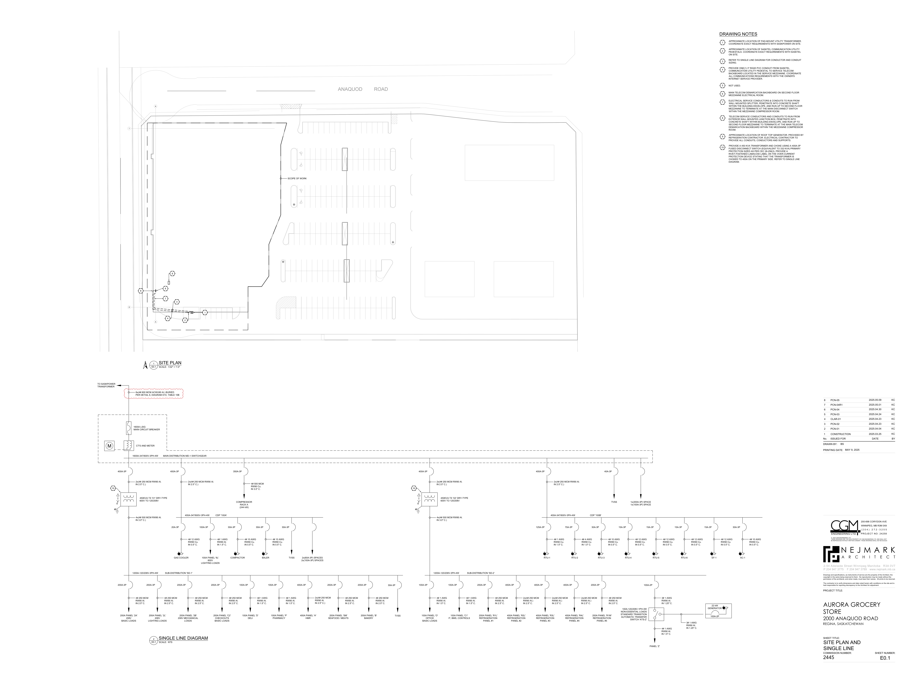

# PCN# 014 - Electrical Service Entrance Conductors

**Source**: `PCN# 014 - Electrical Service Entrance Conductors.pdf`  
**Pages**: 3  
**Extracted**: 2026-01-09 18:31:34

---

## Page 1

PROPOSED CHANGE NOTICE

2445-14

 
No work is to be done before this matter is finalized and a "Change Order" is issued.  This copy to remain with your office.  Do not return.  
Contractor to submit signed letter with price including cost breakdown and change (if any) to construction schedule.  Authority having 
Jurisdiction shall advise of any objections. 
 
 
TO: 
QUOREX CONSTRUCTION SERVICES LTD. 
 
 
 
1630A 8th Avenue,  
 
 
Regina, SK S4R 1E5 
 
 
RE: 
AURORA FOOD STORE 
 
 
2000 ANAQUOD ROAD 
 
 
REGINA, SK 
 
 
Commission No. 2445 
 
 
DATE: 
May 12, 2025 
 
 
PAGES: 
3 (including cover) 
 
 
RE: 
Electrical Service Entrance Conductors 
 
As per Technical Safety Authority of Saskatchewan (TSASK) 
 
1.0 
ELECTRICAL 
 
 
.1 
Refer to attached Electrical PCN #5 dated May 9, 2025 (2 pages). 
 
 
 
 
 
 
 
 
 
 
 
 
 
 
 
 
 
 
 
 
 
 
 
 
         
Distribution: 
Sobeys Inc. – Jeff Craig 
jeff.craig@sobeys.com 
Sobeys Inc. – Shanwen Hsu 
shanwen.hsu@sobeys.com 
Quorex Construction Services Ltd. – Chris Walbaum 
c.walbaum@quorex.ca 
Lavergne Draward & Associates Inc. – Charles Koop 
ckoop@ldaeng.ca 
CGM Engineering – Justin Albo 
justin_albo@cgmeng.ca 
CGM Engineering – Tony Mitousis 
tony_mitousis@cgmeng.ca 
CGM Engineering – Brendan Simpson 
brendan_simpson@cgmeng.ca 
 
 
 
 
 
 
 
Principal 
Kevin Fawley, SAA MRAIC 

## Page 2

 
ELECTRICAL PROPOSED CHANGE NOTICE #5 
 
24-258 
 

Project: 
Aurora Grocery Store 
 
2000 Anaquod Road, Regina, Saskatchewan 
Subject: 
Service Entrance Conductors 
Date: 
2025.05.09 
 

Subject: 
Service Entrance Conductors 
References: 
Electrical Drawing 2/E0.1 – Single Line Diagram. 
 

1. 
Refer to attached drawing 2/E0.1 for revisions to the service entrance conductors. One(1) run of 
600 MCM ACWU90 Al. is added to the already specified five(5) runs of 600 MCM ACWU90 Al. 
service entrance conductors to satisfy the Saskatchewan Authority Having Jurisdiction (TSASK). 

Brendan Simpson, E.I.T. 
- 1 - 

200-698 Corydon Avenue     Winnipeg, Manitoba     R3M 0X9     204-272-3255     www.cgmeng.ca 

## Page 3

TO SASKPOWER
TRANSFORMER

M
CT'S AND METER

10
10

#6

400A-3P

200A-3P

200A PANEL '2A'
208V
BASIC LOADS

8

1

1200A-120/208V-3PH-4W
SUB-DISTRIBUTION 'SD-1'

1600A-347/600V-3PH-4W
MAIN DISTRIBUTION MD-1 SWITCHGEAR

1600A LSIG
MAIN CIRCUIT BREAKER

4# 250 MCM
RW90 Al.
IN 2.5" C.

2x(4# 250 MCM RW90 Al.
IN 2.5" C.)

4x(4# 500 MCM RW90 Al.
IN 3.0" C.)

6x(4# 600 MCM ACWU90 Al.) BURIED
PER DETAIL 6, DIAGRAM D10, TABLE 10B

450KVA TX 'X1' DRY-TYPE
600V TO 120/208V

6
8

N
 SITE PLAN

200A-3P

200A PANEL '2L'
208V
LIGHTING LOADS

SCALE:
E0.1  SINGLE LINE DIAGRAM

SCALE:
E0.1

2

1

A

A

4# 250 MCM
RW90 Al.
IN 2.5" C.

7

4

NTS

1/32" = 1'-0"

400A-3P
350A-3P

20A-3P

8

GAS COOLER

3

200A-3P

200A PANEL '2B'
208V MECHANICAL
LOADS

2

400A-347/600V-3PH-4W
CDP '100A'

4# 12 AWG
RW90 Cu.
IN 0.5" C.

2x(4# 250 MCM RW90 Al.
IN 2.5" C.)

4# 250 MCM
RW90 Al.
IN 2.5" C.

100A-3P

100A PANEL '6L'
600V
LIGHTING LOADS

1

200A-3P

200A PANEL 'C2'
CHECKOUTS
BASIC LOADS

4# 1 AWG
RW90 Al.
IN 1.5" C.

30A-3P

4# 250 MCM
RW90 Al.
IN 2.5" C.

COMPACTOR

COMPRESSOR
RACK A
(244 kW)

100A-3P

100A PANEL 'D'
DELI

4# 10 AWG
RW90 Cu.
IN 0.5" C.

4# 500 MCM
RW90 Cu.
IN 3.0" C.

30A-3P

4# 1 AWG
RW90 Al.
IN 1.5" C.

BALER

100A-3P

100A PANEL 'P'
PHARMACY

4# 10 AWG
RW90 Cu.
IN 0.5" C.

30A-3P

4# 1 AWG
RW90 Al.
IN 1.5" C.

SCOPE OF WORK

TVSS

400A-3P

400A PANEL 'H'
HMR

2x(60A-3P) SPACES
2x(100A-3P) SPACES

2x(4# 250 MCM
RW90 Al.
IN 2.5" C.)

200A-3P

200A PANEL 'SM'
SEAFOOD / MEATS

ANAQUOD
ROAD

4# 250 MCM
RW90 Al.
IN 2.5" C.

200A-3P

200A PANEL 'B'
BAKERY

4# 250 MCM
RW90 Al.
IN 2.5" C.

30A-3P

TVSS

#6

400A-3P

100A-3P

100A PANEL 'O'
OFFICE
BASIC LOADS

1200A-120/208V-3PH-4W
SUB-DISTRIBUTION 'SD-2'

2x(4# 250 MCM RW90 Al.
IN 2.5" C.)

4# 1 AWG
RW90 Al.
IN 1.5" C.

4x(4# 500 MCM RW90 Al.
IN 3.0" C.)

450KVA TX 'X2' DRY-TYPE
600V TO 120/208V

100A-3P

100A PANEL 'C1'
IT, BMS, CONTROLS

4# 1 AWG
RW90 Al.
IN 1.5" C.

200A-3P

200A PANEL 'R1L'
REFRIGERATION
PANEL #1

4# 250 MCM
RW90 Al.
IN 2.5" C.

400A-3P

400A PANEL 'R2L'
REFRIGERATION
PANEL #2

2x(4# 250 MCM
RW90 Al.)
IN 2.5" C.

400A-3P

125A-3P

400A PANEL 'R3L'
REFRIGERATION
PANEL #3

400A-3P

RTU-1

400A-347/600V-3PH-4W
CDP '100B'

2x(4# 250 MCM
RW90 Al.)
IN 2.5" C.

4# 1 AWG
RW90 Cu.
IN 1.5" C.

2x(4# 250 MCM RW90 Al.
IN 2.5" C.)

400A-3P

70A-3P

400A PANEL 'R4L'
REFRIGERATION
PANEL #4

RTU-2

2x(4# 250 MCM
RW90 Al.)
IN 2.5" C.

4# 4 AWG
RW90 Cu.
IN 1.0" C.

200A-3P

30A-3P

200A PANEL 'R1M'
REFRIGERATION
PANEL #5

RTU-3

40A-3P

4# 10 AWG
RW90 Cu.
IN 0.5" C.

4# 250 MCM
RW90 Al.
IN 2.5" C.

TVSS
1x(200A-3P) SPACE
1x(100A-3P) SPACE

15A-3P

100A-120/208V-1PH-3W
NON-ESSENTIAL LOADS
STANDARD TRANSITION
AUTOMATIC TRANSFER
SWITCH 'ATS-Z'

RTU-4

4# 12 AWG
RW90 Cu.
IN 0.5" C.

100A-2P

15A-3P

PANEL 'Z'

RTU-5

4# 1 AWG
RW90 Al.
IN 1.5" C.

3# 1 AWG
RW90 Al.
IN 1.25" C.
22 kW
GENERATOR

4# 12 AWG
RW90 Cu.
IN 0.5" C.

15A-3P

RTU-6

3# 1 AWG
RW90 Al.
IN 1.25" C.

4# 12 AWG
RW90 Cu.
IN 0.5" C.

15A-3P

100A-2P

EF-1

DRAWING NOTES

4# 12 AWG
RW90 Cu.
IN 0.5" C.

10

1

2

3

4

5

6

7

8

9

PROVIDE ONE(1) 3" RIGID PVC CONDUIT FROM SASKTEL
COMMUNCATION UTILITY PEDESTAL TO SERVICE TELECOM
BACKBOARD LOCATED IN THE SERVICE MEZZANINE. COORDINATE
ALL COMMUNICATIONS REQUIREMENTS WITH THE OWNER'S
INTERNET SERVICE PROVIDER.

REFER TO SINGLE LINE DIAGRAM FOR CONDUCTOR AND CONDUIT
SIZING.

ELECTRICAL SERVICE CONDUCTORS & CONDUITS TO RUN FROM
WALL MOUNTED SPLITTER, PENETRATE INTO CONCRETE SHAFT
WITHIN THE BUILDING ENVELOPE, AND RUN UP TO SECOND FLOOR
MEZZANINE TO TERMINATE AT THE MAIN DISCONNECT SWITCH
WITHIN THE MEZZANINE COMPRESSOR ROOM.

TELECOM SERVICE CONDUCTORS AND CONDUITS TO RUN FROM
EXTERIOR WALL MOUNTED JUNCTION BOX, PENETRATE INTO
CONCRETE SHAFT WITHIN BUILDING ENVELOPE, AND RUN UP TO
SECOND FLOOR MEZZANINE TO TERMINATE AT THE MAIN TELECOM
DEMARCATION BACKBOARD WITHIN THE MEZZANINE COMPRESSOR
ROOM.

APPROXIMATE LOCATION OF ROOF TOP GENERATOR. PROVIDED BY
REFRIGERATION CONTRACTOR. ELECTRICAL CONTRACTOR TO
PROVIDE ALL CONDUITS, CONDUCTORS AND SUPPORTS.

PROVIDE A 450 KVA TRANSFORMER AND CHOKE USING A 400A-3P
FUSED DISCONNECT SWITCH (EQUIVALENT TO 332 KVA) PRIMARY
PROTECTION SIZED AS PER CEC 26-256(3). PROVIDE A
RIVET-FASTENED LAMACOID LABEL ON THE OVER-CURRENT
PROTECTION DEVICE STATING THAT THE TRANSFORMER IS
CHOKED TO 400A ON THE PRIMARY SIDE. REFER TO SINGLE LINE
DIAGRAM.

APPROXIMATE LOCATION OF SASKTEL COMMUNICATION UTILITY
PEDESTALS. COORDINATE EXACT REQUIREMENTS WITH SASKTEL
ON SITE.

NOT USED.

MAIN TELECOM DEMARCATION BACKBOARD ON SECOND FLOOR
MEZZANINE ELECTRICAL ROOM.

APPROXIMATE LOCATION OF PAD-MOUNT UTILITY TRANSFORMER.
COORDINATE EXACT REQUIREMENTS WITH SASKPOWER ON SITE.

30A-3P

AC-1

4# 10 AWG
RW90 Cu.
IN 0.5" C.

2-54 Adelaide Street Winnipeg Manit
a
ob
R3A 0V7
 P 204 947 3775
 F 204 947 3789
www.nejmark.mb.ca

AURORA GROCERY
STORE
2000 ANAQUOD ROAD
REGINA, SASKATCHEWAN

PROJECT TITLE:

DRAWN BY:

PRINTING DATE:

No.     ISSUED FOR                                      DATE                   BY

Drawings and specifications, as instruments of service are the property of the Architect, the
copyright in the same being reserved to them.  No reproduction may be made without the
permission of the architects, and when made, must bear their names.  All prints to be returned.

2445

COMMISSION NUMBER:
SHEET NUMBER:

The contractor is to verify dimensions and date noted herein with conditions on the site and is
held responsible for reporting discrepancy to the Architect for adjustment.

SHEET TITLE:

SITE PLAN AND
SINGLE LINE

1

KC
2025.05.01
PCN-04R1
7

KC
2025.04.23
PCN-02
3

KC
2025.04.24
PCN-03
5

KC
2025.05.09
PCN-05
8

KC
2025.04.30
PCN-04
6

KC
2025.04.04
PCN-01
2

KC
2025.04.23
CLAR-01
4

KC
2025.03.25
CONSTRUCTION

© 2024 CGM ENGINEERING LTD.
THESE DRAWINGS ARE THE SOLE PROPERTY OF CGM ENGINEERING LTD. AND SHALL NOT
BE REPRODUCED WITHOUT WRITTEN CONSENT. THESE DRAWINGS SHALL NOT BE SCALED.

ENGINEERING LTD.

BS

N E J M A R K
A
R
C
H
I
T
E
C
T

MAY 9, 2025

PROJECT NO: 24258

( 2 0 4 )  2 7 2 - 3 2 5 5

200-698 CORYDON AVE

WINNIPEG, MB R3M 0X9

E0.1

