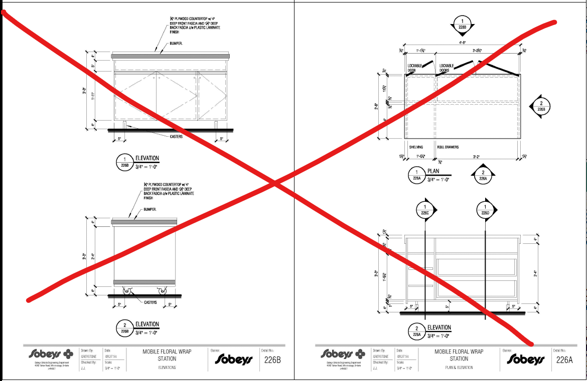
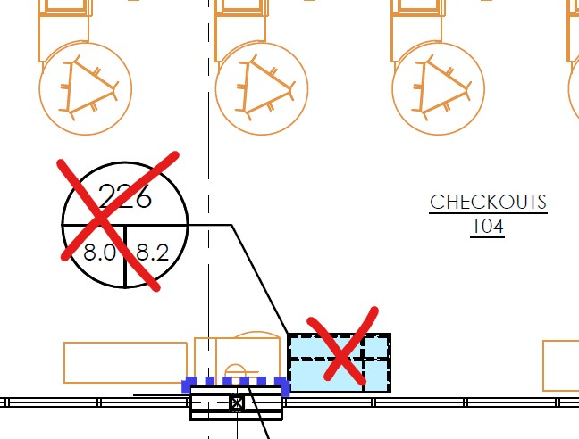

# PCN# 016 - Delete Mobile Floral Wrap Station

**Source**: `PCN# 016 - Delete Mobile Floral Wrap Station.pdf`  
**Pages**: 1  
**Extracted**: 2026-01-09 18:31:38

---

## Page 1

PROPOSED CHANGE NOTICE

2445-16

 
No work is to be done before this matter is finalized and a "Change Order" is issued.  This copy to remain with your office.  Do not return.  
Contractor to submit signed letter with price including cost breakdown and change (if any) to construction schedule.  Authority having 
Jurisdiction shall advise of any objections. 
 
 
TO: 
QUOREX CONSTRUCTION SERVICES LTD. 
 
 
 
1630A 8th Avenue,  
 
 
Regina, SK S4R 1E5 
 
 
RE: 
AURORA FOOD STORE 
 
 
2000 ANAQUOD ROAD 
 
 
REGINA, SK 
 
 
Commission No. 2445 
 
 
DATE: 
May 14, 2025 
 
 
PAGES: 
1 (including cover) 
 
 
RE: 
Delete Mobile Floral Wrap Station 
 
1.0 
ARCHITECTURAL 
 
 
.1 
Delete Mobile Floral Wrap Station millwork scope. Provide credit. 
 
 
Station will be Owner supplied/installed. 
 
 
 
 
.2 
Delete Sobeys Standard Details #226A and #226B from drawing A8.2. 
 
 

 
 
 
 
 
 
 
         
Distribution: 
Sobeys Inc. – Jeff Craig 
jeff.craig@sobeys.com 
Sobeys Inc. – Shanwen Hsu 
shanwen.hsu@sobeys.com 
Quorex Construction Services Ltd. – Chris Walbaum 
c.walbaum@quorex.ca 
Lavergne Draward & Associates Inc. – Charles Koop 
ckoop@ldaeng.ca 
CGM Engineering – Justin Albo 
justin_albo@cgmeng.ca 
CGM Engineering – Tony Mitousis 
tony_mitousis@cgmeng.ca 
CGM Engineering – Brendan Simpson 
brendan_simpson@cgmeng.ca 
 
 
 
 
 
 
 
Principal 
Kevin Fawley, SAA MRAIC 

