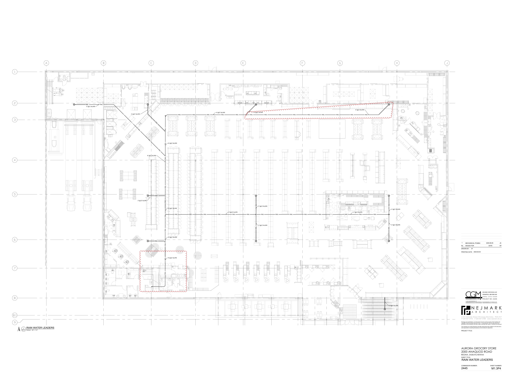

# PCN# 020 - Revise Rain Water Leader Distribution, Slope and Sizes

**Source**: `PCN# 020 - Revise Rain Water Leader Distribution, Slope and Sizes.pdf`  
**Pages**: 3  
**Extracted**: 2026-01-09 18:31:38

---

## Page 1

PROPOSED CHANGE NOTICE 

2445-20 

 
No work is to be done before this matter is finalized and a "Change Order" is issued.  This copy to remain with your office.  Do not return.  
Contractor to submit signed letter with price including cost breakdown and change (if any) to construction schedule.  Authority having 
Jurisdiction shall advise of any objections. 
 
 
TO: 
QUOREX CONSTRUCTION SERVICES LTD. 
 
 
 
1630A 8th Avenue,  
 
 
Regina, SK S4R 1E5 
 
 
RE: 
AURORA FOOD STORE 
 
 
2000 ANAQUOD ROAD 
 
 
REGINA, SK 
 
 
Commission No. 2445 
 
 
DATE: 
June 5, 2025 
 
 
PAGES: 
3 (including cover) 
 
 
RE: 
Revise Rain Water Leader Distribution, Slope and Sizes 
 
 
 
1.0 
MECHANICAL 
 
 
.1 
Refer to attached Mechanical PCN #4, dated June 5, 2025. 
 
 
(1 page text, 1 full size drawing M1.3P4) 
 
 
 
 
 
 
 
 
 
 
 
 
 
 
 
         
Distribution: 
Sobeys Inc. – Jeff Craig 
jeff.craig@sobeys.com 
Sobeys Inc. – Shanwen Hsu 
shanwen.hsu@sobeys.com 
Quorex Construction Services Ltd. – Chris Walbaum 
c.walbaum@quorex.ca 
Lavergne Draward & Associates Inc. – Charles Koop 
ckoop@ldaeng.ca 
CGM Engineering – Justin Albo 
justin_albo@cgmeng.ca 
CGM Engineering – Tony Mitousis 
tony_mitousis@cgmeng.ca 
CGM Engineering – Brendan Simpson 
brendan_simpson@cgmeng.ca 
 
 
 
 
 
 
 
 
Principal 
Kevin Fawley, SAA MRAIC 

## Page 2

 
MECHANICAL PROPOSED CHANGE NOTICE #04 
 
24-258 

Project: 
Aurora Food Store 
 
4801 Optimist Drive, Regina, Saskatchewan  
Subject: 
Revise Rain Water Leader Distribution, Slope and Sizes  
Date: 
2025.06.05 
 

Subject: 
Revise Rain Water Leader Distribution, Slopes and Sizes 
References: 
Mechanical Drawing – M1.3 – Main Floor Plan - Plumbing  
 
 
 

1. 
Revise rain water leader distribution, slope and sizes as shown on mechanical revision drawings 
M1.3P4. The Contractor is to coordinate the final layout with the structure and ductwork on site. 

.1  Delete 3" pipe and provide 4" RWL pipe near GL G.
.2  Modify location of drain pipe running parralel to GL C.

Justin Albo, P.Eng. 
- 1 - 

200-698 Corydon Avenue     Winnipeg, Manitoba     R3M 0X9     204-272-3255     www.cgmeng.ca 

## Page 3

N
 RAIN WATER LEADERS

SCALE:
M1.3

1

1/8" = 1'-0"

STAIRS

#2

GLASS &
ORGANICS
RECYCLE
194

RECEIVING
190

CLEAN-UP
AREA
193

SPRINKLER ROOM
192

RWL
RWL

3" @ 14" SLOPE

STAIRS
#3

DELI
COOLER
121

CHEESE
PREP
123

DEP.
MAN.
113

BAKERY FREEZER
131

STORE MAN.
OFFICE
112

DELI
PREP
120

IT
ROOM
114

BAKERY
PREP
130

LEARN
OFFICE
111

3" @ 14" SLOPE
3" @ 14" SLOPE

FILE
MAN
115

RWL
RWL
RWL

3" @ 14" SLOPE

CASH OFFICE
116

6" @ 18" SLOPE

STAFF
117

BAKERY
COOLER
132

RWL

RWL

RWL

UP
21R

STAIRS
#1

RWL
RWL
RWL
RWL
RWL
RWL
RWL
RWL
RWL
RWL
RWL

FLORAL COOLER
109

UNIVERSAL
WASHROOM
106

8" @ 18" SLOPE

6" @ 18" SLOPE

6" @ 18" SLOPE

8" @ 18" SLOPE

RWL
RWL
RWL
RWL
RWL
RWL
RWL
RWL
RWL
RWL
RWL
RWL
RWL
RWL

JANITOR
107

RWL
RWL
RWL
RWL
RWL
RWL
RWL
RWL
RWL
RWL
RWL
RWL
RWL
RWL

FLORAL PREP
108

WASHROOM
105

DAIRY COOLER
133

4" @ 14" SLOPE

CONSULT
ROOM
141

6" @ 18" SLOPE

SALES
119

PHARMACY PREP
140

WAREHOUSE
191

RWL

RWL

3" @ 14" SLOPE

3" @ 14" SLOPE

CHECKOUTS
104

OUTDOOR SEATING
103A

STORAGE
142

SERVICE
DESK
103

SEATING
101

SELF CHECKOUTS
102

GROCERY FREEZER
154

VESTIBULE
100

4" @ 18" SLOPE

4" @ 18" SLOPE

HMR PREP
181

HMR
180

MEAT/KITCHEN
FREEZER
153

KITCHEN
COOLER
182

RWL

RWL

3" @ 14" SLOPE

3" @ 14" SLOPE

3" @ 14" SLOPE

MEAT COOLER
152

MEAT PREP
151

BUTCHER SHOP
150

SEAFOOD
PREP
137

PRODUCE
PREP
170

PRODUCE
COOLER
171

SEAFOOD
COOLER
162

2-54 Adelaide Street Winnipeg Manit
a
ob
R3A 0V7
 P 204 947 3775
 F 204 947 3789
www.nejmark.mb.ca

AURORA GROCERY STORE
2000 ANAQUOD ROAD
REGINA, SASKATCHEWAN

PROJECT TITLE:

DRAWN BY:

PRINTING DATE:

No.     ISSUED FOR                                      DATE                   BY

SHEET TITLE:

COMMISSION NUMBER:
SHEET NUMBER:

Drawings and specifications, as instruments of service are the property of the Architect, the
copyright in the same being reserved to them.  No reproduction may be made without the
permission of the architects, and when made, must bear their names.  All prints to be returned.

The contractor is to verify dimensions and date noted herein with conditions on the site and is
held responsible for reporting discrepancy to the Architect for adjustment.

2445

RAIN WATER LEADERS

1

JA
2025.06.05
MECHANICAL PCN#04

© 2024 CGM ENGINEERING LTD.
THESE DRAWINGS ARE THE SOLE PROPERTY OF CGM ENGINEERING LTD. AND SHALL NOT
BE REPRODUCED WITHOUT WRITTEN CONSENT. THESE DRAWINGS SHALL NOT BE SCALED.

ENGINEERING LTD.

JA

N E J M A R K
A
R
C
H
I
T
E
C
T

2025.06.05

PROJECT NO: 24258

( 2 0 4 )  2 7 2 - 3 2 5 5

200-698 CORYDON AVE

WINNIPEG, MB R3M 0X9

M1.3P4

