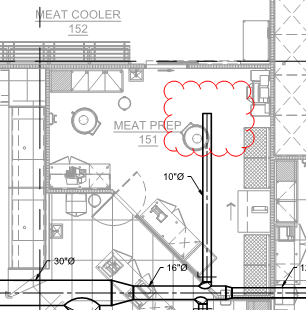

# PCN# 022R1 - Delete Meat Prep Supply Diffuser

**Source**: `PCN# 022R1 - Delete Meat Prep Supply Diffuser.pdf`  
**Pages**: 2  
**Extracted**: 2026-01-09 18:31:39

---

## Page 1

PROPOSED CHANGE NOTICE 

2445-22R1 

 
No work is to be done before this matter is finalized and a "Change Order" is issued.  This copy to remain with your office.  Do not return.  
Contractor to submit signed letter with price including cost breakdown and change (if any) to construction schedule.  Authority having 
Jurisdiction shall advise of any objections. 
 
 
TO: 
QUOREX CONSTRUCTION SERVICES LTD. 
 
 
 
1630A 8th Avenue,  
 
 
Regina, SK S4R 1E5 
 
 
RE: 
AURORA FOOD STORE 
 
 
2000 ANAQUOD ROAD 
 
 
REGINA, SK 
 
 
Commission No. 2445 
 
 
DATE: 
July 28, 2025 
 
 
PAGES: 
2 (including cover) 
 
 
RE: 
Delete Meat Prep Supply Diffuser 
 
1.0 
MECHANICAL 
 
 
.1 
Refer to attached Mechanical PCN #02R1, dated July 25, 2025 (1 page text). 
 
 
 
 
 
 
 
 
 
 
 
 
 
 
 
 
         
Distribution: 
Sobeys Inc. – Jeff Craig 
jeff.craig@sobeys.com 
Sobeys Inc. – Shanwen Hsu 
shanwen.hsu@sobeys.com 
Quorex Construction Services Ltd. – Chris Walbaum 
c.walbaum@quorex.ca 
Quorex Construction Services Ltd. – Dustin Williamson 
d.williamson@quorex.ca 
Lavergne Draward & Associates Inc. – Charles Koop 
ckoop@ldaeng.ca 
CGM Engineering – Justin Albo 
justin_albo@cgmeng.ca 
CGM Engineering – Tony Mitousis 
tony_mitousis@cgmeng.ca 
CGM Engineering – Brendan Simpson 
brendan_simpson@cgmeng.ca 
 
 
 
 
 
 
 
 
 
Principal 
Kevin Fawley, SAA MRAIC 
 

## Page 2

 
MECHANICAL PROPOSED CHANGE NOTICE #02R1 
 
24-258 

Project: 
Aurora Food Store 
 
4801 Optimist Drive, Regina, Saskatchewan  
Subject: 
Delete Meat Prep Supply Diffuser  
Date: 
2025.07.25 
 

Subject: 
Delete Meat Prep Supply Diffuser 
References: 
Mechanical Drawing – M2.1 – Main Floor Plan - HVAC  
 
 
1. 
Delete the supply diffuser above the Meat Prep area. Cap the duct as shown in the image below. 
Provide credit for the supply diffuser (S2).  Do not penetrate through the insulated panel. 

Justin Albo, P.Eng. 
- 1 - 

200-698 Corydon Avenue     Winnipeg, Manitoba     R3M 0X9     204-272-3255     www.cgmeng.ca 

