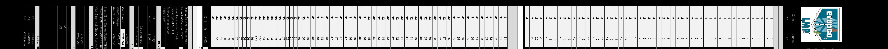
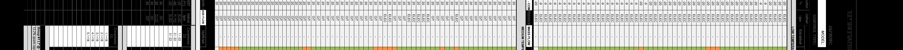
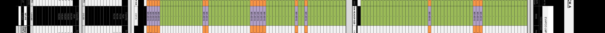
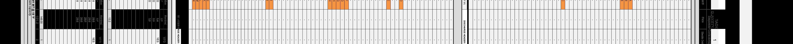
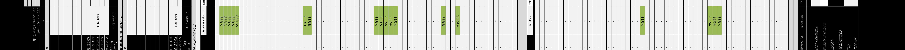
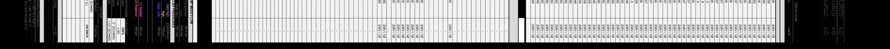
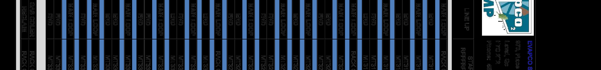
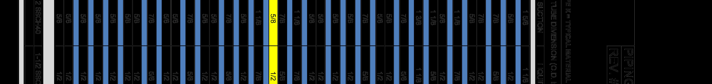
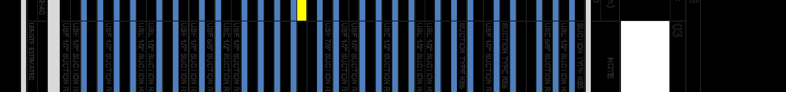

# PCN# 023 - Butcher Shop Refrigeration

**Source**: `PCN# 023 - Butcher Shop Refrigeration.pdf`  
**Pages**: 7  
**Extracted**: 2026-01-09 18:31:39

---

## Page 1

PROPOSED CHANGE NOTICE 

2445-23 

 
No work is to be done before this matter is finalized and a "Change Order" is issued.  This copy to remain with your office.  Do not return.  
Contractor to submit signed letter with price including cost breakdown and change (if any) to construction schedule.  Authority having 
Jurisdiction shall advise of any objections. 
 
 
TO: 
QUOREX CONSTRUCTION SERVICES LTD. 
 
 
 
1630A 8th Avenue,  
 
 
Regina, SK S4R 1E5 
 
 
RE: 
AURORA FOOD STORE 
 
 
2000 ANAQUOD ROAD 
 
 
REGINA, SK 
 
 
Commission No. 2445 
 
 
DATE: 
July 4, 2025 
 
 
PAGES: 
7 (including cover) 
 
 
RE: 
Butcher Shop Refrigeration 
 
 
 
 
1.0 
REFRIGERATION 
 
 
.1 
Replace drawings with the attached R03 drawings dated July 3, 2025 (6 pages). 
 
  
.2 
8" PVC pipe to be used for the CO2 pipe to go under slab. 
 
 
.3 
Piping can be downsized to 5/8" suction and 1/2" liquid for the branch feeding cases 40,39  
 
 
& 37. 
 
 
 
 
 
 
 
 
 
 
         
Distribution: 
Sobeys Inc. – Jeff Craig 
jeff.craig@sobeys.com 
Sobeys Inc. – Shanwen Hsu 
shanwen.hsu@sobeys.com 
Quorex Construction Services Ltd. – Chris Walbaum 
c.walbaum@quorex.ca 
Lavergne Draward & Associates Inc. – Charles Koop 
ckoop@ldaeng.ca 
CGM Engineering – Justin Albo 
justin_albo@cgmeng.ca 
CGM Engineering – Tony Mitousis 
tony_mitousis@cgmeng.ca 
CGM Engineering – Brendan Simpson 
brendan_simpson@cgmeng.ca 
 
 
 
 
 
 
 
 
 
Principal 
Kevin Fawley, SAA MRAIC 

## Page 2

REVISION R00
INITIAL RELEASE

REVISION 02
PIT LOCATION REVISED TO MATCH ARCHITECTURAL PLANS A2.0

REVISION 03
PREP AREA PITS ADDITION

REVISION 04
PREP AREA PITS DELETED / REPLACED WITH PVC PIPE UNDER SLAB
SCHEDULE UPDATED TO LATEST VERSION

REVISION 05

REVISION 06

REVISION 01
LAYOUT REVISED IN ACCORDANCE WITH COLUMN LAYOUT

EVAPCO SYSTEMS LMP

MANUFACTURER OF MODULAR SYSTEMS

REVISION TABLE

SHEET NUMBER
SHEET TITLE

P4
PROPOSED REFRIGERATION MT PIPING LAYOUT

P2
PROPOSED REFRIGERATION FLOOR PLAN

P3
PROPOSED REFRIGERATION LT PIPING LAYOUT

P5
PIPING LAYOUT

P1
REFRIGERATION SCHEDULE

COVER SHEET

PROJET DRAWING LIST

MANUFACTURER OF MODULAR SYSTEMS

NOTE :

PROJECT :

DATE :

LOCATION :

SHEET :

CLIENT NAME :

THE COPYRIGHT TO ALL
DESIGN AND DRAWINGS
ARE THE PROPERTY OF
LMP SYSTEMS.
REPRODUCTION OR USE
FOR ANY PURPOSE OTHER
THAN THAT AUTHORIZED
BY LMP SYSTEMS.

JOB NUMBER :

AURORA

SOBEYS

2409030

2025-07-03

REGINA, SK

SOBEYS

EVAPCO SYSTEMS
LMP

970, PLACE PAUL-KANE
LAVAL, QC H7C 2T2
TEL.:450.629.9864
design@evapcolmp.ca

REVISIONS

COVER PAGE

NO.
DATE

01
02
03
04
05
06
07
08
09
10

00

2024-10-16
2025-02-04
2025-06-25
2025-06-30
2025-07-03

## Page 3

MANUFACTURER OF MODULAR SYSTEMS

NOTE :

PROJECT :

DATE :

LOCATION :

SHEET :

CLIENT NAME :

THE COPYRIGHT TO ALL
DESIGN AND DRAWINGS
ARE THE PROPERTY OF
LMP SYSTEMS.
REPRODUCTION OR USE
FOR ANY PURPOSE OTHER
THAN THAT AUTHORIZED
BY LMP SYSTEMS.

JOB NUMBER :

AURORA

SOBEYS

2409030

2025-07-03

REGINA, SK

SOBEYS

EVAPCO SYSTEMS
LMP

970, PLACE PAUL-KANE
LAVAL, QC H7C 2T2
TEL.:450.629.9864
design@evapcolmp.ca

REVISIONS

REFRIGERATION SCHEDULE

NO.
DATE

01
02
03
04
05
06
07
08
09
10

00

2024-10-16
2025-02-04
2025-06-30
2025-07-03

P1

## Page 4

61

RACK "A"-DUAL TEMP
210"X64"X77"

DIGITAL TV

RACK "A"-DUAL TEMP
210"X64"X77"

DN
19R

DN

50" DIGITAL TV-WM

58

11

2

HM
50" TV - WM

52

52

SPIRAL MIXER

WATER FILTER

53

FLOOR SCALE

50" DIGITAL TV-WM

80QT. MIXER

ROUNDER

SHEETER

53

51

54

54

POT WASHER

51

54

22"BASE

HM

HM
RL5D

HM

HM

RL5D

RL4D

RL5D

62

RL3D

UP
19R

10

36"Lx72"H

13

13

12

12

14'-7"

16

15

15

14

14
19

2

59

9
9

RL5D
HM
RL4D
HM
RL3D
HM

RL5D
HM
RL5D
HM

IDD5SU-8
HM

RL3D

9

9

16

55
55

HM

RL5D
HM
RL4D
HM
RL3D
HM

RL5D
HM
RL5D
HM

36"Lx72"H
36"Lx72"H

18

18

17

17

16

8
8

37'-0"

50

19

19

20

20

8

8

RL5D
HM
RL4D
HM

RL5D
HM
RL5D
HM
RL5D
HM

IDD5SU-8
HM

RL3D

20

HM

HM
IDD5SU-12

HM

HM
IDD5SU-12

HM

HM

IDD5SU-12

IDD5SU-12

IDD5SU-12

36"Lx72"H

6CAYUGA
FLORAL TABLES

36"Lx72"H

7
7

56

56

56

57

57

7

7

22"BASE
22"BASE
22"BASE
22"BASE
22"BASE
22"BASE
22"BASE
22"BASE
22"BASE
22"BASE

22"BASE
22"BASE
22"BASE
22"BASE

14"BASE

14"BASE

50" TV - WM

WG

PP

14"BASE

14"BASE

PP

WG

 U/C FRIDGE

14"BASE

14"BASE

PP

WG

COMP. EQ.

14"BASE

14"BASE

PP

WG

IRON
MOUNTAIN
SHREDDING

BOTTLES &
MIXER
DRAWER
24" FRIDGE

BIN

49

14"BASE

14"BASE

SS COUNTERTOP

UPPER CABINET

PP

WG

2

22"BASE
22"BASE
22"BASE

EYEWASH
STATION

48
48

14"BASE
14"BASE

14"BASE

46
46
48

48

14"BASE

14"BASE

SEATING AREA
150 SHOPPING
CARTS

22"BASE
22"BASE

41
41
41
42
42

14'-4"

DP
T011-4

10'-0" SLIDER

47
47
47

MOTORIZED
SHOPPING CART

50" TV -  WM

25'-5"

10'Lx10'W FLOOR MAT

6
5

14'-0" SLIDER

4
4

R

14"BASE

14"BASE

10'-0" SLIDER

50" TV -  WM
50" TV -  WM

4

4

150(25x6) CARTS

46

46

14'-4"

75" TV - WALL MT

14"BASE

3
3

7'-7"

BABY SIGN
SUPPLIED &
INSTALLED BY
TC C/W
MOUNTING
HARDWARE.
SUSPENDED @
9'-0" A.F.F.

18'-7"

31
31
32
32

11'-9"

2

3

3

50" TV -  WM

60

HM

HM

36"Lx72"H

RL4D

RL5D

47

2

14'-4"

40

40
43

2

2

2

1

35

39

3
4

35

1

1

31'-1"

44

39

35

1

50" TV -WM

37
38

37

35

HOSHIZAKI F-1002MAJ ICE FLAKER c/w FOLLETT
ICE STORAGE
& 2 TRANSPORT BINS (FOLLETT ITS2250SG-60
FOR CEILING HEIGHTS 10'-6"AND ABOVE;
ITS1350SG-60 UNDER )

50" TV - WM

28'-8"

32'-0"

2

33

13'-6"

14'-1"

33

34

34

36

45

MANUFACTURER OF MODULAR SYSTEMS

NOTE :

PROJECT :

DATE :

LOCATION :

SHEET :

CLIENT NAME :

THE COPYRIGHT TO ALL
DESIGN AND DRAWINGS
ARE THE PROPERTY OF
LMP SYSTEMS.
REPRODUCTION OR USE
FOR ANY PURPOSE OTHER
THAN THAT AUTHORIZED
BY LMP SYSTEMS.

JOB NUMBER :

AURORA

SOBEYS

2409030

2025-07-03

REGINA, SK

SOBEYS

EVAPCO SYSTEMS
LMP

970, PLACE PAUL-KANE
LAVAL, QC H7C 2T2
TEL.:450.629.9864
design@evapcolmp.ca

REVISIONS

PROPOSED REFRIGERATION FLOOR PLAN

NO.
DATE

01
02
03
04
05
06
07
08
09
10

00

2024-10-16
2025-02-04
2025-06-25
2025-06-30
2025-07-03

P2

## Page 5

61

RACK "A"-DUAL TEMP
210"X64"X77"

DIGITAL TV

RACK "A"-DUAL TEMP
210"X64"X77"

DN
19R

DN

50" DIGITAL TV-WM

58

LT2-A

11

2

HM
50" TV - WM

52

52

SPIRAL MIXER

WATER FILTER

53

FLOOR SCALE

50" DIGITAL TV-WM

80QT. MIXER

LT2-D

LT2-B

ROUNDER

SHEETER

LEGEND
BRANCH
RISER
BRANCH & RISER

53

51

54

54

POT WASHER

51

54

22"BASE

HM

HM
RL5D

HM

HM

RL5D

RL4D

RL5D

62

RL3D

UP
19R

LT2-C

10

36"Lx72"H

13

13

12

12

14'-7"

16

15

15

14

14
19

2

59

9
9

RL5D
HM
RL4D
HM
RL3D
HM

RL5D
HM
RL5D
HM

IDD5SU-8
HM

RL3D

9

9

55
55

16

HM

RL5D
HM
RL4D
HM
RL3D
HM

RL5D
HM
RL5D
HM

36"Lx72"H
36"Lx72"H

18

18

17

17

16

37'-0"

8
8

50

19

19

20

20

8

8

RL5D
HM
RL4D
HM

RL5D
HM
RL5D
HM
RL5D
HM

IDD5SU-8
HM

RL3D

20

HM

HM
IDD5SU-12

HM

HM
IDD5SU-12

HM

HM

IDD5SU-12

IDD5SU-12

IDD5SU-12

36"Lx72"H

6CAYUGA
FLORAL TABLES

36"Lx72"H

7
7

56

56

56

57

57

7

7

22"BASE
22"BASE
22"BASE
22"BASE
22"BASE
22"BASE
22"BASE
22"BASE
22"BASE
22"BASE

22"BASE
22"BASE
22"BASE
22"BASE

14"BASE

14"BASE

50" TV - WM

WG

PP

14"BASE

14"BASE

PP

WG

 U/C FRIDGE

14"BASE

14"BASE

PP

WG

COMP. EQ.

14"BASE

14"BASE

PP

WG

IRON
MOUNTAIN
SHREDDING

BOTTLES &
MIXER
DRAWER
24" FRIDGE

BIN

49

14"BASE

14"BASE

SS COUNTERTOP

UPPER CABINET

PP

WG

2

22"BASE
22"BASE
22"BASE

EYEWASH
STATION

48
48

14"BASE
14"BASE

14"BASE

46
46
48

48

14"BASE

14"BASE

SEATING AREA
150 SHOPPING
CARTS

22"BASE
22"BASE

41
41
41
42
42

14'-4"

DP
T011-4

10'-0" SLIDER

47
47
47

MOTORIZED
SHOPPING CART

50" TV -  WM

25'-5"

10'Lx10'W FLOOR MAT

6
5

14'-0" SLIDER

4
4

R

14"BASE

14"BASE

10'-0" SLIDER

LT1-A

50" TV -  WM
50" TV -  WM

4

4

150(25x6) CARTS

46

46

14'-4"

75" TV - WALL MT

LT1-C

14"BASE

3
3

7'-7"

BABY SIGN
SUPPLIED &
INSTALLED BY
TC C/W
MOUNTING
HARDWARE.
SUSPENDED @
9'-0" A.F.F.

18'-7"

31
31
32
32

11'-9"

2

3

3

50" TV -  WM

60

HM

HM

36"Lx72"H

RL4D

RL5D

47

2

14'-4"

40

40
43

2

2

LT1-B

2

1

35

39

3
4

35

1

1

31'-1"

44

39

35

1

50" TV -WM

37
38

37

FINAL PIPING PATH
VALIDATION / COORDINATION
TO BE DONE BY REF.
CONTRACTOR

NOT TO BE USED FOR
CONSTRUCTION

SCHEMATIC FOR
COORDINAITON ONLY

SCALE: NONE

ADDITIONAL INFORMATION :

35

HOSHIZAKI F-1002MAJ ICE FLAKER c/w FOLLETT
ICE STORAGE
& 2 TRANSPORT BINS (FOLLETT ITS2250SG-60
FOR CEILING HEIGHTS 10'-6"AND ABOVE;
ITS1350SG-60 UNDER )

50" TV - WM

28'-8"

32'-0"

2

33

13'-6"

14'-1"

33

34

34

36

45

MANUFACTURER OF MODULAR SYSTEMS

NOTE :

PROJECT :

DATE :

LOCATION :

SHEET :

CLIENT NAME :

THE COPYRIGHT TO ALL
DESIGN AND DRAWINGS
ARE THE PROPERTY OF
LMP SYSTEMS.
REPRODUCTION OR USE
FOR ANY PURPOSE OTHER
THAN THAT AUTHORIZED
BY LMP SYSTEMS.

JOB NUMBER :

AURORA

SOBEYS

2409030

2025-07-03

REGINA, SK

SOBEYS

EVAPCO SYSTEMS
LMP

970, PLACE PAUL-KANE
LAVAL, QC H7C 2T2
TEL.:450.629.9864
design@evapcolmp.ca

REVISIONS

PROPOSED REFRIGERATION LT PIPING LAYOUT

NO.
DATE

01
02
03
04
05
06
07
08
09
10

00

2024-10-16
2025-02-04
2025-06-25
2025-06-30
2025-07-03

P3

## Page 6

61

RACK "A"-DUAL TEMP
210"X64"X77"

DIGITAL TV

RACK "A"-DUAL TEMP
210"X64"X77"

MT33-F

MT33-E

MT33-A

DN
19R

DN

50" DIGITAL TV-WM

58

11

2

HM
50" TV - WM

52

52

SPIRAL MIXER

WATER FILTER

53

FLOOR SCALE

50" DIGITAL TV-WM

80QT. MIXER

MT33-D

ROUNDER

LEGEND
BRANCH
RISER
BRANCH & RISER

SHEETER

53

51

54

54

POT WASHER

51

54

22"BASE

HM

HM
RL5D

HM

HM

RL5D

RL4D

RL5D

62

RL3D

UP
19R

10

36"Lx72"H

13

13

12

12

14'-7"

16

15

15

14

14
19

2

59

9
9

MT33-C

MT33-B

RL5D
HM
RL4D
HM
RL3D
HM

RL5D
HM
RL5D
HM

IDD5SU-8
HM

RL3D

9

9

55
55

16

HM

RL5D
HM
RL4D
HM
RL3D
HM

RL5D
HM
RL5D
HM

36"Lx72"H
36"Lx72"H

18

18

17

17

16

8
8

37'-0"

50

19

19

20

20

8

8

RL5D
HM
RL4D
HM

RL5D
HM
RL5D
HM
RL5D
HM

IDD5SU-8
HM

RL3D

20

HM

HM
IDD5SU-12

HM

HM
IDD5SU-12

HM

HM

IDD5SU-12

IDD5SU-12

IDD5SU-12

36"Lx72"H

6CAYUGA
FLORAL TABLES

36"Lx72"H

7
7

56

56

56

57

57

7

7

22"BASE
22"BASE
22"BASE
22"BASE
22"BASE
22"BASE
22"BASE
22"BASE
22"BASE
22"BASE

22"BASE
22"BASE
22"BASE
22"BASE

14"BASE

14"BASE

50" TV - WM

WG

PP

14"BASE

14"BASE

PP

WG

 U/C FRIDGE

14"BASE

14"BASE

PP

WG

COMP. EQ.

14"BASE

14"BASE

PP

WG

IRON
MOUNTAIN
SHREDDING

BOTTLES &
MIXER
DRAWER
24" FRIDGE

BIN

49

14"BASE

14"BASE

SS COUNTERTOP

UPPER CABINET

PP

WG

2

22"BASE
22"BASE
22"BASE

EYEWASH
STATION

48
48

14"BASE
14"BASE

14"BASE

46
46
48

48

14"BASE

14"BASE

SEATING AREA
150 SHOPPING
CARTS

22"BASE
22"BASE

41
41
41
42
42

14'-4"

DP
T011-4

10'-0" SLIDER

47
47
47

MOTORIZED
SHOPPING CART

50" TV -  WM

25'-5"

10'Lx10'W FLOOR MAT

6
5

14'-0" SLIDER

4
4

R

14"BASE

14"BASE

10'-0" SLIDER

50" TV -  WM
50" TV -  WM

4

4

150(25x6) CARTS

46

46

MT31-A

14'-4"

75" TV - WALL MT

14"BASE

3
3

7'-7"

BABY SIGN
SUPPLIED &
INSTALLED BY
TC C/W
MOUNTING
HARDWARE.
SUSPENDED @
9'-0" A.F.F.

18'-7"

31
31
32
32

11'-9"

3

3

MT31-B

50" TV -  WM

60

HM

HM

36"Lx72"H

RL4D

RL5D

2

47

2

14'-4"

40

40
43

2

2

2

1

35

39

3
4

35

1

1

31'-1"

44

MT32-A

MT32-E

39

35

1

50" TV -WM

37
38

37

FINAL PIPING PATH
VALIDATION / COORDINATION
TO BE DONE BY REF.
CONTRACTOR

NOT TO BE USED FOR
CONSTRUCTION

SCHEMATIC FOR
COORDINAITON ONLY

SCALE: NONE

ADDITIONAL INFORMATION :

35

HOSHIZAKI F-1002MAJ ICE FLAKER c/w FOLLETT
ICE STORAGE
& 2 TRANSPORT BINS (FOLLETT ITS2250SG-60
FOR CEILING HEIGHTS 10'-6"AND ABOVE;
ITS1350SG-60 UNDER )

50" TV - WM

28'-8"

32'-0"

2

33

MT32-B

MT32-C

13'-6"

14'-1"

33

34

34

36

45

MT32-D

MT31-C

MANUFACTURER OF MODULAR SYSTEMS

NOTE :

PROJECT :

DATE :

LOCATION :

SHEET :

CLIENT NAME :

THE COPYRIGHT TO ALL
DESIGN AND DRAWINGS
ARE THE PROPERTY OF
LMP SYSTEMS.
REPRODUCTION OR USE
FOR ANY PURPOSE OTHER
THAN THAT AUTHORIZED
BY LMP SYSTEMS.

JOB NUMBER :

AURORA

SOBEYS

2409030

2025-07-03

REGINA, SK

SOBEYS

EVAPCO SYSTEMS
LMP

970, PLACE PAUL-KANE
LAVAL, QC H7C 2T2
TEL.:450.629.9864
design@evapcolmp.ca

REVISIONS

PROPOSED REFRIGERATION MT PIPING LAYOUT

NO.
DATE

01
02
03
04
05
06
07
08
09
10

00

2024-10-16
2025-02-04
2025-06-25
2025-06-30
2025-07-03

P4

## Page 7

IT IS THE RESPONSIBILITY OF THE REFRIGERATION
CONTRACTOR TO VALIDATE PIPING, PIPING ACCESS
PATHS. HE CAN MODIFY, AS NEEDED, ACCORDING TO
WORKSITE CONDITIONS.

NOTE:

MANUFACTURER OF MODULAR SYSTEMS

NOTE :

PROJECT :

DATE :

LOCATION :

SHEET :

CLIENT NAME :

THE COPYRIGHT TO ALL
DESIGN AND DRAWINGS
ARE THE PROPERTY OF
LMP SYSTEMS.
REPRODUCTION OR USE
FOR ANY PURPOSE OTHER
THAN THAT AUTHORIZED
BY LMP SYSTEMS.

JOB NUMBER :

AURORA

SOBEYS

2409030

2025-07-03

REGINA, SK

SOBEYS

EVAPCO SYSTEMS
LMP

970, PLACE PAUL-KANE
LAVAL, QC H7C 2T2
TEL.:450.629.9864
design@evapcolmp.ca

REVISIONS

PIPING LAYOUT

NO.
DATE

01
02
03
04
05
06
07
08
09
10

00

2024-10-16
2025-02-04
2025-06-25
2025-06-30
2025-07-03

P5

