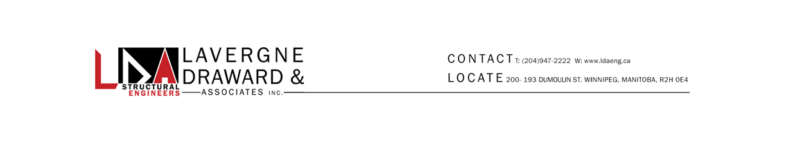
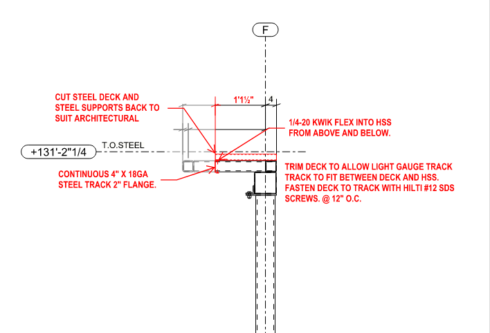
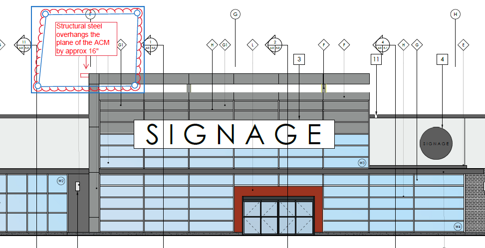
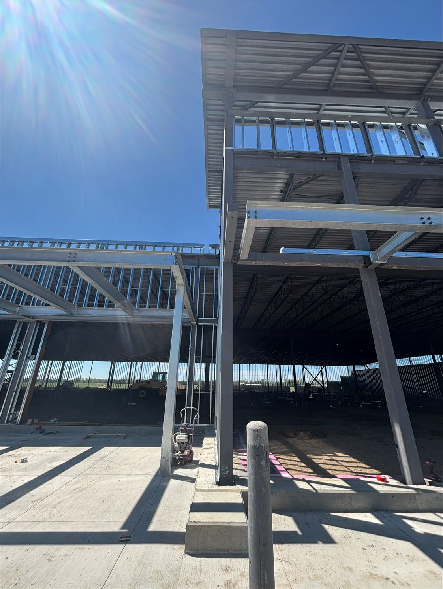
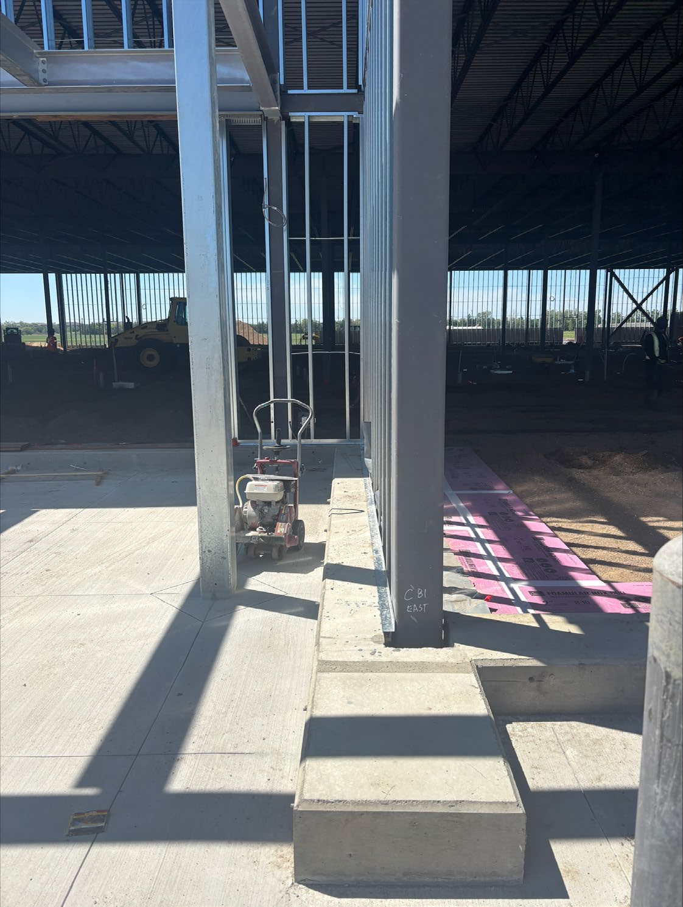
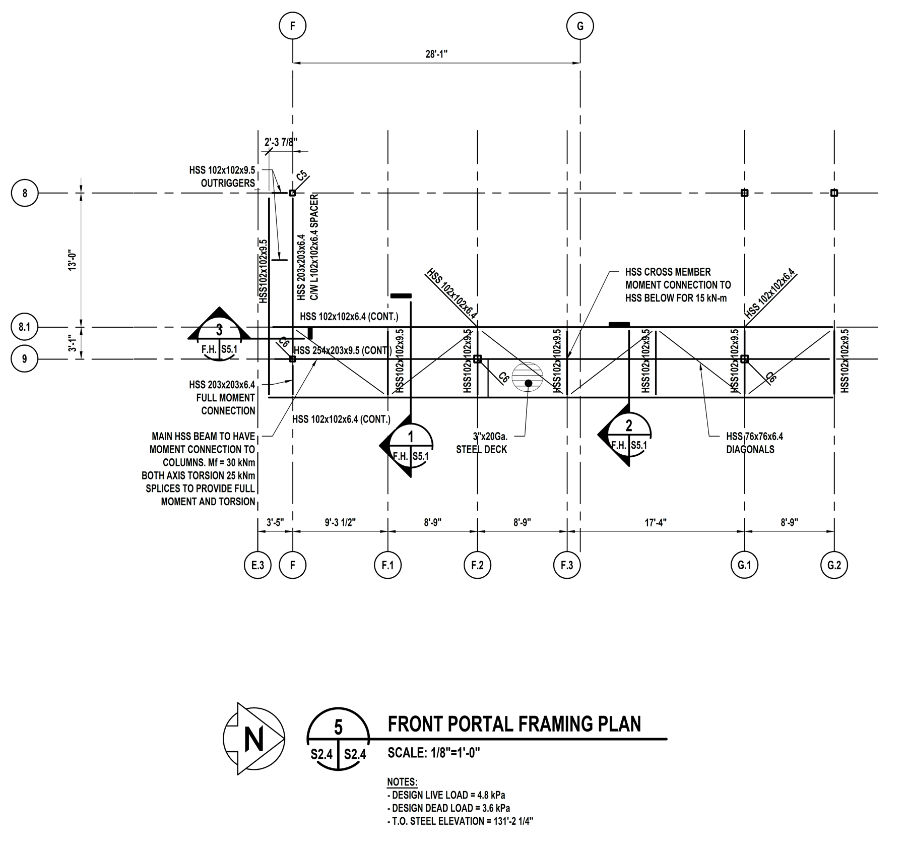
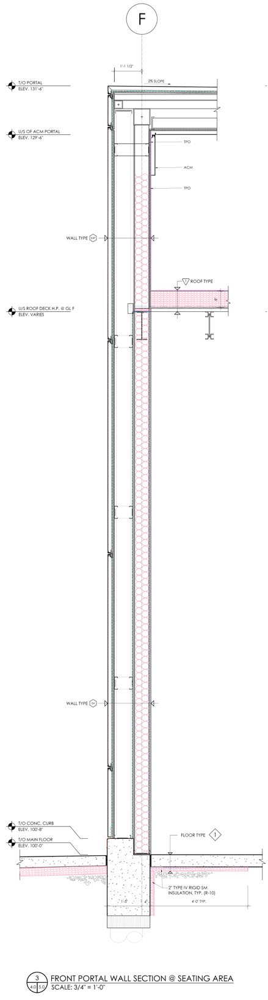

# PCN# 024 - Canopy Overhang

**Source**: `PCN# 024 - Canopy Overhang.pdf`  
**Pages**: 5  
**Extracted**: 2026-01-09 18:31:43

---

## Page 1

PROPOSED CHANGE NOTICE 

2445-24 

No work is to be done before this matter is finalized and a "Change Order" is issued.  This copy to remain with your office.  Do not return. 
Contractor to submit signed letter with price including cost breakdown and change (if any) to construction schedule.  Authority having 
Jurisdiction shall advise of any objections. 

TO: 

QUOREX CONSTRUCTION SERVICES LTD. 
1630A 8th Avenue,  
Regina, SK S4R 1E5 

RE: 

AURORA FOOD STORE 
2000 ANAQUOD ROAD 
REGINA, SK 
Commission No. 2445 

July 17, 2025 

DATE: 

PAGES: 

5 (including cover) 

RE: 

Canopy Overhang 

1.0 
STRUCTURAL 

.1 
Refer to attached Structural PCN S1, dated July 11, 2025. 
(4 page text) 

Distribution: 
Sobeys Inc. – Jeff Craig 
jeff.craig@sobeys.com 
Sobeys Inc. – Shanwen Hsu 
shanwen.hsu@sobeys.com 
Quorex Construction Services Ltd. – Chris Walbaum 
c.walbaum@quorex.ca
Lavergne Draward & Associates Inc. – Charles Koop 
ckoop@ldaeng.ca 
CGM Engineering – Justin Albo 
justin_albo@cgmeng.ca 
CGM Engineering – Tony Mitousis 
tony_mitousis@cgmeng.ca 
CGM Engineering – Brendan Simpson 
brendan_simpson@cgmeng.ca 

Principal 
Kevin Fawley, SAA MRAIC 

## Page 2

 
 
Project Name: 
Aurora Food Store  
 
Contractor:  
Quorex 
 
Issued Herewith 
 
 
Drawings:  
n/a 
Details: 
n/a 
Schedules: 
n/a 
Dated: 
n/a 
 
Proposed Change Notice 
Pursuant to the conditions of the Present Contract, the following items are proposed changes to 
the work for the above project.  Submit cost of changes, including all sub-contract quotations, as 
additions or deductions to the Contract Price. Show a breakdown of cost for all labour, material, 
equipment and services required to complete the work described. No work shall proceed until 
formal approval is provided for the work. 
 
Project No.: 
24739 
 
 
 
Date: July 11, 2025 
 
Item/Reference 
Instigation and Description 

 
Item # 1   
RTU Weights 
Instigation: 
Design Continuation 
Reference:  
RFI #038 

High Parapet Overhang

a) 
Steel overhang to be cut back to suit architectural details. 
b) 
Repair steel as per detail below: 

 
 
 
 
  
Page 1 of 1 
PCN # S1 

## Page 3

REQUEST FOR        
INFORMATION SHEET 

Phone:  (306) 761-2222 
Fax:  (306) 761-2300 

1630A 8th Ave 
Regina, SK     S4R 1E5 
 
Date:  July 9, 2025 
 
To:  Nejmark Architect 
          
Attention:   Kevin Fawley 
                    
 
Project: 
Aurora Food Store 
 
Originator: 
Quorex Construction 
Project #:   
2096 

Spec Section: 
N/A 
Query Number: 
THRITY-EIGHT 

 
 
Drawings # 
A4.0/1, S2.4/5; A5.0/3 

ISSUE REQUIRING RESPONSE: 
 
1) The very top cap of the canopy overhangs to the south too far. It overhangs the outside sheathing of 
the ACM build out by approx. 16”.  On drawing S2.4 detail 5, the front portal framing detail shows the 
overhang is 3’-5” past grid line F.  On drawing A5.0 section 3, the outside of the steel stud wall is shown 
to be 1’-1 ½” of grid line F.  How are we to proceed?    
 

## Page 4

## Page 5

 
Answer Required By:  _______   _____ __ASAP_                                          __ 

RESOLUTION TO QUERY: 
 
 
 
 
 
 
 
 
 
 
C.O. Required: 
Yes: __________ 
No: __________ 
C.O. No: 
 
Date: 
 
Resolution By: 
 

Overhang to be cut back to suit architectural.
Charles Koop P.Eng. (20250714)

 
CC: __Site________________________________  

