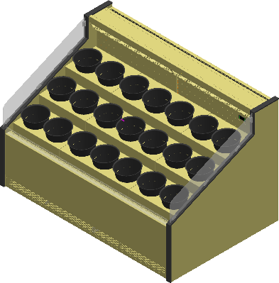
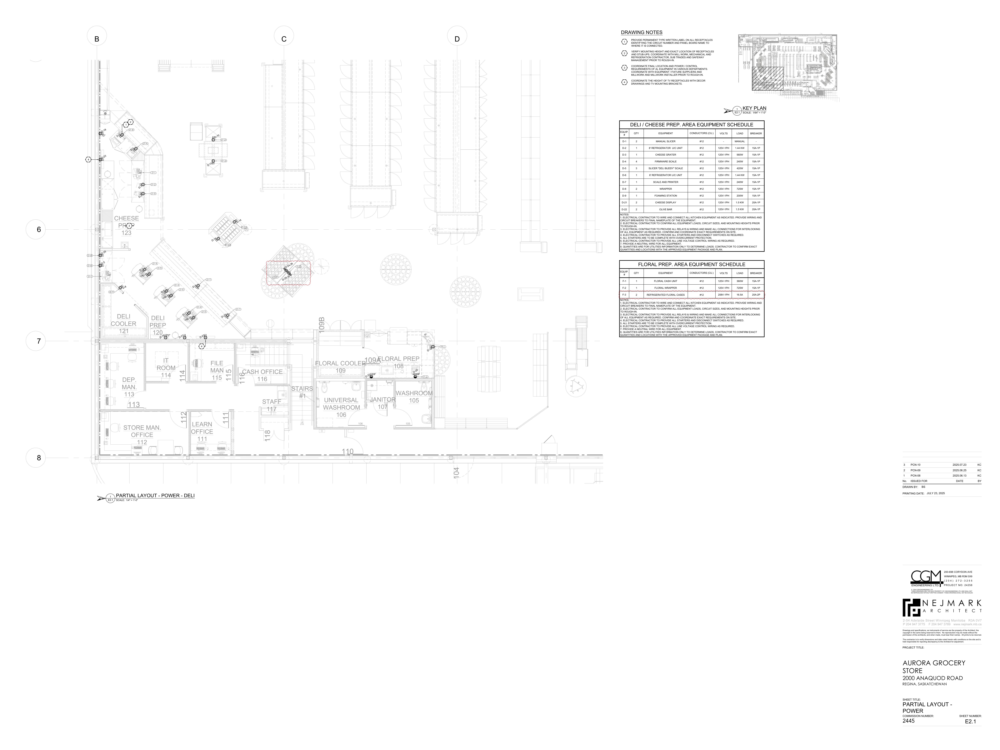

# PCN# 025 - Refrigerated Floral Cases

**Source**: `PCN# 025 - Refrigerated Floral Cases.pdf`  
**Pages**: 5  
**Extracted**: 2026-01-09 18:31:44

---

## Page 1

PROPOSED CHANGE NOTICE 

2445-25 

No work is to be done before this matter is finalized and a "Change Order" is issued.  This copy to remain with your office.  Do not return. 
Contractor to submit signed letter with price including cost breakdown and change (if any) to construction schedule.  Authority having 
Jurisdiction shall advise of any objections. 

TO: 

QUOREX CONSTRUCTION SERVICES LTD.  
1630A 8th Avenue,  
Regina, SK S4R 1E5 

RE: 

AURORA FOOD STORE 
2000 ANAQUOD ROAD 
REGINA, SK 
Commission No. 2445 

DATE: 

July 23, 2025 

PAGES: 

5 (including cover) 

RE: 

Refrigerated Floral Cases 

1.0 
ELECTRICAL 

.1 
Refer to attached Electrical PCN #10, dated July 23, 2025. (4 pages) 

Distribution: 
Sobeys Inc. – Jeff Craig 
jeff.craig@sobeys.com 
Sobeys Inc. – Shanwen Hsu 
shanwen.hsu@sobeys.com 
Quorex Construction Services Ltd. – Chris Walbaum 
c.walbaum@quorex.ca
Lavergne Draward & Associates Inc. – Charles Koop 
ckoop@ldaeng.ca 
CGM Engineering – Justin Albo 
justin_albo@cgmeng.ca 
CGM Engineering – Tony Mitousis 
tony_mitousis@cgmeng.ca 
CGM Engineering – Brendan Simpson 
brendan_simpson@cgmeng.ca 

Principal 
Kevin Fawley, SAA MRAIC 

## Page 2

 
ELECTRICAL PROPOSED CHANGE NOTICE #10 
 
24-258 
 

Project: 
Aurora Grocery Store 
 
2000 Anaquod Road, Regina, Saskatchewan 
Subject: 
Refrigerated Floral Cases 
Date: 
2025.07.23 
 

Subject: 
Refrigerated Floral Cases 
References: 
Electrical Drawing E0.2 – Schedules 
 
Electrical Drawing E2.1 – Partial Layout – Power 
 

1. 
Refer to attached drawing E0.2 for two(2) additional 20A-2P breakers added to panel ‘D’ for the 
refrigerated floral cases. 

2. 
Refer to attached drawing E2.1 for the location of two(2) receptacles for the refrigerated floral 
cases. The floral prep area equipment schedule is updated on drawing E2.1 for reference. 

Brendan Simpson, E.I.T. 
- 1 - 

200-698 Corydon Avenue     Winnipeg, Manitoba     R3M 0X9     204-272-3255     www.cgmeng.ca 

## Page 3

THIS DRAWING IS THE PROPERTY OF THE DIAMOND GROUP AND IS TO REMAIN IN OUR POSSESSION UNTIL OTHERWISE NOTED THIS DRAWING SHALL NOT BE REPRODUCED OR COPIED IN ANY MANNER WITHOUT THE AUTHORIZATION OF THE DIAMOND GROUP ANY UNAUTHORIZED USE OF THIS DRAWINGS IS STRICTLY PROHIBITED

REVISION DATE

#
1
2
3
4
5
6
7
8
9

TEL:(450)668-0330
FAX:(450)662-1326

-

CGA
SEFA
(OTHER)

ITEM(S) #
C.D. CN(S)#

REV. 0

APPROVED
APPROVED AS NOTED
RESUBMIT
SIGNED:
DATE:

LOCATION:

-
-
-
-
-
-
-
-

895 AVENUE MUNCK
LAVAL, QUEBEC
CANADA , H7S 1A9

APRIL 16, 2021

CN-001

M.JOLICOEUR

APPROVAL STATUS:

DIAMOND

CERTIFICATION(S)

PROJECT:

1 / 1

SOBEYS

SHEET NO:

CUSTOMER:

NSF
CSA
UL

DWG. DATE:

ORDER NO:

DRAWN BY:

11 x 17

NOVA-FL-3T-487250-SC

CORD AND PLUG
TWIST LOCK 20 AMP
NEMA L14-20P

23 1/4
COMPR. UNIT 3/4 HP
FREON 404 - 208V

MODEL:

REFRIGERATED FLORAL COUNTER BACK TO BACK

11 1/8

ITEM #
QTY
DESCRIPTION
C.D. CN#

EVAPORATOR PAN
1000W / 208V

11 1/2

ALL PAINTED BLACK

LEXAN 1/4"
ON EACH SIDE

16.5 AMPS 
120/208V 1PH

ITEM LIST

-ALL WELDED AND POLISHED EDGES- NO SHARP EDGES OR WELD BURRS

22 13/16

14 1/16

5 1/16

5 1/16

DIGITAL CONTROLLER
WITH THERMOMETER

REMOVABLE DECK

FLORAL BUCKET
(INCLUDED)

GENERAL NOTES :

2 3/4

75 5/16

72

48 1/16

50

## Page 4

PANEL '6L'
100

RTU-1, ROOF TOP UNIT
#1 WIRE
125

RTU-2, ROOF TOP UNIT
#4 WIRE
70

RTU-3, ROOF TOP UNIT
#10 WIRE
30

EF-1, EXHAUST FAN
15

PANEL '2A'
200

PANEL '2L'
200

PANEL '2B'
200

PANEL 'C2
200

LIGHTING - SALES - POT LIGHTS
15
1
ɸ
2
15
LIGHTING - SALES

LIGHTING - SEATING
15
7
ɸ
8
15
LIGHTING - SALES

LIGHTING - CHECKOUTS
15
9
ɸ
10
15
LIGHTING - SALES

LIGHTING - OFFICE
15
11
ɸ
12
15
LIGHTING - SALES

LIGHTING - DELI
15
13
ɸ
14
15
LIGHTING - SALES

LIGHTING - PHARMACY
15
15
ɸ
16
15
LIGHTING - RECEIVING / WAREHOUSE

LIGHTING - BAKERY
15
17
ɸ
18
15
LIGHTING - COMPRESSOR ROOM

LIGHTING - HMR
15
19
ɸ
20
15
LIGHTING - COOLERS

LIGHTING - SEAFOOD / MEATS / PRODUCE
15
21
ɸ
22
15
LIGHTING - VESTIBULE

SPACE
-
13
ɸ
14

30
BALER
#10 WIRE
SPACE
-
15
ɸ
16

SPACE
-
17
ɸ
18

SPACE
-
19
ɸ
20
-
SPACE

SPACE
-
21
ɸ
22
-
SPACE

SPACE
-
23
ɸ
24
-
SPACE

SPACE
-
25
ɸ
26
-
SPACE

SPACE
-
27
ɸ
28
-
SPACE

SPACE
-
29
ɸ
30
-
SPACE

SPACE
-
31
ɸ
32
-
SPACE

SPACE
-
33
ɸ
34
-
SPACE

SPACE
-
35
ɸ
36
-
SPACE

SPACE
-
37
ɸ
38
-
SPACE

SPACE
-
39
ɸ
40
-
SPACE

SPACE
-
41
ɸ
42
-
SPACE

SPACE
-
31
ɸ
32
-
SPACE

SPACE
-
33
ɸ
34
-
SPACE

SPACE
-
35
ɸ
36
-
SPACE

SPACE
-
37
ɸ
38
-
SPACE

SPACE
-
39
ɸ
40
-
SPACE

SPACE
-
41
ɸ
42
-
SPACE

SPARE
15
3
ɸ
4
15
LIGHTING - SALES

SPARE
15
5
ɸ
6
15
LIGHTING - SALES

SPACE
-
23
ɸ
24
15
LIGHTING - EXTERIOR

SPACE
-
25
ɸ
26
-
SPACE

SPACE
-
27
ɸ
28
-
SPACE

SPACE
-
29
ɸ
30
-
SPACE

SPACE
-
31
ɸ
32
-
SPACE

SPACE
-
33
ɸ
34
-
SPACE

SPACE
-
35
ɸ
36
-
SPACE

SPACE
-
37
ɸ
38
-
SPACE

SPACE
-
39
ɸ
40
-
SPACE

SPACE
-
41
ɸ
42
-
SPACE

SPACE
-
31
ɸ
32
-
SPACE

SPACE
-
33
ɸ
34
-
SPACE

SPACE
-
35
ɸ
36
-
SPACE

SPACE
-
37
ɸ
38
-
SPACE

SPACE
-
39
ɸ
40
-
SPACE

SPACE
-
41
ɸ
42
-
SPACE

SPACE
-
43
ɸ
44
-
SPACE

SPACE
-
45
ɸ
46
-
SPACE

SPACE
-
47
ɸ
48
-
SPACE

SPACE
-
49
ɸ
50
-
SPACE

SPACE
-
51
ɸ
52
-
SPACE

SPACE
-
53
ɸ
54
-
SPACE

SPACE
-
55
ɸ
56
-
SPACE

SPACE
-
57
ɸ
58
-
SPACE

SPACE
-
59
ɸ
60
-
SPACE

TVSS
#10 WIRE
30

TVSS
#10 WIRE
30

TVSS
30

PANEL '100A'

PANEL '100B'

PANEL '6L'

PANEL 'SD-1'

100A-347/600V-3PH-4W PANEL
SURFACE MOUNTED IN WEST STAFF CORRIDOR

1200A-120/208V-3PH-4W PANEL
SURFACE MOUNTED IN COMPRESSOR ROOM 300

400A-347/600V-3PH-4W PANEL
SURFACE MOUNTED IN COMPRESSOR ROOM 300

400A-347/600V-3PH-4W PANEL
SURFACE MOUNTED IN COMPRESSOR ROOM 300

DESCRIPTION
CIRCUIT
BREAKER

DESCRIPTION
CIRCUIT
BREAKER

DESCRIPTION
CIRCUIT
BREAKER

DESCRIPTION
CIRCUIT
BREAKER

15
RTU-6, ROOF TOP UNIT
15
ɸ
16

400
PANEL 'H'
15
ɸ
16

13
ɸ
14

17
ɸ
18

19
ɸ
20

13
ɸ
14

17
ɸ
18

19
ɸ
20

23
ɸ
24

25
ɸ
26
-
SPACE

27
ɸ
28
-
SPACE

29
ɸ
30
-
SPACE

23
ɸ
24

25
ɸ
26

200
PANEL 'B'
27
ɸ
28

29
ɸ
30

11
ɸ
12

11
ɸ
12

11
ɸ
12

30
AC-1, AIR CURTAIN
#10 WIRE
21
ɸ
22

200
PANEL 'SM'
21
ɸ
22

25
GAS COOLER
#10 WIRE
3
ɸ
4

5
ɸ
6

7
ɸ
8

30
COMPACTOR
#10 WIRE
9
ɸ
10

15
RTU-4, ROOF TOP UNIT
3
ɸ
4

5
ɸ
6

7
ɸ
8

15
RTU-5, ROOF TOP UNIT
9
ɸ
10

100
PANEL 'D'
3
ɸ
4

5
ɸ
6

7
ɸ
8

100
PANEL 'P'
9
ɸ
10

1
ɸ
2

1
ɸ
2

1
ɸ
2

PHASE
A    B    C

PHASE
A    B    C

PHASE
A    B    C

PHASE
A    B    C

CIRCUIT
BREAKER
DESCRIPTION

CIRCUIT
BREAKER
DESCRIPTION

CIRCUIT
BREAKER
DESCRIPTION

CIRCUIT
BREAKER
DESCRIPTION

DOOR OPENER (EXTERIOR)
15
1
ɸ
2
15
EXTERIOR SIGNAGE

DOOR OPENER (EXTERIOR)
15
3
ɸ
4
15
HOUSEKEEPING RECEPTACLES

DOOR OPENER (INSIDE)
15
5
ɸ
6
15
WAREHOUSE COMPUTER

DOOR OPENER (INSIDE)
15
7
ɸ
8
15
SHELVING RECEPTACLE

DOOR OPENER (INSIDE)
15
9
ɸ
10
15
SHELVING RECEPTACLE

DOOR OPENER (INSIDE)
15
11
ɸ
12
15
SHELVING RECEPTACLE

EXTERIOR SIGNAGE
15
29
ɸ
30
15
SHELVING RECEPTACLE

EXTERIOR SIGNAGE
15
31
ɸ
32
15
SHELVING RECEPTACLE

EXTERIOR SIGNAGE
15
33
ɸ
34
15
SHELVING RECEPTACLE

EXTERIOR SIGNAGE
15
35
ɸ
36
15
SHELVING RECEPTACLE

EXTERIOR SIGNAGE
15
37
ɸ
38
15
LIGHT BOX RECEPTACLES

PANEL 'O'
100

PANEL 'C1'
100

PANEL 'R1M'
200

PANEL 'Z'
100

BILLBOARD - NORTH
15
13
ɸ
14
15
SHELVING RECEPTACLE

BILLBOARD - NORTH
15
15
ɸ
16
15
SHELVING RECEPTACLE

BILLBOARD - NORTH
15
17
ɸ
18
15
SHELVING RECEPTACLE

BILLBOARD - NORTH
15
19
ɸ
20
15
SHELVING RECEPTACLE

BILLBOARD - WEST
15
21
ɸ
22
15
SHELVING RECEPTACLE

BILLBOARD - WEST
15
23
ɸ
24
15
SHELVING RECEPTACLE

BILLBOARD - WEST
15
25
ɸ
26
15
SHELVING RECEPTACLE

BILLBOARD - WEST
15
27
ɸ
28
15
SHELVING RECEPTACLE

LIGHTING - SALES - TRACK
20
1
ɸ
2
15
DECORATIVE LIGHTING

LIGHTING - SALES - TRACK
15
3
ɸ
4
20
LIGHTING - TRELLIS

LIGHTING - SALES - TRACK
15
5
ɸ
6
20
LIGHTING - TRELLIS

LIGHTING - SALES - TRACK
15
7
ɸ
8
20
LIGHTING - TRELLIS

LIGHTING - SALES - TRACK
15
9
ɸ
10
15
LIGHTING - BULKHEAD

LIGHTING - DOCK LIGHTS
15
11
ɸ
12
15
LIGHTING - BULKHEAD

SPACE
-
39
ɸ
40
-
SPACE

SPACE
-
41
ɸ
42
-
SPACE

SPACE
-
43
ɸ
44
-
SPACE

SPACE
-
45
ɸ
46
-
SPACE

SPACE
-
47
ɸ
48
-
SPACE

SPACE
-
49
ɸ
50
-
SPACE

SPACE
-
51
ɸ
52
-
SPACE

SPACE
-
53
ɸ
54
-
SPACE

SPACE
-
55
ɸ
56
-
SPACE

SPACE
-
57
ɸ
58
-
SPACE

SPACE
-
59
ɸ
60
-
SPACE

SPACE
-
61
ɸ
62
-
SPACE

SPACE
-
63
ɸ
64
-
SPACE

SPACE
-
65
ɸ
66
-
SPACE

SPACE
-
67
ɸ
68
-
SPACE

SPACE
-
69
ɸ
70
-
SPACE

SPACE
-
71
ɸ
72
-
SPACE

SPACE
-
73
ɸ
74
-
SPACE

SPACE
-
75
ɸ
76
-
SPACE

SPACE
-
77
ɸ
78
-
SPACE

SPACE
-
79
ɸ
80
-
SPACE

SPACE
-
81
ɸ
82
-
SPACE

SPACE
-
83
ɸ
84
-
SPACE

SPACE
-
23
ɸ
24

SPACE
-
25
ɸ
26
-
SPACE

SPACE
-
27
ɸ
28
-
SPACE

SPACE
-
29
ɸ
30
-
SPACE

SPACE
-
31
ɸ
32
-
SPACE

SPACE
-
33
ɸ
34
-
SPACE

SPACE
-
35
ɸ
36
-
SPACE

SPACE
-
37
ɸ
38
-
SPACE

SPACE
-
39
ɸ
40
-
SPACE

SPACE
-
41
ɸ
42
-
SPACE

SPACE
-
43
ɸ
44
-
SPACE

SPACE
-
45
ɸ
46
-
SPACE

SPACE
-
47
ɸ
48
-
SPACE

SPACE
-
49
ɸ
50
-
SPACE

SPACE
-
51
ɸ
52
-
SPACE

SPACE
-
53
ɸ
54
-
SPACE

SPACE
-
55
ɸ
56
-
SPACE

SPACE
-
57
ɸ
58
-
SPACE

SPACE
-
59
ɸ
60
-
SPACE

SPACE
-
13
ɸ
14
-
SPACE

SPACE
-
15
ɸ
16
-
SPACE

SPACE
-
17
ɸ
18
-
SPACE

SPACE
-
19
ɸ
20
-
SPACE

SPACE
-
21
ɸ
22
-
SPACE

SPACE
-
23
ɸ
24
-
SPACE

SPACE
-
25
ɸ
26
-
SPACE

SPACE
-
27
ɸ
28
-
SPACE

SPACE
-
29
ɸ
30
-
SPACE

SPACE
-
31
ɸ
32
-
SPACE

SPACE
-
33
ɸ
34
-
SPACE

SPACE
-
35
ɸ
36
-
SPACE

SPACE
-
37
ɸ
38
-
SPACE

SPACE
-
39
ɸ
40
-
SPACE

SPACE
-
41
ɸ
42
-
SPACE

PANEL '2A'

PANEL 'SD-2'

PANEL '2L'

1200A-120/208V-3PH-4W PANEL
SURFACE MOUNTED IN COMPRESSOR ROOM 300

200A-120/208V-3PH-4W PANEL
SURFACE MOUNTED IN COMPRESSOR ROOM 300

200A-120/208V-3PH-4W PANEL
SURFACE MOUNTED IN WEST STAFF CORRIDOR

DESCRIPTION
CIRCUIT
BREAKER

DESCRIPTION
CIRCUIT
BREAKER

DESCRIPTION
CIRCUIT
BREAKER

13
ɸ
14

400
PANEL 'R3L'
15
ɸ
16

17
ɸ
18

19
ɸ
20

11
ɸ
12

400
PANEL 'R4L'
21
ɸ
22

200
PANEL 'R1L'
3
ɸ
4

5
ɸ
6

7
ɸ
8

400
PANEL 'R2L'
9
ɸ
10

1
ɸ
2

PHASE
A    B    C

PHASE
A    B    C

PHASE
A    B    C

CIRCUIT
BREAKER
DESCRIPTION

CIRCUIT
BREAKER
DESCRIPTION

CIRCUIT
BREAKER
DESCRIPTION

FIRMWARE SCALE
15
5
ɸ
6

FOAMING STATION
15
31
ɸ
32
15
TV RECEPTACLE

MAIN - DEPARTMENT MANAGER -
RECEPTACLES
15
27
ɸ
28
15
SECOND - MICROWAVE

MAIN - DEPARTMENT MANAGER -
RECEPTACLES
15
29
ɸ
30
15
SECOND - TV

RETHERMALIZER
#10 WIRE
30

DISHWASHER
#6 WIRE
60

RICE COOKER
20
21
ɸ
22
30
SNACK BAR
#10 WIRE

DEEP FRYER (GAS)
15
45
ɸ
46
-
SPACE

RATIONAL COMBO OVEN (GAS)
15

RATIONAL COMBO OVEN (GAS)
15

RATIONAL COMBO OVEN (GAS)
15

RATIONAL COMBO OVEN (GAS)
15

DOUBLE DECK TURBO CHEF
#8 WIRE
50

DOUBLE DECK TURBO CHEF
#8 WIRE
50

DRY AGED MEAT COOLER
20

MAIN - HOUSEKEEPING
15
1
ɸ
2
15
MAIN - HANDDRYER
MAIN - IT RACK
20
3
ɸ
4

MAIN - IT RACK
20
5
ɸ
6
15
MAIN - HANDDRYER
MAIN - IT RACK
20
7
ɸ
8

MAIN - IT RACK
20
9
ɸ
10
15
SECOND - HANDDRYER
MAIN - CASH OFFICE - SAFE
15
11
ɸ
12

MAIN - CASH OFFICE - PRINTER
15
13
ɸ
14
15
SECOND - HANDDRYER
MAIN - CASH OFFICE - RECEPTACLES
15
15
ɸ
16

MAIN - FILE MANAGER - PRINTER
15
17
ɸ
18
15
SECOND - WASHROOM RECEPTACLES

MAIN - FILE MANAGE - RECEPTACLES
15
19
ɸ
20
15
SECOND - HOUSEKEEPING

MAIN - TELECOM BACKBOARD
20
21
ɸ
22
15
SECOND - HOUSEKEEPING

MAIN - HOUSEKEEPING
15
23
ɸ
24
15
SECOND - FRIDGE

MAIN - DEPARTMENT MANAGER - PRINTER
15
25
ɸ
26
20
SECOND - COUNTER RECEPTACLES

MAIN - STORE MANAGER - PRINTER
15
31
ɸ
32
20
EV-1, EVAPORATOR
MAIN - STORE MANAGER - RECEPTACLES
15
33
ɸ
34

MAIN - LEARN OFFICE - RECEPTACLES
15
35
ɸ
36
15
EBB-1, BASEBOARD HEATER (2 x 1.0 kW)
MAIN - WASHROOM RECEPTACLES
15
37
ɸ
38

MAIN - JANITOR ROOM
20
39
ɸ
40
15
EBB-1, BASEBOARD HEATER (2 x 1.0 kW)
MAIN - MICROWAVE
15
41
ɸ
42

MEAT SAW
15

MEAT WEIGH / WRAP SYSTEM
20

BACK-UP WRAPPER
15
25
ɸ
26
15
6' 2 DOOR U/C REFRIGERATOR UNIT

MEAT GRINDER
15
27
ɸ
28
15
FOAMING STATION

SPACE
-
43
ɸ
44
15
EBB-1, BASEBOARD HEATER (1 x 0.5 kW)

SPACE
-
45
ɸ
46
15
EF-5, EXHAUST FAN

SPACE
-
47
ɸ
48
15
EF-4, EXHAUST FAN

SPACE
-
49
ɸ
50
-
SPACE

SPACE
-
51
ɸ
52
-
SPACE

SPACE
-
53
ɸ
54
-
SPACE

SPACE
-
55
ɸ
56
-
SPACE

SPACE
-
57
ɸ
58
-
SPACE

SPACE
-
59
ɸ
60
-
SPACE

SPACE
-
61
ɸ
62
-
SPACE

SPACE
-
63
ɸ
64
-
SPACE

SPACE
-
65
ɸ
66
-
SPACE

SPACE
-
67
ɸ
68
-
SPACE

SPACE
-
69
ɸ
70
-
SPACE

SPACE
-
71
ɸ
72
-
SPACE

SPACE
-
73
ɸ
74
-
SPACE

SPACE
-
75
ɸ
76
-
SPACE

SPACE
-
77
ɸ
78
-
SPACE

SPACE
-
79
ɸ
80
-
SPACE

SPACE
-
81
ɸ
82
-
SPACE

SPACE
-
83
ɸ
84
-
SPACE

SELF SERVICE HOT FOODS
#6 WIRE
70

SCALE PRINTER
15
23
ɸ
24
30
SNACK BAR
#10 WIRE

SCALE PRINTER
15
25
ɸ
26
15
RH-1, RANGE HOOD

SCALE PRINTER
15
27
ɸ
28
15
RH-2, RANGE HOOD

SCALE PRINTER
15
29
ɸ
30
15
RECEPTACLES

8' REFRIGERATOR U/C UNIT
15
31
ɸ
32
30
AMANA OVEN
#10 WIRE
8' FREEZER U/C UNIT
20
33
ɸ
34

SPARE
15
35
ɸ
36
-
SPACE

SLICER
15
37
ɸ
38
-
SPACE

55" LG TV
15
39
ɸ
40
-
SPACE

55" LG TV
15
41
ɸ
42
-
SPACE

55" LG TV
15
43
ɸ
44
-
SPACE

SPACE
-
73
ɸ
74
-
SPACE

SPACE
-
75
ɸ
76
-
SPACE

SPACE
-
77
ɸ
78
-
SPACE

SPACE
-
79
ɸ
80
-
SPACE

SPACE
-
81
ɸ
82
-
SPACE

SPACE
-
83
ɸ
84
-
SPACE

SCALE PRINTER
15
1
ɸ
2

35
LOBSTER STEAMER
#8 WIRE
SCALE PRINTER
15
3
ɸ
4

SPACE
-
39
ɸ
40
-
SPACE

SPACE
-
41
ɸ
42
-
SPACE

SPACE
-
43
ɸ
44
-
SPACE

SPACE
-
45
ɸ
46
-
SPACE

SPACE
-
47
ɸ
48
-
SPACE

SPACE
-
49
ɸ
50
-
SPACE

SPACE
-
51
ɸ
52
-
SPACE

SPACE
-
53
ɸ
54
-
SPACE

SPACE
-
55
ɸ
56
-
SPACE

SPACE
-
57
ɸ
58
-
SPACE

SPACE
-
59
ɸ
60
-
SPACE

6' REFRIGERATOR U/C UNIT
15
19
ɸ
20
20
MOBILE HOLDING CABINET

6' U/C PREP CABINET
15
37
ɸ
38
15
TV RECEPTACE

27" FREEZER
15
47
ɸ
48
-
SPACE

TENDERIZER
15
19
ɸ
20
15
FIRMWARE SCALE

WRAPPER
15
29
ɸ
30
15
WRAPPER

VAC PAC PL20
15

PANEL 'O'

PANEL 'H'

PANEL 'SM'

100A-120/208V-3PH-4W PANEL
RECESS MOUNTED IN OFFICE CORRIDOR

400A-120/208V-3PH-4W PANEL
SURFACE MOUNTED IN NORTH STAFF CORRIDOR

200A-120/208V-3PH-4W PANEL
SURFACE MOUNTED IN NORTH STAFF CORRIDOR

DESCRIPTION
CIRCUIT
BREAKER

DESCRIPTION
CIRCUIT
BREAKER

DESCRIPTION
CIRCUIT
BREAKER

15
ɸ
16
40
HOT CHICKEN ISLAND
#8 WIRE
17
ɸ
18

15
ɸ
16
20
ICE FLAKER

13
ɸ
14
15
HOT AND COLD SOUP

13
ɸ
14
15
WRAPPER

17
ɸ
18
15
MEAT SLICER

53
ɸ
54
-
SPACE

55
ɸ
56
-
SPACE

57
ɸ
58
-
SPACE

59
ɸ
60
-
SPACE

65
ɸ
66
-
SPACE

33
ɸ
34
15
RECEPTACLES

35
ɸ
36
15
RECEPTACLES

63
ɸ
64
-
SPACE

67
ɸ
68
-
SPACE

69
ɸ
70
-
SPACE

23
ɸ
24
15
8' 3 DOOR U/C REFRIGERATOR UNIT

49
ɸ
50
-
SPACE

11
ɸ
12
15
HOT AND COLD SOUP

11
ɸ
12
20
LOBSTER TANK

51
ɸ
52
-
SPACE

61
ɸ
62
-
SPACE

71
ɸ
72
-
SPACE

21
ɸ
22
15
SCALE PRINTER

3
ɸ
4
15
2 DOOR FREEZER

5
ɸ
6
15
WRAPPER

7
ɸ
8
15
HOT AND COLD SOUP

9
ɸ
10
15
HOT AND COLD SOUP

7
ɸ
8
15
FIRMWARE SCALE

9
ɸ
10
15
SCALE PRINTER

1
ɸ
2
20
5' BLAST CHILLER

PHASE
A    B    C

PHASE
A    B    C

PHASE
A    B    C

CIRCUIT
BREAKER
DESCRIPTION

CIRCUIT
BREAKER
DESCRIPTION

CIRCUIT
BREAKER
DESCRIPTION

FIRMWARE SCALE
15
5
ɸ
6
15
WRAPPER

FIRMWARE SCALE
15
7
ɸ
8
15
FOAMING STATION

FIRMWARE SCALE
15
9
ɸ
10
20
CHEESE DISPLAY

FIRMWARE SCALE
15
11
ɸ
12
20
CHEESE DISPLAY

RECEPTACLES
15
21
ɸ
22
15
RECEPTACLE

FRIDGE
15
5
ɸ
6
15
HOUSKEEPING

FRIDGE
15
7
ɸ
8
15
FRONT COUNTER RECEPTACLES

DOUBLE RACK OVEN (GAS)
15

DOUBLE RACK OVEN (GAS)
15

RETARDER / PROOFER
#8 WIRE
50

ROUNDER
15

FIRMWARE SCALE
15
25
ɸ
26
15
SHEETER
BREAD SLICER
15
27
ɸ
28

FLOOR SCALE
15
35
ɸ
36
15
FIRMWARE SCALE

LEAK DETECTION PANEL
20
1
ɸ
2
20
I-1, EMERGENCY CONDENSING UNIT
EMS SYSTEM PANEL
20
3
ɸ
4

EMS SYSTEM PC
20
5
ɸ
6
20
COMPRESSOR RACK CONTROL PANEL

BUG LIGHTS
15
19
ɸ
20
15
FLORAL WRAPPER

BLOOD PRESSURE MACHINE
15
1
ɸ
2
20
COUNTER RECEPTACLES

MICROWAVE
20
15
ɸ
16
-
SPACE

MICROWAVE
20
29
ɸ
30
15
FOAMING STATION

CHEESE GRATER
15
3
ɸ
4
15
SCALE AND PRINTER

COMPUTER DESKS
15
17
ɸ
18
-
SPACE

CREAMER
15
31
ɸ
32
15
OVEN CONTROLS

CHOCOLATE WARMER
15
33
ɸ
34
15
OVEN CONTROLS

8' REFRIGERATOR U/C UNIT
15
1
ɸ
2
15
6' REFRIGERATOR U/C UNIT

SLICER "DELI BUDDY" (SCALE)
15
13
ɸ
14
20
OLIVE BAR

SLICER "DELI BUDDY" (SCALE)
15
15
ɸ
16
20
OLIVE BAR

SLICER "DELI BUDDY" (SCALE)
15
17
ɸ
18
15
CASH UNIT

SCALE AND PRINTER
15
27
ɸ
28
20
REFRIGERATED FLORAL CASE
SPACE
-
29
ɸ
30

SPACE
-
31
ɸ
32
-
SPACE

SPACE
-
33
ɸ
34
-
SPACE

SPACE
-
35
ɸ
36
-
SPACE

SPACE
-
37
ɸ
38
-
SPACE

SPACE
-
39
ɸ
40
-
SPACE

SPACE
-
41
ɸ
42
-
SPACE

SPACE
-
19
ɸ
20
-
SPACE

SPACE
-
21
ɸ
22
-
SPACE

SPACE
-
23
ɸ
24
-
SPACE

SPACE
-
25
ɸ
26
-
SPACE

SPACE
-
27
ɸ
28
-
SPACE

SPACE
-
29
ɸ
30
-
SPACE

SPACE
-
31
ɸ
32
-
SPACE

SPACE
-
33
ɸ
34
-
SPACE

SPACE
-
35
ɸ
36
-
SPACE

SPACE
-
37
ɸ
38
-
SPACE

SPACE
-
39
ɸ
40
-
SPACE

SPACE
-
41
ɸ
42
-
SPACE

SPACE
-
39
ɸ
40
-
SPACE

SPACE
-
41
ɸ
42
-
SPACE

SPACE
-
43
ɸ
44
-
SPACE

SPACE
-
45
ɸ
46
-
SPACE

SPACE
-
47
ɸ
48
-
SPACE

SPACE
-
49
ɸ
50
-
SPACE

SPACE
-
51
ɸ
52
-
SPACE

SPACE
-
53
ɸ
54
-
SPACE

SPACE
-
55
ɸ
56
-
SPACE

SPACE
-
57
ɸ
58
-
SPACE

SPACE
-
59
ɸ
50
-
SPACE

SPACE
-
7
ɸ
8
20
FOM GENERATOR

SPACE
-
9
ɸ
10
-
SPACE

SPACE
-
11
ɸ
12
-
SPACE

SPACE
-
13
ɸ
14
-
SPACE

SPACE
-
15
ɸ
16
-
SPACE

SPACE
-
17
ɸ
18
-
SPACE

SPACE
-
19
ɸ
20
-
SPACE

SPACE
-
21
ɸ
22
-
SPACE

SPACE
-
23
ɸ
24
-
SPACE

SPACE
-
25
ɸ
26
-
SPACE

SPACE
-
27
ɸ
28
-
SPACE

SPACE
-
29
ɸ
30
-
SPACE

SPACE
-
31
ɸ
32
-
SPACE

SPACE
-
33
ɸ
34
-
SPACE

SPACE
-
35
ɸ
36
-
SPACE

SPACE
-
37
ɸ
38
-
SPACE

SPACE
-
39
ɸ
40
-
SPACE

TV RECEPTACLES
15
23
ɸ
24
20
REFRIGERATED FLORAL CASE
WRAPPER
15
25
ɸ
26

TV RECEPTACLE
15
3
ɸ
4
15
COMPUTER DESKS

TV RECEPTACLE
15
37
ɸ
38
-
SPACE

AUTOMATIC ROLLING SHUTTER
15
9
ɸ
10
15
FRONT COUNTER RECEPTACLES

AUTOMATIC ROLLING SHUTTER
15
11
ɸ
12
15
FRONT COUNTER RECEPTACLES

AUTOMATIC ROLLING SHUTTER
15
13
ɸ
14
15
SC RECEPTACLE

PANEL 'D'

PANEL 'P'

PANEL 'B'

PANEL 'Z'

100A-120/208V-3PH-4W PANEL
RECESS MOUNTED IN OFFICE CORRIDOR

100A-120/208V-3PH-4W PANEL
SURFACE MOUNTED IN WEST STAFF CORRIDOR

100A-120/240V-1PH-3W PANEL
SURFACE MOUNTED IN COMPRESSOR ROOM 300

200A-120/208V-3PH-4W PANEL
SURFACE MOUNTED IN WEST STAFF CORRIDOR

DESCRIPTION
CIRCUIT
BREAKER

DESCRIPTION
CIRCUIT
BREAKER

DESCRIPTION
CIRCUIT
BREAKER

DESCRIPTION
CIRCUIT
BREAKER

60
POT WASHER
#6 WIRE
15
ɸ
16

13
ɸ
14

17
ɸ
18

19
ɸ
20

23
ɸ
24

11
ɸ
12

15
DOUGH DIVIDER
21
ɸ
22

15
80 QT MIXER
3
ɸ
4

5
ɸ
6

7
ɸ
8

20
SPIRAL MIXER
9
ɸ
10

1
ɸ
2

PHASE
A            B

PHASE
A    B    C

PHASE
A    B    C

PHASE
A    B    C

CIRCUIT
BREAKER
DESCRIPTION

CIRCUIT
BREAKER
DESCRIPTION

CIRCUIT
BREAKER
DESCRIPTION

CIRCUIT
BREAKER
DESCRIPTION

2-54 Adelaide Street Winnipeg Manit
a
ob
R3A 0V7
 P 204 947 3775
 F 204 947 3789
www.nejmark.mb.ca

AURORA GROCERY
STORE
2000 ANAQUOD ROAD
REGINA, SASKATCHEWAN

PROJECT TITLE:

DRAWN BY:

PRINTING DATE:

No.     ISSUED FOR                                      DATE                   BY

Drawings and specifications, as instruments of service are the property of the Architect, the
copyright in the same being reserved to them.  No reproduction may be made without the
permission of the architects, and when made, must bear their names.  All prints to be returned.

2445

COMMISSION NUMBER:
SHEET NUMBER:

The contractor is to verify dimensions and date noted herein with conditions on the site and is
held responsible for reporting discrepancy to the Architect for adjustment.

SHEET TITLE:

SCHEDULES

1

KC
2025.07.23
PCN-10
3

KC
2025.06.25
PCN-09
2

KC
2025.06.13
PCN-08

© 2024 CGM ENGINEERING LTD.
THESE DRAWINGS ARE THE SOLE PROPERTY OF CGM ENGINEERING LTD. AND SHALL NOT
BE REPRODUCED WITHOUT WRITTEN CONSENT. THESE DRAWINGS SHALL NOT BE SCALED.

ENGINEERING LTD.

BS

N E J M A R K
A
R
C
H
I
T
E
C
T

JULY 23, 2025

PROJECT NO: 24258

( 2 0 4 )  2 7 2 - 3 2 5 5

200-698 CORYDON AVE

WINNIPEG, MB R3M 0X9

E0.2

## Page 5

6

7

8

4

B
C
D

N
 PARTIAL LAYOUT - POWER - DELI

D-25

D-2

D-19

D-23

72"

SCALE:
E2.1

1

DELI
COOLER
121

CHEESE
PREP
123

D-6

IT
ROOM
114
DEP.
MAN.
113

D-8

STORE MAN.
OFFICE
112

1

1/4" = 1'-0"

113

3

2

D-5

D-1

D-3

D-7

D-13

DELI
PREP
120

D-19

D-9

D-15

72"

D-21

114

112

D-11

D-17

LEARN
OFFICE
111

D-4

a

D-23

4

D-12

FILE
MAN
115

D-16

D-10

D-27

111

115

a

D-14

116

FLORAL COOLER
109
CASH OFFICE
116

STAFF
117

118

D-28,30

D-24,26

STAIRS
#1

106
UP
21R

109B

UNIVERSAL
WASHROOM
106

110

109A

D-22

WASHROOM
105
JANITOR
107

GF
GF

FLORAL PREP
108

107

105

D-20

a

D-18

104

NOTES:
1. ELECTRICAL CONTRACTOR TO WIRE AND CONNECT ALL KITCHEN EQUIPMENT AS INDICATED. PROVIDE WIRING AND
CIRCUIT BREAKERS TO FINAL NAMEPLATE OF THE EQUIPMENT.
2. ELECTRICAL CONTRACTOR TO CONFIRM ALL EQUIPMENT LOADS, CIRCUIT SIZES, AND MOUNTING HEIGHTS PRIOR
TO ROUGH-IN.
3. ELECTRICAL CONTRACTOR TO PROVIDE ALL RELAYS & WIRING AND MAKE ALL CONNECTIONS FOR INTERLOCKING
OF ALL EQUIPMENT AS REQUIRED. CONFIRM AND COORDINATE EXACT REQUIREMENTS ON SITE.
4. ELECTRICAL CONTRACTOR TO PROVIDE ALL STARTERS AND DISCONNECT SWITCHES AS REQUIRED.
5. ALL STARTERS ARE TO BE COMPLETE WITH OVERCURRENT PROTECTION.
6. ELECTRICAL CONTRACTOR TO PROVIDE ALL LINE VOLTAGE CONTROL WIRING AS REQUIRED.
7. PROVIDE A NEUTRAL WIRE FOR ALL EQUIPMENT.
8. QUANTITIES ARE FOR UTILITIES INFORMATION ONLY TO DETERMINE LOADS. CONTRACTOR TO CONFIRM EXACT
QUANTITIES AND LOCATIONS WITH THE APPROVED EQUIPMENT PACKAGE AND PLAN.

NOTES:
1. ELECTRICAL CONTRACTOR TO WIRE AND CONNECT ALL KITCHEN EQUIPMENT AS INDICATED. PROVIDE WIRING AND
CIRCUIT BREAKERS TO FINAL NAMEPLATE OF THE EQUIPMENT.
2. ELECTRICAL CONTRACTOR TO CONFIRM ALL EQUIPMENT LOADS, CIRCUIT SIZES, AND MOUNTING HEIGHTS PRIOR
TO ROUGH-IN.
3. ELECTRICAL CONTRACTOR TO PROVIDE ALL RELAYS & WIRING AND MAKE ALL CONNECTIONS FOR INTERLOCKING
OF ALL EQUIPMENT AS REQUIRED. CONFIRM AND COORDINATE EXACT REQUIREMENTS ON SITE.
4. ELECTRICAL CONTRACTOR TO PROVIDE ALL STARTERS AND DISCONNECT SWITCHES AS REQUIRED.
5. ALL STARTERS ARE TO BE COMPLETE WITH OVERCURRENT PROTECTION.
6. ELECTRICAL CONTRACTOR TO PROVIDE ALL LINE VOLTAGE CONTROL WIRING AS REQUIRED.
7. PROVIDE A NEUTRAL WIRE FOR ALL EQUIPMENT.
8. QUANTITIES ARE FOR UTILITIES INFORMATION ONLY TO DETERMINE LOADS. CONTRACTOR TO CONFIRM EXACT
QUANTITIES AND LOCATIONS WITH THE APPROVED EQUIPMENT PACKAGE AND PLAN.

EQUIP.
#
QTY
EQUIPMENT
CONDUCTORS (CU.)
VOLTS
LOAD
BREAKER

EQUIP.
#
QTY
EQUIPMENT
CONDUCTORS (CU.)
VOLTS
LOAD
BREAKER

DRAWING NOTES

D-22
2
OLIVE BAR
#12
120V-1PH
1.5 KW
20A-1P

D-21
2
CHEESE DISPLAY
#12
120V-1PH
1.5 KW
20A-1P

D-5
3
SLICER "DELI BUDDY" SCALE
#12
120V-1PH
420W
15A-1P

D-8
2
WRAPPER
#12
120V-1PH
725W
15A-1P

D-9
1
FOAMING STATION
#12
120V-1PH
200W
15A-1P

D-2
1
8' REFRIGERATOR  U/C UNIT
#12
120V-1PH
1.44 KW
15A-1P

D-3
1
CHEESE GRATER
#12
120V-1PH
560W
15A-1P

D-4
4
FIRMWARE SCALE
#12
120V-1PH
240W
15A-1P

D-6
1
6' REFRIGERATOR U/C UNIT
#12
120V-1PH
1.44 KW
15A-1P

D-7
1
SCALE AND PRINTER
#12
120V-1PH
240W
15A-1P

F-2
1
FLORAL WRAPPER
#12
120V-1PH
725W
15A-1P

F-3
2
REFRIGERATED FLORAL CASES
#12
208V-1PH
16.5A
20A-2P

D-1
2
MANUAL SLICER
#12
-
MANUAL
-

F-1
1
FLORAL CASH UNIT
#12
120V-1PH
360W
15A-1P

1

2

3

4

DELI / CHEESE PREP. AREA EQUIPMENT SCHEDULE

PROVIDE PERMANENT TYPE WRITTEN LABEL ON ALL RECEPTACLES
IDENTIFYING THE CIRCUIT NUMBER AND PANEL BOARD NAME TO
WHERE IT IS CONNECTED.

VERIFY MOUNTING HEIGHT AND EXACT LOCATION OF RECEPTACLES
AND STUB-UPS. COORDINATE WITH MILL WORK, MECHANICAL AND
REFRIGERATION CONTRACTOR, SUB TRADES AND SAFEWAY
MANAGEMENT PRIOR TO ROUGH-IN.

COORDINATE FINAL LOCATION AND POWER / CONTROL
REQUIREMENTS OF AL EQUIPMENT IN VARIOUS DEPARTMENTS.
COORDINATE WITH EQUIPMENT / FIXTURE SUPPLIERS AND
MILLWORK AND MILLWORK INSTALLER PRIOR TO ROUGH-IN.

COORDINATE THE HEIGHT OF TV RECEPTACLES WITH DECOR
DRAWINGS AND TV MOUNTING BRACKETS.

FLORAL PREP. AREA EQUIPMENT SCHEDULE

N
 KEY PLAN

SCALE:
E2.1

1

STAIRS
#2

GLASS &
ORGANICS
RECYCLE
194

1.0 kW

190D

RECEIVING
190

194

193

CLEAN-UP
AREA
193

1.0 kW

190C
190B

SPRINKLER ROOM
192

STAIRS
#3

190A

1/64" = 1'-0"

1.0 kW

BAKERY FREEZER
131

DELI
COOLER
121

CHEESE
PREP
123

IT
ROOM
114
DEP.
MAN.
113

FULL HEIGHT
WALL

54"H
WALL

STORE MAN.
OFFICE
112

113

DELI
PREP
120

131

0.5 kW

BAKERY
PREP
130

114

112

LEARN
OFFICE
111

FILE
MAN
115

111

115

116

FLORAL COOLER
109
CASH OFFICE
116

130

STAFF
117

132

118

BAKERY
COOLER
132

STAIRS
#1

UP
21R

109B

UNIVERSAL
WASHROOM
106

G

110

106

109A

WASHROOM
105
JANITOR
107

FLORAL PREP
108

107

DAIRY COOLER
133

105

104

133

191A

119C

141A

CONSULT
ROOM
141

141B

140A
140B
140C

G
G

PHARMACY PREP
140

WAREHOUSE
191

SALES
119

CHECKOUTS
104

OUTDOOR SEATING
103A

140D

142

STORAGE
142

SERVICE
DESK
103

2.0 kW

119D

SEATING
101

SELF CHECKOUTS
102

153B
154

100B

2.0 kW

GROCERY FREEZER
154

100A

VESTIBULE
100

100C

R

HMR PREP
181

HMR
180

182

MEAT/KITCHEN
FREEZER
153

KITCHEN
COOLER
182

191B

153A

152

MEAT COOLER
152

151A

MEAT PREP
151

151B

BUTCHER SHOP
150

SEAFOOD
PREP
137

171

161

PRODUCE
PREP
170

PRODUCE
COOLER
171

162

SEAFOOD
COOLER
162

170

119B

2-54 Adelaide Street Winnipeg Manit
a
ob
R3A 0V7
 P 204 947 3775
 F 204 947 3789
www.nejmark.mb.ca

AURORA GROCERY
STORE
2000 ANAQUOD ROAD
REGINA, SASKATCHEWAN

PROJECT TITLE:

DRAWN BY:

PRINTING DATE:

No.     ISSUED FOR                                      DATE                   BY

Drawings and specifications, as instruments of service are the property of the Architect, the
copyright in the same being reserved to them.  No reproduction may be made without the
permission of the architects, and when made, must bear their names.  All prints to be returned.

2445

COMMISSION NUMBER:
SHEET NUMBER:

The contractor is to verify dimensions and date noted herein with conditions on the site and is
held responsible for reporting discrepancy to the Architect for adjustment.

PARTIAL LAYOUT -
POWER

SHEET TITLE:

1

KC
2025.07.23
PCN-10
3

KC
2025.06.25
PCN-09
2

KC
2025.06.13
PCN-08

© 2024 CGM ENGINEERING LTD.
THESE DRAWINGS ARE THE SOLE PROPERTY OF CGM ENGINEERING LTD. AND SHALL NOT
BE REPRODUCED WITHOUT WRITTEN CONSENT. THESE DRAWINGS SHALL NOT BE SCALED.

ENGINEERING LTD.

BS

N E J M A R K
A
R
C
H
I
T
E
C
T

JULY 23, 2025

PROJECT NO: 24258

( 2 0 4 )  2 7 2 - 3 2 5 5

200-698 CORYDON AVE

WINNIPEG, MB R3M 0X9

E2.1

