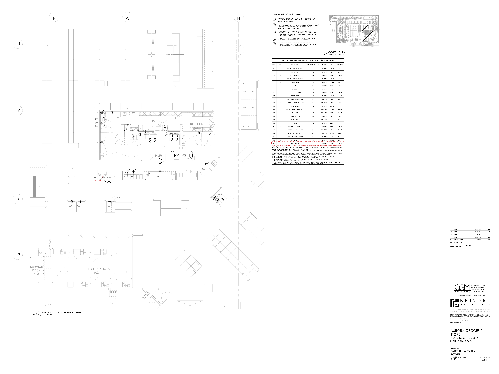
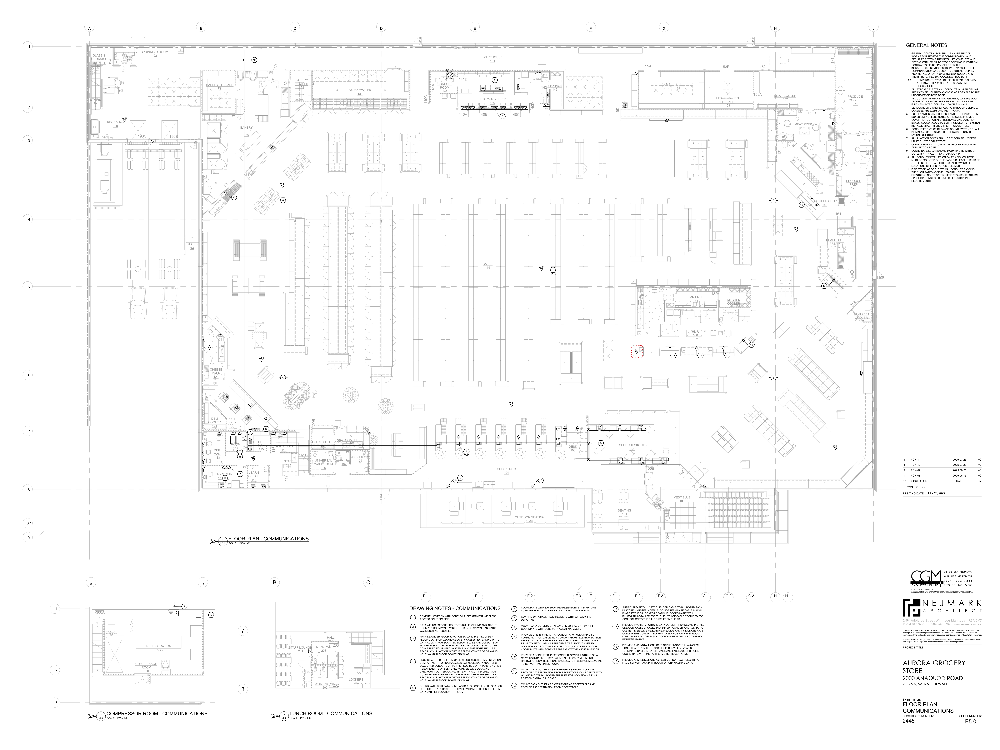

# PCN# 026 - HMR POS Station

**Source**: `PCN# 026 - HMR POS Station.pdf`  
**Pages**: 4  
**Extracted**: 2026-01-09 18:31:45

---

## Page 1

PROPOSED CHANGE NOTICE 

2445-26 

 
No work is to be done before this matter is finalized and a "Change Order" is issued.  This copy to remain with your office.  Do not return.  
Contractor to submit signed letter with price including cost breakdown and change (if any) to construction schedule.  Authority having 
Jurisdiction shall advise of any objections. 
 
 
TO: 
QUOREX CONSTRUCTION SERVICES LTD. 
 
 
 
1630A 8th Avenue,  
 
 
Regina, SK S4R 1E5 
 
 
RE: 
AURORA FOOD STORE 
 
 
2000 ANAQUOD ROAD 
 
 
REGINA, SK 
 
 
Commission No. 2445 
 
 
DATE: 
July 24, 2025 
 
 
PAGES: 
4 (including cover) 
 
 
RE: 
HMR POS Station 
 
 
 
 
1.0 
ELECTRICAL 
 
 
.1 
Refer to attached Electrical PCN #11, dated July 23, 2025. 
 
 
(1 page text, 2 full size drawings E2.4, E5.0) 
 
  
 
 
 
 
 
 
 
 
 
 
 
         
Distribution: 
Sobeys Inc. – Jeff Craig 
jeff.craig@sobeys.com 
Sobeys Inc. – Shanwen Hsu 
shanwen.hsu@sobeys.com 
Quorex Construction Services Ltd. – Chris Walbaum 
c.walbaum@quorex.ca 
Lavergne Draward & Associates Inc. – Charles Koop 
ckoop@ldaeng.ca 
CGM Engineering – Justin Albo 
justin_albo@cgmeng.ca 
CGM Engineering – Tony Mitousis 
tony_mitousis@cgmeng.ca 
CGM Engineering – Brendan Simpson 
brendan_simpson@cgmeng.ca 
 
 
 
 
 
 
 
 
 
Principal 
Kevin Fawley, SAA MRAIC 

## Page 2

 
ELECTRICAL PROPOSED CHANGE NOTICE #11 
 
24-258 
 

Project: 
Aurora Grocery Store 
 
2000 Anaquod Road, Regina, Saskatchewan 
Subject: 
HMR POS Station 
Date: 
2025.07.23 
 

Subject: 
HMR POS Station 
References: 
Electrical Drawing E2.4 – Partial Layout - Power 
 
Electrical Drawing E5.0 – Floor Plan - Communications 
 

1. 
Refer to attached drawing E2.4 for the location of one(1) additional receptacle to serve the HMR 
POS station. Wire and connect to existing circuit ‘H-23’ on panel ‘H’. The HMR prep area equipment 
schedule is updated for reference. 

2. 
Refer to attached drawing E5.0 for the location of one(1) additional data outlet to service the HMR 
POS station.  

Brendan Simpson, E.I.T. 
- 1 - 

200-698 Corydon Avenue     Winnipeg, Manitoba     R3M 0X9     204-272-3255     www.cgmeng.ca 

## Page 3

6

7

4

5

SERVICE
DESK
103

N
 PARTIAL LAYOUT - POWER - HMR

SCALE:
E2.4

1

1/4" = 1'-0"

F
G
H

H-22

H-24

SELF CHECKOUTS
102

H-23

H-35

H-31

H-29

H-37
H-30

72"
a

a

a

H-6

H-23

1
2

H-16,18

100B

H-20

H-21

H-13,15,17

a

H-1,3,5

H-39

H-47

100C

H-45

R

H-25

H-49,51

HMR PREP
181

H-53,55

HMR
180

3

4

H-41

H-2

H-7,9,11

H-57,59

H-27

182

H-32,34

H-61,63
H-30

72"

H-65,67

KITCHEN
COOLER
182

H-69,71

H-19

H-43

H-4

H-8

H-10

H-14
H-12

NOTES:
1. ELECTRICAL CONTRACTOR TO WIRE AND CONNECT ALL KITCHEN EQUIPMENT AS INDICATED. PROVIDE WIRING AND
CIRCUIT BREAKERS TO FINAL NAMEPLATE OF THE EQUIPMENT.
2. ELECTRICAL CONTRACTOR TO CONFIRM ALL EQUIPMENT LOADS, CIRCUIT SIZES, AND MOUNTING HEIGHTS PRIOR
TO ROUGH-IN.
3. ELECTRICAL CONTRACTOR TO PROVIDE ALL RELAYS & WIRING AND MAKE ALL CONNECTIONS FOR INTERLOCKING
OF ALL EQUIPMENT AS REQUIRED. CONFIRM AND COORDINATE EXACT REQUIREMENTS ON SITE.
4. ELECTRICAL CONTRACTOR TO PROVIDE ALL STARTERS AND DISCONNECT SWITCHES AS REQUIRED.
5. ALL STARTERS ARE TO BE COMPLETE WITH OVERCURRENT PROTECTION.
6. ELECTRICAL CONTRACTOR TO PROVIDE ALL LINE VOLTAGE CONTROL WIRING AS REQUIRED.
7. PROVIDE A NEUTRAL WIRE FOR ALL EQUIPMENT.
8. QUANTITIES ARE FOR UTILITIES INFORMATION ONLY TO DETERMINE LOADS. CONTRACTOR TO CONFIRM EXACT
QUANTITIES AND LOCATIONS WITH THE APPROVED EQUIPMENT PACKAGE AND PLAN.

EQUIP.
#
QTY
EQUIPMENT
CONDUCTORS (CU.)
VOLTS
LOAD
BREAKER

DRAWING NOTES - HMR

H-10
1
27" FREEZER
#12
120V-1PH
1.44 KW
15A-1P

H-13
1
5' BLAST CHILLER
#12
120V-1PH
13.3 A
15A-1P

H-14
1
DOUBLE DECK TURBO CHEF
#8
208V-1PH
8.32 KW
50A-2P

H-15
1
AMANA OVEN
#10
208V-1PH
5.7 KW
30A-2P

H-16
1
2 DOOR FREEZER
#12
120V-1PH
1.34 KW
15A-1P

H-17
1
DISHWASHER
#6
208V-3PH
53.7 A
60A-3P

H-18
1
WRAPPER
#12
120V-1PH
725W
15A-1P

H-23
1
HOT CHICKEN ISLAND
#8
208V-1PH
6.2 KW
40A-2P

H-24
1
MOBILE HOLDING CABINET
#8
120V-1PH
1.8 KW
20A-1P

H-25
2
SNACK BAR
#10
120V-1PH
2.6 KW
30A-1P

H-26
1
POS STATION
#12
120V-1PH
240W
15A-1P

H-12
4
RATIONAL COMBO OVEN (GAS)
#12
208V-1PH
900W
15A-2P

H-22
1
SELF SERVICE HOT FOODS
#4
208V-3PH
52 A
70A-3P

H-11
1
PITCO RETHERMALIZER (GAS)
#10
208V-3PH
22 A
30A-3P

H-21
4
HOT AND COLD SOUP
#12
120V-1PH
500W
15A-1P

H-3
1
RICE COOKER
#12
120V-1PH
1.55 KW
20A-1P

H-4
4
SCALE PRINTER
#12
120V-1PH
240W
15A-1P

H-5
1
8' REFRIGERATOR U/C UNIT
#12
120V-1PH
1.44 KW
15A-1P

H-6
2
8' FREEZER U/C UNIT
#12
120V-1PH
1.6 KW
20A-1P

H-7
1
SLICER
#12
120V-1PH
840W
15A-1P

H-8
3
55" LG TV
#12
120V-1PH
100W
15A-1P

H-9
1
DEEP FRYER (GAS)
#12
120V-1PH
720W
15A-1P

H-1
1
6' REFRIGERATOR U/C UNIT
#12
120V-1PH
1.44 KW
15A-1P

1

2

3

4

5

PROVIDE PERMANENT TYPE WRITTEN LABEL ON ALL RECEPTACLES
IDENTIFYING THE CIRCUIT NUMBER AND PANEL BOARD NAME
WHERE IT IS CONNECTED.

VERIFY MOUNTING HEIGHT AND EXACT LOCATION OF RECEPTACLES
AND STUB-UPS. COORDINATE WITH MILL WORK, MECHANICAL AND
REFRIGERATION CONTRACTOR, SUB TRADES AND SAFEWAY
MANAGEMENT PRIOR TO ROUGH-IN.

COORDINATE FINAL LOCATION AND POWER / CONTROL
REQUIREMENTS OF ALL EQUIPMENT IN VARIOUS DEPARTMENTS.
COORDINATE WITH EQUIPMENT / FIXTURE SUPPLIERS AND MILL
WORKS PRIOR TO ROUGH-IN.

ALL RECEPTACLES WITHIN PREPARATION AREAS (MEAT, SEAFOOD,
PRODUCE PREPARATION, ETC.) TO BE WATERPROOF.

PROVIDE 1" DIAMETER CONDUIT AS INDICATED. PRIOR TO
CONCRETE POURING, EXAMINE SITE AND CONFIRM ROUTING OF
CONDUIT WITH GC AND ALL ASSOCIATED TRADES.

H.M.R. PREP. AREA EQUIPMENT SCHEDULE

N
 KEY PLAN

SCALE:
E2.4

STAIRS
#2

GLASS &
ORGANICS
RECYCLE
194

1.0 kW

1

190D

RECEIVING
190

194

193

CLEAN-UP
AREA
193

1.0 kW

190C
190B

SPRINKLER ROOM
192

STAIRS
#3

190A

1.0 kW

BAKERY FREEZER
131

DELI
COOLER
121

CHEESE
PREP
123

IT
ROOM
114
DEP.
MAN.
113

FULL HEIGHT
WALL

54"H
WALL

STORE MAN.
OFFICE
112

113

1/64" = 1'-0"

DELI
PREP
120

131

0.5 kW

BAKERY
PREP
130

114

112

LEARN
OFFICE
111

FILE
MAN
115

111

115

116

FLORAL COOLER
109
CASH OFFICE
116

130

STAFF
117

132

118

BAKERY
COOLER
132

STAIRS
#1

UP
21R

109B

UNIVERSAL
WASHROOM
106

G

110

106

109A

WASHROOM
105
JANITOR
107

FLORAL PREP
108

107

DAIRY COOLER
133

105

104

133

191A

119C

141A

CONSULT
ROOM
141

141B

140A
140B
140C

G
G

PHARMACY PREP
140

WAREHOUSE
191

SALES
119

CHECKOUTS
104

OUTDOOR SEATING
103A

140D

142

STORAGE
142

SERVICE
DESK
103

2.0 kW

119D

SEATING
101

SELF CHECKOUTS
102

153B
154

100B

2.0 kW

GROCERY FREEZER
154

100A

VESTIBULE
100

100C

R

HMR PREP
181

HMR
180

182

MEAT/KITCHEN
FREEZER
153

KITCHEN
COOLER
182

191B

153A

152

MEAT COOLER
152

151A

MEAT PREP
151

151B

BUTCHER SHOP
150

SEAFOOD
PREP
137

171

161

PRODUCE
PREP
170

PRODUCE
COOLER
171

162

SEAFOOD
COOLER
162

170

119B

2-54 Adelaide Street Winnipeg Manit
a
ob
R3A 0V7
 P 204 947 3775
 F 204 947 3789
www.nejmark.mb.ca

AURORA GROCERY
STORE
2000 ANAQUOD ROAD
REGINA, SASKATCHEWAN

PROJECT TITLE:

DRAWN BY:

PRINTING DATE:

No.     ISSUED FOR                                      DATE                   BY

Drawings and specifications, as instruments of service are the property of the Architect, the
copyright in the same being reserved to them.  No reproduction may be made without the
permission of the architects, and when made, must bear their names.  All prints to be returned.

2445

COMMISSION NUMBER:
SHEET NUMBER:

The contractor is to verify dimensions and date noted herein with conditions on the site and is
held responsible for reporting discrepancy to the Architect for adjustment.

PARTIAL LAYOUT -
POWER

SHEET TITLE:

1

KC
2025.07.23
PCN-10
3

KC
2025.06.25
PCN-09
2

KC
2025.07.23
PCN-11
4

KC
2025.06.13
PCN-08

© 2024 CGM ENGINEERING LTD.
THESE DRAWINGS ARE THE SOLE PROPERTY OF CGM ENGINEERING LTD. AND SHALL NOT
BE REPRODUCED WITHOUT WRITTEN CONSENT. THESE DRAWINGS SHALL NOT BE SCALED.

ENGINEERING LTD.

BS

N E J M A R K
A
R
C
H
I
T
E
C
T

JULY 23, 2025

PROJECT NO: 24258

( 2 0 4 )  2 7 2 - 3 2 5 5

200-698 CORYDON AVE

WINNIPEG, MB R3M 0X9

E2.4

## Page 4

8.1

3

6

7

8

1

2

4

5

9

1

2

3

A
B
C
D
E
F
G
H
J

A
B

STAIRS
#2

GLASS &
ORGANICS
RECYCLE
194

N
 COMPRESSOR ROOM - COMMUNICATIONS

300A

DN
21R

SCALE:
E5.0

2
SCALE:
E5.0

190D

EMERGENCY
CONDENSING
UNIT

RECEIVING
190

194

1/8" = 1'-0"

193

CLEAN-UP
AREA
193

WIFI

COMPRESSOR
ROOM
300

190C
190B

SPRINKLER ROOM
192

REFRIGERATION
RACK

300B

9

STAIRS
#3

190A

2

2

2

2

2

BAKERY FREEZER
131

12

DELI
COOLER
121

CHEESE
PREP
123

5

N
 FLOOR PLAN - COMMUNICATIONS

IT
ROOM
114
DEP.
MAN.
113

STORE MAN.
OFFICE
112

113

SCALE:
E5.0

2
2
2
3
3

1

2

14

2

DELI
PREP
120

12

131

2

1/8" = 1'-0"

15

7

7

BAKERY
PREP
130

7

8

114

112

LEARN
OFFICE
111

2

2
2

3

3

WIFI

10

2
2

FILE
MAN
115

WIFI

111

12

115

116

B
C

FLORAL COOLER
109
CASH OFFICE
116

N
 LUNCH ROOM - COMMUNICATIONS

130

WIFI

6

6

3

STAFF
117

132

118

STAFF LOUNGE
201

BAKERY
COOLER
132

STAIRS
#1

1/8" = 1'-0"

UP
21R

109B

UNIVERSAL
WASHROOM
106

WOMEN'S WR
202

MEN'S WR
203

110

HALL
205

106

203

202

109A

WASHROOM
105
JANITOR
107

FLORAL PREP
108

107

DAIRY COOLER
133

LOCKERS
204

DN

105

104

133

DRAWING NOTES - COMMUNICATIONS

1

2

3

4

5

191A

DATA WIRING FOR CHECKOUTS TO RUN IN CEILING AND INTO 'IT
ROOM 112' ROOM WALL. WIRING TO RUN DOWN WALL AND INTO
WALK DUCT AS REQUIRED.

PROVIDE UNDER FLOOR JUNCTION BOX AND INSTALL UNDER
FLOOR DUCT (FOR V/D AND SECURITY CABLES) EXTENDING UP TO
DATA ROOM C/W ASSOCIATED ELBOW, BOXES AND CONDUITS UP
TO THE ASSOCIATED ELBOW, BOXES AND CONDUITS UP TO THE
CONCERNED EQUIPMENT/SYSTEM RACK. THIS NOTE SHALL BE
READ IN CONJUNCTION WITH THE RELEVANT NOTE OF DRAWING
NO. E2.0 - MAIN FLOOR POWER DRAWING.

PROVIDE AFTERSETS FROM UNDER FLOOR DUCT COMMUNICATION
COMPARTMENT FOR DATA CABLES C/W NECESSARY ADAPTERS,
BOXES AND CONDUITS UP TO THE REQUIRED DATA POINTS AS PER
REQUIREMENTS OF SELF CHECKOUT, SERVICE DESK AND
CHECKOUT COUNTER. COORDINATE WITH G.C. AND CHECKOUT
COUNTER SUPPLIER PRIOR TO ROUGH IN. THIS NOTE SHALL BE
READ IN CONJUNCTION WITH THE RELEVANT NOTE OF DRAWING
NO. E2.0 - MAIN FLOOR POWER DRAWING.

COORDINATE WITH DATA CONTRACTOR FOR CONFIRMED LOCATION
OF REMOTE DATA CABINET. PROVIDE 2" DIAMETER CONDUIT FROM
DATA CABINET LOCATION  I.T. ROOM.

CONFIRM LOCATION WITH SOBEYS I.T. DEPARTMENT WIRELESS
ACCESS POINT SPACING.

D.1
E.1
E.2
F
F.3
G.1
H
F.1
G.2

119C

141A

CONSULT
ROOM
141

18"18"

36" 36"

2

11

3
3
3
3
3
2

141B

140A
140B
140C

13

TYP.

4

PHARMACY PREP
140

WAREHOUSE
191

SALES
119

8

CHECKOUTS
104

8

WIFI

10

11

12

6

7

8

9

OUTDOOR SEATING
103A

PROVIDE A DEDICATED 4" EMT CONDUIT C/W PULL STRING OR A
12"(W)X4"(H) BASKET TRAY C/W ALL NECESSARY MOUNTING
HARDWIRE FROM TELEPHONE BACKBOARD IN SERVICE MEZZANINE
TO SERVER RACK IN I.T. ROOM.

CONFIRM DATA RACK REQUIREMENTS WITH SAFEWAY I.T.
DEPARTMENT.

MOUNT DATA OUTLETS ON MILLWORK SURFACE AT 24" A.F.F.
COORDINATE WITH SOBEY'S PROJECT MANAGER.

PROVIDE ONE(1) 3" RIGID PVC CONDUIT C/W PULL STRING FOR
COMMUNICATION CABLE. RUN CONDUIT FROM TELEPHONE/CABLE
PEDESTAL TO TELEPHONE BACKBOARD IN SERVICE MEZZANINE.
PRIOR TO INSTALLATION, PERFORM SITE SURVEY TO VERIFY
LOCATION AND ROUTING PATH OF COMMUNICATIONS CONDUIT.
COORDINATE WITH SOBEY'S REPRESENTATIVE AND ISP/VENDOR.

MOUNT DATA OUTLET AT SAME HEIGHT AS RECEPTACLE AND
PROVIDE A 2" SEPARATION FROM RECEPTACLE. COORDINATE WITH
GC AND DIGITAL BILLBOARD SUPPLIER FOR LOCATION OF RJ45
PORT ON DIGITAL BILLBOARD.

MOUNT DATA OUTLET AT SAME HEIGHT AS RECEPTACLE AND
PROVIDE A 2" SEPARATION FROM RECEPTACLE.

COORDINATE WITH SAFEWAY REPRESENTATIVE AND FIXTURE
SUPPLIER FOR LOCATIONS OF ADDITIONAL DATA POINTS.

140D

WIFI
1

16

142

STORAGE
142

TYP.

2
2
2

SERVICE
DESK
103

E.3

3

2
2
2

13

14

15

16

119D

SEATING
101

SELF CHECKOUTS
102

2
2
2

SUPPLY AND INSTALL CAT6 SHIELDED CABLE TO BILLBOARD RACK
IN STORE MANAGER'S OFFICE. DO NOT TERMINATE CABLE IN WALL
PLATE AT THE BILLBOARD LOCATIONS. COORDINATE WITH
BILLBOARD INSTALLER FOR THE LENGTH OF CABLE REQUIRED FOR
CONNECTION TO THE BILLBOARD FROM THE WALL.

PROVIDE AND INSTALL ONE 1/2" EMT CONDUIT C/W PULLSTRING
FROM SERVER RACK IN IT ROOM FOR ATM MACHINE DATA.

PROVIDE TWO RJ45 PORTS IN DATA OUTLET. PROVIDE AND INSTALL
ONE CAT6 CABLE ENCASED IN A 3/4" EMT CONDUIT AND RUN TO PC
CABINET IN SERVICE MEZZANINE. PROVIDE AND INSTALL ONE CAT6
CABLE IN EMT CONDUIT AND RUN TO SERVICE RACK IN IT ROOM.
LABEL PORTS ACCORDINGLY. COORDINATE WITH MICRO THERMO
REPRESENTATIVE.

PROVIDE AND INSTALL ONE CAT6 CABLE ENCASED IN A 3/4" EMT
CONDUIT AND RUN TO PC CABINET IN SERVICE MEZZANINE.
TERMINATE CABLE IN PATCH PANEL AND LABEL ACCORDINGLY.
COORDINATE WITH MICRO THERMO REPRESENTATIVE.

3

G.3
F.2
H.1

153B
154

100B

GROCERY FREEZER
154

100A

2

12
12
12

VESTIBULE
100

100C

R

HMR PREP
181

HMR
180

182

MEAT/KITCHEN
FREEZER
153

KITCHEN
COOLER
182

12

191B

153A

152

6

6

MEAT COOLER
152

151A

WIFI

MEAT PREP
151

12

151B

BUTCHER SHOP
150

12

SEAFOOD
PREP
137

171

WIFI

161

PRODUCE
PREP
170

PRODUCE
COOLER
171

162

SEAFOOD
COOLER
162

170

2

119B

2-54 Adelaide Street Winnipeg Manit
a
ob
R3A 0V7
 P 204 947 3775
 F 204 947 3789
www.nejmark.mb.ca

AURORA GROCERY
STORE
2000 ANAQUOD ROAD
REGINA, SASKATCHEWAN

PROJECT TITLE:

DRAWN BY:

PRINTING DATE:

No.     ISSUED FOR                                      DATE                   BY

Drawings and specifications, as instruments of service are the property of the Architect, the
copyright in the same being reserved to them.  No reproduction may be made without the
permission of the architects, and when made, must bear their names.  All prints to be returned.

FLOOR PLAN -
COMMUNICATIONS

2445

COMMISSION NUMBER:
SHEET NUMBER:

The contractor is to verify dimensions and date noted herein with conditions on the site and is
held responsible for reporting discrepancy to the Architect for adjustment.

SHEET TITLE:

1

KC
2025.07.23
PCN-10
3

KC
2025.06.25
PCN-09
2

KC
2025.07.23
PCN-11
4

1.
GENERAL CONTRACTOR SHALL ENSURE THAT ALL
WORK REQUIRED FOR THE COMMUNICATION AND
SECURITY SYSTEMS ARE INSTALLED COMPLETE AND
OPERATIONAL PRIOR TO STORE OPENING. ELECTRICAL
CONTRACTOR IS RESPONSIBLE FOR THE
INFRASTRUCTURE (CONDUITS, PATHWAYS) FOR THE
COMMUNICATION AND SECURITY SYSTEMS. SUPPLY
AND INSTALL OF DATA CABLING IS BY SOBEYS AND
THEIR PREFERRED DATA CABLING PROVIDER:
1.1.
CONVERGINT - 625-11 ST. SE SUITE 240, CALGARY,
ALBERTA, T2H 2Z2. CONTACT: SHAWN SMITH
(403-860-5036).
2.
ALL EXPOSED ELECTRICAL CONDUITS IN OPEN CEILING
AREAS TO BE MOUNTED AS CLOSE AS POSSIBLE TO THE
UNDERSIDE OF ROOF DECK.
3.
ALL OUTLETS IN REAR STORAGE AREA, LOADING DOCK
AND PRODUCE WORK AREA BELOW 18'-0" SHALL BE
FLUSH MOUNTED. CONCEAL CONDUIT IN WALL.
4.
SEAL CONDUITS WHERE PASSING THROUGH CEILINGS,
COOLERS, FREEZERS AND MEAT ROOM.
5.
SUPPLY AND INSTALL CONDUIT AND OUTLET/JUNCTION
BOXES ONLY UNLESS NOTED OTHERWISE. PROVIDE
COVER PLATES FOR ALL PULL BOXES AND JUNCTION
BOXES. COLOUR CODE TO SUIT. INSTALL AFTER SYSTEM
INSTALLER HAS FINISHED THEIR INSTALLATION.
6.
CONDUIT FOR VOICE/DATA AND SOUND SYSTEMS SHALL
BE MIN. 3/4" UNLESS NOTED OTHERWISE. PROVIDE
NYLON PULL STRING.
7.
ALL JUNCTION BOXES SHALL BE 6" SQUARE x 2" DEEP
UNLESS NOTED OTHERWISE.
8.
CLEARLY MARK ALL CONDUIT WITH CORRESPONDING
TERMINATION POINT.
9.
COORDINATE LOCATION AND MOUNTING HEIGHTS OF
OUTLETS WITH G.C. PRIOR TO ROUGH-IN.
10.
ALL CONDUIT INSTALLED ON SALES AREA COLUMNS
MUST BE MOUNTED ON THE BACK SIDE FACING REAR OF
STORE. REFER TO ARCHITECTURAL DRAWINGS FOR
LOCATIONS OF FURRING FOR COLUMNS.
11. FIRE STOPPING OF ELECTRICAL CONDUITS PASSING
THROUGH RATED ASSEMBLIES SHALL BE BY THE
ELECTRICAL CONTRACTOR. REFER TO ARCHITECTURAL
SPECIFICATIONS FOR DETAILED FIRE-STOPPING
REQUIREMENTS.

GENERAL NOTES

KC
2025.06.13
PCN-08

© 2024 CGM ENGINEERING LTD.
THESE DRAWINGS ARE THE SOLE PROPERTY OF CGM ENGINEERING LTD. AND SHALL NOT
BE REPRODUCED WITHOUT WRITTEN CONSENT. THESE DRAWINGS SHALL NOT BE SCALED.

ENGINEERING LTD.

BS

N E J M A R K
A
R
C
H
I
T
E
C
T

JULY 23, 2025

PROJECT NO: 24258

( 2 0 4 )  2 7 2 - 3 2 5 5

200-698 CORYDON AVE

WINNIPEG, MB R3M 0X9

E5.0

