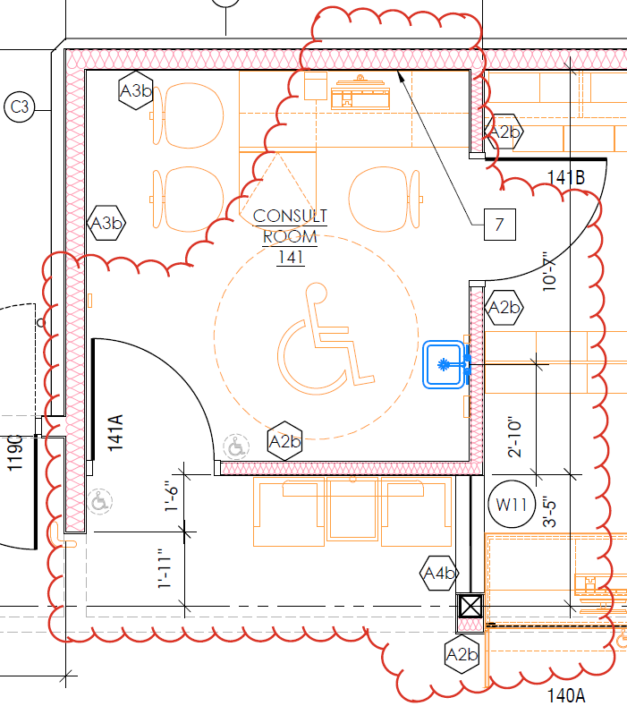
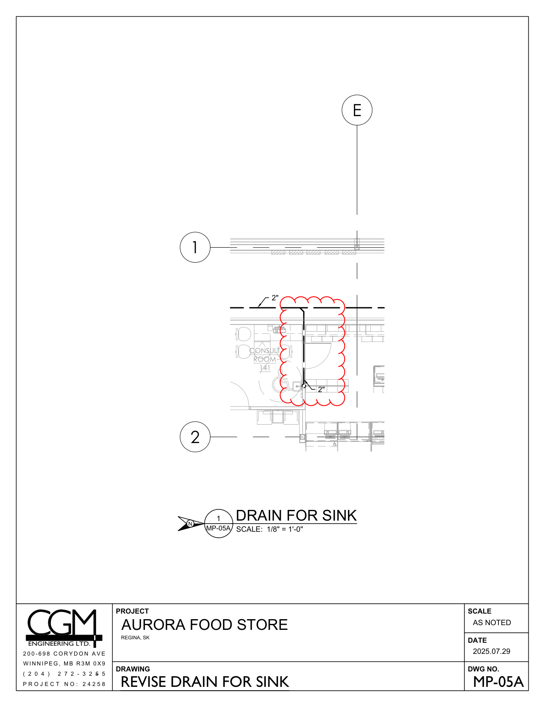
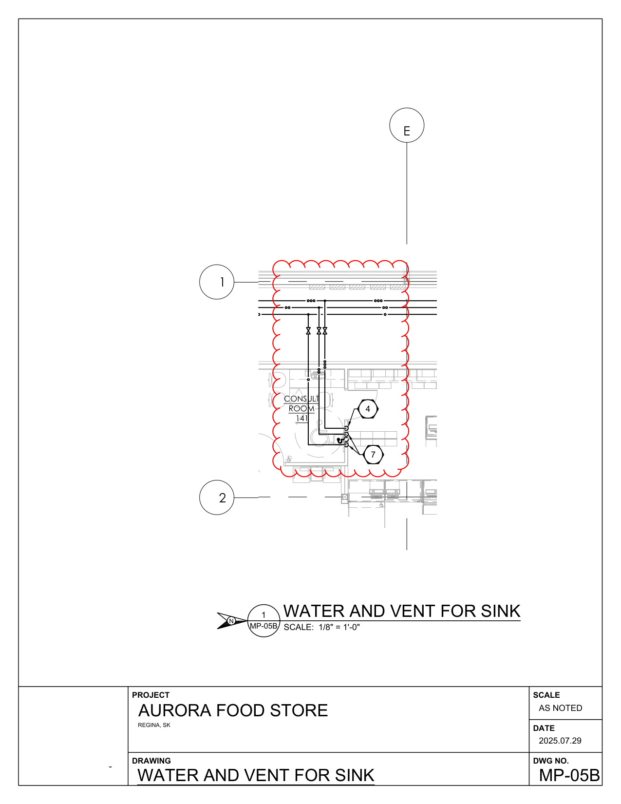

# PCN# 027 - Fixture Plan R03 Pharmacy Consultation Room

**Source**: `PCN# 027 - Fixture Plan R03 Pharmacy Consultation Room.pdf`  
**Pages**: 6  
**Extracted**: 2026-01-09 18:31:47

---

## Page 1

PROPOSED CHANGE NOTICE 

2445-27 

 
No work is to be done before this matter is finalized and a "Change Order" is issued.  This copy to remain with your office.  Do not return.  
Contractor to submit signed letter with price including cost breakdown and change (if any) to construction schedule.  Authority having 
Jurisdiction shall advise of any objections. 
 
 
TO: 
QUOREX CONSTRUCTION SERVICES LTD. 
 
 
 
1630A 8th Avenue,  
 
 
Regina, SK S4R 1E5 
 
 
RE: 
AURORA FOOD STORE 
 
 
2000 ANAQUOD ROAD 
 
 
REGINA, SK 
 
 
Commission No. 2445 
 
 
DATE: 
July 30, 2025 
 
 
PAGES: 
6 (including cover) 
 
 
RE: 
Fixture Plan R03 Pharmacy Consultation Room 
 
1.0 
ARCHITECTURAL 
 
 
.1 
Modify drawing A2.2 LARGE SCALE PLAN: 

 
Distribution: 
Sobeys Inc. – Jeff Craig 
jeff.craig@sobeys.com 
Sobeys Inc. – Shanwen Hsu 
shanwen.hsu@sobeys.com 
Quorex Construction Services Ltd. – Chris Walbaum 
c.walbaum@quorex.ca 
Quorex Construction Services Ltd. – Dustin Williamson 
d.williamson@quorex.ca 
Lavergne Draward & Associates Inc. – Charles Koop 
ckoop@ldaeng.ca 
CGM Engineering – Justin Albo 
justin_albo@cgmeng.ca 
CGM Engineering – Tony Mitousis 
tony_mitousis@cgmeng.ca 
CGM Engineering – Brendan Simpson 
brendan_simpson@cgmeng.ca 
 
 
 
 
 
Principal 
Kevin Fawley, SAA MRAIC 

## Page 2

PROPOSED CHANGE NOTICE 

2445-27 

 
 
Modify sink type/location as per Mechanical. 
 
Modify location of Pharmacy Consultation Room East wall. 
 
Modify wall type at window #W11 to be 8” steel studs with batt insulation in lieu of 3 5/8” studs. 
 
Modifications to the Pharmacy Storage Room noted on the Fixture Plan are not required. 
 
2.0 
MECHANICAL 
 
 
.1 
Refer to attached Mechanical PCN #05, dated July 29, 2025 (3 pages). 
 
 
Final sink selection to be clarified/determined at a later date. 
  
 
3.0 
OWNER 
 
 
.1 
Replace Fixture Plan R02 with the attached Fixture Plan R03 dated 2025-07-21 (1 page). 
 

## Page 3

 
MECHANICAL PROPOSED CHANGE NOTICE #05 
 
24-258 

Project: 
Aurora Food Store 
 
4801 Optimist Drive, Regina, Saskatchewan  
Subject: 
Revise the Pharmacy Consulate Room Sink 
Date: 
2025.07.29 
 

Subject: 
Revise the Pharmacy Consulate Room Sink 
References: 
Mechanical Drawing – M1.1 – Foundation Plan Plumbing and Pits  
 
Mechanical Drawing – M1.3 – Main Floor Plan - Plumbing  
 
 
 

1. 
Revise the pharmacy sink to a wall-mounted style. Revise the location of the drain, vent and 
domestic water lines as shown on mechanical revision drawings MP-05A and MP-05B. Final sink 
selection to comply with Saskatchewan Health Authority standards.  

Justin Albo, P.Eng. 
- 1 - 

200-698 Corydon Avenue     Winnipeg, Manitoba     R3M 0X9     204-272-3255     www.cgmeng.ca 

## Page 4

E

1

2"

CONSULT

ROOM

141

2"

2

SCALE:
N
MP-05A DRAIN FOR SINK

1/8" = 1'-0"
1

PROJECT 

SCALE

AS NOTED
AURORA FOOD STORE

REGINA, SK

DATE

ENGINEERING LTD.

2025.07.29

2 0 0 - 6 9 8  C O R Y D O N  A V E

W I N N I P E G ,  M B  R 3 M  0 X 9

DRAWING

DWG NO.

( 2 0 4 )  2 7 2 - 3 2 5 5

REVISE DRAIN FOR SINK
MP-05A

P R O J E C T  N O :  2 4 2 5 8

## Page 5

E

1

CONSULT

ROOM

4

141

7

2

SCALE:
N
MP-05B WATER AND VENT FOR SINK

1/8" = 1'-0"
1

PROJECT 

SCALE

AS NOTED
AURORA FOOD STORE

REGINA, SK

DATE

2025.07.29

DRAWING

DWG NO.

WATER AND VENT FOR SINK
MP-05B

## Page 6

FILE:C:\Users\HsuS\OneDrive - Sobeys\Documents\111 PROJECTS\AUROA SAFEWAY\000 FP\Aurora FP-R03.dwg
LAST SAVED BY:HsuS, 7/23/2025 4:17 PM

8.1

3

4

5

6

7

9

8

1

2

186'-2"

1

2

3

23'-7"
42'-10"
25'-9"
34'-1"
21'-5"
22'-5"
13'-0"
3'-1"

SPARE CO2 TANKS TO BE
STORED UNDER STAIRCASE

38'-0"

6'-8"

A

A
B

FP

2

STAIRS
#2

5'-2"
14'-2"

COMPACTOR PAD TO BE 4"
HIGHER THAN GROUND

18R
UP

18R
DN

4'-2"
7"
37'-8"

7"
19'-10"
6'-4"
11'-512"
7"
4'-2"

SERVICE MEZZANINE PLAN

1/8" = 1'-0"

GARBAGE
COMPACTOR

GLASS &
ORGANICS
RECYCLE
ROOM

8'-312"
8'-6"

CARDBOARD BALER

12'-0"

STAIRS
300A

EMERGENCY
CONDENSING
UNIT

FLOOR WASHING
MACHINE SUPPLIED BY
VENDER

FLOOR DRAIN

BUG
LIGHT

04.19

MIXING
STATIONHS c/w
EYE WASH

MOP
SINK

 EXTERIOR
HOSE BIB

04.17

POWER
JACK

CLEAN-UP
AREA

STACKER
JACK

1'-4"

±52'-0" CONCRETE PAD C/W %1 SLOPE

±53'-7" HEAVY DUTY ASPHALT C/W ±%5 SLOPE

CATCH BASIN CONNECTED
TO STORMWATER SEWER

43'-0"

COMPRESSOR
ROOM
933 SQ. FT.

42'-11"
35'-11"
33'-3"
35'-10"
44'-7"
28'-1"
42'-10"
37'-8"

MIXING SUPPLY

SPRINKLER ROOM

REFRIGERATION RACK

LINE OF COMPRESSOR ROOM
MEZZANINE ABOVE

15 PALLETS

12'-0"

RECEIVING
AREA

7

8

ALL DRAWERS &
DOORS MUST BE
LOCKABLE

8'-0"

CA0
RECEIVING
DESK

2'-0"

22'-212"

MOBILE PARM
CART STORAGE

STORAGE SPACE
FOR MOBILE PARM.
CRACKING TABLE

PROVISION OF
END GABLE

21'-10"

RAILING

5'-10"

12'-11"
8'-512"

EMERGENCY
EXIT DOOR
w/ PANIC
BAR (N)

DN
7R

5"

36" H SS FILLER

36" H SS FILLER

FP

1

B
C
D
E
F
G
H
J

B
C

1'-4"

STAFF / OFFICE MEZZANINE LAYOUT

1/8" = 1'-0"

6' S/S PREP. CABINET

20" MIN. CLEARANCE PREFERRED BEHIND
OVENS WHERE SPACE ALLOWS (MIN. 10")

50" DIGITAL TV-WM

1'-8"
1'-8"

1'-8"

MOP
CABINET

12'3" x2' RACKING

PRINTER
/FAX

WASTE
BIN

12'L / 20"B / 84"H

20'L / 20"B / 84"H

BAKERY
CABINET

6' SS PACKAGING
PREP. CABINET

BUG
LIGHT

SN-04L
3C-24X20

6'-0" STAINLESS STEEL
PREP. CABINET

9'-1112"
7"
24'-912"

8'Lx18"W SHELVING

HAND
SINK

16'-6"

ROTATING DOUBLE
RACK OVEN BAXTER
OV500G2-EE

ROTATING DOUBLE
RACK OVEN BAXTER
OV500G2-EE

12' FLAT BREADS
(84" H, C/W METAL FASCIA)

20' BULK SHELVING
(84" H, C/W METAL FASCIA)

DELI
COOLER
65 SQ. FT

BAXTER DOUBLE
WIDE
RETARDER /
PROOFER
BAXTER BRPW2S
60.5" DEEP

3 COMP. SINK
(20"x24") c/w D.B.

CCTV CABINET
BY LOSS PREVENTION
(25"Lx27"Wx35"H
  PTRK-1426MDK)

6' U/C PREP TABLE
C/W UPPER CABINET

1'-0"
3'-4"

8'Lx18"W SHELVING

BAKERY FREEZER
206 SQ.FT

WRAPPER

CHEESE
PREP. AREA

5'-0"
#5-BAKERY
COOLING CARTS

8'-612"

CLEANING
STATION

3'-8"

3'-8"

FILE
MAINT.
OFFICE
DEP.
MAN.
OFFICE

BREAD
SLICER

LED BILLBOARD
ABOVE
(12' 7"W x 7' 1"H)

7'-6" IN STORE
BULK BAKERY

3'W x 7'H SLIDER

BULK FOOD

FULL HEIGHT WALL

54"H WALL C/W
S.S. WALL CAP

SC/PR

12'-6"

8' REF. U/C UNIT

HS c/w
EYE WASH

MILLWORK
FILLER

3'-1"
3'-9"

STORE MAN.
OFFICE

9'-5"

DLPC8
HP

SLICER

CHEESE
GRATOR

CCTV

WASTE
BIN

9'-6"

DELI
PREP. AREA

S.S. FILLER

3'-8"

FIRST AID
KIT
STAFF
ROOM

50" TV - WM

17'-2"
27'-2"
16'-0"
4'-5"
5"

WASTE
BIN

SC/PR
SC/PR
SC/PR

2'-9"

7'-6" COUNTER c/w COUNTERTOP
SINK & FAUCET & UPPER CABINETS

36"x10" PHONE
SYSTEM
TERMIN.BOX

5'-9"

1'-10"

BUG
LIGHT

CASH
OFFICE
IT ROOM

2'-6"
2'-6"

DLPC12
HP

MAN.
W.S.

4'-0" MIN.

BAGUETTE
ARTISAN

SCRATCH
BAKERY
PREP. AREA

4'-0" MIN.
8' BREAD DISPLAY

FOAMING
STATION

MICROWAVE

IT RACK
36"x24"

#3-DELI BUDDY c/w SLICER & 6KG SCALE

WHITE CURLY
CORDS FOR
POWER FOR
ALL DELI BUDDIES

FRIDGE

BUG
LIGHT

DEMO LOCATION ONLY (TO
BE STORED IN PREP AREA)

10'-0"
5"
8'-012"
5"
8'-6"
5"

WALL MOUNTED T.V.

20' 1D REF. SS CHEESE

20' REF. SERVICE DELI

DIGITAL TV

MW
(UNDER)

12' SERVICE CABINET PREP TABLE

STEPPED
MILLWORK
FILLER

FLIP-UP

WASTE
BIN

5'W x 8'H SLIDER

6' SS STAGING TABLE
c/w UPPER CABINET

IT RACK
36"x24"

WASTE
BIN

G2V-B41-12
AN

1'-10"

3'-8"
3'-8"

SPIRAL MIXER

CREAMER

2 BAKERY TABLES

7'-0"
6'-11"

5"
3'-10"
3'-0"
3'-0"

MEN'S  WR

2 BAKERY TABLES

8'-0"

WOMEN'S
WR

1'-10"

WATER FILTER

CHOC.
WARMER

7'-6"

16'-0"
8"
5"
12'-0"
5"
5"
5'-3"
4'-0"

MOBILE
PARM
CRACKING
TABLE

36'-9"

6'-0"

eLEARN
OFFICE

PRINTER
/FAX

FLOOR SCALE

CAKE
ORDERING
STATION

3'-6"

50" DIGITAL TV-WM

ELECTRIC
HAND DRYER
C/W OPTIONAL
BACKPLATE
(TYP.)

3 BAKERY DISPLAY TABLE

80QT. MIXER

3'-7"

5"
4'-6"

5"

BULKHEAD (N)
@ 8' 6" AFF

6-PAN, 6-WELL
REF. OLIVE BAR

7'-1"

42'-5"

FINISHED
MILLWORK BACK

FLIP-UP

MILLWORK
VANITY

MILLWORK
VANITY

4'x8' PREP. TABLE

BRSPM
CD

ROUNDER

BRSPM
CD

10'-7"

4' S/S SEALING
TABLE c/w UPPER
CABINET

G2V-B41-8
AN

SHEETER

12' 4D REF. SERVICE
BAKERY (CAKES)

#5-BSR4
DP

9'-312"

5'-8"

OB-6-SOB
CD

4'-3"

8'-0"

POWER FED
FROM UNDER
CASE (BOTH SIDES)

DIVIDER

FIRM
WARE
SCALE

7'-3"

CHEESE DISPLAY
NESTING TABLES

16'L / 20"B / 72"H

HS c/w
EYE WASH

INGREDIENT BINS
WILL BE UNDER
THE MAIN
WORKING TABLE

8'-112"
1'-6"
8'-112"

5"

3'-8"

PRINTER
/FAX

BULLETIN BOARD

7'-2"

(SAME SPEC AS BAKERY)

4'-8"

2'-6"
5'-912"

5'-0"

5'-5"

5'-0"

                           8' 5D REF. SS DELI

7'-7"
6'-2"
8'-012"

4'Wx7'H
DOUBLE
IMPACT DOORS

4'Wx7'H
DOUBLE
IMPACT DOORS

9'-5"

7'-4"

8'-10"

MILLWORK
FILLER

#3-BSS4
DP

W/ DEEP &
SHALLOW
RACKS

3 COMP. PREP. SINK (24"x30") c/w
DRAINBOARD & 16" SHEF ABOVE

7'-0"

12' 3D SS BAKERY

7'-6"

20'  5D REF. SERVE SERVE DELI & CHEESE

3 BAKERY DISPLAY TABLE

EMERGENCY
EXIT - TBC
5"

STORAGE

POT WASHER

G

5'-4"

28' COMMERCIAL BAKERY (84" H, C/W METAL FASCIA)

COAT RACK

COAT RACK

3'W x 7'H SLIDER

DN
19R

16' ETALEX
FLORAL DISPLAY

5'-3"

5'-3"

8'-0"

NOVA-FL-3T-487250
CD

AN
PL5MF12

PP

5'-4"

AN
PL5MF8

M

M

 2 1
2" DIA. STAINLESS
STEEL BOLLARD ON
BOTH SIDES OF
IMPACT DOORS (TYP.)

ARMORED
CASH SAFE

28'L / 20"B / 84"H

AN
PL5MF8

11'-9"

FILING
CABINET

20"BASE

#6-BAKERY
COOLING CARTS

BAKERY
COOLER
95 SQ.FT

BLACK FABRIC BLACKOUT CURTAINS
W/ CENTRAL PULLS TO BE MOUNTED
TO U/S OF CEILING & LOCATED BEHIND
DISPLAY SHELVING

RL5D
HM
RL4D
HM
RL5D
HM
RL5D
HM

4'Lx18"W SHELVING

NOVA-FL-3T-487250
CD

HM

RL3D

3D (6'7") FROZEN BAKERY

12' LOW PROFILE
REF. FLORAL (50"H)

4'-5"

8'-1"

10'-412"

7'-5"

G

PP

UP
19R

8'-2"

(POTENTIAL LOCATION

19 DOORS (47'7") FROZEN FOOD

36"Lx72"H

BY THE REGION)

OF LIFT IF REQ.

STORAGE

ELECTRIC
HAND DRYER
C/W BACKPLATE

8'Lx18"W SHELVING

24"X24"X72"
AIR FILLED
BALLOON
DISPLAY

5"
7'-0"
5"
5"

UNIVERSAL
WASHRM.
SPACE FOR MOBILE
CHANGE TABLE
(6'-0"x2'-6")

5'-2"
FIRST
AID

6"
6"

BLACK GALVANIZED

24"Wx72"H FRAMELESS
GLASS DOORS W/ 4"H BASE

FLORAL
COOLER
75 SQ.FT.
9'-0"

5'-1"

3- TIER FLORAL DISPLAY (X2)

11'-0"

8'Lx18"W COOLER SHELVING

9'-1"
9'-0"

FOAMING
STATION

10'-5"

6'-9"

TRANSFER
SPACE
(5'-0"x3'-0")

9'-8"
13'-6"
9'-8"
13'-6"

9'-8"
13'-6"

9'-8"
13'-6"

9'-0"

9'-4"

REMOTE PREFERRED. SELF
CONTAINED ALSO AVAILABLE
AS APPLICABLE; TO BE
DETERMINED BY PM.

LOCKABLE SOLID
DOOR WITH HALF
SIZE SCREEN &
CARD READER

22 DOORS (55'3") FROZEN FOOD

26"x26"X72"
SINGLE
BALLOON RACK
(FREESTANDING)

INGREDIENT
INGREDIENT

TIME
CLOCK

8'-4"

HELIUM
TANK

9'-10"

FORWARD
APPROACH

3D  D/T  - FROZEN

RL5D
HM
RL4D
HM
RL3D
HM

RL5D
HM
RL5D
HM

+ 76' LF INLINE - 111' TOTAL DAIRY

PB

8'DAIRY

IDD5SU-8
HM

TO8
AN

TO-G
AN

5"

TO-G
AN

3'W x 7'H

RL3D
HM

SHELF ABOVE

MOP SINK

PB

14 (35'LF) REAR FED DOORS

2'-10"CLEAR
(OBC)

FLORAL PREP
AREA

EYE
WASH

JAN.
ROOM

12"D GLASS SHELVING ABOVE

RL5D
HM
RL4D
HM
RL3D
HM
RL5D
HM
RL5D
HM

DEDICATED
H/C WATER
SUPPLY FOR
CHEM. DISP.

8'-1112"

DAIRY DOORS

28'0"  D TEMP BAKERY
INGREDIENT
INGREDIENT

PB

8'-0"

22 DOORS (55'3") FROZEN FOOD

6" DISPLAY
SHELVING BELOW

14 REAR FED DAIRY DOORS

93 FROZEN
FOOD DOORS
+
9 FOR FROZEN
MEAT

ELECTRIC
HAND DRYER
C/W BACKPLATE

36"Lx72"H
36"Lx72"H

9'-0"

PB

37'-0" MIN FOR 14 DOORS

SPACE FOR MOBILE
CHANGE TABLE
(6'-0"x2'-6")

DAIRY COOLER
540 SQ. FT

7'-6"
7'-6"

DRAWER

4'-0"

2'-6"

BF
W/M

CASH
DRAWER POS

37'-8"

7'-5"

5'-1"

INGREDIENT
INGREDIENT

WRAPPING
STATION

8'-6"

24 DOORS (60'4") FROZEN FOOD

TO8
AN

TO-G
AN

TO-G
AN

3D  D/T FROZEN

R2'-0"

20' CARLTON CARDS (VENDOR SUPPLIED)

RL5D
HM
RL4D
HM

RL5D
HM
RL5D
HM
RL5D
HM

8' EGGS

12"H GLAZING
C/W POSTS
FASTENED TO
COUNTERTOP

IDD5SU-8
HM

 20.5"B / 72"H

 20.5"B / 72"H

RL3D
HM

6'-4"

28'0"  D TEMP FROZEN
INGREDIENT
INGREDIENT

IDD5SU-12
HM
IDD5SU-12
HM

IDD5SU-12
HM

IDD5SU-12
HM

IDD5SU-12
HM

9'-0"

MILK & JUICE RACKS AND ROLLERS (N)

8'-2"

EMERGENCY EXIT (TBC) C/W PANIC
HARDWARE & DELAYED EGRESS
EXACT LOCATION TBD BY
ARCHITECT TO SATISFY  TRAVEL
DISTANCES AND LOCAL A.H.J.

30"W DAIRY
DOORS

7'-10"

5'W x 8'H SLIDER

36"Lx72"H

6CAYUGA
FLORAL TABLES

36"Lx72"H

CAYUGA

CAYUGA

60' REFRIGERATED DAIRY

CAYUGA

5'-0"

60"L x 30"W VENDOR SUPPLIED GIFT
CARD ISLAND

STAFF ENTRANCE/
EMERGENCY EXIT (TBC)
C/W CARD READER,
PANIC HARDWARE &
DELAYED EGRESS
(15 SECONDS)

TB-N-110 GM

TB-N-110 GM

TB-N-110 GM

MILLWORK
FILLER

INGREDIENT
INGREDIENT

CAYUGA

CAYUGA

CAYUGA

3'-7"
8'-6"
3'-7"
3'-7"
3'-7"
3'-7"
3'-7"
3'-7"

7'-0"

8'Lx18"W COOLER SHELVING

TO8
AN

TO-G
AN

TO-G
AN

5'-1"

EQ.

6'-4"

BULKHEAD @
8'-6" (TYP.)

8'-8"

FINISHED
MILLWORK BACK

68'L / 20"B / 72"H

6'Wx8'H DOUBLE
IMPACT DOORS

DRYWALL CEILING @ 9-0" A.F.F.

20"BASE

20"BASE

12' FLORAL STEPS

7'-6"

6'-4"

68'L / 20"B / 72"H

28'0"  D TEMP DAIRY
INGREDIENT
INGREDIENT

D.1
E.1
E.2
F
F.3
G.1
H

12'-10"

5'-2"

7"

PP

WING

9'-0"
3'-10"

ICE
COOLER

8'-0"
6'-0"
6'-0"

RAIL

10'-2"

7"
SOUND PROOF PHARMACY  EXTERIOR
WALL (IF BACKING BACKROOM AREA)

3'-4"

7'-0"
7'-0"
7'-0"
7'-0"

ABHR
DISPENSER

PB

LOCKABLE
DOOR
W/
PRIVACY
SIGN

CONSULT.
ROOM
102 S.F.

96-62-48 LH 
LCR

WAITING AREA 30 S.F

18"D FOLDABLE
FROSTED PRIVACY
PANEL

12'L / 14"B / 60"H

DIGITAL TV
MOUNTED @ 6'-0"
A.F.F. TO U/S

14"BASE

GLAZING WITH
FROSTED FILM C/W
FRAMES @ 48" AFF

14"BASE

PB

6'-3"

FOLDING
TABLE

4'-9"
CRITICAL
3'-0"

ENDCAP
MERCH.

68'L / 20"B / 72"H

10'-0"
5"
35'-512"

7
1

20"BASE

20"BASE

12'L / 14"B / 60"H

THERMAL
PRINTER

Ø5'-4"

20'-0"
20'-0"
20'-0"
3'-5"
9'-4"
8'-9"
8'-9"
17'-4"
8'-9"
8'-9"
9'-3"
4'-10"

50" TV - WM

25"D FOLDABLE
FROSTED PRIVACY
PANEL
CUSTOMER FACING
REMOVABLE POLYCARBONATE
BARRIERS, BY VIC (TYP.
@ BOTH PICK-UP & DROP-OFF)

68'L / 20"B / 72"H

30"
FILING
DRAWER

PP

COMPUTER
TERMINAL

WG

3'-4"

PP

WING

WALL-MOUNTED
HAND SINK

6'-6"
6'-0"
6'-0"

PAPER
TOWEL
DISPANSER

3'-2"

5'-9"
(5'-0" CRITICAL)

PLUMBING FURRING WALL

SOAP
DISPANSER

WC2557
QBD

5'-5"
(5'-0" CRITICAL)

96-62-48 LH 
LCR
96-62-48 LH 
LCR

LOCKABLE
DOOR
W/
PRIVACY
SIGN
LOCKABLE
DOOR

9"

5
6
3
4

7'-0"

7'-0"

34"H

39"H
39"H
39"H

12'L / 14"B / 60"H

120VT REC @60"AFF
WATER BOTTLE
RACK

14"BASE

14"BASE

4'-0"
4'-0"
3'-6"
3'-6"

WILL CALL SHELVING

12'-0"

MODULAR Rx STORAGE SHELVING

5'-4"

12'L / 14"B / 60"H

COMPUTER
TERMINAL
COMPUTER
TERMINAL
COMPUTER
TERMINAL
COMPUTER
TERMINAL
COMPUTER
TERMINAL

GROCERY
1080 L.F. NOT INCLUDING BULK, COMMERCIAL
BAKERY, OTC, RACHELLE BERY, BABY
BOUTIQUE
(INCLUDING HABA & SEASONAL)

BELT MERCH.
(TYP)

PICK UP
/ CONS.
20 S.F.

4'-8"

3'-8"

68'L / 20"B / 72"H

3'-4"

PP

20"BASE

20"BASE

8'-0"

WG

SECOND ROW SHELVING FOR MEDIUM Rx ONLY

68'L / 20"B / 72"H

301'-1"

3'-2"

WATER DISPENSER
 & RACK

132' OTC

16'-0"
4'-0"
16'-0"
4'-0"

PP

WING

10'-0"

OUTDOOR SEATING AREA

6' WORKING
COUNTER-39"H

OTC SHELVING  BY VIC

 U/C FRIDGE

78'-1012"
150 SHOPPING
CARTS

ENDCAP
MERCH.

COMPUTER
TERMINAL
COMPUTER
TERMINAL

10' (10"B x 54"H) DIABETES SHELVING

10' 39" H PROFESSION SERVIVE AREA

12'L / 14"B / 60"H

14"BASE

14"BASE

DISPENSARY 435 S.F.

THERMAL
PRINTER
THERMAL
PRINTER

MOBILE FLORAL
WRAPPING STATION

10"

2 1
2"x2 1
2" ALUMINUM POST SECURE
TO THE BULKHEAD ABOVE AND
FINISHED FLOOR C/WITH DOUBLE
SIDED SCRUTINY GRILL GUIDE
TRACK

12'L / 14"B / 60"H

15'-6"

8'-10"

16" HIGH CLEAR GLAZING ON
TOP OF MILLWORK CAP.

3'-4"
3'-4"

PP

WG

NARC
SAFE

50'-1112"

96-62-48 LH 
LCR
96-62-48 LH 
LCR
96-62-48 LH 
LCR

68'L / 20"B / 72"H

6' WORKING
COUNTER-39"H

20"BASE

20"BASE

11'-4"

COMP. EQ.

THERMAL
PRINTER

12'L / 12"B / 54"H

WC2557
QBD
WC2557
QBD

2'-112"

3'-0"

68'L / 20"B / 72"H

FUTURE LOCATION OF COUNT ASSIST.
ROUGH-IN ONLY FOR FUTURE
GROWTH. CONFIRM FEASIBILITY WITH
VP OPS & MILLWORK VENDOR, AS
APPLICABLE TO PROJECT SCOPE.
ELECT. & DATA 6"ABOVE TOP RAIL

12'L / 14"B / 60"H

PP

WING

14"BASE

14"BASE

FOOD
BANK

COINSTAR
FOOD
BANK

2'-6"

3'-4"

3'-2"

12'L / 14"B / 60"H

DROP OFF 20 S.F.

8' WORKING COUNTER 39"H

AMSTEL ROLL-AIR (PERFORATED)
AUTOMATED PULL-DOWN SHUTTER (OR
APPROVED EQUAL).  SEE BASE
BUILDING DRAWINGS FOR
CONNECTION AND
BULKHEAD DETAILS.

PP

WG

60"Lx10"Bx60"H BTC

3'-1"

COMPUTER
TERMINAL
COMPUTER
TERMINAL

THERMAL
PRINTER

RUG DOCTOR

FAX

THERMAL
PRINTER

4' 5D BEVERAGE

ENDCAP
MERCH.

IRON
MOUNTAIN
SHREDDING
BIN

BOTTLES &
MIXER
DRAWER
24" FRIDGE

34"H

68'L / 20"B / 72"H

PL5-1-4

20"BASE

AN

39"H

12'L / 14"B / 60"H

14"BASE

68'L / 20"B / 72"H

14"BASE

SS COUNTERTOP

8' COMPOUNDING WORK STATION

ATM

RB LVT FLOORING OUTLINE

UPPER CABINET

DRYWALL
CEILING @
9-0" A.F.F.

12'L / 14"B / 60"H

5'-10"

PP

3'-2"

LED BILLBOARD
ABOVE
(12' 7"W x 7' 1"H)

PP

2

LOCKABLE
DOOR

WG

4'-2"

5'-4"

IDF CLOSET
@9'AFF

4'-4"

7'-0"
7'-0"

6'-8"

10'-6"

EYEWASH
STATION

BPM

COMPUTER
TERMINAL

THERMAL
PRINTER

3'-4"

5"
4'-8"
7"

20'L / 20"B / 72"H

SHELVING BY SCHWEITZER

PHARMACY
STORAGE
70 S.F.

44'L / 20"B / 72"H

12'L / 14"B / 60"H

20"BASE

20"BASE

14"BASE

14"BASE

SHELVING BY SCHWEITZER

R15'-6" LVT FLOORING
RACHELLE BERY ONLY

4'L-18"
METRO
SHELVING

5'-412"
96-62-48 LH 
LCR

16'-0"

12'L / 14"B / 60"H

8'-2"

44'L / 20"B / 72"H

8' 4D REF. PREPARED FOOD

8' 4D REF. PREPARED FOOD

MERCHANDISER
SLAT WALL (BELOW)

1'-4"

8' 4D REF. PREPARED FOOD

G

G

PP

WING

12"D MILLWORK SHELVING BY GC

MILLWORK & SHELVING SUPPLIED BY
SCHWEITZER

7'-0"

P.O.S. STATION c/w
HAND HELD SCANNER

PV3-1-8
AN

6'-0"

14'-3"
7"

5"

SEE F-DETAIL 214
FOR TOBACCO
DRAWERS & 211
WITHOUT TOBACCO

PV3-1-8
AN

PV3-1-8
AN

92' RACHELLE
BERY
SHELVING

3'-8"

8'-0"

HOSE BIB

PV3-1-8
AN

S.S. GAP FILLER BY
G.C. (LEAVE 2" GAP
BOTH ENDS)

SHELVING BY SCHWEITZER

RB DESK WITH
OUTLET FOR
LAPTOP ABOVE

12 PALLETS

12'L / 14"B / 60"H

MAGAZINE UNDER

E.3

G

G

15'-1112"

44'L / 20"B / 72"H

PRO-BIOTIC REF.
R2048UHGD-SC-SP

2'-1112"

6"ABOVE
COUNTER

20"BASE

20"BASE

8'L / 14"B / 60"H

8' 4D REF. PREPARED FOOD

7'-3"

4'-0"

14'-512"

1'-6"

44'L / 20"B / 72"H

 QUEUING CHECKOUT
BRUSHED SS RAILING

24LFT OF RACHELLE BERY
WALL SHELVING WHERE
SPACE ALLOWS

PP

WING

6'-0"

2 BAG S/S
NARROW
2 BAG S/S
NARROW
2 BAG S/S
NARROW
3
2
1

8'-3"
7'-11"

8'-7"

5'-2"

3'-7"
6'-6"

6'-4"

FDC

REF. SNACK
BAR

12'L / 14"B / 60"H

14"BASE

14"BASE

12'L / 14"B / 60"H

BULKHEAD @ 8'-6"
(TYP)

24'3" RACKING
16'2" RACKING - PRODUCE SUPPLY

8"D, 42"H -4' INCREMENT
QUEUING MERCHANDISER

44'L / 20"B / 72"H

TRENT
AN

9'-312"

6'Wx8'H DOUBLE
IMPACT DOORS

20"BASE

20"BASE

SHELVING BY SCHWEITZER

RAC
STATION

10'-0"
(10'-0"MIN.)

F.1
G.2

6'-4"
6'-5"

44'L / 20"B / 72"H

2'-7"
TYP.
2 BAG S/S
2 BAG S/S
2 BAG S/S

MOTORIZED
SHOPPING CART
SEATING AREA

6'-6"

6

4'-1"

Ø6'-0"TYP.

PP

WING

REGULATIONS/ PROTOCOLS

(4'-0" MIN.)

20'-7"

***AS PER COMPLIANCE

20 SEATS

WITH CURRENT HEALTH

TRENT
AN

RACHELLE BERY
MANAGER DESK

24' 5D REF. PACKAGED MEAT

6'-5"

3'-7"
6'-6"
6'-6"

G

BULKHEAD (N)
@ 8' 6" AFF

REF. SNACK
BAR

MAN.
W.S.

8'-0" TYP.

SEASONAL DROP ZONE
PALETTE DROP OR LP SHELVING

 (84" H, C/W METAL FASCIA)

8'-0"

20'L / 20"B / 72"H

20'L / 20"B / 84"H

AN
PL5MF12

42" DRY SUSHI
6' SS SUSHI

G.3
F.2
H.1

20"BASE

20"BASE

4'-0" MIN

4
5

12'3" x2' RACKING FOR CLEANING SUPPLY

POS

FILLER BY GC
 (HABA 20' L X 84" H X 24" BASE, C/W METAL FASCIA)

20'L / 20"B / 72"H

4' COLD SIDE
& SALADS

HAND
SINK

LED BILLBOARD
ABOVE
(12' 7"W x 7' 1"H)

6'-3"

WRAPPER
SLICER

SC/PR

SC/PR

14'-4"

100' HABA

PP

WING

8' FREEZER U/C PREP TABLE
C/W UPPER CABINET

8' REF U/C PREP TABLE
C/W UPPER CABINET

5'W x 8'H SLIDER
5'W x 8'H SLIDER

DP
T011-4

BUG
LIGHT
HAND SINK
EYWASH

10'-0" SLIDER

CONDIMENT STAND /
GARBAGE COUNTER

PV3-1-6
AN

MICRO

5'-6"

5'-6"

HOOD  ABOVE
c/w SUPPRESSION

8'-0"  MIN.

MOBILE
W.S.

BLACKOUT FILM
ON INTERIOR FACE OF
GLAZING TO TOP
OF CARD DISPLAY.
MATCH EXTERIOR
SPANDREL COLOUR.

BLACKOUT FILM
ON INTERIOR FACE OF
GLAZING TO TOP
OF CARD DISPLAY.
MATCH EXTERIOR
SPANDREL COLOUR.

BLACKOUT FILM
ON INTERIOR FACE OF
GLAZING TO TOP
OF CARD DISPLAY.
MATCH EXTERIOR
SPANDREL COLOUR.

6' HOT CHICKEN
ISLAND
S.S. GAP
FILLER BY
G.C. (LEAVE
2" GAP BOTH
ENDS)

HMR CLEARANCE

8' REF.  PREP TABLE
C/W UPPER CABINETS

HARDT-IS6
HT

8'-0"

8' S/STEEL FROZEN U/C UNITS

GROCERY FREEZER

20'L / 20"B / 72"H

20"BASE

20"BASE

8'-0" REF. SERVICE HOT
FOODS (INDUCTION
UNIT, NO ATER)

5'-9"

3'-7"
2'-8"
2'-8"

7'-0"

WASTE
BIN

20'L / 20"B / 72"H

AN
PL5MF12

24'3" RACKING

CLEAN
DISHES
METRO
SHELV.

50" TV -  WM

DEEP
FRYERS
(MOBILE)
STACKED
RATIONAL 62G

FOAMING
STATION

9'-412"

 364S.F

PP

WING

25'-5"

HP

HP

10'Lx10'W FLOOR MAT

PVO3-2-8
AN

NO BACK SPLASH FOR THE FRONT PREP TABLES  WITH POWER SUPPLY

PVO3-2-12
AN

BULKHEAD (N)
@ 8' 6" AFF

6'-10"
6'-10"
6'-10"

27" FREZ.
/ PREP
TABLE
PITCO
RTLZ.

5'-4"

8'-412"

16'L 18" METRO SHELVING -TBD - 8' MIN

3 COMP SINK c/w
O/H DRAINBOARD

3'-9"

12"D SHELF (ABOVE)
12"D SHELF (ABOVE)

16'2" RACKING

SEPARATION FENCE
BETWEEN FREEZERS

14'-0" SLIDER

16' X 60"H BABY BOUTIQUE SHELVING

10'-0"

20' 3D REF. GRAB AND GO

M

6'-0"

3'-0"
3'-0"

SC/PR

8'-3"

(14"BASE C/W 14" SHELVES)

12' SERVICE ENTREES / SIDES

48' 5D REF. FRESH MEAT

M

4'-7"

14"BASE

14"BASE

10'-2"

20'-9" (10'-0"H WALL)

3'-11"

6' BEVERAGE

28'0"  D TEMP MEAT
INGREDIENT
INGREDIENT

8'-3"

10'-0" SLIDER

(24"BASE C/W 24" SHELVES & 12" EXTENDER & ACCENT BAND)

24' X 84"H BABY BOUTIQUE SHELVING

6' S/S PREP. CABINET
NO BACK SPLASH

 BABY BOUTIQUE
112 FT

4'-5"

STAND UP DISHWASHER c/w SHELF BELOW
& O/H DRAINBOARD

19'-7"

16' X 60"H BABY BOUTIQUE SHELVING (PEGGED)

12'-312"

AN
PV03-8-6

BMD-12
HP
FC8-SNDW PREP
HM

4" CONCRETE
CURB TYP. IN
BACKROOM AREA

50" TV -  WM
50" TV -  WM

BLAST CHILLER
TBC 5

(14"BASE C/W 14" SHELVES)

TO-G
AN

TO-G
AN

VF6-12
AN
VF6-8
AN
VF6-12
AN

8' COMPL. & SALAD

TO8
AN

150(25x6) CARTS

ILLUMINATED
CANOPY

8' SS SANDWICH

8'0" RACKING

5'-0"

FOAMING
STATION

AN
PV03-8-8

AN
PV03-8-8

16' X 60"H BABY BOUTIQUE SHELVING

3'-012"

12'3" x2' RACKING

STACKED
RATIONAL 62G

(14"BASE C/W 14" SHELVES)

75" TV - WALL MT

14'-4"

INGREDIENT
INGREDIENT

BULKHEAD (N)
@ 8' 6" AFF

SC/PR

8' S/S PREP. CABINET
NO BACK SPLASH

14"BASE

5'-3"

POWER
REQ'D

R-3024 (S/C)
CD

8'-5"

AMANA
OVEN

CANOPY ABOVE

9'-0" H WALL

(6) 3'-0" x 3'-0"
ORCHARD BINS

8'-0"
12'-512"

11'-1012"

8' MTO SER. SANDWICH

EMERGENCY EXIT (TBC) C/W PANIC
HARDWARE & DELAYED EGRESS EXACT
LOCATION TBD BY ARCHITECT TO SATISFY
TRAVEL DISTANCES AND LOCAL A.H.J.

INGRADIENT
FACING MAIN
PATH OF
TRAVEL (TYP.)

3'W x 7'H

48' 5D REF. PREPARED PRODUCE

M

8'-0"

16' X 60"H BABY BOUTIQUE SHELVING

3'-9"
HAND
SINK

MEAT/KITCHEN
FREEZER

SC/PR

WASTE
BIN

AN
PV03-8-6

8'-11"

SCREEN ON THE BACK
OF THE REF. CASE BY GC

(14"BASE C/W 14" SHELVES)

BUG
LIGHT

3'-5"

5'W x 8'H SLIDER

7'-7"

20'L 18" METRO SHELVING

20'L 18" METRO SHELVING

ILLUMINATED
CANOPY

18'5" x2' RACKING

BABY SIGN
SUPPLIED &
INSTALLED BY
TC C/W
MOUNTING
HARDWARE.
SUSPENDED @
9'-0" A.F.F.

6' REF U/C PREP TABLE
C/W UPPER CABINET

28'0"  D TEMP MEAT
INGREDIENT
INGREDIENT

DBL DECK
TURBO
CHEF

 266S.F

18'-7"

6' PROMO

PL5LF12
AN
PL5LF12
AN
PL5LF12
AN
PL5LF12
AN

KITCHEN
COOLER

24' X 72"H BABY BOUTIQUE SHELVING

 89S.F

11'-9"

(24"BASE C/W 24" SHELVES & 12" EXTENDER & ACCENT BAND)

SECONDARY
BULKHEAD (N)
@ 7' 0" AFF

7'-1012"

4'-212"

TO-G
AN

TO-G
AN

8'-6"

5'-812"

9'-0" H COOLER PANEL

TO8
AN

4'-7"

8'-8"

2 DOOR FREEZER
TRAULSEN G22010

SLAT WALL
BY GC

50" TV -  WM

CWC-8R-RLS
HP

FILLER BY GC

ORCHARD
BIN

RL4D
HM

RL5D
HM

8' PIZZA DISPLAY

36"Lx72"H

4'-0"

8'-2"

INGREDIENT
INGREDIENT

8 PRODUCE DISPLAY TABLES AND TWO ENDS

8'0" RACKING

7'-1"

4 DOORS (10'3") FROZEN MEAT

5 DOORS (12'9-1/2")  FROZEN SEAFOOD

4'-9"

MILLWORK
FILLER PIECE BY GC

8'-10"

6'-0"

16'L / 20"B / 84"H

DP
SOUP/ RDEL

8'0" RACKING

8'-6"

3 TIER
MILLWORK
FILLER PIECE
BY GC

BULKHEAD (N)
@ 8' 6" AFF

10'-3

3'W x 7'H

4' HOT & COLD SOUP

14'-4"

SEASONAL

12

"

 (84" H, C/W METAL FASCIA)

8'-9"

16' DUNNAGE c/w 18"B SHELF ABOVE @5'AFF

FILLER BY GC

BULKHEAD (N)
@ 8' 6" AFF

6'-4"

M

8'-0"

6'-0"

4'-2"

10'-0"

12'  4D REF. SELF SERVICE
FRESH MEAT

OUTLINE
DISTANCE OF
POWER JACK
& PALLET

VF6-8
AN
VF6-8
AN

9'-512"

GROCERY
DUMP
TABLES

INGREDIENT
INGREDIENT

G

MANGR.
W.S.

16'2" RACKING
6'2" x2' RACKING

6' SS PREP TABLE c/w
6' BOAT RACK ABOVE

8' BOAT RACK
ABOVE

FOAMING
STATION

3 COMP. SINK (20"x24")
c/w DRAINBOARD

16' 3D REF. PRODUCE

6'-0"

6' 3D REF. PRODUCE

SLICER

PV3-2-6
AN

7'-6"

TO12
AN

TO-G
AN

TO-G
AN

MEAT COOLER

8'-512"

8'-0"

ROTARY
CART

HS

8'-6"

PV3-1-12
AN

G

M

WASTE
BIN

NON-REFRIGERATED
BUTCHER SHOP

FIRM
WARE
SCALE

 446S.F

7'-0"MIN.

31'-1"

8 PRODUCE DISPLAY TABLES AND TWO ENDS

PV3-2-8
AN
PV3-2-8
AN

3'W x 7'H
D-SWING

30 DRY TABLES INCLUDING
 ENDS, POTATO (NOT
INCLUDING WOW)

INGREDIENT
INGREDIENT

WASTE
BIN

36'0"  D TEMP SEAFOOD

MEAT PREP
372 SQ.FT

6'-4"

8' SERVICE MEAT

3'-9"

HS c/w
EYE WASH

3 TIER/ STEP MILLWORK
FILLER TO MATCH HEIGHT
OF ADJACENT 4D CASE
BY GC

8' S/S PREP. CABINET

WRAPPER

3 TIER MILLWORK
FILLER PIECE BY GC

BULKHEAD (N)
@ 8' 6" AFF

TNDRZR.

4 PRODUCE DISPLAY TABLES

4 PRODUCE DISPLAY TABLES AND TWO ENDS

GLAZING @54" AFF

9'-0"

5'W x 8'H SLIDER

6'-3"

GMD8
HP

INSTALL POWER
FOR FUTURE AUTO
WRAPPER

BULKHEAD (N)
@ 8' 6" AFF

6' SS PREP TABLE

50" TV -WM

3'-9"

FLIP-UP

7'-0"

6'-0" STAINLESS STEEL
TABLE c/w SANI-TOP

LOBSTER
TANK

LOBSTER
TANK

4'-0"

ROTARY
CART

3 TIER MILLWORK
FILLER PIECE BY GC

SC/PR
c/w SH

M

WASTE
BIN

8' 4D REF. SS SF

INSTALL POWER
FOR FUTURE
GRINDER

G

SECONDARY
BULKHEAD (N)
@ 7' 0" AFF

7'-0"
8'-8"

PV3-2-6
AN

8' REF. SF ICE TABLE

4 POTATO TABLES

6' 3D REF. PRODUCE

D190LC
AQ

BUG
LIGHT

BUG
LIGHT

PV3-1-8
AN

G

6'-0" STAINLESS STEEL
TABLE c/w SANI-TOP

6'-0" STAINLESS STEEL
TABLE c/w SANI-TOP

4'-0" STAINLESS
STEEL TABLE

5'-1"

2 COMP. REP. SINK
(24"x24") c/w DRAIN BOARD

BACK-UP WRAPPER
TOUCH PREPACK
SCALEMATE

MEAT SAW
RIGHT TO LEFT

BULKHEAD (N)
@ 8' 6" AFF

CONC.CURB

DLP-SW8
HP

4'-1"

5'-212"

3'-10"

KNIFE
RACK

3'-2"

3'-8"

50" TV - WM

3'-1"

HOSHIZAKI F-1002MAJ ICE FLAKER c/w
FOLLETT ICE STORAGE
& 2 TRANSPORT BINS (FOLLETT
ITS2250SG-60 FOR CEILING HEIGHTS
10'-6"AND ABOVE;  ITS1350SG-60 UNDER )

5'-1"

SEAFOOD
PREP. AREA

FIRM
WARE
SCALE

MANGR.
W.S.

2 COMP. REP. SINK
(24"x24") c/w CUTTING
BOARD

M

5'W x 8'H SLIDER

SC/PR

ORCHARD
BIN

SECONDARY
BULKHEAD (N)
@ 7' 0" AFF

32'-0"

12' DUNNAGE c/w 18"B SHELF ABOVE @5'AFF

LOBSTER
STEAMER

HS c/w
EYE WASH

WRAPPER

36' 5D REF. FRESH PRODUCE

8' DRY PRODUCE
(84" H, C/W METAL
FASCIA)

FOAMING
STATION

LED BILLBOARD
ABOVE
(12' 7"W x 7' 1"H)

(LOWERED
FLOOR
DRAIN)

3 COMP. PREP. SINK
(20"x24")

6'-0" S/S PREP. CABINET
c/w DRAWERS

MILLWORK
FILLER

4'-0" S/S PREP.
 CABINET

WASTE
BIN

6'-0" STAINLESS STEEL
TABLE c/w SANI-TOP

12'-112"

M

PRODUCE
COOLER

HS c/w
EYE WSH.

5'W x 8'H D-SWING

3'-8"

9'-5"

BUG
LIGHT

 432S.F

WASTE
BIN

WASTE
BIN

13'-6"

3'W x 7'H SLIDER

6'-1112"

7'-7"

7'-8"

PL5HF12
AN

9'-1"

8'-0"

8'L / 20"B / 84"H

WASTE
BIN

SEAFOOD
COOLER
 52 SQ. FT

4' AMBIENT
PLANT BASED
8' TBD

6'-2"

24' CONTRONICS DRY MISTING SYSTEM (WET WALL) BY FRANESSE

PINEAPPLE
CORER

12' 5D PLANT BASED

180degrees
DOUBLE-SWING
DOOR (N)

CORRIDOR

6'-0"MIN.

BUG
LIGHT

CUT FRUIT

6'-8"

12'L / 20"B / 84"H

8' S/S REF. U/C UNIT

M

6'2" x2' RACKING
6'2" x2' RACKING

KNIFE
HOLDER

PL5HF12
AN
PL5HF12
AN

PL5LF12
AN

M

M

M

M

8'Lx18"W COOLER SHELVING

12' DUNNAGE c/w 18"B SHELF ABOVE @5'AFF

16'2" RACKING

WRAPPER

SEAFOOD:
1D SER. ICE TABLE: 8'
1D SER. MARINATED: 4'
4D SELF SERVE: 6'
LOBSTER TANK: 4'
FROZEN: 6 DOORS
DT BUNKER: 36'

DELI & CHEESE:
SERVICE DELI: 20'
1D SS CHEESE: 20'
5D DELI & CHEESE: 20'

2D PROMOTIONAL: 4' + 4'
DRY TABLES: #30
5D WET WALL: 30'
5D PACKAGED: 48'
PLANT BASE: 12' +4' SHELVING
INFARM: N/A
3D LOW PROFILE: 28'
PACKAGED BULK: 20'
BULK BIN ISLANDS: N/A

PRODUCE:

MEAT:
2D SERVICE: 12'
4D SS FRESH:12'
5D FRESH: 44'
5D PACKAGED 24'
FROZEN: 4D + 10D FROZEN AREA
DRY AGED BEEF: N/A
DT BUNKER: 28' & 40'

DRAWING NUMBER:
REVISION NUMBER:

SCALE:
DATE (MM.DD.YY):

DRAWN:
CHECKED:
APPROVED:

DRAWING:

PROJECT:

PROJECT FOR:

NEW STORE 47.5K SQ. FT.

4764 AURORA
2110 ANAQUOD ROAD
REGINA
SK

4.1
FLOOR PLAN

SH

2025.07.21
3/32" = 1'-0" -

FP
R03

REV.
DESCRIPTION
DATE

1

NOTE

1)

ALL ARCHITECTURAL DETAILS AND BUILDING CODE ITEMS
TO BE REVIEWED.
2)

PT-RRS6
HP

2

2025.07.21
3

RECEIVING / BACKROOM / PREP AREA
1,094 S.M.
11,774 SQ. FT.
29.1%

M

G

OFFICE /PUBLIC SERVICE AREA
102 S.M.
1,100 SQ. FT.
2.7%

COFFEE / THIRD PARTY AREA
0 S.M.
0 SQ. FT.
0.0%

THIS PLAN IS FOR FIXTURE PLACEMENT ONLY.

TOTAL GROUND FLOOR
3,754 S.M.
40,410 SQ. FT.
100.0%

STAFF / OFFICE MEZZANINE
188 S.M.
2,026 SQ. FT.

CONSULTANT STAMP:
PROJECT NORTH

§ INDICATED FDC LOCATION
§ INDICATED HOSE BIBB LOCATION
§ REVISED GLAZING TO EXTERIOR WALL (ACM)
PER DEVELOPMENT PERMIT
§ ADDED SPRINKLER ROOM AND REARRANGED
PALLETS LOCATION
§ SWITCHED ICE MERCHANDISER AND WATER
DISPENSER LOCATION AS PLUMBING
FURRING WALL IS REQUIRED BEHIND WATER
DISPENSER
§ UPDATED NOTE IN ALL WASHROOM: HAND
DRYER C/W BACKPLATE

§ UPDATED SPACE FOR ELEVATOR TO BE
STORAGE
§ REVISED FLORAL COOLER TO BE
   75 SQ.FT TO SUIT STAIRCASE
§ REMOVED 1 SHELVING UNIT IN FLORAL COOLER
§ REVISED COMPRESSOR MEZZANINE AS PER
REFRIGERATION CONSULTANT
§ RELOCATED HMR BUNKER TO SUIT 8'-0" MIN.
STANDARD CLEARANCE TO SERVICE CASE
§ REVISED FRONT END GLAZING TO SUIT
COLUMNS
§ UPDATED MILLWORK TO SUIT REFRIGERATION
DROPS
§ ADDED WALL BETWEEN 2 DR FREEZER AND
SEASONAL SHELVING IN HMR PER MEETING
DISCUSSION

TOTAL GROSS AREA
4,045 S.M.
43,544 SQ. FT.

PER MIKE MURPHY REQUEST
-ADDED ATM
-RELOCATED COIN STAR AND FOOD BANK

PER CHRIS HEITLAND/SK COLLEGE REQUEST

PHARMACY
-ENLARGED CONSULT ROOM, INTERIOR
WALL SHIFTED 2' TOWARDS WAITING AREA
-PREVIOUSLY PLANNED SINK WITHIN THE
CONSULT ROOM MILLWORK HAS BEEN
REMOVED
-A WALL MOUNTED HAND SINK WILL BE
INSTALL IN THE SHARED WALL BETWEEN
DISPENSARY AND CONSULT ROOM
-THE WALL BETWEEN THE CONSULT ROOM
AND DISPENSARY WILL BE WIDEN TO 9" TO
ACCOMMODATE PLUMBING AND
STRUCTURAL COLUMN
-THE WAITING AREA WALL ADJACENT TOO
PICK-UP HAS BEEN EXTENDED TO ALIGN
FLUSH WITH THE SALES FLOOR BULKHEAD
-RX STORAGE WIDTH REDUCED FORM 5' TO
4'-8" AS DISPENSARY SHIFTED TO SUOT
NEW PLUMBING WALL

APPROVAL
ISSUED
REVISION

Sales Area

Other Area

Third Party Area

SERVICE MEZANINE
103 S.M.
1,108 SQ. FT.

INDICATES EXISTING AREA TO REMAIN AS IS

INDICATES INSULATED FLOOR FOR FREEZERS.

INDICATES EXISTING EQUIPMENT THAT HAS BEEN RELOCATED WITHIN THE
STORE.

SALES AREA
2,472 S.M.
26,607 SQ. FT.
65.8%

LOCATION
AREA S.M.
AREA SQ. FT.
%TOTAL

VESTIBULE
86 S.M.
929 SQ. FT.
2.3%

DESIGNATES THE CASE SUPPLIER AND MODEL NUMBER AND LENGTH

DESIGNATES MIRRORED END GABLE FOR CASE

DESIGNATES GLASS END GABLE FOR CASE

EQUIPMENT DENOTATION

AREA DATA

CASE LEGEND

FIXTURE DATA

PROPOSED AREA

KEY PLAN

BAKERY:
4D SERVICE: 12'
3D SELF SERVE: 12'
ARTISAN: 8'
COMMERCIAL: 28'
IN-STORE: 7'-6"
FLAT BREAD: 12'
FROZEN: 3 DOORS
DT BUNKER: 28'

HMR:
SER PIZZA: 8'
SER ENTREES AND SIDE: 12'
SER SANDWICH: 8'
SS SANDWICH: 8'
SER SUSHI: 6'
SER POKE: N/A
SS SALAD ISLANDS: 12 PAN
SOUP ISLAND: 6 POTS
SS HOT FOOD ISLAND: 16 PAN
HOT & COLD CHICKEN: 12' + 4'
4D REF. PREPARED FOOD: 48'
INCLUDING BEVERAGES

GROCERY:
SHELVING: 1084'
DAIRY : 127'
FROZEN: 87 DOORS
RACHELLE BERY: 92'
BABY BOUTIQUE:112'

SS OLIVE BAR: 6-PAN 6-WELL
5D PROMO : 8' OPTIONAL

Not required

JOB NUMBER:

2024.12.04

2025.04.02

