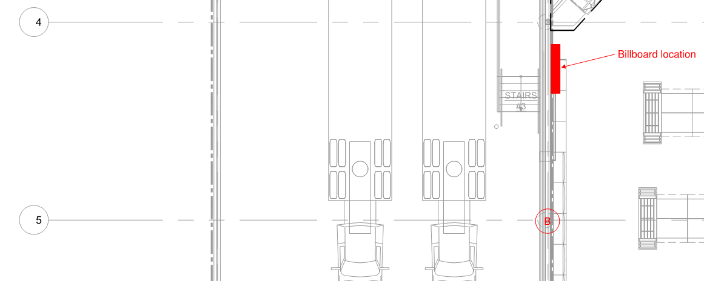

# PCN# 032 - Bakery Billboard Power & Data

**Source**: `PCN# 032 - Bakery Billboard Power & Data.pdf`  
**Pages**: 2  
**Extracted**: 2026-01-09 18:31:51

---

## Page 1

PROPOSED CHANGE NOTICE 

2445-32 

 
No work is to be done before this matter is finalized and a "Change Order" is issued.  This copy to remain with your office.  Do not return.  
Contractor to submit signed letter with price including cost breakdown and change (if any) to construction schedule.  Authority having 
Jurisdiction shall advise of any objections. 
 
 
 
 
TO: 
QUOREX CONSTRUCTION SERVICES LTD. 
 
 
 
1630A 8th Avenue,  
 
 
Regina, SK S4R 1E5 
 
 
RE: 
AURORA FOOD STORE 
 
 
2000 ANAQUOD ROAD 
 
 
REGINA, SK 
 
 
Commission No. 2445 
 
 
DATE: 
August 15, 2025 
 
 
PAGES: 
2 (including cover) 
 
 
RE: 
Bakery Billboard Power & Data 
 
 
 
 
1.0 
ELECTRICAL 
 
 
.1 
Refer to attached Electrical PCN #15, dated August 15, 2025 (1 page text). 
 
 
 
 
 
 
 
 
 
 
 
 
 
 
 
 
 
 
 
 
 
 
 
 
 
 
 
 
 
 
 
 
 
Distribution: 
Sobeys Inc. – Jeff Craig 
jeff.craig@sobeys.com 
Sobeys Inc. – Shanwen Hsu 
shanwen.hsu@sobeys.com 
Quorex Construction Services Ltd. – Chris Walbaum 
c.walbaum@quorex.ca 
Quorex Construction Services Ltd. – Dustin Williamson 
d.williamson@quorex.ca 
Lavergne Draward & Associates Inc. – Charles Koop 
ckoop@ldaeng.ca 
CGM Engineering – Justin Albo 
justin_albo@cgmeng.ca 
CGM Engineering – Tony Mitousis 
tony_mitousis@cgmeng.ca 
CGM Engineering – Brendan Simpson 
brendan_simpson@cgmeng.ca 
 
 
 
 
 
 
 
 
Principal 
Kevin Fawley, SAA MRAIC 

## Page 2

 
ELECTRICAL PROPOSED CHANGE NOTICE #15 
 
24-258E 
 

Project: 
Aurora Grocery Store 
 
2000 Anaquod Road, Regina, Saskatchewan 
Subject: 
Vestibule TV Screen 
Date: 
2025.08.15 
 

Subject: 
Additional Power for Billboard 
References: 
Electrical Drawing E2.0 – Floor Plan – Power 
 
  
 

1. 
Provide power for billboard at location indicated below.  Provide four(4) 15A-1P separate circuit 
receptacles in four(4) new 15A-1P circuit breakers in panel  ‘B’.  Refer to “Specific Electrical Note 
#17” on electrical drawing E2.0. 

2. 
Provide data outlet and cabling for billboard at location indicated below.  Refer to “Specific Electrical 
Notes #11 and #13” on electrical drawing E5.0. 

Tony Mitousis, P.Eng. 
- 1 - 

200-698 Corydon Avenue     Winnipeg, Manitoba     R3M 0X9     204-272-3255     www.cgmeng.ca 

