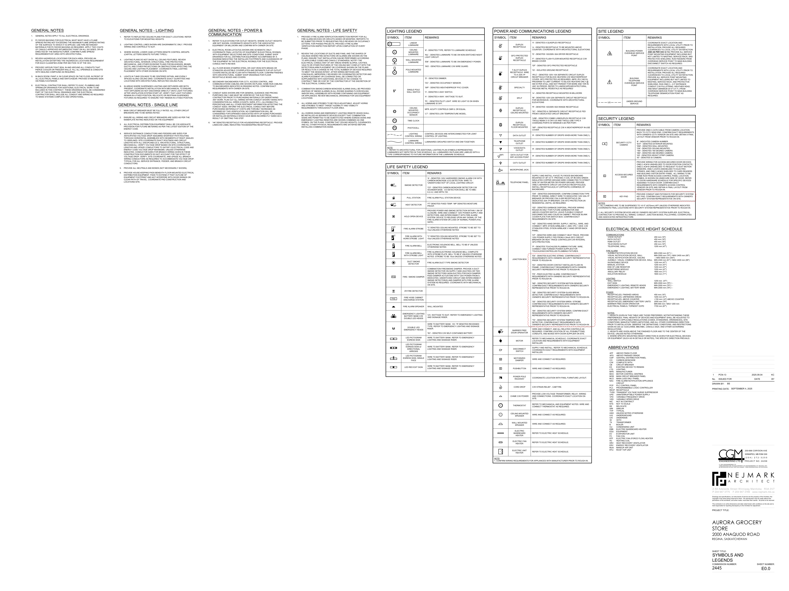
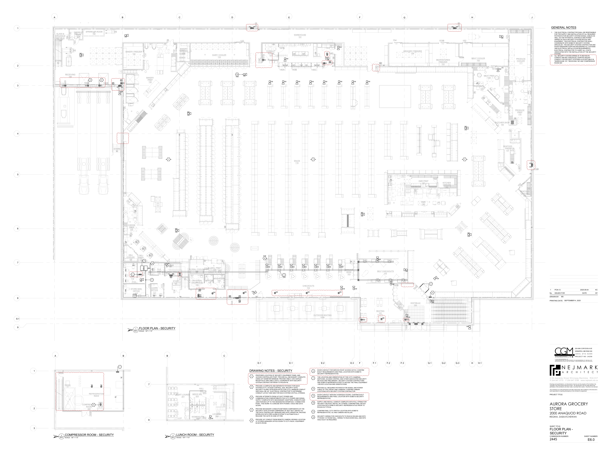

# PCN# 035 - Security Layout Revisions

**Source**: `PCN# 035 - Security Layout Revisions.pdf`  
**Pages**: 7  
**Extracted**: 2026-01-09 18:31:52

---

## Page 1

PROPOSED CHANGE NOTICE

2445-29

 
No work is to be done before this matter is finalized and a "Change Order" is issued.  This copy to remain with your office.  Do not return.  
Contractor to submit signed letter with price including cost breakdown and change (if any) to construction schedule.  Authority having 
Jurisdiction shall advise of any objections. 
 
 
TO: 
QUOREX CONSTRUCTION SERVICES LTD. 
 
 
 
1630A 8th Avenue,  
 
 
Regina, SK S4R 1E5 
 
 
RE: 
AURORA FOOD STORE 
 
 
2000 ANAQUOD ROAD 
 
 
REGINA, SK 
 
 
Commission No. 2445 
 
 
DATE: 
September 5, 2025 
 
 
PAGES: 
7 (including cover) 
 
 
RE: 
Security Layout Revisions 
 
1.0 
ELECTRICAL 
 
 
.1 
Refer to attached Electrical PCN #13, dated September 4, 2025 (5 pages). 
 
 
Provide credit for deleted items. 
 
 
.2 
GC/EC to provide conduit for Chubb to be able to run all alarm wiring run in conduit. 
 
 
.3 
Conduit in Stockroom / Compressor Room / Receiving can be surface mounted. 
 
 
All remaining conduit to be concealed within the wall. 
 
 
.4 
GC/EC to coordinate locations with alarm installing company for devices 
 
 
Chubb security layout attached for reference, dated August 28, 2025 (1 page). 
 
 
.5 
Door #119A requirements previously deleted in PCN 2445-07. 
 
 
 
 
 
 
 
Distribution: 
Sobeys Inc. – Jeff Craig 
jeff.craig@sobeys.com 
Sobeys Inc. – Shanwen Hsu 
shanwen.hsu@sobeys.com 
Quorex Construction Services Ltd. – Chris Walbaum 
c.walbaum@quorex.ca 
Quorex Construction Services Ltd. – Dustin Williamson 
d.williamson@quorex.ca 
Lavergne Draward & Associates Inc. – Charles Koop 
ckoop@ldaeng.ca 
CGM Engineering – Justin Albo 
justin_albo@cgmeng.ca 
CGM Engineering – Tony Mitousis 
tony_mitousis@cgmeng.ca 
CGM Engineering – Brendan Simpson 
brendan_simpson@cgmeng.ca 
 
 
 
 
 
 
 
 
Principal 
Kevin Fawley, SAA MRAIC 

## Page 2

 
ELECTRICAL PROPOSED CHANGE NOTICE #13 
 
24-258 
 

Project: 
Aurora Grocery Store 
 
2000 Anaquod Road, Regina, Saskatchewan 
Subject: 
Security Layout Revisions 
Date: 
2025.09.04 
 

Subject: 
Security Layout Revisions 
References: 
Electrical Drawing E0.0 – Symbols and Legends 
 
Electrical Drawing E0.2 – Schedules  
 
Electrical Drawing E6.0 – Floor Plan – Security 
 

1. 
Refer to attached drawing E6.0 for revisions to the security system design and rough-in 
requirements for the security system. Confirm exact requirements with Sobey’s security system 
representative on site prior to rough-in. Provide a credit to the owner’s for security scope that 
has been removed from the project as shown on drawing E6.0. See below for itemized list of 
changes: 

1.1. Access-Secured Door: 

1.1.1. 
Deleted from doors #190B, #190C. 

1.1.2. 
Added to interior side of door #190A. 

1.1.3. 
Deleted from impact doors #119A, #119D. 

1.1.4. 
Deleted from interior vestibule door #110C. 

1.1.5. 
Added to interior side of door #104. 

1.1.6. 
Added to door #110. 

1.2. Key-pad: 

1.2.1. 
Added to doors #190A, #140D and #104. 

1.3. Piezo Electric Alarm: 

1.3.1. 
Deleted from doors #191A, #191B, #119B. 

1.4. Security Panel: 

1.4.1. 
Added one(1) keynote #1 Security panel in ‘IT Room 114’. 

1.5. Security System Siren / Strobe: 

1.5.1. 
Added to doors #191A, #191B and #119B. 

1.6. Electric Strike: 

1.6.1. 
Added to door #110. 

1.7. Door Contact: 

1.7.1. 
Added to doors #141A, #140D, and #110. 

1.7.2. 
Added to roof access hatch in ‘Compressor Room 300’. 

Brendan Simpson, E.I.T. 
- 1 - 

200-698 Corydon Avenue     Winnipeg, Manitoba     R3M 0X9     204-272-3255     www.cgmeng.ca 

## Page 3

1.8. Motion Sensor: 

1.8.1. 
Added to “Receiving 190’, ‘Pharmacy Prep 140’, ‘Cash Office 116’, “Seating 101’, 
‘Vestibule 100’. 

1.9. Glass Break Sensors: 

1.9.1. 
Added four(4) to ‘Checkouts 104’ and one(1) to ‘Seating 101’. 

1.10. Temperature Detector: 

1.10.1. Added two(2) to ‘Compressor Room 300’. 

1.11. Security System Siren Only 

1.11.1. Added to door #110. 

2. 
Refer to attached drawing E0.0 for additional symbols related to the security system. 

3. 
Refer to attached drawing E0.2 for one(1) additional 20A-1P circuit to serve the security equipment 
panel and access controller point. 

3.1. Provide one(1) duplex receptacle and one(1) data for the security equipment panel and 

access controller point in ‘Compressor Room 300’ and ‘IT Room 114’. 

4. 
Keynote #1 on drawing E6.0 is revised to read the following: 

4.1. ‘PROPOSED 
LOCATION 
OF 
SECURITY 
EQUIPMENT 
PANEL 
AND 
ACCESS 
CONTROLLER POINT. PROVIDE ALL NECESSSARY CONDUITS USING 3/4" DIAMETER 
MINIMUM. PROVIDE ONE(1) 120V DUPLEX RECEPTACLE AND ONE(1) DATA. 
COORDINATE WITH SECURITY SYSTEM CONTRACTOR PRIOR TO ROUGH-IN.’ 

5. 
Keynote #6 on drawing E6.0 is revised to read the following, now related to the ‘Compressor Room 
300’ roof access hatch: 

5.1. ‘DOOR CONTACT FOR SERVICE ROOF ACCESS HATCH. CONFIRM EXACT 

REQUIREMENTS 
AND 
FINAL 
LOCATION 
WITH 
SOBEYS 
SECURITY 
REPRESENTATIVE.’ 

6. 
Keynote #9 on drawing E6.0 is revised to read the following, now related to the door contacts for 
the ‘Receiving 190’ overhead doors: 

6.1. ‘DOOR CONTACT SERVING OVERHEAD DOORS. CONFIRM EXACT REQUIREMENTS 

AND FINAL LOCATION WITH SOBEYS SECURITY REPRESENTATIVE.’ 

7. 
General note #2 is added to drawing E6.0 and reads the following: 

7.1. ‘ALL SECURITY SYSTEM WIRING IS TO BE RUN IN CONDUIT AND BE CONCEALED. 

SURFACE MOUNT CONDUIT FOR SECURITY SYSTEMS IS ACCEPTABLE IN 
‘WAREHOUSE 191’, ‘RECEIVING 190’ AND ‘COMPRESSOR ROOM 300.’ 

Brendan Simpson, E.I.T. 
- 2 - 

200-698 Corydon Avenue     Winnipeg, Manitoba     R3M 0X9     204-272-3255     www.cgmeng.ca 

## Page 4

1.
GENERAL NOTES APPLY TO ALL ELECTRICAL DRAWINGS.

GENERAL NOTES

3.
REVIEW HAZARDOUS LOCATIONS FOR EACH AREA. PROVIDE AN
INSTALLATION SATISFYING THE HAZARDOUS LOCATIONS REQUIREMENT
FOR EACH CLASSIFIED ZONE PER SECTION 18 OF THE CEC.

5.
IN BACK ROOM, PAINT A 1M CLEAR SPACE ON THE FLOOR, IN FRONT OF
ALL ELECTRICAL PANELS AND SWITCHGEAR. PROVIDE STANDARD SIGN
ON PANEL'S EXTERIOR.

6.
ELECTRICAL CONTRACTOR SHALL REFER TO HVAC, PLUMBING AND
SPRINKLER DRAWINGS FOR ADDITIONAL ELECTRICAL WORK TO BE
INCLUDED IN THIS CONTRACT. THESE DRAWINGS SHALL BE CONSIDERED
PART OF THE ELECTRICAL DRAWINGS AND THE ELECTRICAL
CONTRACTOR SHALL INCLUDE ALL CONDUIT AND WIRING AS REQUIRED
TO MAKE SYSTEMS COMPLETE AND OPERATIONAL.

2.
PLYWOOD BACKING FOR ELECTRICAL MUST MUST HAVE A FLAME
SPREAD RATING NOT EXCEEDING THE MAXIMUM FLAME SPREAD RATING
OF THE SURFACE TO WHICH IT IS APPLIED. USE FIRE-RETARDANT
MATERIALS FOR PLYWOOD BACKING AS REQUIRED. APPLY TWO COATS
OF CAN/ULC-APPROVED INTUMESCENT PAINT ON ALL SIX SIDES, OR AS
DIRECTED BY THE MANUFACTURER. CONFIRM FLAME SPREAD
REQUIREMENTS BY AREA WITH ARCHITECTURAL.

4.
PROVIDE VAPOUR-TIGHT SEAL IN AND AROUND ALL CONDUITS THAT
PIERCE COOLER OR FREEZER WALLS. FILL ALL OPENINGS & CONDUITS
WITH SEALING COMPOUND AS REQUIRED.

GENERAL NOTES - SINGLE LINE

1.
MAIN CIRCUIT BREAKER MUST BE FULLY RATED. ALL OTHER CIRCUIT
BREAKERS ARE TO BE SERIES RATED.

3.
ALL ELECTRICAL DISTRIBUTION EQUIPMENT SHALL BE C/W ADEQUATE
PROVISION FOR FUTURE METERING AS PER THE LATEST EDITION OF THE
ENERGY CODE.

5.
PROVIDE ALL NEUTRALS AND BONDS (NOT NECESSARILY SHOWN).

6.
PROVIDE HOUSE-KEEPING PADS BENEATH FLOOR-MOUNTED ELECTRICAL
DISTRIBUTION EQUIPMENT. PADS TO EXTEND 4" PAST OUTLINE OF
EQUIPMENT FOOTPRINT AND NOT INTERFERE WITH DOOR SWINGS OR
CLEAR PATH OF TRAVEL. COORDINATE PAD CONSTRUCTION AND
LOCATIONS SITE.

2.
ENSURE ALL WIRING AND CIRCUIT BREAKERS ARE SIZED AS PER THE
NAMEPLATE RATING INDICATED ON THE EQUIPMENT.

GENERAL NOTES - LIGHTING

1.
REFER TO REFLECTED CEILING PLANS FOR EXACT LOCATIONS. REFER
TO ELEVATIONS FOR MOUNTING HEIGHTS.

4.
SERVICE ENTRANCE CONDUCTORS AND FEEDERS ARE SIZED FOR
ANTICIPATED VOLTAGE DROP ASSUMING SHORTEST PATH ROUTING
THROUGH HORIZONTAL ASSEMBLIES WITH SEGMENTS AT RIGHT ANGLES
TO GRIDLINES. SITE-COORDINATE EXACT ROUTINGS AND CIRCUIT
LENGTHS WITH ALL DISCIPLINES (E.G. ARCHITECTURAL, STRUCTURAL,
MECHANICAL). VERIFY VOLTAGE DROP BASED ON SITE-COORDINATED
LENGTHS AND UPSIZE CONDUCTORS TO SATISFY ELECTRICAL CODE AND
ENERGY CODE VOLTAGE DROP MAXIMUMS. UNLESS OTHERWISE
INDICATED, CONDUCTOR SIZES FOR BRANCH WIRING GIVEN IN THESE
CONSTRUCTION DOCUMENTS DO NOT ACCOUNT FOR THE EFFECT OF
VOLTAGE DROP. VERIFY, SITE-COORDINATE, AND UPSIZE ALL BRANCH
WIRING CONDUCTORS AS REQUIRED TO ACCOMMODATE VOLTAGE DROP.
TYPICAL FOR ALL SERVICE ENTRANCE, FEEDER, AND BRANCH CIRCUIT
CONDUCTORS.

3.
WHERE SHOWN, LOWER CASE LETTERS DENOTE CONTROL GROUPS.
(CAPITAL LETTERS DENOTE FIXTURE TYPES.)

5.
LIGHTS IN T-BAR CEILINGS TO BE CENTERED WITHIN, AND EVENLY
SPACED ALONG CEILING GRID. COORDINATE EXACT QUANTITIES AND
LOCATIONS WITH ARCHITECTURAL REFLECTED CEILING PLAN.

6.
IN AREAS WHERE SUSPENDED LIGHTING AND DIFFUSERS ARE BOTH
PRESENT, COORDINATE INSTALLATION WITH MECHANICAL TO ENSURE
THAT DIFFUSERS DO NOT DISCHARGE DIRECTLY ONTO LIGHT FIXTURES.
AFTER VENTILATION SYSTEM START UP, VERIFY THAT LIGHT FIXTURES
REMAIN IN A FIXED POSITION. RELOCATE OR RESTRAIN SUSPENDED
FIXTURES AS REQUIRED TO ENSURE THEY REMAIN IN A FIXED POSITION.

2.
LIGHTING CONTROL LINES SHOWN ARE DIAGRAMMATIC ONLY. PROVIDE
WIRING AND CONTROLS TO SUIT.

4.
LIGHTING PLANS DO NOT SHOW ALL CEILING FEATURES. REVIEW
ARCHITECTURAL, INTERIOR, STRUCTURAL, FIRE PROTECTION,
MECHANICAL, AND OTHER DIVISIONS' PLANS FOR BULKHEADS, BEAMS,
DUCTS, AND OTHER PROJECTIONS OR OBSTRUCTIONS AFFECTING THE
CEILING AND LIGHTING PLACEMENT. COORDINATE FINAL LIGHTING
PLACEMENT WITH OTHER DIVISIONS ON SITE.

GENERAL NOTES - POWER &
COMMUNICATION

1.
REFER TO ELEVATIONS FOR OUTLET HEIGHTS. WHERE OUTLET HEIGHTS
ARE NOT SHOWN, COORDINATE HEIGHTS WITH THE ASSOCIATED
EQUIPMENT OR MILLWORK AND CONFIRM WITH OWNER ON SITE.

3.
ALL FLOOR BOXES STAMPED STEEL OR CAST IRON WITH BRASS OR
STAINLESS ADJUSTIBLE COVERPLATES AND SEPARATE FLIP-UP OUTLET
COVERS INSTALLED BE FLUSH WITH FINISHED FLOOR. CONFIRM FINISHES
WITH ARCHITECTURAL. SUBMIT SHOP DRAWINGS FOR FLOOR
RECEPTACLE BOXES AND COVERS.

5.
CONDUIT SIZES SHOWN ARE FOR GENERAL GUIDANCE AND PRICING
PURPOSES ONLY AND MUST BE VERIFIED BY THE ELECTRICAL
CONTRACTOR PRIOR TO PURCHASING MATERIALS OR UNDERTAKING
ANY WORK. PLAN OUT ALL WIRING WITHIN CONDUIT SHOWN TAKING INTO
CONSIDERATION ALL WIRES (COUNTS, SIZES, ETC.), ALLOWABLE FILL
PERCENTAGE AND ALL OTHER PERTINENT INFORMATION AFFECTING THE
CONDUIT SIZES. INFORM THE ELECTRICAL CONSULTANT BEFORE
PURCHASING MATERIALS IF COSTS ARE FORCIBLY INCREASED AS
INFORMED BY THIS VERIFICATION. NO COMPENSATION WILL BE
CONSIDERED FOR EXPENSES ASSOCIATED WITH UP-SIZING PURCHASED
OR INSTALLED MATERIALS WHICH HAVE BEEN INCORRECTLY SIZED AS A
RESULT OF OMITTING THIS STEP.

6.
'HK' DENOTES RECEPTACLE FOR HOUSEKEEPING RECEPTACLE. PROVIDE
LAMACOID LABEL INDICATING 'HOUSEKEEPING RECEPTACLE'.

2.
ELECTRICAL ROOM LAYOUT(S) SHOWN ARE SCHEMATIC ONLY.
COORDINATE FINAL LAYOUT(S) OF EQUIPMENT IN ELECTRICAL ROOM(S)
WITH EQUIPMENT SELECTIONS AND SITE CONDITIONS. SUBMIT SHOP
DRAWINGS FOR ALL DISTRIBUTION EQUIPMENT ACCOMPANIED BY A
DIAGRAM INDICATING THE INSTALLED FOOTPRINTS AND CLEARANCES OF
THE EQUIPMENT IN THE ELECTRICAL ROOM(S) FOR THE ELECTRICAL
CONSULTANT'S REVIEW.

4.
SECONDARY BACKBOARDS FOR CCTV, ACCESS CONTROL, AND
COMMUNICATIONS CABLING ARE SHOWN ON PLANS. HOME RUN CABLING
TO BACKBOARDS INDICATED IN DRAWING NOTES. CONFIRM EXACT
REQUIREMENTS WITH OWNER ON SITE.

GENERAL NOTES - LIFE SAFETY

1.
PROVIDE A FIRE ALARM VERIFICATION INSPECTION REPORT FOR ALL
FIRE ALARM DEVICES OR CIRCUITS ADDED OR MODIFIED. REPORTS TO
BE SUBMITTED PRIOR TO REQUESTING FIELD REVIEWS OR OCCUPANCY
LETTERS. FOR PHASED PROJECTS, PROVIDE A FIRE ALARM
VERIFICATION INSPECTION REPORT UPON COMPLETION OF EVERY
PHASE.

3.
COMBINATION SMOKE/CARBON MONOXIDE ALARMS SHALL BE PROVIDED
(INSTEAD OF SMOKE ALARMS) IN ALL ROOMS SHARING FLOOR/CEILING
AND/OR WALL ASSEMBLIES WITH ROOMS CONTAINING GAS EQUIPMENT
OR APPLIANCES. REVIEW MECHANICAL DRAWINGS FOR GAS EQUIPMENT
LOCATIONS.

5.
ALL EGRESS SIGNS AND EMERGENCY LIGHTING REMOTE HEADS SHALL
BE INSTALLED AS SEPARATE DEVICES EXCEPT THAT COMBINATION
SIGNS ARE PERMITTED TO BE SUBSTITUTED WHERE EGRESS SIGNS AND
EMERGENCY LIGHTING REMOTES ARE SHOWN COMBINED AS ONE
SYMBOL ON THE PLANS. CONFIRM THAT CEILING HEIGHTS, CLEARANCES,
AND ALL OTHER PHYSICAL REQUIREMENTS ARE SATISFIED BEFORE
INSTALLING COMBINATION SIGNS.

2.
REVIEW THE LOCATIONS OF DUCTS AND FANS, AND THE SHAPES OF
CEILINGS WHERE FIRE DETECTORS OR ALARMS ARE SHOWN ON THE
PLANS. ENSURE THAT INSTALLATION CAN BE PERFORMED ACCORDING
TO APPLICABLE CODES AND CAN/ULC STANDARDS. NOTIFY THE
ELECTRICAL CONSULTANT OF ANY AREAS WHERE SLOPES, CAVITIES,
VAULTS OR OTHER FEATURES OF THE CEILING MAY CONFLICT WITH THE
DETECTOR/ALARM PLACEMENT OR COVERAGE SHOWN ON THE PLANS
OR RESULTS IN A CHANGE IN THE TOTAL NUMBER OF DEVICES REQUIRED
TO MEET THE DESIGN INTENT. AFTER WIRING METHODS ARE
CONCEALED, IMPROPERLY REVIEWED OR COORDINATED DETECTOR AND
ALARM PLACEMENT OR COVERAGE SHALL BE CORRECTED OR
SUPPLEMENTED WITH ADDITIONAL DEVICES AT NO CHANGE TO
CONTRACT TIME OR COST BY THE CONTRACTOR AT THE DISCRETION OF
THE ELECTRICAL CONSULTANT.

4.
ALL HORNS AND STROBES TO BE FIELD-ADJUSTABLE. ADJUST HORNS
AND STROBES TO MEET TARGET AUDIBILITY AND VISIBILITY
REQUIREMENTS THROUGHOUT FLOOR AREA.

LIGHTING LEGEND

LIFE SAFETY LEGEND

NOTE:
1. REFER TO ARCHITECTURAL FOR ADDITIONAL LIGHTING PLAN SYMBOLS REPRESENTING
LUMINAIRES NOT DEPICTED IN THIS SCHEDULE. ALL LUMINAIRES ON PLANS ARE LABELED WITH A
TYPE CORRESPONDING TO FIXTURE INFORMATION IN THE LUMINAIRE SCHEDULE.

SYMBOL
ITEM
REMARKS

SYMBOL
ITEM
REMARKS

#

FHC

F/S

B

B

TC

PE

A
CO

FT
MP

OC

#

#

#

C

C

#

EMERGENCY LIGHTING
BATTERY BANK C/W
DOUBLE LED HEADS

FIRE / SMOKE DAMPER

LED PICTOGRAM
EGRESS SIGN, SINGLE
FACE

FIRE ALARM SPEAKER
WALL MOUNTED

FIRE ALARM WITH
HORN STROBE  LIGHT

FIRE HOSE CABINET
DISCHARGE STATION

FIRE ALARM STROBE
"C' DENOTES CEILING MOUNTED. STROBE TO BE SET TO
15cd UNLESS OTHERWISE NOTED

DOUBLE LED
EMERGENCY HEADS

FIRE ALARM BELL
WITH STROBE LIGHT

HOLD OPEN DEVICE

I/R FIRE DETECTOR

LED RED EXIT SIGN
WIRE TO BATTERY BANK. REFER TO EMERGENCY
LIGHTING AND SIGNAGE RISER.

SMOKE DETECTOR

LIGHTING
CONTROL WIRING

LUMINAIRE
CONTROL WIRING
LUMINAIRES GROUPED SWITCH AND DIM TOGETHER.

FIRE ALARM BELL
ELECTRONIC SOLENOID BELL. BELL TO BE 6" UNLESS
OTHERWISE NOTED.

HEAT DETECTOR
'FT' DENOTES FIXED TEMP. 'MP' DENOTES MOISTURE
PROOF.

LED PICTOGRAM
EGRESS SIGN

LED PICTOGRAM
EGRESS SIGN w/
DIRECTIONAL
ARROWS

POLE MOUNTED
LUMINAIRE

WALL MOUNTED
LUMINAIRE

PULL STATION
FIRE ALARM PULL STATION DEVICE.

SINGLE POLE
WALL SWITCH

DUCT SMOKE
DETECTOR
FIRE ALARM DUCT-TYPE SMOKE DETECTOR

CEILING
MOUNTED
OCCUPANCY
SENSOR

TIME CLOCK

PHOTOCELL

LINEAR
LUMINAIRE

CEILING
MOUNTED
LUMINAIRE

MFR: ACUITY CONTROLS CMR 9, OR EQUAL.

'N/L' - DENOTES LUMINAIRE TO BE ON NON-SWITCHED NIGHT
LIGHT CIRCUIT.

'PL' - DENOTES PILOT LIGHT. WIRE SO LIGHT IS ON WHEN
LUMINAIRE IS OFF.

CONTROL DEVICES ARE INTERCONNECTED FOR JOINT
CONTROL OF LIGHTING.

'#' - DENOTES TYPE, REFER TO LUMINAIRE SCHEDULE.

'EM' - DENOTES LUMINAIRE TO BE ON EMERGENCY POWER.

'WG' - DENOTES LUMINAIRE C/W WIRE GUARD.

'D' - DENOTES DIMMER.

'OC' - DENOTES OCCUPANCY SENSOR.

'WP' - DENOTES WEATHERPROOF PVC COVER.

'3' - DENOTES 3-WAY SWITCH.

'4' - DENOTES 4-WAY. WATTAGE TO SUIT.

'LT' - DENOTES LOW TEMPERATURE MODEL.

"C' DENOTES CEILING MOUNTED. STROBE TO BE SET TO
15cd UNLESS OTHERWISE NOTED

12V, WATTAGE TO SUIT. REFER TO EMERGENCY LIGHTING
AND SIGNAGE RISER.

PROVIDE POWER AND SMOKE DETECTION WITHIN 1.5M OF
CLOSURE. WIRE AND CONNECT 120V POWER SUPPLY AND
DETECTORS, AND INTERCONNECT WITH FIRE ALARM
SYSTEM. DEVICE TO RELEASE UPON ANY SIGNAL OF THE
FIRE ALARM SYSTEM OR LOSS OF NORMAL POWER (FAIL
SAFE).

FIRE ALARM ELECTRONIC SOLENOID BELL COMPLETE
WITH STROBE PLATE. BELL TO BE 6" UNLESS OTHERWISE
NOTED. STROBE TO BE 15cd UNLESS OTHERWISE NOTED.

COMBINATION FIRE/SMOKE DAMPER. PROVIDE A DUCT
SMOKE DETECTOR ON SUPPLY SIDE (DUCTED) OR TWO
SMOKE DETECTORS (NON-DUCTED) FOR EACH DAMPER.
FEED DAMPER ACTUATORS WITH 120V POWER FROM A
DEDICATED, UNSWITCHED CIRCUIT AND INTERCONNECT
SMOKE DETECTOR(S) AND DAMPER WITH FIRE ALARM
SYSTEM AS REQUIRED. COORDINATE WITH MECHANICAL
ON SITE.

WIRE TO BATTERY BANK. 12V. 'R' DENOTES RECESSED
TYPE. REFER TO EMERGENCY LIGHTING AND SIGNAGE
RISER.

WIRE TO BATTERY BANK. REFER TO EMERGENCY
LIGHTING AND SIGNAGE RISER.

WIRE TO BATTERY BANK. REFER TO EMERGENCY
LIGHTING AND SIGNAGE RISER.

WIRE TO BATTERY BANK. REFER TO EMERGENCY
LIGHTING AND SIGNAGE RISER.

'A' - DENOTES 120V HARDWIRED SMOKE ALARM C/W WITH
CARBON MONOXIDE (CO) DETECTION. WIRE TO
'UNSWITCHED HOT' OF LOCAL LIGHTING CIRCUIT.

'CO' - DENOTES CARBON MONOXIDE DETECTOR C/W
SOUNDER BASE.  CO DETECTION SHALL BE TO MBC
6.2.4.2. AND NFPA 720.

'SC' - DENOTES C/W SELF-CONTAINED BATTERY.

POWER AND COMMUNICATIONS LEGEND

NOTE:
1. CONFIRM WIRING REQUIREMENTS FOR APPLIANCES WITH MANUFACTURER PRIOR TO ROUGH-IN.

SYMBOL
ITEM
REMARKS

WIFI

M

B

T

BF

#

#

#

#

#

M

MICROPHONE JACK.

T-SLOT DUPLEX
RECEPTACLE. WIRE
TO A 20A-1P
CIRCUIT BREAKER

DATA OUTLET FOR
WIFI ACCESS POINT
'#' - DENOTES NUMBER OF DROPS WHEN MORE THAN ONE(1).

TELEPHONE PANEL.

CHIME C/W POWER

DUPLEX
RECEPTACLE,
CEILING MOUNTED

CEILING MOUNTED
SPEAKER
WIRE AND CONNECT AS REQUIRED.

BARRIER FREE
DOOR OPERATOR

GFCI PROTECTED
DUPLEX
RECEPTACLE

DUPLEX
RECEPTACLE,
FLOOR MOUNTED

WALL MOUNTED
SPEAKER
WIRE AND CONNECT AS REQUIRED.

ELECTRIC UNIT
HEATER
REFER TO ELECTRIC HEAT SCHEDULE.

JUNCTION BOX

ELECTRIC FAN
HEATER
REFER TO ELECTRIC HEAT SCHEDULE.

DATA OUTLET
'#' - DENOTES NUMBER OF DROPS WHEN MORE THAN ONE(1).

CATV OUTLET
'#' - DENOTES NUMBER OF DROPS WHEN MORE THAN ONE(1).

THERMOSTAT
REFER TO MECHANICAL AND EQUIPMENT NOTES. WIRE AND
CONNECT THERMOSTAT AS REQUIRED.

PUSHBUTTON
WIRE AND CONNECT AS REQUIRED.

POWER POLE
RACEWAY
COORDINATE LOCATION WITH FINAL FURNITURE LAYOUT.

DUPLEX
RECEPTACLE

DISCONNECT
SWITCH

ELECTRIC
BASEBOARD
HEATER

CORD DROP
C/W STRAIN RELIEF - CABTYRE.

VOICE/DATA
OUTLET
'#' - DENOTES NUMBER OF DROPS WHEN MORE THAN ONE(1).

TELEPHONE
OUTLET
'#' - DENOTES NUMBER OF DROPS WHEN MORE THAN ONE(1).

MOTORIZED
DAMPER
WIRE AND CONNECT AS REQUIRED.

SPECIALTY

MOTOR

SPLIT

'HT' - DENOTES WIRE AND CONNECT HEAT TRACE. PROVIDE
120V POWER SUPPLY FED FROM A 30mA GFCI CIRCUIT
BREAKER OR HEAT TRACE CONTROLLER C/W INTEGRAL
GFCI PROTECTION.

SUPPLY AND INSTALL 4'x4'x3 4" PLYWOOD BACKBOARD
MOUNTED AT 36" A.F.F. PROVIDE 3' COIL OF #6 AWG GREEN
INSULATED COPPER GROUND WIRE CONNECTED TO STREET
SIDE OF WATER METER OR POWER GROUND. PROVIDE
ONE(1) SEPARATE CIRCUIT 20A DUPLEX RECEPTACLE(S).
INSTALL RECEPTACLE(S) AT (OPPOSITE) CORNER(S) OF
BACKBOARD.

REFER TO MECHANICAL SCHEDULE. COORDINATE EXACT
LOCATION AND REQUIREMENTS WITH EQUIPMENT
INSTALLER.

SUPPLY AND INSTALL. REFER TO MECHANICAL SCHEDULE.
COORDINATE EXACT REQUIREMENTS WITH EQUIPMENT
INSTALLER.

'IPLC' - DENOTES 120V-15A SEPARATE CIRCUIT DUPLEX
RECEPTACLE FOR BLOCK HEATERS C/W WEATHERPROOF
COVER, GFCI PROTECTED AS REQUIRED, (MFR: IPLC M210),
PROGRAM TO LIMIT CURRENT TO BLOCK HEATERS ONLY @
900 W PER STALL AND NOT PERSIST FOR MORE AND 1HR IN
ANY 2H PERIOD, REFER TO LANDSCAPE/ARCHITECTURAL,
PROVIDE METAL PEDESTALS AS REQUIRED

'M' - DENOTES 120V-20A SEPARATE CIRCUIT RECEPTACLE
FOR MICROWAVE, COORDINATE WITH ARCHITECTURAL
ELEVATIONS

'SC' - DENOTES A 'SEPARATE CIRCUIT' RECEPTACLE FED
FROM A DEDICATED CIRCUIT BREAKER

'DW' - DENOTES DISHWASHER, CONFIRM CONNECTION TYPE
PRIOR TO WIRING, DIRECT WIRE TO DEDICATED 120V 20A-1P
BREAKER OR PROVIDE CSA 5-20R RECEPTACLE ON
DEDICATED 20A-1P BREAKER, C/W AFCI PROTECTION (IN
RESIDENTIAL UNITS), AS REQUIRED.

'GD' - DENOTES GARBAGE DISPOSAL, PROVIDE WIRING
ROUGH-IN ONLY FOR FUTURE GARBURATOR AND
ABOVE-COUNTER SWITCH. LEAVE FLEXIBLE CONDUIT
DISCONNECTED AND COILED IN CABINET. PROVIDE BLANK
COVER PLATE FOR SWITCH BOX. CONFIRM EXACT
REQUIREMENTS ON SITE.

'HD' - DENOTES HAND DRYER. SUPPLY, INSTALL, WIRE, AND
CONNECT. MFR: DYSON AIRBLADE V, 208V-1PH, 1.0KW. C/W
STAINLESS STEEL DYSON AIRBLADE V HAND DRYER BACK
PANEL.

'ES' - DENOTES ELECTRIC STRIKE. CONFIRM EXACT
REQUIREMENTS WITH OWNERS SECURITY REPRESENTATIVE
PRIOR TO ROUGH-IN.

'DC' - DENOTES DOOR CONTACT INSTALLED FLUSH IN
FRAME. CONFIRM EXACT REQUIREMENTS WITH OWNERS
SECURITY REPRESENTATIVE PRIOR TO ROUGH-IN.

'PZ' - PIEZO ELECTRIC ALARM. CONFIRM EXACT
REQUIREMENTS WITH OWNERS SECURITY REPRESENTATIVE
PRIOR TO ROUGH-IN.

'MS' - DENOTES SECURITY SYSTEM MOTION SENSOR.
CONFIRM EXACT REQUIREMENTS WITH OWNER'S SECURITY
REPRESENTATIVE PRIOR TO ROUGH-IN.

'GB' - DENOTES SECURITY SYSTEM GLASS BREAK
DETECTOR. CONFIRM EXACT REQUIREMENTS WITH
OWNER'S SECURITY REPRESENTATIVE PRIOR TO ROUGH-IN.

'SS' - DENOTES SECURITY SYSTEM SIREN / STROBE.
CONFIRM EXACT REQUIREMENTS WITH OWNER'S SECURITY
REPRESENTATIVE PRIOR TO ROUGH-IN.

'SN' - DENOTES SECURITY SYSTEM SIREN. CONFIRM EXACT
REQUIREMENTS WITH OWNER'S SECURITY
REPRESENTATIVE PRIOR TO ROUGH-IN.

'TD' - DENOTES SECURITY SYSTEM TEMPERATURE
DETECTOR. CONFIRM EXACT REQUIREMENTS WITH
OWNER'S SECURITY REPRESENTATIVE PRIOR TO ROUGH-IN.

WIRE AND CONNECT, AND ALL RELATED CONTROLS AS
REQUIRED. CONFIRM LOCATION OF ALL PUSHBUTTONS,
CONDUITS, AND BOXES WITH DOOR SUPPLIER ON SITE.

PROVIDE LOW-VOLTAGE TRANSFORMER, RELAY, WIRING
AND CONNECTIONS. COORDINATE EXACT LOCATION ON
SITE.

REFER TO ELECTRIC HEAT SCHEDULE.

'F' - DENOTES FLUSH FLOOR-MOUNTED RECEPTACLE C/W
BRASS COVER

'a' - DENOTES RECEPTACLE TO BE MOUNTED ABOVE
COUNTER, COORDINATE WITH ARCHITECTURAL ELEVATIONS

'USB' - DENOTES COMBO USB/DUPLEX RECEPTACLE C/W
TWO(2) NEMA 5-15 OR 5-20 AND TWO(2) USB TYPE A
CHARGING PORTS W/ MINIMUM 4.8A PER PORT.

'WP' - DENOTES RECEPTACLE C/W A WEATHERPROOF IN-USE
COVER

'P' - DENOTES TOUCHLESS PLUMBING FIXTURE. WIRE,
CONNECT AND FURNISH POWER SUPPLIES FOR
TOUCHLESS/CONTROLLED PLUMBING FIXTURES.

'4' - DENOTES A QUADPLEX RECEPTACLE

'D' - DENOTES 120/208V-30A DRYER RECEPTACLE

'GF' - DENOTES GFCI PROTECTED RECEPTACLE

'IG' - ISOLATED GROUND RECEPTACLE

'm' - DENOTES RECEPTACLE MOUNTED IN MILLWORK

'R' - DENOTES 120/208V-50A RANGE RECEPTACLE

NOTES:
1. ALL CAMERAS ARE TO BE SUSPENDED TO 14'-0" (4270mm) AFF UNLESS OTHERWISE INDICATED.
COORDINATE FINAL LOCATIONS WITH SECURITY SYSTEM REPRESENTATIVE PRIOR TO ROUGH-IN.

SITE LEGEND

SECURITY LEGEND

SYMBOL
ITEM
REMARKS

SYMBOL
ITEM
REMARKS

2. ALL SECURITY SYSTEM DEVICES ARE BY OWNER'S SECURITY SYSTEM SUPPLIER. ELECTRICAL
CONTRACTOR TO PROVIDE ALL WIRING, CONDUIT, JUNCTION BOXES, PULLSTRING, COVERPLATES
AND ASSOCIATED INFRASTRUCTURE.

C

K

ELECTRICAL DEVICE HEIGHT SCHEDULE

FIRE ALARM
AUDIBLE NOTIFICATION DEVICE
MIN 2300 mm (91") / -
VISUAL NOTIFICATION DEVICE, WALL
MIN 2000 mm (79") / MAX 2400 mm (95")
VISUAL NOTIFICATION DEVICE, CEILING
- / MAX 9000 mm (354")
AUDIBLE / VISUAL COMBINATION DEVICE, WALL
MIN 2300 mm (91") / MAX 2400 mm (95")
SILENCEABLE DEVICE
1200 mm (47")
MANUAL STATION
1200 mm (47")
END OF LINE RESISTOR
1200 mm (47")
MONITORING MODULE
1200 mm (47")
ANCILLARY RELAY
1800 mm (71")
ISOLATION MODULE
1800 mm (71")

LIGHTING
WALL SWITCH
1200 mm  (47")
EXIT SIGN
MIN 2000 mm (79") / -
EMERGENCY LIGHTING, REMOTE HEADS
MIN 2000 mm (79") / -
EMERGENCY LIGHTING, BATTERY BANK
MIN 2000 mm (79") / -

POWER
RECEPTACLES, FINISHED AREAS
450 mm (18")
RECEPTACLES, UNFINISHED AREAS
1200 mm (47")
RECEPTACLES, ABOVE COUNTER
+150 mm (+6") ABOVE COUNTER
RECEPTACLES, EMERGENCY BATTERY UNITS
2000 mm (79")
BARRIER FREE DOOR OPERATOR
MIN 900 mm / MAX 1200 mm
ELECTRICAL PANELS, TOPMOST OCPD
1700 mm (67")

COMMUNICATIONS
VOICE OUTLET
450 mm (18")
DATA OUTLET
450 mm (18")
HDMI OUTLET
450 mm (18")
TELEVISION OUTLET
450 mm (18")
TELEPHONE, WALL
1200 mm (47")

NOTES:
1. HEIGHTS GIVEN IN THIS TABLE ARE THOSE PREFERRED. NOTWITHSTANDING THESE
PREFERENCES, FINAL HEIGHTS OF DEVICES AND EQUIPMENT SHALL BE ADJUSTED TO
CONFORM TO APPLICABLE REGULATIONS (CODES, STANDARDS, ORDINANCES), SITE
CONDITIONS, MANUFACTURER LIMITATIONS, AND ALL OTHER OVERRIDING DIRECTION
PRIOR TO INSTALLATION. OBSERVE THE DEFINITIONS, CONDITIONS, AND RESTRICTIONS
GIVEN IN CSA 22.1(CEC)/WEB, MBC/NBC, CAN/ULC-S524, AND OTHER GOVERNING
REGULATIONS.
2. HEIGHTS ARE GIVEN ABOVE THE FINISHED FLOOR AND TO THE CENTER OF THE
DEVICE, UNLESS NOTED OTHERWISE.
3. WHERE SPECIFIC MOUNTING HEIGHT DIRECTION IS GIVEN FOR ELECTRICAL DEVICES
OR EQUIPMENT (SUCH AS IN DETAILS OR NOTES), THE SPECIFIC DIRECTION PREVAILS.

UG

ABBREVIATIONS

s

t

AFF
ABOVE FINISH FLOOR
AFG
ABOVE FINISHED GRADE
CDP
CENTRAL DISTRIBUTION PANEL
CO
CARBON MONOXIDE
C/W
COMPLETE WITH
CB
CIRCUIT BREAKER
EX
EXISTING DEVICE TO REMAIN
LTG
LIGHTING
MFR
MANUFACTURER
MCC
MOTOR CONTROL CENTRES
MCB 
MAIN CIRCUIT BREAKER PANEL
MLO
MAIN LUGS ONLY PANEL
NAC
FIRE ALARM NOTIFICATION APPLIANCE
CIRCUIT
PCP
PLC CONTROL PANEL
PLC
PROGRAMMABLE LOGIC CONTROLLER
RECP RECEPTACLE
TVSS
TRANSIENT VOLTAGE SURGE SUPPRESSOR
UPS
UNINTERRUPTIBLE POWER SUPPLY
VFD
VARIABLE FREQUENCY DRIVE
VSD
VARIABLE SPEED DRIVE
NIC
NOT IN CONTRACT
NTS
NOT TO SCALE
RE
RELOCATE
SIM
SIMILAR
TYP
TYPICAL
UNO
UNLESS NOTED OTHERWISE
U/G
UNDERGROUND
U/S
UNDERSIDE
W/
WITH
TX
TRANSFORMER
B
BOILER
CU
CONDENSING UNIT
EBB
ELECTRIC BASEBOARD HEATER
EQU
EQUIPMENT
EV
EVAPORATOR UNIT
FC
FAN COIL
EFF
ELECTRIC FAN (FORCE FLOW) HEATER
HC
HEATING COIL
HRV
HEAT RECOVERY VENTILATOR
ERV
ENERGY RECOVERY VENTILATOR
MUA
MAKEUP AIR UNIT
RTU
ROOF TOP UNIT

ACCESS-SECURED
DOOR

SECURITY CCTV
CAMERA

KEY-PAD

BUILDING POWER
OVERHEAD SERVICE
POINT

BUILDING
TELEPHONE
OVERHEAD SERVICE
POINT

UNDER GROUND
SERVICE

PROVIDE ONE(1) CAT6 CABLE FROM CAMERA LOCATION
BACK TO CCTV HEAD END. CONFIRM EXACT REQUIREMENTS
WITH OWNER'S CCTV VENDOR ON SITE AND OBTAIN A FINAL
LAYOUT FROM VENDOR PRIOR TO ROUGH-IN.

PROVIDE WIRING FOR ACCESS-SECURED DOOR DEVICES:
ONE(1) 4C#18 UNSHIELDED TO DOOR POSITION CONTACTS,
ONE(1) 4C#18 UNSHIELDED TO REQUEST-TO-EXIT MOTION
SENSORS, ONE(1) 2C#18 UNSHIELDED TO ELECTRIC
STRIKES, AND ONE(1) 6C#22 SHIELDED TO CARD READERS
AND BUILDING VISITOR ENTRY PANEL. ALL WIRING TO BE
HOME RUN FROM ACCESS CONTROL PANEL LOCATION.
SYMBOL IS SHOWN ON UNSECURE SIDE OF DOOR. REFER
TO DOOR HARDWARE SCHEDULE FOR SPECIFIC DEVICES
ASSIGNED TO EACH DOOR. CONFIRM EXACT
REQUIREMENTS WITH OWNER'S ACCESS CONTROL
VENDOR ON SITE AND OBTAIN A FINAL LAYOUT FROM
VENDOR PRIOR TO ROUGH-IN.

PROVIDE CONDUIT AND PATHWAYS FOR SECURITY SYSTEM
KEY PAD. CONFIRM EXACT REQUIREMENTS WITH OWNER'S
SECURITY SYSTEM REPRESENTATIVE ON SITE.

'#' - INDICATES CAMERA NUMBER.
'EXT' - DENOTES EXTERIOR MOUNTED.
'WM' - DENOTES WALL MOUNTED.
'CM' - DENOTES CEILING MOUNTED.
'180' - DENOTES 180 DEGREE CAMERA.
'360' - DENOTES 360 DEGREE CAMERA.
'HS' - DENOTES HEIGHT STRIP CAMERA.
'ID' - DENOTES ID CAMERA.

COORDINATE EXACT LOCATION AND
REQUIREMENTS WITH LOCAL UTILITY PRIOR TO
INSTALLATION. PROVIDE ALL REQUIRED
CLEARANCES TO LOCAL UTILITY SATISFACTION
AND AS PER CEC 6-112. PROVIDE ALL SERVICE
POINT MOUNTING EQUIPMENT INCLUDING BUT
NOT LIMITED TO MASTING, SERVICE RACK, AND
PROTECTIVE SHIELDING. RUN FEEDERS FROM
OVERHEAD SERVICE POINT TO MAIN BUILDING
DISCONNECT SWITCH AS REQUIRED.

COORDINATE EXACT LOCATION AND
REQUIREMENTS WITH LOCAL UTILITY PRIOR TO
INSTALLATION. PROVIDE ALL REQUIRED
CLEARANCES TO LOCAL UTILITY SATISFACTION.
PROVIDE ALL SERVICE POINT MOUNTING
EQUIPMENT INCLUDING BUT NOT LIMITED TO
MASTING, SERVICE RACK, AND PROTECTIVE
SHIELDING. RUN ONE(1) - 2.5" ENTRANCE
CONDUIT C/W PULLSTRING, WEATHER HEAD,
AND MAST (MINIMUM 20'-0" A.F.F.) FROM
OVERHEAD SERVICE POINT TO MAIN BUILDING
TELEPHONE DEMARCATION POINT AS
REQUIRED.

2-54 Adelaide Street Winnipeg Manit
a
ob
R3A 0V7
 P 204 947 3775
 F 204 947 3789
www.nejmark.mb.ca

AURORA GROCERY
STORE
2000 ANAQUOD ROAD
REGINA, SASKATCHEWAN

PROJECT TITLE:

DRAWN BY:

PRINTING DATE:

No.     ISSUED FOR                                      DATE                   BY

Drawings and specifications, as instruments of service are the property of the Architect, the
copyright in the same being reserved to them.  No reproduction may be made without the
permission of the architects, and when made, must bear their names.  All prints to be returned.

2445

COMMISSION NUMBER:
SHEET NUMBER:

SHEET TITLE:

The contractor is to verify dimensions and date noted herein with conditions on the site and is
held responsible for reporting discrepancy to the Architect for adjustment.

SYMBOLS AND
LEGENDS

1

KC
2025.09.04
PCN-13

© 2024 CGM ENGINEERING LTD.
THESE DRAWINGS ARE THE SOLE PROPERTY OF CGM ENGINEERING LTD. AND SHALL NOT
BE REPRODUCED WITHOUT WRITTEN CONSENT. THESE DRAWINGS SHALL NOT BE SCALED.

ENGINEERING LTD.

BS

N E J M A R K
A
R
C
H
I
T
E
C
T

SEPTEMBER 4, 2025

PROJECT NO: 24258

( 2 0 4 )  2 7 2 - 3 2 5 5

200-698 CORYDON AVE

WINNIPEG, MB R3M 0X9

E0.0

## Page 5

PANEL '6L'
100

RTU-1, ROOF TOP UNIT
#1 WIRE
125

RTU-2, ROOF TOP UNIT
#4 WIRE
70

RTU-3, ROOF TOP UNIT
#10 WIRE
30

EF-1, EXHAUST FAN
15

PANEL '2A'
200

PANEL '2L'
200

PANEL '2B'
200

PANEL 'C2
200

LIGHTING - SALES - POT LIGHTS
15
1
ɸ
2
15
LIGHTING - SALES

LIGHTING - SEATING
15
7
ɸ
8
15
LIGHTING - SALES

LIGHTING - CHECKOUTS
15
9
ɸ
10
15
LIGHTING - SALES

LIGHTING - OFFICE
15
11
ɸ
12
15
LIGHTING - SALES

LIGHTING - DELI
15
13
ɸ
14
15
LIGHTING - SALES

LIGHTING - PHARMACY
15
15
ɸ
16
15
LIGHTING - RECEIVING / WAREHOUSE

LIGHTING - BAKERY
15
17
ɸ
18
15
LIGHTING - COMPRESSOR ROOM

LIGHTING - HMR
15
19
ɸ
20
15
LIGHTING - COOLERS

LIGHTING - SEAFOOD / MEATS / PRODUCE
15
21
ɸ
22
15
LIGHTING - VESTIBULE

SPACE
-
13
ɸ
14

30
BALER
#10 WIRE
SPACE
-
15
ɸ
16

SPACE
-
17
ɸ
18

SPACE
-
19
ɸ
20
-
SPACE

SPACE
-
21
ɸ
22
-
SPACE

SPACE
-
23
ɸ
24
-
SPACE

SPACE
-
25
ɸ
26
-
SPACE

SPACE
-
27
ɸ
28
-
SPACE

SPACE
-
29
ɸ
30
-
SPACE

SPACE
-
31
ɸ
32
-
SPACE

SPACE
-
33
ɸ
34
-
SPACE

SPACE
-
35
ɸ
36
-
SPACE

SPACE
-
37
ɸ
38
-
SPACE

SPACE
-
39
ɸ
40
-
SPACE

SPACE
-
41
ɸ
42
-
SPACE

SPACE
-
31
ɸ
32
-
SPACE

SPACE
-
33
ɸ
34
-
SPACE

SPACE
-
35
ɸ
36
-
SPACE

SPACE
-
37
ɸ
38
-
SPACE

SPACE
-
39
ɸ
40
-
SPACE

SPACE
-
41
ɸ
42
-
SPACE

SPARE
15
3
ɸ
4
15
LIGHTING - SALES

SPARE
15
5
ɸ
6
15
LIGHTING - SALES

SPACE
-
23
ɸ
24
15
LIGHTING - EXTERIOR

SPACE
-
25
ɸ
26
-
SPACE

SPACE
-
27
ɸ
28
-
SPACE

SPACE
-
29
ɸ
30
-
SPACE

SPACE
-
31
ɸ
32
-
SPACE

SPACE
-
33
ɸ
34
-
SPACE

SPACE
-
35
ɸ
36
-
SPACE

SPACE
-
37
ɸ
38
-
SPACE

SPACE
-
39
ɸ
40
-
SPACE

SPACE
-
41
ɸ
42
-
SPACE

SPACE
-
31
ɸ
32
-
SPACE

SPACE
-
33
ɸ
34
-
SPACE

SPACE
-
35
ɸ
36
-
SPACE

SPACE
-
37
ɸ
38
-
SPACE

SPACE
-
39
ɸ
40
-
SPACE

SPACE
-
41
ɸ
42
-
SPACE

SPACE
-
43
ɸ
44
-
SPACE

SPACE
-
45
ɸ
46
-
SPACE

SPACE
-
47
ɸ
48
-
SPACE

SPACE
-
49
ɸ
50
-
SPACE

SPACE
-
51
ɸ
52
-
SPACE

SPACE
-
53
ɸ
54
-
SPACE

SPACE
-
55
ɸ
56
-
SPACE

SPACE
-
57
ɸ
58
-
SPACE

SPACE
-
59
ɸ
60
-
SPACE

TVSS
#10 WIRE
30

TVSS
#10 WIRE
30

TVSS
30

PANEL '100A'

PANEL '100B'

PANEL '6L'

PANEL 'SD-1'

100A-347/600V-3PH-4W PANEL
SURFACE MOUNTED IN WEST STAFF CORRIDOR

1200A-120/208V-3PH-4W PANEL
SURFACE MOUNTED IN COMPRESSOR ROOM 300

400A-347/600V-3PH-4W PANEL
SURFACE MOUNTED IN COMPRESSOR ROOM 300

400A-347/600V-3PH-4W PANEL
SURFACE MOUNTED IN COMPRESSOR ROOM 300

DESCRIPTION
CIRCUIT
BREAKER

DESCRIPTION
CIRCUIT
BREAKER

DESCRIPTION
CIRCUIT
BREAKER

DESCRIPTION
CIRCUIT
BREAKER

15
RTU-6, ROOF TOP UNIT
15
ɸ
16

400
PANEL 'H'
15
ɸ
16

13
ɸ
14

17
ɸ
18

19
ɸ
20

13
ɸ
14

17
ɸ
18

19
ɸ
20

23
ɸ
24

25
ɸ
26
-
SPACE

27
ɸ
28
-
SPACE

29
ɸ
30
-
SPACE

23
ɸ
24

25
ɸ
26

200
PANEL 'B'
27
ɸ
28

29
ɸ
30

11
ɸ
12

11
ɸ
12

11
ɸ
12

30
AC-1, AIR CURTAIN
#10 WIRE
21
ɸ
22

200
PANEL 'SM'
21
ɸ
22

25
GAS COOLER
#10 WIRE
3
ɸ
4

5
ɸ
6

7
ɸ
8

30
COMPACTOR
#10 WIRE
9
ɸ
10

15
RTU-4, ROOF TOP UNIT
3
ɸ
4

5
ɸ
6

7
ɸ
8

15
RTU-5, ROOF TOP UNIT
9
ɸ
10

100
PANEL 'D'
3
ɸ
4

5
ɸ
6

7
ɸ
8

100
PANEL 'P'
9
ɸ
10

1
ɸ
2

1
ɸ
2

1
ɸ
2

PHASE
A    B    C

PHASE
A    B    C

PHASE
A    B    C

PHASE
A    B    C

CIRCUIT
BREAKER
DESCRIPTION

CIRCUIT
BREAKER
DESCRIPTION

CIRCUIT
BREAKER
DESCRIPTION

CIRCUIT
BREAKER
DESCRIPTION

DOOR OPENER (EXTERIOR)
15
1
ɸ
2
15
EXTERIOR SIGNAGE

DOOR OPENER (EXTERIOR)
15
3
ɸ
4
15
HOUSEKEEPING RECEPTACLES

DOOR OPENER (INSIDE)
15
5
ɸ
6
15
WAREHOUSE COMPUTER

DOOR OPENER (INSIDE)
15
7
ɸ
8
15
SHELVING RECEPTACLE

DOOR OPENER (INSIDE)
15
9
ɸ
10
15
SHELVING RECEPTACLE

DOOR OPENER (INSIDE)
15
11
ɸ
12
15
SHELVING RECEPTACLE

EXTERIOR SIGNAGE
15
29
ɸ
30
15
SHELVING RECEPTACLE

EXTERIOR SIGNAGE
15
31
ɸ
32
15
SHELVING RECEPTACLE

EXTERIOR SIGNAGE
15
33
ɸ
34
15
SHELVING RECEPTACLE

EXTERIOR SIGNAGE
15
35
ɸ
36
15
SHELVING RECEPTACLE

EXTERIOR SIGNAGE
15
37
ɸ
38
15
LIGHT BOX RECEPTACLES

PANEL 'O'
100

PANEL 'C1'
100

PANEL 'R1M'
200

PANEL 'Z'
100

BILLBOARD - NORTH
15
13
ɸ
14
15
SHELVING RECEPTACLE

BILLBOARD - NORTH
15
15
ɸ
16
15
SHELVING RECEPTACLE

BILLBOARD - NORTH
15
17
ɸ
18
15
SHELVING RECEPTACLE

BILLBOARD - NORTH
15
19
ɸ
20
15
SHELVING RECEPTACLE

BILLBOARD - WEST
15
21
ɸ
22
15
SHELVING RECEPTACLE

BILLBOARD - WEST
15
23
ɸ
24
15
SHELVING RECEPTACLE

BILLBOARD - WEST
15
25
ɸ
26
15
SHELVING RECEPTACLE

BILLBOARD - WEST
15
27
ɸ
28
15
SHELVING RECEPTACLE

LIGHTING - SALES - TRACK
20
1
ɸ
2
15
DECORATIVE LIGHTING

LIGHTING - SALES - TRACK
15
3
ɸ
4
20
LIGHTING - TRELLIS

LIGHTING - SALES - TRACK
15
5
ɸ
6
20
LIGHTING - TRELLIS

LIGHTING - SALES - TRACK
15
7
ɸ
8
20
LIGHTING - TRELLIS

LIGHTING - SALES - TRACK
15
9
ɸ
10
15
LIGHTING - BULKHEAD

LIGHTING - DOCK LIGHTS
15
11
ɸ
12
15
LIGHTING - BULKHEAD

SPACE
-
39
ɸ
40
-
SPACE

SPACE
-
41
ɸ
42
-
SPACE

SPACE
-
43
ɸ
44
-
SPACE

SPACE
-
45
ɸ
46
-
SPACE

SPACE
-
47
ɸ
48
-
SPACE

SPACE
-
49
ɸ
50
-
SPACE

SPACE
-
51
ɸ
52
-
SPACE

SPACE
-
53
ɸ
54
-
SPACE

SPACE
-
55
ɸ
56
-
SPACE

SPACE
-
57
ɸ
58
-
SPACE

SPACE
-
59
ɸ
60
-
SPACE

SPACE
-
61
ɸ
62
-
SPACE

SPACE
-
63
ɸ
64
-
SPACE

SPACE
-
65
ɸ
66
-
SPACE

SPACE
-
67
ɸ
68
-
SPACE

SPACE
-
69
ɸ
70
-
SPACE

SPACE
-
71
ɸ
72
-
SPACE

SPACE
-
73
ɸ
74
-
SPACE

SPACE
-
75
ɸ
76
-
SPACE

SPACE
-
77
ɸ
78
-
SPACE

SPACE
-
79
ɸ
80
-
SPACE

SPACE
-
81
ɸ
82
-
SPACE

SPACE
-
83
ɸ
84
-
SPACE

SPACE
-
23
ɸ
24

SPACE
-
25
ɸ
26
-
SPACE

SPACE
-
27
ɸ
28
-
SPACE

SPACE
-
29
ɸ
30
-
SPACE

SPACE
-
31
ɸ
32
-
SPACE

SPACE
-
33
ɸ
34
-
SPACE

SPACE
-
35
ɸ
36
-
SPACE

SPACE
-
37
ɸ
38
-
SPACE

SPACE
-
39
ɸ
40
-
SPACE

SPACE
-
41
ɸ
42
-
SPACE

SPACE
-
43
ɸ
44
-
SPACE

SPACE
-
45
ɸ
46
-
SPACE

SPACE
-
47
ɸ
48
-
SPACE

SPACE
-
49
ɸ
50
-
SPACE

SPACE
-
51
ɸ
52
-
SPACE

SPACE
-
53
ɸ
54
-
SPACE

SPACE
-
55
ɸ
56
-
SPACE

SPACE
-
57
ɸ
58
-
SPACE

SPACE
-
59
ɸ
60
-
SPACE

SPACE
-
13
ɸ
14
-
SPACE

SPACE
-
15
ɸ
16
-
SPACE

SPACE
-
17
ɸ
18
-
SPACE

SPACE
-
19
ɸ
20
-
SPACE

SPACE
-
21
ɸ
22
-
SPACE

SPACE
-
23
ɸ
24
-
SPACE

SPACE
-
25
ɸ
26
-
SPACE

SPACE
-
27
ɸ
28
-
SPACE

SPACE
-
29
ɸ
30
-
SPACE

SPACE
-
31
ɸ
32
-
SPACE

SPACE
-
33
ɸ
34
-
SPACE

SPACE
-
35
ɸ
36
-
SPACE

SPACE
-
37
ɸ
38
-
SPACE

SPACE
-
39
ɸ
40
-
SPACE

SPACE
-
41
ɸ
42
-
SPACE

PANEL '2A'

PANEL 'SD-2'

PANEL '2L'

1200A-120/208V-3PH-4W PANEL
SURFACE MOUNTED IN COMPRESSOR ROOM 300

200A-120/208V-3PH-4W PANEL
SURFACE MOUNTED IN COMPRESSOR ROOM 300

200A-120/208V-3PH-4W PANEL
SURFACE MOUNTED IN WEST STAFF CORRIDOR

DESCRIPTION
CIRCUIT
BREAKER

DESCRIPTION
CIRCUIT
BREAKER

DESCRIPTION
CIRCUIT
BREAKER

13
ɸ
14

400
PANEL 'R3L'
15
ɸ
16

17
ɸ
18

19
ɸ
20

11
ɸ
12

400
PANEL 'R4L'
21
ɸ
22

200
PANEL 'R1L'
3
ɸ
4

5
ɸ
6

7
ɸ
8

400
PANEL 'R2L'
9
ɸ
10

1
ɸ
2

PHASE
A    B    C

PHASE
A    B    C

PHASE
A    B    C

CIRCUIT
BREAKER
DESCRIPTION

CIRCUIT
BREAKER
DESCRIPTION

CIRCUIT
BREAKER
DESCRIPTION

FIRMWARE SCALE
15
5
ɸ
6

FOAMING STATION
15
31
ɸ
32
15
TV RECEPTACLE

MAIN - DEPARTMENT MANAGER -
RECEPTACLES
15
27
ɸ
28
15
SECOND - MICROWAVE

MAIN - DEPARTMENT MANAGER -
RECEPTACLES
15
29
ɸ
30
15
SECOND - TV

RETHERMALIZER
#10 WIRE
30

DISHWASHER
#6 WIRE
60

RICE COOKER
20
21
ɸ
22
30
SNACK BAR
#10 WIRE

DEEP FRYER (GAS)
15
45
ɸ
46
-
SPACE

RATIONAL COMBO OVEN (GAS)
15

RATIONAL COMBO OVEN (GAS)
15

RATIONAL COMBO OVEN (GAS)
15

RATIONAL COMBO OVEN (GAS)
15

DOUBLE DECK TURBO CHEF
#8 WIRE
50

DOUBLE DECK TURBO CHEF
#8 WIRE
50

DRY AGED MEAT COOLER
20

MAIN - HOUSEKEEPING
15
1
ɸ
2
15
MAIN - HANDDRYER
MAIN - IT RACK
20
3
ɸ
4

MAIN - IT RACK
20
5
ɸ
6
15
MAIN - HANDDRYER
MAIN - IT RACK
20
7
ɸ
8

MAIN - IT RACK
20
9
ɸ
10
15
SECOND - HANDDRYER
MAIN - CASH OFFICE - SAFE
15
11
ɸ
12

MAIN - CASH OFFICE - PRINTER
15
13
ɸ
14
15
SECOND - HANDDRYER
MAIN - CASH OFFICE - RECEPTACLES
15
15
ɸ
16

MAIN - FILE MANAGER - PRINTER
15
17
ɸ
18
15
SECOND - WASHROOM RECEPTACLES

MAIN - FILE MANAGE - RECEPTACLES
15
19
ɸ
20
15
SECOND - HOUSEKEEPING

MAIN - TELECOM BACKBOARD
20
21
ɸ
22
15
SECOND - HOUSEKEEPING

MAIN - HOUSEKEEPING
15
23
ɸ
24
15
SECOND - FRIDGE

MAIN - DEPARTMENT MANAGER - PRINTER
15
25
ɸ
26
20
SECOND - COUNTER RECEPTACLES

MAIN - STORE MANAGER - PRINTER
15
31
ɸ
32
20
EV-1, EVAPORATOR
MAIN - STORE MANAGER - RECEPTACLES
15
33
ɸ
34

MAIN - LEARN OFFICE - RECEPTACLES
15
35
ɸ
36
15
EBB-1, BASEBOARD HEATER (2 x 1.0 kW)
MAIN - WASHROOM RECEPTACLES
15
37
ɸ
38

MAIN - JANITOR ROOM
20
39
ɸ
40
15
EBB-1, BASEBOARD HEATER (2 x 1.0 kW)
MAIN - MICROWAVE
15
41
ɸ
42

MAIN - SECURITY PANEL
20
43
ɸ
44
15
EBB-1, BASEBOARD HEATER (1 x 0.5 kW)

MEAT SAW
15

MEAT WEIGH / WRAP SYSTEM
20

BACK-UP WRAPPER
15
25
ɸ
26
15
6' 2 DOOR U/C REFRIGERATOR UNIT

MEAT GRINDER
15
27
ɸ
28
15
FOAMING STATION

SPACE
-
45
ɸ
46
15
EF-5, EXHAUST FAN

SPACE
-
47
ɸ
48
15
EF-4, EXHAUST FAN

SPACE
-
49
ɸ
50
-
SPACE

SPACE
-
51
ɸ
52
-
SPACE

SPACE
-
53
ɸ
54
-
SPACE

SPACE
-
55
ɸ
56
-
SPACE

SPACE
-
57
ɸ
58
-
SPACE

SPACE
-
59
ɸ
60
-
SPACE

SPACE
-
61
ɸ
62
-
SPACE

SPACE
-
63
ɸ
64
-
SPACE

SPACE
-
65
ɸ
66
-
SPACE

SPACE
-
67
ɸ
68
-
SPACE

SPACE
-
69
ɸ
70
-
SPACE

SPACE
-
71
ɸ
72
-
SPACE

SPACE
-
73
ɸ
74
-
SPACE

SPACE
-
75
ɸ
76
-
SPACE

SPACE
-
77
ɸ
78
-
SPACE

SPACE
-
79
ɸ
80
-
SPACE

SPACE
-
81
ɸ
82
-
SPACE

SPACE
-
83
ɸ
84
-
SPACE

SELF SERVICE HOT FOODS
#6 WIRE
70

SCALE PRINTER
15
23
ɸ
24
30
SNACK BAR
#10 WIRE

SCALE PRINTER
15
25
ɸ
26
15
RH-1, RANGE HOOD

SCALE PRINTER
15
27
ɸ
28
15
RH-2, RANGE HOOD

SCALE PRINTER
15
29
ɸ
30
15
RECEPTACLES

8' REFRIGERATOR U/C UNIT
15
31
ɸ
32
30
AMANA OVEN
#10 WIRE
8' FREEZER U/C UNIT
20
33
ɸ
34

SPARE
15
35
ɸ
36
-
SPACE

SLICER
15
37
ɸ
38
-
SPACE

55" LG TV
15
39
ɸ
40
-
SPACE

55" LG TV
15
41
ɸ
42
-
SPACE

55" LG TV
15
43
ɸ
44
-
SPACE

SPACE
-
73
ɸ
74
-
SPACE

SPACE
-
75
ɸ
76
-
SPACE

SPACE
-
77
ɸ
78
-
SPACE

SPACE
-
79
ɸ
80
-
SPACE

SPACE
-
81
ɸ
82
-
SPACE

SPACE
-
83
ɸ
84
-
SPACE

SCALE PRINTER
15
1
ɸ
2

35
LOBSTER STEAMER
#8 WIRE
SCALE PRINTER
15
3
ɸ
4

SPACE
-
39
ɸ
40
-
SPACE

SPACE
-
41
ɸ
42
-
SPACE

SPACE
-
43
ɸ
44
-
SPACE

SPACE
-
45
ɸ
46
-
SPACE

SPACE
-
47
ɸ
48
-
SPACE

SPACE
-
49
ɸ
50
-
SPACE

SPACE
-
51
ɸ
52
-
SPACE

SPACE
-
53
ɸ
54
-
SPACE

SPACE
-
55
ɸ
56
-
SPACE

SPACE
-
57
ɸ
58
-
SPACE

SPACE
-
59
ɸ
60
-
SPACE

6' REFRIGERATOR U/C UNIT
15
19
ɸ
20
20
MOBILE HOLDING CABINET

6' U/C PREP CABINET
15
37
ɸ
38
15
TV RECEPTACE

27" FREEZER
15
47
ɸ
48
-
SPACE

TENDERIZER
15
19
ɸ
20
15
FIRMWARE SCALE

WRAPPER
15
29
ɸ
30
15
WRAPPER

VAC PAC PL20
15

PANEL 'O'

PANEL 'H'

PANEL 'SM'

100A-120/208V-3PH-4W PANEL
RECESS MOUNTED IN OFFICE CORRIDOR

400A-120/208V-3PH-4W PANEL
SURFACE MOUNTED IN NORTH STAFF CORRIDOR

200A-120/208V-3PH-4W PANEL
SURFACE MOUNTED IN NORTH STAFF CORRIDOR

DESCRIPTION
CIRCUIT
BREAKER

DESCRIPTION
CIRCUIT
BREAKER

DESCRIPTION
CIRCUIT
BREAKER

15
ɸ
16
40
HOT CHICKEN ISLAND
#8 WIRE
17
ɸ
18

15
ɸ
16
20
ICE FLAKER

13
ɸ
14
15
HOT AND COLD SOUP

13
ɸ
14
15
WRAPPER

17
ɸ
18
15
MEAT SLICER

53
ɸ
54
-
SPACE

55
ɸ
56
-
SPACE

57
ɸ
58
-
SPACE

59
ɸ
60
-
SPACE

65
ɸ
66
-
SPACE

33
ɸ
34
15
RECEPTACLES

35
ɸ
36
15
RECEPTACLES

63
ɸ
64
-
SPACE

67
ɸ
68
-
SPACE

69
ɸ
70
-
SPACE

23
ɸ
24
15
8' 3 DOOR U/C REFRIGERATOR UNIT

49
ɸ
50
-
SPACE

11
ɸ
12
15
HOT AND COLD SOUP

11
ɸ
12
20
LOBSTER TANK

51
ɸ
52
-
SPACE

61
ɸ
62
-
SPACE

71
ɸ
72
-
SPACE

21
ɸ
22
15
SCALE PRINTER

3
ɸ
4
15
2 DOOR FREEZER

5
ɸ
6
15
WRAPPER

7
ɸ
8
15
HOT AND COLD SOUP

9
ɸ
10
15
HOT AND COLD SOUP

7
ɸ
8
15
FIRMWARE SCALE

9
ɸ
10
15
SCALE PRINTER

1
ɸ
2
20
5' BLAST CHILLER

PHASE
A    B    C

PHASE
A    B    C

PHASE
A    B    C

CIRCUIT
BREAKER
DESCRIPTION

CIRCUIT
BREAKER
DESCRIPTION

CIRCUIT
BREAKER
DESCRIPTION

FIRMWARE SCALE
15
5
ɸ
6
15
WRAPPER

FIRMWARE SCALE
15
7
ɸ
8
15
FOAMING STATION

FIRMWARE SCALE
15
9
ɸ
10
20
CHEESE DISPLAY

FIRMWARE SCALE
15
11
ɸ
12
20
CHEESE DISPLAY

RECEPTACLES
15
21
ɸ
22
15
RECEPTACLE

FRIDGE
15
5
ɸ
6
15
HOUSKEEPING

FRIDGE
15
7
ɸ
8
15
FRONT COUNTER RECEPTACLES

DOUBLE RACK OVEN (GAS)
15

DOUBLE RACK OVEN (GAS)
15

RETARDER / PROOFER
#8 WIRE
50

ROUNDER
15

FIRMWARE SCALE
15
25
ɸ
26
15
SHEETER
BREAD SLICER
15
27
ɸ
28

FLOOR SCALE
15
35
ɸ
36
15
FIRMWARE SCALE

LEAK DETECTION PANEL
20
1
ɸ
2
20
I-1, EMERGENCY CONDENSING UNIT
EMS SYSTEM PANEL
20
3
ɸ
4

EMS SYSTEM PC
20
5
ɸ
6
20
COMPRESSOR RACK CONTROL PANEL

BUG LIGHTS
15
19
ɸ
20
15
FLORAL WRAPPER

BLOOD PRESSURE MACHINE
15
1
ɸ
2
20
COUNTER RECEPTACLES

MICROWAVE
20
15
ɸ
16
-
SPACE

MICROWAVE
20
29
ɸ
30
15
FOAMING STATION

CHEESE GRATER
15
3
ɸ
4
15
SCALE AND PRINTER

COMPUTER DESKS
15
17
ɸ
18
-
SPACE

CREAMER
15
31
ɸ
32
15
OVEN CONTROLS

CHOCOLATE WARMER
15
33
ɸ
34
15
OVEN CONTROLS

8' REFRIGERATOR U/C UNIT
15
1
ɸ
2
15
6' REFRIGERATOR U/C UNIT

SLICER "DELI BUDDY" (SCALE)
15
13
ɸ
14
20
OLIVE BAR

SLICER "DELI BUDDY" (SCALE)
15
15
ɸ
16
20
OLIVE BAR

SLICER "DELI BUDDY" (SCALE)
15
17
ɸ
18
15
CASH UNIT

SCALE AND PRINTER
15
27
ɸ
28
20
REFRIGERATED FLORAL CASE
SPACE
-
29
ɸ
30

SPACE
-
31
ɸ
32
-
SPACE

SPACE
-
33
ɸ
34
-
SPACE

SPACE
-
35
ɸ
36
-
SPACE

SPACE
-
37
ɸ
38
-
SPACE

SPACE
-
39
ɸ
40
-
SPACE

SPACE
-
41
ɸ
42
-
SPACE

SPACE
-
19
ɸ
20
-
SPACE

SPACE
-
21
ɸ
22
-
SPACE

SPACE
-
23
ɸ
24
-
SPACE

SPACE
-
25
ɸ
26
-
SPACE

SPACE
-
27
ɸ
28
-
SPACE

SPACE
-
29
ɸ
30
-
SPACE

SPACE
-
31
ɸ
32
-
SPACE

SPACE
-
33
ɸ
34
-
SPACE

SPACE
-
35
ɸ
36
-
SPACE

SPACE
-
37
ɸ
38
-
SPACE

SPACE
-
39
ɸ
40
-
SPACE

SPACE
-
41
ɸ
42
-
SPACE

SPACE
-
39
ɸ
40
-
SPACE

SPACE
-
41
ɸ
42
-
SPACE

SPACE
-
43
ɸ
44
-
SPACE

SPACE
-
45
ɸ
46
-
SPACE

SPACE
-
47
ɸ
48
-
SPACE

SPACE
-
49
ɸ
50
-
SPACE

SPACE
-
51
ɸ
52
-
SPACE

SPACE
-
53
ɸ
54
-
SPACE

SPACE
-
55
ɸ
56
-
SPACE

SPACE
-
57
ɸ
58
-
SPACE

SPACE
-
59
ɸ
50
-
SPACE

SPACE
-
7
ɸ
8
20
FOM GENERATOR

SPACE
-
9
ɸ
10
-
SPACE

SPACE
-
11
ɸ
12
-
SPACE

SPACE
-
13
ɸ
14
-
SPACE

SPACE
-
15
ɸ
16
-
SPACE

SPACE
-
17
ɸ
18
-
SPACE

SPACE
-
19
ɸ
20
-
SPACE

SPACE
-
21
ɸ
22
-
SPACE

SPACE
-
23
ɸ
24
-
SPACE

SPACE
-
25
ɸ
26
-
SPACE

SPACE
-
27
ɸ
28
-
SPACE

SPACE
-
29
ɸ
30
-
SPACE

SPACE
-
31
ɸ
32
-
SPACE

SPACE
-
33
ɸ
34
-
SPACE

SPACE
-
35
ɸ
36
-
SPACE

SPACE
-
37
ɸ
38
-
SPACE

SPACE
-
39
ɸ
40
-
SPACE

TV RECEPTACLES
15
23
ɸ
24
20
REFRIGERATED FLORAL CASE
WRAPPER
15
25
ɸ
26

TV RECEPTACLE
15
3
ɸ
4
15
COMPUTER DESKS

TV RECEPTACLE
15
37
ɸ
38
-
SPACE

AUTOMATIC ROLLING SHUTTER
15
9
ɸ
10
15
FRONT COUNTER RECEPTACLES

AUTOMATIC ROLLING SHUTTER
15
11
ɸ
12
15
FRONT COUNTER RECEPTACLES

AUTOMATIC ROLLING SHUTTER
15
13
ɸ
14
15
SC RECEPTACLE

PANEL 'D'

PANEL 'P'

PANEL 'B'

PANEL 'Z'

100A-120/208V-3PH-4W PANEL
RECESS MOUNTED IN OFFICE CORRIDOR

100A-120/208V-3PH-4W PANEL
SURFACE MOUNTED IN WEST STAFF CORRIDOR

100A-120/240V-1PH-3W PANEL
SURFACE MOUNTED IN COMPRESSOR ROOM 300

200A-120/208V-3PH-4W PANEL
SURFACE MOUNTED IN WEST STAFF CORRIDOR

DESCRIPTION
CIRCUIT
BREAKER

DESCRIPTION
CIRCUIT
BREAKER

DESCRIPTION
CIRCUIT
BREAKER

DESCRIPTION
CIRCUIT
BREAKER

60
POT WASHER
#6 WIRE
15
ɸ
16

13
ɸ
14

17
ɸ
18

19
ɸ
20

23
ɸ
24

11
ɸ
12

15
DOUGH DIVIDER
21
ɸ
22

15
80 QT MIXER
3
ɸ
4

5
ɸ
6

7
ɸ
8

20
SPIRAL MIXER
9
ɸ
10

1
ɸ
2

PHASE
A            B

PHASE
A    B    C

PHASE
A    B    C

PHASE
A    B    C

CIRCUIT
BREAKER
DESCRIPTION

CIRCUIT
BREAKER
DESCRIPTION

CIRCUIT
BREAKER
DESCRIPTION

CIRCUIT
BREAKER
DESCRIPTION

2-54 Adelaide Street Winnipeg Manit
a
ob
R3A 0V7
 P 204 947 3775
 F 204 947 3789
www.nejmark.mb.ca

AURORA GROCERY
STORE
2000 ANAQUOD ROAD
REGINA, SASKATCHEWAN

PROJECT TITLE:

DRAWN BY:

PRINTING DATE:

No.     ISSUED FOR                                      DATE                   BY

Drawings and specifications, as instruments of service are the property of the Architect, the
copyright in the same being reserved to them.  No reproduction may be made without the
permission of the architects, and when made, must bear their names.  All prints to be returned.

2445

COMMISSION NUMBER:
SHEET NUMBER:

The contractor is to verify dimensions and date noted herein with conditions on the site and is
held responsible for reporting discrepancy to the Architect for adjustment.

SHEET TITLE:

SCHEDULES

1

KC
2025.09.04
PCN-13

© 2024 CGM ENGINEERING LTD.
THESE DRAWINGS ARE THE SOLE PROPERTY OF CGM ENGINEERING LTD. AND SHALL NOT
BE REPRODUCED WITHOUT WRITTEN CONSENT. THESE DRAWINGS SHALL NOT BE SCALED.

ENGINEERING LTD.

BS

N E J M A R K
A
R
C
H
I
T
E
C
T

SEPTEMBER 4, 2025

PROJECT NO: 24258

( 2 0 4 )  2 7 2 - 3 2 5 5

200-698 CORYDON AVE

WINNIPEG, MB R3M 0X9

E0.2

## Page 6

8.1

3

6

7

8

1

2

4

5

9

1

2

3

A
B
C
D
E
F
G
H
J

A
B

STAIRS
#2

GLASS &
ORGANICS
RECYCLE
194

N
 COMPRESSOR ROOM - SECURITY

300A

DN
21R

SCALE:
E6.0

2
SCALE:
E6.0

DC
DC
DC
DC

190D

EMERGENCY
CONDENSING
UNIT

RECEIVING
190

194

1/8" = 1'-0"

193

CLEAN-UP
AREA
193

360

CM

COMPRESSOR
ROOM
300

190C
190B

SPRINKLER ROOM
192

REFRIGERATION
RACK

300B

9
9

TD
TD

DC
6

MS
C

STAIRS
#3

190A

1

WP

K

ES

CM

BAKERY FREEZER
131

DELI
COOLER
121

CHEESE
PREP
123

N
 FLOOR PLAN - SECURITY

IT
ROOM
114
DEP.
MAN.
113

STORE MAN.
OFFICE
112

113

1

SCALE:
E6.0

1

DELI
PREP
120

CM

11

131

1/8" = 1'-0"

BAKERY
PREP
130

114

112

7

8

LEARN
OFFICE
111

5

12

FILE
MAN
115

111

115

116

B
C

FLORAL COOLER
109
CASH OFFICE
116

N
 LUNCH ROOM - SECURITY

130

CM

ES
DC

7
7

C

3

STAFF
117

132

118

360

CM

STAFF LOUNGE
201

1.0 kW
1.0 kW

MS

BAKERY
COOLER
132

STAIRS
#1

1/8" = 1'-0"

UP
21R

360

CM

109B

UNIVERSAL
WASHROOM
106

WOMEN'S WR
202

MEN'S WR
203

110

HALL
205

C

DC

ES
C

106

203

202
CM

109A

WASHROOM
105
JANITOR
107

FLORAL PREP
108

107

DAIRY COOLER
133

LOCKERS
204

DN

SN

105

K

104

DC

10
CM
TYP.

WP

ES

C

133

GB
GB
GB
GB

SS
DC

DRAWING NOTES - SECURITY

1

2

3

4

5

CM

191A

PROVIDE NECESSARY CONDUITS BETWEEN COMPONENTS OF THE
SECURITY GATE SYSTEM COMPRISING OF (BUT NOT LIMITED TO)
THE GATE CONTROLLER, SENSORS AND GATE OPERATOR. PROVIDE
INTERLOCK WITH FIRE ALARM SYSTEM TO AUTOMATICALLY
RELEASE THE GATE IN CASE OF FIRE.

PROVIDE 3/4" CONDUIT FROM REMOTE CAMERA VIEWING LOCATION
AT STORES MANAGER OFFICE DOWN TO CCTV RACK / EQUIPMENT
IN DATA ROOM.

PROPOSED LOCATION OF SECURITY EQUIPMENT PANEL AND
ACCESS CONTROLLER POINT. PROVIDE ALL NECESSARY CONDUITS
USING 3/4" DIAMETER MINIMUM. PROVIDE ONE(1) 120V DUPLEX
RECEPTACLE AND ONE(1) DATA. COORDINATE WITH SECURITY
SYSTEM CONTRACTOR PRIOR TO ROUGH-IN.

PROVIDE A COMPLETE AND SEPARATE PATHWAY FOR EACH
SYSTEM (CCTV, ACCESS CONTROL, EAS, SECURITY GATE,
SECURITY ALARM, INTRUSION DETECTION, ETC). MINIMUM CONDUIT
SIZE SHALL BE 3/4". ELECTRICAL CONTRACTOR TO DETERMINE
CONDUIT LAYOUT AND SIZE FOR EACH SYSTEM C/W PULL STRINGS.

PROVIDE AFTERSETS FROM U/F DUCT POWER AND
COMMUNICATION COMPARTMENTS FOR CCTV POWER AND SIGNAL
SUPPLY COMPLETE WITH NECESSSARY ADAPTERS, CONDUITS AND
JUNCTION BOX UP TO THE DESIGNATED INTERFACE / CONNECTION
POINT. THIS WORK TO COINCIDE WITH POWER, VOICE AND DATA
SCOPE.

D.1
E.1
E.2
F
F.3
G.1
H
F.1
G.2

119C

141A

TYP.

DC

8

CONSULT
ROOM
141

CM
CM
CM
CM
CM
CM
CM

CM
CM
CM
CM
CM
CM
CM
CM

141B

140A
140B
140C

TYP.

3

CM
CM

WAREHOUSE
191

SALES
119

CHECKOUTS
104

10

11

12

7

6

7

8

9

OUTDOOR SEATING
103A

DOOR CONTACT FOR SERVICE ROOF ACCESS HATCH. CONFIRM
EXACT REQUIREMENTS AND FINAL LOCATION WITH SOBEYS
SECURITY REPRESENTATIVE.

DOOR CONTACT SERVING OVERHEAD DOORS. CONFIRM EXACT
REQUIREMENTS AND FINAL LOCATION WITH SOBEYS SECURITY
REPRESENTATIVE.

SUPPLY AND INSTALL CONDUIT COMPLETE WITH PULL STRING FOR
SECURITY DEVICES. INSTALL BY OTHERS. CONFIRM FINAL DEVICE
LOCATION WITH SOBEYS SECURITY REPRESENTATIVE PRIOR TO
ROUGH-IN.TYPICAL.

CONFIRM FINAL CCTV SWITCH LOCATION WITH SOBEYS
REPRESENTATIVE, GC AND CAMERA INSTALLER.

THE LOCATION AND ORIENTATION OF THE CCTV CAMERAS,
SWITCHES, ACCESS CONTROL AND OTHER ASSOCIATED SECURITY
DEVICES ARE PRELIMINARY. SECURITY SYSTEM CONTRACTORS
AND SOBEYS REPRESENTATIVES TO DECIDE THE FINAL EQUIPMENT
/ DEVICE LOCATION AND ORIENTATIONS.

PROVIDE ALL REQUIRED PATHWAYS FOR SIGNAL AND POWER
CABLE OF THE VISION LANE CAMERAS. CONFIRM CAMERA
LOCATIONS WITH SECURITY SYSTEM CONTRACTOR.

SECURITY WIRING FOR CHECKOUTS TO RUN IN CEILING AND INTO
'IT ROOM 112' ROOM WALL. WIRING TO RUN DOWN WALL AND INTO
WALK DUCT AS REQUIRED.

140D

DC

MS

K

142

CM

CM
CM

SERVICE
DESK
103

E.3

360

CM

MS

119D

SEATING
101

SELF CHECKOUTS
102

CM

GB
MS

G.3
F.2
H.1

CM

153B
154

100B

GROCERY FREEZER
154

CM

100A

DC
DC
DC
DC

CM

VESTIBULE
100

100C

R

HMR PREP
181

HMR
180

2

CM

4

182

MEAT/KITCHEN
FREEZER
153

CM

KITCHEN
COOLER
182

SS
DC

191B

153A

152

360

CM

WP

360

CM

MEAT COOLER
152

151A

MEAT PREP
151

151B

BUTCHER SHOP
150

CM

CM

SEAFOOD
PREP
137

171

161

PRODUCE
PREP
170

PRODUCE
COOLER
171

162

SEAFOOD
COOLER
162

170

DC

SS

119B

2-54 Adelaide Street Winnipeg Manit
a
ob
R3A 0V7
 P 204 947 3775
 F 204 947 3789
www.nejmark.mb.ca

AURORA GROCERY
STORE
2000 ANAQUOD ROAD
REGINA, SASKATCHEWAN

PROJECT TITLE:

DRAWN BY:

PRINTING DATE:

No.     ISSUED FOR                                      DATE                   BY

Drawings and specifications, as instruments of service are the property of the Architect, the
copyright in the same being reserved to them.  No reproduction may be made without the
permission of the architects, and when made, must bear their names.  All prints to be returned.

FLOOR PLAN -
SECURITY

2445

COMMISSION NUMBER:
SHEET NUMBER:

The contractor is to verify dimensions and date noted herein with conditions on the site and is
held responsible for reporting discrepancy to the Architect for adjustment.

SHEET TITLE:

1

1.
THE ELECTRICAL CONTRACTOR SHALL BE RESPONSIBLE
FOR THE SUPPLY AND INSTALLATION OF ALL REQUIRED
PATHWAYS FOR SECURITY SYSTEM SIGNAL CABLES AS
WELL AS THE PATHWAYS, CONTROLS AND POWER
WIRING OF EACH SECURITY SYSTEM DEVICE AND
EQUIPMENT. THE ELECTRICAL CONTRACTOR SHALL
COORDINATE WITH SOBEYS' SECURITY SYSTEM
SPECIALIST, THE SECURITY SYSTEM CONTRACTOR AND
DOOR HARDWARE SUPPLIER REGARDING ALL SYSTEMS
AND ELECTRICAL INSTALLATION REQUIREMENTS.
ELECTRICAL CONTRACTOR TO CARRY ALL COSTS
ASSOCIATED WITH THE INSTALLATION OF THE SECURITY
SYSTEM.
2.
ALL SECURITY SYSTEM WIRING IS TO BE RUN IN
CONDUIT AND BE CONCEALED. SURFACE MOUNT
CONDUIT FOR SECURITY SYSTEMS IS ACCEPTABLE IN
'WAREHOUSE 191', 'RECEIVING 190' AND 'COMPRESSOR
ROOM 300'.

GENERAL NOTES

KC
2025.09.04
PCN-13

© 2024 CGM ENGINEERING LTD.
THESE DRAWINGS ARE THE SOLE PROPERTY OF CGM ENGINEERING LTD. AND SHALL NOT
BE REPRODUCED WITHOUT WRITTEN CONSENT. THESE DRAWINGS SHALL NOT BE SCALED.

ENGINEERING LTD.

BS

N E J M A R K
A
R
C
H
I
T
E
C
T

SEPTEMBER 4, 2025

PROJECT NO: 24258

( 2 0 4 )  2 7 2 - 3 2 5 5

200-698 CORYDON AVE

WINNIPEG, MB R3M 0X9

E6.0

## Page 7

FILE:C:\Users\HsuS\OneDrive - Sobeys\Documents\111 PROJECTS\4764 AUROA SAFEWAY\000 FP\Aurora FP-R05 (2025.08.07).dwg
LAST SAVED BY:HsuS, 8/7/2025 11:15 AM

8.1

3

7

9

8

1

2

4

5

6

186'-2"

1

2

3

23'-7"
42'-10"
25'-9"
34'-1"
21'-5"
22'-5"
13'-0"
3'-1"

SPARE CO2 TANKS TO BE
STORED UNDER STAIRCASE

38'-0"

6'-8"

6'-8"

A

A
B

FP

2

STAIRS
#2

GARBAGE
POWER
PACK

5'-2"
14'-2"

COMPACTOR PAD TO BE 4"
HIGHER THAN GROUND

UP

18R

DN

4'-2"
7"
37'-8"

7"
19'-10"
6'-4"
11'-512"
7"
4'-2"

18R

SERVICE MEZZANINE PLAN

1/8" = 1'-0"

GARBAGE
COMPACTOR

GLASS &
ORGANICS
RECYCLE
ROOM

GLASS &
ORGANICS
RECYCLE
ROOM

8'-312"
8'-6"

8'-312"
8'-6"

12'-0"

STAIRS
300A

2'-0"

EMERGENCY
CONDENSING
UNIT

FLOOR WASHING
MACHINE SUPPLIED BY
VENDER

FLOOR WASHING
MACHINE SUPPLIED BY
VENDER

POWER JACK CHARGERS
(WALL MOUNTED)

FLOOR DRAIN

FLOOR DRAIN

BUG
LIGHT

BUG
LIGHT

MIXING
STATIONHS c/w

MIXING
STATIONHS c/w

MOP
SINK

MOP
SINK

 EXTERIOR

 EXTERIOR

CARDBOARD BALER

04.17

HOSE BIB

HOSE BIB

EYE WASH

EYE WASH

CLEAN-UP
AREA

CLEAN-UP
AREA

STACKER
JACK

1'-4"

1'-4"

±52'-0" CONCRETE PAD C/W %1 SLOPE

±53'-7" HEAVY DUTY ASPHALT C/W ±%5 SLOPE

±52'-0" CONCRETE PAD C/W %1 SLOPE

CATCH BASIN CONNECTED
TO STORMWATER SEWER

CATCH BASIN CONNECTED
TO STORMWATER SEWER

43'-0"

COMPRESSOR
ROOM
933 SQ. FT.

42'-11"
35'-11"
33'-3"
35'-10"
44'-7"
28'-1"
42'-10"
37'-8"

MIXING SUPPLY

MIXING SUPPLY

SPRINKLER ROOM

SPRINKLER ROOM

REFRIGERATION RACK

LINE OF COMPRESSOR ROOM
MEZZANINE ABOVE

LINE OF COMPRESSOR ROOM
MEZZANINE ABOVE

15 PALLETS

15 PALLETS

12'-0"

12'-0"

RECEIVING
AREA

RECEIVING
AREA

7

8

8'-0"

POWER JACK CHARGERS
(WALL MOUNTED)

ALL DRAWERS &
DOORS MUST BE
LOCKABLE

2'-0"

2'-0"

04.19

22'-212"

STORAGE SPACE
FOR MOBILE PARM.
CRACKING TABLE

PROVISION OF
END GABLE

21'-10"

RAILING

5'-10"

12'-11"
8'-512"
5"

POWER
JACK

DN
7R

36" H SS FILLER

36" H SS FILLER

36" H SS FILLER

5

FP

CA0
RECEIVING
DESK

1

B
C
D
E
F
G
H
J

B
C

1'-4"

STAFF / OFFICE MEZZANINE LAYOUT

1/8" = 1'-0"

MOP
CABINET

6' S/S PREP. CABINET

20" MIN. CLEARANCE PREFERRED BEHIND
OVENS WHERE SPACE ALLOWS (MIN. 10")

50" DIGITAL TV-WM

1'-8"
1'-8"

1'-8"

12'3" x2' RACKING

WASTE
BIN

PRINTER
/FAX

16'L / 20"B / 84"H

20'L / 20"B / 84"H

BAKERY
CABINET

BUG
LIGHT

6' SS PACKAGING

SN-04L
3C-24X20

6'-0" STAINLESS STEEL
PREP. CABINET

9'-1112"
7"
24'-912"

8'Lx18"W SHELVING

HAND
SINK

PREP. CABINET

16'-6"

4' BAKERY
 (84" H, C/W
METAL FASCIA)

ROTATING DOUBLE
RACK OVEN BAXTER
OV500G2-EE

ROTATING DOUBLE
RACK OVEN BAXTER
OV500G2-EE

12' FLAT BREADS
(84" H, C/W METAL FASCIA)

20' BULK SHELVING
(84" H, C/W METAL FASCIA)

DELI
COOLER
65 SQ. FT

BAXTER DOUBLE
WIDE
RETARDER /
PROOFER
BAXTER BRPW2S
60.5" DEEP

3 COMP. SINK
(20"x24") c/w D.B.

CCTV CABINET
BY LOSS PREVENTION
(25"Lx27"Wx35"H
  PTRK-1426MDK)

6' U/C PREP TABLE
C/W UPPER CABINET

8'Lx18"W SHELVING

BAKERY FREEZER
206 SQ.FT

WRAPPER

CHEESE
PREP. AREA

5'-0"
#5-BAKERY
COOLING CARTS

8'-612"

CLEANING
STATION

3'-8"

3'-8"

FILE
MAINT.
OFFICE
DEP.
MAN.
OFFICE

BREAD
SLICER

LED BILLBOARD
ABOVE
(12' 7"W x 7' 1"H)

7'-6" IN STORE
BULK BAKERY

3'W x 7'H SLIDER

BULK FOOD

FULL HEIGHT WALL

54"H WALL C/W
S.S. WALL CAP

SC/PR

12'-6"

8' REF. U/C UNIT

HS c/w
EYE WASH

MILLWORK
FILLER

3'-1"
3'-9"

STORE MAN.
OFFICE

9'-5"

DLPC8
HP

SLICER

CHEESE
GRATOR

CCTV

WASTE
BIN

9'-6"

PREP. AREA

S.S. FILLER

3'-8"

FIRST AID
KIT
STAFF
ROOM

50" TV - WM

WASTE
BIN

SC/PR
SC/PR
SC/PR

2'-9"

7'-6" COUNTER c/w COUNTERTOP
SINK & FAUCET & UPPER CABINETS

36"x10" PHONE
SYSTEM
TERMIN.BOX

5'-9"

1'-10"

DELI

BUG
LIGHT

CASH
OFFICE
IT ROOM

2'-6"
2'-6"

HP

MAN.
W.S.

4'-0" MIN.

BAGUETTE
ARTISAN

DLPC12

SCRATCH
BAKERY
PREP. AREA

4'-0" MIN.
8' BREAD DISPLAY

FOAMING
STATION

MICROWAVE

IT RACK
36"x24"

#3-DELI BUDDY c/w SLICER & 6KG SCALE

WHITE CURLY
CORDS FOR
POWER FOR
ALL DELI BUDDIES

FRIDGE

BUG
LIGHT

DEMO LOCATION ONLY (TO
BE STORED IN PREP AREA)

10'-0"
5"
8'-012"
5"
8'-6"
5"

WALL MOUNTED T.V.

20' 1D REF. SS CHEESE

20' REF. SERVICE DELI

DIGITAL TV

MW
(UNDER)

12' SERVICE CABINET PREP TABLE

STEPPED
MILLWORK
FILLER

FLIP-UP

WASTE
BIN

5'W x 8'H SLIDER

6' SS STAGING TABLE
c/w UPPER CABINET

IT RACK
36"x24"

WASTE
BIN

G2V-B41-12
AN

1'-10"

3'-8"
3'-8"

SPIRAL MIXER

CREAMER

2 BAKERY TABLES

7'-0"
6'-11"

5"
3'-10"
3'-0"
3'-0"

MEN'S  WR

2 BAKERY TABLES

8'-0"

WOMEN'S
WR

1'-10"

WATER FILTER

CHOC.
WARMER

7'-6"

MOBILE
PARM
CRACKING
TABLE

36'-9"

6'-0"

eLEARN
OFFICE

PRINTER

FLOOR SCALE

CAKE
ORDERING
STATION

/FAX

3'-6"

50" DIGITAL TV-WM

3 BAKERY DISPLAY TABLE

ELECTRIC
HAND DRYER
C/W OPTIONAL
BACKPLATE
(TYP.)

80QT. MIXER

3'-7"

5"
4'-6"

5"

BULKHEAD (N)
@ 8' 6" AFF

6-PAN, 6-WELL
REF. OLIVE BAR

7'-1"

42'-5"

FINISHED
MILLWORK BACK

FLIP-UP

MILLWORK
VANITY

MILLWORK
VANITY

4'x8' PREP. TABLE

BRSPM

ROUNDER

BRSPM

10'-7"

4' S/S SEALING
TABLE c/w UPPER
CABINET

G2V-B41-8
AN

CD

CD

SHEETER

12' 4D REF. SERVICE
BAKERY (CAKES)

#5-BSR4

9'-312"

DP

5'-8"

OB-6-SOB

4'-3"

CD

8'-0"

POWER FED
FROM UNDER
CASE (BOTH SIDES)

DIVIDER

FIRM
WARE
SCALE

7'-3"

CHEESE DISPLAY
NESTING TABLES

5

16'L / 20"B / 72"H

HS c/w
EYE WASH

INGREDIENT BINS
WILL BE UNDER
THE MAIN
WORKING TABLE

8'-112"
1'-6"
8'-112"

5"

3'-8"

PRINTER
/FAX

BULLETIN BOARD

7'-2"

(SAME SPEC AS BAKERY)

4'-8"

2'-6"
5'-912"

5'-0"

5'-5"

5'-0"

                           8' 5D REF. SS DELI

7'-7"
6'-2"
8'-012"

4'Wx7'H
DOUBLE
IMPACT DOORS

4'Wx7'H
DOUBLE
IMPACT DOORS

9'-5"

7'-4"

8'-10"

MILLWORK
FILLER

#3-BSS4

W/ DEEP &
SHALLOW
RACKS

3 COMP. PREP. SINK (24"x30") c/w
DRAINBOARD & 16" SHEF ABOVE

DP

7'-0"

12' 3D SS BAKERY

7'-6"

20'  5D REF. SERVE SERVE DELI & CHEESE

3 BAKERY DISPLAY TABLE

STORAGE

POT WASHER

G

5'-4"

28' COMMERCIAL BAKERY (84" H, C/W METAL FASCIA)

COAT RACK

COAT RACK

3'W x 7'H SLIDER

DN
19R

16' ETALEX
FLORAL DISPLAY

5'-3"

5'-3"

8'-0"

NOVA-FL-3T-487250
CD

68'-11"
16'-0"

PL5MF12

PP

5'-4"

PL5MF8

M

M

 2 1
2" DIA. STAINLESS
STEEL BOLLARD ON
BOTH SIDES OF
IMPACT DOORS (TYP.)

ARMORED
CASH SAFE

28'L / 20"B / 84"H

AN
PL5MF8

11'-9"

FILING
CABINET

AN

AN

20"BASE

#6-BAKERY
COOLING CARTS

BAKERY
COOLER
95 SQ.FT

BLACK FABRIC BLACKOUT CURTAINS
W/ CENTRAL PULLS TO BE MOUNTED
TO U/S OF CEILING & LOCATED BEHIND
DISPLAY SHELVING

RL5D
HM
RL4D
HM
RL5D
HM
RL5D
HM

4'Lx18"W SHELVING

NOVA-FL-3T-487250
CD

HM

RL3D

3D (6'7") FROZEN BAKERY

REF. FLORAL (50"H)

4'-5"

8'-1"

10'-412"

7'-5"

12' LOW PROFILE

G

PP

UP
19R

8'-2"

(POTENTIAL LOCATION

19 DOORS (47'7") FROZEN FOOD

36"Lx72"H

BY THE REGION)

OF LIFT IF REQ.

STORAGE

ELECTRIC
HAND DRYER
C/W BACKPLATE

8'Lx18"W SHELVING

24"X24"X72"
AIR FILLED
BALLOON
DISPLAY

5"
7'-0"
5"
5"

UNIVERSAL
WASHRM.
SPACE FOR MOBILE
CHANGE TABLE
(6'-0"x2'-6")

5'-2"
FIRST
AID

6"
6"

BLACK GALVANIZED

24"Wx72"H FRAMELESS
GLASS DOORS W/ 4"H BASE

FLORAL
COOLER
75 SQ.FT.
9'-0"

5'-1"

3- TIER FLORAL DISPLAY (X2)

11'-0"

9'-1"
9'-0"

8'Lx18"W COOLER SHELVING

FOAMING
STATION

10'-5"

6'-9"

TRANSFER
SPACE
(5'-0"x3'-0")

9'-8"
13'-6"
9'-8"
13'-6"

9'-8"
13'-6"

9'-8"
13'-6"

9'-0"

9'-4"

REMOTE PREFERRED. SELF
CONTAINED ALSO AVAILABLE
AS APPLICABLE; TO BE
DETERMINED BY PM.

LOCKABLE SOLID
DOOR WITH HALF
SIZE SCREEN &
CARD READER

22 DOORS (55'3") FROZEN FOOD

26"x26"X72"
SINGLE
BALLOON RACK
(FREESTANDING)

INGREDIENT
INGREDIENT

TIME
CLOCK

8'-4"

HELIUM
TANK

9'-10"

FORWARD
APPROACH

3D  D/T  - FROZEN

RL5D
HM
RL4D
HM
RL3D
HM

RL5D
HM
RL5D
HM

+ 76' LF INLINE - 111' TOTAL DAIRY

PB

8'DAIRY

IDD5SU-8
HM

AN

TO-G
AN

5"

TO-G

3'W x 7'H

RL3D

TO8

AN

SHELF ABOVE

MOP SINK

PB

14 (35'LF) REAR FED DOORS

HM

2'-10"CLEAR
(OBC)

FLORAL PREP
AREA

EYE
WASH

JAN.
ROOM

12"D GLASS SHELVING ABOVE

RL5D
HM
RL4D
HM
RL3D
HM
RL5D
HM
RL5D
HM

DEDICATED
H/C WATER
SUPPLY FOR
CHEM. DISP.

8'-1112"

DAIRY DOORS

28'0"  D TEMP BAKERY
INGREDIENT
INGREDIENT

PB

8'-0"

22 DOORS (55'3") FROZEN FOOD

6" DISPLAY
SHELVING BELOW

14 REAR FED DAIRY DOORS

93 FROZEN
FOOD DOORS
+
9 FOR FROZEN
MEAT

ELECTRIC
HAND DRYER
C/W BACKPLATE

36"Lx72"H
36"Lx72"H

9'-0"

PB

37'-0" MIN FOR 14 DOORS

SPACE FOR MOBILE
CHANGE TABLE
(6'-0"x2'-6")

DAIRY COOLER
540 SQ. FT

7'-6"
7'-6"

DRAWER

4'-0"

2'-6"

BF
W/M

CASH
DRAWER POS

37'-8"

7'-5"

5'-1"

INGREDIENT
INGREDIENT

WRAPPING

STATION

8'-6"

24 DOORS (60'4") FROZEN FOOD

AN

TO-G
AN

TO-G

3D  D/T FROZEN

TO8

AN

R2'-0"

20' CARLTON CARDS (VENDOR SUPPLIED)

RL5D
HM
RL4D
HM

RL5D
HM
RL5D
HM
RL5D
HM

8' EGGS

12"H GLAZING
C/W POSTS
FASTENED TO
COUNTERTOP

IDD5SU-8
HM

 20.5"B / 72"H

 20.5"B / 72"H

RL3D

HM

6'-4"

28'0"  D TEMP FROZEN
INGREDIENT
INGREDIENT

HM
IDD5SU-12

HM

HM

HM

HM

9'-0"

MILK & JUICE RACKS AND ROLLERS (N)

8'-2"

IDD5SU-12

IDD5SU-12

IDD5SU-12

IDD5SU-12

EMERGENCY EXIT (TBC) C/W PANIC
HARDWARE & DELAYED EGRESS
EXACT LOCATION TBD BY
ARCHITECT TO SATISFY  TRAVEL
DISTANCES AND LOCAL A.H.J.

30"W DAIRY
DOORS

7'-10"

5'W x 8'H SLIDER

36"Lx72"H

6CAYUGA
FLORAL TABLES

36"Lx72"H

CAYUGA

CAYUGA

60' REFRIGERATED DAIRY

CAYUGA

5'-0"

60"L x 30"W VENDOR SUPPLIED GIFT
CARD ISLAND

STAFF ENTRANCE/
EMERGENCY EXIT (TBC)
C/W CARD READER,
PANIC HARDWARE &
DELAYED EGRESS
(15 SECONDS)

TB-N-110 GM

MILLWORK
FILLER

INGREDIENT
INGREDIENT

CAYUGA

CAYUGA

CAYUGA

3'-7"
8'-6"
3'-7"
3'-7"
3'-7"
3'-7"
3'-7"
3'-7"

7'-0"

8'Lx18"W COOLER SHELVING

AN

TO-G
AN

TO-G

5'-1"

TO8

EQ.
6'-4"
EQ.

AN

6'-4"

BULKHEAD @
8'-6" (TYP.)

8'-8"

FINISHED
MILLWORK BACK

68'L / 20"B / 72"H

6'Wx8'H DOUBLE
IMPACT DOORS

20"BASE

20"BASE

12' FLORAL STEPS

7'-6"

68'L / 20"B / 72"H

28'0"  D TEMP DAIRY
INGREDIENT
INGREDIENT

D.1
E.1
E.2
F
F.3
G.1
H

5'-2"

12'-1"

7"

5"
8'-2"
3'-6"

PP

*BARRIER- FREE PUSH
BUTTON PER APPLICABLE
MUNICIPAL CODE/ AUTHORITY
HAVING JURISDICTION

WING

ICE
COOLER

16'-0"
4'-0"

6'-6"
6'-0"
6'-0"
8'-0"
6'-0"
6'-0"

RAIL

7"
SOUND PROOF PHARMACY  EXTERIOR
WALL (IF BACKING BACKROOM AREA)

3'-4"

7'-0"
7'-0"
7'-0"
7'-0"

PB

LOCKABLE
DOOR

DIGITAL TV
MOUNTED @ 6'-0"
A.F.F. TO U/S

GLAZING WITH
FROSTED FILM C/W
FRAMES @ 48" AFF

96-62-48 LH 

CONSULT.
ROOM
84 S.F.

DRYWALL CEILING @ 9-0" A.F.F.

18"D FOLDABLE
FROSTED PRIVACY
PANEL

3' END CAPS

3' END CAPS

LCR

12'L / 14"B / 60"H

14"BASE

14"BASE

FOLDING
TABLE

4'-9"
CRITICAL
3'-0"

ENDCAP
MERCH.

68'L / 20"B / 72"H

10'-0"
5"
35'-112"

PB

7
1

20"BASE

20"BASE

12'L / 14"B / 60"H

25"D FOLDABLE
FROSTED PRIVACY
PANEL
CUSTOMER FACING
REMOVABLE POLYCARBONATE
BARRIERS, BY VIC (TYP.
@ BOTH PICK-UP & DROP-OFF)

20'-0"
20'-0"
20'-0"
3'-5"
9'-4"
8'-9"
8'-9"
17'-4"
8'-9"
8'-9"
9'-3"
4'-10"

50" TV - WM

68'L / 20"B / 72"H

30"
FILING
DRAWER

PP

WG

3'-4"

PP

WING

WALL-MOUNTED
HAND SINK

SINK

PAPER
TOWEL
DISPANSER

5'-9"
(5'-0" CRITICAL)

PLUMBING FURRING WALL

SOAP
DISPANSER

WC2557

5'-5"
(5'-0" CRITICAL)

LCR
96-62-48 LH 

QBD

5
6
3
4

34"H

7'-0"

7'-0"

39"H
39"H
39"H

LCR

3' END CAPS

3' END CAPS

4'-0"
4'-0"
3'-6"
3'-6"

12'L / 14"B / 60"H

120VT REC @60"AFF
WATER BOTTLE
RACK

WILL CALL SHELVING

14"BASE

14"BASE

MODULAR Rx STORAGE SHELVING

12'-0"

5'-4"

12'L / 14"B / 60"H

GROCERY
1080 L.F. NOT INCLUDING BULK, COMMERCIAL
BAKERY, OTC, RACHELLE BERY, BABY
BOUTIQUE
(INCLUDING HABA & SEASONAL)

PICK UP
/ CONS.
20 S.F.

4'-8"

3'-8"

BELT MERCH.
(TYP)

68'L / 20"B / 72"H

3'-4"

PP

20"BASE

20"BASE

8'-0"

WG

SECOND ROW SHELVING FOR MEDIUM Rx ONLY

68'L / 20"B / 72"H

301'-1"

3'-2"

WATER DISPENSER
 & RACK

96-62-48 LH 

132' OTC

10'-0"

16'-0"
4'-0"
16'-0"
4'-0"

15'-11"

PP

WING

6' WORKING
COUNTER-39"H

OTC SHELVING  BY VIC

 U/C FRIDGE

OUTDOOR SEATING AREA

78'-1012"
150 SHOPPING
CARTS

ENDCAP
MERCH.

10' (10"B x 54"H) DIABETES SHELVING

10' WORKING COUNTER - 39"H

3' END CAPS

3' END CAPS

12'L / 14"B / 60"H

14"BASE

14"BASE

10"

60"Lx10"Bx60"H BTC
PHARMACY PREP.
AREA 435 S.F.

MOBILE FLORAL
WRAPPING STATION

2 1
2"x2 1
2" ALUMINUM POST SECURE
TO THE BULKHEAD ABOVE AND
FINISHED FLOOR C/WITH DOUBLE
SIDED SCRUTINY GRILL GUIDE
TRACK

NARC
SAFE:
LOCATION
TBC BY
VIC STORE

12'L / 14"B / 60"H

16" HIGH CLEAR GLAZING ON
TOP OF MILLWORK CAP.

15'-6"

8'-10"

3'-4"
3'-4"

PP

WG

50'-1112"

LCR
96-62-48 LH 

68'L / 20"B / 72"H

6' WORKING
COUNTER-39"H

COMP. EQ.

20"BASE

20"BASE

11'-4"

12'L / 12"B / 54"H

LCR

2'-112"

WC2557

3'-0"

68'L / 20"B / 72"H

FUTURE LOCATION OF COUNT ASSIST.
ROUGH-IN ONLY FOR FUTURE
GROWTH. CONFIRM FEASIBILITY WITH
VP OPS & MILLWORK VENDOR, AS
APPLICABLE TO PROJECT SCOPE.
ELECT. & DATA 6"ABOVE TOP RAIL

QBD
WC2557

3' END CAPS

3' END CAPS

12'L / 14"B / 60"H

PP

WING

14"BASE

14"BASE

FOOD
BANK

COINSTAR
FOOD
BANK

3'-2"

3'-4"

12'L / 14"B / 60"H

DROP OFF 20 S.F.

8' WORKING COUNTER 39"H

AMSTEL ROLL-AIR (PERFORATED)
AUTOMATED PULL-DOWN SHUTTER (OR
APPROVED EQUAL).  SEE BASE
BUILDING DRAWINGS FOR
CONNECTION AND
BULKHEAD DETAILS.

PP

WG

LCR
96-62-48 LH 

3'-1"

RUG DOCTOR

4' 5D BEVERAGE

IRON
MOUNTAIN
SHREDDING

ENDCAP
MERCH.

BOTTLES &
MIXER
DRAWER
24" FRIDGE

34"H

68'L / 20"B / 72"H

BIN

PL5-1-4

20"BASE

39"H

AN

3' END CAPS

3' END CAPS

12'L / 14"B / 60"H

68'L / 20"B / 72"H

14"BASE

14"BASE

14"BASE

COMPOUNDING WORK STATION

SS COUNTERTOP

ATM

RB LVT FLOORING OUTLINE

UPPER CABINET

DRYWALL
CEILING @
9-0" A.F.F.

12'L / 14"B / 60"H

5'-11"

PP

LED BILLBOARD
ABOVE
(12' 7"W x 7' 1"H)

96-62-48 LH 

PP

2

LOCKABLE
DOOR

5'-4"

WG

WG

4'-2"

IDF CLOSET
@9'AFF

4'-4"

7'-0"
7'-0"

QBD

6'-8"

EYEWASH
STATION

10'-6"

STORAGE
71S.F.

5"
5'-0"
7"

3'-4"

20'L / 20"B / 72"H

SHELVING BY SCHWEITZER

44'L / 20"B / 72"H

3' END CAPS

3' END CAPS

12'L / 14"B / 60"H

20"BASE

20"BASE

14"BASE

14"BASE

4'L-18"
METRO
SHELVING

R15'-6" LVT FLOORING
RACHELLE BERY ONLY

5'-412"
96-62-48 LH 

16'-0"

8'-2"

12'L / 14"B / 60"H

SHELVING BY ETALEX

44'L / 20"B / 72"H

8' 4D REF. PREPARED FOOD

8' 4D REF. PREPARED FOOD

MERCHANDISER
SLAT WALL (BELOW)

LCR

1'-4"

8' 4D REF. PREPARED FOOD

PP

G

G

PP

WING

12"D MILLWORK SHELVING BY GC

7'-0"

P.O.S. STATION c/w
HAND HELD SCANNER

PV3-1-8
AN

6'-0"
6'-0"

14'-3"
7"

5"

SEE F-DETAIL 214
FOR TOBACCO
DRAWERS & 211
WITHOUT TOBACCO

PV3-1-8
AN

PV3-1-8

92' RACHELLE
BERY
SHELVING

3'-8"

8'-0"

AN

HOSE BIB

PV3-1-8
AN

S.S. GAP FILLER BY
G.C. (LEAVE 2" GAP
BOTH ENDS)

SHELVING BY SCHWEITZER

3' END CAPS

RB DESK WITH
OUTLET FOR
LAPTOP ABOVE

12 PALLETS

12'L / 14"B / 60"H

MAGAZINE UNDER

14"BASE

E.3

G

G

15'-1112"

44'L / 20"B / 72"H

PRO-BIOTIC REF.

6"ABOVE
COUNTER

2'-1112"

20"BASE

20"BASE

8'L / 14"B / 60"H

R2048UHGD-SC-SP

8' 4D REF. PREPARED FOOD

7'-3"

4'-0"

14'-512"

1'-6"

44'L / 20"B / 72"H

 QUEUING CHECKOUT
BRUSHED SS RAILING

24LFT OF RACHELLE BERY
WALL SHELVING WHERE
SPACE ALLOWS

PP

WING

2 BAG S/S
NARROW
2 BAG S/S
NARROW
2 BAG S/S
NARROW
3
2
1

8'-3"
7'-11"

8'-7"

5'-2"

3'-7"
6'-6"

6'-4"

FDC

REF. SNACK
BAR

3' END CAPS

12'L / 14"B / 60"H

14"BASE

14"BASE

12'L / 14"B / 60"H

BULKHEAD @ 8'-6"
(TYP)

8"D, 42"H -4' INCREMENT
QUEUING MERCHANDISER

24'3" RACKING
16'2" RACKING - PRODUCE SUPPLY

44'L / 20"B / 72"H

TRENT
AN

9'-312"

6'Wx8'H DOUBLE
IMPACT DOORS

20"BASE

20"BASE

SHELVING BY SCHWEITZER

RAC
STATION

10'-0"
(10'-0"MIN.)

F.1
G.2

6'-4"
6'-5"

44'L / 20"B / 72"H

2'-7"
TYP.
2 BAG S/S
2 BAG S/S
2 BAG S/S

MOTORIZED
SHOPPING CART
SEATING AREA

6'-6"

6

4'-1"

Ø6'-0"TYP.

PP

WING

REGULATIONS/ PROTOCOLS

(4'-0" MIN.)

20'-7"

***AS PER COMPLIANCE

20 SEATS

WITH CURRENT HEALTH

TRENT
AN

RACHELLE BERY
MANAGER DESK

24' 5D REF. PACKAGED MEAT

6'-5"

3'-7"
6'-6"
6'-6"

G

BULKHEAD (N)
@ 8' 6" AFF

REF. SNACK
BAR

MAN.
W.S.

8'-0" TYP.

SEASONAL DROP ZONE
PALETTE DROP OR LP SHELVING

 (84" H, C/W METAL FASCIA)

8'-0"

20'L / 20"B / 72"H

20'L / 20"B / 84"H

AN
PL5MF12

42" DRY SUSHI
6' SS SUSHI

G.3
F.2
H.1

20"BASE

20"BASE

4'-0" MIN

4
5

12'3" x2' RACKING FOR CLEANING SUPPLY

POS

FILLER BY GC
 (HABA 20' L X 84" H X 24" BASE, C/W METAL FASCIA)

20'L / 20"B / 72"H

4' COLD SIDE

HAND
SINK

LED BILLBOARD
ABOVE
(12' 7"W x 7' 1"H)

6'-3"

WRAPPER
SLICER

SC/PR

SC/PR

& SALADS

14'-4"

100' HABA

PP

WING

8' FREEZER U/C PREP TABLE

8' REF U/C PREP TABLE
C/W UPPER CABINET

5'W x 8'H SLIDER
5'W x 8'H SLIDER

C/W UPPER CABINET

DP
T011-4

BUG
LIGHT
HAND SINK
EYWASH

10'-0" SLIDER

CONDIMENT STAND /
GARBAGE COUNTER

PV3-1-6

MICRO

5'-6"

5'-6"

HOOD  ABOVE
c/w SUPPRESSION

AN

8'-0"  MIN.

MOBILE
W.S.

BLACKOUT FILM
ON INTERIOR FACE OF
GLAZING TO TOP
OF CARD DISPLAY.
MATCH EXTERIOR
SPANDREL COLOUR.

BLACKOUT FILM
ON INTERIOR FACE OF
GLAZING TO TOP
OF CARD DISPLAY.
MATCH EXTERIOR
SPANDREL COLOUR.

BLACKOUT FILM
ON INTERIOR FACE OF
GLAZING TO TOP
OF CARD DISPLAY.
MATCH EXTERIOR
SPANDREL COLOUR.

6' HOT CHICKEN
ISLAND
S.S. GAP
FILLER BY
G.C. (LEAVE
2" GAP BOTH
ENDS)

HMR CLEARANCE

8' REF.  PREP TABLE
C/W UPPER CABINETS

HARDT-IS6

8'-0"

8' S/STEEL FROZEN U/C UNITS

GROCERY FREEZER

20'L / 20"B / 72"H

HT

20"BASE

20"BASE

8'-0" REF. SERVICE HOT
FOODS (INDUCTION
UNIT, NO ATER)

5'-9"

3'-7"
2'-8"
2'-8"

7'-0"

WASTE
BIN

20'L / 20"B / 72"H

AN
PL5MF12

24'3" RACKING

CLEAN
DISHES
METRO
SHELV.

50" TV -  WM

DEEP
FRYERS
(MOBILE)
STACKED
RATIONAL 62G

FOAMING
STATION

9'-412"

 364S.F

PP

WING

25'-5"

HP

HP

10'Lx10'W FLOOR MAT

AN

NO BACK SPLASH FOR THE FRONT PREP TABLES  WITH POWER SUPPLY

PVO3-2-12
AN

PVO3-2-8

BULKHEAD (N)
@ 8' 6" AFF

6'-10"
6'-10"
6'-10"

27" FREZ.
/ PREP
TABLE
PITCO
RTLZ.

5'-4"

8'-412"

16'L 18" METRO SHELVING -TBD - 8' MIN

3 COMP SINK c/w
O/H DRAINBOARD

3'-9"

12"D SHELF (ABOVE)
12"D SHELF (ABOVE)

16'2" RACKING

SEPARATION FENCE
BETWEEN FREEZERS

14'-0" SLIDER

16' X 60"H BABY BOUTIQUE SHELVING

10'-0"

20' 3D REF. GRAB AND GO

M

6'-0"

3'-0"
3'-0"

SC/PR

8'-3"

(14"BASE C/W 14" SHELVES)

12' SERVICE ENTREES / SIDES

48' 5D REF. FRESH MEAT

M

4'-7"

14"BASE

14"BASE

10'-2"

20'-9" (10'-0"H WALL)

3'-11"

6' BEVERAGE

28'0"  D TEMP MEAT
INGREDIENT
INGREDIENT

8'-3"

10'-0" SLIDER

(24"BASE C/W 24" SHELVES & 12" EXTENDER & ACCENT BAND)

24' X 84"H BABY BOUTIQUE SHELVING

6' S/S PREP. CABINET
NO BACK SPLASH

 BABY BOUTIQUE
112 FT

4'-5"

STAND UP DISHWASHER c/w SHELF BELOW
& O/H DRAINBOARD

19'-7"

16' X 60"H BABY BOUTIQUE SHELVING (PEGGED)

12'-312"

AN
PV03-8-6

BMD-12

4" CONCRETE
CURB TYP. IN
BACKROOM AREA

50" TV -  WM
50" TV -  WM

BLAST CHILLER
TBC 5

(14"BASE C/W 14" SHELVES)

HP
FC8-SNDW PREP

TO-G
AN

TO-G

VF6-12

8' COMPL. & SALAD

TO8
AN

AN

150(25x6) CARTS

AN
VF6-8

ILLUMINATED

8' SS SANDWICH

8'0" RACKING

5'-0"

CANOPY

FOAMING
STATION

AN
PV03-8-8

AN
PV03-8-8

16' X 60"H BABY BOUTIQUE SHELVING

3'-012"

12'3" x2' RACKING

(14"BASE C/W 14" SHELVES)

STACKED
RATIONAL 62G

75" TV - WALL MT

14'-4"

INGREDIENT
INGREDIENT

BULKHEAD (N)
@ 8' 6" AFF

SC/PR

8' S/S PREP. CABINET
NO BACK SPLASH

14"BASE

5'-3"

R-3024 (S/C)

8'-5"

POWER
REQ'D

AMANA
OVEN

CANOPY ABOVE

9'-0" H WALL

(6) 3'-0" x 3'-0"
ORCHARD BINS

CD

8'-0"
12'-512"

11'-101

8' MTO SER. SANDWICH

EMERGENCY EXIT (TBC) C/W PANIC
HARDWARE & DELAYED EGRESS EXACT
LOCATION TBD BY ARCHITECT TO SATISFY
TRAVEL DISTANCES AND LOCAL A.H.J.

INGRADIENT
FACING MAIN
PATH OF
TRAVEL (TYP.)

3'W x 7'H

48' 5D REF. PREPARED PRODUCE

M

8'-0"

2

"

16' X 60"H BABY BOUTIQUE SHELVING

3'-9"
HAND
SINK

MEAT/KITCHEN
FREEZER

SC/PR

WASTE
BIN

AN
PV03-8-6

8'-11"

SCREEN ON THE BACK
OF THE REF. CASE BY GC

BUG
LIGHT

(14"BASE C/W 14" SHELVES)

3'-5"

5'W x 8'H SLIDER

7'-7"

HM

20'L 18" METRO SHELVING

20'L 18" METRO SHELVING

ILLUMINATED

18'5" x2' RACKING

BABY SIGN
SUPPLIED &
INSTALLED BY
TC C/W
MOUNTING
HARDWARE.
SUSPENDED @
9'-0" A.F.F.

6' REF U/C PREP TABLE
C/W UPPER CABINET

28'0"  D TEMP MEAT
INGREDIENT
INGREDIENT

 266S.F

DBL DECK
TURBO
CHEF

CANOPY

18'-7"

6' PROMO

PL5LF12
AN
PL5LF12
AN
PL5LF12
AN
PL5LF12
AN

AN
VF6-12

KITCHEN
COOLER

24' X 72"H BABY BOUTIQUE SHELVING

AN

 89S.F

11'-9"

(24"BASE C/W 24" SHELVES & 12" EXTENDER & ACCENT BAND)

SECONDARY
BULKHEAD (N)
@ 7' 0" AFF

7'-1012"

4'-212"

TO-G
AN

TO-G

8'-6"

5'-8

9'-0" H COOLER PANEL

TO8
AN

AN

4'-7"

2

1

"

8'-8"

2 DOOR FREEZER
TRAULSEN G22010

SLAT WALL
BY GC

50" TV -  WM

CWC-8R-RLS

FILLER BY GC

ORCHARD
BIN

HM

HM

36"Lx72"H

8' PIZZA DISPLAY

HP

4'-0"

RL4D

RL5D

8'-2"

INGREDIENT
INGREDIENT

8 PRODUCE DISPLAY TABLES AND TWO ENDS

8'0" RACKING

7'-1"

4 DOORS (10'3") FROZEN MEAT

5 DOORS (12'9-1/2")  FROZEN SEAFOOD

4'-9"

MILLWORK
FILLER PIECE BY GC

8'-10"

6'-0"

16'L / 20"B / 84"H

SOUP/ RDEL

8'0" RACKING

8'-6"

3 TIER
MILLWORK
FILLER PIECE
BY GC

BULKHEAD (N)
@ 8' 6" AFF

10'-312"

3'W x 7'H

4' HOT & COLD SOUP

14'-4"

DP

SEASONAL

 (84" H, C/W METAL FASCIA)

8'-9"

FILLER BY GC

16' DUNNAGE c/w 18"B SHELF ABOVE @5'AFF

BULKHEAD (N)
@ 8' 6" AFF

6'-4"

M

8'-0"

6'-0"

4'-2"

10'-0"

12'  4D REF. SELF SERVICE
FRESH MEAT

OUTLINE
DISTANCE OF
POWER JACK
& PALLET

VF6-8
AN
VF6-8
AN

9'-5

GROCERY
DUMP
TABLES

INGREDIENT
INGREDIENT

1

2"

MANGR.
W.S.

G

16'2" RACKING
6'2" x2' RACKING

6' SS PREP TABLE c/w
6' BOAT RACK ABOVE

8' BOAT RACK
ABOVE

FOAMING
STATION

3 COMP. SINK (20"x24")
c/w DRAINBOARD

16' 3D REF. PRODUCE

6'-0"

6' 3D REF. PRODUCE

SLICER

PV3-2-6

7'-6"

AN

TO-G
AN

TO-G

MEAT COOLER

8'-512"

8'-0"

ROTARY
CART

TO12

AN

HS

8'-6"

PV3-1-12
AN

AN

G

M

WASTE
BIN

NON-REFRIGERATED
BUTCHER SHOP

FIRM
WARE
SCALE

 446S.F

7'-0"MIN.

31'-1"

8 PRODUCE DISPLAY TABLES AND TWO ENDS

PV3-2-8
AN
PV3-2-8
AN

3'W x 7'H

30 DRY TABLES INCLUDING
 ENDS, POTATO (NOT
INCLUDING WOW)

D-SWING

INGREDIENT
INGREDIENT

WASTE
BIN

36'0"  D TEMP SEAFOOD

MEAT PREP
372 SQ.FT

6'-4"

8' SERVICE MEAT

3'-9"

HS c/w
EYE WASH

3 TIER/ STEP MILLWORK
FILLER TO MATCH HEIGHT
OF ADJACENT 4D CASE
BY GC

8' S/S PREP. CABINET

WRAPPER

3 TIER MILLWORK
FILLER PIECE BY GC

BULKHEAD (N)
@ 8' 6" AFF

TNDRZR.

4 PRODUCE DISPLAY TABLES

4 PRODUCE DISPLAY TABLES AND TWO ENDS

GLAZING @54" AFF

9'-0"

5'W x 8'H SLIDER

6'-3"

GMD8
HP

INSTALL POWER
FOR FUTURE AUTO
WRAPPER

BULKHEAD (N)
@ 8' 6" AFF

6' SS PREP TABLE

50" TV -WM

3'-9"

FLIP-UP

7'-0"

6'-0" STAINLESS STEEL
TABLE c/w SANI-TOP

LOBSTER
TANK

LOBSTER
TANK

4'-0"

ROTARY

3 TIER MILLWORK
FILLER PIECE BY GC

SC/PR
c/w SH

M

WASTE
BIN

8' 4D REF. SS SF

INSTALL POWER
FOR FUTURE
GRINDER

G

CART

SECONDARY
BULKHEAD (N)
@ 7' 0" AFF

7'-0"
8'-8"

PV3-2-6

AN

8' REF. SF ICE TABLE

4 POTATO TABLES

6' 3D REF. PRODUCE

D190LC
AQ

BUG
LIGHT

BUG
LIGHT

PV3-1-8
AN

G

6'-0" STAINLESS STEEL
TABLE c/w SANI-TOP

6'-0" STAINLESS STEEL
TABLE c/w SANI-TOP

4'-0" STAINLESS

5'-1"

2 COMP. REP. SINK
(24"x24") c/w DRAIN BOARD

STEEL TABLE

MEAT SAW
RIGHT TO LEFT

BACK-UP WRAPPER
TOUCH PREPACK
SCALEMATE

BULKHEAD (N)
@ 8' 6" AFF

CONC.CURB

DLP-SW8
HP

4'-1"

5'-212"

3'-10"

KNIFE
RACK

3'-2"

3'-8"

50" TV - WM

3'-1"

HOSHIZAKI F-1002MAJ ICE FLAKER c/w
FOLLETT ICE STORAGE
& 2 TRANSPORT BINS (FOLLETT
ITS2250SG-60 FOR CEILING HEIGHTS
10'-6"AND ABOVE;  ITS1350SG-60 UNDER )

5'-1"

SEAFOOD
PREP. AREA

FIRM
WARE
SCALE

MANGR.

2 COMP. REP. SINK
(24"x24") c/w CUTTING
BOARD

M

5'W x 8'H SLIDER

SC/PR

ORCHARD
BIN

W.S.

SECONDARY
BULKHEAD (N)
@ 7' 0" AFF

32'-0"

12' DUNNAGE c/w 18"B SHELF ABOVE @5'AFF

LOBSTER
STEAMER

HS c/w
EYE WASH

WRAPPER

36' 5D REF. FRESH PRODUCE

8' DRY PRODUCE
(84" H, C/W METAL
FASCIA)

FOAMING
STATION

LED BILLBOARD
ABOVE
(12' 7"W x 7' 1"H)

(LOWERED
FLOOR
DRAIN)

3 COMP. PREP. SINK
(20"x24")

6'-0" S/S PREP. CABINET

MILLWORK
FILLER

4'-0" S/S PREP.

WASTE
BIN

6'-0" STAINLESS STEEL
TABLE c/w SANI-TOP

12'-112"

M

c/w DRAWERS

PRODUCE
COOLER

 CABINET

HS c/w
EYE WSH.

5'W x 8'H D-SWING

3'-8"

9'-5"

BUG
LIGHT

 432S.F

WASTE
BIN

WASTE
BIN

13'-6"

3'W x 7'H SLIDER

6'-1112"

7'-7"

7'-8"

PL5HF12

9'-1"

8'-0"

8'L / 20"B / 84"H

WASTE
BIN

SEAFOOD

AN

6'-2"

4' AMBIENT
PLANT BASED
8' TBD

24' CONTRONICS DRY MISTING SYSTEM (WET WALL) BY FRANESSE

PINEAPPLE
CORER

COOLER
 52 SQ. FT

12' 5D PLANT BASED

180degrees
DOUBLE-SWING
DOOR (N)

CORRIDOR

6'-0"MIN.

BUG
LIGHT

CUT FRUIT

6'-8"

12'L / 20"B / 84"H

8' S/S REF. U/C UNIT

M

6'2" x2' RACKING
6'2" x2' RACKING

KNIFE
HOLDER

PL5LF12

PL5HF12

AN
PL5HF12

M

M

M

M

8'Lx18"W COOLER SHELVING

12' DUNNAGE c/w 18"B SHELF ABOVE @5'AFF

16'2" RACKING

WRAPPER

AN

AN

5

SEP and HUB require 110Vac power,
HUB requires Internet IT drop
Text Box
1
Count

 ACCESS CONTROLLER POINT
2
Count

SECURITY EQUIPMENT PANEL
2
Count

OVERHEAD DOOR CONTACT
5
Count

TEMPERATURE DETECTOR
2
Count

KEYPAD - INTRUSION
3
Count

SEP and HUB require 110Vac power,
HUB requires Internet IT drop

ELECTRIC STRIKE
4
Count

MOTION SENSOR
5
Count

DOOR CONTACT
12
Count

SIREN - STROBE
3
Count

CARD READER
5
Count

GLASS BREAK
5
Count

Description
Quantity
Unit

SIREN
1
Count

Cloud
3
Count

Legend

1
Count

SEAFOOD:
1D SER. ICE TABLE: 8'
1D SER. MARINATED: 4'
4D SELF SERVE: 6'
LOBSTER TANK: 4'
FROZEN: 6 DOORS
DT BUNKER: 36'

DELI & CHEESE:
SERVICE DELI: 20'
1D SS CHEESE: 20'
5D DELI & CHEESE: 20'

2D PROMOTIONAL: 4' + 4'
DRY TABLES: #30
5D WET WALL: 30'
5D PACKAGED: 48'
PLANT BASE: 12' +4' SHELVING
INFARM: N/A
3D LOW PROFILE: 28'
PACKAGED BULK: 20'
BULK BIN ISLANDS: N/A

PRODUCE:

MEAT:
2D SERVICE: 12'
4D SS FRESH:12'
5D FRESH: 44'
5D PACKAGED 24'
FROZEN: 4D + 10D FROZEN AREA
DRY AGED BEEF: N/A
DT BUNKER: 28' & 40'

DRAWING NUMBER:
REVISION NUMBER:

SCALE:
DATE (MM.DD.YY):

DRAWN:
CHECKED:
APPROVED:

DRAWING:

PROJECT:

PROJECT FOR:

NEW STORE 47.5K SQ. FT.

4764 AURORA
2110 ANAQUOD ROAD
REGINA
SK

4.1
FLOOR PLAN

SH

2025.08.07
3/32" = 1'-0" -

FP
R05

REV.
DESCRIPTION
DATE

NOTE

1)

2)

5
2025.08.07
PER PM REQUEST

PT-RRS6

3

4

RECEIVING / BACKROOM / PREP AREA
1,094 S.M.
11,774 SQ. FT.
29.1%

2
2025.04.02

M

HP

G

OFFICE /PUBLIC SERVICE AREA
102 S.M.
1,100 SQ. FT.
2.7%

COFFEE / THIRD PARTY AREA
0 S.M.
0 SQ. FT.
0.0%

THIS PLAN IS FOR FIXTURE PLACEMENT ONLY.

ALL ARCHITECTURAL DETAILS AND BUILDING CODE ITEMS
TO BE REVIEWED.

TOTAL GROUND FLOOR
3,754 S.M.
40,410 SQ. FT.
100.0%

STAFF / OFFICE MEZZANINE
188 S.M.
2,026 SQ. FT.

CONSULTANT STAMP:
PROJECT NORTH

TOTAL GROSS AREA
4,045 S.M.
43,544 SQ. FT.

APPROVAL
ISSUED
REVISION

-REMOVAL OF 2 EXTERIOR DOORS, 1 IN
LOADING GRID B/4, 1 IN FRONT END, GRID
C/8.
-ADDED 1 EXTERIOR DOOR AT THE NORTH
RIGHT SIDE AT GRID J/5
-ADDED 4'  SHELVING IN BAKERY AND
ADJUSTED ADJACENT MILLWORK FILLER

Other Area

Sales Area

Third Party Area

PER CHRIS HEITLAND/SK COLLEGE REQUEST

PHARMACY
-ENLARGED CONSULT ROOM, INTERIOR
WALL SHIFTED 2' TOWARDS WAITING AREA
-PREVIOUSLY PLANNED SINK WITHIN THE
CONSULT ROOM MILLWORK HAS BEEN
REMOVED
-A WALL MOUNTED HAND SINK WILL BE
INSTALL IN THE SHARED WALL BETWEEN
DISPENSARY AND CONSULT ROOM
-THE WALL BETWEEN THE CONSULT ROOM
AND DISPENSARY WILL BE WIDEN TO 9" TO
ACCOMMODATE PLUMBING AND
STRUCTURAL COLUMN
-THE WAITING AREA WALL ADJACENT TOO
PICK-UP HAS BEEN EXTENDED TO ALIGN
FLUSH WITH THE SALES FLOOR BULKHEAD
-RX STORAGE WIDTH REDUCED FORM 5' TO
4'-8" AS DISPENSARY SHIFTED TO SUOT
NEW PLUMBING WALL

SERVICE MEZANINE
103 S.M.
1,108 SQ. FT.

PER MIKE MURPHY REQUEST
-ADDED ATM
-RELOCATED COIN STAR AND FOOD BANK

INDICATES EXISTING AREA TO REMAIN AS IS

INDICATES INSULATED FLOOR FOR FREEZERS.

INDICATES EXISTING EQUIPMENT THAT HAS BEEN RELOCATED WITHIN THE
STORE.

2025.07.23
PER PM REQUEST
LOADING
-SHIFTED BALER BY THE STAIRCASE WITH A 2'
CLEARANCE
-MOVED POWER JACK BY THE SPRINKLER
ROOM
-RELOCATED STACKER JACK  BETWEEN THE
BALER AND THE RECYCLE ROOM
-POSITIONED MOBILE CAO RECEIVING DESK BY
THE MAN DOOR
-ADDED GARBAGE POWER PACK BESIDE THE
GRABAGE CHUTE

SALES AREA
2,472 S.M.
26,607 SQ. FT.
65.8%

LOCATION
AREA S.M.
AREA SQ. FT.
%TOTAL

VESTIBULE
86 S.M.
929 SQ. FT.
2.3%

DESIGNATES THE CASE SUPPLIER AND MODEL NUMBER AND LENGTH

DESIGNATES MIRRORED END GABLE FOR CASE

DESIGNATES GLASS END GABLE FOR CASE

EQUIPMENT DENOTATION

AREA DATA

CASE LEGEND

FIXTURE DATA

PROPOSED AREA

KEY PLAN

BAKERY:
4D SERVICE: 12'
3D SELF SERVE: 12'
ARTISAN: 8'
COMMERCIAL: 28'
IN-STORE: 7'-6"
FLAT BREAD: 12'
FROZEN: 3 DOORS
DT BUNKER: 28'

HMR:
SER PIZZA: 8'
SER ENTREES AND SIDE: 12'
SER SANDWICH: 8'
SS SANDWICH: 8'
SER SUSHI: 6'
SER POKE: N/A
SS SALAD ISLANDS: 12 PAN
SOUP ISLAND: 6 POTS
SS HOT FOOD ISLAND: 16 PAN
HOT & COLD CHICKEN: 12' + 4'
4D REF. PREPARED FOOD: 48'
INCLUDING BEVERAGES

GROCERY:
SHELVING: 1084'
DAIRY : 127'
FROZEN: 87 DOORS
RACHELLE BERY: 92'
BABY BOUTIQUE:112'

SS OLIVE BAR: 6-PAN 6-WELL
5D PROMO : 8' OPTIONAL

JOB NUMBER:

2025.07.21

