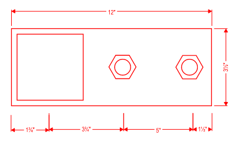

# PCN# 041 - Rolling Shutters HSS

**Source**: `PCN# 041 - Rolling Shutters HSS.pdf`  
**Pages**: 2  
**Extracted**: 2026-01-09 18:31:57

---

## Page 1

PROPOSED CHANGE NOTICE

2445-41

 
No work is to be done before this matter is finalized and a "Change Order" is issued.  This copy to remain with your office.  Do not return.  
Contractor to submit signed letter with price including cost breakdown and change (if any) to construction schedule.  Authority having 
Jurisdiction shall advise of any objections. 
 
 
 
 
TO: 
QUOREX CONSTRUCTION SERVICES LTD. 
 
 
 
1630A 8th Avenue,  
 
 
Regina, SK S4R 1E5 
 
 
RE: 
AURORA FOOD STORE 
 
 
2000 ANAQUOD ROAD 
 
 
REGINA, SK 
 
 
Commission No. 2445 
 
 
DATE: 
October 15, 2025 
 
 
PAGES: 
2 (including cover) 
 
 
RE: 
Rolling Shutters HSS 
 
1.0 
STRUCTURAL 
 
 
.1 
Refer to attached Structural PCN S2, dated October 15, 2025 (1 page text) 
 
 
 
 
 
 
 
2.0 
ARCHITECTURAL 
 
 
.1 
Install steel angle and HSS to suite Pharmacy security grilles. 
 
 
Orientation of north baseplate to face westward, located below steel stud wall. 
 
 
.2 
Frame steel studs / wood blocking to suite. 
 
 
Exposed sides to be finished with gypsum board. Refer to Décor for finishes. 
 
 
.3 
Window #W12 rough opening size may reduce in width to accommodate framing. 
 
 
 
 
 
 
 
 
 
Distribution: 
Sobeys Inc. – Jeff Craig 
jeff.craig@sobeys.com 
Sobeys Inc. – Shanwen Hsu 
shanwen.hsu@sobeys.com 
Quorex Construction Services Ltd. – Chris Walbaum 
c.walbaum@quorex.ca 
Quorex Construction Services Ltd. – Dustin Williamson 
d.williamson@quorex.ca 
Lavergne Draward & Associates Inc. – Charles Koop 
ckoop@ldaeng.ca 
CGM Engineering – Justin Albo 
justin_albo@cgmeng.ca 
CGM Engineering – Tony Mitousis 
tony_mitousis@cgmeng.ca 
CGM Engineering – Brendan Simpson 
brendan_simpson@cgmeng.ca 
 
 
 
 
 
 
 
Principal 
Kevin Fawley, SAA MRAIC 

## Page 2

 
 
Project Name: 
Aurora Food Store  
 
Contractor:  
Quorex 
 
Proposed Change Notice 
Pursuant to the conditions of the Present Contract, the following items are proposed changes to 
the work for the above project.  Submit cost of changes, including all sub-contract quotations, as 
additions or deductions to the Contract Price. Show a breakdown of cost for all labour, material, 
equipment and services required to complete the work described. No work shall proceed until 
formal approval is provided for the work. 
 
Project No.: 
24739 
 
 
 
Date: October 15, 2025 
 
Item/Reference 
Instigation and Description 

 
Item # 1   
Rolling shutter end supports 
Instigation: 
Design Continuation 
Reference:  
SD# 049 R1 Rolling Shutter 

a) 
At South end of shutter, provide L102x102x4.8 at full height required by 
shutter welded to HSS column South of GL E.  

 
b) 
At North end of shutter provide steel HSS 76x76x6.4 c/w slip connection to 
underside of beam above.  Base plate to be ½”x3½”x12” c/w 2-¾”Ø Hilti 
Hit-Hy 200 4” embedment. 

 
 
GC to coordinate dimensions and locations with architectural drawings to ensure 
structural components are kept within stud walls.  GC to coordinate with roller shutter 
shop drawings to ensure structure is provided where required by roller shutter shop 
drawings. 
 
 
 

 
 
 
 
  
Page 1 of 1 
PCN # S2 

