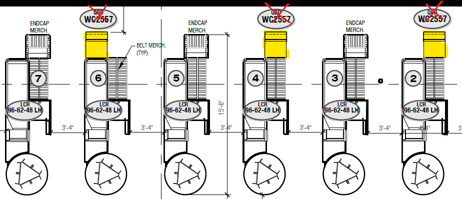

# PCN# 053 - Checkout Pop Cooler Power

**Source**: `PCN# 053 - Checkout Pop Cooler Power.pdf`  
**Pages**: 9  
**Extracted**: 2026-01-09 18:32:03

---

## Page 1

PROPOSED CHANGE NOTICE

2445-53

No work is to be done before this matter is finalized and a "Change Order" is issued.  This copy to remain with your office.  Do not return. 
Contractor to submit signed letter with price including cost breakdown and change (if any) to construction schedule.  Authority having 
Jurisdiction shall advise of any objections. 

QUOREX CONSTRUCTION SERVICES LTD. 
1630A 8th Avenue,  
Regina, SK S4R 1E5 

TO: 

AURORA FOOD STORE 
2000 ANAQUOD ROAD 
REGINA, SK 
Commission No. 2445 

RE: 

November 27, 2025 

DATE: 

9 (including cover) 

PAGES: 

Checkout Pop Cooler Power 

RE: 

1.0 
ELECTRICAL 

.1 
Refer to attached Electrical PCN #26, dated November 26, 2025 (3 pages). 

.2 
QBD version  is no longer available.  
Sobeys has purchased the Elegant RDEL-22 (cut sheet attached, 5 pages). 

Distribution: 
Sobeys Inc. – Jeff Craig 
jeff.craig@sobeys.com 
Sobeys Inc. – Shanwen Hsu 
shanwen.hsu@sobeys.com 
Quorex Construction Services Ltd. – Chris Walbaum 
c.walbaum@quorex.ca
Quorex Construction Services Ltd. – Dustin Williamson 
d.williamson@quorex.ca
Lavergne Draward & Associates Inc. – Charles Koop 
ckoop@ldaeng.ca 
CGM Engineering – Justin Albo 
justin_albo@cgmeng.ca 
CGM Engineering – Tony Mitousis 
tony_mitousis@cgmeng.ca 
CGM Engineering – Brendan Simpson 
brendan_simpson@cgmeng.ca 

Principal 
Kevin Fawley, SAA MRAIC 

## Page 2

 
 
ELECTRICAL PROPOSED CHANGE NOTICE #26 
 
 
24-258 
 

Project: 
Aurora Grocery Store 
 
2000 Anaquod Road, Regina, Saskatchewan 
Subject: 
Checkout Beverage Coolers 
Date: 
2025.11.26 
 

Subject: 
Checkout Beverage Coolers 
References: 
Electrical Drawing E0.3 – Schedules 
 
Electrical Drawing E2.0 – Power 
 

1. 
Refer to attached drawing E0.3 - Schedules for revisions in Panel ‘2C’. Three(3) 15A-2P breakers 
are added for three(3) checkout beverage coolers. Three(3) 15A-1P breakers are revised to ‘spare’ 
circuits. 

2. 
Refer to attached drawing E2.0 – Power, total of three(3) NEMA 5-15 receptacles are replaced by 
three(3) NEMA 6-15 receptacles to serve checkout beverage coolers. 

 
 
Brendan Simpson, E.I.T. 
- 1 - 

200-1100 Corydon Avenue     Winnipeg, Manitoba     R3M 0Y8     204-272-3255     www.cgmeng.ca 

## Page 3

EF-9, EXHAUST FAN
#10 WIRE
30

ERV-1, ENERGY RECOVERY VENTILATOR
15
25
ɸ
26
15
UH-2, UNIT HEATER

EHC-1, ELECTRIC HEATING COIL
#8 WIRE
50

EHC-2, ELECTRIC HEATING COIL
#8 WIRE
35

EFF-1, FORCE FLOW HEATER (1 x 2.0 kW)
15

EFF-1. FORCE FLOW HEATER (1 x 2.0 kW)
15

EBB-1, BASEBOARD HEATERS (4 x 1.0 kW)
#10 WIRE
25

FIRE ALARM CONTROL PANEL
15
1
ɸ
2

ROOF MAINTENANCE RECEPTACLE
20
19
ɸ
20
15
SC RECEPTACLE

ROOF MAINTENANCE RECEPTACLE
20
21
ɸ
22
15
HOUSEKEEPING RECEPTACLES

ROOF MAINTENANCE RECEPTACLE
20
23
ɸ
24
15
GF RECEPTACLE

ROOF MAINTENANCE RECEPTACLE
20
25
ɸ
26
15
SPARE

ROOF MAINTENANCE RECEPTACLE
20
27
ɸ
28
15
HOUSEKEEPING RECEPTACLE

ROOF MAINTENANCE RECEPTACLE
20
29
ɸ
30
-
SPACE

ROOF MAINTENANCE RECEPTACLE
20
31
ɸ
32
-
SPACE

ROOF MAINTENANCE RECEPTACLE
20
33
ɸ
34
-
SPACE

ROOF MAINTENANCE RECEPTACLE
20
35
ɸ
36
-
SPACE

ROOF MAINTENANCE RECEPTACLE
20
37
ɸ
38
-
SPACE

ROOF MAINTENANCE RECEPTACLE
20
39
ɸ
40
-
SPACE

DWH-1, DOMESTIC WATER HEATER
15
1
ɸ
2
-
SPACE

DWH-2, DOMESTIC WATER HEATER
15
3
ɸ
4
15
EF-3, EXHAUST FAN

P-1, RE-CIRCULATION PUMP
15
5
ɸ
6
15
EF-4, EXHAUST FAN

P-2, RE-CIRCULATION PUMP
15
7
ɸ
8
15
EF-5, EXHAUST FAN

MUA-1, MAKE-UP AIR
20

DATA RACK
20
7
ɸ
8

CU-1, CONDENSING UNIT
20

SPACE
-
35
ɸ
36
-
SPACE

SPACE
-
49
ɸ
50
-
SPACE

SPACE
-
51
ɸ
52
-
SPACE

SPACE
-
53
ɸ
54
-
SPACE

SPACE
-
55
ɸ
56
-
SPACE

SPACE
-
57
ɸ
58
-
SPACE

SPACE
-
59
ɸ
60
-
SPACE

SPACE
-
61
ɸ
62
-
SPACE

SPACE
-
63
ɸ
64
-
SPACE

SPACE
-
65
ɸ
66
-
SPACE

SPACE
-
67
ɸ
68
-
SPACE

SPACE
-
69
ɸ
70
-
SPACE

SPACE
-
71
ɸ
72
-
SPACE

SPACE
-
73
ɸ
74
-
SPACE

SPACE
-
75
ɸ
76
-
SPACE

SPACE
-
77
ɸ
78
-
SPACE

SPACE
-
79
ɸ
80
-
SPACE

SPACE
-
81
ɸ
82
-
SPACE

SPACE
-
83
ɸ
84
-
SPACE

SECURITY PANEL
20
5
ɸ
6

20
DOCK LEVELER
SPARE
20
9
ɸ
10

SPARE
20
11
ɸ
12

SPARE
20
13
ɸ
14
15
OVERHEAD DOOR

SPARE
15
15
ɸ
16
15
OVERHEAD DOOR

SPARE
15
17
ɸ
18
15
SC RECEPTACLE

SPACE
-
41
ɸ
42
-
SPACE

SPACE
-
43
ɸ
44
-
SPACE

SPACE
-
45
ɸ
46
-
SPACE

SPACE
-
47
ɸ
48
-
SPACE

SPACE
-
49
ɸ
50
-
SPACE

SPACE
-
51
ɸ
52
-
SPACE

SPACE
-
53
ɸ
54
-
SPACE

SPACE
-
55
ɸ
56
-
SPACE

SPACE
-
57
ɸ
58
-
SPACE

SPACE
-
59
ɸ
60
-
SPACE

SPACE
-
61
ɸ
62
-
SPACE

SPACE
-
63
ɸ
64
-
SPACE

SPACE
-
65
ɸ
66
-
SPACE

SPACE
-
67
ɸ
68
-
SPACE

SPACE
-
69
ɸ
70
-
SPACE

SPACE
-
71
ɸ
72
-
SPACE

SPACE
-
73
ɸ
74
-
SPACE

SPACE
-
75
ɸ
76
-
SPACE

SPACE
-
77
ɸ
78
-
SPACE

SPACE
-
79
ɸ
80
-
SPACE

SPACE
-
81
ɸ
82
-
SPACE

SPACE
-
83
ɸ
84
-
SPACE

SPACE
-
25
ɸ
26
15
AM-C37 (LIGHTS, FANS, ANTI-CONDENSATE)

SPACE
-
27
ɸ
28
15
AM-C38 (LIGHTS, FANS, ANTI-CONDENSATE)

SPACE
-
65
ɸ
66
15
AM-E14 (EVAPORATOR PANEL N)

AM-C26 (LIGHTS, FANS, ANTI-CONDENSATE)
15
71
ɸ
72
15
AM-C13 (DEFROST HEATERS)
SPACE
-
73
ɸ
74

SPACE
-
75
ɸ
76
15
AM-C16 (DEFROST HEATERS)
SPACE
-
77
ɸ
78

SPACE
-
79
ɸ
80
15
AM-C17 (DEFROST HEATERS)
SPACE
-
81
ɸ
82

SPACE
-
83
ɸ
84
15
AM-C18 (DEFROST HEATERS)
SPACE
-
85
ɸ
86

SPACE
-
87
ɸ
88
15
AM-C19 (DEFROST HEATERS)
SPACE
-
89
ɸ
90

SPACE
-
91
ɸ
92
15
AM-C20 (DEFROST HEATERS)
SPACE
-
93
ɸ
94

SPACE
-
95
ɸ
96
15
AM-C21 (DEFROST HEATERS)
SPACE
-
97
ɸ
98

SPACE
-
99
ɸ
100
15
AM-C22 (DEFROST HEATERS)
SPACE
-
101
ɸ
102

SPACE
-
103
ɸ
104
15
AM-C23 (DEFROST HEATERS)
SPACE
-
105
ɸ
106

SPACE
-
107
ɸ
108
-
SPACE

SPACE
-
109
ɸ
110
-
SPACE

SPACE
-
111
ɸ
112
-
SPACE

SPACE
-
113
ɸ
114
-
SPACE

SPACE
-
115
ɸ
116
-
SPACE

SPACE
-
117
ɸ
118
-
SPACE

SPACE
-
119
ɸ
120
-
SPACE

20
DOCK LEVELER
TELECOM BACKBOARD
20
3
ɸ
4

AM-C1 (LIGHTS, FANS, ANTI-CONDENSATE)
15
1
ɸ
2
15
AM-C27 (LIGHTS, FANS, ANTI-CONDENSATE)

AM-C2 (LIGHTS, FANS, ANTI-CONDENSATE)
15
3
ɸ
4
15
AM-C28 (LIGHTS, FANS, ANTI-CONDENSATE)

AM-C3 (LIGHTS, FANS, ANTI-CONDENSATE)
15
5
ɸ
6
15
AM-C29 (LIGHTS, FANS, ANTI-CONDENSATE)

AM-C4 (LIGHTS, FANS, ANTI-CONDENSATE)
15
7
ɸ
8
15
AM-C30 (LIGHTS, FANS, ANTI-CONDENSATE)

AM-C5 (LIGHTS, FANS, ANTI-CONDENSATE)
15
9
ɸ
10
15
AM-C31 (LIGHTS, FANS, ANTI-CONDENSATE)

AM-C6 (LIGHTS, FANS, ANTI-CONDENSATE)
15
11
ɸ
12
15
AM-C32 (LIGHTS, FANS, ANTI-CONDENSATE)

AM-C7 (LIGHTS, FANS, ANTI-CONDENSATE)
15
13
ɸ
14
15
AM-C33 (LIGHTS, FANS, ANTI-CONDENSATE)

AM-C8 (LIGHTS, FANS, ANTI-CONDENSATE)
15
15
ɸ
16
15
AM-C34 (LIGHTS, FANS, ANTI-CONDENSATE)

AM-C9 (LIGHTS, FANS, ANTI-CONDENSATE)
15
17
ɸ
18
15
AM-C35 (LIGHTS, FANS, ANTI-CONDENSATE)

AM-C10 (LIGHTS, FANS, ANTI-CONDENSATE)
15
19
ɸ
20
15
AM-C36 (LIGHTS, FANS, ANTI-CONDENSATE)

AM-C11 (LIGHTS, FANS, ANTI-CONDENSATE)
15
21
ɸ
22
15
AM-E8 (EVAPORATOR PANEL I)

AM-C12 (LIGHTS, FANS, ANTI-CONDENSATE)
15
23
ɸ
24
-
SPACE

AM-C13 (LIGHTS, FANS, ANTI-CONDENSATE)
15
29
ɸ
30
15
AM-C39 (LIGHTS, FANS, ANTI-CONDENSATE)

AM-C14 (LIGHTS, FANS, ANTI-CONDENSATE)
15
31
ɸ
32
15
AM-C40 (LIGHTS, FANS, ANTI-CONDENSATE)

AM-E2 (EVAPORATOR PANEL E)
15
33
ɸ
34
15
AM-C41 (LIGHTS, FANS, ANTI-CONDENSATE)

AM-C15 (LIGHTS, FANS, ANTI-CONDENSATE)
15
35
ɸ
36
15
AM-C42 (LIGHTS, FANS, ANTI-CONDENSATE)

AM-C16 (LIGHTS, FANS, ANTI-CONDENSATE)
15
37
ɸ
38
15
AM-C43 (LIGHTS, FANS, ANTI-CONDENSATE)

AM-C17 (LIGHTS, FANS, ANTI-CONDENSATE)
15
39
ɸ
40
15
AM-C44 (LIGHTS, FANS, ANTI-CONDENSATE)

AM-C18 (LIGHTS, FANS, ANTI-CONDENSATE)
15
41
ɸ
42
15
AM-C45 (LIGHTS, FANS, ANTI-CONDENSATE)

AM-C19 (LIGHTS, FANS, ANTI-CONDENSATE)
15
43
ɸ
44
15
AM-C46 (LIGHTS, FANS, ANTI-CONDENSATE)

AM-C20 (LIGHTS, FANS, ANTI-CONDENSATE)
15
45
ɸ
46
15
AM-C47 (LIGHTS, FANS, ANTI-CONDENSATE)

AM-C21 (LIGHTS, FANS, ANTI-CONDENSATE)
15
47
ɸ
48
15
AM-C48 (LIGHTS, FANS, ANTI-CONDENSATE)

AM-C22 (LIGHTS, FANS, ANTI-CONDENSATE)
15
49
ɸ
50
15
AM-C49 (LIGHTS, FANS, ANTI-CONDENSATE)

AM-C23 (LIGHTS, FANS, ANTI-CONDENSATE)
15
51
ɸ
52
15
AM-C50 (LIGHTS, FANS, ANTI-CONDENSATE)

AM-E3 (EVAPORATOR PANEL F)
15
53
ɸ
54
15
AM-C51 (LIGHTS, FANS, ANTI-CONDENSATE)

AM-E4 (EVAPORATOR PANEL G)
25

AM-C53 (LIGHTS, FANS)
15
59
ɸ
60
15
AM-E11 (EVAPORATOR PANEL K)

AM-C54 (LIGHTS, FANS)
15
61
ɸ
62
15
AM-E12 (EVAPORATOR PANEL L)

AM-E6 (EVAPORATOR PANEL H)
15
63
ɸ
64
15
AM-E13 (EVAPORATOR PANEL M)

AM-C24 (LIGHTS, FANS, ANTI-CONDENSATE)
15
67
ɸ
68
15
AM-E1 (EVAPORATOR PANEL D)
AM-C25 (LIGHTS, FANS, ANTI-CONDENSATE)
15
69
ɸ
70

PANEL '2B'

PANEL 'C1'

PANEL 'R1M'

100A-120/208V-3PH-4W PANEL
SURFACE MOUNTED IN COMPRESSOR ROOM 300

200A-120/208V-3PH-4W PANEL
SURFACE MOUNTED IN WEST STAFF CORRIDOR

200A-120/208V-3PH-4W PANEL
SURFACE MOUNTED IN WEST STAFF CORRIDOR

DESCRIPTION
CIRCUIT
BREAKER

DESCRIPTION
CIRCUIT
BREAKER

DESCRIPTION
CIRCUIT
BREAKER

13
ɸ
14
15
EF-8, EXHAUST FAN

15
ɸ
16
15
DF-2,4,6 - DESTRATIFICATION FAN

17
ɸ
18
15
DF-3,5,7 - DESTRATIFICATION FAN

19
ɸ
20
15
DF-1,8,9 - DESTRATIFICATION FAN

55
ɸ
56
15
AM-C52 (LIGHTS, FANS, ANTI-CONDENSATE)

23
ɸ
24
15
UH-1, UNIT HEATER

27
ɸ
28
15
UH-3, UNIT HEATER

29
ɸ
30
15
UH-4, UNIT HEATER

33
ɸ
34
15
MOTORIZED DAMPERS

37
ɸ
38
-
SPACE

39
ɸ
40
-
SPACE

45
ɸ
46
-
SPACE

57
ɸ
58
15
AM-E10 (EVAPORATOR PANEL J)

43
ɸ
44
-
SPACE

47
ɸ
48
-
SPACE

11
ɸ
12
15
EF-7, EXHAUST FAN

31
ɸ
32
15
UH-5, UNIT HEATER

21
ɸ
22
15
TF-1, TRANSFER FAN

41
ɸ
42
-
SPACE

9
ɸ
10
15
EF-6, EXHAUST FAN

PHASE
A    B    C

PHASE
A    B    C

PHASE
A    B    C

CIRCUIT
BREAKER
DESCRIPTION

CIRCUIT
BREAKER
DESCRIPTION

CIRCUIT
BREAKER
DESCRIPTION

2
SCALE:  NTS
FIRE ALARM RISER DIAGRAM

1.
FIRE ALARM RISER DIAGRAM SHOWN FOR REFERENCE ONLY.
2.
REFER TO ELECTRICAL DRAWINGS FOR QUANTITIES AND LOCATION OF DEVICES.
3.
PROVIDE ISOLATION MODULES AS REQUIRED. CONFIRM LOCATIONS WITH FIRE ALARM MANUFACTURER.
4.
INSTALLATION TO MEET CAN/ULC S524.
5.
FIRE ALARM MANUFACTURER TO PROVIDE SPECIFIC RISER IN APPROVAL PACKAGE.
6.
CONFIRM REQUIREMENT FOR POWER SUPPLIED AND/OR ADDITIONAL CLASS 'B' CIRCUITS TO
ACCOMMODATE THE CURRENT DRAW DUE TO REQUIRED CDL RATINGS ON AUDIBLE/VISUAL
NOTIFICATION DEVICES WITH FIRE ALARM MANUFACTURER.
7.
FIRE ALARM WIRING FOR ADDRESSABLE LOOP TO BE CLASS 'A'.
8.
PROVIDE A FIRE ALARM VERIFICATION INSPECTION REPORT UPON COMPLETION OF EACH PHASE, AND
FOR ALL FIRE ALARM DEVICES OR CIRCUITS ADDED OR MODIFIED THEREAFTER.
9.
ALLOW FOR THREE(3) ADDITIONAL COMBINATION HORN STROBES AS POSSIBLY REQUESTED BY THE
BUILDING INSPECTOR.
10. PROVIDE MINIMUM 60 MINUTE BACK-UP CAPACITY UNDER FULL LOAD.

NOTES:
1. C/W BUILT-IN THERMOSTAT, UNLESS OTHERWISE NOTED. WIRE TO REMOTE THERMOSTAT AS INDICATED ON
DRAWINGS.
2. REFER TO PANEL SCHEDULE FOR SOURCE VOLTAGE.
3. NOMINAL HEAT AS INDICATED ON DRAWING AT VOLTAGE OF SOURCE. UNITS ARE IN KILOWATTS, UNLESS
OTHERWISE INDICATED.
4. SUBMIT SHOP DRAWINGS FOR ALL HEATERS. REFER TO ARCHITECTURAL FOR FINISHES AND INDICATE ON SHOP
DRAWINGS.
5. PROVIDE ALL ASSOCIATED MOUNTING ACCESSORIES.
6. PROVIDE RELAY(S) AND WIRING FOR INTERLOCK BETWEEN ELECTRIC HEATER THERMOSTAT(S) AND AIR
CONDITIONING EQUIPMENT THERMOSTAT(S). INTERLOCK EQUIPMENT TO PREVENT HEATERS FROM OPERATING
CONCURRENTLY WITH AIR CONDITIONING IN ANY GIVEN HVAC ZONE. REFER TO MECHANICAL FOR CONTROL
REQUIREMENTS.

FIRE ALARM RISER NOTES:

TO TELEPHONE PANEL IN
MAIN ELECTRICAL ROOM
C/W CAT6 CABLES

SPRINKLER FLOW, TAMPER,
PRESSURE, AND TROUBLE
SWITCHES. COORDINATE
REQUIREMENTS WITH
SPRINKLER CONTRACTOR

ICE COOLER
15
33
ɸ
34
15
SERVICE DESK

EXTERIOR SIGNAGE
15
31
ɸ
32
15
SERVICE DESK

EXTERIOR SEATING RECEPTACLES
15
35
ɸ
36
15
BILLBOARD - CHECKOUT

ROLLER WINDOW SHUTTER
15
43
ɸ
44
15
EBB-1, BASEBOARD HEATER (1 x 2.0 kW)
ROLLER WINDOW SHUTTER
15
45
ɸ
46

ROLLER WINDOW SHUTTER
15
47
ɸ
48
15
EBB-1, BASEBOARD HEATER (1 x 2.0 kW)
ROLLER WINDOW SHUTTER
15
49
ɸ
50

EXTERIOR SIGNAGE
15
51
ɸ
52
15
CHECKOUT COOLER
WATER DISPENSER
15
53
ɸ
54

CHECKOUT #1
15
1
ɸ
2
15
SELF CHECKOUT #1

CHECKOUT #1
15
3
ɸ
4
15
SELF CHECKOUT #1

CHECKOUT #2
15
5
ɸ
6
15
SELF CHECKOUT #2

CHECKOUT #2
15
7
ɸ
8
15
SELF CHECKOUT #2

CHECKOUT #3
15
9
ɸ
10
15
SELF CHECKOUT #3

CHECKOUT #3
15
11
ɸ
12
15
SELF CHECKOUT #3

CHECKOUT #4
15
13
ɸ
14
15
SELF CHECKOUT #4

CHECKOUT #4
15
15
ɸ
16
15
SELF CHECKOUT #4

CHECKOUT #5
15
17
ɸ
18
15
SELF CHECKOUT #5

CHECKOUT #5
15
19
ɸ
20
15
SELF CHECKOUT #5

CHECKOUT #6
15
21
ɸ
22
15
SELF CHECKOUT #6

CHECKOUT #6
15
23
ɸ
24
15
SELF CHECKOUT #6

CHECKOUT COOLER
15

SPARE
15
29
ɸ
30
15
SERVICE DESK

COUNTER RECEPTACLES
20
37
ɸ
38
15
BILLBOARD - CHECKOUT

COUNTER RECEPTACLES
20
39
ɸ
40
15
BILLBOARD - CHECKOUT

COUNTER RECEPTACLES
20
41
ɸ
42
15
BILLBOARD - CHECKOUT

COINSTAR
15
55
ɸ
56
15
CHECKOUT COOLER
ATM
15
57
ɸ
58

SPACE
-
61
ɸ
62
15
SPARE

SPACE
-
63
ɸ
64
-
SPACE

SPACE
-
65
ɸ
66
-
SPACE

SPACE
-
67
ɸ
68
-
SPACE

SPACE
-
69
ɸ
70
-
SPACE

SPACE
-
71
ɸ
72
-
SPACE

SPACE
-
73
ɸ
74
-
SPACE

SPACE
-
75
ɸ
76
-
SPACE

SPACE
-
77
ɸ
78
-
SPACE

SPACE
-
79
ɸ
80
-
SPACE

SPACE
-
81
ɸ
82
-
SPACE

SPACE
-
83
ɸ
84
-
SPACE

SPACE
-
23
ɸ
24
15
AL-C37 (FANS, LIGHTS, ANTI-CONDENSATE)

SPACE
-
25
ɸ
26
15
AL-C38 (FANS, LIGHTS, ANTI-CONDENSATE)

SPACE
-
27
ɸ
28
15
AL-C39 (FANS, LIGHTS, ANTI-CONDENSATE)

SPACE
-
29
ɸ
30
15
AL-C40 (FANS, LIGHTS, ANTI-CONDENSATE)

SPACE
-
31
ɸ
32
15
AL-C41 (FANS, LIGHTS, ANTI-CONDENSATE)

SPACE
-
33
ɸ
34
15
AL-C42 (FANS, LIGHTS, ANTI-CONDENSATE)

SPACE
-
55
ɸ
56
-
SPACE

SPACE
-
57
ɸ
58
-
SPACE

SPACE
-
59
ɸ
60
-
SPACE

SPACE
-
61
ɸ
62
-
SPACE

SPACE
-
63
ɸ
64
-
SPACE

SPACE
-
65
ɸ
66
-
SPACE

SPACE
-
67
ɸ
68
-
SPACE

SPACE
-
69
ɸ
70
-
SPACE

SPACE
-
71
ɸ
72
-
SPACE

SPACE
-
73
ɸ
74
-
SPACE

SPACE
-
75
ɸ
76
-
SPACE

SPACE
-
77
ɸ
78
-
SPACE

SPACE
-
79
ɸ
80
-
SPACE

SPACE
-
81
ɸ
82
-
SPACE

SPACE
-
83
ɸ
84
-
SPACE

TO 120VAC POWER SUPPLY

TO SECURITY PANEL

VESTIBULE TV
15
59
ɸ
60
15
SPARE

AL-C1 (FANS, LIGHTS, ANTI-CONDENSATE)
15
1
ɸ
2
-
SPACE

AL-C2 (FANS, LIGHTS, ANTI-CONDENSATE)
15
3
ɸ
4
-
SPACE

AL-C4 (FANS, LIGHTS, ANTI-CONDENSATE)
15
5
ɸ
6
15
AL-C28 (FANS, LIGHTS, ANTI-CONDENSATE)

AL-C5 (FANS, LIGHTS, ANTI-CONDENSATE)
15
7
ɸ
8
15
AL-C29 (FANS, LIGHTS, ANTI-CONDENSATE)

AL-C6 (FANS, LIGHTS, ANTI-CONDENSATE)
15
9
ɸ
10
15
AL-C30 (FANS, LIGHTS, ANTI-CONDENSATE)

AL-C7 (FANS, LIGHTS, ANTI-CONDENSATE)
15
11
ɸ
12
15
AL-C31 (FANS, LIGHTS, ANTI-CONDENSATE)

AL-C8 (FANS, LIGHTS, ANTI-CONDENSATE)
15
13
ɸ
14
15
AL-C32 (FANS, LIGHTS, ANTI-CONDENSATE)

AL-C10 (FANS, LIGHTS, ANTI-CONDENSATE)
15
15
ɸ
16
15
AL-C33 (FANS, LIGHTS, ANTI-CONDENSATE)

AL-C11 (FANS, LIGHTS, ANTI-CONDENSATE)
15
17
ɸ
18
15
AL-C34 (FANS, LIGHTS, ANTI-CONDENSATE)

AL-C12 (FANS, LIGHTS, ANTI-CONDENSATE)
15
19
ɸ
20
15
AL-C35 (FANS, LIGHTS, ANTI-CONDENSATE)

AL-C14 (FANS, LIGHTS, ANTI-CONDENSATE)
15
21
ɸ
22
15
AL-C36 (FANS, LIGHTS, ANTI-CONDENSATE)

AL-C15 (FANS, LIGHTS, ANTI-CONDENSATE)
15
35
ɸ
36
15
AL-C43 (FANS, LIGHTS, ANTI-CONDENSATE)

AL-C16 (FANS, LIGHTS, ANTI-CONDENSATE)
15
37
ɸ
38
15
AL-C44 (FANS, LIGHTS, ANTI-CONDENSATE)

AL-C18 (FANS, LIGHTS, ANTI-CONDENSATE)
15
39
ɸ
40
15
AL-C45 (FANS, LIGHTS, ANTI-CONDENSATE)

AL-C19 (FANS, LIGHTS, ANTI-CONDENSATE)
15
41
ɸ
42
15
AL-C46 (FANS, LIGHTS, ANTI-CONDENSATE)

AL-C20 (FANS, LIGHTS, ANTI-CONDENSATE)
15
43
ɸ
44
15
AL-C47 (FANS, LIGHTS, ANTI-CONDENSATE)

AL-C22 (FANS, LIGHTS, ANTI-CONDENSATE)
15
45
ɸ
46
15
AL-C48 (FANS, LIGHTS, ANTI-CONDENSATE)

AL-C23 (FANS, LIGHTS, ANTI-CONDENSATE)
15
47
ɸ
48
-
SPACE

AL-C24 (FANS, LIGHTS, ANTI-CONDENSATE)
15
49
ɸ
50
-
SPACE

AL-C26 (FANS, LIGHTS, ANTI-CONDENSATE)
15
51
ɸ
52
-
SPACE

AL-C27 (FANS, LIGHTS, ANTI-CONDENSATE)
15
53
ɸ
54
-
SPACE

ELECTRIC HEAT SCHEDULE

PANEL 'C2'

PANEL 'R1L'

200A-120/208V-3PH-4W PANEL
RECESS MOUNTED IN OFFICE CORRIDOR

200A-120/208V-3PH-4W PANEL
SURFACE MOUNTED IN WEST STAFF CORRIDOR

TR
P
T
F
A
CO

A
CO
TR
P
T
F

EBB-1
BASE BOARD HEATER
OUELLET OFM
SERIES
-

EFF-1
 FORCE FLOW HEATER
OUELLET OAC
SERIES
-

TYPE
SYMBOL
DESCRIPTION
MANUFACTURER
REMARKS

FIRE SUPPRESSION SYSTEM

DESCRIPTION
CIRCUIT
BREAKER

DESCRIPTION
CIRCUIT
BREAKER

3 4"C.

3 4"C.

K

K

NEW
FIRE ALARM
CONTROL PANEL
(FACP)

25
ɸ
26
15
SERVICE DESK

27
ɸ
28
15
SERVICE DESK

PHASE
A    B    C

PHASE
A    B    C

CIRCUIT
BREAKER
DESCRIPTION

CIRCUIT
BREAKER
DESCRIPTION

TO ANNUNCIATOR PANEL

TO CENTRAL REPORTING

SCALE:  NTS
EMERGENCY LIGHTING AND SIGNAGE RISER

1.
INTERLOCK WITH NORMAL LIGHTING CIRCUITS TO ACTIVATE EMERGENCY LIGHTING
AND SIGNAGE UPON LOSS OF NORMAL LIGHTING IN THE LOCAL AREA. PROVIDE
ZONE SENSING RELAYS AS REQUIRED.
2.
ELECTRICAL CONTRACTOR TO WIRE AND CONNECT DC TO ALL EMERGENCY
LIGHTING AND SIGNAGE COMPONENTS.
3.
PROVIDE MINIMUM 60 MINUTE BATTERY BACK-UP CAPACITY UNDER FULL LOAD.
4.
ELECTRICAL CONTRACTOR TO SIZE CONDUCTORS TO MEET MANUFACTURER'S
RECOMMENDATIONS. MAXIMUM VOLTAGE DROP OF 5%.
5.
BEFORE REQUESTING THE ELECTRICAL CONSULTANT'S FIELD REVIEW FOR
SUBSTANTIAL PERFORMANCE OR OCCUPANCY CERTIFICATION, SUBMIT DATED AND
SIGNED DOCUMENTATION, ON COMPANY LETTERHEAD, TO THE ELECTRICAL
CONSULTANT INDICATING THAT THE EMERGENCY LIGHTING AND SIGNAGE SYSTEM
HAS BEEN FULLY INSTALLED AND TESTED ACCORDING TO THE CONSTRUCTION
DOCUMENTS AND OBSERVED TO OPERATE FULLY ON BACK UP POWER FOR THE
REQUIRED BACK UP PERIOD.
6.
ALLOW FOR THREE(3) ADDITIONAL EGRESS SIGNS AS POSSIBLY REQUESTED BY
THE FIRE MARSHALL.

EMERGENCY LIGHTING AND SIGNAGE RISER NOTES:

LOCAL LIGHTING
CIRCUIT(S)

SPACE
-
23
ɸ
24

SPACE
-
43
ɸ
44
-
SPACE

SPACE
-
45
ɸ
46
-
SPACE

SPACE
-
47
ɸ
48
-
SPACE

SPACE
-
49
ɸ
50
-
SPACE

SPACE
-
51
ɸ
52
-
SPACE

SPACE
-
53
ɸ
54
-
SPACE

SPACE
-
55
ɸ
56
-
SPACE

SPACE
-
57
ɸ
58
-
SPACE

SPACE
-
59
ɸ
60
-
SPACE

SPACE
-
43
ɸ
44
-
SPACE

SPACE
-
45
ɸ
46
-
SPACE

SPACE
-
47
ɸ
48
-
SPACE

SPACE
-
49
ɸ
50
-
SPACE

SPACE
-
51
ɸ
52
-
SPACE

SPACE
-
53
ɸ
54
-
SPACE

SPACE
-
55
ɸ
56
-
SPACE

SPACE
-
57
ɸ
58
-
SPACE

SPACE
-
59
ɸ
60
-
SPACE

AL-C2 (DEFROST HEATERS)
#10 WIRE
30

AL-C3 (DEFROST HEATERS)
#10 WIRE
30

AL-C5 (DEFROST HEATERS)
#10 WIRE
25

AL-C8 (DEFROST HEATERS)
#10 WIRE
25

AL-C9 (DEFROST HEATERS)
#10 WIRE
25

AL-C12 (DEFROST HEATERS)
#10 WIRE
25

AL-C13 (DEFROST HEATERS)
#10 WIRE
25

AL-C24 (DEFROST HEATERS)
#10 WIRE
25

AL-C25 (DEFROST HEATERS)
#10 WIRE
25

AL-C29 (DEFROST HEATERS)
#10 WIRE
25

AL-C30 (DEFROST HEATERS)
#10 WIRE
25

AL-C40 (DEFROST HEATERS)
#10 WIRE
25

AL-C41 (DEFROST HEATERS)
#10 WIRE
25

AL-C42 (DEFROST HEATERS)
#10 WIRE
25

AL-C1 (DEFROST HEATERS)
15

AL-C4 (DEFROST HEATERS)
15

AL-C6 (DEFROST HEATERS)
20

AL-C7 (DEFROST HEATERS)
15

AL-C10 (DEFROST HEATERS)
15

AL-C11 (DEFROST HEATERS)
15

AL-C14 (DEFROST HEATERS)
15

25
AL-C32 (DEFROST HEATERS)
#10 WIRE
AL-C26 (DEFROST HEATERS)
15

AL-C27 (DEFROST HEATERS)
15

AL-E4 (EVAPORATOR PANEL C)
25

AL-C28 (DEFROST HEATERS)
20

AL-C36 (DEFROST HEATERS)
15

AL-C37 (DEFROST HEATERS)
15

AL-C38 (DEFROST HEATERS)
15

AL-C39 (DEFROST HEATERS)
20

PANEL 'R2L'

PANEL 'R3L'

PANEL 'R4L'

400A-120/208V-3PH-4W PANEL
SURFACE MOUNTED IN WEST STAFF CORRIDOR

400A-120/208V-3PH-4W PANEL
SURFACE MOUNTED IN WEST STAFF CORRIDOR

400A-120/208V-3PH-4W PANEL
SURFACE MOUNTED IN WEST STAFF CORRIDOR

DESCRIPTION
CIRCUIT
BREAKER

DESCRIPTION
CIRCUIT
BREAKER

DESCRIPTION
CIRCUIT
BREAKER

. . . (TYPICAL)

13
ɸ
14
15
AL-C15 (DEFROST HEATERS)
15
ɸ
16

17
ɸ
18
25
AL-C16 (DEFROST HEATERS)
#10 WIRE
19
ɸ
20

13
ɸ
14

25
AL-C33 (DEFROST HEATERS)
#10 WIRE
15
ɸ
16

17
ɸ
18

19
ɸ
20

13
ɸ
14

25
AL-C45 (DEFROST HEATERS)
#10 WIRE
15
ɸ
16

17
ɸ
18

19
ɸ
20

25
ɸ
26
15
AL-C18 (DEFROST HEATERS)
27
ɸ
28

33
ɸ
34
25
AL-C20 (DEFROST HEATERS)
#10 WIRE
35
ɸ
36

37
ɸ
38
25
AL-C21 (DEFROST HEATERS)
#10 WIRE
39
ɸ
40

53
ɸ
54
-
SPACE

55
ɸ
56
-
SPACE

57
ɸ
58
-
SPACE

59
ɸ
60
-
SPACE

25
ɸ
26

33
ɸ
34
-
SPACE

35
ɸ
36
-
SPACE

37
ɸ
38
-
SPACE

39
ɸ
40
-
SPACE

25
ɸ
26

15
AL-C48 (DEFROST HEATERS)
33
ɸ
34

35
ɸ
36

37
ɸ
38
-
SPACE

39
ɸ
40
-
SPACE

23
ɸ
24

29
ɸ
30
15
AL-C19 (DEFROST HEATERS)
31
ɸ
32

41
ɸ
42
15
AL-C22 (DEFROST HEATERS)
43
ɸ
44

45
ɸ
46
15
AL-C23 (DEFROST HEATERS)
47
ɸ
48

49
ɸ
50
-
SPACE

20
AL-C35 (DEFROST HEATERS)
27
ɸ
28

29
ɸ
30

23
ɸ
24

20
AL-C47 (DEFROST HEATERS)
27
ɸ
28

29
ɸ
30

11
ɸ
12
-
SPACE

11
ɸ
12

11
ɸ
12

21
ɸ
22
25
AL-C17 (DEFROST HEATERS)
#10 WIRE

51
ɸ
52
-
SPACE

25
AL-C34 (DEFROST HEATERS)
#10 WIRE
21
ɸ
22

31
ɸ
32
-
SPACE

25
AL-C46 (DEFROST HEATERS)
#10 WIRE
21
ɸ
22

31
ɸ
32

41
ɸ
42
-
SPACE

41
ɸ
42
-
SPACE

5
ɸ
6
25
AL-E2 (EVAPORATOR PANEL B)
7
ɸ
8

5
ɸ
6

7
ɸ
8

5
ɸ
6

7
ɸ
8

1
ɸ
2
25
AL-E1 (EVAPORATOR PANEL A)
3
ɸ
4

9
ɸ
10
-
SPACE

25
AL-C31 (DEFROST HEATERS)
#10 WIRE
3
ɸ
4

9
ɸ
10

25
AL-C43 (DEFROST HEATERS)
#10 WIRE
3
ɸ
4

25
AL-C44 (DEFROST HEATERS)
#10 WIRE
9
ɸ
10

1
ɸ
2

1
ɸ
2

PHASE
A    B    C

PHASE
A    B    C

PHASE
A    B    C

CIRCUIT
BREAKER
DESCRIPTION

CIRCUIT
BREAKER
DESCRIPTION

CIRCUIT
BREAKER
DESCRIPTION

6"

7"

SCALE:
E0.3  ELECTRICAL - WALKERDUCT DETAIL 

5"
+/-2'-0"
6 1/2"
6 1/2"

N.T.S.

6"
3"

4"

5"

NOTE:   REFER TO STRUCTURAL. COORDINATE EXACT REQUIREMENTS WITH
GENERAL CONTRACTOR.

NOTES:
1. PROVIDE ALL LUMINAIRES, POLES AND LAMPS. REVIEW LIGHTING DRAWINGS AND ALL ASSOCIATED NOTES, PROVIDE ALL NECESSARY ACCESSORIES.
2. ADJUST FIELD-CONFIGURABLE LIGHTS AS INDICATED.
3. FINISHES TO BE CONFIRMED BY ARCHITECTURAL DURING SUBMITTALS REVIEW.
4. SUBMIT SHOP DRAWINGS ALL LUMINAIRES, POLES, LAMPS, AND ACCESSORIES.
5. WATTAGES FOR 'TBD' LIGHTS AND PROSPECTIVE EQUALS NOT TO EXCEED THE VALUES INDICATED.
6. CONFIRM CEILING TYPES WITH ARCH. PROVIDE TRIM KITS AND MOUNTING HARDWARE/ACCESSORIES AS REQUIRED FOR INSTALLATION BASED ON CEILING TYPE.

2x(#2) AND 1x(#4)
DUCTS.

NOTES:
1. WIRE AND CONNECT ALL MECHANICAL EQUIPMENT AS INDICATED. COORDINATE WITH MECHANICAL ON SITE.
2. CONFIRM ALL EQUIPMENT LOADS, CIRCUIT SIZES, AND MOUNTING HEIGHTS PRIOR TO ROUGH-IN.
3. PROVIDE ALL RELAYS & WIRING AND MAKE ALL CONNECTIONS FOR INTERLOCKING OF MECHANICAL EQUIPMENT AS REQUIRED.
CONFIRM AND COORDINATE EXACT REQUIREMENTS WITH MECHANICAL ON SITE.
4. PROVIDE ALL MOTOR STARTERS AND DISCONNECT SWITCHES AS REQUIRED.
5. ALL MOTOR STARTERS ARE TO BE COMPLETE WITH OVERCURRENT PROTECTION.
6. PROVIDE A SEPARATE CIRCUIT WEATHERPROOF GF T-SLOT DUPLEX RECEPTACLE MOUNTED ON ROOF NEXT TO ALL
EQUIPMENT MOUNTED ON ROOF FOR SERVICING OF EQUIPMENT AS PER C.E.C. 26-710.
7. ALL HIGH VOLUME LOW SPEED FANS ARE TO BE INTERLOCKED WITH FIRE ALARM SYSTEM TO SHUT DOWN IMMEDIATELY UPON
ACTIVATION OF SPRINKLER SYSTEM.
8. PROVIDE 120V POWER SUPPLY FOR MAKE-UP AIR (MUA) CABINET HEATERS AS REQUIRED. COORDINATE WITH MECHANICAL.
9. ALL EQUIPMENT BENEATH NFPA-96 HOOD TO DE-ENERGIZE UPON ACTIVATION OF ASSOCIATED FIRE SUPPRESSION SYSTEM.
10. WHERE 240V-1PH EQUIPMENT IS SHOWN AS FED WITH 208V-1PH OR WHERE 208V-1PH EQUIPMENT IS SHOWN AS FED WITH
240V-1PH, PROVIDE A DEDICATED SINGLE PHASE STEP-UP/DOWN TRANSFORMER FOR THAT EQUIPMENT. INSTALL
TRANSFORMER(S) NEXT TO EQUIPMENT DISCONNECTS AND FEED DISCONNECT THROUGH THE TRANSFORMER. CONFIRM EXACT
REQUIREMENTS WITH EQUIPMENT AND MANUFACTURER'S LITERATURE ON SITE.

TRACK BY
SIGNAGE
SUPPLIER

LUMINAIRE SCHEDULE

DWH-2
DOMESTIC WATER HEATER
MECHANICAL
ROOM
120V-1PH
5 AMPS
15A-1P
#12
-

MECHANICAL SCHEDULE

UH-1-4
UNIT HEATER
SUSPENDED IN
WAREHOUSE
120V-1PH
392 W
15A-1P
#12
-

DWH-1
DOMESTIC WATER HEATER
MECHANICAL
ROOM
120V-1PH
5 AMPS
15A-1P
#12
-

DF-1-9
DESTRATIFICATION FAN
SUSPENDED AT
HIGH LEVEL
120V-1PH
10.2 WATTS
15A-1P
#12
-

EHC-2
ELECTRIC HEATING COIL

MUA-1
MAKE-UP AIR UNIT
ROOF
208V-3PH
11.9 MCA
20A-3P
#12
-

RTU-2
ROOFTOP UNIT
ROOF
600V-3PH
55.8 MCA
70A-3P
#4
-

RTU-3
ROOFTOP UNIT
ROOF
600V-3PH
26.6 MCA
30A-3P
#10
-

RTU-4
ROOFTOP UNIT
ROOF
600V-3PH
8.2 MCA
15A-3P
#12
-

RTU-5
ROOFTOP UNIT
ROOF
600V-3PH
8.2 MCA
15A-3P
#12
-

RTU-5
ROOFTOP UNIT
ROOF
600V-3PH
8.2 MCA
15A-3P
#12
-

EHC-1
ELECTRIC HEATING COIL

RTU-1
ROOFTOP UNIT
ROOF
600V-3PH
117 MCA
125A-3P
#1
-

ERV-1
ENERGY RECOVERY
VENTILATOR

TYPE
DESCRIPTION
LOCATION
VOLTAGE
LOAD
CIRCUIT
BREAKER
WIRE SIZE
REMARKS

RH-2
RANGEHOOD
HMR
120V-1PH
60 WATTS
15A-1P
#12
-

RH-1
RANGEHOOD
HMR
120V-1PH
60 WATTS
15A-1P
#12
-

EF-2
EXHAUST FAN
DELETED
DELETED
DELETED
DELETED
DELETED
DELETED

EF-3
EXHAUST FAN
SUSPENDED
120V-1PH
80 WATTS
15A-1P
#12
-

EF-4
EXHAUST FAN
SUSPENDED
120V-1PH
141 WATTS
15A-1P
#12
-

EF-5
EXHAUST FAN
SUSPENDED
120V-1PH
62 WATTS
15A-1P
#12
-

EF-6
EXHAUST FAN
ROOF
120V-1PH
12 HP
15A-1P
#12
-

EF-7
EXHAUST FAN
ROOF
120V-1PH
12 HP
15A-1P
#12
-

EF-8
EXHAUST FAN
ROOF
120V-1PH
12 HP
15A-1P
#12
-

EF-9
EXHAUST FAN
ROOF
208V-3PH
3 HP
30A-3P
#10
-

CU-1
CONDENSING UNIT
ROOF
208V-1PH
13.9 AMPS
20A-2P
#12
-

EV-1
EVAPORATOR
WALL MOUNTED
208V-1PH
13.9 AMPS
20A-2P
#12
-

AC-1
AIR CURTAIN
WALL MOUNTED
600V-3PH
19.6 AMPS
25A-3P
#10
-

EF-1
EXHAUST FAN
ROOF
600V-3PH
1 HP
15A-3P
#12
-

TF-1
TRANSFER FAN
MOUNTED IN
CIELING
120V-1PH
170 WATTS
15A-1P
#12
-

P-2
RECIRCULATION PUMP
MECHANICAL
ROOM
120V-1PH
92 WATTS
15A-1P
#12
-

P-1
RECIRCULATION PUMP
MECHANICAL
ROOM
120V-1PH
270 WATTS
15A-1P
#12
-

CS-LT
OCCUPANCY SENSOR
SURFACE/CEILING MOUNT
LEVITON OSFHU-CTW-LINE VOLTAGE-CEILING MTD FOR LOW
TEMP. OPERATION (-40)
-
-

TYPE
DESCRIPTION
MOUNTING
MANUFACTURER
VOLT
WATT

LA2
4' LINEAR LED LUMINAIRE

RB
DECORATIVE PENDANT
9'-6" AFF TO U/S
KUZCO LIGHTING CORTANA PD82732-WH-LED WITH DC
DRIVER-3000K
120V
55W

CS
OCCUPANCY SENSOR
SURFACE/CEILING MOUNT
LEVITON ODC20-MDW LINE VOLTAGE (120V 0R 347) CEILING
MOUNTED MTD - WHITE
-
-

LA
4' LINEAR LED LUMINAIRE

M1
DECORATIVE PENDANT

VT
4' LED LUMINAIRE
SURFACE/CEILING MOUNT
DAY-BRITE/CFI BY SIGNIFY V3W443L840-UNV-DIM VAPOURLUME
LED V3W-4'-0"L
347V
29W

P2
DOWNLIGHT
RECESSED

P3
7" ROUND LED DOWNLIGHT
RECESSED
LIGHTOLIER BY SIGNIFY 7RN + C6L35835MZ10U + C7RDLNMCC
347V
29.1W

F2
2'X2' LED HIGH BAY LUMINAIRE
15'-0" AFF TYP. OR AS
NOTED ON PLAN
DAY-BRITE / CFI BY SIGNIFY HRL18L835-347-DIM-LFA-3500K-80CRI
347V
119.4W

F3
2'X4' LED LUMINAIRE
9' AFF TYP. OR AS NOTED
ON PLAN

LF
LINEAR LED

H1
8' LED STRIP LUMINAIRE

X2
EXTERIOR DOWNLIGHT
WALL MOUNTED
KEENE BY SIGNIFY
LPW3270NW-G3-3-347MGY
347V
70W

P1
6" ROUND LED DOWNLIGHT
RECESSED
LIGHTOLIER BY SIGNIFY 6RN + P6RDL20935MCCZ103
347V
15.6W

F1
2'X4' LED TROFFER

X1
EXTERIOR WALL SCONCE
WALL MOUNTED
ECLIPSE LIGHTING
BSC-TI-XL1-UP10-DN10-4K-80CRI-UNV-PNA-CTB-BBX1
347V
16W

R
FLEXIBLE LINEAR LED

C
TRACK LIGHT

N
2'X2' LED TROFFER

B
TRACK LIGHT

A
LED FLOOD LIGHT C/W TRACKHEAD

S
LED HIGH BAY LUMINAIRE

F
DOCK LIGHT
6'-0" A.F.F.
TRI-LITE DLGN-PLED
120V
20W

TRACK LIGHTING WITHIN SUSPENDED CEILINGS PROVIDED BY SIGNAGE SUPPLIER PER SIGNAGE SUPPLIER SPECIFICATIONS. TRACK LIGHTING PROVIDED BY SIGNAGE
SUPPLIER. SIGNAGE SUPPLIER TO PROVIDE ADEQUATE NUMBER OF TRACKHEADS TO ILLUMINATE THE SALES FLOOR, REFRIGERATION & DISPLAY TABLES TO PROVIDE
ADEQUATE ILLUMINATION/ FOOT CANDLES PER SOBEYS STANDARDS. TO ILLUMINATE REF. & DISPLAY UNITS & DEPT. SIGNS WHERE SUSPENDED CEILINGS.

ADJUSTABLE DUCT
SUPPORT @5'0" O.C.

FASTEN FEET TO
FORM OR CONCRETE
AS REQUIRED
@5'0" O.C.

LEVELING SCREWS &

PROVIDE AFTERSETS
C/W 1" EXTENSION
RINGS TO SUIT.

SUSPENDED IN
COMPRESSOR
ROOM

SUSPENDED IN
COMPRESSOR
ROOM

SUSPENDED IN
COMPRESSOR
ROOM

7'-0" TO U/S OF PENDANT &
PLACED CENTRE TO TABLE
LAYOUT

16'-0" AFF SPACED 15'-0"CC
(TYP.) & 12'-0"OC, CENTRE
TO GROCERY, DAIRY &
FROZEN DOOR AISLES

CEILING/SURFACE
MOUNTED OR SUSPENDED
@ 10'AFF OR AS NOTED ON
PLAN SPACED 6'0"OC
APART.

6' FROM WALL OR
BULKHEAD SPACED 36" CC
(SIGNAGE) OR 38" CC
(WALLPAPER) @ 15'-0" AFF

WALL/SURFACE MOUNTED
ABOVE ENTRY
DOORS/GLAZING

10' AFF IN HMR
SURFACE/CEILING MOUNT
AS APPLICABLE

9' AFF OR AS NOTED ON
PLAN SPACED TYP. 8' C.C.
HORIZONTAL & 6'-0"
VERTICAL

9' AFF OR AS NOTED ON
PLAN SPACED TYP. 8' C.C.
HORIZONTAL & 6'-0"
VERTICAL

2'-6" FROM TARGET EDGE
@ 15'-0" AFF SPACED 48"
CC & 72" CC (ENDS)

3'-6" FROM TARGET EDGE
IN PLAN @ 15'-0" AFF
SPACED 48" CC & 72" CC
(ENDS)

CEILING/SURFACE OR
STEM MOUNTED OR AS
NOTED ON PLAN SPACED
6'0"OC APART.

MOUNTED TO U/S OF
BULKHEAD ABOVE
REF.CASES (SWY ONLY)

120V-1PH
MCA: 12.9
AMPS
15A-1P
#12
-

208V-1PH
7.5 KW
50A-2P
#8
-

208V-1PH
5.5 KW
35A-2P
#8
-

DAY-BRITE/ CFI BY SIGNIFY SDS84998L8CST-UN3-DIM-80CRI-3500K
347V
77.5W

3D PRINTING BY
SIGNIFY-I-03-L-T801-GR000-SI400-BK01-S-BK602-CONEL-300-N-E26
120V
8W

LIGHTOLIER BY SIGNIFY
LCRM10H1 (FRAME) LCRM10940-H1-BK-T-Z10U(FIXTURE) LLMRNF
(OPTICS NARROW FLOOD)

DAY-BRITE/CFI SIGNIFY FBY18L835-347-WC6-18000L-3500K-80CRI
347V
133W

SIGNIFY #LWW40930AL 4000 LUMENS MOUNTED ON LYTESPAN
6000 SERIES ALUMINUM (GRAY) TRACK
120V
41W

DAY-BRITE / CFI BY SIGNIFY 2SBP3550L8CS-4-UN3-DIM-3500K
347V
51W

DAY-BRITE / CFI BY SIGNIFY 2SBP3040L8CS-2-UN3-DIM-3500K
347V
51W

COLOR KINETICS BY SIGNIFY VAYA FREE FORM DIMMABLE
WHITE-3000K-350-000019-07 (15FT), 350-000019-08 (30FT)
120V
84W

SIGNIFY 9038NAL - LYTESPAN GIMBAL
33PAR38/PER/830/S15/DIM/120V 6/1FB
MOUNTED ON LYTESPAN 6000 SERIES ALUMINUM TRACK

SIGNIFY 9038NAL - LYTESPAN GIMBAL
36PAR38/PER/830/F25/ND/DIM/120V 6/1FB
MOUNTED ON LYTESPAN 6000 SERIES ALUMINUM TRACK

SIGNIFY VAYA LINEAR MP G2 C/W MOUNTING HINGE
#3500-000023-15 & LEADER CABLE #308-000003-06
BEAM ANGLE 10X50-4000K-4378LM-80CRI

DAY-BRITE/ CFI BY SIGNIFY
2FGXG43L835-4-FS-347-DIM-4300L-80CRI-3500K
347V
31W

DAY-BRITE/ CFI BY SIGNIFY
FSI440L835-347-DIM-4000LM-80CRI-3500K
347V
29.3W

DAY-BRITE/ CFI BY SIGNIFY
FSI455L835-347-DIM-5500LM-80CRI-3500K
347V
40.3W

120V
33W

120V
36W

120V
60W

120V
11.5W

2-54 Adelaide Street Winnipeg Manit
a
ob
R3A 0V7
 P 204 947 3775
 F 204 947 3789
www.nejmark.mb.ca

AURORA GROCERY
STORE
2000 ANAQUOD ROAD
REGINA, SASKATCHEWAN

PROJECT TITLE:

DRAWN BY:

PRINTING DATE:

No.     ISSUED FOR                                      DATE                   BY

COMMISSION NUMBER:
SHEET NUMBER:

Drawings and specifications, as instruments of service are the property of the Architect, the
copyright in the same being reserved to them.  No reproduction may be made without the
permission of the architects, and when made, must bear their names.  All prints to be returned.

SHEET TITLE:

The contractor is to verify dimensions and date noted herein with conditions on the site and is
held responsible for reporting discrepancy to the Architect for adjustment.

SCHEDULES

KC
2025.10.19
PCN-21
1

KC
2025.11.20
PCN-25
3

KC
2025.11.25
PCN-27
5

KC
2025.11.20
PCN-24
2

KC
2025.11.25
PCN-28
6

KC
2025.11.25
PCN-26
4

© 2024 CGM ENGINEERING LTD.
THESE DRAWINGS ARE THE SOLE PROPERTY OF CGM ENGINEERING LTD. AND SHALL NOT
BE REPRODUCED WITHOUT WRITTEN CONSENT. THESE DRAWINGS SHALL NOT BE SCALED.

ENGINEERING LTD.

BS

N E J M A R K
A
R
C
H
I
T
E
C
T

NOVEMBER 25, 2025

PROJECT NO: 24258

( 2 0 4 )  2 7 2 - 3 2 5 5

200-698 CORYDON AVE

WINNIPEG, MB R3M 0X9

E0.3

## Page 4

8.1

8

7

6

5

4

3

2

1

9

1

3

2

EBB-1
1.0 kW

EBB-1
1.0 kW

A

B
A

27

100A-8,10,12

STAIRS
#2

N
 COMPRESSOR ROOM - POWER

GLASS &
ORGANICS
RECYCLE
194

2B-45,47

2B-45,47

300A

DN
21R

SCALE:
E2.0

EFF-1
2.0 kW

Z-1

2
SCALE:
E2.0

2B-1

2B-5

2B-37,39

C1-18

SC

100A-14,16,18

190D

EMERGENCY
CONDENSING
UNIT

C1-28

RECEIVING
190

HK

DWH-1

DWH-2

P-1

194

2B-3

Z-2,4

I-1

C1-22
C1-24

1/8" =1'-0"

GF

P-2

HK

2B-7

MD-1
-

193

CLEAN-UP
AREA
193

2B-24

C1-22

UH-1

C1-2,4,6

100B-19,21,23

EF-1

2B-4

EF-3
DF-8
DF-9

HK

33
33
33
33

2B-34

M

COMPRESSOR
ROOM
300

2B-45,47

190C
190B

OHD
OHD

SPRINKLER ROOM
192

C1-14

EBB-1
1.0 kW

1
PANEL
B

REFRIGERATION
RACK

CDP
100A

300B

HK

C1-28

C1-8,10,12

19

2B-45,47

34

CDP
100B

C1-3

EBB-1
1.0 kW

ATS
Z

2B-27,29

DF-1

2B-20

EHC-1

2

C1-16

2B-34

M

C1-1
C1-5

C1-20

2B-31,33

EHC-2

7
8

ERV-1

2B-25

EBB-1
1.0 kW

PANEL
2A

16

STAIRS
#3

SC

C-7

15

C1-22

C1-22

Z-5

190A

HK

18

O-25

O-29

Z-3

J
H
G
F
E
D
C
B

PANEL
C1

O-36,38

O-31

O-33

O-27
O-27

O-29

BAKERY FREEZER
131

DELI
COOLER
121

CHEESE
PREP
123

N
 FLOOR PLAN - POWER

29

28

IT
ROOM
114
DEP.
MAN.
113

PANEL
Z

STORE MAN.
OFFICE
112

CDP
SD-2

CDP
SD-1

TX
X1

TX
X2

O-23

O-36,38

113

SCALE:
E2.0

HK

1

15

O-33

EBB-1
1.0 kW

5

16
15

O-3

DELI
PREP
120

O-21

O-9
O-7
O-5

EV-1

1/8" = 1'-0"

O-32,34

131

EBB-1
0.5 kW

O-23

BAKERY
PREP
130

8

7

HK

114

O-44

112

PANEL
2B

LEARN
OFFICE
111

O-1

O-19

O-35
O-35
O-2,4

3

PANEL
D

PANEL
O

O-17

24

HK
HK

FILE
MAN
115

PANEL
C2

111

115

O-13

C
B

116

24

N
 LUNCH ROOM - POWER

FLORAL COOLER
109
CASH OFFICE
116

130

24

O-15

HK

O-1

O-22
O-24

3

M
a

STAFF
117

132

26

118

O-11

O-41

STAFF LOUNGE
201

HK
HK
HK
HK

BAKERY
COOLER
132

2A-4

TYP.

21

STAIRS
#1

1/8" =1'-0"

O-26

O-28

O-30

UP
21R

GF

SC

15

a

a

M

16

O-20

109B

HK

EF-4

HK

WOMEN'S WR
202

UNIVERSAL
WASHROOM
106

O-48

MEN'S WR
203

DF-2

DF-4

DF-6

2B-16

2B-16

2B-16

O-20

EF-5

O-46

O-40,42

O-1

HK

HD
HD

110

O-37

15

EBB-1
1.0 kW

HALL
205

GF

a

16

HD

HD

GF

GF

106

203

202

a

a

109A

O-14,16

O-18

O-18

O-10,12

2A-8
2A-10

WASHROOM
105
JANITOR
107

2A-8

O-40,42

FLORAL PREP
108

O-39

107

GF

LOCKERS
204

DN

DAIRY COOLER
133

EBB-1
1.0 kW

5

105

DF-3

DF-5

DF-7

2B-18

2B-18

2B-18

O-37

O-22

HK

2A-10

GF

O-6,8

a

16

2A-8

104

TYP.

21

133

C2-43

DRAWING NOTES - POWER

2A-10

1

2

3

4

5

6

7

8

9

35

FIRE ALARM ANNUNCIATOR PANEL C/W MULTI-LINE DIGITAL DISPLAY
INTERFACE. PANEL TO BE SURFACE MOUNTED.

MAIN TELECOM DEMARCATION BACKBOARD.

REFER TO DRAWING E2.1 FOR ENLARGED DELI POWER DRAWINGS.

REFER TO DRAWING E2.2 FOR ENLARGED BAKERY AND PHARMACY
POWER DRAWINGS.

REFER TO DRAWINGS E2.3 FOR ENLARGED SEAFOOD, MEATS AND
PRODUCE POWER DRAWINGS.

REFER TO DRAWINGS E2.4 FOR ENLARGED HMR POWER DRAWINGS.

FIRE ALARM CONTROL PANEL. PROVIDE A DEDICATED CIRCUIT,
CIRCUIT BREAKER TO BE PAINTED RED, LABELED 'FIRE ALARM
PANEL', AND BE LOCKED.

SERVICE ENTRANCE SPLITTER. COORDINATE LOCATION AND
CONFIRM EXACT REQUIREMENTS WITH SASKPOWER ON SITE.

SECURITY SYSTEM HEAD-END PANEL.

2B-20

191A

C2-33

2A-24

G.2
F.1
H
G.1
F.3
F
E.2
E.1
D.1

119C

2A-30

2A-14

C2-36
C2-38
C2-40
C2-42

TYP.

11

141A

TYP.

20

CONSULT
ROOM
141

PANEL
R1L

C2-3
C2-1

2A-4

17

2A-24

PANEL
R3L

2A-30

2A-14

C2-25,27

C2-31

22

PANEL
R2L

141B

140A
140B
140C

C2-7
C2-5

C2-45

TYP.

12
13

35
35

PANEL
R4L

C2-35

PANEL
R1M

TYP.

2A-24

21

C2-53

WP
WP
WP

2A-30

2A-14

C2-11
C2-9

WAREHOUSE
191

SALES
119

PANEL
P

C2-47

2B-26

UH-2
UH-3
UH-4

CHECKOUTS
104

C2-52,54

C2-51

C2-15
C2-13

18

2A-26

10

11

12

13

14

2A-16

2A-32

22

FOR EACH CHECKOUT STATION, PROVIDE ONE DEDICATED CIRCUIT
TO THE UPS AND ONE DEDICATED CIRCUIT FOR THE CONVEYOR
BELT, COURTESY RECEPTACLE AND MISCELLANEOUS RECEPTACLE.

PROVIDE UNDER FLOOR WALKERDUCT AFTERSETS OF SPECIFIED
SIZE (2-#2 AND 1-#4) TO FACILITATE POWER AND COMMUNICATION
FEED TO CUSTOMER CHECK STANDS, SELF CHECK-OUT AND
SERVICE DESK COMPLETE WITH REQUIRED JUNCTION BOXES,
CONDUITS AND FITTINGS.

SECURITY GATE CONTROLLER PANEL. PROVIDE POWER INCLUDING
NECESSARY CONTROL WIRES BETWEEN ASSOCIATED
COMPONENTS. COORDINATE WITH SECURITY GATE SUPPLIER.

PROVIDE AN UNDERFLOOR WALKERDUCT SYSTEM COMPLETE WITH
ALL NECESSARY DUCTS, FITTINGS, SUPPORTS, BOXES AND OTHER
REQUIRED ACCESSORIES IN COMPLIANCE WITH PROJECT
SPECIFICATIONS AND MANUFACTURER'S RECOMMENDATIONS.
ALIGN FLOOR DUCTS AND LOCATE AFTERSETS INCLUDING ALL
ASSOCIATED FITTING/ACCESSORIES IN ACCESSIBLE AREA WITHIN
THE DESIGNATED PRIMARY STUBBING AREA OF THE CHECKSTAND.
COORDINATE WITH MILLWORK CONTRACTOR, CHECKOUT COUNTER
SUPPLIER, ARCHITECTURAL AND STRUCTURAL PRIOR TO ROUGH-IN.

PROVIDE CONDUIT, WIRING AND CONNECTIONS FROM JUNCTION
BOX FOR AUTOMATIC DOORS UP TO RESPECTIVE PANEL.
COORIDNATE WITH DOOR HARDWARE SUPPLIER AND
ARCHITECTURAL.

24

OUTDOOR SEATING
103A

2B-28

C2-19
C2-17

C2-35

140D

2A-26

C2-57

2A-16

2A-32

C2-56,58

C2-23
C2-21

142

30

C2-49

2B-22

TF-1

C2-26

2A-28

PANEL
6L

2A-18

C2-30

2A-32

35

SERVICE
DESK
103

C2-28

C2-32

2A-38

2A-38

2A-32

2A-18

C2-35

E.3
H.1
F.2
G.3

PANEL
2L

2A-4

C2-34

C2-55

2A-28

36

36

2A-18

C2-2
C2-4

TYP.

25

C2-44,46

15

16

17

18

19

20

21

EBB-1
2.0 kW

2A-28

PROVIDE 1" DIAMETER CONDUIT FROM STRUCTURAL COLUMN TO
INDICATED GONDOLA. PRIOR TO CONCRETE POURING, EXAMINE
SITE AND CONFIRM ROUTING OF CONDUIT WITH GC AND ALL
ASSOCIATED TRADES.

INSTALL JUNCTION BOX EITHER UNDER THE SHELVES (SPACE
PERMITTING) OR AT THE INTERNAL LOWER MOST PART OF
SHELVING. POWER TO RUN DOWN STRUCTURAL COLUMN AS
NEEDED. TYPICAL.

PROVIDE PATHWAYS, CIRCUIT WIRING AND CONNECTIONS TO
ACCESS CONTROL SYSTEM. E.C. IS RESPONSIBLE FOR ALL LOW
VOLTAGE WIRING BETWEEN SYSTEM DEVICES AND REQUIRED
CONNECTIONS TO THE DOOR HARDWARE FOR A COMPLETE AND
OPERATION SYSTEM. COORDINATE WITH DOOR HARDWARE
SUPPLIER AND SECURITY CONTRACTOR PRIOR TO ROUGH-IN.

AREA TO BE CONSIDERED A CATEGORY 1 LOCATION AS PER C.E.C.
SECTION 22-002. PROVIDE WIRING METHODS, FIXTURES AND
DEVICES TO SUIT.

DATA RACK. CONFIRM EXACT REQUIREMENTS WITH SOBEYS I.T.
DEPARTMENT.

BILLBOARD RECEPTACLES TO BE RECESSED INTO WALL
STRUCTURE BY MINIMUM 50mm. COORDINATE WITH DECOR AND
ARCHITECTURE DRAWINGS FOR FINAL MOUNTING HEIGHT AND
LOCATIONS.

SITE LIGHTING PANEL PROVIDED AND INSTALLED BY OTHERS.
COORDINATE EXACT REQUIREMENTS WITH GC ON SITE.

C2-14

C2-6
C2-8

119D

2A-18

SEATING
101

SELF CHECKOUTS
102

C2-16

2A-6

C2-18

C2-10
C2-12

C2-48,50

C2-20

2A-21
2A-23
2A-25
2A-27

C2-37

2A-20

2A-9

2A-11

153B
154

C2-39

100B

a
a
a

C2-41

24

EBB-1
2.0 kW

TYP.

14

C2-22

32

17

C2-24

GROCERY FREEZER
154

2A-29

22

100A

23

RH-1
RH-2

2A-20

100B-20,22,24

2A-1

H-26

VESTIBULE
100

100C

2A-34

AC-1

R

2A-5

HMR PREP
181

9

HMR
180

2A-3

2B-30

6

TYP.

2A-20

14

2A-7

TYP.

14

H-28

2A-12

2A-12

22

23

24

25

26

27

28

29

10

C2-59

182

PROVIDE DEDICATED 15A CIRCUIT FOR EXTERIOR SIGNS.
COORDINATE WITH ARCHITECT AND SIGN PROVIDER TO DETERMINE
EXACT LOCATION AND ELECTRICAL REQUIREMENTS FOR SIGNS.

PROVIDE 1" DIAMETER CONDUIT AS INDICATED. PRIOR TO
CONCRETE POURING, EXAMINE SITE AND CONFIRM ROUTING  OF
CONDUIT WITH GC AND ALL ASSOCIATED TRADES.

PROVIDE UNDER FLOOR JUNCTION BOX COMPLETE WITH CONDUIT
HUB FOR POWER, VOICE/DATA AND SECURITY SYSTEM CABLE
DISTRIBUTION TO SELF CHECKOUTS, SELF CHECKOUTS AND
SERVICE DESK. UNDER FLOOR JUNCTION BOXES TO BE C/W
NECESSARY DUCTS, CONDUITS, FITTINGS AND PANEL
CONNECTORS TO CONNECT THE FLOOR DUCT SYSTEM TO
CORRESPONDING ELECTRICAL PANELS.

RUN POWER AS NOTED FOR CHECKOUTS IN CONDUIT AND IN
CEILING. POWER TO DROP DOWN 'IT ROOM 112' WALL AND INTO
WALK DUCT AS REQUIRED.

LEAK DETECTOR PANEL. COORDINATE EXACT REQUIREMENTS WITH
MICRO THERMO ON SITE.

EMS SYSTEM PC CABINET. COORDINATE EXACT REQUIREMENTS
WITH MICRO THERMO ON SITE.

EMS SYSTEM PANEL. COORDINATE EXACT REQUIREMENTS WITH
MICRO THERMO ON SITE.

CONFIRM MOUNTING HEIGHT OF RECEPTACLES IN DASHED AREA.
COORDINATE WITH GENERAL CONTRACTOR AND ISLAND SUPPLIER.

MEAT/KITCHEN
FREEZER
153

2A-20

31

KITCHEN
COOLER
182

2A-34

2A-4

2A-12

2A-12

24

2B-20

15
16

191B

2A-2

2A-31

153A

22

152

22

MEAT COOLER
152

2A-22

2A-36

2A-22

151A

MEAT PREP
151

151B

30

31

32

33

34

35

36

37

BUTCHER SHOP
150

2A-36

EMS SYSTEM LIGHTING CONTROL PANEL. REFER TO DRAWING E7.0
FOR DETAILS.

PROVIDE RED SHUT OFF BUTTON AND LAMACOID LABEL AS PER
C.E.C. 26-750 TO DE-ENERGIZE EXHAUST FANS ASSOCIATED WITH
HOOD. CONFIRM EXACT LOCATION ON SITE. REFER TO
MANUFACTURER'S LITERATURE.

PROVIDE JUNCTION BOX, CONDUIT, WIRING AND CONNECTION (FOR
COMPACTOR, DOCK LEVELLER, AND OVERHEAD DOOR) TO
RESPECTIVE PANEL TO SUIT TENANT FIT-UP REQUIREMENTS.

RECEPTACLES FOR SHELVING LIGHT BOX. RECEPTACLE TO BE
MOUNTED BEHIND LIGHT BOX. CONFIRM EXACT REQUIREMENTS
WITH MANUFACTURER'S LITERATURE AND RACHELLE BERY DESIGN
PACKAGE.

WIRE AND CONNECT FIRE SUPPRESSION SYSTEM FOR COOKING
LINE HOOD. INTERCONNECT WITH FIRE ALARM SYSTEM TO
ACTIVATE A FIRE CONDITION UPON ACTIVATION OF FIRE
SUPPRESSION SYSTEM. ALL ELECTRICAL BELOW HOOD TO
DE-ENERGIZE UPON FIRE SUPPRESSION DISCHARGE.

DRY TYPE MISTING SYSTEM. COORDINATE PLACEMENT LOCATION
AND TYPE AT SITE. CONNECTION AS PER CUTSHEET.

COMPRESSOR RACK. WIRE AND CONNECT AS REQUIRED.

WIRE AND CONNECT ROLLER WINDOW SHADES C/W MANUAL
CONTROL SWITCH AS REQUIRED. REFER TO SOBEYS' MASTER
SPECIFICATION FOR DETAILS.

2A-37

SEAFOOD
PREP
137

22

171

24

4

161

EFF-1
2.0 kW

PRODUCE
PREP
170

2B-34

PRODUCE
COOLER
171

162

M

SEAFOOD
COOLER
162

24

2B-41,43

170

15

16

2A-40

2A-39

2A-35

2A-33

2A-19

2A-17

2A-15

2A-13

22

22

119B

17

37

37

15

PANEL
SM

PANEL
H

16

2-54 Adelaide Street Winnipeg Manit
a
ob
R3A 0V7
 P 204 947 3775
 F 204 947 3789
www.nejmark.mb.ca

AURORA GROCERY
STORE
2000 ANAQUOD ROAD
REGINA, SASKATCHEWAN

PROJECT TITLE:

DRAWN BY:

PRINTING DATE:

No.     ISSUED FOR                                      DATE                   BY

COMMISSION NUMBER:
SHEET NUMBER:

Drawings and specifications, as instruments of service are the property of the Architect, the
copyright in the same being reserved to them.  No reproduction may be made without the
permission of the architects, and when made, must bear their names.  All prints to be returned.

FLOOR PLAN -
POWER

SHEET TITLE:

The contractor is to verify dimensions and date noted herein with conditions on the site and is
held responsible for reporting discrepancy to the Architect for adjustment.

KC
2025.10.19
PCN-21
1

KC
2025.11.20
PCN-25
3

KC
2025.11.20
PCN-24
2

KC
2025.11.25
PCN-26
4

GENERAL NOTES

1.
COORDINATE WITH G.C. AND OTHER SUBTRADES AND
MINIMIZE OR ELIMINATE CONDUIT DROPS TO MAINTAIN
THE OVERALL AESTHETIC APPEARANCE OF THE AREA.

10.
ALL CONDUIT AND WIRING IN MEAT COOLER BOX AND
MEAT PREP AREA SHALL BE CONCEALED. SURFACE
RUN IS NOT ACCEPTABLE.

11.
ALL RECEPTACLES AND WIRING METHODS WITHIN
COOLERS, FREEZERS, SEAFOOD PREP., MEAT PREP.
AND PRODUCE PREP. AREAS SHALL BE IN
ACCORDANCE WITH CEC RULES 22-108 AND 22-200
RESPECTIVELY. (CATEGORY 1 LOCATION).

12.
ALL CONDUIT IN SALES AREA COLUMNS MUST BE
MOUNTED ON THE BACKSIDE (FACING REAR OF STORE).
REFER TO ARCHITECTURAL DRAWINGS FOR
LOCATIONS OF FURRING FOR COLUMNS.

13. ENSURE THERE ARE NO CONDUIT/WIRING RUNS
LOCATED BENEATH OVENS, PROOFERS AND
FREEZERS.

14.
ALL WIRING FOR OUTLETS AND DEVICES LOCATED ON
PERIMETER BUILDINGS WALLS SHALL BE RUN
CONCEALED WHERE VISIBLE TO THE PUBLIC.
COORDINATE WITH GENERAL CONTRACTOR.

15.
VERIFY EXACT LOCATION OF ALL STUB-UP LOCATIONS
WITH OWNER'S REPRESENTATIVE, REFRIGERATION
CONTRACTOR AND FIXTURE/EQUIPMENT SUPPLIER
PRIOR TO ROUGH-IN.

16.
COORDINATE FINAL EQUIPMENT LOCATIONS WITH
MECHANICAL PRIOR TO ROUGH-IN.

3.
INSTALL OUTLETS AT PREPARATION AREA
HORIZONTALLY AND AS HIGH AS PRACTICAL TO CLEAR
SINK, COUNTER OR TABLE BACKSPLASH.

5.
ALL EXPOSED ELECTRICAL CONDUITS IN OPEN CEILING
AREAS TO BE MOUNTED AS CLOSE AS POSSIBLE TO
THE UNDERSIDE OF ROOF DECK.

7.
SEAL CONDUITS WHERE PASSING THROUGH FLOOR,
EXTERIOR WALLS, CEILING, COOLERS, FREEZERS AND
MEAT ROOM.

8.
SITE VERIFY MOUNTING HEIGHT AND EXACT LOCATION
OF ALL OUTLETS PRIOR TO ROUGH-IN. ELECTRICAL
CONTRACTOR TO PROVIDE RECEPTACLES TO MATCH
PLUG TYPE OF EQUIPMENT. PROVIDE DIRECT
CONNECTIONS TO EQUIPMENT/FIXTURES WITH
CONNECTION BOXES OR TERMINALS. REFER TO
MILLWORK DRAWINGS AND FIXTURE CUTSHEETS.

9.
COORDINATE LOCATIONS AND MOUNTING OF ALL
CHECKOUT OUTLETS WITH MILLWORK CONTRACTOR
ON SITE DURING CONSTRUCTION. ALL CONNECTIONS
ARE TO BE ACCESSED FROM UNDERNEATH.

2.
UNDERGROUND CONDUITS TO BE ROUTED CLEAR OF
ALL WALK-IN BOX DOORS. VERIFY CLEARANCE
REQUIREMENTS WITH COOLER/FREEZER
ARCHITECTURAL DRAWINGS.

6.
UNLESS OTHERWISE APPROVED BY OWNER AND
ARCHITECT, ALL OUTLETS IN THE REAR STORAGE
AREA, LOADING DOCK AND PRODUCE WORK AREA
LOCATED BELOW 18'-0" SHALL BE FLUSH MOUNTED.
CONCEAL CONDUIT IN WALL. REFER TO
ARCHITECTURAL DRAWINGS FOR WALL TYPES AND
FINISHES.

4.
PROVIDE 2-1" DIAMETER SPARE STUB-OUT TO ALL
PANELS TO CEILING FOR FUTURE USE. SEAL AND CAP
THE CONDUIT.

© 2024 CGM ENGINEERING LTD.
THESE DRAWINGS ARE THE SOLE PROPERTY OF CGM ENGINEERING LTD. AND SHALL NOT
BE REPRODUCED WITHOUT WRITTEN CONSENT. THESE DRAWINGS SHALL NOT BE SCALED.

ENGINEERING LTD.

BS

N E J M A R K
A
R
C
H
I
T
E
C
T

NOVEMBER 25, 2025

PROJECT NO: 24258

( 2 0 4 )  2 7 2 - 3 2 5 5

200-698 CORYDON AVE

WINNIPEG, MB R3M 0X9

E2.0

## Page 5

Pastry Line

ELEGANT RDEL-22 (BSA)

Temperature class : 3M2
Refrigerant : R290

BSA

Available modules : 23.62''(0600), 35.43''(0900), 55.12''(1400)

BSA – low glass or front glass riser | single, straight | fixed

-BLACK SHELVES
-BLACK INTERIOR

STANDARD FEATURES

Working temperature from 2°C to 4°C (36°F to
39°F)
Electrical defrosting
Automatic evaporation of condensate
Electronic controller with temperature indicator
Energy-saving fans
Exposition: 3 suspended glass shelves + bottom
made of powder-painted, zinc-coated metal plate

SOLID
BACK

GLASS
ENDS

Lighting – top and each shelf – energy-saving,
LEDit, WW-2
Sidewalls integrated with thermopane glass,
with silkscreen painting

ARTICLE # 4037794 FOR RDEL-22 (1400/ 55.12")
ARTICLE # 4038067 FOR RDEL-22 (900/ 35.43")
ARTICLE # 4038068 FOR RDEL-22 (600/ 23.62") 

go.dauphinais.co / 1 800-864-7879 / info@dauphinais.co

## Page 6

TECHNICAL DATA
MULTIDECK
GENERAL

RDEL-22 Elegant

CROSS-SECTION

INFORMATION

name:
Elegant

symbol:
RDEL-22

code:
3M2-I-R290-BSA-T1

temp. class:
3M2

product temperature:
+30,2...+44,6 °F

working temp.:
+35,6...+39,2 °F

power supply:
~208V/60Hz

refrig. supply:
Plug-in

refrigerant:
R290

glass:
low glass, low front

type of glass:
single, straight

defrosting:
natural

fans:
ESM (room)
ESM (condenser)

lighting:
LED (shelves)

EXPOSITION SURFACES

surface
*
rows number
product
width [mm]
load height [mm]
angle [°]
load [kg/m2]

hanged shelve
1
1
normal
300
125
0
30

hanged shelve
2
1
normal
400
125
0
30

hanged shelve
3
1
normal
450
125
0
30

bottom shelve
4
1
normal
600
175
0
100

CHARACTERISTIC

module
*
[-]
0600
0900
1400

module length
5
[mm]
600
900
1400

display opening area
6
[m2]
0,31
0,46
0,71

total display area (TDA)
7
[m2]
0,58
0,87
1,36

net volume
8
[dm3]
133
212
336

refrigerated shelf area
9
[m2]
0,94
1,49
2,36

net weight
10
[kg]
-
-
-

NOTICE
The information included in the Technical Data of device refers to certain equipment defined in the first page.
All values and parameters are defined on the basis of standard PN EN ISO 23953 for the given temperature class, range of temperature and equipment

RECOMMENDATIONS
The correct work of devices enables its non-failure work with energetical rated parameters
Complying with the rules of device loading guarantees the stable temperature parameters of stored products
Properly selected operating parameters allow you to greatly reduce the cost of electricity consumption.
THE MANUFACTURER RESERVES THE RIGHT TO ALTER THE FEATURES AND TECHNICAL SPECIFICATIONS OF ITS PRODUCTS.

DATE: 2022-05-20
RDEL-22_3M2-I-R290-BSA-T1v2_no13543_EN.pdf
JBG-2 Sp. z o.o. Producer of Professional Refrigeration Equipment
www.jbg2.eu
43-254 WARSZOWICE, 5, Gajowa Str., Poland, Service tel. +48 32 475 91 57, +48 601 427 885

EN

Page: 1/4

## Page 7

TECHNICAL DATA
MULTIDECK
REFRIGERATION AND ELECTRIC

RDEL-22 Elegant

AMBIENT PARAMETERS
DEVICE WORKING PARAMETERS

1
climate class
-
3

6
device temperature class
-
M2

2
max. ambient temperature
[°F]
77

7
cabinet temperature
[°F]
+35,6...+39,2

3
max. ambient humidity
[%]
60

8
refr. evaporating / condensing temp.
[°F]
14 / +113

4
Illumination
[lux]
200

9
suction superheat / overcolling
[K]
- / -

5
max. ambient air speed
[m/s]
0.2

10
refrigerant
R290

11
Maximum allowable pressure PS
[bar]
30

COOLING DATA

module
*
[-]
0600
0900
1400

unit cooling capacity
12
[BTU/h]
3293
3586
5313

inlet tube
13
[mm]
6
6
6

outlet tube
14
[mm]
10
10
10

refrigerant charge
15
[g]
120
150
150

ELECTRICAL DATA

module
*
[-]
0600
0900
1400

power supply
16
[V/Hz]
~208/60
~208/60
~208/60

compressor
17
[W]
495
552
983

18
[A]
3,86
3,39
4,84

fans
19
[W]
4
8
10

20
[A]
0,03
0,06
0,38

lighting
21
[W]
18
29
48

22
[A]
0,10
0,17
0,27

heaters
23
[W]
213
219
223

24
[A]
0,92
0,95
0,97

RATED DATA

module
*
[-]
0600
0900
1400

power rate, current
25
[W]
740
808
1275

26
[A]
4,91
4,57
6,55

ELECTRICAL CONSUMPTION

module
*
[-]
0600
0900
1400

TEC
27
[kWh/24h]
11,90
12,57
18,44

EEI
28
[%]
75
67
78

Energy efficiency class / Class (EEI)**
29
F
F
F

** Energy efficiency class - refers to the energy labeling standard according to European Regulation (EU) 2019/2018

WORKING PARAMETERS 

30
defrosting time
[h/24h]
1.3

32
working time of heaters
[h/24h]
12

31
working time of fans
[h/24h]
24

33
working time of lighting
[h/24h]
12

PARAMETERS OF ELECTRICAL TERMINALS 

34
power supply, P+N+PE
[V/Hz]
~208/60
35
electrical connection - plug-in socket
-
NEMA6-15

TEC
- TOTAL ENERGY CONSUMPTION

NOTICE
In the devices with night curtain or covers, the covering time is 12h.

DATE: 2022-05-20
RDEL-22_3M2-I-R290-BSA-T1v2_no13543_EN.pdf
JBG-2 Sp. z o.o. Producer of Professional Refrigeration Equipment
www.jbg2.eu
43-254 WARSZOWICE, 5, Gajowa Str., Poland, Service tel. +48 32 475 91 57, +48 601 427 885

EN

Page: 2/4

## Page 8

TECHNICAL DATA
MULTIDECK
PARAMETERS, ELEMENTS LOCATION

RDEL-22 Elegant

CONTROLLING PARAMETERS 

1
set point ST
[°F]
35.6

6
correction ST by night
[K]
0

2
differential ST
[°F]
33.8

7
defrosting number
[il/24h]
8

3
set point correction ST
[°F]
28.4

8
temperature of defrosting end
[°F]
44.6

4
fan running during defrosting
[yes/no]
yes

9
maximum time of defrosting
[min]
30

5
stop fans temperature
[°F]
32

10
dripping time
[min]
3

WARNING! It is absolutely necessary to ensure that all devices connected in a line, in particular freezing devices, have synchronization of the defrosting process. 

1 - LOCALIZATION OF CONTROL PROBE
2 - LOCALIZATION OF DEFROSTING PROBE, DEFROSTING HEATERS
lm - MODULE LENGTH

S3 - CONTROL PROBE
S5 - DEFROSTING PROBE
le - LENGTH OF EVAPORATOR

Hd - DEFROSTING HEATER
EV - EXPANSION VALVE
AD - AIR FLOW DIRECTION

NOTICE
Automatic control system should ensure deicinig from evaporator and removal of water.
The devices in line must be controlled dependently. The control system of particular devices in line must synchronize the start and end of defrosting process
The defrosting process should be managed by temperature. 9-th parameter should be treated as emergency.
If the parameter number 4 is set on 'no' value, the fans work depends on the temperature value of defrosting probe (parameter no 5). During the dripping time of evaporator the fans don't work.
The correction set point by night ensures the correct device work with closed curtains. The parameter beneficially influences energy saving.
If it is necessary, please modify parameters to provide good work of device

DATE: 2022-05-20
RDEL-22_3M2-I-R290-BSA-T1v2_no13543_EN.pdf
JBG-2 Sp. z o.o. Producer of Professional Refrigeration Equipment
www.jbg2.eu
43-254 WARSZOWICE, 5, Gajowa Str., Poland, Service tel. +48 32 475 91 57, +48 601 427 885

EN

Page: 3/4

## Page 9

TECHNICAL DATA
MULTIDECK
DIMENSIONS

RDEL-22 Elegant

REFRIGERATION CONNECTION UNDER DEVICE
ELECTRIC CONNECTION UNDER DEVICE
CONDENSAT WATER DRAINAGE

UPPER REFRIGERATION CONNECTION
UPPER ELECTRICAL CONNECTION

NOTICE
To arrange a device you need to ensure its correct vantilation. The surfaces of side glass must be moved from walls in order to guarantee air flow to dry them.
To ensure the correct work the refrigeration devices must be moved from a wall on the distance of 50mm (remote device) and 100mm (plug-in).
THE MANUFACTURER RESERVES THE RIGHT TO ALTER THE FEATURES AND TECHNICAL SPECIFICATIONS OF ITS PRODUCTS.

DATE: 2022-05-20
RDEL-22_3M2-I-R290-BSA-T1v2_no13543_EN.pdf
JBG-2 Sp. z o.o. Producer of Professional Refrigeration Equipment
www.jbg2.eu
43-254 WARSZOWICE, 5, Gajowa Str., Poland, Service tel. +48 32 475 91 57, +48 601 427 885

EN

Page: 4/4

