# PCN# 055 - Illuminated Department Letters

**Source**: `PCN# 055 - Illuminated Department Letters.pdf`  
**Pages**: 46  
**Extracted**: 2026-01-09 18:32:07

---

## Page 1

PROPOSED CHANGE NOTICE

2445-55

 
No work is to be done before this matter is finalized and a "Change Order" is issued.  This copy to remain with your office.  Do not return.  
Contractor to submit signed letter with price including cost breakdown and change (if any) to construction schedule.  Authority having 
Jurisdiction shall advise of any objections. 
 
 
TO: 
QUOREX CONSTRUCTION SERVICES LTD. 
 
 
 
1630A 8th Avenue,  
 
 
Regina, SK S4R 1E5 
 
 
RE: 
AURORA FOOD STORE 
 
 
2000 ANAQUOD ROAD 
 
 
REGINA, SK 
 
 
Commission No. 2445 
 
 
DATE: 
November 28, 2025 
 
 
PAGES: 
46 (including cover) 
 
 
RE: 
Illuminated Department Letters 
 
1.0 
ELECTRICAL 
 
 
.1 
Refer to attached Electrical PCN #27, dated November 26, 2025 (3 pages). 
 
 
.2 
Refer to attached signage cut sheets (42 pages).   
 
 
Connection details for MEAT and SEAFOOD signage to follow from TC (details typical/similar to other signs). 
 
 
 
 
 
 
 
 
 
 
 
 
 
 
 
 
 

 
Distribution: 
Sobeys Inc. – Jeff Craig 
jeff.craig@sobeys.com 
Sobeys Inc. – Shanwen Hsu 
shanwen.hsu@sobeys.com 
Quorex Construction Services Ltd. – Chris Walbaum 
c.walbaum@quorex.ca 
Quorex Construction Services Ltd. – Dustin Williamson 
d.williamson@quorex.ca 
Lavergne Draward & Associates Inc. – Charles Koop 
ckoop@ldaeng.ca 
CGM Engineering – Justin Albo 
justin_albo@cgmeng.ca 
CGM Engineering – Tony Mitousis 
tony_mitousis@cgmeng.ca 
CGM Engineering – Brendan Simpson 
brendan_simpson@cgmeng.ca 
 
 
 
 
 
 
 
 
Principal 
Kevin Fawley, SAA MRAIC 

## Page 2

 
 
ELECTRICAL PROPOSED CHANGE NOTICE #27
 
 
24-258 
 

Project: 
Aurora Grocery Store 
 
2000 Anaquod Road, Regina, Saskatchewan 
Subject: 
Interior Illuminated Signage 
Date: 
2025.11.26 
 

Subject: 
Interior Illuminated Signage 
References: 
Electrical Drawing E0.2 – Schedules 
 
Electrical Drawing E1.0 – Lighting 
 

1. 
Refer to attached drawing E0.2 - Schedules for revisions in Panel ‘2L’. Nine(9) 15A-1P breakers 
are added for illuminated signage circuits. 

2. 
Refer to attached drawing E1.0 – lighting for locations of interior illuminated signage. Refer to 
manufacturer’s literature for exact requirements. Coordinate final location for signage on site. 

 
 
Brendan Simpson, E.I.T. 
- 1 - 

200-1100 Corydon Avenue     Winnipeg, Manitoba     R3M 0Y8     204-272-3255     www.cgmeng.ca 

## Page 3

RTU-1, ROOF TOP UNIT
#1 WIRE
125

RTU-2, ROOF TOP UNIT
#4 WIRE
70

RTU-3, ROOF TOP UNIT
#10 WIRE
30

EF-1, EXHAUST FAN
15

LIGHTING - SEATING
15
7
ɸ
8
15
LIGHTING - SALES

LIGHTING - CHECKOUTS
15
9
ɸ
10
15
LIGHTING - SALES

LIGHTING - OFFICE
15
11
ɸ
12
15
LIGHTING - SALES

LIGHTING - DELI
15
13
ɸ
14
15
LIGHTING - SALES

LIGHTING - PHARMACY
15
15
ɸ
16
15
LIGHTING - RECEIVING / WAREHOUSE

LIGHTING - BAKERY
15
17
ɸ
18
15
LIGHTING - COMPRESSOR ROOM

LIGHTING - HMR
15
19
ɸ
20
15
LIGHTING - COOLERS

PANEL '6L'
100

LIGHTING - SALES - POT LIGHTS
15
1
ɸ
2
15
LIGHTING - SALES

LIGHTING - SEAFOOD / MEATS / PRODUCE
15
21
ɸ
22
15
LIGHTING - VESTIBULE

PANEL '2A'
200

PANEL '2L'
200

PANEL '2B'
200

PANEL 'C2
200

SPARE
15
5
ɸ
6
15
LIGHTING - SALES

SPARE
15
3
ɸ
4
15
LIGHTING - SALES

SPACE
-
23
ɸ
24
15
LIGHTING - EXTERIOR

SPACE
-
13
ɸ
14

SPACE
-
25
ɸ
26
-
SPACE

SPACE
-
31
ɸ
32
-
SPACE

SPACE
-
33
ɸ
34
-
SPACE

30
BALER
#10 WIRE
SPACE
-
15
ɸ
16

SPACE
-
31
ɸ
32
-
SPACE

SPACE
-
27
ɸ
28
-
SPACE

SPACE
-
29
ɸ
30
-
SPACE

SPACE
-
17
ɸ
18

SPACE
-
19
ɸ
20
-
SPACE

SPACE
-
21
ɸ
22
-
SPACE

SPACE
-
23
ɸ
24
-
SPACE

SPACE
-
33
ɸ
34
-
SPACE

SPACE
-
31
ɸ
32
-
SPACE

SPACE
-
35
ɸ
36
-
SPACE

SPACE
-
37
ɸ
38
-
SPACE

SPACE
-
39
ɸ
40
-
SPACE

SPACE
-
41
ɸ
42
-
SPACE

SPACE
-
43
ɸ
44
-
SPACE

SPACE
-
25
ɸ
26
-
SPACE

SPACE
-
33
ɸ
34
-
SPACE

SPACE
-
35
ɸ
36
-
SPACE

SPACE
-
45
ɸ
46
-
SPACE

SPACE
-
27
ɸ
28
-
SPACE

SPACE
-
35
ɸ
36
-
SPACE

SPACE
-
37
ɸ
38
-
SPACE

SPACE
-
39
ɸ
40
-
SPACE

SPACE
-
41
ɸ
42
-
SPACE

SPACE
-
37
ɸ
38
-
SPACE

SPACE
-
39
ɸ
40
-
SPACE

SPACE
-
41
ɸ
42
-
SPACE

SPACE
-
47
ɸ
48
-
SPACE

SPACE
-
29
ɸ
30
-
SPACE

SPACE
-
31
ɸ
32
-
SPACE

SPACE
-
49
ɸ
50
-
SPACE

SPACE
-
51
ɸ
52
-
SPACE

SPACE
-
33
ɸ
34
-
SPACE

SPACE
-
35
ɸ
36
-
SPACE

SPACE
-
37
ɸ
38
-
SPACE

SPACE
-
39
ɸ
40
-
SPACE

SPACE
-
41
ɸ
42
-
SPACE

SPACE
-
53
ɸ
54
-
SPACE

SPACE
-
55
ɸ
56
-
SPACE

SPACE
-
57
ɸ
58
-
SPACE

SPACE
-
59
ɸ
60
-
SPACE

TVSS
#10 WIRE
30

TVSS
#10 WIRE
30

TVSS
30

PANEL '100A'

PANEL '100B'

PANEL '6L'

PANEL 'SD-1'

100A-347/600V-3PH-4W PANEL
SURFACE MOUNTED IN WEST STAFF CORRIDOR

1200A-120/208V-3PH-4W PANEL
SURFACE MOUNTED IN COMPRESSOR ROOM 300

400A-347/600V-3PH-4W PANEL
SURFACE MOUNTED IN COMPRESSOR ROOM 300

400A-347/600V-3PH-4W PANEL
SURFACE MOUNTED IN COMPRESSOR ROOM 300

DESCRIPTION
CIRCUIT
BREAKER
PHASE
A    B    C
CIRCUIT
BREAKER
DESCRIPTION

DESCRIPTION
CIRCUIT
BREAKER
PHASE
A    B    C
CIRCUIT
BREAKER
DESCRIPTION

DESCRIPTION
CIRCUIT
BREAKER
PHASE
A    B    C
CIRCUIT
BREAKER
DESCRIPTION

DESCRIPTION
CIRCUIT
BREAKER
PHASE
A    B    C
CIRCUIT
BREAKER
DESCRIPTION

13
ɸ
14

13
ɸ
14

15
RTU-6, ROOF TOP UNIT
15
ɸ
16

17
ɸ
18

400
PANEL 'H'
15
ɸ
16

17
ɸ
18

19
ɸ
20

19
ɸ
20

23
ɸ
24

23
ɸ
24

25
ɸ
26

200
PANEL 'B'
27
ɸ
28

29
ɸ
30

25
ɸ
26
-
SPACE

27
ɸ
28
-
SPACE

29
ɸ
30
-
SPACE

11
ɸ
12

11
ɸ
12

11
ɸ
12

30
AC-1, AIR CURTAIN
#10 WIRE
21
ɸ
22

200
PANEL 'SM'
21
ɸ
22

25
GAS COOLER
#10 WIRE
3
ɸ
4

5
ɸ
6

15
RTU-4, ROOF TOP UNIT
3
ɸ
4

5
ɸ
6

30
COMPACTOR
#10 WIRE
9
ɸ
10

15
RTU-5, ROOF TOP UNIT
9
ɸ
10

100
PANEL 'D'
3
ɸ
4

5
ɸ
6

100
PANEL 'P'
9
ɸ
10

7
ɸ
8

7
ɸ
8

7
ɸ
8

1
ɸ
2

1
ɸ
2

1
ɸ
2

DOOR OPENER (EXTERIOR)
15
3
ɸ
4
15
HOUSEKEEPING RECEPTACLES

DOOR OPENER (INSIDE)
15
5
ɸ
6
15
WAREHOUSE COMPUTER

DOOR OPENER (INSIDE)
15
9
ɸ
10
15
SHELVING RECEPTACLE

DOOR OPENER (EXTERIOR)
15
1
ɸ
2
15
EXTERIOR SIGNAGE

DOOR OPENER (INSIDE)
15
7
ɸ
8
15
SHELVING RECEPTACLE

DOOR OPENER (INSIDE)
15
11
ɸ
12
15
SHELVING RECEPTACLE

EXTERIOR SIGNAGE
15
29
ɸ
30
15
SHELVING RECEPTACLE

EXTERIOR SIGNAGE
15
31
ɸ
32
15
SHELVING RECEPTACLE

PANEL 'O'
100

PANEL 'C1'
100

PANEL 'R1M'
200

FOR ILLUMINATED SIGNAGE
15
13
ɸ
14
15
FOR ILLUMINATED SIGNAGE

EXTERIOR SIGNAGE
15
33
ɸ
34
15
SHELVING RECEPTACLE

PANEL 'Z'
100
19
ɸ
20

FOR ILLUMINATED SIGNAGE
15
15
ɸ
16
15
FOR ILLUMINATED SIGNAGE

EXTERIOR SIGNAGE
15
35
ɸ
36
15
SHELVING RECEPTACLE

EXTERIOR SIGNAGE
15
37
ɸ
38
15
LIGHT BOX RECEPTACLES

DRY TYPE MISTING SYSTEM
15
39
ɸ
40
15
DRY TYPE MISTING SYSTEM

FOR ILLUMINATED SIGNAGE
15
17
ɸ
18
15
FOR ILLUMINATED SIGNAGE

FOR ILLUMINATED SIGNAGE
15
19
ɸ
20
15
FOR ILLUMINATED SIGNAGE

FOR ILLUMINATED SIGNAGE
15
21
ɸ
22
-
SPACE

BILLBOARD - NORTH
15
13
ɸ
14
15
SHELVING RECEPTACLE

BILLBOARD - NORTH
15
19
ɸ
20
15
SHELVING RECEPTACLE

BILLBOARD - NORTH
15
15
ɸ
16
15
SHELVING RECEPTACLE

BILLBOARD - NORTH
15
17
ɸ
18
15
SHELVING RECEPTACLE

BILLBOARD - WEST
15
21
ɸ
22
15
SHELVING RECEPTACLE

BILLBOARD - WEST
15
23
ɸ
24
15
SHELVING RECEPTACLE

BILLBOARD - WEST
15
25
ɸ
26
15
SHELVING RECEPTACLE

BILLBOARD - WEST
15
27
ɸ
28
15
SHELVING RECEPTACLE

LIGHTING - SALES - TRACK
20
1
ɸ
2
15
DECORATIVE LIGHTING

LIGHTING - SALES - TRACK
15
3
ɸ
4
20
LIGHTING - TRELLIS

LIGHTING - SALES - TRACK
15
5
ɸ
6
20
LIGHTING - TRELLIS

LIGHTING - SALES - TRACK
15
7
ɸ
8
20
LIGHTING - TRELLIS

LIGHTING - SALES - TRACK
15
9
ɸ
10
15
LIGHTING - BULKHEAD

LIGHTING - DOCK LIGHTS
15
11
ɸ
12
15
LIGHTING - BULKHEAD

SPACE
-
41
ɸ
42
-
SPACE

SPACE
-
23
ɸ
24

SPACE
-
43
ɸ
44
-
SPACE

SPACE
-
25
ɸ
26
-
SPACE

SPACE
-
29
ɸ
30
-
SPACE

SPACE
-
31
ɸ
32
-
SPACE

SPACE
-
33
ɸ
34
-
SPACE

SPACE
-
45
ɸ
46
-
SPACE

SPACE
-
47
ɸ
48
-
SPACE

SPACE
-
27
ɸ
28
-
SPACE

SPACE
-
23
ɸ
24
-
SPACE

SPACE
-
49
ɸ
50
-
SPACE

SPACE
-
51
ɸ
52
-
SPACE

SPACE
-
53
ɸ
54
-
SPACE

SPACE
-
55
ɸ
56
-
SPACE

SPACE
-
57
ɸ
58
-
SPACE

SPACE
-
59
ɸ
60
-
SPACE

SPACE
-
61
ɸ
62
-
SPACE

SPACE
-
63
ɸ
64
-
SPACE

SPACE
-
65
ɸ
66
-
SPACE

SPACE
-
67
ɸ
68
-
SPACE

SPACE
-
69
ɸ
70
-
SPACE

SPACE
-
71
ɸ
72
-
SPACE

SPACE
-
73
ɸ
74
-
SPACE

SPACE
-
75
ɸ
76
-
SPACE

SPACE
-
77
ɸ
78
-
SPACE

SPACE
-
79
ɸ
80
-
SPACE

SPACE
-
81
ɸ
82
-
SPACE

SPACE
-
83
ɸ
84
-
SPACE

SPACE
-
35
ɸ
36
-
SPACE

SPACE
-
37
ɸ
38
-
SPACE

SPACE
-
39
ɸ
40
-
SPACE

SPACE
-
41
ɸ
42
-
SPACE

SPACE
-
43
ɸ
44
-
SPACE

SPACE
-
25
ɸ
26
-
SPACE

SPACE
-
45
ɸ
46
-
SPACE

SPACE
-
27
ɸ
28
-
SPACE

SPACE
-
29
ɸ
30
-
SPACE

SPACE
-
47
ɸ
48
-
SPACE

SPACE
-
31
ɸ
32
-
SPACE

SPACE
-
33
ɸ
34
-
SPACE

SPACE
-
35
ɸ
36
-
SPACE

SPACE
-
37
ɸ
38
-
SPACE

SPACE
-
39
ɸ
40
-
SPACE

SPACE
-
41
ɸ
42
-
SPACE

SPACE
-
49
ɸ
50
-
SPACE

SPACE
-
51
ɸ
52
-
SPACE

SPACE
-
53
ɸ
54
-
SPACE

SPACE
-
55
ɸ
56
-
SPACE

SPACE
-
57
ɸ
58
-
SPACE

SPACE
-
59
ɸ
60
-
SPACE

PANEL '2A'

PANEL 'SD-2'

PANEL '2L'

1200A-120/208V-3PH-4W PANEL
SURFACE MOUNTED IN COMPRESSOR ROOM 300

200A-120/208V-3PH-4W PANEL
SURFACE MOUNTED IN COMPRESSOR ROOM 300

200A-120/208V-3PH-4W PANEL
SURFACE MOUNTED IN WEST STAFF CORRIDOR

DESCRIPTION
CIRCUIT
BREAKER
PHASE
A    B    C
CIRCUIT
BREAKER
DESCRIPTION

DESCRIPTION
CIRCUIT
BREAKER
PHASE
A    B    C
CIRCUIT
BREAKER
DESCRIPTION

DESCRIPTION
CIRCUIT
BREAKER
PHASE
A    B    C
CIRCUIT
BREAKER
DESCRIPTION

13
ɸ
14

400
PANEL 'R3L'
15
ɸ
16

17
ɸ
18

11
ɸ
12

400
PANEL 'R4L'
21
ɸ
22

400
PANEL 'R2L'
9
ɸ
10

200
PANEL 'R1L'
3
ɸ
4

5
ɸ
6

7
ɸ
8

1
ɸ
2

FULL SERVICE HOT FOODS
#4 WIRE
70
13
ɸ
14
15
HOT AND COLD SOUP

15
ɸ
16
40
HOT CHICKEN ISLAND
#8 WIRE
FULL SERVICE HOT FOODS RECEPTACLE
15
17
ɸ
18

FIRMWARE SCALE
15
5
ɸ
6

FOAMING STATION
15
31
ɸ
32
15
TV RECEPTACLE

RATIONAL COMBO OVEN (GAS)
15
49
ɸ
50
-
SPACE

RATIONAL COMBO OVEN (GAS)
15
53
ɸ
54
-
SPACE

RATIONAL COMBO OVEN (GAS)
15
57
ɸ
58
-
SPACE

RATIONAL COMBO OVEN (GAS)
15
61
ɸ
62
-
SPACE

DOUBLE DECK TURBO CHEF
#8 WIRE
50
65
ɸ
66
-
SPACE

DOUBLE DECK TURBO CHEF
#8 WIRE
50
69
ɸ
70
-
SPACE

RICE COOKER
20
21
ɸ
22
30
SNACK BAR
#10 WIRE

DEEP FRYER (GAS)
15
45
ɸ
46
-
SPACE

DRY AGED MEAT COOLER
20
33
ɸ
34
15
RECEPTACLES

MAIN - HOUSEKEEPING
15
1
ɸ
2
15
MAIN - HANDDRYER
MAIN - IT RACK
20
3
ɸ
4

MAIN - IT RACK
20
5
ɸ
6
15
MAIN - HANDDRYER
MAIN - IT RACK
20
7
ɸ
8

MAIN - IT RACK
20
9
ɸ
10
15
SECOND - HANDDRYER
MAIN - CASH OFFICE - SAFE
15
11
ɸ
12

MAIN - CASH OFFICE - PRINTER
15
13
ɸ
14
15
SECOND - HANDDRYER
MAIN - CASH OFFICE - RECEPTACLES
15
15
ɸ
16

MAIN - FILE MANAGER - PRINTER
15
17
ɸ
18
15
SECOND - WASHROOM RECEPTACLES

MAIN - FILE MANAGE - RECEPTACLES
15
19
ɸ
20
15
SECOND - HOUSEKEEPING

MAIN - TELECOM BACKBOARD
20
21
ɸ
22
15
SECOND - HOUSEKEEPING

MAIN - HOUSEKEEPING
15
23
ɸ
24
15
SECOND - FRIDGE

MAIN - DEPARTMENT MANAGER - PRINTER
15
25
ɸ
26
20
SECOND - COUNTER RECEPTACLES

MAIN - DEPARTMENT MANAGER -
RECEPTACLES
15
27
ɸ
28
15
SECOND - MICROWAVE

MAIN - DEPARTMENT MANAGER -
RECEPTACLES
15
29
ɸ
30
15
SECOND - TV

MAIN - STORE MANAGER - PRINTER
15
31
ɸ
32
20
EV-1, EVAPORATOR
MAIN - STORE MANAGER - RECEPTACLES
15
33
ɸ
34

MAIN - LEARN OFFICE - RECEPTACLES
15
35
ɸ
36
15
EBB-1, BASEBOARD HEATER (2 x 1.0 kW)
MAIN - WASHROOM RECEPTACLES
15
37
ɸ
38

MAIN - JANITOR ROOM
20
39
ɸ
40
15
EBB-1, BASEBOARD HEATER (2 x 1.0 kW)
MAIN - MICROWAVE
15
41
ɸ
42

MAIN - SECURITY PANEL
20
43
ɸ
44
15
EBB-1, BASEBOARD HEATER (1 x 0.5 kW)

RETHERMALIZER
#10 WIRE
30

DISHWASHER
#6 WIRE
60

MEAT SAW
15

MEAT WEIGH / WRAP SYSTEM
20
21
ɸ
22
15
SCALE PRINTER

BACK-UP WRAPPER
15
25
ɸ
26
15
6' 2 DOOR U/C REFRIGERATOR UNIT

MEAT GRINDER
15
27
ɸ
28
15
FOAMING STATION

SPACE
-
73
ɸ
74
-
SPACE

SPACE
-
75
ɸ
76
-
SPACE

SPACE
-
77
ɸ
78
-
SPACE

SPACE
-
79
ɸ
80
-
SPACE

SPACE
-
81
ɸ
82
-
SPACE

SPACE
-
83
ɸ
84
-
SPACE

SPACE
-
39
ɸ
40
-
SPACE

SPACE
-
41
ɸ
42
-
SPACE

SPACE
-
43
ɸ
44
-
SPACE

SPACE
-
45
ɸ
46
-
SPACE

SPACE
-
47
ɸ
48
-
SPACE

SPACE
-
49
ɸ
50
-
SPACE

SPACE
-
51
ɸ
52
-
SPACE

SPACE
-
53
ɸ
54
-
SPACE

SPACE
-
55
ɸ
56
-
SPACE

SPACE
-
57
ɸ
58
-
SPACE

SPACE
-
59
ɸ
60
-
SPACE

SCALE PRINTER
15
23
ɸ
24
30
SNACK BAR
#10 WIRE

SCALE PRINTER
15
25
ɸ
26
15
RH-1, RANGE HOOD

SCALE PRINTER
15
27
ɸ
28
15
RH-2, RANGE HOOD

SCALE PRINTER
15
29
ɸ
30
15
RECEPTACLES

8' REFRIGERATOR U/C UNIT
15
31
ɸ
32
30
AMANA OVEN
#10 WIRE
8' FREEZER U/C UNIT
20
33
ɸ
34

SPARE
15
35
ɸ
36
-
SPACE

SLICER
15
37
ɸ
38
15
4' COLD SIDE AND SALADS CASE
55" LG TV
15
39
ɸ
40

55" LG TV
15
41
ɸ
42
-
SPACE

55" LG TV
15
43
ɸ
44
-
SPACE

SPACE
-
45
ɸ
46
15
EF-5, EXHAUST FAN

SPACE
-
47
ɸ
48
15
EF-4, EXHAUST FAN

SPACE
-
49
ɸ
50
-
SPACE

SPACE
-
51
ɸ
52
-
SPACE

SPACE
-
53
ɸ
54
-
SPACE

SPACE
-
55
ɸ
56
-
SPACE

SPACE
-
57
ɸ
58
-
SPACE

SPACE
-
59
ɸ
60
-
SPACE

SPACE
-
61
ɸ
62
-
SPACE

SPACE
-
63
ɸ
64
-
SPACE

SPACE
-
65
ɸ
66
-
SPACE

SPACE
-
67
ɸ
68
-
SPACE

SPACE
-
69
ɸ
70
-
SPACE

SPACE
-
71
ɸ
72
-
SPACE

SPACE
-
73
ɸ
74
-
SPACE

SPACE
-
75
ɸ
76
-
SPACE

SPACE
-
77
ɸ
78
-
SPACE

SPACE
-
79
ɸ
80
-
SPACE

SPACE
-
81
ɸ
82
-
SPACE

SPACE
-
83
ɸ
84
-
SPACE

SCALE PRINTER
15
1
ɸ
2

35
LOBSTER STEAMER
#8 WIRE
SCALE PRINTER
15
3
ɸ
4

27" FREEZER
15
47
ɸ
48
-
SPACE

6' U/C PREP CABINET
15
37
ɸ
38
15
TV RECEPTACE

6' REFRIGERATOR U/C UNIT
15
19
ɸ
20
20
SPARE

TENDERIZER
15
19
ɸ
20
15
FIRMWARE SCALE

WRAPPER
15
29
ɸ
30
15
WRAPPER

VAC PAC PL20
15

PANEL 'O'

PANEL 'H'

PANEL 'SM'

100A-120/208V-3PH-4W PANEL
RECESS MOUNTED IN OFFICE CORRIDOR

400A-120/208V-3PH-4W PANEL
SURFACE MOUNTED IN NORTH STAFF CORRIDOR

200A-120/208V-3PH-4W PANEL
SURFACE MOUNTED IN NORTH STAFF CORRIDOR

DESCRIPTION
CIRCUIT
BREAKER
PHASE
A    B    C
CIRCUIT
BREAKER
DESCRIPTION

DESCRIPTION
CIRCUIT
BREAKER
PHASE
A    B    C
CIRCUIT
BREAKER
DESCRIPTION

DESCRIPTION
CIRCUIT
BREAKER
PHASE
A    B    C
CIRCUIT
BREAKER
DESCRIPTION

13
ɸ
14
15
WRAPPER

15
ɸ
16
20
ICE FLAKER

17
ɸ
18
15
MEAT SLICER

55
ɸ
56
-
SPACE

59
ɸ
60
-
SPACE

63
ɸ
64
-
SPACE

67
ɸ
68
-
SPACE

35
ɸ
36
15
RECEPTACLES

23
ɸ
24
15
8' 3 DOOR U/C REFRIGERATOR UNIT

11
ɸ
12
15
HOT AND COLD SOUP

11
ɸ
12
20
LOBSTER TANK

71
ɸ
72
-
SPACE

51
ɸ
52
-
SPACE

7
ɸ
8
15
HOT AND COLD SOUP

7
ɸ
8
15
FIRMWARE SCALE

3
ɸ
4
15
2 DOOR FREEZER

5
ɸ
6
15
WRAPPER

9
ɸ
10
15
HOT AND COLD SOUP

9
ɸ
10
15
SCALE PRINTER

1
ɸ
2
20
5' BLAST CHILLER

BLOOD PRESSURE MACHINE
15
1
ɸ
2
20
COUNTER RECEPTACLES

FRIDGE
15
5
ɸ
6
15
HOUSKEEPING

FRIDGE
15
7
ɸ
8
15
FRONT COUNTER RECEPTACLES

MICROWAVE
20
15
ɸ
16
-
SPACE

DOUBLE RACK OVEN (GAS)
15

DOUBLE RACK OVEN (GAS)
15

RETARDER / PROOFER
#8 WIRE
50

ROUNDER
15

FIRMWARE SCALE
15
25
ɸ
26
15
SHEETER
BREAD SLICER
15
27
ɸ
28

MICROWAVE
20
29
ɸ
30
15
FOAMING STATION

FLOOR SCALE
15
35
ɸ
36
15
FIRMWARE SCALE

LEAK DETECTION PANEL
20
1
ɸ
2
20
I-1, EMERGENCY CONDENSING UNIT
EMS SYSTEM PANEL
20
3
ɸ
4

EMS SYSTEM PC
20
5
ɸ
6
20
COMPRESSOR RACK CONTROL PANEL

FIRMWARE SCALE
15
5
ɸ
6
15
WRAPPER

FIRMWARE SCALE
15
7
ɸ
8
15
FOAMING STATION

FIRMWARE SCALE
15
9
ɸ
10
20
CHEESE DISPLAY

FIRMWARE SCALE
15
11
ɸ
12
20
CHEESE DISPLAY

BUG LIGHTS
15
19
ɸ
20
15
FLORAL WRAPPER

RECEPTACLES
15
21
ɸ
22
15
RECEPTACLE

COMPUTER DESKS
15
17
ɸ
18
-
SPACE

SPACE
-
19
ɸ
20
-
SPACE

SPACE
-
21
ɸ
22
-
SPACE

SPACE
-
23
ɸ
24
-
SPACE

SPACE
-
25
ɸ
26
-
SPACE

SPACE
-
27
ɸ
28
-
SPACE

SPACE
-
29
ɸ
30
-
SPACE

SPACE
-
31
ɸ
32
-
SPACE

SPACE
-
33
ɸ
34
-
SPACE

SPACE
-
35
ɸ
36
-
SPACE

SPACE
-
37
ɸ
38
-
SPACE

SPACE
-
39
ɸ
40
-
SPACE

SPACE
-
41
ɸ
42
-
SPACE

CREAMER
15
31
ɸ
32
15
OVEN CONTROLS

CHOCOLATE WARMER
15
33
ɸ
34
15
OVEN CONTROLS

SPACE
-
39
ɸ
40
-
SPACE

SPACE
-
41
ɸ
42
-
SPACE

SPACE
-
43
ɸ
44
-
SPACE

SPACE
-
45
ɸ
46
-
SPACE

SPACE
-
47
ɸ
48
-
SPACE

SPACE
-
49
ɸ
50
-
SPACE

SPACE
-
51
ɸ
52
-
SPACE

SPACE
-
53
ɸ
54
-
SPACE

SPACE
-
55
ɸ
56
-
SPACE

SPACE
-
57
ɸ
58
-
SPACE

SPACE
-
59
ɸ
50
-
SPACE

SPACE
-
7
ɸ
8
20
FOM GENERATOR

SPACE
-
9
ɸ
10
-
SPACE

SPACE
-
11
ɸ
12
-
SPACE

SPACE
-
13
ɸ
14
-
SPACE

SPACE
-
15
ɸ
16
-
SPACE

SPACE
-
17
ɸ
18
-
SPACE

SPACE
-
19
ɸ
20
-
SPACE

SPACE
-
21
ɸ
22
-
SPACE

SPACE
-
23
ɸ
24
-
SPACE

SPACE
-
25
ɸ
26
-
SPACE

SPACE
-
27
ɸ
28
-
SPACE

SPACE
-
29
ɸ
30
-
SPACE

SPACE
-
31
ɸ
32
-
SPACE

SPACE
-
33
ɸ
34
-
SPACE

SPACE
-
35
ɸ
36
-
SPACE

SPACE
-
37
ɸ
38
-
SPACE

SPACE
-
39
ɸ
40
-
SPACE

CHEESE GRATER
15
3
ɸ
4
15
SCALE AND PRINTER

SLICER "DELI BUDDY" (SCALE)
15
13
ɸ
14
20
OLIVE BAR

SLICER "DELI BUDDY" (SCALE)
15
15
ɸ
16
20
OLIVE BAR

SLICER "DELI BUDDY" (SCALE)
15
17
ɸ
18
15
CASH UNIT

SCALE AND PRINTER
15
27
ɸ
28
20
REFRIGERATED FLORAL CASE
SPACE
-
29
ɸ
30

SPACE
-
31
ɸ
32
-
SPACE

SPACE
-
33
ɸ
34
-
SPACE

SPACE
-
35
ɸ
36
-
SPACE

SPACE
-
37
ɸ
38
-
SPACE

SPACE
-
39
ɸ
40
-
SPACE

SPACE
-
41
ɸ
42
-
SPACE

8' REFRIGERATOR U/C UNIT
15
1
ɸ
2
15
6' REFRIGERATOR U/C UNIT

TV RECEPTACLE
15
3
ɸ
4
15
COMPUTER DESKS

TV RECEPTACLE
15
37
ɸ
38
-
SPACE

TV RECEPTACLES
15
23
ɸ
24
20
REFRIGERATED FLORAL CASE
WRAPPER
15
25
ɸ
26

AUTOMATIC ROLLING SHUTTER
15
9
ɸ
10
15
FRONT COUNTER RECEPTACLES

AUTOMATIC ROLLING SHUTTER
15
11
ɸ
12
15
FRONT COUNTER RECEPTACLES

AUTOMATIC ROLLING SHUTTER
15
13
ɸ
14
15
SC RECEPTACLE

PANEL 'D'

PANEL 'P'

PANEL 'B'

PANEL 'Z'

100A-120/208V-3PH-4W PANEL
RECESS MOUNTED IN OFFICE CORRIDOR

100A-120/208V-3PH-4W PANEL
SURFACE MOUNTED IN WEST STAFF CORRIDOR

100A-120/240V-1PH-3W PANEL
SURFACE MOUNTED IN COMPRESSOR ROOM 300

200A-120/208V-3PH-4W PANEL
SURFACE MOUNTED IN WEST STAFF CORRIDOR

DESCRIPTION
CIRCUIT
BREAKER
PHASE
A    B    C
CIRCUIT
BREAKER
DESCRIPTION

DESCRIPTION
CIRCUIT
BREAKER
PHASE
A    B    C
CIRCUIT
BREAKER
DESCRIPTION

DESCRIPTION
CIRCUIT
BREAKER
PHASE
A    B    C
CIRCUIT
BREAKER
DESCRIPTION

DESCRIPTION
CIRCUIT
BREAKER
PHASE
A            B
CIRCUIT
BREAKER
DESCRIPTION

13
ɸ
14

60
POT WASHER
#6 WIRE
15
ɸ
16

17
ɸ
18

19
ɸ
20

23
ɸ
24

11
ɸ
12

15
DOUGH DIVIDER
21
ɸ
22

7
ɸ
8

15
80 QT MIXER
3
ɸ
4

5
ɸ
6

20
SPIRAL MIXER
9
ɸ
10

1
ɸ
2

2-54 Adelaide Street Winnipeg Manit
a
ob
R3A 0V7
 P 204 947 3775
 F 204 947 3789
www.nejmark.mb.ca

AURORA GROCERY
STORE
2000 ANAQUOD ROAD
REGINA, SASKATCHEWAN

PROJECT TITLE:

DRAWN BY:

PRINTING DATE:

No.     ISSUED FOR                                      DATE                   BY

COMMISSION NUMBER:
SHEET NUMBER:

Drawings and specifications, as instruments of service are the property of the Architect, the
copyright in the same being reserved to them.  No reproduction may be made without the
permission of the architects, and when made, must bear their names.  All prints to be returned.

SHEET TITLE:

The contractor is to verify dimensions and date noted herein with conditions on the site and is
held responsible for reporting discrepancy to the Architect for adjustment.

SCHEDULES

KC
2025.10.19
PCN-21
1

KC
2025.11.20
PCN-25
3

KC
2025.11.25
PCN-27
5

KC
2025.11.20
PCN-24
2

KC
2025.11.25
PCN-28
6

KC
2025.11.25
PCN-26
4

© 2024 CGM ENGINEERING LTD.
THESE DRAWINGS ARE THE SOLE PROPERTY OF CGM ENGINEERING LTD. AND SHALL NOT
BE REPRODUCED WITHOUT WRITTEN CONSENT. THESE DRAWINGS SHALL NOT BE SCALED.

ENGINEERING LTD.

BS

N E J M A R K
A
R
C
H
I
T
E
C
T

NOVEMBER 25, 2025

PROJECT NO: 24258

( 2 0 4 )  2 7 2 - 3 2 5 5

200-698 CORYDON AVE

WINNIPEG, MB R3M 0X9

E0.2

## Page 4

8.1

8

7

6

5

4

3

2

1

9

1

3

2

6L-24

J
H
G
F
E
D
C
B
A

B
A

STAIRS
#2

6L-16

6L-16

GLASS &
ORGANICS
RECYCLE
194

N
 COMPRESSOR ROOM - LIGHTING

X2

LA

6L-16

LA

LA

300A

DN
21R

LA

SCALE:
E1.0

6L-16

1/8" = 1'-0"
2
SCALE:
E1.0

190D

EMERGENCY
CONDENSING
UNIT

RECEIVING
190

194

H1

H1
H1

H1
H1

6L-16

6L-16

6L-16

LA

LA

LA

6L-18

6L-18

6L-18
6L-18

193

CLEAN-UP
AREA
193

COMPRESSOR
ROOM
300

6L-24

X2

190C
190B

SPRINKLER ROOM
192

300B

REFRIGERATION
RACK

LA

LA

LA

F
F

6L-18

6L-18

6L-18

2L-11

H1

6L-24

6L-16

6L-16

6L-16

6L-24

X2

X2

LA

LA

6L-18

2L-11

LA

6L-18

STAIRS
#3

6L-24

X2

6L-24

6L-24

6L-24

6L-24

190A

X2

X2

X2

X2

6L-24

6L-11

6L-11

X1

BAKERY FREEZER
131

F1
F1

F1
F1

DELI
COOLER
121

F1

VT
VT

VT
VT

CHEESE
PREP
123

R

VT

6L-13

2L-10

6L-17

6L-17

N
 FLOOR PLAN - LIGHTING

F1

F1

F1

IT
ROOM
114
DEP.
MAN.
113

6L-13

STORE MAN.
OFFICE
112

6L-11

F1
F1

113

6L-11

6L-16

6L-13

6L-13

6L-13

OC

OC

S
S
S
S
S
S
S
S
S
S
S
S
S
S
S
S

6L-17

6L-17

SCALE:
E1.0

A

6L-17

6L-17
6L-17

6

F1

F1

F1

F1

6L-11

1/8" = 1'-0"
1

6L-17

6L-17

OC

2L-1

2L-18

DELI
PREP
120

OC
F1

6L-11

F1

R

F1
F1

2L-10

6L-11

6L-11

F1
F1
OC

131

6

OC
OC

6L-13
6L-13

BAKERY
PREP
130

6L-17

6L-17

2L-22

6L-17

8

7

114

2L-1

F1

F1

F1

112

B

B

B

B

B

B

B

B

B

B

B

6

6L-24

A

2L-4

2L-4

2L-4

2L-4

2L-4

2L-4

2L-4

2L-4

2L-4

2L-4

2L-4

LEARN
OFFICE
111

2L-1

2L-13

A

F1

OC

A

F1

6L-11

2L-1

X2

6L-16

B

B

B

B

B

B

FILE
MAN
115

6L-24

6L-11

X1

2L-1

R

6L-17

6L-17

6L-17

F1

F1

F1

2L-10

111

2L-4

2L-4
2L-4

2L-4

2L-4
2L-4

2L-4

2L-4
2L-4

2L-4

2L-4
2L-4

2L-4

2L-4

2L-4
2L-4

2L-4

2L-4

2L-4

2L-4

2L-4

115

6L-11

2L-1

116

B

S
S
S
S
S
S
S
S
S
S
S
S

C
B

130

FLORAL COOLER
109
CASH OFFICE
116

N
 LUNCH ROOM - LIGHTING

2L-10

F1

6L-11

6L-11

F1

6L-2

6L-11

OC

F1
F1
OC

R

6L-11
6L-11

6L-1

N

N

N

N

2L-4

2L-4

2L-4

2L-4

2L-4

2L-4

2L-4

6L-1

6L-1
6L-1

6L-11

6L-11

6L-11

S
S

132

1/8" = 1'-0"
3

STAFF
117

118

P1

OC

6L-11

F1

P1
P1

6L-2

6L-1

P1
P1
P1

STAFF LOUNGE
201

6L-1
6L-1

6L-1
6L-1

N

N

N

N

OC

2L-4

2L-4

2L-4

BAKERY
COOLER
132

TYP.

6L-16

6L-1

6L-1

P1
P1

4

6L-11

6L-11

6L-11

STAIRS
#1

VT

VT

6L-1

P1
P1
P1

TYP.

A

P1

6L-17

LA

6L-17

1

UP
21R

6L-1
6L-1

6L-11

2L-1

P1

6L-3

P1

6L-11

6L-11

2L-1

TYP.

109B

TYP.

6L-1

5

P1
P1
P1

6L-24

X1

2

UNIVERSAL
WASHROOM
106

WOMEN'S WR
202

N
N
N

A
A

S
S
S
S
S
S
S
S
S
S

S
S
S
S
S
S
S
S
S
S
S

S
S
S
S
S
S
S
S
S
S
S

S
S
S
S
S
S
S
S
S
S
S

S
S
S
S
S
S
S
S
S
S
S

S
S
S
S
S
S
S
S
S
S
S

MEN'S WR
203

P1
P1

6L-2

6L-1
6L-1

6L-1

OC

P1

6L-11

6L-11

6L-11

6L-2

6L-2

6L-2

6L-2

6L-2

6L-2

6L-1

6L-2

P1

P1

6L-1
6L-1

6L-11
6L-11

VT

P1

6L-1

110

6L-1

6L-2

P1

6L-11

6L-11

P1

VT
VT
VT
VT
OC

6L-1

HALL
205

P1

6L-24

P1

P1

2L-20

P1

6L-20

OC

OC

106

P1

LA
LA

203

202

P1

6L-1

OC

6L-11

6L-16

109A

X2

6L-9

P1

2L-3

WASHROOM
105
JANITOR
107

6L-4

OC
OC

B
B
B

P1

LA

6L-20

6L-1

FLORAL PREP
108

6L-4
6L-4

F1

107

S

6

6L-1

6L-1

N

N

N

P1

DAIRY COOLER
133

LOCKERS
204

DN

6L-1

6L-11

6L-11

6L-11

6L-11

6L-4

6L-1

6L-1

P1

P1

P1

OC

TYP.

3

6L-1

105

P1

6L-9

P1

P1

6L-11

6L-11

P1

6L-1

6L-4

6L-4

6L-4

6L-4

6L-4

6L-4

N

P1

6L-11

6L-24

X1

LA

6L-16

2L-3

6L-11

S

S

6L-20

6L-9

S
S

104

6L-4

6L-20

6L-2

133

6L-2

6L-2

6L-2

6L-2

6L-2

6L-2

S

S

6L-9

6L-24

B
B
B
B

DRAWING NOTES - LIGHTING

B
B
B
B
B
B
B
B
B
B

6L-2

6L-2

2L-3

2L-9

6L-16

2L-3

1

2

3

4

5

6

6L-16

S

X2
X2

191A

ALL TRACK LIGHTING TO BE SUSPENDED ON THREADED ROD.
FOLLOW MANUFACTURER'S DIRECTIONS FOR QUANTITIES OF
SUSPENSION POINTS. TYPICAL.

PRIOR TO ROUGH-IN OF ALL COOLER/FREEZER LUMINAIRES,
COORDINATE WITH THE REFRIGERATION CONTRACTOR TO AVOID
CONFLICT WITH EVAPORATION COILS. SEAL CONDUIT TO
LUMINAIRES. TYPICAL.

PROVIDE CEILING MOUNT LOW TEMPERATURE OCCUPANCY
SENSOR. COORDINATE WITH REFRIGERATION CONTRACTOR SO
SENSOR IS NOT IN DIRECT LINE OF COIL AIR FLOW. TYPICAL OF ALL
COOLERS.

PROVIDE DUAL-TECH OCCUPANCY SENSOR. PROVIDE VOLTAGE TO
SUIT. SENSOR TO PROVIDE LOCAL CONTROL OF THE LIGHTS IN THE
AREA. TYPICAL.

LIGHT FIXTURE TYPE 'S' TO BE SUSPENDED WITH AIRCRAFT CABLE
FROM UNISTRUT SUPPORT BETWEEN JOISTS. TYPICAL.

CONFIRM EXACT ILLUMINATION AND POWER SUPPLY
REQUIREMENTS WITH ILLUMINATED SIGNAGE SUPPLIER.

G.2
F.1
H
G.1
F.3
F
E.2
E.1
D.1

119C

6L-24

X1

6L-4

S
S
S
S
S
S
S
S
S

141A

6L-4

6L-4

6L-4

6L-4

6L-4

6L-4

6L-4

CONSULT
ROOM
141

S
S
S
S
S

S
S
S
S
S

2L-9

6L-9

6L-15

6L-15

F3

F3

S
S
S
S
S
S
S

2L-3

6L-9

6L-9

6L-16

OC

6L-6

141B

140A
140B
140C

6L-6

6L-6

6L-6

6L-6

6L-6

6L-6

6L-6

2L-9

2L-3

6L-15

6L-15

F3

F3

6L-9

6L-9

6L-9

2L-1

6L-24

X1

WAREHOUSE
191

SALES
119

6L-8

6L-8

6L-8

6L-8

6L-8

6L-8

6L-8

2L-17

6L-16

6L-24

2L-9

2L-3

CHECKOUTS
104

6L-15

6L-15

F3

F3

X2

6L-9

6L-9

6L-9

6

OUTDOOR SEATING
103A

NOTES:
1. ZONE SCHEDULE SHOWN FOR INFORMATION ONLY. WIRING, COMPONENT AND PROGRAMMING REQUIREMENTS TO BE
COORDINATED WITH THE SUPPLIER FOR THE SYSTEM USED.

LIGHTING ZONE SCHEDULE

ZONE
LIGHTING
CIRCUIT
AREA DESCRIPTION
CONTROL SCHEME

6L-6

6L-6

6L-6

6L-6

6L-6

6L-6

6L-6

10
6L-21
SEAFOOD / MEATS / PRODUCE
EMS TIMECLOCK / OCCUPANCY SENSORS

13
2L-2
SEATING
EMS TIMECLOCK

15
6L-24
EXTERIOR LIGHTS
EMS TIMECLOCK

12
6L-20
LARGE COOLERS
OCCUPANCY SENSOR

14
6L-11
OFFICE
OCCUPANCY SENSOR

11
6L-19
H.M.R.
EMS TIMECLOCK / OCCUPANCY SENSORS

8
6L-17
BAKERY
EMS TIMECLOCK / OCCUPANCY SENSORS

9
6L-15
PHARMACY
EMS TIMECLOCK / OCCUPANCY SENSORS

7
6L-18
COMPRESSOR ROOM
EMS TIMECLOCK

6
6L-16
2L-11
WAREHOUSE / RECEIVING
EMS TIMECLOCK

5
2L-2, 2L-4,
2L-6, 2L-8
2L-10, 2L-12

3
6L-10, 6L-12
6L-14
SALES AREA HIGH BAYS - EAST
EMS TIMECLOCK

2
6L-2, 6L-4
6L-6, 6L-8
SALES AREA HIGH BAYS - WEST
EMS TIMECLOCK

4
6L-1, 6L-3,
6L-5, 6L-7
347V SALES AREA POT LIGHTS
EMS TIMECLOCK

1
6L-22
VESTIBULE
EMS TIMECLOCK

B

2L-3

2L-9

6L-24

X1

6L-16

140D

6L-15

6L-15

6L-8

F3

F3

6L-9

6L-8

6L-9

6L-9

142

120V SALES AREA TRACK AND
BULKHEAD LIGHTING
EMS TIMECLOCK

6L-8

6L-8

6L-8

6L-8

2L-9

B
B
B
B

6L-8

6L-8

2L-9

B

2L-3

OC

F3

6L-6

6L-15

B

6L-9

2L-9
2L-9

2L-9

SERVICE
DESK
103

6L-9

6L-9

RB

RB

6L-6

6L-6

6L-6

6L-6

6L-6

6L-6

E.3
H.1
F.2
G.3

6L-24

2L-2
2L-2

2L-2

2L-3

6L-16

6L-24

X1

S
S

6L-8

X2

RB

RB

2L-2

2L-9

B

6L-8

6L-7

S

S

6L-7

6L-9

S

S
S

B
B
B

6L-9

6L-9

6L-8

6L-8

6L-8

6L-8

6L-8

6L-8

2L-7

2L-9

2L-3

6L-16

6L-16

119D

SEATING
101

2L-7

SELF CHECKOUTS
102

2L-12

6L-10

R

6L-10

6L-10

6L-10

6L-10

6L-10

6L-7
6L-7

S

S

6L-7

6L-9

6L-10

6L-10

S

B
B

2L-5

6L-9

6L-9

2L-3

2L-7

6L-14

6L-19

6L-19

6L-19
6L-19

F1
F1
F1

F1

F1
F1
F1
F1

153B
154

100B

S

OC

6L-16

2L-5

S

S

S
S
S
S

S

S

LA
LA
LA

B

6L-12

6L-12

6L-12

6L-12

2L-7

6L-22

2L-5

2L-3

S

S

6L-24

LA
LA
LA

6L-10

C

6L-9

6L-9

6L-22
6L-22

GROCERY FREEZER
154

VT
VT

VT
VT

2L-7

100A

B

6L-20

6L-20

X2

6L-22

LA
LA
LA

6L-22
6L-22

VESTIBULE
100

S

S

6L-19

6L-20

6L-20

S

S

6L-22

LA
LA
LA

100C

6L-10

6L-10

6L-12
6L-10

6L-10

6L-22

C

6L-14

R

2L-7

B

6L-16

2L-7

HMR PREP
181

6L-22

2L-12

2L-14

R

HMR
180

S

S

6L-14

6L-14

B

6L-22

2L-7

2L-7

B

S

S

6L-14

6L-12

6L-12

6L-22

6L-19

6L-19

6

182

6L-22

2L-12

R
R
R

6L-14

S
S

MEAT/KITCHEN
FREEZER
153

LA
LA

S

S

VT
VT

6L-22

6L-12

6L-12

6L-20

LA
LA

6L-19

6L-16

VT
VT

S

S

OC

KITCHEN
COOLER
182

6L-22

6L-19

6L-19

B

F1

6L-10

6L-10

2L-5
2L-7

S

S

OC

6L-20

2L-5

6L-14

6L-14

6L-14

6L-22

A

6L-19

6L-10

2L-5

6L-24

2L-8
2L-8

B

6L-22

2L-8
2L-8
2L-8
2L-8
2L-8
2L-8
2L-8
2L-8
2L-8
2L-8
2L-8
2L-8
2L-8
2L-8
2L-8

B

2L-8
2L-8

LA
LA

191B

6L-22

B

B

153A

LA

S

B

6L-22

6L-10

152

B

B

6L-16

VT
VT
VT
VT
OC

R

6L-22

B

6L-20

2L-12

S

S

S
S

S
S

B

2L-5

B
B

B

B

B

B

B

B

6L-14

6L-14

6L-14

6L-14

2L-8
2L-8

MEAT COOLER
152

A

2L-12

B

2L-6
2L-6

2L-8

2L-8

2L-8

2L-8

2L-8

2L-8

6L-20

B
B

6L-21

B

B

2L-19

2L-8
2L-8

VT
VT
VT
VT

B

B

B

2L-8

2L-8

2L-8

2L-8

2L-8

2L-8

2L-8

6L-21

151A

6L-24

2L-6

X1

B

F1

2L-8
2L-8

2L-6

2L-6

2L-6

B

2L-6

MEAT PREP
151

2L-6

2L-8
2L-8

2L-6

2L-6

B

6

2L-6

2L-8

2L-8

2L-8

2L-8

2L-8

B

2L-8

2L-8

6L-21

2L-6

2L-6

6L-14

2L-6

2L-6

B
B

6L-21

6L-16

2L-6

B

2L-6

F1

2L-5

2L-6

2L-6

151B

2L-6

A

2L-6

6L-21

S
S

B

6L-20

2L-6

F1

2L-6

VT

2L-6

BUTCHER SHOP
150

6L-14

2L-6

6L-21

2L-6

2L-8

R

B

6L-21

R

2L-6

2L-6

2L-12

2L-6

2L-6

2L-21

2L-12

VT

6L-14

2L-6

6L-20
6L-20

2L-6

6L-24

6L-21

2L-6

6L-24

X1

6L-21

SEAFOOD
PREP
137

F1

6L-21

6L-21

6L-21

2L-6
2L-6

6

171

6L-21

X2

F1

S

R

161

6L-21

2L-12

6L-14

F1

F1

F1

B

2L-12

PRODUCE
PREP
170

F1

F1

F1

F1

PRODUCE
COOLER
171

2L-5

S

162

A

6L-21

6L-21

6L-21

6L-21

6L-14

6L-14

VT

VT

VT

VT

6L-14

F1

OC

SEAFOOD
COOLER
162

2L-16

6L-20

6L-20

6L-20

170

6L-21

OC

VT

F1

F1

F1

F1

F1

2L-12

2L-12

R

R

6L-21

6L-24

X1

6L-21

6L-21

6L-21

6L-21

6L-21

6

119B

6L-24

6L-24

6L-24

6L-24

6L-24

6L-24

6L-24

X2

X2

X2

X2

X2

X2

X2

2-54 Adelaide Street Winnipeg Manit
a
ob
R3A 0V7
 P 204 947 3775
 F 204 947 3789
www.nejmark.mb.ca

AURORA GROCERY
STORE
2000 ANAQUOD ROAD
REGINA, SASKATCHEWAN

PROJECT TITLE:

DRAWN BY:

PRINTING DATE:

No.     ISSUED FOR                                      DATE                   BY

COMMISSION NUMBER:
SHEET NUMBER:

Drawings and specifications, as instruments of service are the property of the Architect, the
copyright in the same being reserved to them.  No reproduction may be made without the
permission of the architects, and when made, must bear their names.  All prints to be returned.

FLOOR PLAN -
LIGHTING

SHEET TITLE:

The contractor is to verify dimensions and date noted herein with conditions on the site and is
held responsible for reporting discrepancy to the Architect for adjustment.

KC
2025.10.19
PCN-21
1

KC
2025.11.20
PCN-25
3

KC
2025.11.25
PCN-27
5

KC
2025.11.20
PCN-24
2

KC
2025.11.25
PCN-28
6

KC
2025.11.25
PCN-26
4

GENERAL NOTES

1.
ALL SUSPENDED FIXTURE ACCESSORIES AND VISIBLE
JUNCTION BOXES TO MATH CEILING FINISH.
2.
ELECTRICAL CONTRACTOR TO COORDINATE, INSTALL
AND WIRE ALL MILLWORK/FURNITURE LIGHTING
FIXTURES SUPPLIED BY OTHERS, INCLUDING FINAL
CONNECTIONS.
3.
UNLESS OTHERWISE NOTED, ALL LIGHTING FIXTURES
ARE SUPPLIED AND INSTALLED BY ELECTRICAL
CONTRACTOR, INCLUDING, BUT NOT LIMITED TO ALL
NECESSARY MOUNTING HARDWARE SUCH AS STEEL
CABLES, EMT CONDUIT, SUPPORTED UNISTRUTS, ETC.
4.
REFER TO ARCHITECTURAL DECOR LIGHTING AND
REFLECTED CEILING PLAN FOR EXACT MOUNTING
HEIGHTS OF ALL LUMINAIRES. COORDINATE WITH
ARCHITECT.
5.
LIGHTING CONTROLS (INCLUDING LOW VOLTAGE
CONTROLS) SHALL BE PROVIDED AND INSTALLED BY EC.
6.
COORDINATE THE PURCHASE AND INSTALLATION OF
ALL LIGHTING CONTROL EQUIPMENT THROUGH MICRO
THERMO WEST. ALL LIGHTING CONTROLS ARE TO BE
TIED IN WITH BUILDING EMS SYSTEM AS REQUIRED.
COORDINATE EXACT REQUIREMENTS FOR THE LIGHTING
CONTROL SYSTEM WITH MICRO THERMO WEST ON SITE.

© 2024 CGM ENGINEERING LTD.
THESE DRAWINGS ARE THE SOLE PROPERTY OF CGM ENGINEERING LTD. AND SHALL NOT
BE REPRODUCED WITHOUT WRITTEN CONSENT. THESE DRAWINGS SHALL NOT BE SCALED.

ENGINEERING LTD.

BS

N E J M A R K
A
R
C
H
I
T
E
C
T

NOVEMBER 25, 2025

PROJECT NO: 24258

( 2 0 4 )  2 7 2 - 3 2 5 5

200-698 CORYDON AVE

WINNIPEG, MB R3M 0X9

E1.0

## Page 5

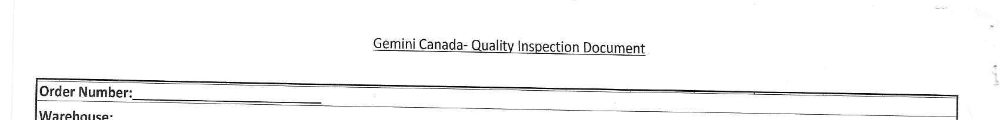

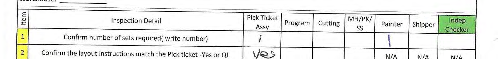

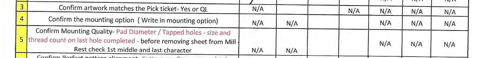

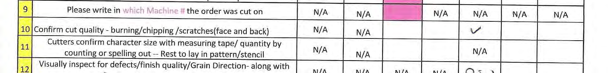

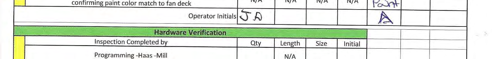

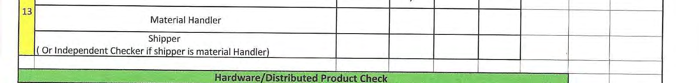

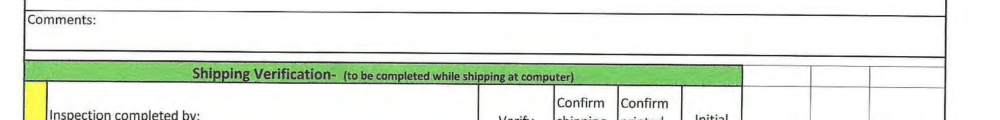

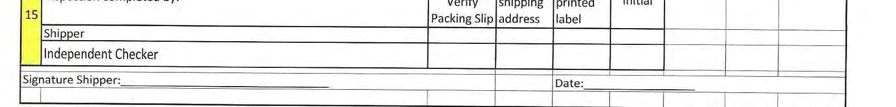

## Page 6

## Page 7

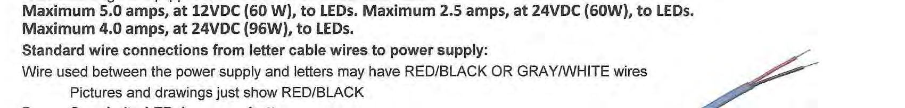

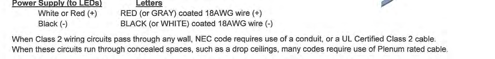

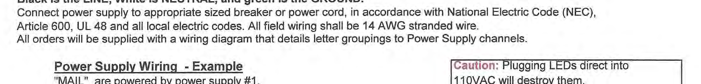

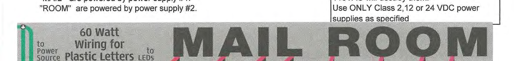

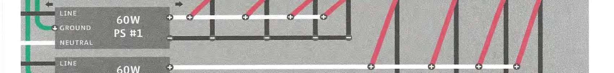

## Page 8

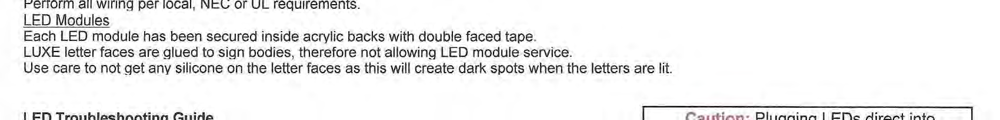

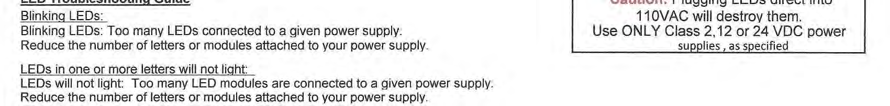

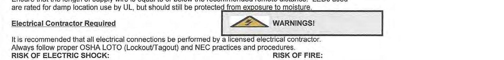

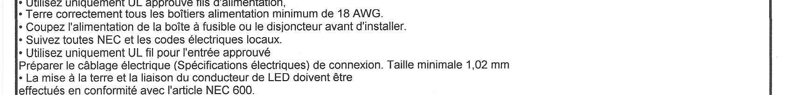

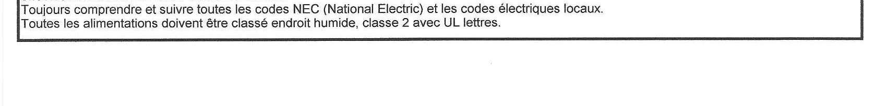

## Page 9

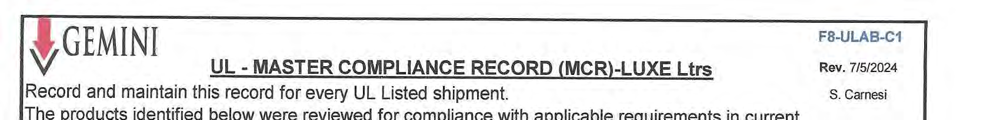

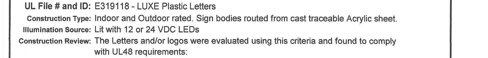

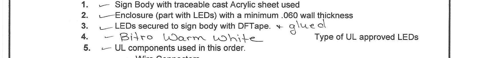

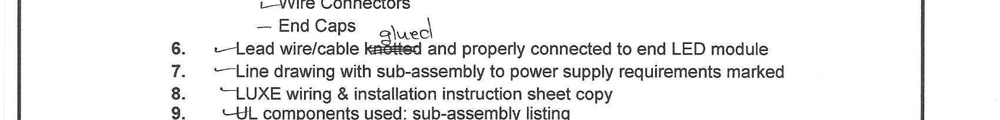

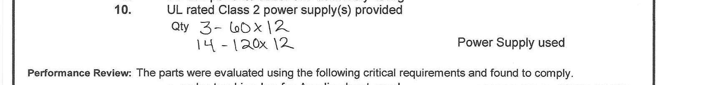

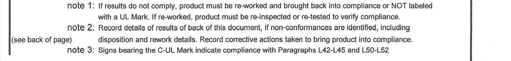

## Page 10

## Page 11

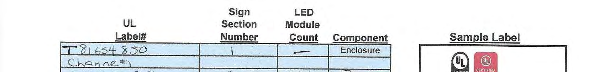

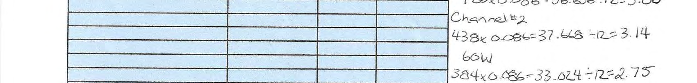

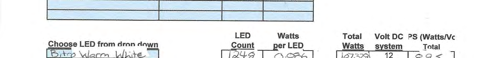

## Page 12

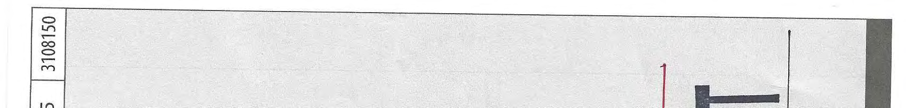

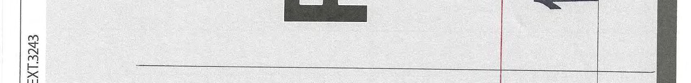

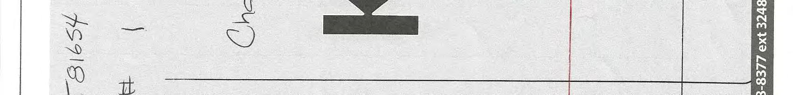

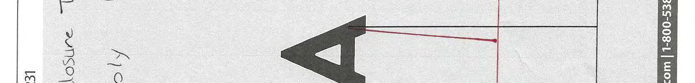

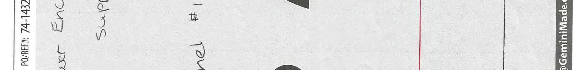

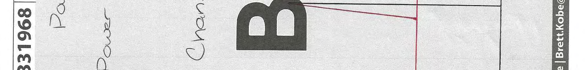

## Page 13

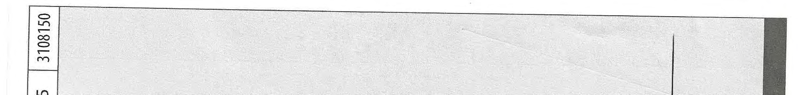

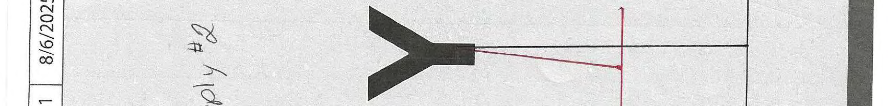

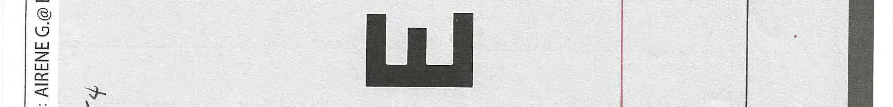

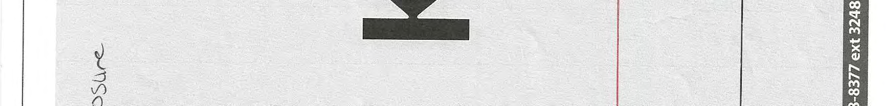

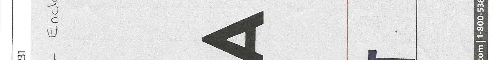

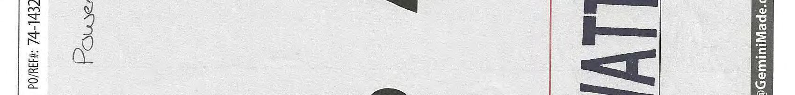

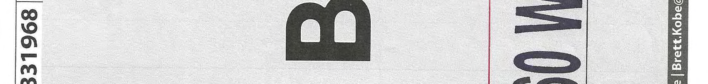

## Page 14

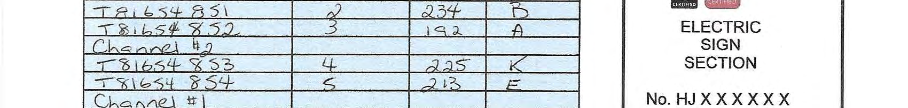

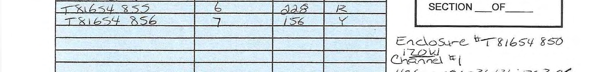

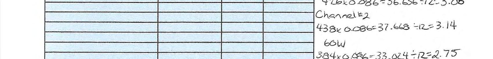

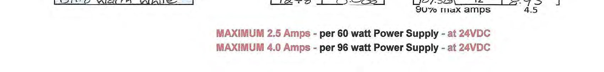

## Page 15

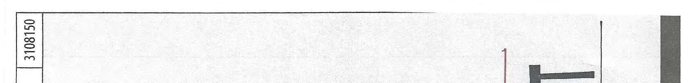

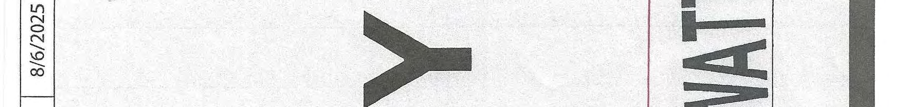

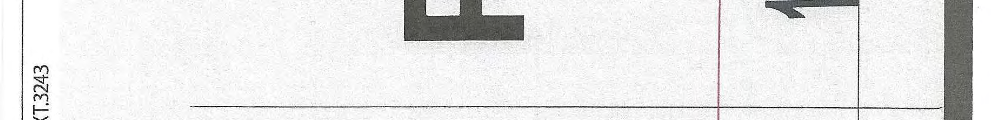

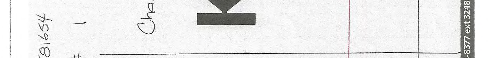

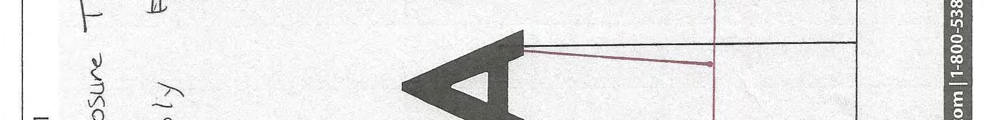

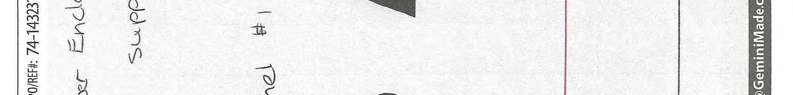

## Page 16

## Page 17

## Page 18

## Page 19

## Page 20

## Page 21

## Page 22

## Page 23

## Page 24

## Page 25

## Page 26

## Page 27

## Page 28

## Page 29

## Page 30

## Page 31

## Page 32

## Page 33

## Page 34

## Page 35

## Page 36

## Page 37

## Page 38

## Page 39

## Page 40

## Page 41

## Page 42

## Page 43

## Page 44

## Page 45

## Page 46

