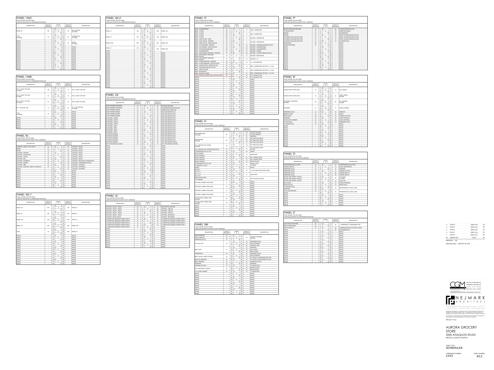
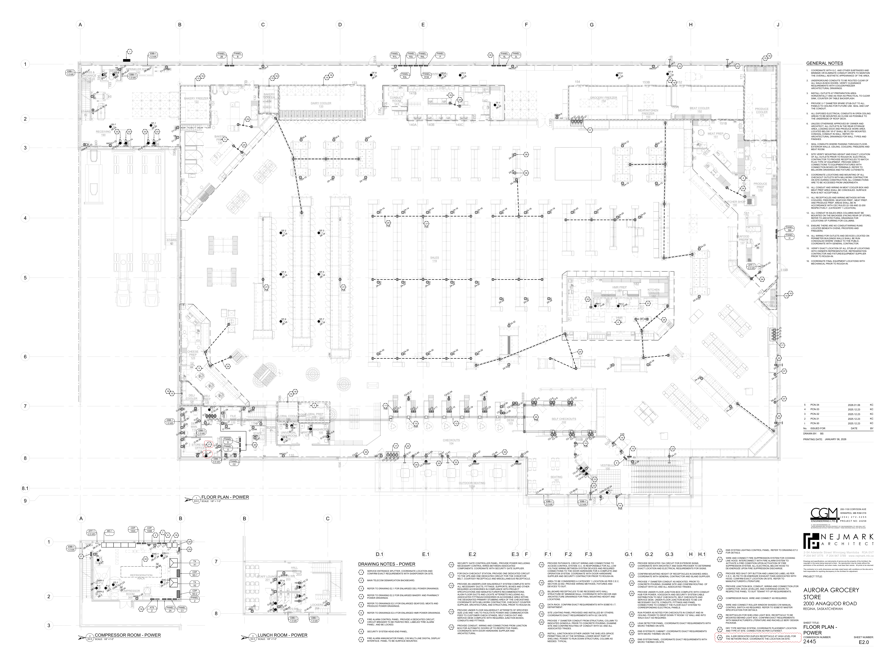
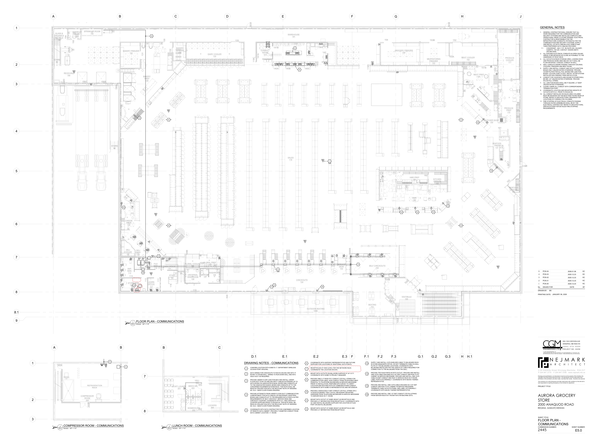

# PCN# 063 - Data Rack Receptacles  Room # 112

**Source**: `PCN# 063 - Data Rack Receptacles  Room # 112.pdf`  
**Pages**: 5  
**Extracted**: 2026-01-09 18:32:43

---

## Page 1

PROPOSED CHANGE NOTICE 

2445-63 

 
No work is to be done before this matter is finalized and a "Change Order" is issued.  This copy to remain with your office.  Do not return.  
Contractor to submit signed letter with price including cost breakdown and change (if any) to construction schedule.  Authority having 
Jurisdiction shall advise of any objections. 
 
 
TO: 
QUOREX CONSTRUCTION SERVICES LTD. 
 
 
 
1630A 8th Avenue,  
 
 
Regina, SK S4R 1E5 
 
 
RE: 
AURORA FOOD STORE 
 
 
2000 ANAQUOD ROAD 
 
 
REGINA, SK 
 
 
Commission No. 2445 
 
 
DATE: 
January 6, 2025 
 
 
PAGES: 
5 (including cover) 
 
 
RE: 
Data Rack Receptacles – Room # 112 
 
 
 
1.0 
ELECTRICAL 
 
 
.1 
Refer to attached Electrical PCN #34, dated January 6, 2025. 
 
 
(1 page text, 3 full size drawings E0.2, E2.0, E5.0) 
 
 
 
 
 
 
 
 
 
 
 
 
 
 
 
 
 
 
 
 
 
 
 
 
 
 
Distribution: 
Sobeys Inc. – Jeff Craig 
jeff.craig@sobeys.com 
Sobeys Inc. – Shanwen Hsu 
shanwen.hsu@sobeys.com 
Quorex Construction Services Ltd. – Chris Walbaum 
c.walbaum@quorex.ca 
Quorex Construction Services Ltd. – Dustin Williamson 
d.williamson@quorex.ca 
Lavergne Draward & Associates Inc. – Charles Koop 
ckoop@ldaeng.ca 
CGM Engineering – Justin Albo 
justin_albo@cgmeng.ca 
CGM Engineering – Tony Mitousis 
tony_mitousis@cgmeng.ca 
CGM Engineering – Brendan Simpson 
brendan_simpson@cgmeng.ca 
 
 
 
 
 
 
 
 
Principal 
Kevin Fawley, SAA MRAIC 

## Page 2

 
 
ELECTRICAL PROPOSED CHANGE NOTICE #34 
 
 
24-258 
 

Project: 
Aurora Grocery Store 
 
2000 Anaquod Road, Regina, Saskatchewan 
Subject: 
Data Rack Receptacles – Room # 112 
Date: 
2026.01.06 
 

Subject: 
Data Rack Receptacles – Room # 112 
References: 
Electrical Drawing E0.2 – Schedules 
 
Electrical Drawing E2.0 – Floor Plan - Power 
 
Electrical Drawing E5.0 – Floor Plan - Communications 
 

1. 
Refer to attached drawing E0.2 - Schedules for revisions in Panel ‘O’. T-Slot receptacle circuit # 
45, 1(one) 20A-1P breaker is added for data rack. 

2. 
Refer to attached drawing E2.0 – Floor Plan - Power, 1(one) 20A, 5-20R, T-Slot receptacle is added 
as circuit O-45 for the power supply of network rack at high level. 

3. 
Refer to attached drawing E5.0 - Floor Plan – Communications, removed 3(three) data outlets, 
replaced and relocated with 2(two) duplex data receptacles for data rack at high level. The 
description of note 7 is revised. 

 
 
Brendan Simpson, E.I.T. 
- 1 - 

200-1100 Corydon Avenue     Winnipeg, Manitoba     R3M 0Y8     204-272-3255     www.cgmeng.ca 

## Page 3

RTU-1, ROOF TOP UNIT
#1 WIRE
125

RTU-2, ROOF TOP UNIT
#4 WIRE
70

RTU-3, ROOF TOP UNIT
#10 WIRE
30

EF-1, EXHAUST FAN
15

PANEL '6L'
100

LIGHTING - SALES - POT LIGHTS
15
1
ɸ
2
15
LIGHTING - SALES

LIGHTING - SEATING
15
7
ɸ
8
15
LIGHTING - SALES

LIGHTING - CHECKOUTS
15
9
ɸ
10
15
LIGHTING - SALES

LIGHTING - OFFICE
15
11
ɸ
12
15
LIGHTING - SALES

LIGHTING - DELI
15
13
ɸ
14
15
LIGHTING - SALES

LIGHTING - PHARMACY
15
15
ɸ
16
15
LIGHTING - RECEIVING / WAREHOUSE

LIGHTING - BAKERY
15
17
ɸ
18
15
LIGHTING - COMPRESSOR ROOM

LIGHTING - HMR
15
19
ɸ
20
15
LIGHTING - COOLERS

LIGHTING - SEAFOOD / MEATS / PRODUCE
15
21
ɸ
22
15
LIGHTING - VESTIBULE

PANEL '2A'
200

PANEL '2L'
200

PANEL '2B'
200

PANEL 'C2
200

SPACE
-
13
ɸ
14

30
BALER
#10 WIRE
SPACE
-
15
ɸ
16

SPACE
-
17
ɸ
18

SPACE
-
19
ɸ
20
-
SPACE

SPACE
-
21
ɸ
22
-
SPACE

SPACE
-
23
ɸ
24
-
SPACE

SPACE
-
25
ɸ
26
-
SPACE

SPACE
-
27
ɸ
28
-
SPACE

SPACE
-
29
ɸ
30
-
SPACE

SPACE
-
31
ɸ
32
-
SPACE

SPACE
-
33
ɸ
34
-
SPACE

SPACE
-
35
ɸ
36
-
SPACE

SPACE
-
37
ɸ
38
-
SPACE

SPACE
-
39
ɸ
40
-
SPACE

SPACE
-
41
ɸ
42
-
SPACE

SPACE
-
31
ɸ
32
-
SPACE

SPACE
-
33
ɸ
34
-
SPACE

SPACE
-
35
ɸ
36
-
SPACE

SPACE
-
37
ɸ
38
-
SPACE

SPACE
-
39
ɸ
40
-
SPACE

SPACE
-
41
ɸ
42
-
SPACE

SPARE
15
3
ɸ
4
15
LIGHTING - SALES

SPARE
15
5
ɸ
6
15
LIGHTING - SALES

SPACE
-
23
ɸ
24
15
LIGHTING - EXTERIOR

SPACE
-
25
ɸ
26
-
SPACE

SPACE
-
27
ɸ
28
-
SPACE

SPACE
-
29
ɸ
30
-
SPACE

SPACE
-
31
ɸ
32
-
SPACE

SPACE
-
33
ɸ
34
-
SPACE

SPACE
-
35
ɸ
36
-
SPACE

SPACE
-
37
ɸ
38
-
SPACE

SPACE
-
39
ɸ
40
-
SPACE

SPACE
-
41
ɸ
42
-
SPACE

SPACE
-
31
ɸ
32
-
SPACE

SPACE
-
33
ɸ
34
-
SPACE

SPACE
-
35
ɸ
36
-
SPACE

SPACE
-
37
ɸ
38
-
SPACE

SPACE
-
39
ɸ
40
-
SPACE

SPACE
-
41
ɸ
42
-
SPACE

SPACE
-
43
ɸ
44
-
SPACE

SPACE
-
45
ɸ
46
-
SPACE

SPACE
-
47
ɸ
48
-
SPACE

SPACE
-
49
ɸ
50
-
SPACE

SPACE
-
51
ɸ
52
-
SPACE

SPACE
-
53
ɸ
54
-
SPACE

SPACE
-
55
ɸ
56
-
SPACE

SPACE
-
57
ɸ
58
-
SPACE

SPACE
-
59
ɸ
60
-
SPACE

TVSS
#10 WIRE
30

TVSS
#10 WIRE
30

TVSS
30

PANEL '100A'

PANEL '100B'

PANEL '6L'

PANEL 'SD-1'

100A-347/600V-3PH-4W PANEL
SURFACE MOUNTED IN WEST STAFF CORRIDOR

1200A-120/208V-3PH-4W PANEL
SURFACE MOUNTED IN COMPRESSOR ROOM 300

400A-347/600V-3PH-4W PANEL
SURFACE MOUNTED IN COMPRESSOR ROOM 300

400A-347/600V-3PH-4W PANEL
SURFACE MOUNTED IN COMPRESSOR ROOM 300

DESCRIPTION
CIRCUIT
BREAKER

DESCRIPTION
CIRCUIT
BREAKER

DESCRIPTION
CIRCUIT
BREAKER

DESCRIPTION
CIRCUIT
BREAKER

13
ɸ
14

15
RTU-6, ROOF TOP UNIT
15
ɸ
16

17
ɸ
18

19
ɸ
20

13
ɸ
14

400
PANEL 'H'
15
ɸ
16

17
ɸ
18

19
ɸ
20

23
ɸ
24

25
ɸ
26
-
SPACE

27
ɸ
28
-
SPACE

29
ɸ
30
-
SPACE

23
ɸ
24

25
ɸ
26

200
PANEL 'B'
27
ɸ
28

29
ɸ
30

11
ɸ
12

11
ɸ
12

11
ɸ
12

30
AC-1, AIR CURTAIN
#10 WIRE
21
ɸ
22

200
PANEL 'SM'
21
ɸ
22

25
GAS COOLER
#10 WIRE
3
ɸ
4

5
ɸ
6

7
ɸ
8

30
COMPACTOR
#10 WIRE
9
ɸ
10

15
RTU-4, ROOF TOP UNIT
3
ɸ
4

5
ɸ
6

7
ɸ
8

15
RTU-5, ROOF TOP UNIT
9
ɸ
10

100
PANEL 'D'
3
ɸ
4

5
ɸ
6

7
ɸ
8

100
PANEL 'P'
9
ɸ
10

1
ɸ
2

1
ɸ
2

1
ɸ
2

PHASE
A    B    C

PHASE
A    B    C

PHASE
A    B    C

PHASE
A    B    C

CIRCUIT
BREAKER
DESCRIPTION

CIRCUIT
BREAKER
DESCRIPTION

CIRCUIT
BREAKER
DESCRIPTION

CIRCUIT
BREAKER
DESCRIPTION

ILLUMINATION SIGNAGE POWER SUPPLY
15
13
ɸ
14
15
ILLUMINATION SIGNAGE POWER SUPPLY

ILLUMINATION SIGNAGE POWER SUPPLY
15
15
ɸ
16
15
ILLUMINATION SIGNAGE POWER SUPPLY

ILLUMINATION SIGNAGE POWER SUPPLY
15
17
ɸ
18
15
ILLUMINATION SIGNAGE POWER SUPPLY

ILLUMINATION SIGNAGE POWER SUPPLY
15
19
ɸ
20
15
ILLUMINATION SIGNAGE POWER SUPPLY

ILLUMINATION SIGNAGE POWER SUPPLY
15
21
ɸ
22
-
SPACE

DOOR OPENER (EXTERIOR)
15
1
ɸ
2
15
EXTERIOR SIGNAGE

DOOR OPENER (EXTERIOR)
15
3
ɸ
4
15
HOUSEKEEPING RECEPTACLES

DOOR OPENER (INSIDE)
15
5
ɸ
6
15
WAREHOUSE COMPUTER

DOOR OPENER (INSIDE)
15
7
ɸ
8
15
SHELVING RECEPTACLE

DOOR OPENER (INSIDE)
15
9
ɸ
10
15
SHELVING RECEPTACLE

DOOR OPENER (INSIDE)
15
11
ɸ
12
15
SHELVING RECEPTACLE

EXTERIOR SIGNAGE
15
29
ɸ
30
15
SHELVING RECEPTACLE

EXTERIOR SIGNAGE
15
31
ɸ
32
15
SHELVING RECEPTACLE

EXTERIOR SIGNAGE
15
33
ɸ
34
15
SHELVING RECEPTACLE

EXTERIOR SIGNAGE
15
35
ɸ
36
15
SHELVING RECEPTACLE

EXTERIOR SIGNAGE
15
37
ɸ
38
15
LIGHT BOX RECEPTACLES

DRY TYPE MISTING SYSTEM
15
39
ɸ
40
15
DRY TYPE MISTING SYSTEM

PANEL 'O'
100

PANEL 'C1'
100

PANEL 'R1M'
200

PANEL 'Z'
100

BILLBOARD - NORTH
15
13
ɸ
14
15
SHELVING RECEPTACLE

BILLBOARD - NORTH
15
15
ɸ
16
15
SHELVING RECEPTACLE

BILLBOARD - NORTH
15
17
ɸ
18
15
SHELVING RECEPTACLE

BILLBOARD - NORTH
15
19
ɸ
20
15
SHELVING RECEPTACLE

BILLBOARD - WEST
15
21
ɸ
22
15
SHELVING RECEPTACLE

BILLBOARD - WEST
15
23
ɸ
24
15
SHELVING RECEPTACLE

BILLBOARD - WEST
15
25
ɸ
26
15
SHELVING RECEPTACLE

BILLBOARD - WEST
15
27
ɸ
28
15
SHELVING RECEPTACLE

LIGHTING - SALES - TRACK
20
1
ɸ
2
15
DECORATIVE LIGHTING

LIGHTING - SALES - TRACK
15
3
ɸ
4
20
LIGHTING - TRELLIS

LIGHTING - SALES - TRACK
15
5
ɸ
6
20
LIGHTING - TRELLIS

LIGHTING - SALES - TRACK
15
7
ɸ
8
20
LIGHTING - TRELLIS

LIGHTING - SALES - TRACK
15
9
ɸ
10
15
LIGHTING - BULKHEAD

LIGHTING - DOCK LIGHTS
15
11
ɸ
12
15
LIGHTING - BULKHEAD

SPACE
-
41
ɸ
42
-
SPACE

SPACE
-
43
ɸ
44
-
SPACE

SPACE
-
45
ɸ
46
-
SPACE

SPACE
-
47
ɸ
48
-
SPACE

SPACE
-
49
ɸ
50
-
SPACE

SPACE
-
51
ɸ
52
-
SPACE

SPACE
-
53
ɸ
54
-
SPACE

SPACE
-
55
ɸ
56
-
SPACE

SPACE
-
57
ɸ
58
-
SPACE

SPACE
-
59
ɸ
60
-
SPACE

SPACE
-
61
ɸ
62
-
SPACE

SPACE
-
63
ɸ
64
-
SPACE

SPACE
-
65
ɸ
66
-
SPACE

SPACE
-
67
ɸ
68
-
SPACE

SPACE
-
69
ɸ
70
-
SPACE

SPACE
-
71
ɸ
72
-
SPACE

SPACE
-
73
ɸ
74
-
SPACE

SPACE
-
75
ɸ
76
-
SPACE

SPACE
-
77
ɸ
78
-
SPACE

SPACE
-
79
ɸ
80
-
SPACE

SPACE
-
81
ɸ
82
-
SPACE

SPACE
-
83
ɸ
84
-
SPACE

SPACE
-
23
ɸ
24

SPACE
-
25
ɸ
26
-
SPACE

SPACE
-
27
ɸ
28
-
SPACE

SPACE
-
29
ɸ
30
-
SPACE

SPACE
-
31
ɸ
32
-
SPACE

SPACE
-
33
ɸ
34
-
SPACE

SPACE
-
35
ɸ
36
-
SPACE

SPACE
-
37
ɸ
38
-
SPACE

SPACE
-
39
ɸ
40
-
SPACE

SPACE
-
41
ɸ
42
-
SPACE

SPACE
-
43
ɸ
44
-
SPACE

SPACE
-
45
ɸ
46
-
SPACE

SPACE
-
47
ɸ
48
-
SPACE

SPACE
-
49
ɸ
50
-
SPACE

SPACE
-
51
ɸ
52
-
SPACE

SPACE
-
53
ɸ
54
-
SPACE

SPACE
-
55
ɸ
56
-
SPACE

SPACE
-
57
ɸ
58
-
SPACE

SPACE
-
59
ɸ
60
-
SPACE

SPACE
-
23
ɸ
24
-
SPACE

SPACE
-
25
ɸ
26
-
SPACE

SPACE
-
27
ɸ
28
-
SPACE

SPACE
-
29
ɸ
30
-
SPACE

SPACE
-
31
ɸ
32
-
SPACE

SPACE
-
33
ɸ
34
-
SPACE

SPACE
-
35
ɸ
36
-
SPACE

SPACE
-
37
ɸ
38
-
SPACE

SPACE
-
39
ɸ
40
-
SPACE

SPACE
-
41
ɸ
42
-
SPACE

PANEL '2A'

PANEL 'SD-2'

PANEL '2L'

1200A-120/208V-3PH-4W PANEL
SURFACE MOUNTED IN COMPRESSOR ROOM 300

200A-120/208V-3PH-4W PANEL
SURFACE MOUNTED IN COMPRESSOR ROOM 300

200A-120/208V-3PH-4W PANEL
SURFACE MOUNTED IN WEST STAFF CORRIDOR

DESCRIPTION
CIRCUIT
BREAKER

DESCRIPTION
CIRCUIT
BREAKER

DESCRIPTION
CIRCUIT
BREAKER

13
ɸ
14

400
PANEL 'R3L'
15
ɸ
16

17
ɸ
18

19
ɸ
20

11
ɸ
12

400
PANEL 'R4L'
21
ɸ
22

200
PANEL 'R1L'
3
ɸ
4

5
ɸ
6

7
ɸ
8

400
PANEL 'R2L'
9
ɸ
10

1
ɸ
2

PHASE
A    B    C

PHASE
A    B    C

PHASE
A    B    C

CIRCUIT
BREAKER
DESCRIPTION

CIRCUIT
BREAKER
DESCRIPTION

CIRCUIT
BREAKER
DESCRIPTION

FULL SERVICE HOT FOODS
#4 WIRE
70

15
ɸ
16
40
HOT CHICKEN ISLAND
#8 WIRE
FULL SERVICE HOT FOODS RECEPTACLE
15
17
ɸ
18

FIRMWARE SCALE
15
5
ɸ
6

FOAMING STATION
15
31
ɸ
32
15
TV RECEPTACLE

MAIN - HOUSEKEEPING
15
1
ɸ
2
15
MAIN - HANDDRYER
MAIN - IT RACK
20
3
ɸ
4

MAIN - IT RACK
20
5
ɸ
6
15
MAIN - HANDDRYER
MAIN - IT RACK
20
7
ɸ
8

MAIN - IT RACK
20
9
ɸ
10
15
SECOND - HANDDRYER
MAIN - CASH OFFICE - SAFE
15
11
ɸ
12

MAIN - CASH OFFICE - PRINTER
15
13
ɸ
14
15
SECOND - HANDDRYER
MAIN - CASH OFFICE - RECEPTACLES
15
15
ɸ
16

MAIN - FILE MANAGER - PRINTER
15
17
ɸ
18
15
SECOND - WASHROOM RECEPTACLES

MAIN - FILE MANAGE - RECEPTACLES
15
19
ɸ
20
15
SECOND - HOUSEKEEPING

MAIN - TELECOM BACKBOARD
20
21
ɸ
22
15
SECOND - HOUSEKEEPING

MAIN - HOUSEKEEPING
15
23
ɸ
24
15
SECOND - FRIDGE

MAIN - DEPARTMENT MANAGER - PRINTER
15
25
ɸ
26
20
SECOND - COUNTER RECEPTACLES

MAIN - DEPARTMENT MANAGER -
RECEPTACLES
15
27
ɸ
28
15
SECOND - MICROWAVE

MAIN - DEPARTMENT MANAGER -
RECEPTACLES
15
29
ɸ
30
15
SECOND - TV

MAIN - STORE MANAGER - PRINTER
15
31
ɸ
32
20
EV-1, EVAPORATOR
MAIN - STORE MANAGER - RECEPTACLES
15
33
ɸ
34

MAIN - LEARN OFFICE - RECEPTACLES
15
35
ɸ
36
15
EBB-1, BASEBOARD HEATER (2 x 1.0 kW)
MAIN - WASHROOM RECEPTACLES
15
37
ɸ
38

MAIN - JANITOR ROOM
20
39
ɸ
40
15
EBB-1, BASEBOARD HEATER (2 x 1.0 kW)
MAIN - MICROWAVE
15
41
ɸ
42

MAIN - SECURITY PANEL
20
43
ɸ
44
15
EBB-1, BASEBOARD HEATER (1 x 0.5 kW)

RETHERMALIZER
#10 WIRE
30

DISHWASHER
#6 WIRE
60

RICE COOKER
20
21
ɸ
22
15
SNACK BAR
SCALE PRINTER
15
23
ɸ
24

DEEP FRYER (GAS)
15
45
ɸ
46
15
SOUP ISLAND COOLER
27" FREEZER
15
47
ɸ
48

RATIONAL COMBO OVEN (GAS)
15

RATIONAL COMBO OVEN (GAS)
15

RATIONAL COMBO OVEN (GAS)
15

RATIONAL COMBO OVEN (GAS)
15

DOUBLE DECK TURBO CHEF
#8 WIRE
50

DOUBLE DECK TURBO CHEF
#8 WIRE
50

MEAT SAW
15

MEAT WEIGH / WRAP SYSTEM
20

BACK-UP WRAPPER
15
25
ɸ
26
15
6' 2 DOOR U/C REFRIGERATOR UNIT

MEAT GRINDER
15
27
ɸ
28
15
FOAMING STATION

DRY AGED MEAT COOLER
20

SPACE
-
47
ɸ
48
15
EF-4, EXHAUST FAN

SPACE
-
49
ɸ
50
-
SPACE

SPACE
-
51
ɸ
52
-
SPACE

SPACE
-
53
ɸ
54
-
SPACE

SPACE
-
55
ɸ
56
-
SPACE

SPACE
-
57
ɸ
58
-
SPACE

SPACE
-
59
ɸ
60
-
SPACE

SPACE
-
61
ɸ
62
-
SPACE

SPACE
-
63
ɸ
64
-
SPACE

SPACE
-
65
ɸ
66
-
SPACE

SPACE
-
67
ɸ
68
-
SPACE

SPACE
-
69
ɸ
70
-
SPACE

SPACE
-
71
ɸ
72
-
SPACE

SPACE
-
73
ɸ
74
-
SPACE

SPACE
-
75
ɸ
76
-
SPACE

SPACE
-
77
ɸ
78
-
SPACE

SPACE
-
79
ɸ
80
-
SPACE

SPACE
-
81
ɸ
82
-
SPACE

SPACE
-
83
ɸ
84
-
SPACE

SCALE PRINTER
15
25
ɸ
26
15
RH-1, RANGE HOOD

SCALE PRINTER
15
27
ɸ
28
15
RH-2, RANGE HOOD

SCALE PRINTER
15
29
ɸ
30
15
RECEPTACLES

8' REFRIGERATOR U/C UNIT
15
31
ɸ
32
30
AMANA OVEN
#10 WIRE
8' FREEZER U/C UNIT
20
33
ɸ
34

SPARE
15
35
ɸ
36
-
SPACE

SLICER
15
37
ɸ
38
15
4' COLD SIDE AND SALADS CASE
55" LG TV
15
39
ɸ
40

55" LG TV
15
41
ɸ
42
15
SNACK BAR
55" LG TV
15
43
ɸ
44

SPACE
-
73
ɸ
74
-
SPACE

SPACE
-
75
ɸ
76
-
SPACE

SPACE
-
77
ɸ
78
-
SPACE

SPACE
-
79
ɸ
80
-
SPACE

SPACE
-
81
ɸ
82
-
SPACE

SPACE
-
83
ɸ
84
-
SPACE

SCALE PRINTER
15
1
ɸ
2

35
LOBSTER STEAMER
#8 WIRE
SCALE PRINTER
15
3
ɸ
4

SPACE
-
39
ɸ
40
-
SPACE

SPACE
-
41
ɸ
42
-
SPACE

SPACE
-
43
ɸ
44
-
SPACE

SPACE
-
45
ɸ
46
-
SPACE

SPACE
-
47
ɸ
48
-
SPACE

SPACE
-
49
ɸ
50
-
SPACE

SPACE
-
51
ɸ
52
-
SPACE

SPACE
-
53
ɸ
54
-
SPACE

SPACE
-
55
ɸ
56
-
SPACE

SPACE
-
57
ɸ
58
-
SPACE

SPACE
-
59
ɸ
60
-
SPACE

6' REFRIGERATOR U/C UNIT
15
19
ɸ
20
20
SPARE

6' U/C PREP CABINET
15
37
ɸ
38
15
TV RECEPTACE

T-SLOT DUPLEX RECEPTACLE FOR DATA RACK
20
45
ɸ
46
15
EF-5, EXHAUST FAN

TENDERIZER
15
19
ɸ
20
15
FIRMWARE SCALE

WRAPPER
15
29
ɸ
30
15
WRAPPER

VAC PAC PL20
15

PANEL 'O'

PANEL 'H'

PANEL 'SM'

100A-120/208V-3PH-4W PANEL
RECESS MOUNTED IN OFFICE CORRIDOR

400A-120/208V-3PH-4W PANEL
SURFACE MOUNTED IN NORTH STAFF CORRIDOR

200A-120/208V-3PH-4W PANEL
SURFACE MOUNTED IN NORTH STAFF CORRIDOR

DESCRIPTION
CIRCUIT
BREAKER

DESCRIPTION
CIRCUIT
BREAKER

DESCRIPTION
CIRCUIT
BREAKER

13
ɸ
14
15
HOT AND COLD SOUP

13
ɸ
14
15
WRAPPER

15
ɸ
16
20
ICE FLAKER

17
ɸ
18
15
MEAT SLICER

53
ɸ
54
-
SPACE

55
ɸ
56
-
SPACE

57
ɸ
58
-
SPACE

59
ɸ
60
-
SPACE

63
ɸ
64
-
SPACE

65
ɸ
66
-
SPACE

67
ɸ
68
-
SPACE

69
ɸ
70
-
SPACE

23
ɸ
24
15
8' 3 DOOR U/C REFRIGERATOR UNIT

33
ɸ
34
15
RECEPTACLES

35
ɸ
36
15
RECEPTACLES

49
ɸ
50
-
SPACE

11
ɸ
12
15
HOT AND COLD SOUP

11
ɸ
12
20
LOBSTER TANK

71
ɸ
72
-
SPACE

51
ɸ
52
-
SPACE

61
ɸ
62
-
SPACE

21
ɸ
22
15
SCALE PRINTER

3
ɸ
4
15
2 DOOR FREEZER

5
ɸ
6
15
WRAPPER

7
ɸ
8
15
HOT AND COLD SOUP

9
ɸ
10
15
HOT AND COLD SOUP

7
ɸ
8
15
FIRMWARE SCALE

9
ɸ
10
15
SCALE PRINTER

1
ɸ
2
20
5' BLAST CHILLER

PHASE
A    B    C

PHASE
A    B    C

PHASE
A    B    C

CIRCUIT
BREAKER
DESCRIPTION

CIRCUIT
BREAKER
DESCRIPTION

CIRCUIT
BREAKER
DESCRIPTION

FIRMWARE SCALE
15
5
ɸ
6
15
WRAPPER

FIRMWARE SCALE
15
7
ɸ
8
15
FOAMING STATION

FIRMWARE SCALE
15
9
ɸ
10
20
CHEESE DISPLAY

FIRMWARE SCALE
15
11
ɸ
12
20
CHEESE DISPLAY

BUG LIGHTS
15
19
ɸ
20
15
FLORAL WRAPPER

RECEPTACLES
15
21
ɸ
22
15
RECEPTACLE

BLOOD PRESSURE MACHINE
15
1
ɸ
2
20
COUNTER RECEPTACLES

FRIDGE
15
5
ɸ
6
15
HOUSKEEPING

FRIDGE
15
7
ɸ
8
15
FRONT COUNTER RECEPTACLES

MICROWAVE
20
15
ɸ
16
-
SPACE

DOUBLE RACK OVEN (GAS)
15

DOUBLE RACK OVEN (GAS)
15

RETARDER / PROOFER
#8 WIRE
50

ROUNDER
15

FIRMWARE SCALE
15
25
ɸ
26
15
SHEETER

BREAD SLICER
15
27
ɸ
28
15
SPACE

MICROWAVE
20
29
ɸ
30
15
FOAMING STATION

FLOOR SCALE
15
35
ɸ
36
15
FIRMWARE SCALE

LEAK DETECTION PANEL
20
1
ɸ
2
20
I-1, EMERGENCY CONDENSING UNIT
EMS SYSTEM PANEL
20
3
ɸ
4

EMS SYSTEM PC
20
5
ɸ
6
20
COMPRESSOR RACK CONTROL PANEL

CHEESE GRATER
15
3
ɸ
4
15
SCALE AND PRINTER

SLICER "DELI BUDDY" (SCALE)
15
13
ɸ
14
25
OLIVE BAR
#10 WIRE
SLICER "DELI BUDDY" (SCALE)
15
15
ɸ
16

SLICER "DELI BUDDY" (SCALE)
15
17
ɸ
18
15
CASH UNIT

SCALE AND PRINTER
15
27
ɸ
28
20
REFRIGERATED FLORAL CASE
SPACE
-
29
ɸ
30

SPACE
-
31
ɸ
32
-
SPACE

SPACE
-
33
ɸ
34
-
SPACE

SPACE
-
35
ɸ
36
-
SPACE

SPACE
-
37
ɸ
38
-
SPACE

SPACE
-
39
ɸ
40
-
SPACE

SPACE
-
41
ɸ
42
-
SPACE

COMPUTER DESKS
15
17
ɸ
18
-
SPACE

SPACE
-
19
ɸ
20
-
SPACE

SPACE
-
21
ɸ
22
-
SPACE

SPACE
-
23
ɸ
24
-
SPACE

SPACE
-
25
ɸ
26
-
SPACE

SPACE
-
27
ɸ
28
-
SPACE

SPACE
-
29
ɸ
30
-
SPACE

SPACE
-
31
ɸ
32
-
SPACE

SPACE
-
33
ɸ
34
-
SPACE

SPACE
-
35
ɸ
36
-
SPACE

SPACE
-
37
ɸ
38
-
SPACE

SPACE
-
39
ɸ
40
-
SPACE

SPACE
-
41
ɸ
42
-
SPACE

CREAMER
15
31
ɸ
32
15
OVEN CONTROLS

CHOCOLATE WARMER
15
33
ɸ
34
15
OVEN CONTROLS

SPACE
-
39
ɸ
40
-
SPACE

SPACE
-
41
ɸ
42
-
SPACE

SPACE
-
43
ɸ
44
-
SPACE

SPACE
-
45
ɸ
46
-
SPACE

SPACE
-
47
ɸ
48
-
SPACE

SPACE
-
49
ɸ
50
-
SPACE

SPACE
-
51
ɸ
52
-
SPACE

SPACE
-
53
ɸ
54
-
SPACE

SPACE
-
55
ɸ
56
-
SPACE

SPACE
-
57
ɸ
58
-
SPACE

SPACE
-
59
ɸ
50
-
SPACE

SPACE
-
7
ɸ
8
20
FOM GENERATOR

SPACE
-
9
ɸ
10
-
SPACE

SPACE
-
11
ɸ
12
-
SPACE

SPACE
-
13
ɸ
14
-
SPACE

SPACE
-
15
ɸ
16
-
SPACE

SPACE
-
17
ɸ
18
-
SPACE

SPACE
-
19
ɸ
20
-
SPACE

SPACE
-
21
ɸ
22
-
SPACE

SPACE
-
23
ɸ
24
-
SPACE

SPACE
-
25
ɸ
26
-
SPACE

SPACE
-
27
ɸ
28
-
SPACE

SPACE
-
29
ɸ
30
-
SPACE

SPACE
-
31
ɸ
32
-
SPACE

SPACE
-
33
ɸ
34
-
SPACE

SPACE
-
35
ɸ
36
-
SPACE

SPACE
-
37
ɸ
38
-
SPACE

SPACE
-
39
ɸ
40
-
SPACE

8' REFRIGERATOR U/C UNIT
15
1
ɸ
2
15
6' REFRIGERATOR U/C UNIT

TV RECEPTACLES
15
23
ɸ
24
20
REFRIGERATED FLORAL CASE
WRAPPER
15
25
ɸ
26

TV RECEPTACLE
15
3
ɸ
4
15
COMPUTER DESKS

TV RECEPTACLE
15
37
ɸ
38
-
SPACE

AUTOMATIC ROLLING SHUTTER
15
9
ɸ
10
15
FRONT COUNTER RECEPTACLES

AUTOMATIC ROLLING SHUTTER
15
11
ɸ
12
15
FRONT COUNTER RECEPTACLES

AUTOMATIC ROLLING SHUTTER
15
13
ɸ
14
15
SC RECEPTACLE

PANEL 'D'

PANEL 'P'

PANEL 'B'

PANEL 'Z'

100A-120/208V-3PH-4W PANEL
RECESS MOUNTED IN OFFICE CORRIDOR

100A-120/208V-3PH-4W PANEL
SURFACE MOUNTED IN WEST STAFF CORRIDOR

100A-120/240V-1PH-3W PANEL
SURFACE MOUNTED IN COMPRESSOR ROOM 300

200A-120/208V-3PH-4W PANEL
SURFACE MOUNTED IN WEST STAFF CORRIDOR

DESCRIPTION
CIRCUIT
BREAKER

DESCRIPTION
CIRCUIT
BREAKER

DESCRIPTION
CIRCUIT
BREAKER

DESCRIPTION
CIRCUIT
BREAKER

13
ɸ
14

60
POT WASHER
#6 WIRE
15
ɸ
16

17
ɸ
18

19
ɸ
20

23
ɸ
24

11
ɸ
12

15
DOUGH DIVIDER
21
ɸ
22

7
ɸ
8

15
80 QT MIXER
3
ɸ
4

5
ɸ
6

45
SPIRAL MIXER
#8 WIRE
9
ɸ
10

1
ɸ
2

PHASE
A            B

PHASE
A    B    C

PHASE
A    B    C

PHASE
A    B    C

CIRCUIT
BREAKER
DESCRIPTION

CIRCUIT
BREAKER
DESCRIPTION

CIRCUIT
BREAKER
DESCRIPTION

CIRCUIT
BREAKER
DESCRIPTION

2-54 Adelaide Street Winnipeg Manit
a
ob
R3A 0V7
 P 204 947 3775
 F 204 947 3789
www.nejmark.mb.ca

AURORA GROCERY
STORE
2000 ANAQUOD ROAD
REGINA, SASKATCHEWAN

PROJECT TITLE:

DRAWN BY:

PRINTING DATE:

No.     ISSUED FOR                                      DATE                   BY

COMMISSION NUMBER:
SHEET NUMBER:

Drawings and specifications, as instruments of service are the property of the Architect, the
copyright in the same being reserved to them.  No reproduction may be made without the
permission of the architects, and when made, must bear their names.  All prints to be returned.

SHEET TITLE:

The contractor is to verify dimensions and date noted herein with conditions on the site and is
held responsible for reporting discrepancy to the Architect for adjustment.

SCHEDULES

1
KC
PCN-30
2025.12.23

3
KC
PCN-32
2025.12.23

5
KC
PCN-34
2026.01.06

2
KC
PCN-31
2025.12.23

4
KC
PCN-33
2025.12.23

© 2026 CGM ENGINEERING LTD.
THESE DRAWINGS ARE THE SOLE PROPERTY OF CGM ENGINEERING LTD. AND SHALL NOT
BE REPRODUCED WITHOUT WRITTEN CONSENT. THESE DRAWINGS SHALL NOT BE SCALED.

ENGINEERING LTD.

BS

N E J M A R K
A
R
C
H
I
T
E
C
T

JANUARY 06, 2026

PRO JEC T NO : 24258

( 2 0 4 )  2 7 2 - 3 2 5 5

200-1100 CORYDON AVE

WINNIPEG, MB R3M 0Y8

E0.2

## Page 4

8.1

8

7

6

5

4

3

2

1

9

1

3

2

EBB-1
1.0 kW

EBB-1
1.0 kW

A

B
A

27

100A-8,10,12

STAIRS
#2

N
 COMPRESSOR ROOM - POWER

GLASS &
ORGANICS
RECYCLE
194

2B-45,47

2B-45,47

300A

DN
21R

29
SCALE:
E2.0

EFF-1
2.0 kW

Z-1

2
SCALE:
E2.0

2B-1

2B-5

2B-37,39

C1-18

SC

100A-14,16,18

190D

EMERGENCY
CONDENSING
UNIT

C1-28

RECEIVING
190

HK

DWH-1

DWH-2

P-1

194

2B-3

Z-2,4

I-1

C1-22
C1-24

1/8" =1'-0"

GF

P-2

HK

2B-7

MD-1
-

193

CLEAN-UP
AREA
193

2B-24

C1-22

UH-1

C1-2,4,6

100B-19,21,23

EF-1

2B-4

EF-3
DF-8
DF-9

HK

33
33
33
33

2B-34

M

COMPRESSOR
ROOM
300

2B-45,47

190C
190B

OHD
OHD

SPRINKLER ROOM
192

C1-14

EBB-1
1.0 kW

1
PANEL
B

REFRIGERATION
RACK

CDP
100A

300B

HK

C1-28

C1-8,10,12

19

2B-45,47

34

CDP
100B

C1-3

EBB-1
1.0 kW

ATS
Z

2B-27,29

DF-1

2B-20

EHC-1

2

C1-16

2B-34

M

C1-1
C1-5

C1-20

2B-31,33

EHC-2

7
8

ERV-1

2B-25

EBB-1
1.0 kW

PANEL
2A

16

STAIRS
#3

SC

C-7

15

C1-22

C1-22

Z-5

190A

HK

18

O-25

O-29

Z-3

J
H
G
F
E
D
C
B

PANEL
C1

O-36,38

O-31

O-33

O-27
O-27

O-29

BAKERY FREEZER
131

DELI
COOLER
121

CHEESE
PREP
123

N
 FLOOR PLAN - POWER

29

28

IT
ROOM
114
DEP.
MAN.
113

PANEL
Z

STORE MAN.
OFFICE
112

CDP
SD-2

CDP
SD-1

TX
X1

TX
X2

O-23

O-36,38

113

SCALE:
E2.0

HK

1

15

O-33

EBB-1
1.0 kW

5

16
15

O-3

DELI
PREP
120

O-21

O-45

O-9
O-7
O-5

21

EV-1

1/8" = 1'-0"

O-32,34

131

EBB-1
0.5 kW

O-23

BAKERY
PREP
130

8

7

HK

114

O-44

112

PANEL
2B

LEARN
OFFICE
111

O-1

O-19

O-35
O-35
O-2,4

3

PANEL
D

PANEL
O

O-17

24

HK
HK

FILE
MAN
115

PANEL
C2

111

115

O-13

C
B

116

24

N
 LUNCH ROOM - POWER

FLORAL COOLER
109
CASH OFFICE
116

130

24

O-15

HK

O-1

O-22
O-24

3

M
a

STAFF
117

132

26

118

O-11

O-41

STAFF LOUNGE
201

HK
HK
HK
HK

BAKERY
COOLER
132

2A-4

TYP.

21

STAIRS
#1

1/8" =1'-0"

O-26

O-28

O-30

UP
21R

GF

SC

15

a

a

M

16

O-20

109B

HK

EF-4

HK

WOMEN'S WR
202

UNIVERSAL
WASHROOM
106

O-48

MEN'S WR
203

DF-2

DF-4

DF-6

2B-16

2B-16

2B-16

O-20

EF-5

O-46

O-40,42

O-1

HK

HD
HD

110

O-37

15

EBB-1
1.0 kW

HALL
205

GF

a

16

HD

HD

GF

GF

106

203

202

a

a

109A

O-14,16

O-18

O-18

O-10,12

2A-8
2A-10

WASHROOM
105
JANITOR
107

2A-8

O-40,42

FLORAL PREP
108

O-39

107

GF

LOCKERS
204

DN

DAIRY COOLER
133

EBB-1
1.0 kW

5

105

DF-3

DF-5

DF-7

2B-18

2B-18

2B-18

O-37

O-22

HK

2A-10

GF

O-6,8

a

16

2A-8

104

TYP.

21

133

C2-43

DRAWING NOTES - POWER

2A-10

1

2

3

4

5

6

7

8

9

35

FIRE ALARM ANNUNCIATOR PANEL C/W MULTI-LINE DIGITAL DISPLAY
INTERFACE. PANEL TO BE SURFACE MOUNTED.

MAIN TELECOM DEMARCATION BACKBOARD.

REFER TO DRAWING E2.1 FOR ENLARGED DELI POWER DRAWINGS.

REFER TO DRAWING E2.2 FOR ENLARGED BAKERY AND PHARMACY
POWER DRAWINGS.

REFER TO DRAWINGS E2.3 FOR ENLARGED SEAFOOD, MEATS AND
PRODUCE POWER DRAWINGS.

REFER TO DRAWINGS E2.4 FOR ENLARGED HMR POWER DRAWINGS.

FIRE ALARM CONTROL PANEL. PROVIDE A DEDICATED CIRCUIT,
CIRCUIT BREAKER TO BE PAINTED RED, LABELED 'FIRE ALARM
PANEL', AND BE LOCKED.

SERVICE ENTRANCE SPLITTER. COORDINATE LOCATION AND
CONFIRM EXACT REQUIREMENTS WITH SASKPOWER ON SITE.

SECURITY SYSTEM HEAD-END PANEL.

2B-20

191A

C2-33

2A-24

G.2
F.1
H
G.1
F.3
F
E.2
E.1
D.1

119C

2A-30

2A-14

C2-36
C2-38
C2-40
C2-42

TYP.

11

141A

TYP.

20

CONSULT
ROOM
141

PANEL
R1L

C2-3
C2-1

2A-4

17

2A-24

PANEL
R3L

2A-30

2A-14

C2-25,27

C2-31

22

PANEL
R2L

141B

140A
140B
140C

C2-7
C2-5

C2-45

TYP.

12
13

35
35

PANEL
R4L

C2-35

PANEL
R1M

TYP.

2A-24

21

C2-53

WP
WP
WP

2A-30

2A-14

C2-11
C2-9

WAREHOUSE
191

SALES
119

PANEL
P

C2-47

2B-26

UH-2
UH-3
UH-4

CHECKOUTS
104

C2-52,54

C2-51

C2-15
C2-13

18

2A-26

10

11

12

13

14

2A-16

2A-32

22

FOR EACH CHECKOUT STATION, PROVIDE ONE DEDICATED CIRCUIT
TO THE UPS AND ONE DEDICATED CIRCUIT FOR THE CONVEYOR
BELT, COURTESY RECEPTACLE AND MISCELLANEOUS RECEPTACLE.

PROVIDE UNDER FLOOR WALKERDUCT AFTERSETS OF SPECIFIED
SIZE (2-#2 AND 1-#4) TO FACILITATE POWER AND COMMUNICATION
FEED TO CUSTOMER CHECK STANDS, SELF CHECK-OUT AND
SERVICE DESK COMPLETE WITH REQUIRED JUNCTION BOXES,
CONDUITS AND FITTINGS.

SECURITY GATE CONTROLLER PANEL. PROVIDE POWER INCLUDING
NECESSARY CONTROL WIRES BETWEEN ASSOCIATED
COMPONENTS. COORDINATE WITH SECURITY GATE SUPPLIER.

PROVIDE AN UNDERFLOOR WALKERDUCT SYSTEM COMPLETE WITH
ALL NECESSARY DUCTS, FITTINGS, SUPPORTS, BOXES AND OTHER
REQUIRED ACCESSORIES IN COMPLIANCE WITH PROJECT
SPECIFICATIONS AND MANUFACTURER'S RECOMMENDATIONS.
ALIGN FLOOR DUCTS AND LOCATE AFTERSETS INCLUDING ALL
ASSOCIATED FITTING/ACCESSORIES IN ACCESSIBLE AREA WITHIN
THE DESIGNATED PRIMARY STUBBING AREA OF THE CHECKSTAND.
COORDINATE WITH MILLWORK CONTRACTOR, CHECKOUT COUNTER
SUPPLIER, ARCHITECTURAL AND STRUCTURAL PRIOR TO ROUGH-IN.

PROVIDE CONDUIT, WIRING AND CONNECTIONS FROM JUNCTION
BOX FOR AUTOMATIC DOORS UP TO RESPECTIVE PANEL.
COORIDNATE WITH DOOR HARDWARE SUPPLIER AND
ARCHITECTURAL.

24

OUTDOOR SEATING
103A

2B-28

C2-19
C2-17

C2-35

140D

2A-26

C2-57

2A-16

2A-32

C2-56,58

C2-23
C2-21

142

30

C2-49

2B-22

TF-1

C2-26

2A-28

PANEL
6L

2A-18

C2-30

2A-32

35

SERVICE
DESK
103

C2-28

C2-32

2A-38

2A-38

2A-32

2A-18

C2-35

E.3
H.1
F.2
G.3

PANEL
2L

2A-4

C2-34

C2-55

2A-28

36

36

2A-18

C2-2
C2-4

TYP.

25

C2-44,46

15

16

17

18

19

20

21

EBB-1
2.0 kW

2A-28

PROVIDE 1" DIAMETER CONDUIT FROM STRUCTURAL COLUMN TO
INDICATED GONDOLA. PRIOR TO CONCRETE POURING, EXAMINE
SITE AND CONFIRM ROUTING OF CONDUIT WITH GC AND ALL
ASSOCIATED TRADES.

INSTALL JUNCTION BOX EITHER UNDER THE SHELVES (SPACE
PERMITTING) OR AT THE INTERNAL LOWER MOST PART OF
SHELVING. POWER TO RUN DOWN STRUCTURAL COLUMN AS
NEEDED. TYPICAL.

PROVIDE PATHWAYS, CIRCUIT WIRING AND CONNECTIONS TO
ACCESS CONTROL SYSTEM. E.C. IS RESPONSIBLE FOR ALL LOW
VOLTAGE WIRING BETWEEN SYSTEM DEVICES AND REQUIRED
CONNECTIONS TO THE DOOR HARDWARE FOR A COMPLETE AND
OPERATION SYSTEM. COORDINATE WITH DOOR HARDWARE
SUPPLIER AND SECURITY CONTRACTOR PRIOR TO ROUGH-IN.

AREA TO BE CONSIDERED A CATEGORY 1 LOCATION AS PER C.E.C.
SECTION 22-002. PROVIDE WIRING METHODS, FIXTURES AND
DEVICES TO SUIT.

DATA RACK. CONFIRM EXACT REQUIREMENTS WITH SOBEYS I.T.
DEPARTMENT.

BILLBOARD RECEPTACLES TO BE RECESSED INTO WALL
STRUCTURE BY MINIMUM 50mm. COORDINATE WITH DECOR AND
ARCHITECTURE DRAWINGS FOR FINAL MOUNTING HEIGHT AND
LOCATIONS.

SITE LIGHTING PANEL PROVIDED AND INSTALLED BY OTHERS.
COORDINATE EXACT REQUIREMENTS WITH GC ON SITE.

C2-14

C2-6
C2-8

119D

2A-18

SEATING
101

SELF CHECKOUTS
102

C2-16

2A-6

C2-18

C2-10
C2-12

C2-48,50

C2-20

2A-21
2A-23
2A-25
2A-27

C2-37

2A-20

2A-9

2A-11

153B
154

C2-39

100B

a
a
a

C2-41

24

EBB-1
2.0 kW

TYP.

14

C2-22

32

17

C2-24

GROCERY FREEZER
154

2A-29

22

100A

23

RH-1
RH-2

2A-20

100B-20,22,24

2A-1

H-26

VESTIBULE
100

100C

2A-34

AC-1

R

2A-5

HMR PREP
181

9

HMR
180

2A-3

2B-30

6

TYP.

2A-20

14

2A-7

TYP.

14

H-28

2A-12

2A-12

22

23

24

25

26

27

28

10

C2-59

182

PROVIDE DEDICATED 15A CIRCUIT FOR EXTERIOR SIGNS.
COORDINATE WITH ARCHITECT AND SIGN PROVIDER TO DETERMINE
EXACT LOCATION AND ELECTRICAL REQUIREMENTS FOR SIGNS.

PROVIDE 1" DIAMETER CONDUIT AS INDICATED. PRIOR TO
CONCRETE POURING, EXAMINE SITE AND CONFIRM ROUTING  OF
CONDUIT WITH GC AND ALL ASSOCIATED TRADES.

PROVIDE UNDER FLOOR JUNCTION BOX COMPLETE WITH CONDUIT
HUB FOR POWER, VOICE/DATA AND SECURITY SYSTEM CABLE
DISTRIBUTION TO SELF CHECKOUTS, SELF CHECKOUTS AND
SERVICE DESK. UNDER FLOOR JUNCTION BOXES TO BE C/W
NECESSARY DUCTS, CONDUITS, FITTINGS AND PANEL
CONNECTORS TO CONNECT THE FLOOR DUCT SYSTEM TO
CORRESPONDING ELECTRICAL PANELS.

RUN POWER AS NOTED FOR CHECKOUTS IN CONDUIT AND IN
CEILING. POWER TO DROP DOWN 'IT ROOM 112' WALL AND INTO
WALK DUCT AS REQUIRED.

LEAK DETECTOR PANEL. COORDINATE EXACT REQUIREMENTS WITH
MICRO THERMO ON SITE.

EMS SYSTEM PC CABINET. COORDINATE EXACT REQUIREMENTS
WITH MICRO THERMO ON SITE.

EMS SYSTEM PANEL. COORDINATE EXACT REQUIREMENTS WITH
MICRO THERMO ON SITE.

CONFIRM MOUNTING HEIGHT OF RECEPTACLES IN DASHED AREA.
COORDINATE WITH GENERAL CONTRACTOR AND ISLAND SUPPLIER.

MEAT/KITCHEN
FREEZER
153

2A-20

31

KITCHEN
COOLER
182

2A-34

2A-4

2A-12

2A-12

24

2B-20

15
16

191B

2A-2

2A-31

153A

22

152

22

MEAT COOLER
152

2A-22

2A-36

2A-22

151A

MEAT PREP
151

30

31

32

33

34

35

36

37

38

151B

BUTCHER SHOP
150

EMS SYSTEM LIGHTING CONTROL PANEL. REFER TO DRAWING E7.0
FOR DETAILS.

WIRE AND CONNECT FIRE SUPPRESSION SYSTEM FOR COOKING
LINE HOOD. INTERCONNECT WITH FIRE ALARM SYSTEM TO
ACTIVATE A FIRE CONDITION UPON ACTIVATION OF FIRE
SUPPRESSION SYSTEM. ALL ELECTRICAL BELOW HOOD TO
DE-ENERGIZE UPON FIRE SUPPRESSION DISCHARGE.

PROVIDE RED SHUT OFF BUTTON AND LAMACOID LABEL AS PER
C.E.C. 26-750 TO DE-ENERGIZE EXHAUST FANS ASSOCIATED WITH
HOOD. CONFIRM EXACT LOCATION ON SITE. REFER TO
MANUFACTURER'S LITERATURE.

PROVIDE JUNCTION BOX, CONDUIT, WIRING AND CONNECTION (FOR
COMPACTOR, DOCK LEVELLER, AND OVERHEAD DOOR) TO
RESPECTIVE PANEL TO SUIT TENANT FIT-UP REQUIREMENTS.

RECEPTACLES FOR SHELVING LIGHT BOX. RECEPTACLE TO BE
MOUNTED BEHIND LIGHT BOX. CONFIRM EXACT REQUIREMENTS
WITH MANUFACTURER'S LITERATURE AND RACHELLE BERY DESIGN
PACKAGE.

DRY TYPE MISTING SYSTEM. COORDINATE PLACEMENT LOCATION
AND TYPE AT SITE. CONNECTION AS PER CUTSHEET.

COMPRESSOR RACK. WIRE AND CONNECT AS REQUIRED.

WIRE AND CONNECT ROLLER WINDOW SHADES C/W MANUAL
CONTROL SWITCH AS REQUIRED. REFER TO SOBEYS' MASTER
SPECIFICATION FOR DETAILS.

20A, 5-20R DEDICATED DUPLEX RECEPTACLE AT HIGH LEVEL FOR
THE NETWORK RACK. COORDINATE THE LOCATION ON SITE.

2A-36

2A-37

SEAFOOD
PREP
137

22

171

24

4

161

EFF-1
2.0 kW

PRODUCE
PREP
170

2B-34

PRODUCE
COOLER
171

162

M

SEAFOOD
COOLER
162

24

2B-41,43

170

15

16

2A-40

2A-39

2A-35

2A-33

2A-19

2A-17

2A-15

2A-13

22

22

119B

17

37

37

15

PANEL
SM

PANEL
H

16

2-54 Adelaide Street Winnipeg Manit
a
ob
R3A 0V7
 P 204 947 3775
 F 204 947 3789
www.nejmark.mb.ca

AURORA GROCERY
STORE
2000 ANAQUOD ROAD
REGINA, SASKATCHEWAN

PROJECT TITLE:

DRAWN BY:

PRINTING DATE:

No.     ISSUED FOR                                      DATE                   BY

COMMISSION NUMBER:
SHEET NUMBER:

Drawings and specifications, as instruments of service are the property of the Architect, the
copyright in the same being reserved to them.  No reproduction may be made without the
permission of the architects, and when made, must bear their names.  All prints to be returned.

FLOOR PLAN -
POWER

SHEET TITLE:

The contractor is to verify dimensions and date noted herein with conditions on the site and is
held responsible for reporting discrepancy to the Architect for adjustment.

1
KC
PCN-30
2025.12.23

3
KC
PCN-32
2025.12.23

5
KC
PCN-34
2026.01.06

2
KC
PCN-31
2025.12.23

4
KC
PCN-33
2025.12.23

GENERAL NOTES

1.
COORDINATE WITH G.C. AND OTHER SUBTRADES AND
MINIMIZE OR ELIMINATE CONDUIT DROPS TO MAINTAIN
THE OVERALL AESTHETIC APPEARANCE OF THE AREA.

10.
ALL CONDUIT AND WIRING IN MEAT COOLER BOX AND
MEAT PREP AREA SHALL BE CONCEALED. SURFACE
RUN IS NOT ACCEPTABLE.

11.
ALL RECEPTACLES AND WIRING METHODS WITHIN
COOLERS, FREEZERS, SEAFOOD PREP., MEAT PREP.
AND PRODUCE PREP. AREAS SHALL BE IN
ACCORDANCE WITH CEC RULES 22-108 AND 22-200
RESPECTIVELY. (CATEGORY 1 LOCATION).

12.
ALL CONDUIT IN SALES AREA COLUMNS MUST BE
MOUNTED ON THE BACKSIDE (FACING REAR OF STORE).
REFER TO ARCHITECTURAL DRAWINGS FOR
LOCATIONS OF FURRING FOR COLUMNS.

13. ENSURE THERE ARE NO CONDUIT/WIRING RUNS
LOCATED BENEATH OVENS, PROOFERS AND
FREEZERS.

14.
ALL WIRING FOR OUTLETS AND DEVICES LOCATED ON
PERIMETER BUILDINGS WALLS SHALL BE RUN
CONCEALED WHERE VISIBLE TO THE PUBLIC.
COORDINATE WITH GENERAL CONTRACTOR.

15.
VERIFY EXACT LOCATION OF ALL STUB-UP LOCATIONS
WITH OWNER'S REPRESENTATIVE, REFRIGERATION
CONTRACTOR AND FIXTURE/EQUIPMENT SUPPLIER
PRIOR TO ROUGH-IN.

16.
COORDINATE FINAL EQUIPMENT LOCATIONS WITH
MECHANICAL PRIOR TO ROUGH-IN.

3.
INSTALL OUTLETS AT PREPARATION AREA
HORIZONTALLY AND AS HIGH AS PRACTICAL TO CLEAR
SINK, COUNTER OR TABLE BACKSPLASH.

5.
ALL EXPOSED ELECTRICAL CONDUITS IN OPEN CEILING
AREAS TO BE MOUNTED AS CLOSE AS POSSIBLE TO
THE UNDERSIDE OF ROOF DECK.

7.
SEAL CONDUITS WHERE PASSING THROUGH FLOOR,
EXTERIOR WALLS, CEILING, COOLERS, FREEZERS AND
MEAT ROOM.

8.
SITE VERIFY MOUNTING HEIGHT AND EXACT LOCATION
OF ALL OUTLETS PRIOR TO ROUGH-IN. ELECTRICAL
CONTRACTOR TO PROVIDE RECEPTACLES TO MATCH
PLUG TYPE OF EQUIPMENT. PROVIDE DIRECT
CONNECTIONS TO EQUIPMENT/FIXTURES WITH
CONNECTION BOXES OR TERMINALS. REFER TO
MILLWORK DRAWINGS AND FIXTURE CUTSHEETS.

9.
COORDINATE LOCATIONS AND MOUNTING OF ALL
CHECKOUT OUTLETS WITH MILLWORK CONTRACTOR
ON SITE DURING CONSTRUCTION. ALL CONNECTIONS
ARE TO BE ACCESSED FROM UNDERNEATH.

2.
UNDERGROUND CONDUITS TO BE ROUTED CLEAR OF
ALL WALK-IN BOX DOORS. VERIFY CLEARANCE
REQUIREMENTS WITH COOLER/FREEZER
ARCHITECTURAL DRAWINGS.

6.
UNLESS OTHERWISE APPROVED BY OWNER AND
ARCHITECT, ALL OUTLETS IN THE REAR STORAGE
AREA, LOADING DOCK AND PRODUCE WORK AREA
LOCATED BELOW 18'-0" SHALL BE FLUSH MOUNTED.
CONCEAL CONDUIT IN WALL. REFER TO
ARCHITECTURAL DRAWINGS FOR WALL TYPES AND
FINISHES.

4.
PROVIDE 2-1" DIAMETER SPARE STUB-OUT TO ALL
PANELS TO CEILING FOR FUTURE USE. SEAL AND CAP
THE CONDUIT.

© 2026 CGM ENGINEERING LTD.
THESE DRAWINGS ARE THE SOLE PROPERTY OF CGM ENGINEERING LTD. AND SHALL NOT
BE REPRODUCED WITHOUT WRITTEN CONSENT. THESE DRAWINGS SHALL NOT BE SCALED.

ENGINEERING LTD.

BS

N E J M A R K
A
R
C
H
I
T
E
C
T

JANUARY 06, 2026

PRO JEC T NO : 24258

( 2 0 4 )  2 7 2 - 3 2 5 5

200-1100 CORYDON AVE

WINNIPEG, MB R3M 0Y8

E2.0

## Page 5

8.1

8

7

6

5

4

3

2

1

9

1

3

2

J
H
G
F
E
D
C
B
A

B
A

STAIRS
#2

GLASS &
ORGANICS
RECYCLE
194

N
 COMPRESSOR ROOM - COMMUNICATIONS

300A

DN
21R

SCALE:
E5.0

2
SCALE:
E5.0

190D

EMERGENCY
CONDENSING
UNIT

RECEIVING
190

194

1/8" = 1'-0"

193

CLEAN-UP
AREA
193

WIFI

COMPRESSOR
ROOM
300

190C
190B

SPRINKLER ROOM
192

REFRIGERATION
RACK

300B

9

STAIRS
#3

190A

2

2

2

2

2

BAKERY FREEZER
131

12

DELI
COOLER
121

CHEESE
PREP
123

5

N
 FLOOR PLAN - COMMUNICATIONS

IT
ROOM
114
DEP.
MAN.
113

STORE MAN.
OFFICE
112

113

SCALE:
E5.0

2
2
2
3
3

1

2

14

2

DELI
PREP
120

2
2

12

7

131

2

1/8" = 1'-0"

15

7

BAKERY
PREP
130

8

7

114

112

LEARN
OFFICE
111

2

2
2

3

3

WIFI

10

2
2

FILE
MAN
115

WIFI

111

12

115

116

C
B

FLORAL COOLER
109
CASH OFFICE
116

N
 LUNCH ROOM - COMMUNICATIONS

130

WIFI

6

6

3

STAFF
117

132

118

STAFF LOUNGE
201

BAKERY
COOLER
132

STAIRS
#1

1/8" = 1'-0"

UP
21R

109B

UNIVERSAL
WASHROOM
106

WOMEN'S WR
202

MEN'S WR
203

110

HALL
205

106

203

202

109A

WASHROOM
105
JANITOR
107

FLORAL PREP
108

107

DAIRY COOLER
133

LOCKERS
204

DN

105

104

133

DRAWING NOTES - COMMUNICATIONS

1

2

3

4

5

191A

DATA WIRING FOR CHECKOUTS TO RUN IN CEILING AND INTO 'IT
ROOM 112' ROOM WALL. WIRING TO RUN DOWN WALL AND INTO
WALK DUCT AS REQUIRED.

PROVIDE UNDER FLOOR JUNCTION BOX AND INSTALL UNDER
FLOOR DUCT (FOR V/D AND SECURITY CABLES) EXTENDING UP TO
DATA ROOM C/W ASSOCIATED ELBOW, BOXES AND CONDUITS UP
TO THE ASSOCIATED ELBOW, BOXES AND CONDUITS UP TO THE
CONCERNED EQUIPMENT/SYSTEM RACK. THIS NOTE SHALL BE
READ IN CONJUNCTION WITH THE RELEVANT NOTE OF DRAWING
NO. E2.0 - MAIN FLOOR POWER DRAWING.

PROVIDE AFTERSETS FROM UNDER FLOOR DUCT COMMUNICATION
COMPARTMENT FOR DATA CABLES C/W NECESSARY ADAPTERS,
BOXES AND CONDUITS UP TO THE REQUIRED DATA POINTS AS PER
REQUIREMENTS OF SELF CHECKOUT, SERVICE DESK AND
CHECKOUT COUNTER. COORDINATE WITH G.C. AND CHECKOUT
COUNTER SUPPLIER PRIOR TO ROUGH IN. THIS NOTE SHALL BE
READ IN CONJUNCTION WITH THE RELEVANT NOTE OF DRAWING
NO. E2.0 - MAIN FLOOR POWER DRAWING.

COORDINATE WITH DATA CONTRACTOR FOR CONFIRMED LOCATION
OF REMOTE DATA CABINET. PROVIDE 2" DIAMETER CONDUIT FROM
DATA CABINET LOCATION  I.T. ROOM.

CONFIRM LOCATION WITH SOBEYS I.T. DEPARTMENT WIRELESS
ACCESS POINT SPACING.

G.2
F.1
H
G.1
F.3
F
E.2
E.1
D.1

119C

141A

CONSULT
ROOM
141

18"18"

36" 36"

2

11

3
3
3
3
3
2

141B

140A
140B
140C

13

TYP.

4

WAREHOUSE
191

SALES
119

8

CHECKOUTS
104

8

WIFI

10

11

12

6

7

8

9

OUTDOOR SEATING
103A

PROVIDE A DEDICATED 4" EMT CONDUIT C/W PULL STRING OR A
12"(W)X4"(H) BASKET TRAY C/W ALL NECESSARY MOUNTING
HARDWIRE FROM TELEPHONE BACKBOARD IN SERVICE MEZZANINE
TO SERVER RACK IN I.T. ROOM.

RECEPTACLES AT HIGH LEVEL FOR THE NETWORK RACK.
COORDINATE THE LOCATION ON SITE.

PROVIDE ONE(1) 3" RIGID PVC CONDUIT C/W PULL STRING FOR
COMMUNICATION CABLE. RUN CONDUIT FROM TELEPHONE/CABLE
PEDESTAL TO TELEPHONE BACKBOARD IN SERVICE MEZZANINE.
PRIOR TO INSTALLATION, PERFORM SITE SURVEY TO VERIFY
LOCATION AND ROUTING PATH OF COMMUNICATIONS CONDUIT.
COORDINATE WITH SOBEY'S REPRESENTATIVE AND ISP/VENDOR.

MOUNT DATA OUTLET AT SAME HEIGHT AS RECEPTACLE AND
PROVIDE A 2" SEPARATION FROM RECEPTACLE. COORDINATE WITH
GC AND DIGITAL BILLBOARD SUPPLIER FOR LOCATION OF RJ45
PORT ON DIGITAL BILLBOARD.

MOUNT DATA OUTLET AT SAME HEIGHT AS RECEPTACLE AND
PROVIDE A 2" SEPARATION FROM RECEPTACLE.

MOUNT DATA OUTLETS ON MILLWORK SURFACE AT 24" A.F.F.
COORDINATE WITH SOBEY'S PROJECT MANAGER.

COORDINATE WITH SAFEWAY REPRESENTATIVE AND FIXTURE
SUPPLIER FOR LOCATIONS OF ADDITIONAL DATA POINTS.

140D

WIFI
1

16

142

TYP.

2
2
2

SERVICE
DESK
103

E.3
H.1
F.2
G.3

3

2
2
2

13

14

15

16

119D

SEATING
101

SELF CHECKOUTS
102

2
2
2

SUPPLY AND INSTALL CAT6 SHIELDED CABLE TO BILLBOARD RACK
IN STORE MANAGER'S OFFICE. DO NOT TERMINATE CABLE IN WALL
PLATE AT THE BILLBOARD LOCATIONS. COORDINATE WITH
BILLBOARD INSTALLER FOR THE LENGTH OF CABLE REQUIRED FOR
CONNECTION TO THE BILLBOARD FROM THE WALL.

PROVIDE TWO RJ45 PORTS IN DATA OUTLET. PROVIDE AND INSTALL
ONE CAT6 CABLE ENCASED IN A 3/4" EMT CONDUIT AND RUN TO PC
CABINET IN SERVICE MEZZANINE. PROVIDE AND INSTALL ONE CAT6
CABLE IN EMT CONDUIT AND RUN TO SERVICE RACK IN IT ROOM.
LABEL PORTS ACCORDINGLY. COORDINATE WITH MICRO THERMO
REPRESENTATIVE.

PROVIDE AND INSTALL ONE CAT6 CABLE ENCASED IN A 3/4" EMT
CONDUIT AND RUN TO PC CABINET IN SERVICE MEZZANINE.
TERMINATE CABLE IN PATCH PANEL AND LABEL ACCORDINGLY.
COORDINATE WITH MICRO THERMO REPRESENTATIVE.

PROVIDE AND INSTALL ONE 1/2" EMT CONDUIT C/W PULLSTRING
FROM SERVER RACK IN IT ROOM FOR ATM MACHINE DATA.

3

153B
154

100B

GROCERY FREEZER
154

100A

2

12
12
12

VESTIBULE
100

100C

R

HMR PREP
181

HMR
180

182

MEAT/KITCHEN
FREEZER
153

KITCHEN
COOLER
182

12

191B

153A

152

6

6

MEAT COOLER
152

151A

WIFI

MEAT PREP
151

12

151B

BUTCHER SHOP
150

12

SEAFOOD
PREP
137

171

WIFI

161

PRODUCE
PREP
170

PRODUCE
COOLER
171

162

SEAFOOD
COOLER
162

170

2

119B

2-54 Adelaide Street Winnipeg Manit
a
ob
R3A 0V7
 P 204 947 3775
 F 204 947 3789
www.nejmark.mb.ca

AURORA GROCERY
STORE
2000 ANAQUOD ROAD
REGINA, SASKATCHEWAN

PROJECT TITLE:

DRAWN BY:

PRINTING DATE:

No.     ISSUED FOR                                      DATE                   BY

COMMISSION NUMBER:
SHEET NUMBER:

Drawings and specifications, as instruments of service are the property of the Architect, the
copyright in the same being reserved to them.  No reproduction may be made without the
permission of the architects, and when made, must bear their names.  All prints to be returned.

FLOOR PLAN -
COMMUNICATIONS

SHEET TITLE:

The contractor is to verify dimensions and date noted herein with conditions on the site and is
held responsible for reporting discrepancy to the Architect for adjustment.

1
KC
PCN-30
2025.12.23

3
KC
PCN-32
2025.12.23

5
KC
PCN-34
2026.01.06

2
KC
PCN-31
2025.12.23

4
KC
PCN-33
2025.12.23

GENERAL NOTES

1.
GENERAL CONTRACTOR SHALL ENSURE THAT ALL
WORK REQUIRED FOR THE COMMUNICATION AND
SECURITY SYSTEMS ARE INSTALLED COMPLETE AND
OPERATIONAL PRIOR TO STORE OPENING. ELECTRICAL
CONTRACTOR IS RESPONSIBLE FOR THE
INFRASTRUCTURE (CONDUITS, PATHWAYS) FOR THE
COMMUNICATION AND SECURITY SYSTEMS. SUPPLY
AND INSTALL OF DATA CABLING IS BY SOBEYS AND
THEIR PREFERRED DATA CABLING PROVIDER:
1.1.
CONVERGINT - 625-11 ST. SE SUITE 240, CALGARY,
ALBERTA, T2H 2Z2. CONTACT: SHAWN SMITH
(403-860-5036).
2.
ALL EXPOSED ELECTRICAL CONDUITS IN OPEN CEILING
AREAS TO BE MOUNTED AS CLOSE AS POSSIBLE TO THE
UNDERSIDE OF ROOF DECK.
3.
ALL OUTLETS IN REAR STORAGE AREA, LOADING DOCK
AND PRODUCE WORK AREA BELOW 18'-0" SHALL BE
FLUSH MOUNTED. CONCEAL CONDUIT IN WALL.
4.
SEAL CONDUITS WHERE PASSING THROUGH CEILINGS,
COOLERS, FREEZERS AND MEAT ROOM.
5.
SUPPLY AND INSTALL CONDUIT AND OUTLET/JUNCTION
BOXES ONLY UNLESS NOTED OTHERWISE. PROVIDE
COVER PLATES FOR ALL PULL BOXES AND JUNCTION
BOXES. COLOUR CODE TO SUIT. INSTALL AFTER SYSTEM
INSTALLER HAS FINISHED THEIR INSTALLATION.
6.
CONDUIT FOR VOICE/DATA AND SOUND SYSTEMS SHALL
BE MIN. 3/4" UNLESS NOTED OTHERWISE. PROVIDE
NYLON PULL STRING.
7.
ALL JUNCTION BOXES SHALL BE 6" SQUARE x 2" DEEP
UNLESS NOTED OTHERWISE.
8.
CLEARLY MARK ALL CONDUIT WITH CORRESPONDING
TERMINATION POINT.
9.
COORDINATE LOCATION AND MOUNTING HEIGHTS OF
OUTLETS WITH G.C. PRIOR TO ROUGH-IN.
10.
ALL CONDUIT INSTALLED ON SALES AREA COLUMNS
MUST BE MOUNTED ON THE BACK SIDE FACING REAR OF
STORE. REFER TO ARCHITECTURAL DRAWINGS FOR
LOCATIONS OF FURRING FOR COLUMNS.
11. FIRE STOPPING OF ELECTRICAL CONDUITS PASSING
THROUGH RATED ASSEMBLIES SHALL BE BY THE
ELECTRICAL CONTRACTOR. REFER TO ARCHITECTURAL
SPECIFICATIONS FOR DETAILED FIRE-STOPPING
REQUIREMENTS.

© 2026 CGM ENGINEERING LTD.
THESE DRAWINGS ARE THE SOLE PROPERTY OF CGM ENGINEERING LTD. AND SHALL NOT
BE REPRODUCED WITHOUT WRITTEN CONSENT. THESE DRAWINGS SHALL NOT BE SCALED.

ENGINEERING LTD.

BS

N E J M A R K
A
R
C
H
I
T
E
C
T

JANUARY 06, 2026

PRO JEC T NO : 24258

( 2 0 4 )  2 7 2 - 3 2 5 5

200-1100 CORYDON AVE

WINNIPEG, MB R3M 0Y8

E5.0

