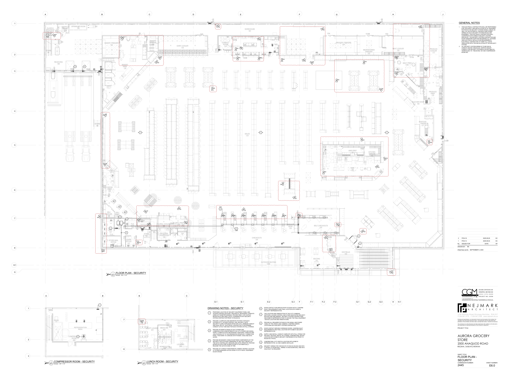

# PCN-037 - CCTV Camera Locations

**Source**: `PCN-037 - CCTV Camera Locations.pdf`  
**Pages**: 3  
**Extracted**: 2026-01-09 18:32:45

---

## Page 1

PROPOSED CHANGE NOTICE

2445-37

 
No work is to be done before this matter is finalized and a "Change Order" is issued.  This copy to remain with your office.  Do not return.  
Contractor to submit signed letter with price including cost breakdown and change (if any) to construction schedule.  Authority having 
Jurisdiction shall advise of any objections. 
 
 
 
 
TO: 
QUOREX CONSTRUCTION SERVICES LTD. 
 
 
 
1630A 8th Avenue,  
 
 
Regina, SK S4R 1E5 
 
 
RE: 
AURORA FOOD STORE 
 
 
2000 ANAQUOD ROAD 
 
 
REGINA, SK 
 
 
Commission No. 2445 
 
 
DATE: 
September 8, 2025 
 
 
PAGES: 
3 (including cover) 
 
 
RE: 
CCTV Camera Locations 
 
 
1.0 
ELECTRICAL 
 
 
.1 
Refer to attached Electrical PCN #18, dated September 8, 2025.  
 
 
(1 page text, 1 full size drawing E8.0). 
 
 
 
 
 
 
 
 
 
 
 
 
 
 
 
 
 
 
Distribution: 
Sobeys Inc. – Jeff Craig 
jeff.craig@sobeys.com 
Sobeys Inc. – Shanwen Hsu 
shanwen.hsu@sobeys.com 
Quorex Construction Services Ltd. – Chris Walbaum 
c.walbaum@quorex.ca 
Quorex Construction Services Ltd. – Dustin Williamson 
d.williamson@quorex.ca 
Lavergne Draward & Associates Inc. – Charles Koop 
ckoop@ldaeng.ca 
CGM Engineering – Justin Albo 
justin_albo@cgmeng.ca 
CGM Engineering – Tony Mitousis 
tony_mitousis@cgmeng.ca 
CGM Engineering – Brendan Simpson 
brendan_simpson@cgmeng.ca 
 
 
 
 
 
 
 
 
Principal 
Kevin Fawley, SAA MRAIC 

## Page 2

 
ELECTRICAL PROPOSED CHANGE NOTICE #18 
 
24-258 
 

Project: 
Aurora Grocery Store 
 
2000 Anaquod Road, Regina, Saskatchewan 
Subject: 
Revised CCTV Camera Layout 
Date: 
2025.09.08 
 

Subject: 
Revised CCTV Camera Layout 
References: 
Electrical Drawing E6.0 – Floor Plan - Security 
 

1. 
Refer to attached drawing E6.0 for revised CCTV camera layout. Coordinate exact requirements 
with owner’s security provider.  

1.1. An additional thirteen(13) camera locations are added on top of the original forty-one(41) 

camera locations. 

2. 
Data cabling within sales area associated with the CCTV cameras will not be run in conduit. Provide 
credit to owner’s for the removal of conduit from the scope of work within the sales area associated 
with the CCTV cameras.  

Brendan Simpson, E.I.T. 
- 1 - 

200-698 Corydon Avenue     Winnipeg, Manitoba     R3M 0X9     204-272-3255     www.cgmeng.ca 

## Page 3

8.1

3

6

7

8

1

2

4

5

9

1

2

3

A
B
C
D
E
F
G
H
J

A
B

STAIRS
#2

GLASS &
ORGANICS
RECYCLE
194

N
 COMPRESSOR ROOM - SECURITY

TYP.

10

300A

DN
21R

SCALE:
E6.0

2
SCALE:
E6.0

DC
DC
DC
DC

190D

EMERGENCY
CONDENSING
UNIT

RECEIVING
190

CM

194

1/8" = 1'-0"

193

CLEAN-UP
AREA
193

COMPRESSOR
ROOM
300

190C
190B

SPRINKLER ROOM
192

REFRIGERATION
RACK

300B

9
9

TD
TD

DC
6

MS
C

STAIRS
#3

WP

190A

1

K

ES

WP

BAKERY FREEZER
131

CM

CM

DELI
COOLER
121

CHEESE
PREP
123

N
 FLOOR PLAN - SECURITY

IT
ROOM
114
DEP.
MAN.
113

STORE MAN.
OFFICE
112

113

1

SCALE:
E6.0

1

DELI
PREP
120

11

131

1/8" = 1'-0"

BAKERY
PREP
130

CM

114

112

7

8

LEARN
OFFICE
111

5

12

FILE
MAN
115

111

115

116

B
C

FLORAL COOLER
109
CASH OFFICE
116

CM

N
 LUNCH ROOM - SECURITY

130

CM

ES
DC

7
7

CM

C

3

STAFF
117

132

118

CM

STAFF LOUNGE
201

1.0 kW
1.0 kW

CM

MS

BAKERY
COOLER
132

STAIRS
#1

1/8" = 1'-0"

UP
21R

CM

109B

UNIVERSAL
WASHROOM
106

WOMEN'S WR
202

CM

MEN'S WR
203

110

HALL
205

C

DC

ES
C

106

203

202

109A

WASHROOM
105
JANITOR
107

FLORAL PREP
108

107

DAIRY COOLER
133

LOCKERS
204

DN

SN

CM

105

CM

K

104

DC

WP

ES

C

133

GB
GB
GB
GB

SS
DC

DRAWING NOTES - SECURITY

1

2

3

4

5

191A

PROVIDE NECESSARY CONDUITS BETWEEN COMPONENTS OF THE
SECURITY GATE SYSTEM COMPRISING OF (BUT NOT LIMITED TO)
THE GATE CONTROLLER, SENSORS AND GATE OPERATOR. PROVIDE
INTERLOCK WITH FIRE ALARM SYSTEM TO AUTOMATICALLY
RELEASE THE GATE IN CASE OF FIRE.

PROVIDE 3/4" CONDUIT FROM REMOTE CAMERA VIEWING LOCATION
AT STORES MANAGER OFFICE DOWN TO CCTV RACK / EQUIPMENT
IN DATA ROOM.

PROPOSED LOCATION OF SECURITY EQUIPMENT PANEL AND
ACCESS CONTROLLER POINT. PROVIDE ALL NECESSARY CONDUITS
USING 3/4" DIAMETER MINIMUM. PROVIDE ONE(1) 120V DUPLEX
RECEPTACLE AND ONE(1) DATA. COORDINATE WITH SECURITY
SYSTEM CONTRACTOR PRIOR TO ROUGH-IN.

PROVIDE A COMPLETE AND SEPARATE PATHWAY FOR EACH
SYSTEM (CCTV, ACCESS CONTROL, EAS, SECURITY GATE,
SECURITY ALARM, INTRUSION DETECTION, ETC). MINIMUM CONDUIT
SIZE SHALL BE 3/4". ELECTRICAL CONTRACTOR TO DETERMINE
CONDUIT LAYOUT AND SIZE FOR EACH SYSTEM C/W PULL STRINGS.

PROVIDE AFTERSETS FROM U/F DUCT POWER AND
COMMUNICATION COMPARTMENTS FOR CCTV POWER AND SIGNAL
SUPPLY COMPLETE WITH NECESSSARY ADAPTERS, CONDUITS AND
JUNCTION BOX UP TO THE DESIGNATED INTERFACE / CONNECTION
POINT. THIS WORK TO COINCIDE WITH POWER, VOICE AND DATA
SCOPE.

CM

D.1
E.1
E.2
F
F.3
G.1
H
F.1
G.2

119C

CM

141A

TYP.

DC

8

CONSULT
ROOM
141

CM
CM
CM
CM
CM
CM
CM

141B

140A
140B
140C

TYP.

3

CM

CM

CM

CM

WAREHOUSE
191

SALES
119

CHECKOUTS
104

CM

CM
CM

10

11

12

7

6

7

8

9

OUTDOOR SEATING
103A

DOOR CONTACT FOR SERVICE ROOF ACCESS HATCH. CONFIRM
EXACT REQUIREMENTS AND FINAL LOCATION WITH SOBEYS
SECURITY REPRESENTATIVE.

DOOR CONTACT SERVING OVERHEAD DOORS. CONFIRM EXACT
REQUIREMENTS AND FINAL LOCATION WITH SOBEYS SECURITY
REPRESENTATIVE.

SUPPLY AND INSTALL CONDUIT COMPLETE WITH PULL STRING FOR
SECURITY DEVICES. INSTALL BY OTHERS. CONFIRM FINAL DEVICE
LOCATION WITH SOBEYS SECURITY REPRESENTATIVE PRIOR TO
ROUGH-IN.TYPICAL.

CONFIRM FINAL CCTV SWITCH LOCATION WITH SOBEYS
REPRESENTATIVE, GC AND CAMERA INSTALLER.

THE LOCATION AND ORIENTATION OF THE CCTV CAMERAS,
SWITCHES, ACCESS CONTROL AND OTHER ASSOCIATED SECURITY
DEVICES ARE PRELIMINARY. SECURITY SYSTEM CONTRACTORS
AND SOBEYS REPRESENTATIVES TO DECIDE THE FINAL EQUIPMENT
/ DEVICE LOCATION AND ORIENTATIONS.

PROVIDE ALL REQUIRED PATHWAYS FOR SIGNAL AND POWER
CABLE OF THE VISION LANE CAMERAS. CONFIRM CAMERA
LOCATIONS WITH SECURITY SYSTEM CONTRACTOR.

SECURITY WIRING FOR CHECKOUTS TO RUN IN CEILING AND INTO
'IT ROOM 112' ROOM WALL. WIRING TO RUN DOWN WALL AND INTO
WALK DUCT AS REQUIRED.

140D

DC

MS

K

142

CM

SERVICE
DESK
103

E.3

CM

CM

MS

CM
CM

119D

SEATING
101

SELF CHECKOUTS
102

GB
MS

G.3
F.2
H.1

CM

CM

CM

153B
154

100B

CM

GROCERY FREEZER
154

CM

CM

100A

DC
DC
DC
DC

VESTIBULE
100

100C

R

HMR PREP
181

HMR
180

2

4

182

CM

MEAT/KITCHEN
FREEZER
153

CM

CM

KITCHEN
COOLER
182

SS
DC

CM

191B

CM

153A

152

CM

WP

MEAT COOLER
152

CM

CM

151A

MEAT PREP
151

151B

BUTCHER SHOP
150

SEAFOOD
PREP
137

CM

171

161

CM

PRODUCE
PREP
170

PRODUCE
COOLER
171

CM

162

SEAFOOD
COOLER
162

170

DC

SS

119B

2-54 Adelaide Street Winnipeg Manit
a
ob
R3A 0V7
 P 204 947 3775
 F 204 947 3789
www.nejmark.mb.ca

AURORA GROCERY
STORE
2000 ANAQUOD ROAD
REGINA, SASKATCHEWAN

PROJECT TITLE:

DRAWN BY:

PRINTING DATE:

No.     ISSUED FOR                                      DATE                   BY

Drawings and specifications, as instruments of service are the property of the Architect, the
copyright in the same being reserved to them.  No reproduction may be made without the
permission of the architects, and when made, must bear their names.  All prints to be returned.

FLOOR PLAN -
SECURITY

2445

COMMISSION NUMBER:
SHEET NUMBER:

The contractor is to verify dimensions and date noted herein with conditions on the site and is
held responsible for reporting discrepancy to the Architect for adjustment.

SHEET TITLE:

1

KC
2025.09.05
PCN-18
2

1.
THE ELECTRICAL CONTRACTOR SHALL BE RESPONSIBLE
FOR THE SUPPLY AND INSTALLATION OF ALL REQUIRED
PATHWAYS FOR SECURITY SYSTEM SIGNAL CABLES AS
WELL AS THE PATHWAYS, CONTROLS AND POWER
WIRING OF EACH SECURITY SYSTEM DEVICE AND
EQUIPMENT. THE ELECTRICAL CONTRACTOR SHALL
COORDINATE WITH SOBEYS' SECURITY SYSTEM
SPECIALIST, THE SECURITY SYSTEM CONTRACTOR AND
DOOR HARDWARE SUPPLIER REGARDING ALL SYSTEMS
AND ELECTRICAL INSTALLATION REQUIREMENTS.
ELECTRICAL CONTRACTOR TO CARRY ALL COSTS
ASSOCIATED WITH THE INSTALLATION OF THE SECURITY
SYSTEM.
2.
ALL SECURITY SYSTEM WIRING IS TO BE RUN IN
CONDUIT AND BE CONCEALED. SURFACE MOUNT
CONDUIT FOR SECURITY SYSTEMS IS ACCEPTABLE IN
'WAREHOUSE 191', 'RECEIVING 190' AND 'COMPRESSOR
ROOM 300'.

GENERAL NOTES

KC
2025.09.04
PCN-13

© 2024 CGM ENGINEERING LTD.
THESE DRAWINGS ARE THE SOLE PROPERTY OF CGM ENGINEERING LTD. AND SHALL NOT
BE REPRODUCED WITHOUT WRITTEN CONSENT. THESE DRAWINGS SHALL NOT BE SCALED.

ENGINEERING LTD.

BS

N E J M A R K
A
R
C
H
I
T
E
C
T

SEPTEMBER 5, 2025

PROJECT NO: 24258

( 2 0 4 )  2 7 2 - 3 2 5 5

200-698 CORYDON AVE

WINNIPEG, MB R3M 0X9

E6.0

