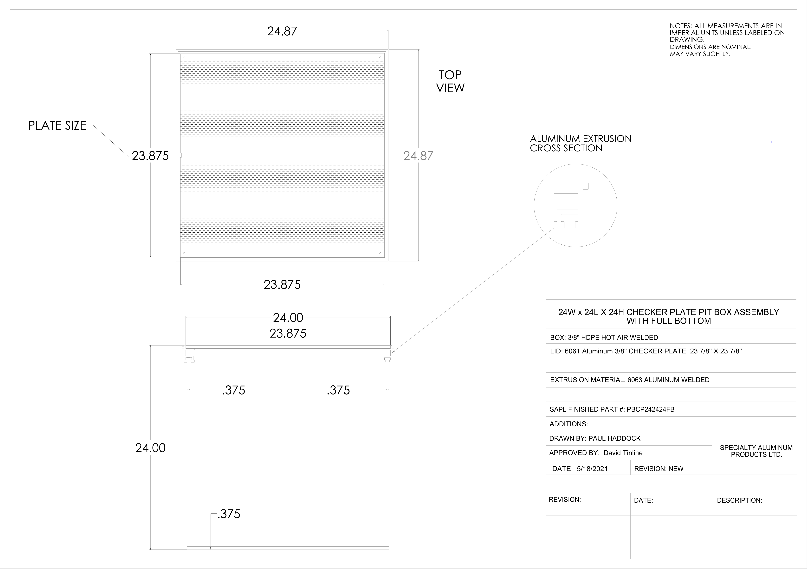

# SD# 011 - Refrigeration Pits

**Source**: `SD# 011 - Refrigeration Pits.pdf`  
**Pages**: 2  
**Extracted**: 2026-01-09 18:32:47

---

## Page 1

1630 8th Avenue 
 ■ 
Regina, Saskatchewan S4R 1E5     ■ 
Bus: (306) 761-2222 
Fax: (306) 761-2300 
 
 
 
 
 
 
Shop Drawing / Product Data Submittal Form  

Project: 
2096 – Aurora Food Store;  Regina, Saskatchewan 
General Contractor: 
Quorex Construction Services Ltd. 
Attention: 
Kevin Fawley, Nejmark 
Subcontractor / Supplier: 
Specialty Aluminum 
Products Ltd. 

Submittal No.: 
SD# 011 
Date Submitted:   
April 8, 2025 
Review By:  
Chris Walbaum 
 

Spec Section Number  
Description  
Manufacturer  
11 94 00; A7.0; S1.3 
Refrigeration Pits 
specialty aluminum 
 
 
 
 

Additional Comments 
 

1) Refrigeration pits do not have liner securing rods that can be cast in concrete, and an aluminum frame that 

can be adjustable upward as per details drawings A7.0 and S1.3.  Manufacturer was specified in section 11 94 
00 in the project manual.  Consultants to confirm if this is accpetable.  
2) Manufacturer method for install: 

1. Install refrigeration pits on a granular base to set the height and location. 
2. Once the pit is set, screws can be screwed into the side of the pit before pouring concrete so that the 
pit won’t move in the concrete. 
3. Pour concrete around the pit. 
4. Remove the frame. 
 
 

Review Stamps  
General Contractor – Quorex Construction Services Ltd.  
Consultant 
 
 
 
 
 
 
 
 
 
 
 
 
 
 
 
 
 
 
 
 
 

SHOP DRAWING REVIEW

THIS REVIEW IS FOR THE SOLE
PURPOSE OF DETERMINING GENERAL
COMPLIANCE WITH THE CONTRACT
DOCUMENTS ONLY.

REVIEWED 

REVIEWED AS NOTED 

REVISE AND RESUBMIT

REVIEW BY: Chris Walbaum 

DATE: April 8, 2025

SIGNED:

## Page 2

NOTES: ALL MEASUREMENTS ARE IN 
IMPERIAL UNITS UNLESS LABELED ON 
DRAWING.

24.87

DIMENSIONS ARE NOMINAL.
MAY VARY SLIGHTLY.

TOP
VIEW

PLATE SIZE

ALUMINUM EXTRUSION
CROSS SECTION 

23.875

24.87

23.875

24W x 24L X 24H CHECKER PLATE PIT BOX ASSEMBLY 
WITH FULL BOTTOM

24.00

23.875

BOX: 3/8" HDPE HOT AIR WELDED

LID: 6061 Aluminum 3/8" CHECKER PLATE  23 7/8" X 23 7/8"

EXTRUSION MATERIAL: 6063 ALUMINUM WELDED 

.375

.375

SAPL FINISHED PART #: PBCP242424FB

ADDITIONS:

DRAWN BY: PAUL HADDOCK

24.00

SPECIALTY ALUMINUM     
PRODUCTS LTD.

APPROVED BY:  David Tinline

REVISION: NEW

DATE:  5/18/2021

REVISION:
DATE:
DESCRIPTION:

.375

